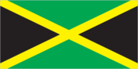
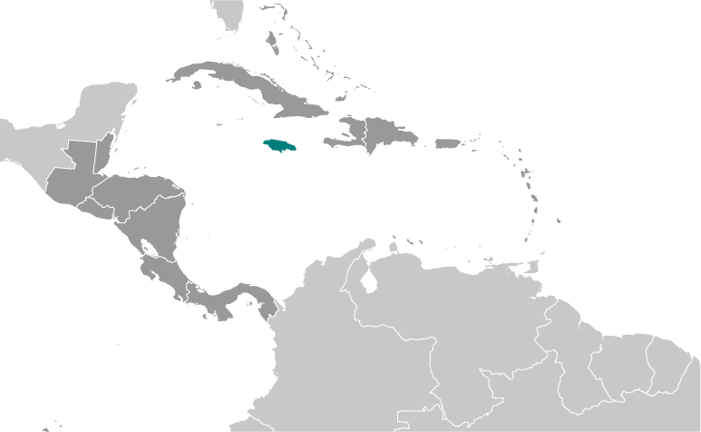
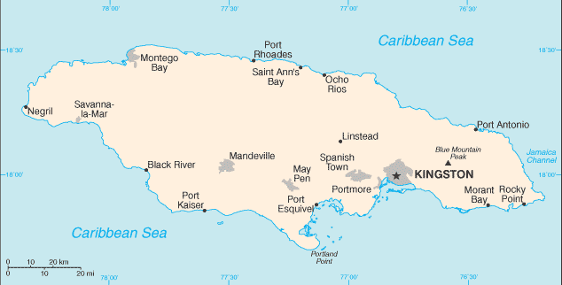

# Jamaica

## Introduction

**_Background:_**   
The island - discovered by Christopher COLUMBUS in 1494 - was settled by the Spanish early in the 16th century. The native Taino, who had inhabited Jamaica for centuries, were gradually exterminated and replaced by African slaves. England seized the island in 1655 and established a plantation economy based on sugar, cocoa, and coffee. The abolition of slavery in 1834 freed a quarter million slaves, many of whom became small farmers. Jamaica gradually increased its independence from Britain. In 1958 it joined other British Caribbean colonies in forming the Federation of the West Indies. Jamaica gained full independence when it withdrew from the Federation in 1962. Deteriorating economic conditions during the 1970s led to recurrent violence as rival gangs affiliated with the major political parties evolved into powerful organized crime networks involved in international drug smuggling and money laundering. Violent crime, drug trafficking, and poverty pose significant challenges to the government today. Nonetheless, many rural and resort areas remain relatively safe and contribute substantially to the economy.

## Geography

**_Location:_**   
Caribbean, island in the Caribbean Sea, south of Cuba

**_Geographic coordinates:_**   
18 15 N, 77 30 W

**_Map references:_**   
Central America and the Caribbean

**_Area:_**   
**total:** 10,991 sq km   
**land:** 10,831 sq km   
**water:** 160 sq km

**_Area - comparative:_**   
slightly smaller than Connecticut

**_Land boundaries:_**   
0 km

**_Coastline:_**   
1,022 km

**_Maritime claims:_**   
measured from claimed archipelagic straight baselines   
**territorial sea:** 12 nm   
**contiguous zone:** 24 nm   
**exclusive economic zone:** 200 nm   
**continental shelf:** 200 nm or to edge of the continental margin

**_Climate:_**   
tropical; hot, humid; temperate interior

**_Terrain:_**   
mostly mountains, with narrow, discontinuous coastal plain

**_Elevation extremes:_**   
**lowest point:** Caribbean Sea 0 m   
**highest point:** Blue Mountain Peak 2,256 m

**_Natural resources:_**   
bauxite, gypsum, limestone

**_Land use:_**   
**arable land:** 10.92%   
**permanent crops:** 9.1%   
**other:** 79.98% (2011)

**_Irrigated land:_**   
252.2 sq km (2003)

**_Total renewable water resources:_**   
9.4 cu km (2011)

**_Freshwater withdrawal (domestic/industrial/agricultural):_**   
**total:** 0.93 cu km/yr (32%/16%/52%)   
**per capita:** 369.9 cu m/yr (2009)

**_Natural hazards:_**   
hurricanes (especially July to November)

**_Environment - current issues:_**   
heavy rates of deforestation; coastal waters polluted by industrial waste, sewage, and oil spills; damage to coral reefs; air pollution in Kingston from vehicle emissions

**_Environment - international agreements:_**   
**party to:** Biodiversity, Climate Change, Climate Change-Kyoto Protocol, Desertification, Endangered Species, Hazardous Wastes, Law of the Sea, Marine Dumping, Marine Life Conservation, Ozone Layer Protection, Ship Pollution, Wetlands   
**signed, but not ratified:** none of the selected agreements

**_Geography - note:_**   
strategic location between Cayman Trench and Jamaica Channel, the main sea lanes for the Panama Canal

## People and Society

**_Nationality:_**   
**noun:** Jamaican(s)   
**adjective:** Jamaican

**_Ethnic groups:_**   
black 92.1%, mixed 6.1%, East Indian 0.8%, other 0.4%, unspecified 0.7% (2011 est.)

**_Languages:_**   
English, English patois

**_Religions:_**   
Protestant 64.8% (includes Seventh Day Adventist 12.0%, Pentecostal 11.0%, Other Church of God 9.2%, New Testament Church of God 7.2%, Baptist 6.7%, Church of God in Jamaica 4.8%, Church of God of Prophecy 4.5%, Anglican 2.8%, United Church 2.1%, Methodist 1.6%, Revived 1.4%, Brethren .9%, and Moravian .7%), Roman Catholic 2.2%, Jehovah's Witness 1.9%, Rastafarian 1.1%, other 6.5%, none 21.3%, unspecified 2.3% (2011 est.)

**_Population:_**   
2,930,050 (July 2014 est.)

**_Age structure:_**   
**0-14 years:** 28.4% (male 423,855/female 409,651)   
**15-24 years:** 21.7% (male 319,291/female 316,773)   
**25-54 years:** 36.4% (male 525,288/female 542,015)   
**55-64 years:** 5.6% (male 79,875/female 84,562)   
**65 years and over:** 7.7% (male 102,377/female 126,363) (2014 est.)

**_Dependency ratios:_**   
**total dependency ratio:** 52.6 %   
**youth dependency ratio:** 40.5 %   
**elderly dependency ratio:** 12.2 %   
**potential support ratio:** 8.2 (2014 est.)

**_Median age:_**   
**total:** 24.9 years   
**male:** 24.4 years   
**female:** 25.4 years (2014 est.)

**_Population growth rate:_**   
0.69% (2014 est.)

**_Birth rate:_**   
18.41 births/1,000 population (2014 est.)

**_Death rate:_**   
6.67 deaths/1,000 population (2014 est.)

**_Net migration rate:_**   
-4.83 migrant(s)/1,000 population (2014 est.)

**_Urbanization:_**   
**urban population:** 52% of total population (2011)   
**rate of urbanization:** 0.51% annual rate of change (2010-15 est.)

**_Major urban areas - population:_**   
KINGSTON (capital) 571,000 (2011)

**_Sex ratio:_**   
**at birth:** 1.05 male(s)/female   
**0-14 years:** 1.04 male(s)/female   
**15-24 years:** 1.01 male(s)/female   
**25-54 years:** 0.97 male(s)/female   
**55-64 years:** 0.98 male(s)/female   
**65 years and over:** 0.81 male(s)/female   
**total population:** 0.98 male(s)/female (2014 est.)

**_Mother's mean age at first birth:_**   
21.2   
**note:** median age at first birth among women 25-29 (2008 est.)

**_Maternal mortality rate:_**   
110 deaths/100,000 live births (2010)

**_Infant mortality rate:_**   
**total:** 13.69 deaths/1,000 live births   
**male:** 14.27 deaths/1,000 live births   
**female:** 13.08 deaths/1,000 live births (2014 est.)

**_Life expectancy at birth:_**   
**total population:** 73.48 years   
**male:** 71.87 years   
**female:** 75.17 years (2014 est.)

**_Total fertility rate:_**   
2.05 children born/woman (2014 est.)

**_Contraceptive prevalence rate:_**   
69% (2002/03)

**_Health expenditures:_**   
5.2% of GDP (2010)

**_Physicians density:_**   
0.41 physicians/1,000 population (2008)

**_Hospital bed density:_**   
1.8 beds/1,000 population (2010)

**_Drinking water source:_**   
**improved:** urban: 97.1% of population; rural: 88.8% of population; total: 93.1% of population   
**unimproved:** urban: 2.9% of population; rural: 11.2% of population; total: 6.9% of population (2012 est.)

**_Sanitation facility access:_**   
**improved:** urban: 78.4% of population; rural: 82.2% of population; total: 80.2% of population   
**unimproved:** urban: 21.6% of population; rural: 17.8% of population; total: 19.8% of population (2012 est.)

**_HIV/AIDS - adult prevalence rate:_**   
1.7% (2012 est.)

**_HIV/AIDS - people living with HIV/AIDS:_**   
28,400 (2012 est.)

**_HIV/AIDS - deaths:_**   
1,300 (2012 est.)

**_Obesity - adult prevalence rate:_**   
24.1% (2008)

**_Children under the age of 5 years underweight:_**   
3.2% (2010)

**_Education expenditures:_**   
6.1% of GDP (2012)

**_Literacy:_**   
**definition:** age 15 and over has ever attended school   
**total population:** 87%   
**male:** 82.1%   
**female:** 91.8% (2011 est.)

**_School life expectancy (primary to tertiary education):_**   
**total:** 12 years   
**male:** 12 years   
**female:** 12 years (2002)

**_Child labor - children ages 5-14:_**   
**total number:** 38,516   
**percentage:** 6 % (2005 est.)

**_Unemployment, youth ages 15-24:_**   
**total:** 34%   
**male:** 27.1%   
**female:** 42.6% (2012)

## Government

**_Country name:_**   
**conventional long form:** none   
**conventional short form:** Jamaica

**_Government type:_**   
constitutional parliamentary democracy and a Commonwealth realm

**_Capital:_**   
**name:** Kingston   
**geographic coordinates:** 18 00 N, 76 48 W   
**time difference:** UTC-5 (same time as Washington, DC, during Standard Time)

**_Administrative divisions:_**   
14 parishes; Clarendon, Hanover, Kingston, Manchester, Portland, Saint Andrew, Saint Ann, Saint Catherine, Saint Elizabeth, Saint James, Saint Mary, Saint Thomas, Trelawny, Westmoreland   
**note:** for local government purposes, Kingston and Saint Andrew were amalgamated in 1923 into the present single corporate body known as the Kingston and Saint Andrew Corporation

**_Independence:_**   
6 August 1962 (from the UK)

**_National holiday:_**   
Independence Day, 6 August (1962)

**_Constitution:_**   
several previous (preindependence); latest drafted 1961-62, submitted to British Parliament 24 July 1962, entered into force 6 August 1962 (at independence); amended many times, last in 2011 (2011)

**_Legal system:_**   
common law system based on the English model

**_International law organization participation:_**   
has not submitted an ICJ jurisdiction declaration; non-party state to the ICCt

**_Suffrage:_**   
18 years of age; universal

**_Executive branch:_**   
**chief of state:** Queen ELIZABETH II (since 6 February 1952); represented by Governor General Dr. Patrick L. ALLEN (since 26 February 2009)   
**head of government:** Prime Minister Portia SIMPSON MILLER (since 5 January 2012)   
**cabinet:** Cabinet is appointed by the governor general on the advice of the prime minister   
**elections:** the monarchy is hereditary; governor general appointed by the monarch on the recommendation of the prime minister; following legislative elections, the leader of the majority party or the leader of the majority coalition in the House of Representatives is appointed prime minister by the governor general

**_Legislative branch:_**   
bicameral Parliament consists of the Senate (a 21-member body appointed by the governor general on the recommendations of the prime minister and the leader of the opposition; ruling party is allocated 13 seats, and the opposition is allocated 8 seats) and the House of Representatives (63 seats; members elected by popular vote to serve five-year terms)   
**elections:** last held on 29 December 2011 (next to be held no later than December 2016)   
**election results:** percent of vote by party - PNP 53.3%, JLP 46.6%; seats by party - PNP 41, JLP 22

**_Judicial branch:_**   
**highest court(s):** Court of Appeal (consists of president of the court and a minimum of 4 judges; Supreme Court (40 judges organized in specialized divisions); note - appeals beyond Jamaica's highest courts are submitted to the Judicial Committee of the Privy Council (in London) rather than to the Caribbean Court of Justice (the appellate court implemented for member states of the Caribbean Community)   
**judge selection and term of office:** chief justice of the Supreme Court and president of the Court of Appeal appointed by the governor-general on the advice of the prime minister; other judges of both courts appointed by the governor-general on the advice of the Judicial Service Commission; judges of both courts serve till age 70   
**subordinate courts:** resident magistrate courts, district courts, and petty sessions courts

**_Political parties and leaders:_**   
Jamaica Labor Party or JLP [Andrew HOLNESS]   
People's National Party or PNP [Portia SIMPSON-MILLER]   
National Democratic Movement or NDM [Michael WILLIAMS]

**_Political pressure groups and leaders:_**   
New Beginnings Movement or NBM   
Rastafarians

**_International organization participation:_**   
ACP, AOSIS, C, Caricom, CDB, CELAC, FAO, G-15, G-77, IADB, IAEA, IBRD, ICAO, ICRM, IDA, IFAD, IFC, IFRCS, IHO, ILO, IMF, IMO, Interpol, IOC, IOM, ISO, ITSO, ITU, LAES, MIGA, NAM, OAS, OPANAL, OPCW, Petrocaribe, UN, UNCTAD, UNESCO, UNIDO, UNITAR, UNWTO, UPU, WCO, WFTU (NGOs), WHO, WIPO, WMO, WTO

**_Diplomatic representation in the US:_**   
**chief of mission:** Ambassador Stephen C. VASCIANNIE (since 20 July 2012)   
**chancery:** 1520 New Hampshire Avenue NW, Washington, DC 20036   
**telephone:** [1] (202) 452-0660   
**FAX:** [1] (202) 452-0081   
**consulate(s) general:** Miami, New York

**_Diplomatic representation from the US:_**   
**chief of mission:** Ambassador (vacant); Charge d'Affaires a.i. Elizabeth Martinez   
**embassy:** 142 Old Hope Road, Kingston 6   
**mailing address:** P.O. Box 541, Kingston 5   
**telephone:** [1] (876) 702-6000   
**FAX:** [1] (876) 702-6001

**_Flag description:_**   
diagonal yellow cross divides the flag into four triangles - green (top and bottom) and black (hoist side and outer side); green represents hope, vegetation, and agriculture, black reflects hardships overcome and to be faced, and yellow recalls golden sunshine and the island's natural resources

**_National symbol(s):_**   
green-and-black streamertail (bird)

**_National anthem:_**   
**name:** "Jamaica, Land We Love"   
**lyrics/music:** Hugh Braham SHERLOCK/Robert Charles LIGHTBOURNE   
**note:** adopted 1962

## Economy

**_Economy - overview:_**   
The Jamaican economy is heavily dependent on services, which accounts for nearly 80% of GDP. The country continues to derive most of its foreign exchange from tourism, remittances, and bauxite/alumina. Remittances and tourism each account for 30% of GDP, while bauxite/alumina exports make up roughly 5% of GDP. The bauxite/alumina sector was most affected by the global downturn while the tourism industry and remittance flow remained resilient. Jamaica's economy faces many challenges to growth: high crime and corruption, large-scale unemployment and underemployment, and a debt-to-GDP ratio of about 140%. The attendant debt servicing cost consumes a large portion of the government's budget, limiting its ability to fund the critical infrastructure and social programs required to drive growth. Jamaica's economic growth rate in the recent past has been stagnant, averaging less than 1% per year for over 20 years. Jamaica's onerous public debt burden is largely the result of government bailouts to ailing sectors of the economy, most notably to the financial sector. In early 2010, the Jamaican Government initiated the Jamaica Debt Exchange to retire high-priced domestic bonds and reduce annual debt servicing. Despite these efforts, debt continued to be a serious concern, forcing the government to negotiate and sign a new IMF agreement in May 2013 to gain access to approximately $1 billion additional funds. As a precursor, the government instigated a second National Debt Exchange in 2012. The IMF deal requires the government to reform its tax system, eliminate discretionary tax exemptions and waivers, and achieve an annual surplus of 7.5%, excluding debt payments, to reduce its debt below 100% of GDP by 2020. The SIMPSON-MILLER administration now faces the difficult prospect of having to achieve fiscal discipline to maintain debt payments while simultaneously attacking a serious crime problem that is hampering economic growth. High unemployment exacerbates the crime problem, including gang violence that is fueled by the drug trade. The IMF approved a four-year $932 million Extended Fund Facility arrangement for Jamaica in May 2013.

**_GDP (purchasing power parity):_**   
$25.13 billion (2013 est.)   
$25.03 billion (2012 est.)   
$25.15 billion (2011 est.)   
**note:** data are in 2013 US dollars

**_GDP (official exchange rate):_**   
$14.39 billion (2013 est.)

**_GDP - real growth rate:_**   
0.4% (2013 est.)   
-0.5% (2012 est.)   
1.4% (2011 est.)

**_GDP - per capita (PPP):_**   
$9,000 (2013 est.)   
$9,000 (2012 est.)   
$9,100 (2011 est.)   
**note:** data are in 2013 US dollars

**_Gross national saving:_**   
10.8% of GDP (2013 est.)   
8.7% of GDP (2012 est.)   
7% of GDP (2011 est.)

**_GDP - composition, by end use:_**   
**household consumption:** 86.6%   
**government consumption:** 15.7%   
**investment in fixed capital:** 21.2%   
**investment in inventories:** 0.5%   
**exports of goods and services:** 34.5%   
**imports of goods and services:** -58.4%; (2013 est.)

**_GDP - composition, by sector of origin:_**   
**agriculture:** 6.5%   
**industry:** 29.4%   
**services:** 64.1% (2013 est.)

**_Agriculture - products:_**   
sugarcane, bananas, coffee, citrus, yams, ackees, vegetables; poultry, goats, milk; shellfish

**_Industries:_**   
tourism, bauxite/alumina, agricultural-processing, light manufactures, rum, cement, metal, paper, chemical products, telecommunications

**_Industrial production growth rate:_**   
1.5% (2013 est.)

**_Labor force:_**   
1.261 million (2013 est.)

**_Labor force - by occupation:_**   
**agriculture:** 17%   
**industry:** 19%   
**services:** 64% (2006)

**_Unemployment rate:_**   
16.3% (2013 est.)   
13.7% (2012 est.)

**_Population below poverty line:_**   
16.5% (2009 est.)

**_Household income or consumption by percentage share:_**   
**lowest 10%:** 2.1%   
**highest 10%:** 35.8% (2004)

**_Distribution of family income - Gini index:_**   
45.5 (2004)   
37.9 (2000)

**_Budget:_**   
**revenues:** $3.826 billion   
**expenditures:** $4.088 billion (2013 est.)

**_Taxes and other revenues:_**   
26.6% of GDP (2013 est.)

**_Budget surplus (+) or deficit (-):_**   
-1.8% of GDP (2013 est.)

**_Public debt:_**   
123.6% of GDP (2013 est.)   
132.9% of GDP (2012 est.)

**_Fiscal year:_**   
1 April - 31 March

**_Inflation rate (consumer prices):_**   
9.4% (2013 est.)   
6.9% (2012 est.)

**_Central bank discount rate:_**   
2% (31 December 2010 est.)   
NA% (31 December 2009 est.)

**_Commercial bank prime lending rate:_**   
17% (31 December 2013 est.)   
17.63% (31 December 2012 est.)

**_Stock of narrow money:_**   
$1.671 billion (31 December 2013 est.)   
$1.723 billion (31 December 2012 est.)

**_Stock of broad money:_**   
$5.928 billion (31 December 2013 est.)   
$6.239 billion (31 December 2012 est.)

**_Stock of domestic credit:_**   
$7.197 billion (31 December 2013 est.)   
$7.351 billion (31 December 2012 est.)

**_Market value of publicly traded shares:_**   
$6.39 billion (31 December 2012 est.)   
$7.223 billion (31 December 2011)   
$6.626 billion (31 December 2010 est.)

**_Current account balance:_**   
-$1.583 billion (2013 est.)   
-$1.905 billion (2012 est.)

**_Exports:_**   
$1.775 billion (2013 est.)   
$1.747 billion (2012 est.)

**_Exports - commodities:_**   
alumina, bauxite, sugar, rum, coffee, yams, beverages, chemicals, wearing apparel, mineral fuels

**_Exports - partners:_**   
US 48%, Canada 7.2%, Slovenia 4.2%, Netherlands 4.1%, UAE 4.1% (2012)

**_Imports:_**   
$5.559 billion (2013 est.)   
$5.905 billion (2012 est.)

**_Imports - commodities:_**   
food and other consumer goods, industrial supplies, fuel, parts and accessories of capital goods, machinery and transport equipment, construction materials

**_Imports - partners:_**   
US 36.1%, Venezuela 15.6%, Trinidad and Tobago 10.8%, China 4.8%, Mexico 4% (2012)

**_Reserves of foreign exchange and gold:_**   
$1.9 billion (31 December 2013 est.)   
$1.981 billion (31 December 2012 est.)

**_Debt - external:_**   
$13.82 billion (31 December 2013 est.)   
$14.09 billion (31 December 2012 est.)

**_Exchange rates:_**   
Jamaican dollars (JMD) per US dollar -   
99.83 (2013 est.)   
88.751 (2012 est.)   
87.196 (2010 est.)   
87.89 (2009)   
72.236 (2008)

## Energy

**_Electricity - production:_**   
3.957 billion kWh (2010 est.)

**_Electricity - consumption:_**   
3.066 billion kWh (2010 est.)

**_Electricity - exports:_**   
0 kWh (2012 est.)

**_Electricity - imports:_**   
0 kWh (2012 est.)

**_Electricity - installed generating capacity:_**   
1.175 million kW (2010 est.)

**_Electricity - from fossil fuels:_**   
94.8% of total installed capacity (2010 est.)

**_Electricity - from nuclear fuels:_**   
0% of total installed capacity (2010 est.)

**_Electricity - from hydroelectric plants:_**   
2.1% of total installed capacity (2010 est.)

**_Electricity - from other renewable sources:_**   
3% of total installed capacity (2010 est.)

**_Crude oil - production:_**   
2,120 bbl/day (2012 est.)

**_Crude oil - exports:_**   
0 bbl/day (2010 est.)

**_Crude oil - imports:_**   
22,940 bbl/day (2010 est.)

**_Crude oil - proved reserves:_**   
0 bbl (1 January 2013 est.)

**_Refined petroleum products - production:_**   
23,120 bbl/day (2010 est.)

**_Refined petroleum products - consumption:_**   
78,520 bbl/day (2011 est.)

**_Refined petroleum products - exports:_**   
0 bbl/day (2010 est.)

**_Refined petroleum products - imports:_**   
32,920 bbl/day (2010 est.)

**_Natural gas - production:_**   
0 cu m (2011 est.)

**_Natural gas - consumption:_**   
0 cu m (2010 est.)

**_Natural gas - exports:_**   
0 cu m (2011 est.)

**_Natural gas - imports:_**   
0 cu m (2011 est.)

**_Natural gas - proved reserves:_**   
0 cu m (1 January 2013 est.)

**_Carbon dioxide emissions from consumption of energy:_**   
9.557 million Mt (2011 est.)

## Communications

**_Telephones - main lines in use:_**   
265,000 (2011)

**_Telephones - mobile cellular:_**   
2.665 million (2012)

**_Telephone system:_**   
**general assessment:** fully automatic domestic telephone network   
**domestic:** the 1999 agreement to open the market for telecommunications services resulted in rapid growth in mobile-cellular telephone usage while the number of fixed-lines in use has declined; combined mobile-cellular teledensity exceeded 110 per 100 persons in 2011   
**international:** country code - 1-876; the Fibralink submarine cable network provides enhanced delivery of business and broadband traffic and is linked to the Americas Region Caribbean Ring System (ARCOS-1) submarine cable in the Dominican Republic; the link to ARCOS-1 provides seamless connectivity to US, parts of the Caribbean, Central America, and South America; the ALBA-1 fiber-optic submarine cable links Jamaica, Cuba, and Venezuela; satellite earth stations - 2 Intelsat (Atlantic Ocean) (2010)

**_Broadcast media:_**   
3 free-to-air TV stations, subscription cable services, and roughly 30 radio stations (2013)

**_Internet country code:_**   
.jm

**_Internet hosts:_**   
3,906 (2012)

**_Internet users:_**   
1.581 million (2009)

## Transportation

**_Airports:_**   
28 (2013)

**_Airports - with paved runways:_**   
**total:** 11   
**2,438 to 3,047 m:** 2   
**914 to 1,523 m:** 4   
**under 914 m:** 5 (2013)

**_Airports - with unpaved runways:_**   
**total:** 17   
**914 to 1,523 m:** 1   
**under 914 m:** 16 (2013)

**_Roadways:_**   
**total:** 22,121 km (includes 44 km of expressways)   
**paved:** 16,148 km   
**unpaved:** 5,973 km (2011)

**_Merchant marine:_**   
**total:** 14   
**by type:** bulk carrier 4, cargo 5, container 4, roll on/roll off 1   
**foreign-owned:** 14 (Denmark 1, Germany 10, Greece 3) (2010)

**_Ports and terminals:_**   
**major seaport(s):** Discovery Bay (Port Rhoades), Kingston, Montego Bay, Port Antonio, Port Esquivel, Port Kaiser, Rocky Point   
**container port(s) (TEUs):** Kingston (1,724,928)

## Military

**_Military branches:_**   
Jamaica Defense Force: Ground Forces, Coast Guard, Air Wing (2010)

**_Military service age and obligation:_**   
17 1/2 is the legal minimum age for voluntary military service; no conscription (2012)

**_Manpower available for military service:_**   
**males age 16-49:** 726,263   
**females age 16-49:** 742,958 (2010 est.)

**_Manpower fit for military service:_**   
**males age 16-49:** 590,673   
**females age 16-49:** 596,414 (2010 est.)

**_Manpower reaching militarily significant age annually:_**   
**male:** 33,369   
**female:** 32,702 (2010 est.)

**_Military expenditures:_**   
0.86% of GDP (2012)   
0.92% of GDP (2011)   
0.86% of GDP (2010)

## Transnational Issues

**_Disputes - international:_**   
none

**_Illicit drugs:_**   
transshipment point for cocaine from South America to North America and Europe; illicit cultivation and consumption of cannabis; government has an active manual cannabis eradication program; corruption is a major concern; substantial money-laundering activity; Colombian narcotics traffickers favor Jamaica for illicit financial transactions

............................................................   
_Page last updated on June 20, 2014_
