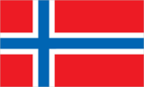
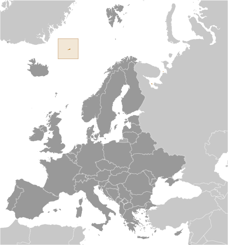
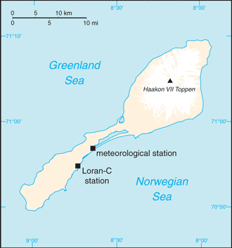

# Jan Mayen

_territory of Norway_

## Introduction

**_Background:_**   
This desolate, arctic, mountainous island was named after a Dutch whaling captain who indisputably discovered it in 1614 (earlier claims are inconclusive). Visited only occasionally by seal hunters and trappers over the following centuries, the island came under Norwegian sovereignty in 1929. The long dormant Beerenberg volcano, the northernmost active volcano on earth, resumed activity in 1970 and the most recent eruption occurred in 1985.

## Geography

**_Location:_**   
Northern Europe, island between the Greenland Sea and the Norwegian Sea, northeast of Iceland

**_Geographic coordinates:_**   
71 00 N, 8 00 W

**_Map references:_**   
Europe

**_Area:_**   
**total:** 377 sq km   
**land:** 377 sq km   
**water:** 0 sq km

**_Area - comparative:_**   
slightly more than twice the size of Washington, DC

**_Land boundaries:_**   
0 km

**_Coastline:_**   
124.1 km

**_Maritime claims:_**   
**territorial sea:** 4 nm   
**contiguous zone:** 10 nm   
**exclusive economic zone:** 200 nm   
**continental shelf:** 200 m depth or to the depth of exploitation

**_Climate:_**   
arctic maritime with frequent storms and persistent fog

**_Terrain:_**   
volcanic island, partly covered by glaciers

**_Elevation extremes:_**   
**lowest point:** Norwegian Sea 0 m   
**highest point:** Haakon VII Toppen on Beerenberg 2,277 m   
**note:** Beerenberg volcano has numerous peaks; the highest point on the volcano rim is named Haakon VII Toppen, after Norway's first king following the reestablishment of Norwegian independence in 1905

**_Natural resources:_**   
none

**_Land use:_**   
**arable land:** 0%   
**permanent crops:** 0%   
**other:** 100% (2011)

**_Irrigated land:_**   
0 sq km (2011)

**_Natural hazards:_**   
dominated by the volcano Beerenberg   
**volcanism:** Beerenberg (elev. 2,227 m) is Norway's only active volcano; volcanic activity resumed in 1970; the most recent eruption occurred in 1985

**_Environment - current issues:_**   
NA

**_Geography - note:_**   
barren volcanic island with some moss and grass

## People and Society

**_Population:_**   
no indigenous inhabitants   
**note:** personnel operate the Long Range Navigation (Loran-C) base and the weather and coastal services radio station

## Government

**_Country name:_**   
**conventional long form:** none   
**conventional short form:** Jan Mayen

**_Dependency status:_**   
territory of Norway; since August 1994, administered from Oslo through the county governor (fylkesmann) of Nordland; however, authority has been delegated to a station commander of the Norwegian Defense Communication Service

**_Legal system:_**   
the laws of Norway, where applicable, apply

**_Flag description:_**   
the flag of Norway is used

## Economy

**_Economy - overview:_**   
Jan Mayen is a volcanic island with no exploitable natural resources, although surrounding waters contain substantial fish stocks and potential untapped petroleum resources. Economic activity is limited to providing services for employees of Norway's radio and meteorological stations on the island.

## Communications

**_Broadcast media:_**   
a coastal radio station has been remotely operated since 1994 (2008)

## Transportation

**_Airports:_**   
1 (2013)

**_Airports - with unpaved runways:_**   
**total:** 1   
**1,524 to 2,437 m:** 1 (2013)

**_Ports and terminals:_**   
none; offshore anchorage only

## Military

**_Military - note:_**   
defense is the responsibility of Norway

## Transnational Issues

**_Disputes - international:_**   
none

............................................................   
_Page last updated on March 27, 2014_
