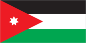
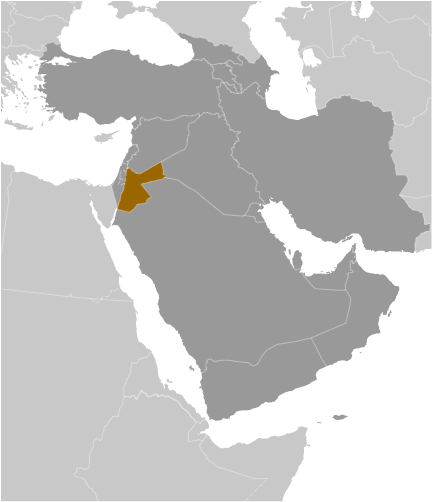
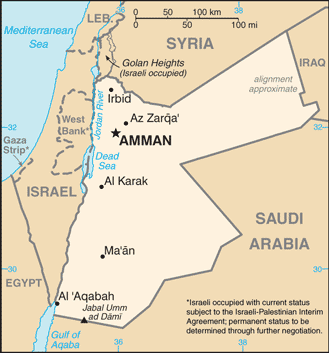

# Jordan

## Introduction

**_Background:_**   
Following World War I and the dissolution of the Ottoman Empire, the League of Nations awarded Britain the mandate to govern much of the Middle East. Britain demarcated a semi-autonomous region of Transjordan from Palestine in the early 1920s. The area gained its independence in 1946 and thereafter became The Hashemite Kingdom of Jordan. The country's long-time ruler, King HUSSEIN (1953-99), successfully navigated competing pressures from the major powers (US, USSR, and UK), various Arab states, Israel, and a large internal Palestinian population. Jordan lost the West Bank to Israel in the 1967 Six-Day War. King HUSSEIN in 1988 permanently relinquished Jordanian claims to the West Bank; in 1994 he signed a peace treaty with Israel. King ABDALLAH II, King HUSSEIN's eldest son, assumed the throne following his father's death in 1999. He implemented modest political and economic reforms, but in the wake of the "Arab Revolution" across the Middle East, Jordanians continue to press for further political liberalization, government reforms, and economic improvements. In January 2014, Jordan assumed a nonpermanent seat on the UN Security Council for the 2014-15 term.

## Geography

**_Location:_**   
Middle East, northwest of Saudi Arabia, between Israel (to the west) and Iraq

**_Geographic coordinates:_**   
31 00 N, 36 00 E

**_Map references:_**   
Middle East

**_Area:_**   
**total:** 89,342 sq km   
**land:** 88,802 sq km   
**water:** 540 sq km

**_Area - comparative:_**   
slightly smaller than Indiana

**_Land boundaries:_**   
**total:** 1,635 km   
**border countries:** Iraq 181 km, Israel 238 km, Saudi Arabia 744 km, Syria 375 km, West Bank 97 km

**_Coastline:_**   
26 km

**_Maritime claims:_**   
**territorial sea:** 3 nm

**_Climate:_**   
mostly arid desert; rainy season in west (November to April)

**_Terrain:_**   
mostly desert plateau in east, highland area in west; Great Rift Valley separates East and West Banks of the Jordan River

**_Elevation extremes:_**   
**lowest point:** Dead Sea -408 m   
**highest point:** Jabal Umm ad Dami 1,854 m

**_Natural resources:_**   
phosphates, potash, shale oil

**_Land use:_**   
**arable land:** 1.97%   
**permanent crops:** 0.95%   
**other:** 97.08% (2011)

**_Irrigated land:_**   
788.6 sq km (2004)

**_Total renewable water resources:_**   
0.94 cu km (2011)

**_Freshwater withdrawal (domestic/industrial/agricultural):_**   
**total:** 0.94 cu km/yr (31%/4%/65%)   
**per capita:** 166 cu m/yr (2005)

**_Natural hazards:_**   
droughts; periodic earthquakes

**_Environment - current issues:_**   
limited natural freshwater resources; deforestation; overgrazing; soil erosion; desertification

**_Environment - international agreements:_**   
**party to:** Biodiversity, Climate Change, Climate Change-Kyoto Protocol, Desertification, Endangered Species, Hazardous Wastes, Law of the Sea, Marine Dumping, Ozone Layer Protection, Wetlands   
**signed, but not ratified:** none of the selected agreements

**_Geography - note:_**   
strategic location at the head of the Gulf of Aqaba and as the Arab country that shares the longest border with Israel and the occupied West Bank

## People and Society

**_Nationality:_**   
**noun:** Jordanian(s)   
**adjective:** Jordanian

**_Ethnic groups:_**   
Arab 98%, Circassian 1%, Armenian 1%

**_Languages:_**   
Arabic (official), English (widely understood among upper and middle classes)

**_Religions:_**   
Muslim 97.2% (official; predominantly Sunni), Christian 2.2% (majority Greek Orthodox, but some Greek and Roman Catholics, Syrian Orthodox, Coptic Orthodox, Armenian Orthodox, and Protestant denominations), Buddhist 0.4%, Hindu 0.1%, Jewish

**_Population:_**   
7,930,491 (July 2014 est.)

**_Age structure:_**   
**0-14 years:** 35.8% (male 1,457,174/female 1,385,604)   
**15-24 years:** 20.4% (male 826,482/female 788,950)   
**25-54 years:** 35.7% (male 1,421,634/female 1,412,888)   
**55-64 years:** 4.2% (male 160,224/female 169,965)   
**65 years and over:** 5.1% (male 145,515/female 162,055) (2014 est.)

**_Dependency ratios:_**   
**total dependency ratio:** 59.4 %   
**youth dependency ratio:** 53.7 %   
**elderly dependency ratio:** 5.7 %   
**potential support ratio:** 17.4 (2014 est.)

**_Median age:_**   
**total:** 21.8 years   
**male:** 21.5 years   
**female:** 22.1 years (2014 est.)

**_Population growth rate:_**   
3.86% (2014 est.)

**_Birth rate:_**   
25.23 births/1,000 population (2014 est.)

**_Death rate:_**   
3.8 deaths/1,000 population (2014 est.)

**_Net migration rate:_**   
17.22 migrant(s)/1,000 population (2014 est.)

**_Urbanization:_**   
**urban population:** 82.7% of total population (2011)   
**rate of urbanization:** 2.17% annual rate of change (2010-15 est.)

**_Major urban areas - population:_**   
AMMAN (capital) 1.179 million (2011)

**_Sex ratio:_**   
**at birth:** 1.06 male(s)/female   
**0-14 years:** 1.05 male(s)/female   
**15-24 years:** 1.05 male(s)/female   
**25-54 years:** 1.01 male(s)/female   
**55-64 years:** 1.02 male(s)/female   
**65 years and over:** 0.95 male(s)/female   
**total population:** 1.03 male(s)/female (2014 est.)

**_Mother's mean age at first birth:_**   
24.7   
**note:** median age at first birth among women 25-29 (2012 est.)

**_Maternal mortality rate:_**   
63 deaths/100,000 live births (2010)

**_Infant mortality rate:_**   
**total:** 15.73 deaths/1,000 live births   
**male:** 16.63 deaths/1,000 live births   
**female:** 14.79 deaths/1,000 live births (2014 est.)

**_Life expectancy at birth:_**   
**total population:** 74.1 years   
**male:** 72.79 years   
**female:** 75.5 years (2014 est.)

**_Total fertility rate:_**   
3.16 children born/woman (2014 est.)

**_Contraceptive prevalence rate:_**   
59.3% (2009)

**_Health expenditures:_**   
8.4% of GDP (2011)

**_Physicians density:_**   
2.56 physicians/1,000 population (2010)

**_Hospital bed density:_**   
1.8 beds/1,000 population (2010)

**_Drinking water source:_**   
**improved:** urban: 97.3% of population; rural: 90.5% of population; total: 96.1% of population   
**unimproved:** urban: 2.7% of population; rural: 9.5% of population; total: 3.9% of population (2012 est.)

**_Sanitation facility access:_**   
**improved:** urban: 98.1% of population; rural: 98% of population; total: 98.1% of population   
**unimproved:** urban: 1.9% of population; rural: 2% of population; total: 1.9% of population (2012 est.)

**_HIV/AIDS - adult prevalence rate:_**   
less than 0.1% (2001 est.)

**_HIV/AIDS - people living with HIV/AIDS:_**   
600 (2007 est.)

**_HIV/AIDS - deaths:_**   
fewer than 500 (2003 est.)

**_Obesity - adult prevalence rate:_**   
30% (2008)

**_Children under the age of 5 years underweight:_**   
1.9% (2009)

**_Education expenditures:_**   
NA

**_Literacy:_**   
**definition:** age 15 and over can read and write   
**total population:** 95.9%   
**male:** 97.7%   
**female:** 93.9% (2011 est.)

**_School life expectancy (primary to tertiary education):_**   
**total:** 13 years   
**male:** 13 years   
**female:** 14 years (2011)

**_Unemployment, youth ages 15-24:_**   
**total:** 29.3%   
**male:** 25.2%   
**female:** 48.8% (2012)

## Government

**_Country name:_**   
**conventional long form:** Hashemite Kingdom of Jordan   
**conventional short form:** Jordan   
**local long form:** Al Mamlakah al Urduniyah al Hashimiyah   
**local short form:** Al Urdun   
**former:** Transjordan

**_Government type:_**   
constitutional monarchy

**_Capital:_**   
**name:** Amman   
**geographic coordinates:** 31 57 N, 35 56 E   
**time difference:** UTC+2 (7 hours ahead of Washington, DC, during Standard Time)   
**daylight saving time:** +1hr, begins last Friday in March; ends last Friday in October

**_Administrative divisions:_**   
12 governorates (muhafazat, singular - muhafazah); 'Ajlun, Al 'Aqabah, Al Balqa', Al Karak, Al Mafraq, 'Amman, At Tafilah, Az Zarqa', Irbid, Jarash, Ma'an, Madaba

**_Independence:_**   
25 May 1946 (from League of Nations mandate under British administration)

**_National holiday:_**   
Independence Day, 25 May (1946)

**_Constitution:_**   
previous 1928 (preindependence); latest initially adopted 28 November 1947, revised and ratified 1 January 1952; amended several times, last in 2011 (2012)

**_Legal system:_**   
mixed legal system of civil law and Islamic religious law; judicial review of legislative acts in a specially provided High Tribunal

**_International law organization participation:_**   
has not submitted an ICJ jurisdiction declaration; accepts ICCt jurisdiction

**_Suffrage:_**   
18 years of age; universal

**_Executive branch:_**   
**chief of state:** King ABDALLAH II (since 7 February 1999); Crown Prince HUSSEIN (born 28 June 1994), eldest son of King ABDALLAH II   
**head of government:** Prime Minister Abdullah NSOUR (since 11 October 2012)   
**cabinet:** Cabinet appointed by the prime minister in consultation with the monarch; note - a new cabinet was sworn in 21 August 2013 and includes 13 new ministers, enlarging the government as part of promised reforms   
**elections:** the monarchy is hereditary; prime minister appointed by the monarch

**_Legislative branch:_**   
bicameral National Assembly or Majlis al-'Umma consists of the Senate, also called the House of Notables or Majlis al-Ayan (60 seats; members appointed by the monarch to serve four-year terms) and the Chamber of Deputies, also called the House of Representatives or Majlis al-Nuwaab (150 seats; 123 members elected using the single, non-transferable vote system in multi-member districts, and 27 seats elected using a closed national list system based on proportional representation; all legislators serve four-year terms); note - the new electoral law enacted in July 2012 allocated an additional 10 seats (6 seats added to the number reserved for women, bringing the total to 15; 2 additional seats for Amman; and 1 seat each for the cities of Zarqa and Irbid; unchanged are 9 seats reserved for Christian candidates, 9 for Bedouin candidates, and 3 for Jordanians of Chechen or Circassian descent   
**elections:** Chamber of Deputies - last held on 23 January 2013 (next election 2017); note - the King dissolved the previous Chamber of Deputies in November 2012, midway through the parliamentary term   
**election results:** Chamber of Deputies - percent of vote by party - NA; seats by party - 27 elected on closed national list to include: Islamic Centrist Party 3, Nation 2, National Union 2, Stronger Jordan 2, Ahl al-Himma 1, Al-Bayyan 1, Citizenship 1, Construction 1, Cooperation 1, Dawn 1, Dignity 1, Free Voice 1, Labor and Trade 1, National Accord Youth Block 1, National Action 1, National Current 1 (member resigned in February 2013), National Unity 1, Nobel Jerusalem 1, Salvation 1, The People 1, Unified Front 1, Voice of Nation 1; other 123; note - the IAF boycotted the election

**_Judicial branch:_**   
**highest court(s):** Court of Cassation or Supreme Court (consists of 7 judges including the chief justice; 7-judge panels for important cases and 5 judge panels for most appeals cases)   
**judge selection and term of office:** chief justice appointed by the king; other judges nominated by the Higher Judicial Council and approved by the king; judge tenure NA   
**subordinate courts:** courts of appeal; magistrate courts; courts of first instance; religious courts; State Security Court

**_Political parties and leaders:_**   
Ahl al-Himma   
Al-Bayyan   
Al-Hayah Jordanian Party [Zahier AMR]   
Arab Ba'ath Socialist Party [Akram al-HIMSI]   
Ba'ath Arab Progressive Party [Fuad DABBOUR]   
Citizenship   
Construction   
Cooperation   
Dawn   
Democratic People's Party [Ablah ABU ULBAH]   
Democratic Popular Unity Party [Sa'id DIAB]   
Dignity   
Du'a Party [Muhammed ABU BAKR]   
Free Voice   
Islamic Action Front or IAF [Hamzah MANSOUR]   
Islamic Centrist Party [Muhammad al-HAJ]   
Jordanian Communist Party [Munir HAMARNAH]   
Jordanian National Party [Muna ABU BAKR]   
Jordanian United Front [Amjad al-MAJALI]   
Labor and Trade   
Nation   
National Accord Youth Block   
National Action   
National Constitution Party [Ahmad al-SHUNAQ]   
National Current Party [Abd al-Hadi al-MAJALI]   
National Movement for Direct Democracy [Muhammad al-QAQ]   
National Union   
National Unity   
Nobel Jerusalem   
Risalah Party [Hazem QASHOU]   
Salvation   
Stronger Jordan   
The Direct Democratic Nationalists Movement Party [Nash'at KHALIFAH]   
The People   
Unified Front   
United Front   
Voice of the Nation

**_Political pressure groups and leaders:_**   
15 April Movement [Mohammad SUNEID, chairman]   
24 March Movement [Mu'az al-KHAWALIDAH, Abdel Rahman HASANEIN, spokespersons]   
1952 Constitution Movement   
Anti-Normalization Committee [Hamzah MANSOUR, chairman]   
Economic and Social Association of Retired Servicemen and Veterans or ESARSV [Abdulsalam al-HASSANAT, chairman]   
Group of 36   
Higher Coordination Committee of Opposition Parties [Said DIAB]   
Higher National Committee for Military Retirees or HNCMR [Ali al-HABASHNEH, chairman]   
Hirak   
Jordan Bar Association [Saleh al-ARMUTI, chairman]   
Jordanian Campaign for Change or Jayin   
Jordanian Muslim Brotherhood [Dr. Hamam SAID, controller general]   
Jordanian Press Association [Sayf al-SHARIF, president]   
National Front for Reform or NFR [Ahmad OBEIDAT, chairman]   
Popular Gathering for Reform   
Professional Associations Council [Abd al-Hadi al-FALAHAT, chairman]   
Sons of Jordan

**_International organization participation:_**   
ABEDA, AFESD, AMF, CAEU, CD, CICA, EBRD, FAO, G-11, G-77, IAEA, IBRD, ICAO, ICC (national committees), ICRM, IDA, IDB, IFAD, IFC, IFRCS, ILO, IMF, IMO, Interpol, IOC, IOM, IPU, ISO, ITSO, ITU, ITUC (NGOs), LAS, MIGA, MINUSTAH, MINUSMA, MONUSCO, NAM, OIC, OPCW, OSCE (partner), PCA, UN, UN Security Council (temporary), UNAMID, UNCTAD, UNESCO, UNHCR, UNIDO, UNISFA, UNMIL, UNMISS, UNOCI, UNRWA, UNWTO, UPU, WCO, WFTU (NGOs), WHO, WIPO, WMO, WTO

**_Diplomatic representation in the US:_**   
**chief of mission:** Ambassador Alia Hatough BOURAN (since 14 September 2010)   
**chancery:** 3504 International Drive NW, Washington, DC 20008   
**telephone:** [1] (202) 966-2664   
**FAX:** [1] (202) 966-3110

**_Diplomatic representation from the US:_**   
**chief of mission:** Ambassador Stuart E. JONES (since 21 July 2011)   
**embassy:** Abdoun, Al-Umawyeen St., Amman   
**mailing address:** P. O. Box 354, Amman 11118 Jordan; Unit 70200, Box 5, DPO AE 09892-0200   
**telephone:** [962] (6) 590-6000   
**FAX:** [962] (6) 592-0163

**_Flag description:_**   
three equal horizontal bands of black (top), representing the Abbassid Caliphate, white, representing the Ummayyad Caliphate, and green, representing the Fatimid Caliphate; a red isosceles triangle on the hoist side, representing the Great Arab Revolt of 1916, and bearing a small white seven-pointed star symbolizing the seven verses of the opening Sura (Al-Fatiha) of the Holy Koran; the seven points on the star represent faith in One God, humanity, national spirit, humility, social justice, virtue, and aspirations; design is based on the Arab Revolt flag of World War I

**_National symbol(s):_**   
eagle

**_National anthem:_**   
**name:** "As-salam al-malaki al-urdoni" (Long Live the King of Jordan)   
**lyrics/music:** Abdul-Mone'm al-RIFAI'/Abdul-Qader al-TANEER   
**note:** adopted 1946; the shortened version of the anthem is used most commonly, while the full version is reserved for special occasions

## Economy

**_Economy - overview:_**   
Jordan's economy is among the smallest in the Middle East, with insufficient supplies of water, oil, and other natural resources underlying the government's heavy reliance on foreign assistance. Other economic challenges for the government include chronic high rates of poverty, unemployment, inflation, and a large budget deficit. Since assuming the throne in 1999, King ABDALLAH has implemented significant economic reforms, such as opening the trade regime, privatizing state-owned companies, and eliminating some fuel subsidies, which in the last decade spurred economic growth by attracting foreign investment and creating some jobs. The global economic slowdown and regional turmoil, however, have depressed Jordan's GDP growth, impacting export-oriented sectors, construction, and tourism. In 2011 and 2012, the government approved two economic relief packages and a budgetary supplement, meant to improve the living conditions for the middle and poor classes. Jordan's finances have also been strained by a series of natural gas pipeline attacks in Egypt, causing Jordan to substitute more expensive diesel imports, primarily from Saudi Arabia, to generate electricity. Jordan is currently exploring nuclear power generation in addition to the exploitation of abundant oil shale reserves and renewable technologies to forestall energy shortfalls. In 2012, to correct budgetary and balance of payments imbalances, Jordan entered into a $2.1 billion, multiple year International Monetary Fund Stand-By Arrangement. Jordan's financial sector has been relatively isolated from the international financial crisis because of its limited exposure to overseas capital markets. In 2013, Jordan depended heavily on foreign assistance to finance the budget deficit, as the influx of about 600,000 Syrian refugees put additional pressure on expenditures.

**_GDP (purchasing power parity):_**   
$40.02 billion (2013 est.)   
$38.76 billion (2012 est.)   
$37.71 billion (2011 est.)   
**note:** data are in 2013 US dollars

**_GDP (official exchange rate):_**   
$34.08 billion (2013 est.)

**_GDP - real growth rate:_**   
3.3% (2013 est.)   
2.8% (2012 est.)   
2.6% (2011 est.)

**_GDP - per capita (PPP):_**   
$6,100 (2013 est.)   
$6,100 (2012 est.)   
$6,000 (2011 est.)   
**note:** data are in 2013 US dollars

**_Gross national saving:_**   
29.1% of GDP (2013 est.)   
24.7% of GDP (2012 est.)   
28.5% of GDP (2011 est.)

**_GDP - composition, by end use:_**   
**household consumption:** 73.1%   
**government consumption:** 21%   
**investment in fixed capital:** 26.2%   
**investment in inventories:** 17%   
**exports of goods and services:** 44.1%   
**imports of goods and services:** -81.4%; (2013 est.)

**_GDP - composition, by sector of origin:_**   
**agriculture:** 3.2%   
**industry:** 29.9%   
**services:** 67% (2013 est.)

**_Agriculture - products:_**   
citrus, tomatoes, cucumbers, olives, strawberries, stone fruits; sheep, poultry, dairy

**_Industries:_**   
clothing, fertilizers, potash, phosphate mining, pharmaceuticals, petroleum refining, cement, inorganic chemicals, light manufacturing, tourism

**_Industrial production growth rate:_**   
2.8% (2013 est.)

**_Labor force:_**   
1.898 million (2013 est.)

**_Labor force - by occupation:_**   
**agriculture:** 2.7%   
**industry:** 20%   
**services:** 77.4% (2007 est.)

**_Unemployment rate:_**   
14% (2013 est.)   
12.5% (2012 est.)   
**note:** official rate; unofficial rate is approximately 30%

**_Population below poverty line:_**   
14.2% (2002)

**_Household income or consumption by percentage share:_**   
**lowest 10%:** 3.4%   
**highest 10%:** 28.7% (2010 est.)

**_Distribution of family income - Gini index:_**   
39.7 (2007)   
36.4 (1997)

**_Budget:_**   
**revenues:** $6.868 billion   
**expenditures:** $10.71 billion (2013 est.)

**_Taxes and other revenues:_**   
20.2% of GDP (2013 est.)

**_Budget surplus (+) or deficit (-):_**   
-11.3% of GDP (2013 est.)

**_Public debt:_**   
79.1% of GDP (2013 est.)   
75.5% of GDP (2012 est.)   
**note:** data cover central government debt, and include debt instruments issued (or owned) by government entities other than the treasury; the data include treasury debt held by foreign entities; the data exclude debt issued by subnational entities, as well as intra-governmental debt; intra-governmental debt consists of treasury borrowings from surpluses in the social funds, such as for retirement, medical care, and unemployment; debt instruments for the social funds are not sold at public auctions

**_Fiscal year:_**   
calendar year

**_Inflation rate (consumer prices):_**   
5.9% (2013 est.)   
4.8% (2012 est.)

**_Central bank discount rate:_**   
0.3% (31 December 2010 est.)   
$NA (31 December 2009 est.)

**_Commercial bank prime lending rate:_**   
8.9% (31 December 2013 est.)   
8.95% (31 December 2012 est.)

**_Stock of narrow money:_**   
$10.68 billion (31 December 2013 est.)   
$10.17 billion (31 December 2012 est.)

**_Stock of broad money:_**   
$37.19 billion (31 December 2013 est.)   
$35.18 billion (31 December 2012 est.)

**_Stock of domestic credit:_**   
$38.3 billion (31 December 2013 est.)   
$35.39 billion (31 December 2012 est.)

**_Market value of publicly traded shares:_**   
$27 billion (31 December 2012 est.)   
$27.18 billion (31 December 2011)   
$30.86 billion (31 December 2010 est.)

**_Current account balance:_**   
-$4.766 billion (2013 est.)   
-$5.37 billion (2012 est.)

**_Exports:_**   
$7.914 billion (2013 est.)   
$7.898 billion (2012 est.)

**_Exports - commodities:_**   
clothing, fertilizers, potash, phosphates, vegetables, pharmaceuticals

**_Exports - partners:_**   
US 16.6%, Iraq 15.1%, Saudi Arabia 11%, India 10.5%, Indonesia 4.2% (2012)

**_Imports:_**   
$18.61 billion (2013 est.)   
$18.46 billion (2012 est.)

**_Imports - commodities:_**   
crude oil, machinery, transport equipment, iron, cereals

**_Imports - partners:_**   
Saudi Arabia 23.6%, China 9.4%, US 6.7%, Italy 4.7%, Turkey 4.6% (2012)

**_Reserves of foreign exchange and gold:_**   
$11.83 billion (31 December 2013 est.)   
$8.829 billion (31 December 2012 est.)

**_Debt - external:_**   
$22.04 billion (31 December 2013 est.)   
$19.67 billion (31 December 2012 est.)

**_Stock of direct foreign investment - at home:_**   
$26.69 billion (31 December 2013 est.)   
$24.78 billion (31 December 2012 est.)

**_Stock of direct foreign investment - abroad:_**   
$549 million (31 December 2013 est.)   
$509 million (31 December 2012 est.)

**_Exchange rates:_**   
Jordanian dinars (JOD) per US dollar -   
0.709 (2013 est.)   
0.709 (2012 est.)   
0.71 (2010 est.)   
0.709 (2009)   
0.709 (2008)

## Energy

**_Electricity - production:_**   
14.64 billion kWh (2011 est.)

**_Electricity - consumption:_**   
13.54 billion kWh (2011 est.)

**_Electricity - exports:_**   
86 million kWh (2011 est.)

**_Electricity - imports:_**   
1.738 billion kWh (2011 est.)

**_Electricity - installed generating capacity:_**   
3.138 million kW (2010 est.)

**_Electricity - from fossil fuels:_**   
99.4% of total installed capacity (2010 est.)

**_Electricity - from nuclear fuels:_**   
0% of total installed capacity (2010 est.)

**_Electricity - from hydroelectric plants:_**   
0.4% of total installed capacity (2010 est.)

**_Electricity - from other renewable sources:_**   
0.2% of total installed capacity (2010 est.)

**_Crude oil - production:_**   
164.8 bbl/day (2012 est.)

**_Crude oil - exports:_**   
0 bbl/day (2010 est.)

**_Crude oil - imports:_**   
68,320 bbl/day (2010 est.)

**_Crude oil - proved reserves:_**   
1 million bbl (1 January 2013 est.)

**_Refined petroleum products - production:_**   
72,190 bbl/day (2010 est.)

**_Refined petroleum products - consumption:_**   
107,000 bbl/day (2011 est.)

**_Refined petroleum products - exports:_**   
0 bbl/day (2010 est.)

**_Refined petroleum products - imports:_**   
35,600 bbl/day (2010 est.)

**_Natural gas - production:_**   
230 million cu m (2011 est.)

**_Natural gas - consumption:_**   
1.4 billion cu m (2011 est.)

**_Natural gas - exports:_**   
0 cu m (2011 est.)

**_Natural gas - imports:_**   
830 million cu m (2011 est.)

**_Natural gas - proved reserves:_**   
6.031 billion cu m (1 January 2013 est.)

**_Carbon dioxide emissions from consumption of energy:_**   
18.55 million Mt (2011 est.)

## Communications

**_Telephones - main lines in use:_**   
435,000 (2012)

**_Telephones - mobile cellular:_**   
8.984 million (2012)

**_Telephone system:_**   
**general assessment:** service has improved recently with increased use of digital switching equipment; microwave radio relay transmission and coaxial and fiber-optic cable are employed on trunk lines; growing mobile-cellular usage in both urban and rural areas is reducing use of fixed-line services   
**domestic:** 1995 telecommunications law opened all non-fixed-line services to private competition; in 2005, monopoly over fixed-line services terminated and the entire telecommunications sector was opened to competition; currently multiple mobile-cellular providers with subscribership reaching 115 per 100 persons in 2011   
**international:** country code - 962; landing point for the Fiber-Optic Link Around the Globe (FLAG) FEA and FLAG Falcon submarine cable networks; satellite earth stations - 33 (3 Intelsat, 1 Arabsat, and 29 land and maritime Inmarsat terminals); fiber-optic cable to Saudi Arabia and microwave radio relay link with Egypt and Syria; participant in Medarabtel (2011)

**_Broadcast media:_**   
radio and TV dominated by the government-owned Jordan Radio and Television Corporation (JRTV) that operates a main network, a sports network, a film network, and a satellite channel; first independent TV broadcaster aired in 2007; international satellite TV and Israeli and Syrian TV broadcasts are available; roughly 30 radio stations with JRTV operating the main government-owned station; transmissions of multiple international radio broadcasters are available (2007)

**_Internet country code:_**   
.jo

**_Internet hosts:_**   
69,473 (2012)

**_Internet users:_**   
1.642 million (2009)

## Transportation

**_Airports:_**   
18 (2013)

**_Airports - with paved runways:_**   
**total:** 16   
**over 3,047 m:** 8   
**2,438 to 3,047 m:** 5   
**1,524 to 2,437 m:** 2   
**914 to 1,523 m:** 1 (2013)

**_Airports - with unpaved runways:_**   
**total:** 2   
**under 914 m:** 2 (2013)

**_Heliports:_**   
1 (2012)

**_Pipelines:_**   
gas 473 km; oil 49 km (2013)

**_Railways:_**   
**total:** 507 km   
**narrow gauge:** 507 km 1.050-m gauge (2008)

**_Roadways:_**   
**total:** 7,203 km   
**paved:** 7,203 km (2011)

**_Merchant marine:_**   
**total:** 12   
**by type:** cargo 4, passenger/cargo 6, petroleum tanker 1, roll on/roll off 1   
**foreign-owned:** 2 (UAE 2)   
**registered in other countries:** 16 (Bahamas 2, Egypt 2, Indonesia 1, Panama 11) (2010)

**_Ports and terminals:_**   
**major seaport(s):** Al 'Aqabah

## Military

**_Military branches:_**   
Jordanian Armed Forces (JAF): Royal Jordanian Land Force (RJLF), Royal Jordanian Navy, Royal Jordanian Air Force (Al-Quwwat al-Jawwiya al-Malakiya al-Urduniya, RJAF), Special Operations Command (Socom); Public Security Directorate (normally falls under Ministry of Interior, but comes under JAF in wartime or crisis) (2013)

**_Military service age and obligation:_**   
17 years of age for voluntary male military service; initial service term 2 years, with option to reenlist for 18 years; conscription at age 18 suspended in 1999; women not subject to conscription, but can volunteer to serve in noncombat military positions in the Royal Jordanian Arab Army Women's Corps and RJAF (2013)

**_Manpower available for military service:_**   
**males age 16-49:** 1,674,260   
**females age 16-49:** 1,611,315 (2010 est.)

**_Manpower fit for military service:_**   
**males age 16-49:** 1,439,192   
**females age 16-49:** 1,384,500 (2010 est.)

**_Manpower reaching militarily significant age annually:_**   
**male:** 73,574   
**female:** 69,420 (2010 est.)

**_Military expenditures:_**   
4.65% of GDP (2012)   
4.64% of GDP (2011)   
4.65% of GDP (2010)

## Transnational Issues

**_Disputes - international:_**   
2004 Agreement settles border dispute with Syria pending demarcation

............................................................   
_Page last updated on June 20, 2014_
