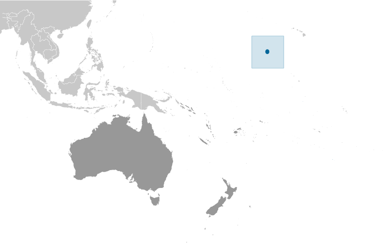
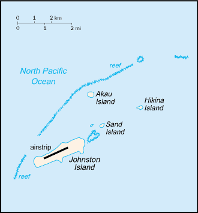

# Johnston Atoll

_territory of the US_

## Introduction

**_Background:_**   
Both the US and the Kingdom of Hawaii annexed Johnston Atoll in 1858, but it was the US that mined the guano deposits until the late 1880s. Johnston Island and Sand Island were designated wildlife refuges in 1926. The US Navy took over the atoll in 1934, and subsequently the US Air Force assumed control in 1948. The site was used for high-altitude nuclear tests in the 1950s and 1960s, and until late in 2000 the atoll was maintained as a storage and disposal site for chemical weapons. Cleanup and closure of the weapons facility ended in May 2005.

## Geography

**_Location:_**   
Oceania, atoll in the North Pacific Ocean 717 nm (1328 km) southwest of Honolulu, Hawaii, about one-third of the way from Hawaii to the Marshall Islands

**_Geographic coordinates:_**   
16 45 N, 169 31 W

**_Map references:_**   
Oceania

**_Area:_**   
**total:** 2.63 sq km   
**land:** 2.63 sq km   
**water:** 0 sq km

**_Area - comparative:_**   
about 4.7 times the size of The Mall in Washington, DC

**_Land boundaries:_**   
0 km

**_Coastline:_**   
34 km

**_Maritime claims:_**   
**territorial sea:** 12 nm   
**exclusive economic zone:** 200 nm

**_Climate:_**   
tropical, but generally dry; consistent northeast trade winds with little seasonal temperature variation

**_Terrain:_**   
mostly flat

**_Elevation extremes:_**   
**lowest point:** Pacific Ocean 0 m   
**highest point:** Summit Peak 5 m

**_Natural resources:_**   
guano deposits (worked until depletion about 1890), terrestrial and aquatic wildlife

**_Land use:_**   
**arable land:** 0%   
**permanent crops:** 0%   
**other:** 100% (2011)

**_Irrigated land:_**   
0 sq km (2011)

**_Natural hazards:_**   
NA

**_Environment - current issues:_**   
no natural fresh water resources

**_Geography - note:_**   
strategic location in the North Pacific Ocean; Johnston Island and Sand Island are natural islands, which have been expanded by coral dredging; North Island (Akau) and East Island (Hikina) are manmade islands formed from coral dredging; the egg-shaped reef is 34 km in circumference; closed to the public; a former US nuclear weapons test site; site of now-closed Johnston Atoll Chemical Agent Disposal System (JACADS); most facilities dismantled and cleanup complete in 2004; some low-growing vegetation

## People and Society

**_Population:_**   
uninhabited   
**note:** in previous years, there was an average of 1,100 US military and civilian contractor personnel present; as of September 2001, population had decreased significantly when US Army Chemical Activity Pacific (USACAP) departed; as of May 2005 all US Government personnel had left the island

## Government

**_Country name:_**   
**conventional long form:** none   
**conventional short form:** Johnston Atoll

**_Dependency status:_**   
unincorporated territory of the US; administered from Honolulu, Hawaii, by Pacific Air Forces, Hickam Air Force Base, and the Fish and Wildlife Service of the US Department of the Interior as part of the National Wildlife Refuge system

**_Legal system:_**   
the laws of the US, where applicable, apply

**_Flag description:_**   
the flag of the US is used

## Transportation

**_Airports - with paved runways:_**   
**total:** 1   
**2,438 to 3,047 m:** 1 (2013)

**_Ports and terminals:_**   
Johnston Island

## Military

**_Military - note:_**   
defense is the responsibility of the US

## Transnational Issues

**_Disputes - international:_**   
none

............................................................   
_Page last updated on May 27, 2014_
