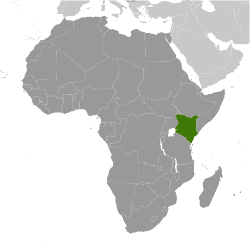

# Kenya

## Introduction

**_Background:_**   
Founding president and liberation struggle icon Jomo KENYATTA led Kenya from independence in 1963 until his death in 1978, when President Daniel MOI took power in a constitutional succession. The country was a de facto one-party state from 1969 until 1982 when the ruling Kenya African National Union (KANU) made itself the sole legal party in Kenya. MOI acceded to internal and external pressure for political liberalization in late 1991. The ethnically fractured opposition failed to dislodge KANU from power in elections in 1992 and 1997, which were marred by violence and fraud, but were viewed as having generally reflected the will of the Kenyan people. President MOI stepped down in December 2002 following fair and peaceful elections. Mwai KIBAKI, running as the candidate of the multiethnic, united opposition group, the National Rainbow Coalition (NARC), defeated KANU candidate Uhuru KENYATTA and assumed the presidency following a campaign centered on an anticorruption platform. KIBAKI's NARC coalition splintered in 2005 over a constitutional review process. Government defectors joined with KANU to form a new opposition coalition, the Orange Democratic Movement (ODM), which defeated the government's draft constitution in a popular referendum in November 2005. KIBAKI's reelection in December 2007 brought charges of vote rigging from ODM candidate Raila ODINGA and unleashed two months of violence in which as many as 1,500 people died. African Union-sponsored mediation led by former UN Secretary General Kofi ANNAN in late February 2008 resulted in a power-sharing accord bringing ODINGA into the government in the restored position of prime minister. The power sharing accord included a broad reform agenda, the centerpiece of which was constitutional reform. In August 2010, Kenyans overwhelmingly adopted a new constitution in a national referendum. The new constitution introduced additional checks and balances to executive power and significant devolution of power and resources to 47 newly created counties. It also eliminated the position of prime minister following the first presidential election under the new constitution, which occurred on 4 March 2013. Uhuru KENYATTA, the son of founding president Jomo KENYATTA, won the March elections in the first round by a close margin and was sworn into office on 9 April 2013.

## Geography

**_Location:_**   
Eastern Africa, bordering the Indian Ocean, between Somalia and Tanzania

**_Geographic coordinates:_**   
1 00 N, 38 00 E

**_Map references:_**   
Africa

**_Area:_**   
**total:** 580,367 sq km   
**land:** 569,140 sq km   
**water:** 11,227 sq km

**_Area - comparative:_**   
five times the size of Ohio; slightly more than twice the size of Nevada

**_Land boundaries:_**   
**total:** 3,477 km   
**border countries:** Ethiopia 861 km, Somalia 682 km, South Sudan 232 km, Tanzania 769 km, Uganda 933 km

**_Coastline:_**   
536 km

**_Maritime claims:_**   
**territorial sea:** 12 nm   
**exclusive economic zone:** 200 nm   
**continental shelf:** 200 m depth or to the depth of exploitation

**_Climate:_**   
varies from tropical along coast to arid in interior

**_Terrain:_**   
low plains rise to central highlands bisected by Great Rift Valley; fertile plateau in west

**_Elevation extremes:_**   
**lowest point:** Indian Ocean 0 m   
**highest point:** Mount Kenya 5,199 m

**_Natural resources:_**   
limestone, soda ash, salt, gemstones, fluorspar, zinc, diatomite, gypsum, wildlife, hydropower

**_Land use:_**   
**arable land:** 9.48%   
**permanent crops:** 1.12%   
**other:** 89.4% (2011)

**_Irrigated land:_**   
1,032 sq km (2003)

**_Total renewable water resources:_**   
30.7 cu km (2011)

**_Freshwater withdrawal (domestic/industrial/agricultural):_**   
**total:** 2.74 cu km/yr (17%/4%/79%)   
**per capita:** 72.96 cu m/yr (2003)

**_Natural hazards:_**   
recurring drought; flooding during rainy seasons   
**volcanism:** limited volcanic activity; the Barrier (elev. 1,032 m) last erupted in 1921; South Island is the only other historically active volcano

**_Environment - current issues:_**   
water pollution from urban and industrial wastes; degradation of water quality from increased use of pesticides and fertilizers; water hyacinth infestation in Lake Victoria; deforestation; soil erosion; desertification; poaching

**_Environment - international agreements:_**   
**party to:** Biodiversity, Climate Change, Climate Change-Kyoto Protocol, Desertification, Endangered Species, Hazardous Wastes, Law of the Sea, Marine Dumping, Marine Life Conservation, Ozone Layer Protection, Ship Pollution, Wetlands, Whaling   
**signed, but not ratified:** none of the selected agreements

**_Geography - note:_**   
the Kenyan Highlands comprise one of the most successful agricultural production regions in Africa; glaciers are found on Mount Kenya, Africa's second highest peak; unique physiography supports abundant and varied wildlife of scientific and economic value

## People and Society

**_Nationality:_**   
**noun:** Kenyan(s)   
**adjective:** Kenyan

**_Ethnic groups:_**   
Kikuyu 22%, Luhya 14%, Luo 13%, Kalenjin 12%, Kamba 11%, Kisii 6%, Meru 6%, other African 15%, non-African (Asian, European, and Arab) 1%

**_Languages:_**   
English (official), Kiswahili (official), numerous indigenous languages

**_Religions:_**   
Christian 82.5% (Protestant 47.4%, Catholic 23.3%, other 11.8%), Muslim 11.1%, Traditionalists 1.6%, other 1.7%, none 2.4%, unspecified 0.7% (2009 census)

**_Population:_**   
45,010,056   
**note:** estimates for this country explicitly take into account the effects of excess mortality due to AIDS; this can result in lower life expectancy, higher infant mortality, higher death rates, lower population growth rates, and changes in the distribution of population by age and sex than would otherwise be expected (July 2014 est.)

**_Age structure:_**   
**0-14 years:** 42.1% (male 9,494,983/female 9,435,795)   
**15-24 years:** 18.7% (male 4,197,382/female 4,202,399)   
**25-54 years:** 32.8% (male 7,458,665/female 7,302,534)   
**55-64 years:** 3.7% (male 751,296/female 910,523)   
**65 years and over:** 2.7% (male 548,431/female 708,048) (2014 est.)

**_Dependency ratios:_**   
**total dependency ratio:** 81 %   
**youth dependency ratio:** 76.1 %   
**elderly dependency ratio:** 4.9 %   
**potential support ratio:** 20.4 (2014 est.)

**_Median age:_**   
**total:** 19.1 years   
**male:** 18.9 years   
**female:** 19.2 years (2014 est.)

**_Population growth rate:_**   
2.11% (2014 est.)

**_Birth rate:_**   
28.27 births/1,000 population (2014 est.)

**_Death rate:_**   
7 deaths/1,000 population (2014 est.)

**_Net migration rate:_**   
-0.22 migrant(s)/1,000 population (2014 est.)

**_Urbanization:_**   
**urban population:** 24% of total population (2011)   
**rate of urbanization:** 4.36% annual rate of change (2010-15 est.)

**_Major urban areas - population:_**   
NAIROBI (capital) 3.363 million; Mombassa 972,000 (2011)

**_Sex ratio:_**   
**at birth:** 1.02 male(s)/female   
**0-14 years:** 1.01 male(s)/female   
**15-24 years:** 1 male(s)/female   
**25-54 years:** 1.02 male(s)/female   
**55-64 years:** 1 male(s)/female   
**65 years and over:** 0.79 male(s)/female   
**total population:** 1 male(s)/female (2014 est.)

**_Mother's mean age at first birth:_**   
19.8   
**note:** median age at first birth among women 25-29 (2008-09 est.)

**_Maternal mortality rate:_**   
360 deaths/100,000 live births (2010)

**_Infant mortality rate:_**   
**total:** 40.71 deaths/1,000 live births   
**male:** 45.33 deaths/1,000 live births   
**female:** 35.99 deaths/1,000 live births (2014 est.)

**_Life expectancy at birth:_**   
**total population:** 63.52 years   
**male:** 62.06 years   
**female:** 65.01 years (2014 est.)

**_Total fertility rate:_**   
3.54 children born/woman (2014 est.)

**_Contraceptive prevalence rate:_**   
45.5% (2008/09)

**_Health expenditures:_**   
4.5% of GDP (2011)

**_Physicians density:_**   
0.18 physicians/1,000 population (2011)

**_Hospital bed density:_**   
1.4 beds/1,000 population (2010)

**_Drinking water source:_**   
**improved:** urban: 82.3% of population; rural: 55.1% of population; total: 61.7% of population   
**unimproved:** urban: 17.7% of population; rural: 44.9% of population; total: 38.3% of population (2012 est.)

**_Sanitation facility access:_**   
**improved:** urban: 31.3% of population; rural: 29.1% of population; total: 29.6% of population   
**unimproved:** urban: 68.7% of population; rural: 70.9% of population; total: 70.4% of population (2012 est.)

**_HIV/AIDS - adult prevalence rate:_**   
6.1% (2012 est.)

**_HIV/AIDS - people living with HIV/AIDS:_**   
1.646 million (2012 est.)

**_HIV/AIDS - deaths:_**   
57,500 (2012 est.)

**_Major infectious diseases:_**   
**degree of risk:** high   
**food or waterborne diseases:** bacterial and protozoal diarrhea, hepatitis A, and typhoid fever   
**vectorborne disease:** malaria, dengue fever, and Rift Valley fever   
**water contact disease:** schistosomiasis   
**animal contact disease:** rabies (2013)

**_Obesity - adult prevalence rate:_**   
4.2% (2008)

**_Children under the age of 5 years underweight:_**   
16.4% (2009)

**_Education expenditures:_**   
6.7% of GDP (2010)

**_Literacy:_**   
**definition:** age 15 and over can read and write   
**total population:** 87.4%   
**male:** 90.6%   
**female:** 84.2% (2010 est.)

**_School life expectancy (primary to tertiary education):_**   
**total:** 11 years   
**male:** 11 years   
**female:** 11 years (2009)

**_Child labor - children ages 5-14:_**   
**total number:** 2,146,058   
**percentage:** 26 % (2000 est.)

## Government

**_Country name:_**   
**conventional long form:** Republic of Kenya   
**conventional short form:** Kenya   
**local long form:** Republic of Kenya/Jamhuri ya Kenya   
**local short form:** Kenya   
**former:** British East Africa

**_Government type:_**   
republic

**_Capital:_**   
**name:** Nairobi   
**geographic coordinates:** 1 17 S, 36 49 E   
**time difference:** UTC+3 (8 hours ahead of Washington, DC, during Standard Time)

**_Administrative divisions:_**   
47 counties; Baringo, Bomet, Bungoma, Busia, Elgeyo/Marakwet, Embu, Garissa, Homa Bay, Isiolo, Kajiado, Kakamega, Kericho, Kiambu, Kilifi, Kirinyaga, Kisii, Kisumu, Kitui, Kwale, Laikipia, Lamu, Machakos, Makueni, Mandera, Marsabit, Meru, Migori, Mombasa, Murang'a, Nairobi City, Nakuru, Nandi, Narok, Nyamira, Nyandarua, Nyeri, Samburu, Siaya, Taita/Taveta, Tana River, Tharaka-Nithi, Trans Nzoia, Turkana, Uasin Gishu, Vihiga, Wajir, West Pokot

**_Independence:_**   
12 December 1963 (from the UK)

**_National holiday:_**   
Independence Day, 12 December (1963); Madaraka Day, 1 June (1963); Mashujaa Day, 20 October (2010)

**_Constitution:_**   
previous 1963, 1969; latest drafted 6 May 2010, passed by referendum 4 August 2010, promulgated 27 August 2010 (2013)

**_Legal system:_**   
mixed legal system of English common law, Islamic law, and customary law; judicial review in a new Supreme Court established pursuant to the new constitution

**_International law organization participation:_**   
accepts compulsory ICJ jurisdiction with reservations; accepts ICCt jurisdiction

**_Suffrage:_**   
18 years of age; universal

**_Executive branch:_**   
**chief of state:** President Uhuru KENYATTA (since 9 April 2013); Deputy President William RUTO (since 9 April 2013); note - the president is both chief of state and head of government   
**head of government:** President Uhuru KENYATTA (since 9 April 2013); Deputy President William RUTO (since 9 April 2013); note - according to the 2008 power sharing agreement the position of prime minister was created though not well defined; consistent with the new constitution, the position was abolished after the March 2013 elections   
**cabinet:** Cabinet appointed by the president   
**elections:** president and deputy president elected on the same ticket by popular vote for a five-year term (eligible for a second term); in addition to receiving a simple majority of votes, the presidential candidate must also win 25% or more of the votes cast in each of more than half of the 47 counties to avoid a runoff; election last held on 4 March 2013 (next to be held in 2017 or 2018); note - the new constitution had set elections for August 2011 but elections were delayed to 2013   
**election results:** President Uhuru KENYATTA elected in first round; percent of vote - Uhuru KENYATTA 50.1%, Raila ODINGA 43.7%, Musalia MUDAVADI 4.0%, other 2.2%

**_Legislative branch:_**   
bicameral parliament consists of a Senate (67 seats of which 47 are elected and 20 are appointed) and a National Assembly (349 seats of which 290 are elected and 59 are appointed); members to serve five-year terms   
**elections:** last held on 4 March 2013 (next to be held in 2017 or 2018)   
**election results:** Senate - percent of vote by party - NA; seats by party - Jubilee coalition TNA 17, URP 12, NARC 1; CORD coalition ODM 17, Ford-K 5, WDM 5, FPK 1; Amani coalition KANU 3, UDF 3; unaffiliated APK 3; National Assembly - percent of vote by party - NA; seats by party - ODM 96, TNA 89, URP 75, WDM-K 26, UDF 12, FORD-K 10, KANU 6, NFK 6, APK 5, FORD-P 4, independents 4, other 16

**_Judicial branch:_**   
**highest court(s):** Supreme Court (consists of chief and deputy chief justices and five judges)   
**judge selection and term of office:** chief and deputy chief justices nominated by Judicial Service Commission (JSC) and appointed by president with approval of the National Assembly; other judges nominated by the JSC and appointed by president; chief justice serves nonrenewable 10-year terms or till age 70 whichever comes first; other judges serve till age 70   
**subordinate courts:** High Court; Court of Appeal; courts martial; magistrates' courts; religious courts

**_Political parties and leaders:_**   
Federal Party of Kenya or FPK [Cyrus JIRONGO]   
Kenya African National Union or KANU [Gideon MOI]   
The National Party Alliance or TNA [Uhuru KENYATTA]   
National Rainbow Coalition-Kenya or NARC-Kenya [Martha KARUA]   
Orange Democratic Movement of Kenya or ODM [Raila ODINGA]   
United Democratic Forum Party or UDF [Musalia MUDAVADI]   
United Republican Party or URP [William RUTO]   
Wiper Democratic Movement or WDM (formerly Orange Democratic Movement or ODM-K) [Kalonzo MUSYOKA]

**_Political pressure groups and leaders:_**   
Council of Islamic Preachers of Kenya or CIPK [Sheikh Idris MOHAMMED]   
Kenya Human Rights Commission [L. Muthoni WANYEKI]   
Muslim Human Rights Forum [Ali-Amin KIMATHI]   
National Muslim Leaders Forum or NAMLEF [Abdullahi ABDI]   
Protestant National Council of Churches of Kenya or NCCK [Canon Peter Karanja MWANGI]   
Roman Catholic and other Christian churches   
Supreme Council of Kenya Muslims or SUPKEM [Shaykh Abdul Gafur al-BUSAIDY]   
**other:** labor unions, Kenya Association of Manufacturers, Kenya Private Sector Alliance

**_International organization participation:_**   
ACP, AfDB, AU, C, CD, COMESA, EAC, EADB, FAO, G-15, G-77, IAEA, IBRD, ICAO, ICC (national committees), ICRM, IDA, IFAD, IFC, IFRCS, IGAD, ILO, IMF, IMO, IMSO, Interpol, IOC, IOM, IPU, ISO, ITSO, ITU, ITUC (NGOs), MIGA, MINUSMA, MONUSCO, NAM, OPCW, PCA, UN, UNAMID, UNCTAD, UNESCO, UNHCR, UNIDO, UNIFIL, UNMISS, UNWTO, UPU, WCO, WHO, WIPO, WMO, WTO

**_Diplomatic representation in the US:_**   
**chief of mission:** Ambassador (vacant); Charge d'Affaires Jean KAMAU   
**chancery:** 2249 R Street NW, Washington, DC 20008   
**telephone:** [1] (202) 387-6101   
**FAX:** [1] (202) 462-3829   
**consulate(s) general:** Los Angeles   
**consulate(s):** New York

**_Diplomatic representation from the US:_**   
**chief of mission:** Ambassador Robert F. GODEC (since 16 January 2013)   
**embassy:** US Embassy, United Nations Avenue, Nairobi; P. O. Box 606 Village Market, Nairobi 00621   
**mailing address:** American Embassy Nairobi, U.S. Department of State, Washington, DC 20521-8900   
**telephone:** [254] (20) 363-6000   
**FAX:** [254] (20) 363-6157

**_Flag description:_**   
three equal horizontal bands of black (top), red, and green; the red band is edged in white; a large Maasai warrior's shield covering crossed spears is superimposed at the center; black symbolizes the majority population, red the blood shed in the struggle for freedom, green stands for natural wealth, and white for peace; the shield and crossed spears symbolize the defense of freedom

**_National symbol(s):_**   
lion

**_National anthem:_**   
**name:** "Ee Mungu Nguvu Yetu" (Oh God of All Creation)   
**lyrics/music:** Graham HYSLOP, Thomas KALUME, Peter KIBUKOSYA, Washington OMONDI, and George W. SENOGA-ZAKE/traditional, adapted by Graham HYSLOP, Thomas KALUME, Peter KIBUKOSYA, Washington OMONDI, and George W. SENOGA-ZAKE   
**note:** adopted 1963; the anthem is based on a traditional Kenyan folk song

## Economy

**_Economy - overview:_**   
Kenya hKenya has been hampered by corruption and by reliance upon several primary goods whose prices have remained low. Low infrastructure investment threatens Kenya's long-term position as the largest East African economy, although the Kenyatta administration has prioritized infrastructure development. International financial lenders and donors remain important to Kenya's economic growth and development. Unemployment is high at around 40%. The country has chronic budget deficits. Inflationary pressures and sharp currency depreciation peaked in early 2012 but have since abated following low global food and fuel prices and monetary interventions by the Central Bank. Recent terrorism in Kenya and the surrounding region threatens Kenya's important tourism industry. Kenya, in conjunction with neighboring Ethiopia and South Sudan, intends to begin construction on a transport corridor and oil pipeline into the port of Lamu in 2014.

**_GDP (purchasing power parity):_**   
$79.9 billion (2013 est.)   
$76.03 billion (2012 est.)   
$72.71 billion (2011 est.)   
**note:** data are in 2013 US dollars

**_GDP (official exchange rate):_**   
$45.31 billion (2013 est.)

**_GDP - real growth rate:_**   
5.1% (2013 est.)   
4.6% (2012 est.)   
4.4% (2011 est.)

**_GDP - per capita (PPP):_**   
$1,800 (2013 est.)   
$1,700 (2013 est.)   
$1,700 (2011 est.)   
**note:** data are in 2013 US dollars

**_Gross national saving:_**   
10.6% of GDP (2013 est.)   
9.5% of GDP (2012 est.)   
10.8% of GDP (2011 est.)

**_GDP - composition, by end use:_**   
**household consumption:** 79.2%   
**government consumption:** 18.2%   
**investment in fixed capital:** 21.3%   
**investment in inventories:** -0.3%   
**exports of goods and services:** 28.5%   
**imports of goods and services:** -47%; (2013 est.)

**_GDP - composition, by sector of origin:_**   
**agriculture:** 29.3%   
**industry:** 17.4%   
**services:** 53.3% (2013 est.)

**_Agriculture - products:_**   
tea, coffee, corn, wheat, sugarcane, fruit, vegetables; dairy products, beef, fish, pork, poultry, eggs

**_Industries:_**   
small-scale consumer goods (plastic, furniture, batteries, textiles, clothing, soap, cigarettes, flour), agricultural products, horticulture, oil refining; aluminum, steel, lead; cement, commercial ship repair, tourism

**_Industrial production growth rate:_**   
5.1% (2013 est.)

**_Labor force:_**   
19.67 million (2013 est.)

**_Labor force - by occupation:_**   
**agriculture:** 75%   
**industry and services:** 25% (2007 est.)

**_Unemployment rate:_**   
40% (2008 est.)   
40% (2001 est.)

**_Population below poverty line:_**   
43.4% (2012 est.)

**_Household income or consumption by percentage share:_**   
**lowest 10%:** 1.8%   
**highest 10%:** 37.8% (2005)

**_Distribution of family income - Gini index:_**   
42.5 (2008 est.)   
44.9 (1997)

**_Budget:_**   
**revenues:** $7.866 billion   
**expenditures:** $9.742 billion (2013 est.)

**_Taxes and other revenues:_**   
17.4% of GDP (2013 est.)

**_Budget surplus (+) or deficit (-):_**   
-4.1% of GDP (2013 est.)

**_Public debt:_**   
53.5% of GDP (2013 est.)   
52.5% of GDP (2012 est.)

**_Fiscal year:_**   
1 July - 30 June

**_Inflation rate (consumer prices):_**   
5.8% (2013 est.)   
9.4% (2012 est.)

**_Central bank discount rate:_**   
7% (31 December 2010 est.)   
NA% (31 December 2009 est.)

**_Commercial bank prime lending rate:_**   
17.1% (31 December 2013 est.)   
NA% (31 December 2012 est.)

**_Stock of narrow money:_**   
$9.198 billion (31 December 2013 est.)   
$8.264 billion (31 December 2012 est.)

**_Stock of broad money:_**   
$19.37 billion (31 December 2013 est.)   
$17.08 billion (31 December 2012 est.)

**_Stock of domestic credit:_**   
$23.1 billion (31 December 2013 est.)   
$20.93 billion (31 December 2012 est.)

**_Market value of publicly traded shares:_**   
$14.79 billion (31 December 2012 est.)   
$NA (31 December 2011)   
$14.46 billion (31 December 2010 est.)

**_Current account balance:_**   
-$4.495 billion (2013 est.)   
-$4.31 billion (2012 est.)

**_Exports:_**   
$6.58 billion (2013 est.)   
$6.228 billion (2012 est.)

**_Exports - commodities:_**   
tea, horticultural products, coffee, petroleum products, fish, cement

**_Exports - partners:_**   
Uganda 10.3%, Tanzania 10%, Netherlands 7.7%, UK 7.2%, US 6.3%, Egypt 4.8%, Democratic Republic of the Congo 4.4% (2012)

**_Imports:_**   
$15.86 billion (2013 est.)   
$15.1 billion (2011 est.)

**_Imports - commodities:_**   
machinery and transportation equipment, petroleum products, motor vehicles, iron and steel, resins and plastics

**_Imports - partners:_**   
India 20.9%, China 15.4%, UAE 9.8%, Saudi Arabia 6.9% (2012)

**_Reserves of foreign exchange and gold:_**   
$5.541 billion (31 December 2013 est.)   
$5.712 billion (31 December 2012 est.)

**_Debt - external:_**   
$11.96 billion (31 December 2013 est.)   
$11.06 billion (31 December 2012 est.)

**_Stock of direct foreign investment - at home:_**   
$3.273 billion (31 December 2013 est.)   
$2.877 billion (31 December 2012 est.)

**_Stock of direct foreign investment - abroad:_**   
$335.4 million (31 December 2013 est.)   
$315.4 million (31 December 2012 est.)

**_Exchange rates:_**   
Kenyan shillings (KES) per US dollar -   
86.73 (2013 est.)   
84.53 (2012 est.)   
79.233 (2010 est.)   
77.352 (2009)   
68.358 (2008)

## Energy

**_Electricity - production:_**   
7.33 billion kWh (2010 est.)

**_Electricity - consumption:_**   
6.15 billion kWh (2010 est.)

**_Electricity - exports:_**   
31 million kWh (2010 est.)

**_Electricity - imports:_**   
31 million kWh (2010 est.)

**_Electricity - installed generating capacity:_**   
1.698 million kW (2010 est.)

**_Electricity - from fossil fuels:_**   
41.9% of total installed capacity (2010 est.)

**_Electricity - from nuclear fuels:_**   
0% of total installed capacity (2010 est.)

**_Electricity - from hydroelectric plants:_**   
44.8% of total installed capacity (2010 est.)

**_Electricity - from other renewable sources:_**   
13.3% of total installed capacity (2010 est.)

**_Crude oil - production:_**   
0 bbl/day (2011 est.)

**_Crude oil - exports:_**   
0 bbl/day (2010 est.)

**_Crude oil - imports:_**   
31,040 bbl/day (2010 est.)

**_Crude oil - proved reserves:_**   
0 bbl (1 January 2013 est.)

**_Refined petroleum products - production:_**   
32,240 bbl/day (2010 est.)

**_Refined petroleum products - consumption:_**   
79,410 bbl/day (2011 est.)

**_Refined petroleum products - exports:_**   
1,266 bbl/day (2010 est.)

**_Refined petroleum products - imports:_**   
52,160 bbl/day (2010 est.)

**_Natural gas - production:_**   
0 cu m (2011 est.)

**_Natural gas - consumption:_**   
0 cu m (2010 est.)

**_Natural gas - exports:_**   
0 cu m (2011 est.)

**_Natural gas - imports:_**   
0 cu m (2011 est.)

**_Natural gas - proved reserves:_**   
0 cu m (1 January 2013 est.)

**_Carbon dioxide emissions from consumption of energy:_**   
12.62 million Mt (2011 est.)

## Communications

**_Telephones - main lines in use:_**   
251,600 (2012)

**_Telephones - mobile cellular:_**   
30.732 million (2012)

**_Telephone system:_**   
**general assessment:** inadequate; fixed-line telephone system is small and inefficient; trunks are primarily microwave radio relay; business data commonly transferred by a very small aperture terminal (VSAT) system   
**domestic:** sole fixed-line provider, Telkom Kenya, is slated for privatization; multiple providers in the mobile-cellular segment of the market fostering a boom in mobile-cellular telephone usage with teledensity reaching 65 per 100 persons in 2011   
**international:** country code - 254; landing point for the EASSy, TEAMS and SEACOM fiber-optic submarine cable systems; satellite earth stations - 4 Intelsat (2011)

**_Broadcast media:_**   
about a half-dozen large-scale privately owned media companies with TV and radio stations as well as a state-owned TV broadcaster provide service nation-wide; satellite and cable TV subscription services available; state-owned radio broadcaster operates 2 national radio channels and provides regional and local radio services in multiple languages; a large number of private radio stations broadcast on a national level along with over 100 private and non-profit provincial stations broadcasting in local languages; transmissions of several international broadcasters available (2014)

**_Internet country code:_**   
.ke

**_Internet hosts:_**   
71,018 (2012)

**_Internet users:_**   
3.996 million (2009)

## Transportation

**_Airports:_**   
197 (2013)

**_Airports - with paved runways:_**   
**total:** 16   
**over 3,047 m:** 5   
**2,438 to 3,047 m:** 2   
**1,524 to 2,437 m:** 2   
**914 to 1,523 m:** 6   
**under 914 m:** 1 (2013)

**_Airports - with unpaved runways:_**   
**total:** 181   
**1,524 to 2,437 m:** 14   
**914 to 1,523 m:** 107   
**under 914 m:** 60 (2013)

**_Pipelines:_**   
oil 4 km; refined products 928 km (2013)

**_Railways:_**   
**total:** 2,066 km   
**narrow gauge:** 2,066 km 1.000-m gauge (2008)

**_Roadways:_**   
**total:** 160,878 km   
**paved:** 11,189 km   
**unpaved:** 149,689 km   
**note:** includes 98.941 km of urban and other roads (2013)

**_Waterways:_**   
none specifically, the only significant inland waterway in the country is the part of Lake Victoria within the boundaries of Kenya; Kisumu is the main port and has ferry connections to Uganda and Tanzania (2011)

**_Merchant marine:_**   
**registered in other countries:** 5 (Comoros 2, Saint Vincent and the Grenadines 2, unknown 1) (2010)

**_Ports and terminals:_**   
**major seaport(s):** Kisumu, Mombasa

## Military

**_Military branches:_**   
Kenya Defence Forces: Kenya Army, Kenya Air Force, Kenya Navy (2012)

**_Military service age and obligation:_**   
18-26 years of age for male and female voluntary service (under 18 with parental consent), with a 9-year obligation (7 years for Kenyan Navy); applicants must be Kenyan citizens and provide a national identity card (obtained at age 18) and a school-leaving certificate; women serve under the same terms and conditions as men; mandatory retirement at age 55 (2012)

**_Manpower available for military service:_**   
**males age 16-49:** 9,768,140   
**females age 16-49:** 9,466,257 (2010 est.)

**_Manpower fit for military service:_**   
**males age 16-49:** 6,361,268   
**females age 16-49:** 6,106,870 (2010 est.)

**_Manpower reaching militarily significant age annually:_**   
**male:** 422,104   
**female:** 416,927 (2010 est.)

**_Military expenditures:_**   
1.96% of GDP (2012)   
1.88% of GDP (2011)   
1.96% of GDP (2010)

## Transnational Issues

**_Disputes - international:_**   
Kenya served as an important mediator in brokering Sudan's north-south separation in February 2005; Kenya provides shelter to an estimated 550 million refugees, including Ugandans who flee across the border periodically to seek protection from Lord's Resistance Army rebels; Kenya works hard to prevent the clan and militia fighting in Somalia from spreading across the border, which has long been open to nomadic pastoralists; the boundary that separates Kenya's and Sudan's sovereignty is unclear in the "Ilemi Triangle," which Kenya has administered since colonial times

**_Refugees and internally displaced persons:_**   
**refugees (country of origin):** 425,879 (Somalia); 84,045 (South Sudan); 29,723 (Ethiopia); 15,290 (Democratic Republic of Congo - includes registered asylum seekers); 8,769 (Sudan - includes registered asylum seekers); 5,825 (Burundi - includes registered asylum seekers) (2014)   
**IDPs:** 412,000 (represents people displaced since the 1990s by ethnic and political violence and land disputes and who sought refuge mostly in camps; persons who took refuge in host communities or were evicted in urban areas are not included in the data; data is not available on pastoralists displaced by cattle rustling, violence, natural disasters, and development projects; the largest displacement resulted from 2007-08 post-election violence (2013)   
**stateless persons:** 20,000 (2012); note - the stateless population is composed of Nubians, Kenyan Somalis, and coastal Arabs; the Nubians are descendants of Sudanese soldiers recruited by the British to fight for them in East Africa more than a century ago; they did not receive Kenyan citizenship when the country became independent in 1963; only recently have Nubians become a formally recognized tribe and had less trouble obtaining national IDs; Galjeel and other Somalis who have lived in Kenya for decades are lumped in with more recent Somali refugees and denied ID cards

**_Trafficking in persons:_**   
**current situation:** Kenya is a source, transit, and destination country for adults and children subjected to forced labor and sex trafficking; Kenyan children are forced to work in domestic service, agriculture, fishing, cattle herding, street vending, begging, and prostitution; Kenyan economic migrants to other East African countries, South Sudan, Europe, the US, and the Middle East are at times exploited in domestic servitude, massage parlors or brothels, or forced manual labor; children from Burundi, Ethiopia, Somalia, South Sudan, Tanzania, and Uganda are subjected to forced labor and prostitution in Kenya; Somali refugees living in the Dadaab complex may be forced into prostitution or work on tobacco farms   
**tier rating:** Tier 2 Watch List - Kenya does not fully comply with the minimum standards for the elimination of trafficking; the government enacted the Counter-Trafficking in Persons Act in October 2012 but has not launched and implemented its national plan of action, convened the Counter-Trafficking in Persons Advisory Committee, taken tangible action against trafficking complicity among law enforcement officials, provided shelter and other protective services for adult victims, monitor the work of overseas labor recruitment agencies, or provide wide-scale anti-trafficking training to its officials; efforts to assist and care for child victims remain strong; corruption among officials continue to hamper efforts to bring traffickers to justice (2013)

**_Illicit drugs:_**   
widespread harvesting of small plots of marijuana; transit country for South Asian heroin destined for Europe and North America; Indian methaqualone also transits on way to South Africa; significant potential for money-laundering activity given the country's status as a regional financial center; massive corruption, and relatively high levels of narcotics-associated activities

............................................................   
_Page last updated on June 20, 2014_
