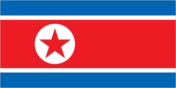
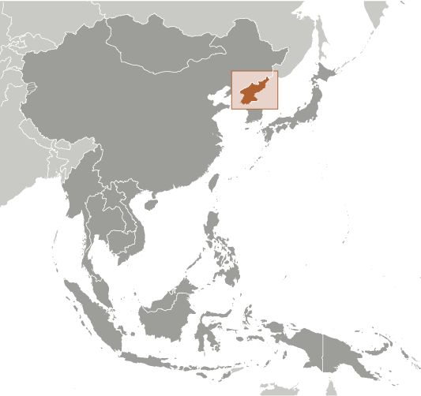
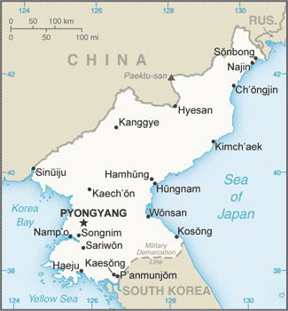

# Korea, North

## Introduction

**_Background:_**   
An independent kingdom for much of its long history, Korea was occupied by Japan beginning in 1905 following the Russo-Japanese War. Five years later, Japan formally annexed the entire peninsula. Following World War II, Korea was split with the northern half coming under Soviet-sponsored communist control. After failing in the Korean War (1950-53) to conquer the US-backed Republic of Korea (ROK) in the southern portion by force, North Korea (DPRK), under its founder President KIM Il Sung, adopted a policy of ostensible diplomatic and economic "self-reliance" as a check against outside influence. The DPRK demonized the US as the ultimate threat to its social system through state-funded propaganda, and molded political, economic, and military policies around the core ideological objective of eventual unification of Korea under Pyongyang's control. KIM Il Sung's son, KIM Jong Il, was officially designated as his father's successor in 1980, assuming a growing political and managerial role until the elder KIM's death in 1994. KIM Jong Un was publicly unveiled as his father's successor in September 2010. Following KIM Jong Il's death in December 2011, the regime began to take actions to transfer power to KIM Jong Un and KIM has now assumed many his father's former titles and duties. After decades of economic mismanagement and resource misallocation, the DPRK since the mid-1990s has relied heavily on international aid to feed its population. The DPRK began to ease restrictions to allow semi-private markets, starting in 2002, but then sought to roll back the scale of economic reforms in 2005 and 2009. North Korea's history of regional military provocations; proliferation of military-related items; long-range missile development; WMD programs including tests of nuclear devices in 2006, 2009, and 2013; and massive conventional armed forces are of major concern to the international community. The regime in 2013 announced a new policy calling for the simultaneous development of the North's nuclear weapons program and its economy.

## Geography

**_Location:_**   
Eastern Asia, northern half of the Korean Peninsula bordering the Korea Bay and the Sea of Japan, between China and South Korea

**_Geographic coordinates:_**   
40 00 N, 127 00 E

**_Map references:_**   
Asia

**_Area:_**   
**total:** 120,538 sq km   
**land:** 120,408 sq km   
**water:** 130 sq km

**_Area - comparative:_**   
slightly larger than Virginia; slightly smaller than Mississippi

**_Land boundaries:_**   
**total:** 1,672 km   
**border countries:** China 1,416 km, South Korea 238 km, Russia 18 km

**_Coastline:_**   
2,495 km

**_Maritime claims:_**   
**territorial sea:** 12 nm   
**exclusive economic zone:** 200 nm   
**note:** military boundary line 50 nm in the Sea of Japan and the exclusive economic zone limit in the Yellow Sea where all foreign vessels and aircraft without permission are banned

**_Climate:_**   
temperate with rainfall concentrated in summer

**_Terrain:_**   
mostly hills and mountains separated by deep, narrow valleys; coastal plains wide in west, discontinuous in east

**_Elevation extremes:_**   
**lowest point:** Sea of Japan 0 m   
**highest point:** Paektu-san 2,744 m

**_Natural resources:_**   
coal, lead, tungsten, zinc, graphite, magnesite, iron ore, copper, gold, pyrites, salt, fluorspar, hydropower

**_Land use:_**   
**arable land:** 19.08%   
**permanent crops:** 1.7%   
**other:** 79.22% (2011)

**_Irrigated land:_**   
14,600 sq km (2003)

**_Total renewable water resources:_**   
77.15 cu km (2011)

**_Freshwater withdrawal (domestic/industrial/agricultural):_**   
**total:** 8.66 cu km/yr (10%/13%/76%)   
**per capita:** 360.6 cu m/yr (2005)

**_Natural hazards:_**   
late spring droughts often followed by severe flooding; occasional typhoons during the early fall   
**volcanism:** Changbaishan (elev. 2,744 m) (also known as Baitoushan, Baegdu or P'aektu-san), on the Chinese border, is considered historically active

**_Environment - current issues:_**   
water pollution; inadequate supplies of potable water; waterborne disease; deforestation; soil erosion and degradation

**_Environment - international agreements:_**   
**party to:** Antarctic Treaty, Biodiversity, Climate Change, Climate Change-Kyoto Protocol, Desertification, Environmental Modification, Hazardous Wastes, Ozone Layer Protection, Ship Pollution   
**signed, but not ratified:** Law of the Sea

**_Geography - note:_**   
strategic location bordering China, South Korea, and Russia; mountainous interior is isolated and sparsely populated

## People and Society

**_Nationality:_**   
**noun:** Korean(s)   
**adjective:** Korean

**_Ethnic groups:_**   
racially homogeneous; there is a small Chinese community and a few ethnic Japanese

**_Languages:_**   
Korean

**_Religions:_**   
traditionally Buddhist and Confucianist, some Christian and syncretic Chondogyo (Religion of the Heavenly Way)   
**note:** autonomous religious activities now almost nonexistent; government-sponsored religious groups exist to provide illusion of religious freedom

**_Population:_**   
24,851,627 (July 2014 est.)

**_Age structure:_**   
**0-14 years:** 21.5% (male 2,709,580/female 2,628,456)   
**15-24 years:** 16.3% (male 2,041,861/female 1,997,413)   
**25-54 years:** 44% (male 5,465,889/female 5,456,850)   
**55-64 years:** 8.6% (male 1,007,667/female 1,127,455)   
**65 years and over:** 9.5% (male 826,175/female 1,590,281) (2014 est.)

**_Dependency ratios:_**   
**total dependency ratio:** 44.9 %   
**youth dependency ratio:** 31.1 %   
**elderly dependency ratio:** 13.8 %   
**potential support ratio:** 7.2 (2014 est.)

**_Median age:_**   
**total:** 33.4 years   
**male:** 31.8 years   
**female:** 35 years (2014 est.)

**_Population growth rate:_**   
0.53% (2014 est.)

**_Birth rate:_**   
14.51 births/1,000 population (2014 est.)

**_Death rate:_**   
9.18 deaths/1,000 population (2014 est.)

**_Net migration rate:_**   
-0.04 migrant(s)/1,000 population (2014 est.)

**_Urbanization:_**   
**urban population:** 60.3% of total population (2011)   
**rate of urbanization:** 0.63% annual rate of change (2010-15 est.)

**_Major urban areas - population:_**   
PYONGYANG (capital) 2.843 million (2011)

**_Sex ratio:_**   
**at birth:** 1.05 male(s)/female   
**0-14 years:** 1.03 male(s)/female   
**15-24 years:** 1.02 male(s)/female   
**25-54 years:** 1 male(s)/female   
**55-64 years:** 0.94 male(s)/female   
**65 years and over:** 0.51 male(s)/female   
**total population:** 0.94 male(s)/female (2014 est.)

**_Maternal mortality rate:_**   
81 deaths/100,000 live births (2010)

**_Infant mortality rate:_**   
**total:** 24.5 deaths/1,000 live births   
**male:** 27.18 deaths/1,000 live births   
**female:** 21.68 deaths/1,000 live births (2014 est.)

**_Life expectancy at birth:_**   
**total population:** 69.81 years   
**male:** 65.96 years   
**female:** 73.86 years (2014 est.)

**_Total fertility rate:_**   
1.98 children born/woman (2014 est.)

**_Contraceptive prevalence rate:_**   
68.6% (2002)

**_Physicians density:_**   
3.29 physicians/1,000 population (2003)

**_Hospital bed density:_**   
13.2 beds/1,000 population (2002)

**_Drinking water source:_**   
**improved:** urban: 98.9% of population; rural: 96.9% of population; total: 98.1% of population   
**unimproved:** urban: 1.1% of population; rural: 3.1% of population; total: 1.9% of population (2012 est.)

**_Sanitation facility access:_**   
**improved:** urban: 87.9% of population; rural: 72.5% of population; total: 81.8% of population   
**unimproved:** urban: 12.1% of population; rural: 27.5% of population; total: 18.2% of population (2012 est.)

**_HIV/AIDS - adult prevalence rate:_**   
NA

**_HIV/AIDS - people living with HIV/AIDS:_**   
NA

**_HIV/AIDS - deaths:_**   
NA

**_Obesity - adult prevalence rate:_**   
3.9% (2008)

**_Children under the age of 5 years underweight:_**   
18.8% (2009)

**_Education expenditures:_**   
NA

**_Literacy:_**   
**definition:** age 15 and over can read and write   
**total population:** 100%   
**male:** 100%   
**female:** 100% (2008 est.)

## Government

**_Country name:_**   
**conventional long form:** Democratic People's Republic of Korea   
**conventional short form:** North Korea   
**local long form:** Choson-minjujuui-inmin-konghwaguk   
**local short form:** Choson   
**abbreviation:** DPRK

**_Government type:_**   
Communist state one-man dictatorship

**_Capital:_**   
**name:** Pyongyang   
**geographic coordinates:** 39 01 N, 125 45 E   
**time difference:** UTC+9 (14 hours ahead of Washington, DC, during Standard Time)

**_Administrative divisions:_**   
9 provinces (do, singular and plural) and 2 municipalities (si, singular and plural)   
**provinces:** Chagang-do (Chagang), Hamgyong-bukto (North Hamgyong), Hamgyong-namdo (South Hamgyong), Hwanghae-bukto (North Hwanghae), Hwanghae-namdo (South Hwanghae), Kangwon-do (Kangwon), P'yongan-bukto (North P'yongan), P'yongan-namdo (South P'yongan), Yanggang-do (Yanggang)   
**municipalities:** Nason-si, P'yongyang-si (Pyongyang)

**_Independence:_**   
15 August 1945 (from Japan)

**_National holiday:_**   
Founding of the Democratic People's Republic of Korea (DPRK), 9 September (1948)

**_Constitution:_**   
previous 1948, 1972 (revised several times); latest adopted 1998 (during KIM Jong Il era); revised 2009, 2012 (2012)

**_Legal system:_**   
civil law system based on the Prussian model; system influenced by Japanese traditions and Communist legal theory

**_International law organization participation:_**   
has not submitted an ICJ jurisdiction declaration; non-party state to the ICCt

**_Suffrage:_**   
17 years of age; universal

**_Executive branch:_**   
**chief of state:** KIM Jong Un (since 17 December 2011); note - in 2014, the rubberstamp Supreme People's Assembly (SPA) re-elected KIM Yong Nam president of its Presidium with responsibility of representing the state and receiving diplomatic credentials   
**head of government:** Premier PAK Pong Ju (since 2 April 2013); Vice Premiers: KIM Tok Hun (since 30 April 2014), KIM Yong Jin (since 6 January 2012), RI Chol Man (since 13 April 2012), RI Mu Yong (since 31 May 2011), RO Tu Chol (since 3 September 2003)   
**cabinet:** Naegak (cabinet) members, except for the Minister of People's Armed Forces, are appointed by SPA   
**elections:** last election on 9 March 2014; date of next election NA   
**election results:** KIM Jong Un elected unopposed   
**note:** the Korean Workers' Party continues to list deceased leaders KIM Il Sung and KIM Jong Il as Eternal President and Eternal General Secretary respectively

**_Legislative branch:_**   
unicameral Supreme People's Assembly or Ch'oego Inmin Hoeui (687 seats; members elected by popular vote to serve five-year terms)   
**elections:** last held on 9 March 2014 (next to be held in March 2019)   
**election results:** percent of vote by party - NA; seats by party - NA; ruling party approves a list of candidates who are elected without opposition; a token number of seats are reserved for minor parties

**_Judicial branch:_**   
**highest court(s):** Supreme Court or Central Court (consists of the chief justice and two "People's Assessors" and for some cases, 3 judges)   
**judge selection and term of office:** judges elected by the Supreme People's Assembly for 5-year terms   
**subordinate courts:** provincial, municipal, military, special courts; people' courts (lowest level)

**_Political parties and leaders:_**   
**major party:** Korean Workers' Party or KWP [KIM Jong Un];   
**minor parties:** Chondoist Chongu Party [RYU Mi Yong] (under KWP control); Social Democratic Party [KIM Yong Dae] (under KWP control)

**_Political pressure groups and leaders:_**   
none

**_International organization participation:_**   
ARF, FAO, G-77, ICAO, ICC (NGOs), ICRM, IFAD, IFRCS, IHO, IMO, IOC, IPU, ISO, ITSO, ITU, NAM, UN, UNCTAD, UNESCO, UNIDO, UNWTO, UPU, WFTU (NGOs), WHO, WIPO, WMO

**_Diplomatic representation in the US:_**   
none; North Korea has a Permanent Mission to the UN in New York

**_Diplomatic representation from the US:_**   
none; note - Swedish Embassy in Pyongyang represents the US as consular protecting power

**_Flag description:_**   
three horizontal bands of blue (top), red (triple width), and blue; the red band is edged in white; on the hoist side of the red band is a white disk with a red five-pointed star; the broad red band symbolizes revolutionary traditions; the narrow white bands stands for purity, strength, and dignity; the blue bands signify sovereignty, peace, and friendship; the red star represents socialism

**_National symbol(s):_**   
red star

**_National anthem:_**   
**name:** "Aegukka" (Patriotic Song)   
**lyrics/music:** PAK Se Yong/KIM Won Gyun   
**note:** adopted 1947; both North Korea and South Korea's anthems share the same name and have a vaguely similar melody but have different lyrics; the North Korean anthem is also known as "Ach'imun pinnara" (Let Morning Shine)

## Economy

**_Economy - overview:_**   
North Korea, one of the world's most centrally directed and least open economies, faces chronic economic problems. Industrial capital stock is nearly beyond repair as a result of years of underinvestment, shortages of spare parts, and poor maintenance. Large-scale military spending draws off resources needed for investment and civilian consumption. Industrial and power output have stagnated for years at a fraction of pre-1990 levels. Frequent weather-related crop failures aggravated chronic food shortages caused by on-going systemic problems, including a lack of arable land, collective farming practices, poor soil quality, insufficient fertilization, and persistent shortages of tractors and fuel. Large-scale international food aid deliveries have allowed the people of North Korea to escape widespread starvation since famine threatened in 1995, but the population continues to suffer from prolonged malnutrition and poor living conditions. Since 2002, the government has allowed private "farmers' markets" to begin selling a wider range of goods. It also permitted some private farming - on an experimental basis - in an effort to boost agricultural output. In December 2009, North Korea carried out a redenomination of its currency, capping the amount of North Korean won that could be exchanged for the new notes, and limiting the exchange to a one-week window. A concurrent crackdown on markets and foreign currency use yielded severe shortages and inflation, forcing Pyongyang to ease the restrictions by February 2010. In response to the sinking of the South Korean warship Cheonan and the shelling of Yeonpyeong Island, South Korea's government cut off most aid, trade, and bilateral cooperation activities, with the exception of operations at the Kaesong Industrial Complex. In preparation for the 100th anniversary of KIM Il-sung's birthday in 2012, North Korea continued efforts to develop special economic zones with China and expressed willingness to permit construction of a trilateral gas pipeline that would carry Russian natural gas to South Korea. The North Korean government often highlights its goal of becoming a "strong and prosperous" nation and attracting foreign investment, a key factor for improving the overall standard of living. In this regard, in 2013 the regime rolled out 14 new Special Economic Zones set up for foreign investors, though the initiative remains in its infancy. Nevertheless, firm political control remains the government's overriding concern, which likely will inhibit changes to North Korea's current economic system.

**_GDP (purchasing power parity):_**   
$40 billion (2012 est.)   
$40 billion (2011 est.)   
$40 billion (2010 est.)   
**note:** data are in 2012 US dollars;; North Korea does not publish reliable National Income Accounts data; the data shown here are derived from purchasing power parity (PPP) GDP estimates for North Korea that were made by Angus MADDISON in a study conducted for the OECD; his figure for 1999 was extrapolated to 2011 using estimated real growth rates for North Korea's GDP and an inflation factor based on the US GDP deflator; the results were rounded to the nearest $10 billion.

**_GDP (official exchange rate):_**   
$28 billion (2009 est.)

**_GDP - real growth rate:_**   
1.3% (2012 est.)   
0.8% (2011 est.)   
-0.5% (2010 est.)

**_GDP - per capita (PPP):_**   
$1,800 (2011 est.)   
$1,800 (2010 est.)   
$1,900 (2009 est.)   
**note:** data are in 2011 US dollars

**_GDP - composition, by sector of origin:_**   
**agriculture:** 23.4%   
**industry:** 47.2%   
**services:** 29.4% (2012 est.)

**_Agriculture - products:_**   
rice, corn, potatoes, soybeans, pulses; cattle, pigs, pork, eggs

**_Industries:_**   
military products; machine building, electric power, chemicals; mining (coal, iron ore, limestone, magnesite, graphite, copper, zinc, lead, and precious metals), metallurgy; textiles, food processing; tourism

**_Industrial production growth rate:_**   
0.5% (2013 est.)

**_Labor force:_**   
12.6 million   
**note:** estimates vary widely (2012 est.)

**_Labor force - by occupation:_**   
**agriculture:** 35%   
**industry and services:** 65% (2008 est.)

**_Unemployment rate:_**   
NA%

**_Population below poverty line:_**   
NA%

**_Household income or consumption by percentage share:_**   
**lowest 10%:** NA%   
**highest 10%:** NA%

**_Budget:_**   
**revenues:** $3.2 billion   
**expenditures:** $3.3 billion (2007 est.)

**_Taxes and other revenues:_**   
11.4% of GDP   
**note:** excludes earnings from state-operated enterprises (2007 est.)

**_Budget surplus (+) or deficit (-):_**   
-0.4% of GDP (2007 est.)

**_Fiscal year:_**   
calendar year

**_Inflation rate (consumer prices):_**   
NA%

**_Exports:_**   
$3.954 billion (2012 est.)   
$3.703 billion (2011 est.)

**_Exports - commodities:_**   
minerals, metallurgical products, manufactures (including armaments), textiles, agricultural and fishery products

**_Exports - partners:_**   
China 63%, South Korea 27% (2012 est.)

**_Imports:_**   
$4.828 billion (2012 est.)   
$4.367 billion

**_Imports - commodities:_**   
petroleum, coking coal, machinery and equipment, textiles, grain

**_Imports - partners:_**   
China 73%, South Korea 19% (2012 est.)

**_Debt - external:_**   
$3 billion (2012 est.)

**_Exchange rates:_**   
North Korean won (KPW) per US dollar (market rate)   
157 (2013 est.)   
155.5 (2012 est.)   
145 (2010 est.)   
3,630 (December 2008)   
140 (2007)

## Energy

**_Electricity - production:_**   
21.04 billion kWh (2010 est.)

**_Electricity - consumption:_**   
17.62 billion kWh (2010 est.)

**_Electricity - exports:_**   
0 kWh (2012 est.)

**_Electricity - imports:_**   
0 kWh (2012 est.)

**_Electricity - installed generating capacity:_**   
9.5 million kW (2011 est.)

**_Electricity - from fossil fuels:_**   
47.4% of total installed capacity (2011 est.)

**_Electricity - from nuclear fuels:_**   
0% of total installed capacity (2011 est.)

**_Electricity - from hydroelectric plants:_**   
52.6% of total installed capacity (2011 est.)

**_Electricity - from other renewable sources:_**   
0% of total installed capacity (2011 est.)

**_Crude oil - production:_**   
0 bbl/day (2012 est.)

**_Crude oil - exports:_**   
0 bbl/day (2010 est.)

**_Crude oil - imports:_**   
10,500 bbl/day (2012 est.)

**_Crude oil - proved reserves:_**   
0 bbl (1 January 2013 est.)

**_Refined petroleum products - production:_**   
6,965 bbl/day (2010 est.)

**_Refined petroleum products - consumption:_**   
15,000 bbl/day (2012 est.)

**_Refined petroleum products - exports:_**   
0 bbl/day (2012 est.)

**_Refined petroleum products - imports:_**   
4,000 bbl/day (2010 est.)

**_Natural gas - production:_**   
0 cu m (2011 est.)

**_Natural gas - consumption:_**   
1 cu m (2011 est.)

**_Natural gas - exports:_**   
0 cu m (2011 est.)

**_Natural gas - imports:_**   
0 cu m (2011 est.)

**_Natural gas - proved reserves:_**   
0 cu m (1 January 2013 est.)

**_Carbon dioxide emissions from consumption of energy:_**   
65.96 million Mt (2011 est.)

## Communications

**_Telephones - main lines in use:_**   
1.18 million (2011)

**_Telephones - mobile cellular:_**   
1.7 million (2012)

**_Telephone system:_**   
**general assessment:** adequate system; nationwide fiber-optic network; mobile-cellular service expanding beyond Pyongyang   
**domestic:** fiber-optic links installed down to the county level; telephone directories unavailable; GSM mobile-cellular service initiated in 2002 but suspended in 2004; Orascom Telecom Holding, an Egyptian company, launched W-CDMA mobile service on 15 December 2008 for the Pyongyang area, has expanded service to several large cities and now has a 1-million-person subscriber base   
**international:** country code - 850; satellite earth stations - 2 (1 Intelsat - Indian Ocean, 1 Russian - Indian Ocean region); other international connections through Moscow and Beijing (2011)

**_Broadcast media:_**   
no independent media; radios and TVs are pre-tuned to government stations; 4 government-owned TV stations; the Korean Workers' Party owns and operates the Korean Central Broadcasting Station, and the state-run Voice of Korea operates an external broadcast service; the government prohibits listening to and jams foreign broadcasts (2008)

**_Internet country code:_**   
.kp

**_Internet hosts:_**   
8 (2012)

## Transportation

**_Airports:_**   
82 (2013)

**_Airports - with paved runways:_**   
**total:** 39   
**over 3,047 m:** 3   
**2,438 to 3,047 m:** 22   
**1,524 to 2,437 m:** 8   
**914 to 1,523 m:** 2   
**under 914 m:** 4 (2013)

**_Airports - with unpaved runways:_**   
**total:** 43   
**2,438 to 3,047 m:** 3   
**1,524 to 2,437 m:** 17   
**914 to 1,523 m:** 15   
**under 914 m:** 8 (2013)

**_Heliports:_**   
23 (2013)

**_Pipelines:_**   
oil 6 km (2013)

**_Railways:_**   
**total:** 5,242 km   
**standard gauge:** 5,242 km 1.435-m gauge (3,500 km electrified) (2009)

**_Roadways:_**   
**total:** 25,554 km   
**paved:** 724 km   
**unpaved:** 24,830 km (2006)

**_Waterways:_**   
2,250 km (most navigable only by small craft) (2011)

**_Merchant marine:_**   
**total:** 158   
**by type:** bulk carrier 6, cargo 131, carrier 1, chemical tanker 1, container 4, passenger/cargo 1, petroleum tanker 12, refrigerated cargo 2   
**foreign-owned:** 13 (Belgium 1, China 3, Nigeria 1, Singapore 1, South Korea 1, Syria 4, UAE 2)   
**registered in other countries:** 6 (Mongolia 1, Sierra Leone 2, unknown 3) (2010)

**_Ports and terminals:_**   
**major seaport(s):** Ch'ongjin, Haeju, Hungnam (Hamhung), Namp'o, Senbong, Songnim, Sonbong (formerly Unggi), Wonsan

## Military

**_Military branches:_**   
North Korean People's Army: Ground Forces, Navy, Air Force; civil security forces (2005)

**_Military service age and obligation:_**   
18 is presumed to be the legal minimum age for compulsory military service; 16-17 is the presumed legal minimum age for voluntary service (2012)

**_Manpower available for military service:_**   
**males age 16-49:** 6,515,279   
**females age 16-49:** 6,418,693 (2010 est.)

**_Manpower fit for military service:_**   
**males age 16-49:** 4,836,567   
**females age 16-49:** 5,230,137 (2010 est.)

**_Manpower reaching militarily significant age annually:_**   
**male:** 207,737   
**female:** 204,553 (2010 est.)

## Transnational Issues

**_Disputes - international:_**   
risking arrest, imprisonment, and deportation, tens of thousands of North Koreans cross into China to escape famine, economic privation, and political oppression; North Korea and China dispute the sovereignty of certain islands in Yalu and Tumen rivers; Military Demarcation Line within the 4-km-wide Demilitarized Zone has separated North from South Korea since 1953; periodic incidents in the Yellow Sea with South Korea which claims the Northern Limiting Line as a maritime boundary; North Korea supports South Korea in rejecting Japan's claim to Liancourt Rocks (Tok-do/Take-shima)

**_Refugees and internally displaced persons:_**   
**IDPs:** undetermined (periodic flooding and famine during mid-1990s) (2007)

**_Trafficking in persons:_**   
**current situation:** North Korea is a source country for men, women, and children who are subjected to forced labor, forced marriage, and sex trafficking; in the recent past, many North Korean women and girls lured by promises of food, jobs, and freedom migrated to China illegally to escape poor social and economic conditions only to be forced into prostitution, marriage, or exploitative labor arrangements; North Koreans do not have a choice in the work the government assigns them and are not free to change jobs at will; many North Korean workers recruited to work abroad under bilateral contracts with foreign governments are subjected to forced labor and reportedly face government reprisals if they try to escape or complain to outsiders; thousands of North Koreans, including children, are subjected to forced labor in prison camps   
**tier rating:** Tier 3 - North Korea does not fully comply with minimum standards for the elimination of trafficking and is not making significant efforts to do so; the government has conducted no known investigations, prosecutions, or convictions of trafficking offenders or officials complicit in forced labor or forced prostitution; the government also has reported no efforts to identify or assist trafficking victims and continues to deny human trafficking is a problem; authorities provide no discernible protection services to trafficking victims and does not permit NGOs to assist victims (2013)

**_Illicit drugs:_**   
for years, from the 1970s into the 2000s, citizens of the Democratic People's Republic of (North) Korea (DPRK), many of them diplomatic employees of the government, were apprehended abroad while trafficking in narcotics, including two in Turkey in December 2004; police investigations in Taiwan and Japan in recent years have linked North Korea to large illicit shipments of heroin and methamphetamine, including an attempt by the North Korean merchant ship Pong Su to deliver 150 kg of heroin to Australia in April 2003

............................................................   
_Page last updated on June 20, 2014_
