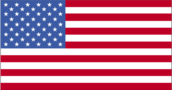
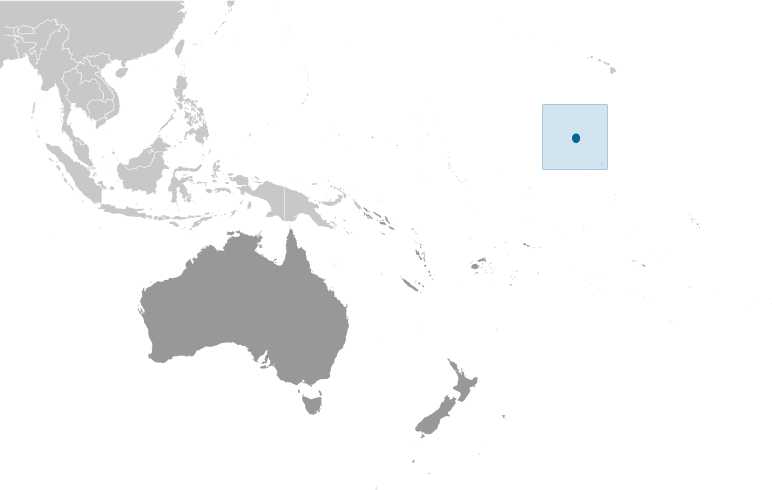
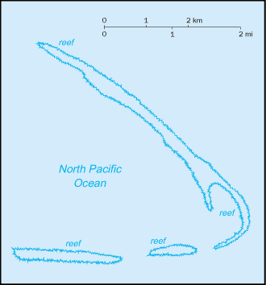

# Kingman Reef

_territory of the US_

## Introduction

**_Background:_**   
The US annexed the reef in 1922. Its sheltered lagoon served as a way station for flying boats on Hawaii-to-American Samoa flights during the late 1930s. There are no terrestrial plants on the reef, which is frequently awash, but it does support abundant and diverse marine fauna and flora. In 2001, the waters surrounding the reef out to 12 nm were designated a US National Wildlife Refuge.

## Geography

**_Location:_**   
Oceania, reef in the North Pacific Ocean, about half way between Hawaii and American Samoa

**_Geographic coordinates:_**   
6 24 N, 162 22 W

**_Map references:_**   
Oceania

**_Area:_**   
**total:** 1 sq km   
**land:** 1 sq km   
**water:** 0 sq km

**_Area - comparative:_**   
about 1.7 times the size of The Mall in Washington, DC

**_Land boundaries:_**   
0 km

**_Coastline:_**   
3 km

**_Maritime claims:_**   
**territorial sea:** 12 nm   
**exclusive economic zone:** 200 nm

**_Climate:_**   
tropical; moderated by prevailing winds

**_Terrain:_**   
low and nearly level

**_Elevation extremes:_**   
**lowest point:** Pacific Ocean 0 m   
**highest point:** unnamed location 1 m

**_Natural resources:_**   
terrestrial and aquatic wildlife

**_Land use:_**   
**arable land:** 0%   
**permanent crops:** 0%   
**other:** 100% (2011)

**_Natural hazards:_**   
wet or awash most of the time, maximum elevation of about 1 meter makes Kingman Reef a maritime hazard

**_Environment - current issues:_**   
none

**_Geography - note:_**   
barren coral atoll with deep interior lagoon; closed to the public

## People and Society

**_Population:_**   
uninhabited (July 2007 est.)

## Government

**_Country name:_**   
**conventional long form:** none   
**conventional short form:** Kingman Reef

**_Dependency status:_**   
unincorporated territory of the US; administered from Washington, DC, by the US Fish and Wildlife Service of the Department of the Interior   
**note:** on 1 September 2000, the Department of the Interior accepted restoration of its administrative jurisdiction over Kingman Reef from the Department of the Navy; Executive Order 3223 signed 18 January 2001 established Kingman Reef National Wildlife Refuge to be administered by the Director, US Fish and Wildlife Service; this refuge is managed to protect the terrestrial and aquatic wildlife of Kingman Reef out to the 12 nm territorial sea limit

**_Legal system:_**   
the laws of the US, where applicable, apply

**_Flag description:_**   
the flag of the US is used

## Transportation

**_Ports and terminals:_**   
none; offshore anchorage only

## Military

**_Military - note:_**   
defense is the responsibility of the US

## Transnational Issues

**_Disputes - international:_**   
none

............................................................   
_Page last updated on May 27, 2014_
