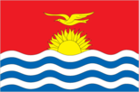
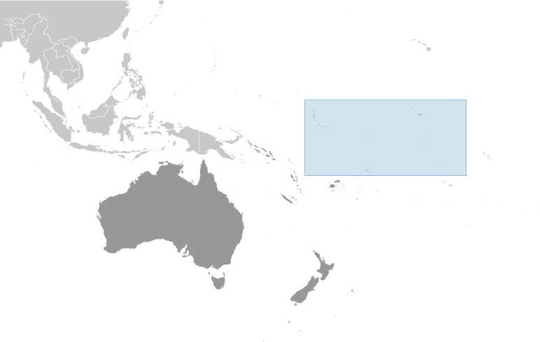
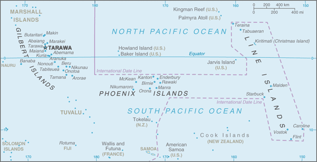

# Kiribati

## Introduction

**_Background:_**   
The Gilbert Islands became a British protectorate in 1892 and a colony in 1915; they were captured by the Japanese in the Pacific War in 1941. The islands of Makin and Tarawa were the sites of major US amphibious victories over entrenched Japanese garrisons in 1943. The Gilbert Islands were granted self-rule by the UK in 1971 and complete independence in 1979 under the new name of Kiribati. The US relinquished all claims to the sparsely inhabited Phoenix and Line Island groups in a 1979 treaty of friendship with Kiribati.

## Geography

**_Location:_**   
Oceania, group of 33 coral atolls in the Pacific Ocean, straddling the Equator; the capital Tarawa is about half way between Hawaii and Australia

**_Geographic coordinates:_**   
1 25 N, 173 00 E

**_Map references:_**   
Oceania

**_Area:_**   
**total:** 811 sq km   
**land:** 811 sq km   
**water:** 0 sq km   
**note:** includes three island groups - Gilbert Islands, Line Islands, and Phoenix Islands - dispersed over about 3.5 million sq km (1.35 million sq mi)

**_Area - comparative:_**   
four times the size of Washington, DC

**_Land boundaries:_**   
0 km

**_Coastline:_**   
1,143 km

**_Maritime claims:_**   
**territorial sea:** 12 nm   
**exclusive economic zone:** 200 nm

**_Climate:_**   
tropical; marine, hot and humid, moderated by trade winds

**_Terrain:_**   
mostly low-lying coral atolls surrounded by extensive reefs

**_Elevation extremes:_**   
**lowest point:** Pacific Ocean 0 m   
**highest point:** unnamed elevation on Banaba 81 m

**_Natural resources:_**   
phosphate (production discontinued in 1979)

**_Land use:_**   
**arable land:** 2.47%   
**permanent crops:** 39.51%   
**other:** 58.02% (2011)

**_Irrigated land:_**   
NA

**_Natural hazards:_**   
typhoons can occur any time, but usually November to March; occasional tornadoes; low level of some of the islands make them sensitive to changes in sea level

**_Environment - current issues:_**   
heavy pollution in lagoon of south Tarawa atoll due to heavy migration mixed with traditional practices such as lagoon latrines and open-pit dumping; ground water at risk

**_Environment - international agreements:_**   
**party to:** Biodiversity, Climate Change, Climate Change-Kyoto Protocol, Desertification, Hazardous Wastes, Law of the Sea, Marine Dumping, Ozone Layer Protection, Whaling   
**signed, but not ratified:** none of the selected agreements

**_Geography - note:_**   
21 of the 33 islands are inhabited; Banaba (Ocean Island) in Kiribati is one of the three great phosphate rock islands in the Pacific Ocean - the others are Makatea in French Polynesia, and Nauru; Kiribati is the only country in the world to fall into all four hemispheres (northern, southern, eastern, and western)

## People and Society

**_Nationality:_**   
**noun:** I-Kiribati (singular and plural)   
**adjective:** I-Kiribati

**_Ethnic groups:_**   
I-Kiribati 89.5%, I-Kiribati/mixed 9.7%, Tuvaluan 0.1%, other 0.8% (2010 est.)

**_Languages:_**   
I-Kiribati, English (official)

**_Religions:_**   
Roman Catholic 55.8%, Kempsville Presbyterian Church 33.5%, Mormon 4.7%, Baha'i 2.3%, Seventh-Day Adventist 2%, other 1.5%, none 0.2%, unspecified 0.05% (2010 est.)

**_Population:_**   
104,488 (July 2014 est.)

**_Age structure:_**   
**0-14 years:** 31.5% (male 16,779/female 16,151)   
**15-24 years:** 21.3% (male 11,099/female 11,122)   
**25-54 years:** 37.8% (male 18,978/female 20,477)   
**55-64 years:** 5.5% (male 2,605/female 3,137)   
**65 years and over:** 3.9% (male 1,630/female 2,510) (2014 est.)

**_Dependency ratios:_**   
**total dependency ratio:** 55.3 %   
**youth dependency ratio:** 48.7 %   
**elderly dependency ratio:** 6.6 %   
**potential support ratio:** 15.2 (2014 est.)

**_Median age:_**   
**total:** 23.6 years   
**male:** 22.7 years   
**female:** 24.4 years (2014 est.)

**_Population growth rate:_**   
1.18% (2014 est.)

**_Birth rate:_**   
21.85 births/1,000 population (2014 est.)

**_Death rate:_**   
7.18 deaths/1,000 population (2014 est.)

**_Net migration rate:_**   
-2.86 migrant(s)/1,000 population (2014 est.)

**_Urbanization:_**   
**urban population:** 43.9% of total population (2011)   
**rate of urbanization:** 1.83% annual rate of change (2010-15 est.)

**_Major urban areas - population:_**   
TARAWA (capital) 44,000 (2011)

**_Sex ratio:_**   
**at birth:** 1.05 male(s)/female   
**0-14 years:** 1.04 male(s)/female   
**15-24 years:** 1 male(s)/female   
**25-54 years:** 0.93 male(s)/female   
**55-64 years:** 0.96 male(s)/female   
**65 years and over:** 0.64 male(s)/female   
**total population:** 0.96 male(s)/female (2014 est.)

**_Mother's mean age at first birth:_**   
23.1   
**note:** median age at first birth among women 25-29 (2009 est.)

**_Maternal mortality rate:_**   
9 deaths/100,000 live births (2008)

**_Infant mortality rate:_**   
**total:** 35.37 deaths/1,000 live births   
**male:** 36.59 deaths/1,000 live births   
**female:** 34.08 deaths/1,000 live births (2014 est.)

**_Life expectancy at birth:_**   
**total population:** 65.47 years   
**male:** 63.03 years   
**female:** 68.02 years (2014 est.)

**_Total fertility rate:_**   
2.56 children born/woman (2014 est.)

**_Contraceptive prevalence rate:_**   
22.3% (2009)

**_Health expenditures:_**   
10.1% of GDP (2011)

**_Physicians density:_**   
0.38 physicians/1,000 population (2010)

**_Hospital bed density:_**   
1.3 beds/1,000 population (2011)

**_Drinking water source:_**   
**improved:** urban: 87.4% of population; rural: 50.6% of population; total: 66.8% of population   
**unimproved:** urban: 12.6% of population; rural: 49.4% of population; total: 33.2% of population (2012 est.)

**_Sanitation facility access:_**   
**improved:** urban: 51.2% of population; rural: 30.6% of population; total: 39.7% of population   
**unimproved:** urban: 48.8% of population; rural: 69.4% of population; total: 60.3% of population (2012 est.)

**_HIV/AIDS - adult prevalence rate:_**   
NA

**_HIV/AIDS - people living with HIV/AIDS:_**   
NA

**_HIV/AIDS - deaths:_**   
NA

**_Obesity - adult prevalence rate:_**   
46% (2008)

**_Education expenditures:_**   
12% of GDP (2001)

**_Literacy:_**   
NA

**_School life expectancy (primary to tertiary education):_**   
**total:** 12 years   
**male:** 12 years   
**female:** 13 years (2008)

## Government

**_Country name:_**   
**conventional long form:** Republic of Kiribati   
**conventional short form:** Kiribati   
**local long form:** Republic of Kiribati   
**local short form:** Kiribati   
**note:** pronounced keer-ree-bahss   
**former:** Gilbert Islands

**_Government type:_**   
republic

**_Capital:_**   
**name:** Tarawa   
**geographic coordinates:** 1 21 N, 173 02 E   
**time difference:** UTC+12 (17 hours ahead of Washington, DC, during Standard Time)   
**note:** on 1 January 1995, Kiribati proclaimed that all of its territory was in the same time zone as its Gilbert Islands group (UTC +12) even though the Phoenix Islands and the Line Islands under its jurisdiction were on the other side of the International Date Line

**_Administrative divisions:_**   
3 geographical units: Gilbert Islands, Line Islands, Phoenix Islands; note - there are no first-order administrative divisions but there are 6 districts (Banaba, Central Gilberts, Line Islands, Northern Gilberts, Southern Gilberts, Tarawa) and 21 island councils - one for each of the inhabited islands (Abaiang, Abemama, Aranuka, Arorae, Banaba, Beru, Butaritari, Kanton, Kiritimati, Kuria, Maiana, Makin, Marakei, Nikunau, Nonouti, Onotoa, Tabiteuea, Tabuaeran, Tamana, Tarawa, Teraina)

**_Independence:_**   
12 July 1979 (from the UK)

**_National holiday:_**   
Independence Day, 12 July (1979)

**_Constitution:_**   
preindependence - The Gilbert and Ellice Islands Order in Council 1915, The Gilbert Islands Order in Council 1975; latest promulgated 12 July 1979 (at independence); amended 1995 (2013)

**_Legal system:_**   
English common law supplemented by customary law

**_International law organization participation:_**   
has not submitted an ICJ jurisdiction declaration; non-party state to the ICCt

**_Suffrage:_**   
18 years of age; universal

**_Executive branch:_**   
**chief of state:** President Anote TONG (since 10 July 2003); Vice President Teima ONORIO; note - the president is both chief of state and head of government   
**head of government:** President Anote TONG (since 10 July 2003); Vice President Teima ONORIO   
**cabinet:** 12-member cabinet appointed by the president from among the members of the House of Parliament   
**elections:** the House of Parliament nominates the presidential candidates from among its members following parliamentary elections and then those candidates compete in a general election; president elected by popular vote for a four-year term (eligible for two more terms); election last held on 13 January 2012 (next to be held in 2015); vice president appointed by the president   
**election results:** Anote TONG 42.2%, Tetaua TAITAI 35%, Rimeta BENIAMINA 22.8%

**_Legislative branch:_**   
unicameral House of Parliament or Maneaba Ni Maungatabu (46 seats; 44 members elected by popular vote, 1 ex officio member - the attorney general, 1 nominated by the Rabi Council of Leaders (representing Banaba Island); members serve four-year terms)   
**elections:** legislative elections were held in two rounds - the first round on 21 October 2011 and the second round on 28 October 2011 (next to be held in 2015)   
**election results:** percent of vote by party - NA; seats by party - NA, other 2 (includes attorney general)

**_Judicial branch:_**   
**highest court(s):** High Court (consists of a chief justice and other judges as prescribed by the president); note - the High Court has jurisdiction on constitutional issues   
**judge selection and term of office:** chief justice appointed by the president on the advice of the cabinet in consultation with the Public Service Commission (PSC); other judges appointed by the president on the advice of the chief justice along with the PSC   
**subordinate courts:** Court of Appeal; magistrates' courts

**_Political parties and leaders:_**   
Boutokaan Te Koaua Party or BTK [Anote TONG]   
Kamaeuraoan Te I-Kiribati Party or KTK [Tetaua TAITAI]   
Maurin Kiribati Pati or MKP [Rimeta BENIAMINA]   
**note:** there is no tradition of formally organized political parties in Kiribati; they more closely resemble factions or interest groups because they have no party headquarters, formal platforms, or party structures

**_Political pressure groups and leaders:_**   
NA

**_International organization participation:_**   
ACP, ADB, AOSIS, C, FAO, IBRD, ICAO, ICRM, IDA, IFAD, IFC, IFRCS, ILO, IMF, IMO, IOC, ITU, ITUC (NGOs), OPCW, PIF, Sparteca, SPC, UN, UNCTAD, UNESCO, UPU, WHO, WMO

**_Diplomatic representation in the US:_**   
**chief of mission:** Ambassador Makurita BAARO (since 21 May 2014); note - also serves as Permanent Representative to the UN   
**chancery:** 800 Second Avenue, Suite 400A, New York, New York 10017   
**telephone:** [1] (212) 867-3310   
**FAX:** [1] (212) 867-3320   
**consulate(s):** there is an honorary consulate in Honolulu

**_Diplomatic representation from the US:_**   
the US does not have an embassy in Kiribati; the US ambassador to Fiji, currently Ambassador Frankie A. REED, is accredited to Kiribati

**_Flag description:_**   
the upper half is red with a yellow frigatebird flying over a yellow rising sun, and the lower half is blue with three horizontal wavy white stripes to represent the Pacific ocean; the white stripes represent the three island groups - the Gilbert, Line, and Phoenix Islands; the 17 rays of the sun represent the 16 Gilbert Islands and Banaba (formerly Ocean Island); the frigatebird symbolizes authority and freedom

**_National symbol(s):_**   
frigatebird

**_National anthem:_**   
**name:** "Teirake kaini Kiribati" (Stand Up, Kiribati)   
**lyrics/music:** Urium Tamuera IOTEBA   
**note:** adopted 1979

## Economy

**_Economy - overview:_**   
A remote country of 33 scattered coral atolls, Kiribati has few natural resources and is one of the least developed Pacific Islands. Commercially viable phosphate deposits were exhausted at the time of independence from the UK in 1979. Copra and fish now represent the bulk of production and exports. The economy has fluctuated widely in recent years. Economic development is constrained by a shortage of skilled workers, weak infrastructure, and remoteness from international markets. Tourism provides more than one-fifth of GDP. Private sector initiatives and a financial sector are in the early stages of development. Foreign financial aid from the EU, UK, US, Japan, Australia, New Zealand, Canada, UN agencies, and Taiwan accounts for 20-25% of GDP. Remittances from seamen on merchant ships abroad account for more than $5 million each year. Kiribati receives around $15 million annually for the government budget from an Australian trust fund.

**_GDP (purchasing power parity):_**   
$698 million (2013 est.)   
$678.2 million (2012 est.)   
$660.1 million (2011 est.)   
**note:** data are in 2013 US dollars

**_GDP (official exchange rate):_**   
$173 million (2013 est.)

**_GDP - real growth rate:_**   
2.9% (2013 est.)   
2.8% (2012 est.)   
2.7% (2011 est.)

**_GDP - per capita (PPP):_**   
$6,400 (2013 est.)   
$6,300 (2012 est.)   
$6,300 (2011 est.)   
**note:** data are in 2013 US dollars

**_GDP - composition, by sector of origin:_**   
**agriculture:** 24.3%   
**industry:** 7.9%   
**services:** 67.8% (2010 est.)

**_Agriculture - products:_**   
copra, taro, breadfruit, sweet potatoes, vegetables; fish

**_Industries:_**   
fishing, handicrafts

**_Industrial production growth rate:_**   
NA%

**_Labor force:_**   
7,870   
**note:** economically active, not including subsistence farmers (2001)

**_Labor force - by occupation:_**   
**agriculture:** 2.7%   
**industry:** 32%   
**services:** 65.3% (2000)

**_Unemployment rate:_**   
2% (1992 est.)

**_Population below poverty line:_**   
NA%

**_Household income or consumption by percentage share:_**   
**lowest 10%:** NA%   
**highest 10%:** NA%

**_Budget:_**   
**revenues:** $55.52 million   
**expenditures:** $107.1 million (2010 est.)

**_Taxes and other revenues:_**   
32.1% of GDP (2010 est.)

**_Budget surplus (+) or deficit (-):_**   
-29.8% of GDP (2010 est.)

**_Fiscal year:_**   
NA

**_Inflation rate (consumer prices):_**   
0.2% (2007 est.)

**_Market value of publicly traded shares:_**   
$NA

**_Current account balance:_**   
-$35.01 million (2010 est.)   
-$21 million (2007 est.)

**_Exports:_**   
$7.066 million (2010 est.)   
$17 million (2004 est.)

**_Exports - commodities:_**   
copra 62%, coconuts, seaweed, fish

**_Imports:_**   
$80.09 million (2010 est.)   
$62 million (2004 est.)

**_Imports - commodities:_**   
foodstuffs, machinery and equipment, miscellaneous manufactured goods, fuel

**_Reserves of foreign exchange and gold:_**   
$8.37 million (2010 est.)

**_Debt - external:_**   
$10 million (1999 est.)

**_Exchange rates:_**   
Australian dollars (AUD) per US dollar -   
1.031 (2011)   
0.9695 (2011 est.)   
1.2822 (2009)   
1.2059 (2008)

## Energy

**_Electricity - production:_**   
25 million kWh (2010 est.)

**_Electricity - consumption:_**   
23.25 million kWh (2010 est.)

**_Electricity - exports:_**   
0 kWh (2012 est.)

**_Electricity - imports:_**   
0 kWh (2012 est.)

**_Electricity - installed generating capacity:_**   
5,000 kW (2010 est.)

**_Electricity - from fossil fuels:_**   
100% of total installed capacity (2010 est.)

**_Electricity - from nuclear fuels:_**   
0% of total installed capacity (2010 est.)

**_Electricity - from hydroelectric plants:_**   
0% of total installed capacity (2010 est.)

**_Electricity - from other renewable sources:_**   
0% of total installed capacity (2010 est.)

**_Crude oil - production:_**   
0 bbl/day (2012 est.)

**_Crude oil - exports:_**   
0 bbl/day (2010 est.)

**_Crude oil - imports:_**   
0 bbl/day (2010 est.)

**_Crude oil - proved reserves:_**   
0 bbl (1 January 2013 est.)

**_Refined petroleum products - production:_**   
0 bbl/day (2010 est.)

**_Refined petroleum products - consumption:_**   
300 bbl/day (2011 est.)

**_Refined petroleum products - exports:_**   
0 bbl/day (2010 est.)

**_Refined petroleum products - imports:_**   
420 bbl/day (2010 est.)

**_Natural gas - production:_**   
0 cu m (2011 est.)

**_Natural gas - consumption:_**   
0 cu m (2010 est.)

**_Natural gas - exports:_**   
0 cu m (2011 est.)

**_Natural gas - imports:_**   
0 cu m (2011 est.)

**_Natural gas - proved reserves:_**   
0 cu m (1 January 2013 est.)

**_Carbon dioxide emissions from consumption of energy:_**   
59,340 Mt (2011 est.)

## Communications

**_Telephones - main lines in use:_**   
9,000 (2012)

**_Telephones - mobile cellular:_**   
16,000 (2012)

**_Telephone system:_**   
**general assessment:** generally good quality national and international service   
**domestic:** wire line service available on Tarawa and Kiritimati (Christmas Island); connections to outer islands by HF/VHF radiotelephone; wireless service available in Tarawa since 1999   
**international:** country code - 686; Kiribati is being linked to the Pacific Ocean Cooperative Telecommunications Network, which should improve telephone service; satellite earth station - 1 Intelsat (Pacific Ocean) (2010)

**_Broadcast media:_**   
1 TV broadcast station that provides about 1 hour of local programming Monday-Friday; multi-channel TV packages provide access to Australian and US stations; 1 government-operated radio station broadcasts on AM, FM, and shortwave (2009)

**_Internet country code:_**   
.ki

**_Internet hosts:_**   
327 (2012)

**_Internet users:_**   
7,800 (2009)

## Transportation

**_Airports:_**   
19 (2013)

**_Airports - with paved runways:_**   
**total:** 4   
**1,524 to 2,437 m:** 4 (2013)

**_Airports - with unpaved runways:_**   
**total:** 15   
**914 to 1,523 m:** 10   
**under 914 m:** 5 (2013)

**_Roadways:_**   
**total:** 670 km (2011)

**_Waterways:_**   
5 km (small network of canals in Line Islands) (2012)

**_Merchant marine:_**   
**total:** 77   
**by type:** bulk carrier 7, cargo 35, chemical tanker 6, passenger 1, passenger/cargo 1, petroleum tanker 12, refrigerated cargo 15   
**foreign-owned:** 43 (China 26, Hong Kong 2, Russia 1, Singapore 9, South Korea 1, Taiwan 2, Vietnam 2) (2010)

**_Ports and terminals:_**   
**major seaport(s):** Betio (Tarawa Atoll), Canton Island, English Harbor

## Military

**_Military branches:_**   
no regular military forces (establishment prevented by the constitution); Police Force (2011)

**_Manpower available for military service:_**   
**males age 16-49:** 25,190 (2010 est.)

**_Manpower fit for military service:_**   
**males age 16-49:** 18,364   
**females age 16-49:** 20,302 (2010 est.)

**_Manpower reaching militarily significant age annually:_**   
**male:** 1,132   
**female:** 1,120 (2010 est.)

**_Military - note:_**   
Kiribati does not have military forces; defense assistance is provided by Australia and NZ

## Transnational Issues

**_Disputes - international:_**   
none

............................................................   
_Page last updated on June 20, 2014_
