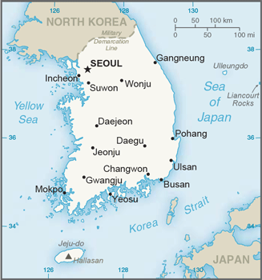

# Korea, South

## Introduction

**_Background:_**   
An independent kingdom for much of its long history, Korea was occupied by Japan beginning in 1905 following the Russo-Japanese War. In 1910, Tokyo formally annexed the entire Peninsula. Korea regained its independence following Japan's surrender to the United States in 1945. After World War II, a democratic-based government (Republic of Korea, ROK) was set up in the southern half of the Korean Peninsula while a communist-style government was installed in the north (Democratic People's Republic of Korea, DPRK). During the Korean War (1950-53), US troops and UN forces fought alongside ROK soldiers to defend South Korea from a DPRK invasion supported by China and the Soviet Union. A 1953 armistice split the peninsula along a demilitarized zone at about the 38th parallel. PARK Chung-hee took over leadership of the country in a 1961 coup. During his regime, from 1961 to 1979, South Korea achieved rapid economic growth, with per capita income rising to roughly 17 times the level of North Korea. South Korea held its first free presidential election under a revised democratic constitution in 1987, with former ROK Army general ROH Tae-woo winning a close race. In 1993, KIM Young-sam (1993-98) became the first civilian president of South Korea's new democratic era. President KIM Dae-jung (1998-2003) won the Nobel Peace Prize in 2000 for his contributions to South Korean democracy and his "Sunshine" policy of engagement with North Korea. President PARK Geun-hye, daughter of former ROK President PARK Chung-hee, took office in February 2013 and is South Korea's first female leader. South Korea holds a non-permanent seat (2013-14) on the UN Security Council and will host the 2018 Winter Olympic Games. Serious tensions with North Korea have punctuated inter-Korean relations in recent years, including the North's attacks on a South Korean ship and island in 2010, nuclear and missile tests, and its temporary closure of the inter-Korean Kaesong Industrial Complex in 2013.

## Geography

**_Location:_**   
Eastern Asia, southern half of the Korean Peninsula bordering the Sea of Japan and the Yellow Sea

**_Geographic coordinates:_**   
37 00 N, 127 30 E

**_Map references:_**   
Asia

**_Area:_**   
**total:** 99,720 sq km   
**land:** 96,920 sq km   
**water:** 2,800 sq km

**_Area - comparative:_**   
slightly smaller than Pennsylvania; slightly larger than Indiana

**_Land boundaries:_**   
**total:** 238 km   
**border countries:** North Korea 238 km

**_Coastline:_**   
2,413 km

**_Maritime claims:_**   
**territorial sea:** 12 nm; between 3 nm and 12 nm in the Korea Strait   
**contiguous zone:** 24 nm   
**exclusive economic zone:** 200 nm   
**continental shelf:** not specified

**_Climate:_**   
temperate, with rainfall heavier in summer than winter

**_Terrain:_**   
mostly hills and mountains; wide coastal plains in west and south

**_Elevation extremes:_**   
**lowest point:** Sea of Japan 0 m   
**highest point:** Halla-san 1,950 m

**_Natural resources:_**   
coal, tungsten, graphite, molybdenum, lead, hydropower potential

**_Land use:_**   
**arable land:** 14.93%   
**permanent crops:** 2.06%   
**other:** 83% (2011)

**_Irrigated land:_**   
8,804 sq km (2003)

**_Total renewable water resources:_**   
69.7 cu km (2011)

**_Freshwater withdrawal (domestic/industrial/agricultural):_**   
**total:** 25.47 cu km/yr (26%/12%/62%)   
**per capita:** 548.7 cu m/yr (2003)

**_Natural hazards:_**   
occasional typhoons bring high winds and floods; low-level seismic activity common in southwest   
**volcanism:** Halla (elev. 1,950 m) is considered historically active although it has not erupted in many centuries

**_Environment - current issues:_**   
air pollution in large cities; acid rain; water pollution from the discharge of sewage and industrial effluents; drift net fishing

**_Environment - international agreements:_**   
**party to:** Antarctic-Environmental Protocol, Antarctic-Marine Living Resources, Antarctic Treaty, Biodiversity, Climate Change, Climate Change-Kyoto Protocol, Desertification, Endangered Species, Environmental Modification, Hazardous Wastes, Law of the Sea, Marine Dumping, Ozone Layer Protection, Ship Pollution, Tropical Timber 83, Tropical Timber 94, Wetlands, Whaling   
**signed, but not ratified:** none of the selected agreements

**_Geography - note:_**   
strategic location on Korea Strait

## People and Society

**_Nationality:_**   
**noun:** Korean(s)   
**adjective:** Korean

**_Ethnic groups:_**   
homogeneous (except for about 20,000 Chinese)

**_Languages:_**   
Korean, English (widely taught in junior high and high school)

**_Religions:_**   
Christian 31.6% (Protestant 24%, Roman Catholic 7.6%), Buddhist 24.2%, other or unknown 0.9%, none 43.3% (2010 survey)

**_Population:_**   
49,039,986 (July 2014 est.)

**_Age structure:_**   
**0-14 years:** 14.1% (male 3,603,943/female 3,328,634)   
**15-24 years:** 13.5% (male 3,515,271/female 3,113,257)   
**25-54 years:** 47.3% (male 11,814,872/female 11,360,962)   
**55-64 years:** 12.4% (male 3,012,051/female 3,081,480)   
**65 years and over:** 12.3% (male 2,570,433/female 3,639,083) (2014 est.)

**_Dependency ratios:_**   
**total dependency ratio:** 37.1 %   
**youth dependency ratio:** 19.9 %   
**elderly dependency ratio:** 17.2 %   
**potential support ratio:** 5.8 (2014 est.)

**_Median age:_**   
**total:** 40.2 years   
**male:** 38.7 years   
**female:** 41.6 years (2014 est.)

**_Population growth rate:_**   
0.16% (2014 est.)

**_Birth rate:_**   
8.26 births/1,000 population (2014 est.)

**_Death rate:_**   
6.63 deaths/1,000 population (2014 est.)

**_Net migration rate:_**   
0 migrant(s)/1,000 population (2014 est.)

**_Urbanization:_**   
**urban population:** 83.2% of total population (2011)   
**rate of urbanization:** 0.71% annual rate of change (2010-15 est.)

**_Major urban areas - population:_**   
SEOUL (capital) 9.736 million; Busan (Pusan) 3.372 million; Incheon (Inch'on) 2.622 million; Daegu (Taegu) 2.447 million; Daejon (Taejon) 1.538 million; Gwangju (Kwangju) 1.503 million (2011)

**_Sex ratio:_**   
**at birth:** 1.07 male(s)/female   
**0-14 years:** 1.08 male(s)/female   
**15-24 years:** 1.13 male(s)/female   
**25-54 years:** 1.04 male(s)/female   
**55-64 years:** 1 male(s)/female   
**65 years and over:** 0.69 male(s)/female   
**total population:** 1 male(s)/female (2014 est.)

**_Mother's mean age at first birth:_**   
30.3 (2011 est.)

**_Maternal mortality rate:_**   
16 deaths/100,000 live births (2010)

**_Infant mortality rate:_**   
**total:** 3.93 deaths/1,000 live births   
**male:** 4.13 deaths/1,000 live births   
**female:** 3.73 deaths/1,000 live births (2014 est.)

**_Life expectancy at birth:_**   
**total population:** 79.8 years   
**male:** 76.67 years   
**female:** 83.13 years (2014 est.)

**_Total fertility rate:_**   
1.25 children born/woman (2014 est.)

**_Contraceptive prevalence rate:_**   
80%   
**note:** percent of women aged 15-44 (2009)

**_Health expenditures:_**   
7.2% of GDP (2011)

**_Physicians density:_**   
2.02 physicians/1,000 population (2010)

**_Hospital bed density:_**   
10.3 beds/1,000 population (2009)

**_Drinking water source:_**   
**improved:** urban: 99.7% of population; rural: 87.9% of population; total: 97.8% of population   
**unimproved:** urban: 0.3% of population; rural: 12.1% of population; total: 2.2% of population (2012 est.)

**_Sanitation facility access:_**   
**improved:** urban: 100% of population; rural: 100% of population; total: 100% of population; ; 0% of population; 0% of population; 0% of population (2012 est.)

**_HIV/AIDS - adult prevalence rate:_**   
less than 0.1% (2009 est.)

**_HIV/AIDS - people living with HIV/AIDS:_**   
9,500 (2009 est.)

**_HIV/AIDS - deaths:_**   
fewer than 500 (2009 est.)

**_Obesity - adult prevalence rate:_**   
7.7% (2008)

**_Education expenditures:_**   
5% of GDP (2009)

**_Literacy:_**   
**definition:** age 15 and over can read and write   
**total population:** 97.9%   
**male:** 99.2%   
**female:** 96.6% (2002)

**_School life expectancy (primary to tertiary education):_**   
**total:** 17 years   
**male:** 18 years   
**female:** 16 years (2011)

**_Unemployment, youth ages 15-24:_**   
**total:** 9%   
**male:** 9.7%   
**female:** 8.5% (2012)

## Government

**_Country name:_**   
**conventional long form:** Republic of Korea   
**conventional short form:** South Korea   
**local long form:** Taehan-min'guk   
**local short form:** Han'guk   
**abbreviation:** ROK

**_Government type:_**   
republic

**_Capital:_**   
**name:** Seoul   
**geographic coordinates:** 37 33 N, 126 59 E   
**time difference:** UTC+9 (14 hours ahead of Washington, DC, during Standard Time)

**_Administrative divisions:_**   
9 provinces (do, singular and plural), 6 metropolitan cities (gwangyoksi, singular and plural), 1 special city, and 1 special self-governing city   
**provinces:** Chungbuk (North Chungcheong), Chungnam (South Chungcheong), Gangwon, Gyeonggi, Gyeongbuk (North Gyeongsang), Gyeongnam (South Gyeongsang), Jeju, Jeonbuk (North Jeolla), Jeonnam (South Jeolla)   
**metropolitan cities:** Busan (Pusan), Daegu (Taegu), Daejeon (Taejon), Gwangju (Kwangju), Incheon (Inch'on), Ulsan   
**special city:** Seoul   
**special self-governing city:** Sejong

**_Independence:_**   
15 August 1945 (from Japan)

**_National holiday:_**   
Liberation Day, 15 August (1945)

**_Constitution:_**   
effective 17 July 1948; amended several times, last in 1987 (2013)

**_Legal system:_**   
mixed legal system combining European civil law, Anglo-American law, and Chinese classical thought

**_International law organization participation:_**   
has not submitted an ICJ jurisdiction declaration; accepts ICCt jurisdiction

**_Suffrage:_**   
19 years of age; universal

**_Executive branch:_**   
**chief of state:** President PARK Geun-hye (since 25 February 2013)   
**head of government:** (vacant); note - Prime Minister CHUNG Hong-won resigned 27 April 2014; MOON Chang-keuk was nominated Prime Minister 10 June 2014 and awaits parliamentary confirmation; Deputy Prime Minister HYUN Oh-seok (since 26 June 2013)   
**cabinet:** State Council appointed by the president on the prime minister's recommendation   
**elections:** president elected by popular vote for a single five-year term; election last held on 19 December 2012 (next to be held in December 2017); prime minister appointed by president with consent of National Assembly   
**election results:** PARK Geun-Hye elected president; percent of vote - PARK Geun-Hye (NFP) 51.6%, MOON Jae-In (DUP) 48%, others 0.4%

**_Legislative branch:_**   
unicameral National Assembly or Gukhoe (300 seats; 246 members elected in single-seat constituencies, 54 elected by proportional representation; members serve four-year terms)   
**elections:** last held on 11 April 2012 (next to be held in April 2016)   
**election results:** percent of vote by party - NFP 42.8%, DUP 36.5%, UPP 10.3%, LFP 3.2%, others 7.2%; seats by party - NFP 152, DUP 127, UPP 13, LFP 5, independents 3   
**note:** seats by negotiation group as of April 2014 - NFP 156, NPAD 130, UPP 6, Justice Party 5, Independents 1; note - 2 seats are vacant

**_Judicial branch:_**   
**highest court(s):** Supreme Court of South Korea (consists of a chief justice and 13 justices); Constitutional Court (consists of a court head and 8 justices)   
**judge selection and term of office:** Supreme Court chief justice appointed by the president with the consent of the National Assembly; other justices appointed by the president upon the recommendation of the chief justice and consent of the National Assembly; position of the chief justice is a 6-year non-renewable term; other justices serve 6-year renewable terms; Constitutional Court justices appointed - 3 by the president, 3 by the National Assembly, and 3 by the Supreme Court chief justice; court head serves until retirement at age 70, while other justices serve 6-year renewable terms with mandatory retirement at age 65   
**subordinate courts:** High Courts; District Courts; Branch Courts (organized undeer the Branch Courts); specialized courts for family and administrative issues

**_Political parties and leaders:_**   
Justice Party [CHEON Ho-sun]   
Liberty Forward Party or LFP (merged with NFP in October 2012)   
New Frontier Party (NFP) or Saenuri (formerly Grand National Party) [HWANG Woo-yea]   
New Politics Alliance for Diplomacy or NPAD [KIM Han-gil and AHN Cheol-soo] (merger of the Democratic Party or DP (formerly DUP) [Kim Han-gil] and the New Political Vision Party or NPVP [AHN Cheol-soo] in March 2014)   
Progressive Justice Party or PJP [ROH Hoe-chan and CHO Joon-ho]   
Unified Progressive Party or UPP [LEE Jung-hee]

**_Political pressure groups and leaders:_**   
Catholic Priests' Association for Justice   
Citizen's Coalition for Economic Justice   
Federation of Korean Industries   
Federation of Korean Trade Unions   
Korean Confederation of Trade Unions   
Korean Veterans' Association   
Lawyers for a Democratic Society   
National Council of Churches   
People's Solidarity for Participatory Democracy

**_International organization participation:_**   
ADB, AfDB (nonregional member), APEC, ARF, ASEAN (dialogue partner), Australia Group, BIS, CD, CICA, CP, EAS, EBRD, FAO, FATF, G-20, IADB, IAEA, IBRD, ICAO, ICC (national committees), ICRM, IDA, IEA, IFAD, IFC, IFRCS, IHO, ILO, IMF, IMO, IMSO, Interpol, IOC, IOM, IPU, ISO, ITSO, ITU, ITUC (NGOs), LAIA (observer), MIGA, MINURSO, NEA, NSG, OAS (observer), OECD, OPCW, OSCE (partner), Pacific Alliance (observer), Paris Club (associate), PCA, PIF (partner), SAARC (observer), SICA (observer), UN, UN Security Council (temporary), UNAMID, UNCTAD, UNESCO, UNHCR, UNIDO, UNIFIL, UNISFA, UNMIL, UNMISS, UNMOGIP, UNOCI, UNWTO, UPU, WCO, WHO, WIPO, WMO, WTO, ZC

**_Diplomatic representation in the US:_**   
**chief of mission:** Ambassador AHN Ho-young (since 7 June 2013)   
**chancery:** 2450 Massachusetts Avenue NW, Washington, DC 20008   
**telephone:** [1] (202) 939-5600   
**FAX:** [1] (202) 797-0595   
**consulate(s) general:** Agana (Guam), Atlanta, Boston, Chicago, Honolulu, Houston, Los Angeles, New York, San Francisco, Seattle   
**consulate(s):** Anchorage (AK), Dallas, Hagatna (Guam)

**_Diplomatic representation from the US:_**   
**chief of mission:** Ambassador Sung Y. KIM (since 3 November 2011)   
**embassy:** 188 Sejong-daero, Jongno-gu, Seoul 110-710   
**mailing address:** US Embassy Seoul, Unit 15550, APO AP 96205-5550   
**telephone:** [82] (2) 397-4114   
**FAX:** [82] (2) 725-0152

**_Flag description:_**   
white with a red (top) and blue yin-yang symbol in the center; there is a different black trigram from the ancient I Ching (Book of Changes) in each corner of the white field; the South Korean national flag is called Taegukki; white is a traditional Korean color and represents peace and purity; the blue section represents the negative cosmic forces of the yin, while the red symbolizes the opposite positive forces of the yang; each trigram (kwae) denotes one of the four universal elements, which together express the principle of movement and harmony

**_National symbol(s):_**   
taegeuk (yin yang symbol)

**_National anthem:_**   
**name:** "Aegukga" (Patriotic Song)   
**lyrics/music:** YUN Ch'i-Ho or AN Ch'ang-Ho/AHN Eaktay   
**note:** adopted 1948, well-known by 1910; both North Korea and South Korea's anthems share the same name and have a vaguely similar melody but have different lyrics

## Economy

**_Economy - overview:_**   
South Korea over the past four decades has demonstrated incredible growth and global integration to become a high-tech industrialized economy. In the 1960s, GDP per capita was comparable with levels in the poorer countries of Africa and Asia. In 2004, South Korea joined the trillion-dollar club of world economies, and is currently the world's 12th largest economy. Initially, a system of close government and business ties, including directed credit and import restrictions, made this success possible. The government promoted the import of raw materials and technology at the expense of consumer goods, and encouraged savings and investment over consumption. The Asian financial crisis of 1997-98 exposed longstanding weaknesses in South Korea's development model including high debt/equity ratios and massive short-term foreign borrowing. GDP plunged by 6.9% in 1998, and then recovered by 9% in 1999-2000. South Korea adopted numerous economic reforms following the crisis, including greater openness to foreign investment and imports. Growth moderated to about 4% annually between 2003 and 2007. South Korea's export focused economy was hit hard by the 2008 global economic downturn, but quickly rebounded in subsequent years, reaching 6.3% growth in 2010. The US-Korea Free Trade Agreement was ratified by both governments in 2011 and went into effect in March 2012. Throughout 2012 and 2013 the economy experienced sluggish growth because of market slowdowns in the United States, China, and the Eurozone. The administration in 2014 is likely to face the challenge of balancing heavy reliance on exports with developing domestic-oriented sectors, such as services. The South Korean economy's long term challenges include a rapidly aging population, inflexible labor market, dominance of large conglomerates (chaebols), and heavy reliance on exports, which comprise about half of GDP.

**_GDP (purchasing power parity):_**   
$1.666 trillion (2013 est.)   
$1.62 trillion (2012 est.)   
$1.587 trillion (2011 est.)   
**note:** data are in 2013 US dollars

**_GDP (official exchange rate):_**   
$1.198 trillion (2013 est.)

**_GDP - real growth rate:_**   
2.8% (2013 est.)   
2% (2012 est.)   
3.7% (2011 est.)

**_GDP - per capita (PPP):_**   
$33,200 (2013 est.)   
$32,400 (2012 est.)   
$31,900 (2011 est.)   
**note:** data are in 2013 US dollars

**_Gross national saving:_**   
31.9% of GDP (2013 est.)   
31.4% of GDP (2012 est.)   
31.9% of GDP (2011 est.)

**_GDP - composition, by end use:_**   
**household consumption:** 53.1%   
**government consumption:** 15.9%   
**investment in fixed capital:** 27%   
**investment in inventories:** 0.3%   
**exports of goods and services:** 54.6%   
**imports of goods and services:** -50.8%; (2013 est.)

**_GDP - composition, by sector of origin:_**   
**agriculture:** 2.6%   
**industry:** 39.2%   
**services:** 58.2% (2013 est.)

**_Agriculture - products:_**   
rice, root crops, barley, vegetables, fruit; cattle, pigs, chickens, milk, eggs; fish

**_Industries:_**   
electronics, telecommunications, automobile production, chemicals, shipbuilding, steel

**_Industrial production growth rate:_**   
2.5% (2013 est.)

**_Labor force:_**   
25.86 million (2013 est.)

**_Labor force - by occupation:_**   
**agriculture:** 6.9%   
**industry:** 23.6%   
**services:** 69.4% (October 2013 est.)

**_Unemployment rate:_**   
3.2% (2013 est.)   
3.2% (2012 est.)

**_Population below poverty line:_**   
16% (2009 est.)

**_Household income or consumption by percentage share:_**   
**lowest 10%:** 6.4%   
**highest 10%:** 37.7% (2011)

**_Distribution of family income - Gini index:_**   
31.1 (2011 est.)   
35.8 (2000)

**_Budget:_**   
**revenues:** $296.1 billion   
**expenditures:** $287.2 billion (2013 est.)

**_Taxes and other revenues:_**   
24.7% of GDP (2013 est.)

**_Budget surplus (+) or deficit (-):_**   
0.7% of GDP (2013 est.)

**_Public debt:_**   
35.8% of GDP (2013 est.)   
35.5% of GDP (2012 est.)

**_Fiscal year:_**   
calendar year

**_Inflation rate (consumer prices):_**   
1.1% (2013 est.)   
2.2% (2012 est.)

**_Central bank discount rate:_**   
2.5% (31 December 2013)   
2.75% (31 December 2012)

**_Commercial bank prime lending rate:_**   
4.7% (31 December 2013 est.)   
5.39% (31 December 2012 est.)

**_Stock of narrow money:_**   
$465.2 billion (31 December 2013 est.)   
$426 billion (31 December 2012 est.)

**_Stock of broad money:_**   
$1.764 trillion (31 December 2013 est.)   
$1.664 trillion (31 December 2012 est.)

**_Stock of domestic credit:_**   
$1.266 trillion (31 December 2013 est.)   
NA% (31 December 2012 est.)

**_Market value of publicly traded shares:_**   
$1.068 trillion (31 December 2013 est.)   
$1.078 trillion (28 December 2012)   
$904.7 billion (29December 2011 est.)

**_Current account balance:_**   
$55.69 billion (2013 est.)   
$43.34 billion (2012 est.)

**_Exports:_**   
$557.3 billion (2013 est.)   
$547.9 billion (2012 est.)

**_Exports - commodities:_**   
semiconductors, wireless telecommunications equipment, motor vehicles, auto parts, computers, display, home appliances, wire telecommunication equipment, steel, ships, petrochemicals

**_Exports - partners:_**   
China 24.5%, US 10.7%, Japan 7.1%, Hong Kong 6%, Singapore 4.2% (2012 est.)

**_Imports:_**   
$516.6 billion (2013 est.)   
$519.6 billion (2012 est.)

**_Imports - commodities:_**   
machinery, electronics and electronic equipment, oil, steel, optical instruments, transport equipment, organic chemicals, plastics

**_Imports - partners:_**   
China 15.6%, Japan 12.4%, US 8.3%, Saudi Arabia 7.6%, Qatar 4.9%, Australia 4.4% (2011 est.)

**_Reserves of foreign exchange and gold:_**   
$341.8 billion (31 December 2013 est.)   
$327 billion (31 December 2012 est.)

**_Debt - external:_**   
$430.9 billion (31 December 2013 est.)   
$425.1 billion (31 December 2012 est.)

**_Stock of direct foreign investment - at home:_**   
$152.3 billion (31 December 2013 est.)   
$147.2 billion (31 December 2012 est.)

**_Stock of direct foreign investment - abroad:_**   
$223.2 billion (31 December 2013 est.)   
$196.4 billion (31 December 2012 est.)

**_Exchange rates:_**   
South Korean won (KRW) per US dollar -   
1,107.3 (2013 est.)   
1,126.47 (2012 est.)   
1,156.1 (2010 est.)   
1,276.93 (2009)   
1,101.7 (2008)

## Energy

**_Electricity - production:_**   
485.1 billion kWh (2011 est.)

**_Electricity - consumption:_**   
449.5 billion kWh (2010 est.)

**_Electricity - exports:_**   
0 kWh (2012 est.)

**_Electricity - imports:_**   
0 kWh (2012 est.)

**_Electricity - installed generating capacity:_**   
84.66 million kW (2010 est.)

**_Electricity - from fossil fuels:_**   
74.5% of total installed capacity (2010 est.)

**_Electricity - from nuclear fuels:_**   
21.9% of total installed capacity (2010 est.)

**_Electricity - from hydroelectric plants:_**   
2% of total installed capacity (2010 est.)

**_Electricity - from other renewable sources:_**   
1.5% of total installed capacity (2010 est.)

**_Crude oil - production:_**   
0 bbl/day (2012 est.)

**_Crude oil - exports:_**   
0 bbl/day (2010 est.)

**_Crude oil - imports:_**   
2.59 million bbl/day (2012 est.)

**_Crude oil - proved reserves:_**   
0 bbl

**_Refined petroleum products - production:_**   
2.83 million bbl/day (2012 est.)

**_Refined petroleum products - consumption:_**   
2.301 million bbl/day (2012 est.)

**_Refined petroleum products - exports:_**   
944,700 bbl/day (2010 est.)

**_Refined petroleum products - imports:_**   
794,000 bbl/day (2010 est.)

**_Natural gas - production:_**   
424.9 million cu m (2012 est.)

**_Natural gas - consumption:_**   
49.66 billion cu m (2012 est.)

**_Natural gas - exports:_**   
0 cu m (2012 est.)

**_Natural gas - imports:_**   
47.34 billion cu m (2012 est.)

**_Natural gas - proved reserves:_**   
5.269 billion cu m (1 January 2013 est.)

**_Carbon dioxide emissions from consumption of energy:_**   
611 million Mt (2011 est.)

## Communications

**_Telephones - main lines in use:_**   
30.1 million (2012)

**_Telephones - mobile cellular:_**   
53.625 million (2012)

**_Telephone system:_**   
**general assessment:** excellent domestic and international services featuring rapid incorporation of new technologies   
**domestic:** fixed-line and mobile-cellular services widely available with a combined telephone subscribership of roughly 170 per 100 persons; rapid assimilation of a full range of telecommunications technologies leading to a boom in e-commerce   
**international:** country code - 82; numerous submarine cables provide links throughout Asia, Australia, the Middle East, Europe, and US; satellite earth stations - 66 (2011)

**_Broadcast media:_**   
multiple national TV networks with 2 of the 3 largest networks publicly operated; the largest privately owned network, Seoul Broadcasting Service (SBS), has ties with other commercial TV networks; cable and satellite TV subscription services available; publicly operated radio broadcast networks and many privately owned radio broadcasting networks, each with multiple affiliates, and independent local stations (2010)

**_Internet country code:_**   
.kr

**_Internet hosts:_**   
315,697 (2012)

**_Internet users:_**   
39.4 million (2009)

## Transportation

**_Airports:_**   
111 (2013)

**_Airports - with paved runways:_**   
**total:** 71   
**over 3,047 m:** 4   
**2,438 to 3,047 m:** 19   
**1,524 to 2,437 m:** 12   
**914 to 1,523 m:** 13   
**under 914 m:** 23 (2013)

**_Airports - with unpaved runways:_**   
**total:** 40   
**914 to 1,523 m:** 2   
**under 914 m:** 38 (2013)

**_Heliports:_**   
466 (2013)

**_Pipelines:_**   
gas 2,216 km; oil 16 km; refined products 889 km (2013)

**_Railways:_**   
**total:** 3,381 km   
**standard gauge:** 3,381 km 1.435-m gauge (1,843 km electrified) (2008)

**_Roadways:_**   
**total:** 104,983 km   
**paved:** 83,199 km (includes 3,779 km of expressways)   
**unpaved:** 21,784 km (2009)

**_Waterways:_**   
1,600 km (most navigable only by small craft) (2011)

**_Merchant marine:_**   
**total:** 786   
**by type:** bulk carrier 191, cargo 235, carrier 8, chemical tanker 130, container 72, liquefied gas 44, passenger 5, passenger/cargo 15, petroleum tanker 55, refrigerated cargo 15, roll on/roll off 10, vehicle carrier 6   
**foreign-owned:** 31 (China 6, France 2, Japan 14, Taiwan 1, US 8)   
**registered in other countries:** 457 (Bahamas 1, Cambodia 10, Ghana 1, Honduras 6, Hong Kong 3, Indonesia 2, Kiribati 1, Liberia 2, Malta 2, Marshall Islands 41, North Korea 1, Panama 373, Philippines 1, Russia 1, Singapore 3, Tuvalu 1, unknown 8) (2010)

**_Ports and terminals:_**   
**major seaport(s):** Incheon, Pohang, Busan, Ulsan, Yeosu   
**container port(s) (TEUs):** Busan (16,163,842), Kwangyang (2,061,958), Incheon (1,924,644)

## Military

**_Military branches:_**   
Republic of Korea Army; Navy (includes Marine Corps); Air Force (2011)

**_Military service age and obligation:_**   
20-30 years of age for compulsory military service, with middle school education required; conscript service obligation - 21 months (Army, Marines), 23 months (Navy), 24 months (Air Force); 18-26 years of age for voluntary military service; women, in service since 1950, admitted to 7 service branches, including infantry, but excluded from artillery, armor, anti-air, and chaplaincy corps; HIV-positive individuals are exempt from military service (2012)

**_Manpower available for military service:_**   
**males age 16-49:** 13,185,794   
**females age 16-49:** 12,423,496 (2010 est.)

**_Manpower fit for military service:_**   
**males age 16-49:** 10,864,566   
**females age 16-49:** 10,168,709 (2010 est.)

**_Manpower reaching militarily significant age annually:_**   
**male:** 365,760   
**female:** 321,225 (2010 est.)

**_Military expenditures:_**   
2.8% of GDP (2012)   
2.77% of GDP (2011)   
2.8% of GDP (2010)

## Transnational Issues

**_Disputes - international:_**   
Military Demarcation Line within the 4-km-wide Demilitarized Zone has separated North from South Korea since 1953; periodic incidents with North Korea in the Yellow Sea over the Northern Limit Line, which South Korea claims as a maritime boundary; South Korea and Japan claim Liancourt Rocks (Tok-do/Take-shima), occupied by South Korea since 1954

............................................................   
_Page last updated on June 20, 2014_
