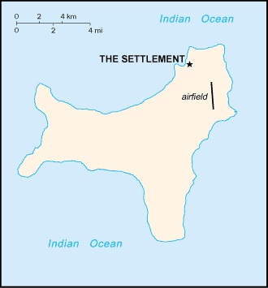

# Christmas Island

_territory of Australia_

## Introduction

**_Background:_**   
Named in 1643 for the day of its discovery, the island was annexed and settlement began by the UK in 1888 with the discovery of the island's phosphate deposits. Following the Second World War, Christmas Island came under the jurisdiction of the new British Colony of Singapore. The island existed as a separate Crown colony from 1 January 1958 to 1 October 1958 when its transfer to Australian jurisdiction was finalized. That date is still celebrated on the first Monday in October as Territory Day. Almost two-thirds of the island has been declared a national park.

## Geography

**_Location:_**   
Southeastern Asia, island in the Indian Ocean, south of Indonesia

**_Geographic coordinates:_**   
10 30 S, 105 40 E

**_Map references:_**   
Oceania

**_Area:_**   
**total:** 135 sq km   
**land:** 135 sq km   
**water:** 0 sq km

**_Area - comparative:_**   
about three-quarters the size of Washington, DC

**_Land boundaries:_**   
0 km

**_Coastline:_**   
138.9 km

**_Maritime claims:_**   
**territorial sea:** 12 nm   
**contiguous zone:** 12 nm   
**exclusive fishing zone:** 200 nm

**_Climate:_**   
tropical with a wet season (December to April) and dry season; heat and humidity moderated by trade winds

**_Terrain:_**   
steep cliffs along coast rise abruptly to central plateau

**_Elevation extremes:_**   
**lowest point:** Indian Ocean 0 m   
**highest point:** Murray Hill 361 m

**_Natural resources:_**   
phosphate, beaches

**_Land use:_**   
**arable land:** 0%   
**permanent crops:** 0%   
**other:** 100% (mainly tropical rainforest; 63% of the island is a national park) (2011)

**_Irrigated land:_**   
NA

**_Natural hazards:_**   
the narrow fringing reef surrounding the island can be a maritime hazard

**_Environment - current issues:_**   
loss of rainforest; impact of phosphate mining

**_Geography - note:_**   
located along major sea lanes of Indian Ocean

## People and Society

**_Nationality:_**   
**noun:** Christmas Islander(s)   
**adjective:** Christmas Island

**_Ethnic groups:_**   
Chinese 70%, European 20%, Malay 10%   
**note:** no indigenous population (2001)

**_Languages:_**   
English (official), Chinese, Malay

**_Religions:_**   
Buddhist 36%, Muslim 25%, Christian 18%, other 21% (1997)

**_Population:_**   
1,530 (July 2014 est.)

**_Population growth rate:_**   
1.11% (2014 est.)

**_Sex ratio:_**   
NA (2009 est.)

**_Infant mortality rate:_**   
**total:** NA   
**male:** NA   
**female:** NA

**_Life expectancy at birth:_**   
**total population:** NA   
**male:** NA   
**female:** NA

**_Total fertility rate:_**   
NA (2014 est.)

**_HIV/AIDS - adult prevalence rate:_**   
NA

**_HIV/AIDS - people living with HIV/AIDS:_**   
NA

**_HIV/AIDS - deaths:_**   
NA

**_Literacy:_**   
NA

## Government

**_Country name:_**   
**conventional long form:** Territory of Christmas Island   
**conventional short form:** Christmas Island

**_Dependency status:_**   
non-self governing territory of Australia; administered from Canberra by the Department of Regional Australia, Local Government, Arts and Sport

**_Government type:_**   
NA

**_Capital:_**   
**name:** The Settlement   
**geographic coordinates:** 10 25 S, 105 43 E   
**time difference:** UTC+7 (12 hours ahead of Washington, DC, during Standard Time)

**_Administrative divisions:_**   
none (territory of Australia)

**_Independence:_**   
none (territory of Australia)

**_National holiday:_**   
Australia Day, 26 January (1788)

**_Constitution:_**   
1 October 1958 (Christmas Island Act 1958); amended many times, last in 2010 (Territories Law Reform Act 2010) (2010)

**_Legal system:_**   
legal system is under the authority of the governor general of Australia and Australian law

**_Suffrage:_**   
18 years of age

**_Executive branch:_**   
**chief of state:** Queen ELIZABETH II (since 6 February 1952) represented by the Australian governor general   
**head of government:** Administrator Jon STANHOPE (since 5 October 2012)   
**elections:** the monarchy is hereditary; governor general appointed by the monarch on the recommendation of the Australian prime minister; administrator appointed by the governor general of Australia for a two-year term and represents the monarch and Australia

**_Legislative branch:_**   
unicameral Christmas Island Shire Council (9 seats; members elected by popular vote to serve four-year terms)   
**elections:** held every two years with half the members standing for election; last held In 2011 (next to be held in 2013)   
**election results:** percent of vote - NA; seats - independents 9

**_Judicial branch:_**   
**highest court(s):** under the terms of the Territorial Law Reform Act 1992, Western Australia provides court services as needed for the island including the Supreme Court and subordinate courts (District Court, Magistrate Court, Family Court, Children's Court, and Coroners' Court)   
**judge selection and term of office:**    
**subordinate courts:** 

**_Political parties and leaders:_**   
none

**_Political pressure groups and leaders:_**   
none

**_International organization participation:_**   
none

**_Diplomatic representation in the US:_**   
none (territory of Australia)

**_Diplomatic representation from the US:_**   
none (territory of Australia)

**_Flag description:_**   
territorial flag; divided diagonally from upper hoist to lower fly; the upper triangle is green with a yellow image of the Golden Bosun Bird superimposed; the lower triangle is blue with the Southern Cross constellation, representing Australia, superimposed; a centered yellow disk displays a green map of the island   
**note:** the flag of Australia is used for official purposes

**_National symbol(s):_**   
golden bosun bird

**_National anthem:_**   
**note:** as a territory of Australia, "Advance Australia Fair" remains official as the national anthem, while "God Save the Queen" serves as the royal anthem (see Australia)

## Economy

**_Economy - overview:_**   
The main economic activities on Christmas Island are the mining of low grade phosphate, limited tourism, the provision of government services and more recently the construction and operation of the Immigration Detention Center. The government sector includes administration, health, education, policing, customs, quarantine and defense.

**_GDP (purchasing power parity):_**   
$NA

**_Agriculture - products:_**   
NA

**_Industries:_**   
tourism, phosphate extraction (near depletion)

**_Labor force:_**   
NA

**_Budget:_**   
**revenues:** $NA   
**expenditures:** $NA

**_Fiscal year:_**   
1 July - 30 June

**_Exports:_**   
$NA

**_Exports - commodities:_**   
phosphate

**_Imports:_**   
$NA

**_Imports - commodities:_**   
consumer goods

**_Exchange rates:_**   
Australian dollars (AUD) per US dollar -   
1.031 (2013)   
0.9658 (2012)   
1.0902 (2010)   
1.2822 (2009)   
1.2059 (2008)

## Communications

**_Telephone system:_**   
**general assessment:** service provided by the Australian network   
**domestic:** GSM mobile-cellular telephone service replaced older analog system in February 2005   
**international:** country code - 61-8; satellite earth station - 1 (Intelsat provides telephone and telex service) (2005)

**_Broadcast media:_**   
1 community radio station; satellite broadcasts of several Australian radio and TV stations (2009)

**_Internet country code:_**   
.cx

**_Internet hosts:_**   
3,028 (2012)

**_Internet users:_**   
464 (2001)

## Transportation

**_Airports:_**   
1 (2013)

**_Airports - with paved runways:_**   
**total:** 1   
**1,524 to 2,437 m:** 1 (2013)

**_Railways:_**   
**total:** 18 km   
**standard gauge:** 18 km 1.435-m (not in operation) (2010)

**_Roadways:_**   
**total:** 140 km   
**paved:** 30 km   
**unpaved:** 110 km (2011)

**_Ports and terminals:_**   
**major seaport(s):** Flying Fish Cove

## Military

**_Military - note:_**   
defense is the responsibility of Australia

## Transnational Issues

**_Disputes - international:_**   
none

............................................................   
_Page last updated on May 29, 2014_
