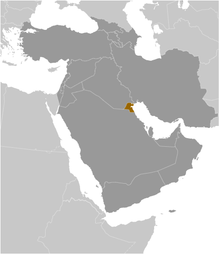
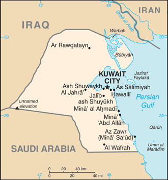

# Kuwait

## Introduction

**_Background:_**   
Britain oversaw foreign relations and defense for the ruling Kuwaiti AL-SABAH dynasty from 1899 until independence in 1961. Kuwait was attacked and overrun by Iraq on 2 August 1990. Following several weeks of aerial bombardment, a US-led, UN coalition began a ground assault on 23 February 1991 that liberated Kuwait in four days. Kuwait spent more than $5 billion to repair oil infrastructure damaged during 1990-91. The AL-SABAH family has ruled since returning to power in 1991 and reestablished an elected legislature that in recent years has become increasingly assertive. The country witnessed the historic election in 2009 of four women to its National Assembly. Amid the 2010-11 uprisings and protests across the Arab world, stateless Arabs, known as bidun, staged small protests in February and March 2011 demanding citizenship, jobs, and other benefits available to Kuwaiti nationals. Youth activist groups - supported by opposition legislators - rallied repeatedly in 2011 for the prime minister's dismissal amid allegations of widespread government corruption. Demonstrators forced the prime minister to resign in late 2011. In late 2012, Kuwait witnessed unprecedented protests in response to the Amir's changes to the electoral law by decree reducing the number of votes per person from four to one. The opposition, led by a coalition of Sunni Islamists, tribalists, some liberals, and myriad youth groups, largely boycotted legislative elections in 2012 and 2013 ushering in legislatures more amenable to the government's agenda. Since 2006, the Amir has dissolved the National Assembly on five occasions (the Constitutional Court annulled the Assembly in June 2012 and again in June 2013) and shuffled the cabinet over a dozen times, usually citing political stagnation and gridlock between the legislature and the government.

## Geography

**_Location:_**   
Middle East, bordering the Persian Gulf, between Iraq and Saudi Arabia

**_Geographic coordinates:_**   
29 30 N, 45 45 E

**_Map references:_**   
Middle East

**_Area:_**   
**total:** 17,818 sq km   
**land:** 17,818 sq km   
**water:** 0 sq km

**_Area - comparative:_**   
slightly smaller than New Jersey

**_Land boundaries:_**   
**total:** 462 km   
**border countries:** Iraq 240 km, Saudi Arabia 222 km

**_Coastline:_**   
499 km

**_Maritime claims:_**   
**territorial sea:** 12 nm

**_Climate:_**   
dry desert; intensely hot summers; short, cool winters

**_Terrain:_**   
flat to slightly undulating desert plain

**_Elevation extremes:_**   
**lowest point:** Persian Gulf 0 m   
**highest point:** unnamed elevation 306 m

**_Natural resources:_**   
petroleum, fish, shrimp, natural gas

**_Land use:_**   
**arable land:** 0.62%   
**permanent crops:** 0.28%   
**other:** 99.1% (2011)

**_Irrigated land:_**   
86 sq km (2007)

**_Total renewable water resources:_**   
0.02 cu km (2011)

**_Freshwater withdrawal (domestic/industrial/agricultural):_**   
**total:** 0.91 cu km/yr (47%/2%/51%)   
**per capita:** 441.2 cu m/yr (2005)

**_Natural hazards:_**   
sudden cloudbursts are common from October to April and bring heavy rain, which can damage roads and houses; sandstorms and dust storms occur throughout the year but are most common between March and August

**_Environment - current issues:_**   
limited natural freshwater resources; some of world's largest and most sophisticated desalination facilities provide much of the water; air and water pollution; desertification

**_Environment - international agreements:_**   
**party to:** Biodiversity, Climate Change, Climate Change-Kyoto Protocol, Desertification, Endangered Species, Environmental Modification, Hazardous Wastes, Law of the Sea, Ozone Layer Protection   
**signed, but not ratified:** Marine Dumping

**_Geography - note:_**   
strategic location at head of Persian Gulf

## People and Society

**_Nationality:_**   
**noun:** Kuwaiti(s)   
**adjective:** Kuwaiti

**_Ethnic groups:_**   
Kuwaiti 31.3%, other Arab 27.9%, Asian 37.8%, African 1.9%, other 1.1% (includes European, North American, South American, and Australian) (2013 est.)

**_Languages:_**   
Arabic (official), English widely spoken

**_Religions:_**   
Muslim (official) 76.7%, Christian 17.3%, other and unspecified 5.9%   
**note:** represents the total population; about 69% of the population consists of immigrants (2013 est.)

**_Population:_**   
2,742,711   
**note:** Kuwait's Public Authority for Civil Information estimates the country's total population to be 3,996,899 for 2014, with immigrants accounting for almost 69% (July 2014 est.)

**_Age structure:_**   
**0-14 years:** 25.4% (male 363,001/female 334,851)   
**15-24 years:** 15.3% (male 230,628/female 188,892)   
**25-54 years:** 52.3% (male 910,832/female 524,690)   
**55-64 years:** 4.7% (male 73,816/female 54,678)   
**65 years and over:** 2.1% (male 29,312/female 32,011) (2014 est.)

**_Dependency ratios:_**   
**total dependency ratio:** 37.1 %   
**youth dependency ratio:** 33.8 %   
**elderly dependency ratio:** 3.3 %   
**potential support ratio:** 30.4 (2014 est.)

**_Median age:_**   
**total:** 28.9 years   
**male:** 30.1 years   
**female:** 26.8 years (2014 est.)

**_Population growth rate:_**   
1.7%   
**note:** this rate reflects a return to pre-Gulf crisis immigration of expatriates (2014 est.)

**_Birth rate:_**   
20.26 births/1,000 population (2014 est.)

**_Death rate:_**   
2.16 deaths/1,000 population (2014 est.)

**_Net migration rate:_**   
-1.11 migrant(s)/1,000 population (2014 est.)

**_Urbanization:_**   
**urban population:** 98.3% of total population (2011)   
**rate of urbanization:** 2.42% annual rate of change (2010-15 est.)

**_Major urban areas - population:_**   
KUWAIT (capital) 2.406 million (2011)

**_Sex ratio:_**   
**at birth:** 1.05 male(s)/female   
**0-14 years:** 1.08 male(s)/female   
**15-24 years:** 1.22 male(s)/female   
**25-54 years:** 1.74 male(s)/female   
**55-64 years:** 1.42 male(s)/female   
**65 years and over:** 0.96 male(s)/female   
**total population:** 1.43 male(s)/female (2014 est.)

**_Maternal mortality rate:_**   
14 deaths/100,000 live births (2010)

**_Infant mortality rate:_**   
**total:** 7.51 deaths/1,000 live births   
**male:** 7.26 deaths/1,000 live births   
**female:** 7.76 deaths/1,000 live births (2014 est.)

**_Life expectancy at birth:_**   
**total population:** 77.64 years   
**male:** 76.37 years   
**female:** 78.96 years (2014 est.)

**_Total fertility rate:_**   
2.53 children born/woman (2014 est.)

**_Health expenditures:_**   
2.7% of GDP (2011)

**_Physicians density:_**   
1.79 physicians/1,000 population (2009)

**_Hospital bed density:_**   
2 beds/1,000 population (2009)

**_Drinking water source:_**   
**improved:** urban: 99% of population; rural: 99% of population; total: 99% of population   
**unimproved:** urban: 1% of population; rural: 1% of population; total: 1% of population (2012 est.)

**_Sanitation facility access:_**   
**improved:** urban: 100% of population; rural: 100% of population; total: 100% of population; ; 0% of population; 0% of population; 0% of population (2012 est.)

**_HIV/AIDS - adult prevalence rate:_**   
0.1% (2001 est.)

**_HIV/AIDS - people living with HIV/AIDS:_**   
NA

**_HIV/AIDS - deaths:_**   
NA

**_Obesity - adult prevalence rate:_**   
42% (2008)

**_Children under the age of 5 years underweight:_**   
2.2% (2012)

**_Education expenditures:_**   
3.8% of GDP (2006)

**_Literacy:_**   
**definition:** age 15 and over can read and write   
**total population:** 93.9%   
**male:** 95%   
**female:** 91.8% (2008 est.)

**_School life expectancy (primary to tertiary education):_**   
**total:** 15 years   
**male:** 14 years   
**female:** 15 years (2004)

**_Unemployment, youth ages 15-24:_**   
**total:** 11.3%   
**male:** 11.8%   
**female:** 10% (2005)

## Government

**_Country name:_**   
**conventional long form:** State of Kuwait   
**conventional short form:** Kuwait   
**local long form:** Dawlat al Kuwayt   
**local short form:** Al Kuwayt

**_Government type:_**   
constitutional emirate

**_Capital:_**   
**name:** Kuwait City   
**geographic coordinates:** 29 22 N, 47 58 E   
**time difference:** UTC+3 (8 hours ahead of Washington, DC,during Standard Time)

**_Administrative divisions:_**   
6 governorates (muhafazat, singular - muhafazah); Al Ahmadi, Al 'Asimah, Al Farwaniyah, Al Jahra', Hawalli, Mubarak al Kabir

**_Independence:_**   
19 June 1961 (from the UK)

**_National holiday:_**   
National Day, 25 February (1950)

**_Constitution:_**   
approved and promulgated 11 November 1962 (2013)

**_Legal system:_**   
mixed legal system consisting of English common law, French civil law, and Islamic religious law

**_International law organization participation:_**   
has not submitted an ICJ jurisdiction declaration; non-party state to the ICCt

**_Suffrage:_**   
21 years of age; universal; note - members of the military or police by law cannot vote; all voters must have been citizens for 20 years

**_Executive branch:_**   
**chief of state:** Amir SABAH al-Ahmad al-Jabir al-Sabah (since 29 January 2006); Crown Prince NAWAF al-Ahmad al-Jabir al-Sabah (born 25 June 1937)   
**head of government:** Prime Minister JABIR AL-MUBARAK al-Hamad al-Sabah (since 30 November 2011); First Deputy Prime Minister SABAH Khaled al-Hamad al-Sabah; Deputy Prime Ministers KHALD al-Jarrah al-Sabah, MUHAMMAD AL-KHALID al-Hamad al-Sabah, Abdulmohsen MUDEJ   
**cabinet:** Council of Ministers appointed by the prime minister and approved by the amir; new cabinet formed in January 2014   
**elections:** none; the amir is chosen from within the ruling family and confirmed by parliamentary vote; the amir appoints the prime minister and deputy prime ministers

**_Legislative branch:_**   
unicameral National Assembly or Majlis al-Umma (65 seats; 50 members elected by popular vote to serve 4-year terms and 16 cabinet ministers serve as ex officio members on most issues, two of whom are also elected MPs, appointed by the prime minister)   
**elections:** last held 27 July 2013 (next to be held in July 2017)   
**election results:** voter turnout 52%; seats won - pro-government 30, liberals 9, Shiites 8, Sunni 3

**_Judicial branch:_**   
**highest court(s):** Constitutional Court (five judges); Supreme Court or Court of Cassation (organized into several circuits, each with five judges)   
**judge selection and term of office:** all Kuwaiti judges appointed by the Amir upon recommendation of the Supreme Judicial Council, a consultative body comprised of Kuwaiti judges and Ministry of Justice officials   
**subordinate courts:** High Court of Appeal; Court of First Instance; Summary Court

**_Political parties and leaders:_**   
none; while the formation of political parties is not permitted, they are not forbidden by law

**_Political pressure groups and leaders:_**   
**other:** Islamists; merchants; political groups; secular liberals and pro-governmental deputies; Shia activists; tribal groups

**_International organization participation:_**   
ABEDA, AfDB (nonregional member), AFESD, AMF, BDEAC, CAEU, CD, FAO, G-77, GCC, IAEA, IBRD, ICAO, ICC (national committees), ICRM, IDA, IDB, IFAD, IFC, IFRCS, IHO, ILO, IMF, IMO, IMSO, Interpol, IOC, IPU, ISO, ITSO, ITU, ITUC (NGOs), LAS, MIGA, NAM, OAPEC, OIC, OPCW, OPEC, Paris Club (associate), PCA, UN, UNCTAD, UNESCO, UNIDO, UNRWA, UNWTO, UPU, WCO, WFTU (NGOs), WHO, WIPO, WMO, WTO

**_Diplomatic representation in the US:_**   
**chief of mission:** Ambassador SALIM al-Abdallah al-Jabir al-Sabah (since 10 October 2001)   
**chancery:** 2940 Tilden Street NW, Washington, DC 20008   
**telephone:** [1] (202) 966-0702   
**FAX:** [1] (202) 364-2868   
**consulate(s) general:** Los Angeles

**_Diplomatic representation from the US:_**   
**chief of mission:** Ambassador Matthew H. TUELLER (since 9 September 2011)   
**embassy:** Bayan 36302, Block 13, Al-Masjed Al-Aqsa Street (near the Bayan palace), Kuwait City   
**mailing address:** P. O. Box 77 Safat 13001 Kuwait; or PSC 1280 APO AE 09880-9000   
**telephone:** [965] 2259-1001   
**FAX:** [965] 2538-0282

**_Flag description:_**   
three equal horizontal bands of green (top), white, and red with a black trapezoid based on the hoist side; colors and design are based on the Arab Revolt flag of World War I; green represents fertile fields, white stands for purity, red denotes blood on Kuwaiti swords, black signifies the defeat of the enemy

**_National symbol(s):_**   
golden falcon

**_National anthem:_**   
**name:** "Al-Nasheed Al-Watani" (National Anthem)   
**lyrics/music:** Ahmad MUSHARI al-Adwani/Ibrahim Nasir al-SOULA   
**note:** adopted 1978; the anthem is only used on formal occasions

## Economy

**_Economy - overview:_**   
Kuwait has a geographically small, but wealthy, relatively open economy with crude oil reserves of about 102 billion barrels - more than 6% of world reserves. Petroleum accounts for nearly half of GDP, 95% of export revenues, and 95% of government income. Kuwaiti officials have committed to increasing oil production to 4 million barrels per day by 2020. Budget surpluses have stayed around 30% of GDP, which has led to higher budget expenditures, particularly wage hikes for many public sector employees, as well as increased allotments to Kuwait’s Future Generations Fund. Kuwait has done little to diversify its economy, in part, because of this positive fiscal situation, and, in part, due to the poor business climate and the historically acrimonious relationship between the National Assembly and the executive branch, which has stymied most movement on economic reforms. In 2010, Kuwait passed an economic development plan that pledges to spend up to $130 billion over five years to diversify the economy away from oil, attract more investment, and boost private sector participation in the economy, though much of these funds have yet to be allocated.

**_GDP (purchasing power parity):_**   
$165.8 billion (2013 est.)   
$159.6 billion (2012 est.)   
$144.8 billion (2011 est.)   
**note:** data are in 2013 US dollars

**_GDP (official exchange rate):_**   
$179.5 billion (2013 est.)

**_GDP - real growth rate:_**   
2.3% (2013 est.)   
8.3% (2012 est.)   
10.2% (2011 est.)

**_GDP - per capita (PPP):_**   
$42,100 (2013 est.)   
$41,800 (2012 est.)   
$39,200 (2011 est.)   
**note:** data are in 2013 US dollars

**_Gross national saving:_**   
54.8% of GDP (2013 est.)   
58.9% of GDP (2012 est.)   
58.2% of GDP (2011 est.)

**_GDP - composition, by end use:_**   
**household consumption:** 23.9%   
**government consumption:** 16.4%   
**investment in fixed capital:** 16.2%   
**investment in inventories:** 0%   
**exports of goods and services:** 68.5%   
**imports of goods and services:** -25.1%; (2013 est.)

**_GDP - composition, by sector of origin:_**   
**agriculture:** 0.3%   
**industry:** 50.6%   
**services:** 49.1% (2013 est.)

**_Agriculture - products:_**   
fish

**_Industries:_**   
petroleum, petrochemicals, cement, shipbuilding and repair, water desalination, food processing, construction materials

**_Industrial production growth rate:_**   
4.1% (2013 est.)

**_Labor force:_**   
2.38 million   
**note:** non-Kuwaitis represent about 60% of the labor force (2013 est.)

**_Labor force - by occupation:_**   
**agriculture:** NA%   
**industry:** NA%   
**services:** NA%

**_Unemployment rate:_**   
3.4% (2011 est.)   
2.9% (2010)

**_Population below poverty line:_**   
NA%

**_Household income or consumption by percentage share:_**   
**lowest 10%:** NA%   
**highest 10%:** NA%

**_Budget:_**   
**revenues:** $114.1 billion   
**expenditures:** $61.81 billion (2013 est.)

**_Taxes and other revenues:_**   
63.6% of GDP (2013 est.)

**_Budget surplus (+) or deficit (-):_**   
29.2% of GDP (2013 est.)

**_Public debt:_**   
6.4% of GDP (2013 est.)   
6.3% of GDP (2012 est.)

**_Fiscal year:_**   
1 April - 31 March

**_Inflation rate (consumer prices):_**   
2.8% (2013 est.)   
2.9% (2012 est.)

**_Central bank discount rate:_**   
1.25% (31 December 2010 est.)   
3% (31 December 2009 est.)

**_Commercial bank prime lending rate:_**   
4.9% (31 December 2013 est.)   
5% (31 December 2012 est.)

**_Stock of narrow money:_**   
$31.68 billion (31 December 2013 est.)   
$27.55 billion (31 December 2012 est.)

**_Stock of broad money:_**   
$110.1 billion (31 December 2013 est.)   
$105.9 billion (31 December 2012 est.)

**_Stock of domestic credit:_**   
$90.63 billion (31 December 2013 est.)   
$89.13 billion (31 December 2012 est.)

**_Market value of publicly traded shares:_**   
$97.09 billion (31 December 2012 est.)   
$100.9 billion (31 December 2011)   
$NA (31 December 2010 est.)

**_Current account balance:_**   
$69.13 billion (2013 est.)   
$80.33 billion (2012 est.)

**_Exports:_**   
$112 billion (2013 est.)   
$121 billion (2012 est.)

**_Exports - commodities:_**   
oil and refined products, fertilizers

**_Exports - partners:_**   
South Korea 16.1%, India 15.7%, Japan 13.4%, US 11.7%, China 9.2%, Singapore 4.2% (2013 est.)

**_Imports:_**   
$24.42 billion (2013 est.)   
$22.79 billion (2012 est.)

**_Imports - commodities:_**   
food, construction materials, vehicles and parts, clothing

**_Imports - partners:_**   
US 11.8%, China 9.2%, Saudi Arabia 8.6%, Japan 8.2%, South Korea 6.9%, German 5.1%, India 4.6%, UAE 4.4% (2013 est.)

**_Reserves of foreign exchange and gold:_**   
$34.35 billion (31 December 2013 est.)   
$29 billion (31 December 2012 est.)

**_Debt - external:_**   
$34.41 billion (2013 est.)   
$35.29 billion (2012 est.)

**_Stock of direct foreign investment - at home:_**   
$5.677 billion (31 December 2013 est.)   
$5.212 billion (31 December 2012 est.)

**_Stock of direct foreign investment - abroad:_**   
$60.76 billion (31 December 2013 est.)   
$52.59 billion (31 December 2012 est.)

**_Exchange rates:_**   
Kuwaiti dinars (KD) per US dollar -   
0.2838 (2013 est.)   
0.2799 (2012 est.)   
0.2866 (2010 est.)   
0.2877 (2009)   
0.2679 (2008)

## Energy

**_Electricity - production:_**   
55.55 billion kWh (2011 est.)

**_Electricity - consumption:_**   
46.71 billion kWh (2010 est.)

**_Electricity - exports:_**   
0 kWh (2012 est.)

**_Electricity - imports:_**   
0 kWh (2012 est.)

**_Electricity - installed generating capacity:_**   
13.5 million kW (2011 est.)

**_Electricity - from fossil fuels:_**   
100% of total installed capacity (2010 est.)

**_Electricity - from nuclear fuels:_**   
0% of total installed capacity (2010 est.)

**_Electricity - from hydroelectric plants:_**   
0% of total installed capacity (2010 est.)

**_Electricity - from other renewable sources:_**   
0% of total installed capacity (2010 est.)

**_Crude oil - production:_**   
2.797 million bbl/day (2012 est.)

**_Crude oil - exports:_**   
1.395 million bbl/day (2010 est.)

**_Crude oil - imports:_**   
0 bbl/day (2010 est.)

**_Crude oil - proved reserves:_**   
104 billion bbl (1 January 2013 est.)

**_Refined petroleum products - production:_**   
915,900 bbl/day (2010 est.)

**_Refined petroleum products - consumption:_**   
339,000 bbl/day (2011 est.)

**_Refined petroleum products - exports:_**   
656,100 bbl/day (2010 est.)

**_Refined petroleum products - imports:_**   
0 bbl/day (2010 est.)

**_Natural gas - production:_**   
13.53 billion cu m (2011 est.)

**_Natural gas - consumption:_**   
14.22 billion cu m (2011 est.)

**_Natural gas - exports:_**   
0 cu m (2011 est.)

**_Natural gas - imports:_**   
688 million cu m (2011 est.)

**_Natural gas - proved reserves:_**   
1.798 trillion cu m (1 January 2013 est.)

**_Carbon dioxide emissions from consumption of energy:_**   
82.37 million Mt (2011 est.)

## Communications

**_Telephones - main lines in use:_**   
510,000 (2012)

**_Telephones - mobile cellular:_**   
5.526 million (2012)

**_Telephone system:_**   
**general assessment:** the quality of service is excellent   
**domestic:** new telephone exchanges provide a large capacity for new subscribers; trunk traffic is carried by microwave radio relay, coaxial cable, and open-wire and fiber-optic cable; a mobile-cellular telephone system operates throughout Kuwait, and the country is well supplied with pay telephones   
**international:** country code - 965; linked to international submarine cable Fiber-Optic Link Around the Globe (FLAG); linked to Bahrain, Qatar, UAE via the Fiber-Optic Gulf (FOG) cable; coaxial cable and microwave radio relay to Saudi Arabia; satellite earth stations - 6 (3 Intelsat - 1 Atlantic Ocean and 2 Indian Ocean, 1 Inmarsat - Atlantic Ocean, and 2 Arabsat) (2011)

**_Broadcast media:_**   
state-owned TV broadcaster operates 4 networks and a satellite channel; several private TV broadcasters have emerged since 2003; satellite TV available with pan-Arab TV stations especially popular; state-owned Radio Kuwait broadcasts on a number of channels in Arabic and English; first private radio station emerged in 2005; transmissions of at least 2 international radio broadcasters are available (2007)

**_Internet country code:_**   
.kw

**_Internet hosts:_**   
2,771 (2012)

**_Internet users:_**   
1.1 million (2009)

## Transportation

**_Airports:_**   
7 (2013)

**_Airports - with paved runways:_**   
**total:** 4   
**over 3,047 m:** 1   
**2,438 to 3,047 m:** 2   
**914 to 1,523 m:** 1 (2013)

**_Airports - with unpaved runways:_**   
**total:** 3   
**1,524 to 2,437 m:** 1   
**under 914 m:** 2 (2013)

**_Heliports:_**   
4 (2013)

**_Pipelines:_**   
gas 261 km; oil 540 km; refined products 57 km (2013)

**_Roadways:_**   
**total:** 6,608 km (2010)

**_Merchant marine:_**   
**total:** 34   
**by type:** bulk carrier 2, carrier 3, container 6, liquefied gas 4, petroleum tanker 19   
**registered in other countries:** 45 (Bahamas 1, Bahrain 5, Comoros 1, Libya 1, Malta 3, Marshall Islands 2, Panama 12, Qatar 6, Saudi Arabia 4, UAE 10) (2010)

**_Ports and terminals:_**   
**major seaport(s):** Ash Shu'aybah, Ash Shuwaykh, Az Zawr (Mina' Sa'ud), Mina' 'Abd Allah, Mina' al Ahmadi

## Military

**_Military branches:_**   
Kuwaiti Land Forces (KLF), Kuwaiti Navy, Kuwaiti Air Force (Al-Quwwat al-Jawwiya al-Kuwaitiya; includes Kuwaiti Air Defense Force, KADF), Kuwaiti National Guard (KNG) (2013)

**_Military service age and obligation:_**   
17-21 years of age for voluntary military service; conscription suspended (2012)

**_Manpower available for military service:_**   
**males age 16-49:** 1,002,480   
**females age 16-49:** 616,958 (2010 est.)

**_Manpower fit for military service:_**   
**males age 16-49:** 840,912   
**females age 16-49:** 523,206 (2010 est.)

**_Manpower reaching militarily significant age annually:_**   
**male:** 17,653   
**female:** 16,232 (2010 est.)

**_Military expenditures:_**   
0% of GDP (2012)   
3.35% of GDP (2011)   
0% of GDP (2010)

## Transnational Issues

**_Disputes - international:_**   
Kuwait and Saudi Arabia continue negotiating a joint maritime boundary with Iran; no maritime boundary exists with Iraq in the Persian Gulf

**_Refugees and internally displaced persons:_**   
**stateless persons:** 93,000 (2012); note - Kuwait's 1959 Nationality Law defined citizens as persons who settled in the country before 1920 and who had maintained normal residence since then; one-third of the population, descendants of Bedouin tribes, missed the window of opportunity to register for nationality rights after Kuwait became independent in 1961 and were classified as bidun (meaning without); since the 1980s Kuwait's bidun have progressively lost their rights, including opportunities for employment and education, amid official claims that they are nationals of other countries who have destroyed their identification documents in hopes of gaining Kuwaiti citizenship; Kuwaiti authorities have delayed processing citizenship applications and labeled biduns as "illegal residents," denying them access to civil documentation, such as birth and marriage certificates; 2011 bidun demonstrations for the recognition of their Kuwaiti nationality led to several arrests

**_Trafficking in persons:_**   
**current situation:** Kuwait is a destination country for men and women subjected to forced labor and, to a lesser degree, forced prostitution; men and women migrate from India, Egypt, Bangladesh, Syria, Pakistan, the Philippines, Sri Lanka, Indonesia, Nepal, Iran, Jordan, Ethiopia, and Iraq to work in Kuwait, most of them in the domestic service, construction, and sanitation sectors; although most of these migrants enter Kuwait voluntarily, upon arrival some are subjected to conditions of forced labor by their sponsors and labor agents, including nonpayment of wages, long working hours without rest, deprivation of food, threats, physical or sexual abuse, and restrictions on movement, such as the withholding of passports or confinement to the workplace

............................................................   
_Page last updated on June 20, 2014_
