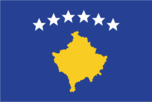
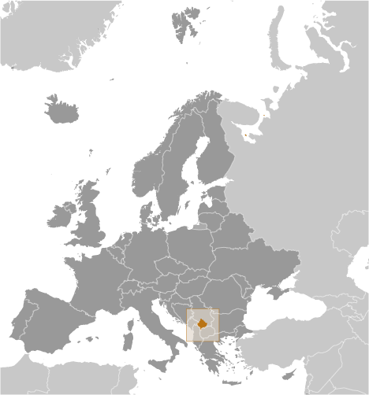
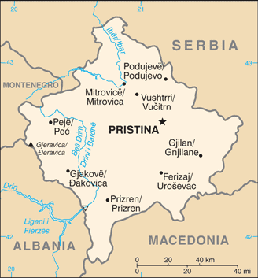

# Kosovo

## Introduction

**_Background:_**   
The central Balkans were part of the Roman and Byzantine Empires before ethnic Serbs migrated to the territories of modern Kosovo in the 7th century. During the medieval period, Kosovo became the center of a Serbian Empire and saw the construction of many important Serb religious sites, including many architecturally significant Serbian Orthodox monasteries. The defeat of Serbian forces at the Battle of Kosovo in 1389 led to five centuries of Ottoman rule during which large numbers of Turks and Albanians moved to Kosovo. By the end of the 19th century, Albanians replaced the Serbs as the dominant ethnic group in Kosovo. Serbia reacquired control over Kosovo from the Ottoman Empire during the First Balkan War of 1912. After World War II, Kosovo became an autonomous province of Serbia in the Socialist Federal Republic of Yugoslavia (S.F.R.Y.) with status almost equivalent to that of a republic under the 1974 S.F.R.Y. constitution. Despite legislative concessions, Albanian nationalism increased in the 1980s, which led to riots and calls for Kosovo's independence. At the same time, Serb nationalist leaders, such as Slobodan MILOSEVIC, exploited Kosovo Serb claims of maltreatment to secure votes from supporters, many of whom viewed Kosovo as their cultural heartland. Under MILOSEVIC's leadership, Serbia instituted a new constitution in 1989 that revoked Kosovo's status as an autonomous province of Serbia. Kosovo's Albanian leaders responded in 1991 by organizing a referendum that declared Kosovo independent. Under MILOSEVIC, Serbia carried out repressive measures against the Kosovar Albanians in the early 1990s as the unofficial Kosovo government, led by Ibrahim RUGOVA, used passive resistance in an attempt to try to gain international assistance and recognition of an independent Kosovo. Albanians dissatisfied with RUGOVA's passive strategy in the 1990s created the Kosovo Liberation Army and launched an insurgency. Starting in 1998, Serbian military, police, and paramilitary forces under MILOSEVIC conducted a brutal counterinsurgency campaign that resulted in massacres and massive expulsions of ethnic Albanians. Approximately 800,000 ethnic Albanians were forced from their homes in Kosovo during this time. International attempts to mediate the conflict failed, and MILOSEVIC's rejection of a proposed settlement led to a three-month NATO military operation against Serbia beginning in March 1999 that forced Serbia to agree to withdraw its military and police forces from Kosovo. UN Security Council Resolution 1244 (1999) placed Kosovo under a transitional administration, the UN Interim Administration Mission in Kosovo (UNMIK), pending a determination of Kosovo's future status. A UN-led process began in late 2005 to determine Kosovo's final status. The negotiations ran in stages between 2006 and 2007, but ended without agreement between Belgrade and Pristina. On 17 February 2008, the Kosovo Assembly declared Kosovo independent. Since then, over 100 countries have recognized Kosovo, and it has joined the International Monetary Fund, World Bank, European Bank for Reconstruction and Development, the Council of Europe Development Bank, and signed a framework agreement with the European Investment Bank (EIB). In October 2008, Serbia sought an advisory opinion from the International Court of Justice (ICJ) on the legality under international law of Kosovo's declaration of independence. The ICJ released the advisory opinion in July 2010 affirming that Kosovo's declaration of independence did not violate general principles of international law, UN Security Council Resolution 1244, or the Constitutive Framework. The opinion was closely tailored to Kosovo's unique history and circumstances. Serbia continues to reject Kosovo's independence, but the two countries reached an agreement to normalize their relations in April 2013 through EU-facilitated talks and are currently engaged in the implementation process.

## Geography

**_Location:_**   
Southeast Europe, between Serbia and Macedonia

**_Geographic coordinates:_**   
42 35 N, 21 00 E

**_Map references:_**   
Europe

**_Area:_**   
**total:** 10,887 sq km   
**land:** 10,887 sq km   
**water:** 0 sq km

**_Area - comparative:_**   
slightly larger than Delaware

**_Land boundaries:_**   
**total:** 702 km   
**border countries:** Albania 112 km, Macedonia 159 km, Montenegro 79 km, Serbia 352 km

**_Coastline:_**   
0 km (landlocked)

**_Maritime claims:_**   
none (landlocked)

**_Climate:_**   
influenced by continental air masses resulting in relatively cold winters with heavy snowfall and hot, dry summers and autumns; Mediterranean and alpine influences create regional variation; maximum rainfall between October and December

**_Terrain:_**   
flat fluvial basin with an elevation of 400-700 m above sea level surrounded by several high mountain ranges with elevations of 2,000 to 2,500 m

**_Elevation extremes:_**   
**lowest point:** Drini i Bardhe/Beli Drim 297 m (located on the border with Albania)   
**highest point:** Gjeravica/Deravica 2,656 m

**_Natural resources:_**   
nickel, lead, zinc, magnesium, lignite, kaolin, chrome, bauxite

## People and Society

**_Nationality:_**   
**noun:** Kosovar (Albanian), Kosovac (Serbian)   
**adjective:** Kosovar (Albanian), Kosovski (Serbian)   
**note:** Kosovan, a neutral term, is sometimes also used as a noun or adjective

**_Ethnic groups:_**   
Albanians 92%, other (Serb, Bosniak, Gorani, Roma, Turk, Ashkali, Egyptian) 8% (2008)

**_Languages:_**   
Albanian (official), Serbian (official), Bosnian, Turkish, Roma

**_Religions:_**   
Muslim, Serbian Orthodox, Roman Catholic

**_Population:_**   
1,859,203 (July 2014 est.)

**_Age structure:_**   
**0-14 years:** 26.3% (male 253,876/female 234,810)   
**15-24 years:** 18.1% (male 176,738/female 159,455)   
**25-54 years:** 41.5% (male 407,347/female 365,029)   
**55-64 years:** 7.2% (male 65,762/female 67,243)   
**65 years and over:** 6.9% (male 54,059/female 74,884) (2014 est.)

**_Median age:_**   
**total:** 27.8 years   
**male:** 27.4 years   
**female:** 28.2 years (2014 est.)

**_Sex ratio:_**   
**at birth:** 1.08 male(s)/female   
**0-14 years:** 1.08 male(s)/female   
**15-24 years:** 1.11 male(s)/female   
**25-54 years:** 1.12 male(s)/female   
**55-64 years:** 1.06 male(s)/female   
**65 years and over:** 0.73 male(s)/female   
**total population:** 1.06 male(s)/female (2014 est.)

**_Education expenditures:_**   
4.3% of GDP (2008)

**_Literacy:_**   
**definition:** age 15 and over can read and write   
**total population:** 91.9%   
**male:** 96.6%   
**female:** 87.5% (2007 Census)

**_Unemployment, youth ages 15-24:_**   
**total:** 55.3%   
**male:** 52%   
**female:** 63.8% (2012)

## Government

**_Country name:_**   
**conventional long form:** Republic of Kosovo   
**conventional short form:** Kosovo   
**local long form:** Republika e Kosoves (Republika Kosovo)   
**local short form:** Kosova (Kosovo)

**_Government type:_**   
republic

**_Capital:_**   
**name:** Pristina (Prishtine, Prishtina)   
**geographic coordinates:** 42 40 N, 21 10 E   
**time difference:** UTC+1 (6 hours ahead of Washington, DC during Standard Time)   
**daylight saving time:** +1hr, begins last Sunday in March; ends last Sunday in October

**_Administrative divisions:_**   
37 municipalities (komunat, singular - komuna (Albanian); opstine, singular - opstina (Serbian)); Decan (Decani), Dragash (Dragas), Ferizaj (Urosevac), Fushe Kosove (Kosovo Polje), Gjakove (Dakovica), Gjilan (Gnjilane), Gllogovc (Glogovac), Gracanice (Gracanica), Hani i Elezit (Deneral Jankovic), Istog (Istok), Junik, Kacanik, Kamenice/Dardana (Kamenica), Kline (Klina), Kllokot (Klokot), Leposaviq (Leposavic), Lipjan (Lipljan), Malisheve (Malisevo), Mamushe (Mamusa), Mitrovice (Mitrovica), Novoberde (Novo Brdo), Obiliq (Obilic), Partesh (Partes), Peje (Pec), Podujeve (Podujevo), Prishtine (Pristina), Prizren, Rahovec (Orahovac), Ranillug (Ranilug), Shterpce (Strpce), Shtime (Stimlje), Skenderaj (Srbica), Suhareke (Suva Reka), Viti (Vitina), Vushtrri (Vucitrn), Zubin Potok, Zvecan; note - a 38th municipality (Mitrovica e Veriut/Severna Mitrovica (Mitrovica North)) may have been created; when/if approved by the US Board on Geographic Names it will be added to the above listing

**_Independence:_**   
17 February 2008 (from Serbia)

**_National holiday:_**   
Independence Day, 17 February (2008)

**_Constitution:_**   
previous 1974, 1990; latest (postindependence) draft finalized 2 April 2008, signed 7 April 2008, ratified 8 April 2008, entered into force 15 June 2008; amended 2013 (2013)

**_Legal system:_**   
evolving legal system; mixture of applicable Kosovo law, UNMIK laws and regulations, and applicable laws of the Former Socialist Republic of Yugoslavia that were in effect in Kosovo as of 22 March 1989

**_International law organization participation:_**   
has not submitted an ICJ jurisdiction declaration; non-party state to the ICCt

**_Suffrage:_**   
18 years of age; universal

**_Executive branch:_**   
**chief of state:** President Atifete JAHJAGA (since 7 April 2011);   
**head of government:** Prime Minister Hashim THACI (since 9 January 2008)   
**cabinet:** ministers; elected by the Kosovo Assembly   
**elections:** the president is elected for a five-year term by the Kosovo Assembly; election last held on 7 April 2011; note - the prime minister elected by the Kosovo Assembly   
**election results:** Atifete JAHJAGA elected president in one round; Atifete JAHJAGA 80 votes, Suzana NOVOBERDALIU 10 votes; Hashim THACI reelected prime minister by the Assembly

**_Legislative branch:_**   
unicameral national Assembly (120 seats; 100 seats directly elected, 10 seats guaranteed for ethnic Serbs, 10 seats guaranteed for other ethnic minorities; members to serve three-year terms)   
**elections:** last held on 8 June 2014 (next expected to be held in June 2017)   
**election results:** percent of vote by party/coalition - PDK/PD/LB/PSHDK/PK 30.7%, LDK 25.6%, VV 13.5%, AAK 9.6%, NISMA 5.2%, AKR 4.7%, SLKM 4.2%, 1.0%, other 5,5%; seats by party/coalition - NA (results are preliminary)

**_Judicial branch:_**   
**highest court(s):** Supreme Court (consists of the court president and at least 15 percent of judges to reflect Kosovo's territorial ethnic composition); Constitutional Court (consists of the court president, vice president, and 7 judges); note - Kosovo initiated a new judicial system in January 2013   
**judge selection and term of office:** Supreme Court judges nominated by the Kosovo Judicial Council, an independent body staffed by judges and lay members, and also responsible for overall administration of Kosovo's judicial system; judges appointed by the president of the Republic of Kosovo; judges appointed until mandatory retirement age; Constitutional Court members nominated by the Kosovo Assembly and appointed by the president of the republic to serve single, 9-year terms   
**subordinate courts:** Court of Appeals (organized into 4 departments: General, Serious Crime, Commercial Matters), and Administrative Matters; Basic Court (located in 9 municipalities, each with several branches)

**_Political parties and leaders:_**   
Albanian Christian Democratic Party of Kosovo or PSHDK [Uke BERISHA]   
Alliance for a New Kosovo or AKR [Behgjet PACOLLI]   
Alliance for the Future of Kosovo or AAK [Ramush HARADINAJ]   
Ashkali Party for Integration or PAI   
Bosniak Party of Democratic Action of Kosovo or BSDAK   
Citizens' Initiative of Gora or GIG [Murselj HALJILJI]   
Civic Initiative for Kosovo or NISMA [Fatmir LIMAJ]   
Conservative Party of Kosovo or PK [Munir BASHA]   
Democratic Action Party or SDA [Numan BALIC]   
Democratic League of Dardania or LDD [Nexhat DACI]   
Democratic League of Kosovo or LDK [Isa MUSTAFA]   
Democratic Party of Ashkali of Kosovo or PDAK [Berat QERIMI]   
Democratic Party of Kosovo or PDK [Hashim THACI]   
Independent Liberal Party or SLS [Slobadan PETROVIC]   
Justice Party of Kosovo or PD (formerly part of the Coalition for New Kosovo or KKR) [Ferid AGANI]   
Kosovo Democratic Turkish Party or KDTP [Mahir YAGCILAR]   
Movement for Self-Determination (Vetevendosje) or VV [Albin KURTI]   
Movement for Unification or LB [Avni KLINAKU]   
National Democratic Party of Albania or PNDSH [Bujar ABDULLAHU]   
New Democratic Initiative of Kosovo or IRDK [Xhevdet NEZIRAJ]   
New Democratic Party or NDS [Predrag JOVIC]   
Serb People's Party or SNS [Mihailo SCEPANOVIC]   
Serb People's Party of Kosovo or SNPK   
Serbian Democratic Party of Kosovo and Metohija or SDSKiM [Sasa DJOKIC]   
Serbian Kosovo and Metohija Party or SKMS [Dragisa MIRIC]   
Serbian List [Aleksandar JABLANOVIC]   
Serbian National Council of Northern Kosovo and Metohija or SNV [Milan IVANOVIC]   
Serbian Social Democratic Party or SSDS   
Social Democratic Party of Kosovo or PSDK   
Socialist Party of Kosovo or PSK [Ilaz KADOLLI]   
Turkish Democratic Party of Kosovo or KDTP [Mahir YAGCILAR]   
Union of Independent Social Democrats of Kosovo and Metohija or SNSKiM [Ljubisa ZIVIC]   
United Roma Party of Kosovo or PREBK [Haxhi Zylfi MERXHA]   
United Serb List or JSL   
Vakat Coalition or VAKAT [Sadik IDRIZI]   
a coalition formed for the 2014 parliamentary elections included, the PDK, PD, LB, PSHDK, and PK

**_Political pressure groups and leaders:_**   
Council for the Defense of Human Rights and Freedom (human rights)   
Organization for Democracy, Anti-Corruption and Dignity Rise! [Avni ZOGIANI]   
Serb National Council (SNV)   
The Speak Up Movement [Ramadan ILAZI]

**_International organization participation:_**   
IBRD, IDA, IFC, IMF, ITUC (NGOs), MIGA

**_Diplomatic representation in the US:_**   
**chief of mission:** Ambassador Akan ISMAILI (since 23 April 2012)   
**chancery:** 1101 30th Street NW, Suites 330/340, Washington, DC 20007   
**telephone:** 202-380-3581   
**FAX:** 202-380-3628   
**consulate(s) general:** New York

**_Diplomatic representation from the US:_**   
**chief of mission:** Ambassador Tracey Ann JACOBSON (since 26 July 2012)   
**embassy:** Arberia/Dragodan, Nazim Hikmet 30, Pristina, Kosovo   
**mailing address:** use embassy street address   
**telephone:** [381] 38 59 59 3000   
**FAX:** [381] 38 549 890

**_Flag description:_**   
centered on a dark blue field is the geographical shape of Kosovo in a gold color surmounted by six white, five-pointed stars arrayed in a slight arc; each star represents one of the major ethnic groups of Kosovo: Albanians, Serbs, Turks, Gorani, Roma, and Bosniaks

**_National anthem:_**   
**name:** "Europe"   
**lyrics/music:** none/Mendi MENGJIQI   
**note:** adopted 2008; Kosovo chose to not include lyrics in its anthem so as not to offend minority ethnic groups in the country

## Economy

**_Economy - overview:_**   
Kosovo's economy has shown significant progress in transitioning to a market-based system and maintaining macroeconomic stability, but it is still highly dependent on the international community and the diaspora for financial and technical assistance. Kosovo's citizens are the poorest in Europe with a per capita GDP (PPP) of $7,600 in 2013. An unemployment rate of 45% encourages emigration and fuels a significant informal, unreported economy. Remittances from the diaspora - located mainly in Germany, Switzerland, and the Nordic countries - are estimated to account for about 15% of GDP, and donor-financed activities and aid for approximately 10%. Most of Kosovo's population lives in rural towns outside of the capital, Pristina. Inefficient, near-subsistence farming is common - the result of small plots, limited mechanization, and lack of technical expertise. With international assistance, Kosovo has been able to privatize a majority of its state-owned-enterprises. Minerals and metals - including lignite, lead, zinc, nickel, chrome, aluminum, magnesium, and a wide variety of construction materials - once formed the backbone of industry, but output has declined because of ageing equipment and insufficient investment. A limited and unreliable electricity supply due to technical and financial problems is a major impediment to economic development, but Kosovo has received technical assistance to help improve accounting and controls and, in 2012, privatized its distribution network. The US Government is cooperating with the Ministry for Energy and Mines and the World Bank to prepare commercial tenders for the construction of a new power plant, rehabilitation of an old plant, and the development of a coal mine that could supply both. In July 2008, Kosovo received pledges of $1.9 billion from 37 countries in support of its reform priorities, but the global financial crisis has limited this assistance and also negatively affected remittance inflows. In June 2009, Kosovo joined the World Bank and International Monetary Fund, and Kosovo began servicing its share of the former Yugoslavia's debt. In order to help integrate Kosovo into regional economic structures, UNMIK signed (on behalf of Kosovo) its accession to the Central Europe Free Trade Area (CEFTA) in 2006. Serbia and Bosnia previously had refused to recognize Kosovo's customs stamp or extend reduced tariff privileges for Kosovo products under CEFTA, but both countries resumed trade with Kosovo in 2011. The official currency of Kosovo is the euro, but the Serbian dinar is also used illegally in Serb enclaves. Kosovo's tie to the euro has helped keep core inflation low. Kosovo maintained a budget surplus until 2011, when government expenditures climbed sharply. In 2013 Kosovo signed a Free Trade Agreement with Turkey and is negotiating liberalization of trade with EU as part of a Stabilization and Association Agreement.

**_GDP (purchasing power parity):_**   
$14.11 billion (2013 est.)   
$13.77 billion (2012 est.)   
$13.43 billion (2011 est.)   
**note:** data are in 2013 US dollars

**_GDP (official exchange rate):_**   
$7.15 billion (2013 est.)

**_GDP - real growth rate:_**   
2.5% (2013 est.)   
2.5% (2012 est.)   
4.4% (2011 est.)

**_GDP - per capita (PPP):_**   
$7,600 (2013 est.)   
$7,500 (2012 est.)   
$7,400 (2011 est.)   
**note:** data are in 2013 US dollars

**_Gross national saving:_**   
12.7% of GDP (2013 est.)   
12.5% of GDP (2012 est.)   
12.4% of GDP (2011 est.)

**_GDP - composition, by end use:_**   
**household consumption:** 90.5%   
**government consumption:** 16%   
**investment in fixed capital:** 28.2%   
**investment in inventories:** 3%   
**exports of goods and services:** 18.8%   
**imports of goods and services:** -53.9%; (2012 est.)

**_GDP - composition, by sector of origin:_**   
**agriculture:** 12.9%   
**industry:** 22.6%   
**services:** 64.5% (2009 est.)

**_Agriculture - products:_**   
wheat, corn, berries, potatoes, peppers, fruit; dairy, livestock; fish

**_Industries:_**   
mineral mining, construction materials, base metals, leather, machinery, appliances, foodstuffs and beverages, textiles

**_Labor force:_**   
800,000   
**note:** includes those estimated to be employed in the grey economy (2011 est.)

**_Labor force - by occupation:_**   
**agriculture:** 23.6%   
**industry:** NA%   
**services:** NA% (2010)

**_Unemployment rate:_**   
30.9% (2013 est.)   
45% (1)   
**note:** Kosovo has a large informal sector that may not be reflected in these data

**_Population below poverty line:_**   
30% (2013 est.)

**_Distribution of family income - Gini index:_**   
30 (FY05/06)

**_Budget:_**   
**revenues:** $1.916 billion   
**expenditures:** $2.048 billion (2013 est.)

**_Taxes and other revenues:_**   
26.8% of GDP (2013 est.)

**_Budget surplus (+) or deficit (-):_**   
-1.8% of GDP (2013 est.)

**_Public debt:_**   
9.1% of GDP (2013)   
8.4% of GDP (2012)

**_Inflation rate (consumer prices):_**   
1.8% (2013 est.)   
2.5% (2012 est.)

**_Commercial bank prime lending rate:_**   
NA% (30 June 2013 est.)   
13.7% (31 December 2012 est.)

**_Stock of broad money:_**   
$2.773 billion   
$2.637 billion

**_Stock of domestic credit:_**   
$2.505 billion   
$2.445 billion

**_Current account balance:_**   
-$919.7 million (2013 est.)   
-$1.083 billion (2012 est.)

**_Exports:_**   
$408 million (2013 est.)   
$382.8 million (2012 est.)

**_Exports - commodities:_**   
mining and processed metal products, scrap metals, leather products, machinery, appliances, prepared foodstuffs, beverages and tobacco, vegetable products, textile and textile articles

**_Exports - partners:_**   
Italy 25.8%, Albania 14.6%, Macedonia 9.6%, China 5.5%, Gernamy 5.4%, Switzerland 5.4%, Turkey 4.1% (2012 est.)

**_Imports:_**   
$3.398 billion (2013 est.)   
$3.477 billion (2012 est.)

**_Imports - commodities:_**   
foodstuffs, livestock, wood, petroleum, chemicals, machinery, minerals, textiles, stone, ceramic and glass products, electrical equipment

**_Imports - partners:_**   
Germany 11.9%, Macedonia 11.5%, Serbia 11.1%, Italy 8.5%, Turkey 9%, China 6.4%, Albania 4.4% (2012 est.)

**_Reserves of foreign exchange and gold:_**   
$NA

**_Debt - external:_**   
$448.2 million (2013 est.)   
$466 million (2012 est.)

**_Stock of direct foreign investment - at home:_**   
$21.2 billion (31 December 2013 est.)   
$25.8 million (31 December 2012 est.)

**_Exchange rates:_**   
euros (EUR) per US dollar -   
0.7634 (2013 est.)   
0.7752 (2012 est.)   
0.755 (2010 est.)   
0.7198 (2009 est.)   
0.6827 (2008 est.)

## Energy

**_Electricity - production:_**   
5.847 billion kWh (2012)

**_Electricity - consumption:_**   
5.467 billion kWh (2012)

**_Electricity - exports:_**   
371.3 million kWh

**_Electricity - imports:_**   
625.1 million kWh

**_Electricity - installed generating capacity:_**   
1.526 million kW

**_Crude oil - proved reserves:_**   
NA bbl

**_Refined petroleum products - production:_**   
0 bbl/day (2007)

**_Refined petroleum products - consumption:_**   
NA bbl/day (2011 est.)

**_Natural gas - production:_**   
0 cu m (2007)

**_Natural gas - consumption:_**   
0 cu m (2007)

**_Natural gas - proved reserves:_**   
NA cu m

## Communications

**_Telephones - main lines in use:_**   
106,300 (2006)

**_Telephones - mobile cellular:_**   
562,000 (2007)

## Transportation

**_Airports:_**   
6 (2013)

**_Airports - with paved runways:_**   
**total:** 3   
**2,438 to 3,047 m:** 1   
**1,524 to 2,437 m:** 1   
**under 914 m:** 1 (2013)

**_Airports - with unpaved runways:_**   
**total:** 3   
**under 914 m:** 3 (2013)

**_Heliports:_**   
2 (2013)

**_Railways:_**   
**total:** 430 km   
**standard gauge:** 430 km 1.435-m gauge (2007)

**_Roadways:_**   
**total:** 6,955 km   
**paved:** 1,843 km (includes 38 km of expessways)   
**unpaved:** 5,112 km (2012)

## Military

**_Military branches:_**   
Kosovo Security Force (FSK) (2010)

**_Manpower fit for military service:_**   
**males age 16-49:** 430,926   
**females age 16-49:** 389,614 (2010 est.)

## Transnational Issues

**_Disputes - international:_**   
Serbia with several other states protest the US and other states' recognition of Kosovo's declaration of its status as a sovereign and independent state in February 2008; ethnic Serbian municipalities along Kosovo's northern border challenge final status of Kosovo-Serbia boundary; several thousand NATO-led Kosovo Force peacekeepers under United Nations Interim Administration Mission in Kosovo authority continue to keep the peace within Kosovo between the ethnic Albanian majority and the Serb minority in Kosovo; Kosovo and Macedonia completed demarcation of their boundary in September 2008

............................................................   
_Page last updated on June 19, 2014_
