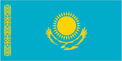
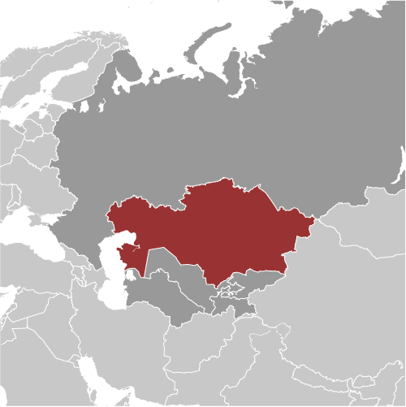
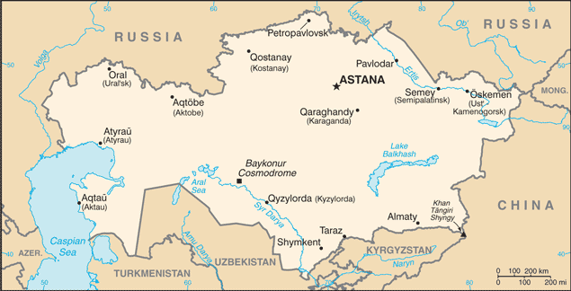

# Kazakhstan

## Introduction

**_Background:_**   
Ethnic Kazakhs, a mix of Turkic and Mongol nomadic tribes who migrated to the region by the 13th century, were rarely united as a single nation. The area was conquered by Russia in the 18th century, and Kazakhstan became a Soviet Republic in 1936. During the 1950s and 1960s agricultural "Virgin Lands" program, Soviet citizens were encouraged to help cultivate Kazakhstan's northern pastures. This influx of immigrants (mostly Russians, but also some other deported nationalities) skewed the ethnic mixture and enabled non-ethnic Kazakhs to outnumber natives. Non-Muslim ethnic minorities departed Kazakhstan in large numbers from the mid-1990s through the mid-2000s and a national program has repatriated about a million ethnic Kazakhs back to Kazakhstan. These trends have allowed Kazakhs to become the titular majority again. This dramatic demographic shift has also undermined the previous religious diversity and made the country more than 70 percent Muslim. Kazakhstan's economy is larger than those of all the other Central Asian states largely due to the country's vast natural resources. Current issues include: developing a cohesive national identity; managing Islamic revivalism; expanding the development of the country's vast energy resources and exporting them to world markets; diversifying the economy outside the oil, gas, and mining sectors; enhancing Kazakhstan's economic competitiveness; developing a multiparty parliament and advancing political and social reform; and strengthening relations with neighboring states and other foreign powers.

## Geography

**_Location:_**   
Central Asia, northwest of China; a small portion west of the Ural (Zhayyq) River in eastern-most Europe

**_Geographic coordinates:_**   
48 00 N, 68 00 E

**_Map references:_**   
Asia

**_Area:_**   
**total:** 2,724,900 sq km   
**land:** 2,699,700 sq km   
**water:** 25,200 sq km

**_Area - comparative:_**   
slightly less than four times the size of Texas

**_Land boundaries:_**   
**total:** 12,185 km   
**border countries:** China 1,533 km, Kyrgyzstan 1,224 km, Russia 6,846 km, Turkmenistan 379 km, Uzbekistan 2,203 km

**_Coastline:_**   
0 km (landlocked); note - Kazakhstan borders the Aral Sea, now split into two bodies of water (1,070 km), and the Caspian Sea (1,894 km)

**_Maritime claims:_**   
none (landlocked)

**_Climate:_**   
continental, cold winters and hot summers, arid and semiarid

**_Terrain:_**   
vast flat steppe extending from the Volga in the west to the Altai Mountains in the east and from the plains of western Siberia in the north to oases and deserts of Central Asia in the south

**_Elevation extremes:_**   
**lowest point:** Vpadina Kaundy -132 m   
**highest point:** Khan Tangiri Shyngy (Pik Khan-Tengri) 6,995 m

**_Natural resources:_**   
major deposits of petroleum, natural gas, coal, iron ore, manganese, chrome ore, nickel, cobalt, copper, molybdenum, lead, zinc, bauxite, gold, uranium

**_Land use:_**   
**arable land:** 8.82%   
**permanent crops:** 0.03%   
**other:** 91.15% (2011)

**_Irrigated land:_**   
20,660 sq km (2010)

**_Total renewable water resources:_**   
107.5 cu km (2011)

**_Freshwater withdrawal (domestic/industrial/agricultural):_**   
**total:** 21.14 cu km/yr (4%/30%/66%)   
**per capita:** 1,304 cu m/yr (2010)

**_Natural hazards:_**   
earthquakes in the south; mudslides around Almaty

**_Environment - current issues:_**   
radioactive or toxic chemical sites associated with former defense industries and test ranges scattered throughout the country pose health risks for humans and animals; industrial pollution is severe in some cities; because the two main rivers that flowed into the Aral Sea have been diverted for irrigation, it is drying up and leaving behind a harmful layer of chemical pesticides and natural salts; these substances are then picked up by the wind and blown into noxious dust storms; pollution in the Caspian Sea; soil pollution from overuse of agricultural chemicals and salination from poor infrastructure and wasteful irrigation practices

**_Environment - international agreements:_**   
**party to:** Air Pollution, Biodiversity, Climate Change, Desertification, Endangered Species, Environmental Modification, Hazardous Wastes, Ozone Layer Protection, Ship Pollution, Wetlands   
**signed, but not ratified:** Climate Change-Kyoto Protocol

**_Geography - note:_**   
world's largest landlocked country; Russia leases approximately 6,000 sq km of territory enclosing the Baykonur Cosmodrome; in January 2004, Kazakhstan and Russia extended the lease to 2050

## People and Society

**_Nationality:_**   
**noun:** Kazakhstani(s)   
**adjective:** Kazakhstani

**_Ethnic groups:_**   
Kazakh (Qazaq) 63.1%, Russian 23.7%, Uzbek 2.9%, Ukrainian 2.1%, Uighur 1.4%, Tatar 1.3%, German 1.1%, other 4.4% (2009 est.)

**_Languages:_**   
Kazakh (Qazaq, state language) 64.4%, Russian (official, used in everyday business, designated the "language of interethnic communication") 95% (2001 est.)

**_Religions:_**   
Muslim 70.2%, Christian 26.2% (mainly Russian Orthodox), other 0.2%, atheist 2.8%, unspecified 0.5% (2009 est.)

**_Population:_**   
17,948,816 (July 2014 est.)

**_Age structure:_**   
**0-14 years:** 25.1% (male 2,247,628/female 2,254,744)   
**15-24 years:** 16.1% (male 1,469,275/female 1,418,175)   
**25-54 years:** 42.6% (male 3,720,498/female 3,927,626)   
**55-64 years:** 9.2% (male 724,683/female 935,416)   
**65 years and over:** 6.8% (male 429,565/female 821,206) (2014 est.)

**_Dependency ratios:_**   
**total dependency ratio:** 48.7 %   
**youth dependency ratio:** 38.7 %   
**elderly dependency ratio:** 10 %   
**potential support ratio:** 10 (2014 est.)

**_Median age:_**   
**total:** 29.7 years   
**male:** 28.4 years   
**female:** 31.1 years (2014 est.)

**_Population growth rate:_**   
1.17% (2014 est.)

**_Birth rate:_**   
19.61 births/1,000 population (2014 est.)

**_Death rate:_**   
8.31 deaths/1,000 population (2014 est.)

**_Net migration rate:_**   
0.42 migrant(s)/1,000 population (2014 est.)

**_Urbanization:_**   
**urban population:** 53.6% of total population (2011)   
**rate of urbanization:** 0.87% annual rate of change (2010-15 est.)

**_Major urban areas - population:_**   
Almaty 1.426 million; ASTANA (capital) 664,000 (2011)

**_Sex ratio:_**   
**at birth:** 0.94 male(s)/female   
**0-14 years:** 1 male(s)/female   
**15-24 years:** 1.04 male(s)/female   
**25-54 years:** 0.95 male(s)/female   
**55-64 years:** 0.92 male(s)/female   
**65 years and over:** 0.52 male(s)/female   
**total population:** 0.92 male(s)/female (2014 est.)

**_Mother's mean age at first birth:_**   
25 (2011 est.)

**_Maternal mortality rate:_**   
51 deaths/100,000 live births (2010)

**_Infant mortality rate:_**   
**total:** 21.61 deaths/1,000 live births   
**male:** 24.34 deaths/1,000 live births   
**female:** 19.06 deaths/1,000 live births (2014 est.)

**_Life expectancy at birth:_**   
**total population:** 70.24 years   
**male:** 64.98 years   
**female:** 75.17 years (2014 est.)

**_Total fertility rate:_**   
2.34 children born/woman (2014 est.)

**_Contraceptive prevalence rate:_**   
51% (2011)

**_Health expenditures:_**   
3.9% of GDP (2011)

**_Physicians density:_**   
3.84 physicians/1,000 population (2011)

**_Hospital bed density:_**   
7.6 beds/1,000 population (2009)

**_Drinking water source:_**   
**improved:** urban: 99.2% of population; rural: 86% of population; total: 93.1% of population   
**unimproved:** urban: 0.8% of population; rural: 14% of population; total: 6.9% of population (2012 est.)

**_Sanitation facility access:_**   
**improved:** urban: 97% of population; rural: 98% of population; total: 97.5% of population   
**unimproved:** urban: 3% of population; rural: 2% of population; total: 2.5% of population (2012 est.)

**_HIV/AIDS - adult prevalence rate:_**   
0.1% (2009 est.)

**_HIV/AIDS - people living with HIV/AIDS:_**   
13,000 (2009 est.)

**_HIV/AIDS - deaths:_**   
fewer than 500 (2009 est.)

**_Obesity - adult prevalence rate:_**   
23.7% (2008)

**_Children under the age of 5 years underweight:_**   
3.7% (2011)

**_Education expenditures:_**   
3.1% of GDP (2009)

**_Literacy:_**   
**definition:** age 15 and over can read and write   
**total population:** 99.7%   
**male:** 99.8%   
**female:** 99.7% (2009 est.)

**_School life expectancy (primary to tertiary education):_**   
**total:** 15 years   
**male:** 15 years   
**female:** 15 years (2012)

**_Child labor - children ages 5-14:_**   
**total number:** 59,254   
**percentage:** 2 % (2006 est.)

**_Unemployment, youth ages 15-24:_**   
**total:** 3.9%   
**male:** 2.9%   
**female:** 5.1% (2012)

## Government

**_Country name:_**   
**conventional long form:** Republic of Kazakhstan   
**conventional short form:** Kazakhstan   
**local long form:** Qazaqstan Respublikasy   
**local short form:** Qazaqstan   
**former:** Kazakh Soviet Socialist Republic

**_Government type:_**   
republic; authoritarian presidential rule, with little power outside the executive branch

**_Capital:_**   
**name:** Astana   
**geographic coordinates:** 51 10 N, 71 25 E   
**time difference:** UTC+6 (11 hours ahead of Washington, DC, during Standard Time)   
**note:** Kazakhstan has two time zones

**_Administrative divisions:_**   
14 provinces (oblystar, singular - oblys) and 3 cities\* (qalalar, singular - qala); Almaty Oblysy, Almaty Qalasy\*, Aqmola Oblysy (Astana), Aqtobe Oblysy, Astana Qalasy\*, Atyrau Oblysy, Batys Qazaqstan Oblysy [West Kazakhstan] (Oral), Bayqongyr Qalasy [Baykonur]\*, Mangghystau Oblysy (Aqtau), Ongtustik Qazaqstan Oblysy [South Kazakhstan] (Shymkent), Pavlodar Oblysy, Qaraghandy Oblysy, Qostanay Oblysy, Qyzylorda Oblysy, Shyghys Qazaqstan Oblysy [East Kazakhstan] (Oskemen), Soltustik Qazaqstan Oblysy [North Kazakhstan] (Petropavlovsk), Zhambyl Oblysy (Taraz)   
**note:** administrative divisions have the same names as their administrative centers (exceptions have the administrative center name following in parentheses); in 1995, the Governments of Kazakhstan and Russia entered into an agreement whereby Russia would lease for a period of 20 years an area of 6,000 sq km enclosing the Baykonur space launch facilities and the city of Bayqongyr (Baykonur, formerly Leninsk); in 2004, a new agreement extended the lease to 2050

**_Independence:_**   
16 December 1991 (from the Soviet Union)

**_National holiday:_**   
Independence Day, 16 December (1991)

**_Constitution:_**   
previous 1937, 1978 (preindependence ); latest adopted 28 January 1993, approved by referendum 30 August 1995, effective 5 September 1995; amended 1998, 2007, 2011 (2012)

**_Legal system:_**   
civil law system influenced by Roman-Germanic law and by the theory and practice of the Russian Federation

**_International law organization participation:_**   
has not submitted an ICJ jurisdiction declaration; non-party state to the ICCt

**_Suffrage:_**   
18 years of age; universal

**_Executive branch:_**   
**chief of state:** President Nursultan Abishuly NAZARBAYEV (chairman of the Supreme Soviet from 22 February 1990, elected president 1 December 1991)   
**head of government:** Prime Minister Karim MASIMOV (since 2 April 2014); First Deputy Prime Minister Bakytzhan SAGINTAYEV (since 16 January 2013); Deputy Prime Ministers Gulshara ABDYKALIKOVA (since 28 November 2013), Aset ISEKESHEV (since 25 September 2012); Bakyt SULTANOV (since 6 November 2013)   
**cabinet:** Council of Ministers appointed by the president   
**elections:** president elected by popular vote for a five-year term; election last held on 3 April 2011 (next to be held in 2016); prime minister and deputy prime ministers appointed by the president, with Mazhilis approval; note - constitutional amendments of May 2007 shortened the presidential term from seven years to five years and established a two-consecutive-term limit; NAZARBAYEV has official status as the "First President of Kazakhstan" and is allowed unlimited terms   
**note:** constitutional amendments of February 2011 moved election date from 2012 to April 2011 but kept five-year term; subsequent election to take place in 2016   
**election results:** Nursultan Abishuly NAZARBAYEV reelected president; percent of vote - Nursultan Abishuly NAZARBAYEV 95.5%, other 4.5%

**_Legislative branch:_**   
bicameral Parliament consists of the Senate (47 seats; 15 members are appointed by the president; 32 members elected by local assemblies; members serve six-year terms, but elections are staggered with half of the members up for re-election every three years) and the Mazhilis (107 seats; 9 out of the 107 Mazhilis members elected by the Assembly of the People of Kazakhstan, a presidentially appointed advisory body designed to represent the country's ethnic minorities; non-appointed members are popularly elected to serve five-year terms)   
**elections:** Senate - (indirect) last held in August 2011 (next to be held in 2014); Mazhilis - last held on 15 January 2012 (next to be held in 2017)   
**election results:** Senate - percent of vote by party - NA; seats by party - Nur Otan 16; Mazhilis - percent of vote by party - Nur-Otan 81%, Ak Zhol 7.5%, Communist People's Party 7.2%, other 4.3%; seats by party - Nur-Otan 83, Ak Zhol 8, Communist People's Party 7

**_Judicial branch:_**   
**highest court(s):** Supreme Court of the Republic (consists of 44 members); Constitutional Council (consists of 7 members)   
**judge selection and term of office:** Supreme Court judges proposed by the president of ther epublic on recommendation of the Supreme Judicial Council, and confirmed by the Senate; judge tenure NA; Constitutional Council - the president of the republic, the Senate chairperson, the Majilis chairperson each appoints one member for a 3-year term and each appoints one member for a 6-year term; chairperson of the Constitutional Council appointed by the president of the republic for a 6-year term   
**subordinate courts:** regional and local courts

**_Political parties and leaders:_**   
Ak Zhol Party (Bright Path) [Azat PERUASHEV]   
Alga [Vladimir KOZLOV] (unregistered and banned as extremist in November 2012)   
Auyl (Village) [Gani KALIYEV]   
Azat (Freedom) Party [Bolat ABILOV] (formerly True Ak Zhol Party)   
Birlik (Unity) [Seril SULTANGALI] (Birlik is an April 2013 merger of Adilet (Justice; formerly Democratic Party of Kazakhstan) and Rukhaniyat (Spirituality))   
NSDP [Zharmakhan TUYAKBAY]   
Communist Party of Kazakhstan or KPK [Serikbolsyn ABDILDIN] (suspended by court decision)   
Communist People's Party of Kazakhstan [Vladislav KOSAREV]   
National Social Democratic Party or NSDP [Zharmakhan TUYAKBAY]   
Nur Otan (Fatherland's Ray of Light) [Nursultan NAZARBAYEV, Nurlan NIGMATULIN] (the Agrarian, Asar, and Civic parties merged with Otan)   
Patriots' Party [Gani KASYMOV]

**_Political pressure groups and leaders:_**   
Adil-Soz [Tamara KALEYEVA]   
Almaty Helsinki Committee [Ninel FOKINA]   
Confederation of Free Trade Unions [Sergei BELKIN]   
For Fair Elections [Yevgeniy ZHOVTIS, Sabit ZHUSUPOV, Sergey DUVANOV, Ibrash NUSUPBAYEV]   
Kazakhstan International Bureau on Human Rights [Yevgeniy ZHOVTIS, Chairman of Bureau's Council, Roza AKYLBEKOVA, director]   
Khalyk Maidany (Peoples' Front) - an informal union between the unregistered Alga Party, the unregistered Communist Party of Kazakhstan, and several opposition-oriented civil society groups, banned in November 2012 [no formal leader]   
Pan-National Social Democratic Party of Kazakhstan [Zharmakhan TUYAKBAY]   
Pensioners Movement or Pokoleniye [Irina SAVOSTINA, chairwoman]   
Republican Network of International Monitors [Daniyar LIVAZOV]   
Transparency International [Sergey ZLOTNIKOV]

**_International organization participation:_**   
ADB, CICA, CIS, CSTO, EAEC, EAPC, EBRD, ECO, EITI (candidate country), FAO, GCTU, IAEA, IBRD, ICAO, ICC (NGOs), ICRM, IDA, IDB, IFAD, IFC, IFRCS, ILO, IMF, IMO, Interpol, IOC, IOM, IPU, ISO, ITSO, ITU, MIGA, NAM (observer), NSG, OAS (observer), OIC, OPCW, OSCE, PFP, SCO, UN, UNCTAD, UNESCO, UNIDO, UNWTO, UPU, WCO, WFTU (NGOs), WHO, WIPO, WMO, WTO (observer), ZC

**_Diplomatic representation in the US:_**   
**chief of mission:** Ambassador Kayrat UMAROV (since 14 January 2013)   
**chancery:** 1401 16th Street NW, Washington, DC 20036   
**telephone:** [1] (202) 232-5488   
**FAX:** [1] (202) 232-5845   
**consulate(s) general:** New York

**_Diplomatic representation from the US:_**   
**chief of mission:** Ambassador (vacant); Charge d'Affaires John ORDWAY   
**embassy:** Rakhymzhan Koshkarbayev Ave. No 3, Astana 010010   
**mailing address:** use embassy street address   
**telephone:** [7] (7172) 70-21-00   
**FAX:** [7] (7172) 54-09-14

**_Flag description:_**   
a gold sun with 32 rays above a soaring golden steppe eagle, both centered on a sky blue background; the hoist side displays a national ornamental pattern "koshkar-muiz" (the horns of the ram) in gold; the blue color is of religious significance to the Turkic peoples of the country, and so symbolizes cultural and ethnic unity; it also represents the endless sky as well as water; the sun, a source of life and energy, exemplifies wealth and plenitude; the sun's rays are shaped like grain, which is the basis of abundance and prosperity; the eagle has appeared on the flags of Kazakh tribes for centuries and represents freedom, power, and the flight to the future

**_National symbol(s):_**   
golden eagle

**_National anthem:_**   
**name:** "Menin Qazaqstanim" (My Kazakhstan)   
**lyrics/music:** Zhumeken NAZHIMEDENOV and Nursultan NAZARBAYEV/Shamshi KALDAYAKOV   
**note:** adopted 2006; President Nursultan NAZARBAYEV played a role in revising the lyrics

## Economy

**_Economy - overview:_**   
Kazakhstan, geographically the largest of the former Soviet republics, excluding Russia, possesses enormous fossil fuel reserves and plentiful supplies of other minerals and metals, such as uranium, copper, and zinc. It also has a large agricultural sector featuring livestock and grain. In 2002 Kazakhstan became the first country in the former Soviet Union to receive an investment-grade credit rating. Extractive industries have been and will continue to be the engine of Kazakhstan's growth, although the country is aggressively pursuing diversification strategies. Landlocked, with restricted access to the high seas, Kazakhstan relies on its neighbors to export its products, especially oil and grain. Although its Caspian Sea ports, pipelines, and rail lines carrying oil have been upgraded, civil aviation and roadways continue to need attention. Telecoms are improving, but require considerable investment, as does the information technology base. Supply and distribution of electricity can be erratic because of regional dependencies, but the country is moving forward with plans to improve reliability of electricity and gas supply to its population. At the end of 2007, global financial markets froze up and the loss of capital inflows to Kazakhstani banks caused a credit crunch. The subsequent and sharp fall of oil and commodity prices in 2008 aggravated the economic situation, and Kazakhstan plunged into recession. While the global financial crisis took a significant toll on Kazakhstan's economy, it has rebounded well, helped by prudent government measures. Rising commodity prices have helped the recovery. Despite solid macroeconomic indicators, the government realizes that its economy suffers from an overreliance on oil and extractive industries, the so-called "Dutch disease." In response, Kazakhstan has embarked on an ambitious diversification program, aimed at developing targeted sectors like transport, pharmaceuticals, telecommunications, petrochemicals and food processing. In 2010 Kazakhstan joined the Belarus-Kazakhstan-Russia Customs Union in an effort to boost foreign investment and improve trade relationships.

**_GDP (purchasing power parity):_**   
$243.6 billion (2013 est.)   
$231.9 billion (2012 est.)   
$220.6 billion (2011 est.)   
**note:** data are in 2013 US dollars

**_GDP (official exchange rate):_**   
$224.9 billion (2013 est.)

**_GDP - real growth rate:_**   
5% (2013 est.)   
5.1% (2012 est.)   
7.5% (2011 est.)

**_GDP - per capita (PPP):_**   
$14,100 (2013 est.)   
$13,700 (2012 est.)   
$13,200 (2011 est.)   
**note:** data are in 2013 US dollars

**_Gross national saving:_**   
28.8% of GDP (2013 est.)   
23.9% of GDP (2012 est.)   
28.4% of GDP (2011 est.)

**_GDP - composition, by end use:_**   
**household consumption:** 51%   
**government consumption:** 12.4%   
**investment in fixed capital:** 22.1%   
**investment in inventories:** 2.5%   
**exports of goods and services:** 44.6%   
**imports of goods and services:** -32.6%; (2013 est.)

**_GDP - composition, by sector of origin:_**   
**agriculture:** 5.2%   
**industry:** 37.9%   
**services:** 56.9% (2011 est.)

**_Agriculture - products:_**   
grain (mostly spring wheat and barley), potatoes, vegetables, melons; livestock

**_Industries:_**   
oil, coal, iron ore, manganese, chromite, lead, zinc, copper, titanium, bauxite, gold, silver, phosphates, sulfur, uranium, iron and steel; tractors and other agricultural machinery, electric motors, construction materials

**_Industrial production growth rate:_**   
2.1% (2013 est.)

**_Labor force:_**   
9.022 million (2013 est.)

**_Labor force - by occupation:_**   
**agriculture:** 25.8%   
**industry:** 11.9%   
**services:** 62.3% (2012)

**_Unemployment rate:_**   
5.3% (2013 est.)   
5.3% (2012 est.)

**_Population below poverty line:_**   
5.3% (2011 est.)

**_Household income or consumption by percentage share:_**   
**lowest 10%:** 3.9%   
**highest 10%:** 23.7% (2011 est.)

**_Distribution of family income - Gini index:_**   
28.9 (2011)   
31.5 (2003)

**_Budget:_**   
**revenues:** $43.88 billion   
**expenditures:** $49 billion (2013 est.)

**_Taxes and other revenues:_**   
19.5% of GDP (2013 est.)

**_Budget surplus (+) or deficit (-):_**   
-2.3% of GDP (2013 est.)

**_Public debt:_**   
15.6% of GDP (2013 est.)   
13.2% of GDP (2012 est.)

**_Fiscal year:_**   
calendar year

**_Inflation rate (consumer prices):_**   
5.8% (2013 est.)   
5.1% (2012 est.)

**_Central bank discount rate:_**   
5.5% (31 December 2012 est.)   
7.5% (31 December 2011 est.)

**_Commercial bank prime lending rate:_**   
NA% (31 December 2013 est.)   
6.6% (31 December 2012 est.)

**_Stock of narrow money:_**   
$24.51 billion (31 December 2013 est.)   
$25.82 billion (31 December 2012 est.)

**_Stock of broad money:_**   
$70.36 billion (31 December 2012 est.)   
$65.71 billion (31 December 2011 est.)

**_Stock of domestic credit:_**   
$87.05 billion (31 December 2013 est.)   
$83.08 billion (31 December 2012 est.)

**_Market value of publicly traded shares:_**   
$23.5 billion (31 December 2012 est.)   
$43.3 billion (31 December 2011)   
$60.74 billion (31 December 2010 est.)

**_Current account balance:_**   
$1.965 billion (2013 est.)   
$640.5 million (2012 est.)

**_Exports:_**   
$87.23 billion (2013 est.)   
$86.93 billion (2012 est.)

**_Exports - commodities:_**   
oil and oil products, natural gas, ferrous metals, chemicals, machinery, grain, wool, meat, coal

**_Exports - partners:_**   
China 19.3%, Italy 18.1%, Netherlands 8.8%, France 6.6%, Switzerland 5.8%, Austria 5.8% (2012)

**_Imports:_**   
$52.03 billion (2013 est.)   
$49.08 billion (2012 est.)

**_Imports - commodities:_**   
machinery and equipment, metal products, foodstuffs

**_Imports - partners:_**   
China 28%, Ukraine 10.9%, Germany 8.5%, US 7.9% (2012)

**_Reserves of foreign exchange and gold:_**   
$29.34 billion (31 December 2013 est.)   
$28.28 billion (31 December 2012 est.)

**_Debt - external:_**   
$131.3 billion (31 December 2013 est.)   
$133.5 billion (31 December 2012 est.)

**_Stock of direct foreign investment - at home:_**   
$123.5 billion (31 December 2013 est.)   
$111.5 billion (31 December 2012 est.)

**_Stock of direct foreign investment - abroad:_**   
$26.53 billion (31 December 2013 est.)   
$25.53 billion (31 December 2012 est.)

**_Exchange rates:_**   
tenge (KZT) per US dollar -   
151.8 (2013 est.)   
149.11 (2012 est.)   
147.36 (2010 est.)   
147.5 (2009)   
120.25 (2008)

## Energy

**_Electricity - production:_**   
90.53 billion kWh (2012 est.)

**_Electricity - consumption:_**   
88.11 billion kWh (2011 est.)

**_Electricity - exports:_**   
1.8 billion kWh (2011 est.)

**_Electricity - imports:_**   
3.7 billion kWh (2011 est.)

**_Electricity - installed generating capacity:_**   
18.73 million kW (2010 est.)

**_Electricity - from fossil fuels:_**   
88.2% of total installed capacity (2010 est.)

**_Electricity - from nuclear fuels:_**   
0% of total installed capacity (2010 est.)

**_Electricity - from hydroelectric plants:_**   
11.8% of total installed capacity (2010 est.)

**_Electricity - from other renewable sources:_**   
0% of total installed capacity (2010 est.)

**_Crude oil - production:_**   
1.606 million bbl/day (2012 est.)

**_Crude oil - exports:_**   
1.406 million bbl/day (2010 est.)

**_Crude oil - imports:_**   
119,600 bbl/day (2010 est.)

**_Crude oil - proved reserves:_**   
30 billion bbl (1 January 2013 est.)

**_Refined petroleum products - production:_**   
288,600 bbl/day (2010 est.)

**_Refined petroleum products - consumption:_**   
244,200 bbl/day (2011 est.)

**_Refined petroleum products - exports:_**   
149,800 bbl/day (2011 est.)

**_Refined petroleum products - imports:_**   
94,430 bbl/day (2010 est.)

**_Natural gas - production:_**   
20.2 billion cu m (2011 est.)

**_Natural gas - consumption:_**   
10.2 billion cu m (2011 est.)

**_Natural gas - exports:_**   
9.7 billion cu m (2011 est.)

**_Natural gas - imports:_**   
10.7 billion cu m (2011 est.)

**_Natural gas - proved reserves:_**   
2.407 trillion cu m (1 January 2013 est.)

**_Carbon dioxide emissions from consumption of energy:_**   
195.4 million Mt (2011 est.)

## Communications

**_Telephones - main lines in use:_**   
4.34 million (2012)

**_Telephones - mobile cellular:_**   
28.731 million (2012)

**_Telephone system:_**   
**general assessment:** inherited an outdated telecommunications network from the Soviet era requiring modernization   
**domestic:** intercity by landline and microwave radio relay; number of fixed-line connections is gradually increasing and fixed-line teledensity now roughly 25 per 100 persons; mobile-cellular usage has increased rapidly and the subscriber base now exceeds 140 per 100 persons   
**international:** country code - 7; international traffic with other former Soviet republics and China carried by landline and microwave radio relay and with other countries by satellite and by the Trans-Asia-Europe (TAE) fiber-optic cable; satellite earth stations - 2 Intelsat (2008)

**_Broadcast media:_**   
state owns nearly all radio and TV transmission facilities and operates national TV and radio networks; nearly all nationwide TV networks are wholly or partly owned by the government; some former state-owned media outlets have been privatized; households with satellite dishes have access to foreign media; a small number of commercial radio stations operate along with state-run radio stations; recent legislation requires all media outlets to register with the government and all TV providers to broadcast in digital format by 2015 (2008)

**_Internet country code:_**   
.kz

**_Internet hosts:_**   
67,464 (2012)

**_Internet users:_**   
5.299 million (2009)

## Transportation

**_Airports:_**   
96 (2013)

**_Airports - with paved runways:_**   
**total:** 63   
**over 3,047 m:** 10   
**2,438 to 3,047 m:** 25   
**1,524 to 2,437 m:** 15   
**914 to 1,523 m:** 5   
**under 914 m:** 8 (2013)

**_Airports - with unpaved runways:_**   
**total:** 33   
**over 3,047 m:** 5   
**2,438 to 3,047 m:** 7   
**1,524 to 2,437 m:** 3   
**914 to 1,523 m:** 5   
**under 914 m:** 13 (2013)

**_Heliports:_**   
3 (2013)

**_Pipelines:_**   
condensate 658 km; gas 12,432 km; oil 11,313 km; refined products 1,095 km; water 1,465 km (2013)

**_Railways:_**   
**total:** 15,333 km   
**broad gauge:** 15,333 km 1.520-m gauge (4,000 km electrified) (2012)

**_Roadways:_**   
**total:** 97,418 km   
**paved:** 87,140 km   
**unpaved:** 10,278 km (2012)

**_Waterways:_**   
4,000 km (on the Ertis (Irtysh) River (80%) and Syr Darya (Syrdariya) River) (2010)

**_Merchant marine:_**   
**total:** 11   
**by type:** cargo 1, petroleum tanker 8, refrigerated cargo 1, specialized tanker 1   
**foreign-owned:** 3 (Austria 1, Ireland 1, Turkey 1) (2010)

**_Ports and terminals:_**   
**major seaport(s):** Aqtau (Shevchenko), Atyrau (Gur'yev)   
**river port(s):** Oskemen (Ust-Kamenogorsk), Pavlodar, Semey (Semipalatinsk) (Irtysh River)

## Military

**_Military branches:_**   
Kazakhstan Armed Forces: Ground Forces, Navy, Air Mobile Forces, Air Defense Forces (2013)

**_Military service age and obligation:_**   
18 is the legal minimum age for compulsory military service; conscript service obligation is 2 years, but Kazakhstan may be transitioning to a contract force; 19 is the legal minimum age for voluntary service; military cadets in intermediate (ages 15-17) and higher (ages 17-21) education institutes are classified as military service personnel (2012)

**_Manpower available for military service:_**   
**males age 16-49:** 4,163,629   
**females age 16-49:** 4,179,051 (2010 est.)

**_Manpower fit for military service:_**   
**males age 16-49:** 2,909,999   
**females age 16-49:** 3,528,169 (2010 est.)

**_Manpower reaching militarily significant age annually:_**   
**male:** 125,322   
**female:** 119,541 (2010 est.)

**_Military expenditures:_**   
1.21% of GDP (2012)   
0.97% of GDP (2011)   
1.21% of GDP (2010)

## Transnational Issues

**_Disputes - international:_**   
Kyrgyzstan has yet to ratify the 2001 boundary delimitation with Kazakhstan; field demarcation of the boundaries commenced with Uzbekistan in 2004 and with Turkmenistan in 2005; ongoing demarcation with Russia began in 2007; demarcation with China was completed in 2002; creation of a seabed boundary with Turkmenistan in the Caspian Sea remains under discussion; Azerbaijan, Kazakhstan, and Russia ratified Caspian seabed delimitation treaties based on equidistance, while Iran continues to insist on a one-fifth slice of the sea

**_Refugees and internally displaced persons:_**   
**stateless persons:** 6,935 (2012)

**_Illicit drugs:_**   
significant illicit cultivation of cannabis for CIS markets, as well as limited cultivation of opium poppy and ephedra (for the drug ephedrine); limited government eradication of illicit crops; transit point for Southwest Asian narcotics bound for Russia and the rest of Europe; significant consumer of opiates

............................................................   
_Page last updated on June 20, 2014_
