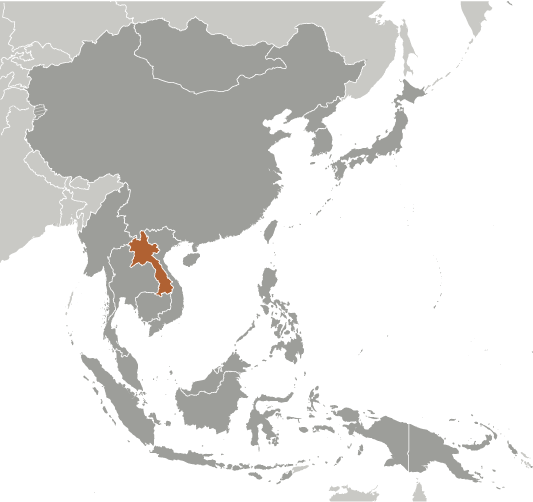
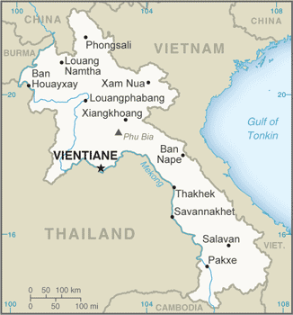

# Laos

## Introduction

**_Background:_**   
Modern-day Laos has its roots in the ancient Lao kingdom of Lan Xang, established in the 14th century under King FA NGUM. For 300 years Lan Xang had influence reaching into present-day Cambodia and Thailand, as well as over all of what is now Laos. After centuries of gradual decline, Laos came under the domination of Siam (Thailand) from the late 18th century until the late 19th century when it became part of French Indochina. The Franco-Siamese Treaty of 1907 defined the current Lao border with Thailand. In 1975, the communist Pathet Lao took control of the government ending a six-century-old monarchy and instituting a strict socialist regime closely aligned to Vietnam. A gradual, limited return to private enterprise and the liberalization of foreign investment laws began in 1988. Laos became a member of ASEAN in 1997 and the WTO in 2013.

## Geography

**_Location:_**   
Southeastern Asia, northeast of Thailand, west of Vietnam

**_Geographic coordinates:_**   
18 00 N, 105 00 E

**_Map references:_**   
Southeast Asia

**_Area:_**   
**total:** 236,800 sq km   
**land:** 230,800 sq km   
**water:** 6,000 sq km

**_Area - comparative:_**   
slightly larger than Utah

**_Land boundaries:_**   
**total:** 5,083 km   
**border countries:** Burma 235 km, Cambodia 541 km, China 423 km, Thailand 1,754 km, Vietnam 2,130 km

**_Coastline:_**   
0 km (landlocked)

**_Maritime claims:_**   
none (landlocked)

**_Climate:_**   
tropical monsoon; rainy season (May to November); dry season (December to April)

**_Terrain:_**   
mostly rugged mountains; some plains and plateaus

**_Elevation extremes:_**   
**lowest point:** Mekong River 70 m   
**highest point:** Phu Bia 2,817 m

**_Natural resources:_**   
timber, hydropower, gypsum, tin, gold, gemstones

**_Land use:_**   
**arable land:** 5.91%   
**permanent crops:** 0.42%   
**other:** 93.67% (2011)

**_Irrigated land:_**   
3,100 sq km (2005)

**_Total renewable water resources:_**   
333.5 cu km (2011)

**_Freshwater withdrawal (domestic/industrial/agricultural):_**   
**total:** 3.49 cu km/yr (4%/5%/91%)   
**per capita:** 588.9 cu m/yr (2005)

**_Natural hazards:_**   
floods, droughts

**_Environment - current issues:_**   
unexploded ordnance; deforestation; soil erosion; most of the population does not have access to potable water

**_Environment - international agreements:_**   
**party to:** Biodiversity, Climate Change, Climate Change-Kyoto Protocol, Desertification, Endangered Species, Environmental Modification, Law of the Sea, Ozone Layer Protection   
**signed, but not ratified:** none of the selected agreements

**_Geography - note:_**   
landlocked; most of the country is mountainous and thickly forested; the Mekong River forms a large part of the western boundary with Thailand

## People and Society

**_Nationality:_**   
**noun:** Lao(s) or Laotian(s)   
**adjective:** Lao or Laotian

**_Ethnic groups:_**   
Lao 55%, Khmou 11%, Hmong 8%, other (over 100 minor ethnic groups) 26% (2005 census)

**_Languages:_**   
Lao (official), French, English, various ethnic languages

**_Religions:_**   
Buddhist 67%, Christian 1.5%, other and unspecified 31.5% (2005 census)

**_Population:_**   
6,803,699 (July 2014 est.)

**_Age structure:_**   
**0-14 years:** 34.8% (male 1,195,364/female 1,173,520)   
**15-24 years:** 21.3% (male 719,205/female 728,729)   
**25-54 years:** 35% (male 1,176,018/female 1,208,452)   
**55-64 years:** 5.1% (male 169,291/female 175,815)   
**65 years and over:** 3.7% (male 116,299/female 141,006) (2014 est.)

**_Dependency ratios:_**   
**total dependency ratio:** 62.6 %   
**youth dependency ratio:** 56.4 %   
**elderly dependency ratio:** 6.2 %   
**potential support ratio:** 16.1 (2014 est.)

**_Median age:_**   
**total:** 22 years   
**male:** 21.7 years   
**female:** 22.3 years (2014 est.)

**_Population growth rate:_**   
1.59% (2014 est.)

**_Birth rate:_**   
24.76 births/1,000 population (2014 est.)

**_Death rate:_**   
7.74 deaths/1,000 population (2014 est.)

**_Net migration rate:_**   
-1.1 migrant(s)/1,000 population (2014 est.)

**_Urbanization:_**   
**urban population:** 34.3% of total population (2011)   
**rate of urbanization:** 4.41% annual rate of change (2010-15 est.)

**_Major urban areas - population:_**   
VIENTIANE (capital) 810,000 (2011)

**_Sex ratio:_**   
**at birth:** 1.04 male(s)/female   
**0-14 years:** 1.02 male(s)/female   
**15-24 years:** 0.99 male(s)/female   
**25-54 years:** 0.97 male(s)/female   
**55-64 years:** 0.99 male(s)/female   
**65 years and over:** 0.82 male(s)/female   
**total population:** 0.99 male(s)/female (2014 est.)

**_Maternal mortality rate:_**   
470 deaths/100,000 live births (2010)

**_Infant mortality rate:_**   
**total:** 54.53 deaths/1,000 live births   
**male:** 60.19 deaths/1,000 live births   
**female:** 48.64 deaths/1,000 live births (2014 est.)

**_Life expectancy at birth:_**   
**total population:** 63.51 years   
**male:** 61.54 years   
**female:** 65.56 years (2014 est.)

**_Total fertility rate:_**   
2.9 children born/woman (2014 est.)

**_Contraceptive prevalence rate:_**   
38.4% (2005)

**_Health expenditures:_**   
2.8% of GDP (2011)

**_Physicians density:_**   
0.19 physicians/1,000 population (2009)

**_Hospital bed density:_**   
0.7 beds/1,000 population (2010)

**_Drinking water source:_**   
**improved:** urban: 83.7% of population; rural: 64.9% of population; total: 71.5% of population   
**unimproved:** urban: 16.3% of population; rural: 35.1% of population; total: 28.5% of population (2012 est.)

**_Sanitation facility access:_**   
**improved:** urban: 90.4% of population; rural: 50.5% of population; total: 64.6% of population   
**unimproved:** urban: 9.6% of population; rural: 49.5% of population; total: 35.4% of population (2012 est.)

**_HIV/AIDS - adult prevalence rate:_**   
0.3% (2012 est.)

**_HIV/AIDS - people living with HIV/AIDS:_**   
11,500 (2012 est.)

**_HIV/AIDS - deaths:_**   
400 (2012 est.)

**_Major infectious diseases:_**   
**degree of risk:** very high   
**food or waterborne diseases:** bacterial and protozoal diarrhea, hepatitis A, and typhoid fever   
**vectorborne diseases:** dengue fever and malaria   
**note:** highly pathogenic H5N1 avian influenza has been identified in this country; it poses a negligible risk with extremely rare cases possible among US citizens who have close contact with birds (2013)

**_Obesity - adult prevalence rate:_**   
2.6% (2008)

**_Children under the age of 5 years underweight:_**   
31.6% (2006)

**_Education expenditures:_**   
2.8% of GDP (2010)

**_Literacy:_**   
**definition:** age 15 and over can read and write   
**total population:** 72.7%   
**male:** 82.5%   
**female:** 63.2% (2005 est.)

**_School life expectancy (primary to tertiary education):_**   
**total:** 10 years   
**male:** 11 years   
**female:** 10 years (2012)

**_Child labor - children ages 5-14:_**   
**total number:** 175,138   
**percentage:** 11 % (2006 est.)

## Government

**_Country name:_**   
**conventional long form:** Lao People's Democratic Republic   
**conventional short form:** Laos   
**local long form:** Sathalanalat Paxathipatai Paxaxon Lao   
**local short form:** Pathet Lao (unofficial)

**_Government type:_**   
Communist state

**_Capital:_**   
**name:** Vientiane (Viangchan)   
**geographic coordinates:** 17 58 N, 102 36 E   
**time difference:** UTC+7 (12 hours ahead of Washington, DC, during Standard Time)

**_Administrative divisions:_**   
16 provinces (khoueng, singular and plural) and 1 capital city\* (nakhon luang, singular and plural); Attapu, Bokeo, Bolikhamxai, Champasak, Houaphan, Khammouan, Louangnamtha, Louangphabang, Oudomxai, Phongsali, Salavan, Savannakhet, Viangchan (Vientiane)\*, Viangchan, Xaignabouli, Xekong, Xiangkhouang

**_Independence:_**   
19 July 1949 (from France)

**_National holiday:_**   
Republic Day, 2 December (1975)

**_Constitution:_**   
previous 1947 (preindependence); latest promulgated 13-15 August 1991; amended 2003 (2003)

**_Legal system:_**   
civil law system similar in form to the French system

**_International law organization participation:_**   
has not submitted an ICJ jurisdiction declaration; non-party state to the ICCt

**_Suffrage:_**   
18 years of age; universal

**_Executive branch:_**   
**chief of state:** President Lt. Gen. CHOUMMALI Saignason (since 8 June 2006); Vice President BOUN-GNANG Volachit (since 8 June 2006)   
**head of government:** Prime Minister THONGSING Thammavong (since 24 December 2010); First Deputy Prime Minister Maj. Gen. ASANG Laoli (since May 2002), Deputy Prime Ministers SOMSAVAT Lengsavat (since 26 February 1998), THONGLOUN Sisoulit (since 27 March 2001), and [vacant]; note - Deputy Prime Minister Maj. Gen. DOUANGCHAI Phichit was killed in a 17 May 2014 plane crash and no replacement has yet been named   
**cabinet:** ministers appointed by president, approved by National Assembly   
**elections:** president and vice president elected by National Assembly for five-year terms; election last held on 30 April 2011 (next to be held in 2016); prime minister nominated by the president and elected by the National Assembly for five-year term   
**election results:** CHOUMMALI Saignason elected president; BOUN-GNANG Volachit elected vice president; percent of National Assembly vote - NA; THONGSING Thammavong elected prime minister; percent of National Assembly vote - NA

**_Legislative branch:_**   
unicameral National Assembly (132 seats; members elected by popular vote from a list of candidates selected by the Lao People's Revolutionary Party to serve five-year terms)   
**elections:** last held on 30 April 2011 (next to be held in 2016)   
**election results:** percent of vote by party - NA; seats by party - LPRP 128, independents 4

**_Judicial branch:_**   
**highest court(s):** People's Supreme Court (consists of NA judges)   
**judge selection and term of office:** president of People's Supreme Court elected by National Assembly on recommendation of National Assembly Standing Committee; vice president of People's Supreme Court and judges appointed by National Assembly Standing Committee; term of office NA   
**subordinate courts:** provincial, municipal, district, and military courts

**_Political parties and leaders:_**   
Lao People's Revolutionary Party or LPRP [CHOUMMALI Saignason]; other parties proscribed

**_Political pressure groups and leaders:_**   
NA

**_International organization participation:_**   
ADB, ARF, ASEAN, CP, EAS, FAO, G-77, IAEA, IBRD, ICAO, ICRM, IDA, IFAD, IFC, IFRCS, ILO, IMF, Interpol, IOC, IPU, ISO (subscriber), ITU, MIGA, NAM, OIF, OPCW, PCA, UN, UNCTAD, UNESCO, UNIDO, UNWTO, UPU, WCO, WFTU (NGOs), WHO, WIPO, WMO, WTO

**_Diplomatic representation in the US:_**   
**chief of mission:** Ambassador SENG Soukhathivong (since 4 June 2010)   
**chancery:** 2222 S Street NW, Washington, DC 20008   
**telephone:** [1] (202) 332-6416   
**FAX:** [1] (202) 332-4923

**_Diplomatic representation from the US:_**   
**chief of mission:** Ambassador David A. CLUNE (since 16 September 2013)   
**embassy:** 19 Rue Bartholonie, That Dam, Vientiane   
**mailing address:** American Embassy Vientiane, APO AP 96546   
**telephone:** [856] 21-26-7000   
**FAX:** [856] 21-26-7190

**_Flag description:_**   
three horizontal bands of red (top), blue (double width), and red with a large white disk centered in the blue band; the red bands recall the blood shed for liberation; the blue band represents the Mekong River and prosperity; the white disk symbolizes the full moon against the Mekong River, but also signifies the unity of the people under the Lao People's Revolutionary Party, as well as the country's bright future

**_National symbol(s):_**   
elephant

**_National anthem:_**   
**name:** "Pheng Xat Lao" (Hymn of the Lao People)   
**lyrics/music:** SISANA Sisane/THONGDY Sounthonevichit   
**note:** music adopted 1945, lyrics adopted 1975; the anthem's lyrics were changed following the 1975 Communist revolution that overthrew the monarchy

## Economy

**_Economy - overview:_**   
The government of Laos, one of the few remaining one-party communist states, began decentralizing control and encouraging private enterprise in 1986. The results, starting from an extremely low base, were striking - growth averaged 6% per year from 1988-2008 except during the short-lived drop caused by the Asian financial crisis that began in 1997. Laos' growth exceeded 7% per year during 2008-13. Despite this high growth rate, Laos remains a country with an underdeveloped infrastructure, particularly in rural areas. It has a basic, but improving, road system, and limited external and internal land-line telecommunications. Electricity is available in 83 % of the country. Laos' economy is heavily dependent on capital-intensive natural resource exports. The labor force, however, still relies on agriculture, dominated by rice cultivation in lowland areas, which accounts for about 25% of GDP and 73% of total employment. Economic growth has reduced official poverty rates from 46% in 1992 to 26% in 2010. The economy also has benefited from high-profile foreign direct investment in hydropower, copper and gold mining, logging, and construction though some projects in these industries have drawn criticism for their environmental impacts. Laos gained Normal Trade Relations status with the US in 2004 and applied for Generalized System of Preferences trade benefits in 2013 after being admitted to the World Trade Organization earlier in the year. Laos is in the process of implementing a value-added tax system. Simplified investment procedures and expanded bank credits for small farmers and small entrepreneurs will improve Laos' economic prospects. The government appears committed to raising the country's profile among investors, but suffered through a fiscal crisis in 2013 brought about by public sector wage increases, fiscal mismanagement, and revenue shortfalls. The World Bank has declared that Laos' goal of graduating from the UN Development Program's list of least-developed countries by 2020 is achievable, and the country is preparing to enter the ASEAN Economic Community in 2015.

**_GDP (purchasing power parity):_**   
$20.78 billion (2013 est.)   
$19.18 billion (2012 est.)   
$17.78 billion (2011 est.)   
**note:** data are in 2013 US dollars

**_GDP (official exchange rate):_**   
$10.1 billion (2013 est.)

**_GDP - real growth rate:_**   
8.3% (2013 est.)   
7.9% (2012 est.)   
8% (2011 est.)

**_GDP - per capita (PPP):_**   
$3,100 (2013 est.)   
$2,900 (2012 est.)   
$2,700 (2011 est.)   
**note:** data are in 2013 US dollars

**_Gross national saving:_**   
27.4% of GDP (2013 est.)   
26.2% of GDP (2012 est.)   
25.2% of GDP (2011 est.)

**_GDP - composition, by end use:_**   
**household consumption:** 66.9%   
**government consumption:** 9.8%   
**investment in fixed capital:** 31.7%   
**investment in inventories:** -1.3%   
**exports of goods and services:** 40%   
**imports of goods and services:** -48.4%; (2013 est.)

**_GDP - composition, by sector of origin:_**   
**agriculture:** 24.8%   
**industry:** 32%   
**services:** 37.5% (2013 est.)

**_Agriculture - products:_**   
sweet potatoes, vegetables, corn, coffee, sugarcane, tobacco, cotton, tea, peanuts, rice; cassava (manioc, tapioca), water buffalo, pigs, cattle, poultry

**_Industries:_**   
mining (copper, tin, gold, gypsum); timber, electric power, agricultural processing, rubber, construction, garments, cement, tourism

**_Industrial production growth rate:_**   
11% (2013 est.)

**_Labor force:_**   
3.373 million (2013 est.)

**_Labor force - by occupation:_**   
**agriculture:** 73.1%   
**industry:** 6.1%   
**services:** 20.6% (2012 est.)

**_Unemployment rate:_**   
1.9% (2010 est.)   
2.5% (2009 est.)

**_Population below poverty line:_**   
22% (2013 est.)

**_Household income or consumption by percentage share:_**   
**lowest 10%:** 3.3%   
**highest 10%:** 30.3% (2008)

**_Distribution of family income - Gini index:_**   
36.7 (2008)   
34.6 (2002)

**_Budget:_**   
**revenues:** $2.481 billion   
**expenditures:** $2.642 billion (2013 est.)

**_Taxes and other revenues:_**   
24.6% of GDP (2013 est.)

**_Budget surplus (+) or deficit (-):_**   
-1.6% of GDP (2013 est.)

**_Public debt:_**   
46.3% of GDP (2013 est.)   
49.1% of GDP (2012 est.)

**_Fiscal year:_**   
1 October - 30 September

**_Inflation rate (consumer prices):_**   
6.5% (2013 est.)   
4.3% (2012 est.)

**_Central bank discount rate:_**   
4.3% (31 December 2010)   
4% (31 December 2009)

**_Commercial bank prime lending rate:_**   
23.2% (31 December 2013 est.)   
22.3% (31 December 2012 est.)

**_Stock of narrow money:_**   
$1.389 billion (31 December 2013 est.)   
$1.154 billion (31 December 2012 est.)

**_Stock of broad money:_**   
$4.071 billion (31 December 2013 est.)   
$3.673 billion (31 December 2012 est.)

**_Stock of domestic credit:_**   
$4.716 billion (31 December 2013 est.)   
$4.034 billion (31 December 2012 est.)

**_Market value of publicly traded shares:_**   
$1.012 billion (2012 est.)   
$NA (2011)

**_Current account balance:_**   
-$484.3 million (2013 est.)   
-$315.5 million (2012 est.)

**_Exports:_**   
$2.313 billion (2013 est.)   
$1.984 billion (2012 est.)

**_Exports - commodities:_**   
wood products, coffee, electricity, tin, copper, gold, cassava

**_Exports - partners:_**   
Thailand 34%, China 21.5%, Vietnam 12.2% (2012)

**_Imports:_**   
$3.238 billion (2013 est.)   
$2.744 billion (2012 est.)

**_Imports - commodities:_**   
machinery and equipment, vehicles, fuel, consumer goods

**_Imports - partners:_**   
Thailand 62.1%, China 16.2%, Vietnam 7.3% (2012)

**_Reserves of foreign exchange and gold:_**   
$845.4 million (31 December 2013 est.)   
$796.9 million (31 December 2012 est.)

**_Debt - external:_**   
$6.69 billion (31 December 2013 est.)   
$6.288 billion (31 December 2012 est.)

**_Stock of direct foreign investment - at home:_**   
$15.14 billion (31 December 2012 est.)   
$12.44 billion (31 December 2011 est.)

**_Exchange rates:_**   
kips (LAK) per US dollar -   
7,875.9 (2013 est.)   
8,007.3 (2012 est.)   
8,258.8 (2010 est.)   
8,516.04 (2009)   
8,760.69 (2008)

## Energy

**_Electricity - production:_**   
3.629 billion kWh (2010 est.)

**_Electricity - consumption:_**   
2.4 billion kWh (2012 est.)

**_Electricity - exports:_**   
2.537 billion kWh (2013 est.)

**_Electricity - imports:_**   
1 billion kWh (2010 est.)

**_Electricity - installed generating capacity:_**   
3.217 million kW (2013 est.)

**_Electricity - from fossil fuels:_**   
2.6% of total installed capacity (2010 est.)

**_Electricity - from nuclear fuels:_**   
0% of total installed capacity (2010 est.)

**_Electricity - from hydroelectric plants:_**   
97.4% of total installed capacity (2010 est.)

**_Electricity - from other renewable sources:_**   
0% of total installed capacity (2010 est.)

**_Crude oil - production:_**   
0 bbl/day (2012 est.)

**_Crude oil - exports:_**   
0 bbl/day (2010 est.)

**_Crude oil - imports:_**   
0 bbl/day (2010 est.)

**_Crude oil - proved reserves:_**   
0 bbl (1 January 2013 est.)

**_Refined petroleum products - production:_**   
0 bbl/day (2010 est.)

**_Refined petroleum products - consumption:_**   
3,391 bbl/day (2011 est.)

**_Refined petroleum products - exports:_**   
0 bbl/day (2010 est.)

**_Refined petroleum products - imports:_**   
3,160 bbl/day (2010 est.)

**_Natural gas - production:_**   
0 cu m (2011 est.)

**_Natural gas - consumption:_**   
0 cu m (2010 est.)

**_Natural gas - exports:_**   
0 cu m (2011 est.)

**_Natural gas - imports:_**   
0 cu m (2011 est.)

**_Natural gas - proved reserves:_**   
0 cu m (1 January 2013 est.)

**_Carbon dioxide emissions from consumption of energy:_**   
1.404 million Mt (2011 est.)

## Communications

**_Telephones - main lines in use:_**   
112,000 (2012)

**_Telephones - mobile cellular:_**   
6.492 million (2012)

**_Telephone system:_**   
**general assessment:** service to general public is improving; the government relies on a radiotelephone network to communicate with remote areas   
**domestic:** 4 service providers with mobile cellular usage growing very rapidly   
**international:** country code - 856; satellite earth station - 1 Intersputnik (Indian Ocean region) and a second to be developed by China (2012)

**_Broadcast media:_**   
6 TV stations operating out of Vientiane - 3 government-operated and the others commercial; 17 provincial stations operating with nearly all programming relayed via satellite from the government-operated stations in Vientiane; Chinese and Vietnamese programming relayed via satellite from Lao National TV; broadcasts available from stations in Thailand and Vietnam in border areas; multi-channel satellite and cable TV systems provide access to a wide range of foreign stations; state-controlled radio with state-operated Lao National Radio (LNR) broadcasting on 5 frequencies - 1 AM, 1 SW, and 3 FM; LNR's AM and FM programs are relayed via satellite constituting a large part of the programming schedules of the provincial radio stations; Thai radio broadcasts available in border areas and transmissions of multiple international broadcasters are also accessible (2012)

**_Internet country code:_**   
.la

**_Internet hosts:_**   
1,532 (2012)

**_Internet users:_**   
300,000 (2009)

## Transportation

**_Airports:_**   
41 (2013)

**_Airports - with paved runways:_**   
**total:** 8   
**2,438 to 3,047 m:** 3   
**1,524 to 2,437 m:** 4   
**914 to 1,523 m:** 1 (2013)

**_Airports - with unpaved runways:_**   
**total:** 33   
**1,524 to 2,437 m:** 2   
**914 to 1,523 m:** 9   
**under 914 m:** 22 (2013)

**_Pipelines:_**   
refined products 540 km (2013)

**_Roadways:_**   
**total:** 39,568 km   
**paved:** 530 km   
**unpaved:** 39,038 km (2007)

**_Waterways:_**   
4,600 km (primarily on the Mekong River and its tributaries; 2,900 additional km are intermittently navigable by craft drawing less than 0.5 m) (2012)

## Military

**_Military branches:_**   
Lao People's Armed Forces (LPAF): Lao People's Army (LPA; includes Riverine Force), Air Force (2011)

**_Military service age and obligation:_**   
18 years of age for compulsory or voluntary military service; conscript service obligation - minimum 18-months (2012)

**_Manpower available for military service:_**   
**males age 16-49:** 1,574,362   
**females age 16-49:** 1,607,856 (2010 est.)

**_Manpower fit for military service:_**   
**males age 16-49:** 1,111,629   
**females age 16-49:** 1,190,035 (2010 est.)

**_Manpower reaching militarily significant age annually:_**   
**male:** 71,400   
**female:** 73,038 (2010 est.)

**_Military expenditures:_**   
NA% (2012)   
0.23% of GDP (2011)   
NA% (2010)

**_Military - note:_**   
serving one of the world's least developed countries, the Lao People's Armed Forces (LPAF) is small, poorly funded, and ineffectively resourced; its mission focus is border and internal security, primarily in countering ethnic Hmong insurgent groups; together with the Lao People's Revolutionary Party and the government, the Lao People's Army (LPA) is the third pillar of state machinery, and as such is expected to suppress political and civil unrest and similar national emergencies, but the LPA also has upgraded skills to respond to avian influenza outbreaks; there is no perceived external threat to the state and the LPA maintains strong ties with the neighboring Vietnamese military (2008)

## Transnational Issues

**_Disputes - international:_**   
southeast Asian states have enhanced border surveillance to check the spread of avian flu; talks continue on completion of demarcation with Thailand but disputes remain over islands in the Mekong River; concern among Mekong River Commission members that China's construction of dams on the Mekong River and its tributaries will affect water levels; Cambodia and Vietnam are concerned about Laos' extensive upstream dam construction

**_Illicit drugs:_**   
estimated opium poppy cultivation in 2008 was 1,900 hectares, about a 73% increase from 2007; estimated potential opium production in 2008 more than tripled to 17 metric tons; unsubstantiated reports of domestic methamphetamine production; growing domestic methamphetamine problem (2007)

............................................................   
_Page last updated on June 20, 2014_
