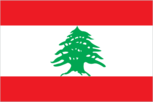
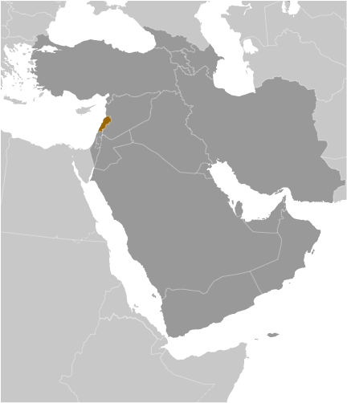
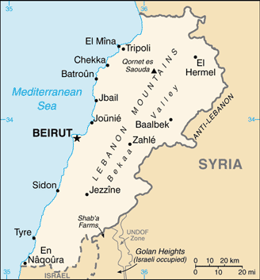

# Lebanon

## Introduction

**_Background:_**   
Following World War I, France acquired a mandate over the northern portion of the former Ottoman Empire province of Syria. The French demarcated the region of Lebanon in 1920 and granted this area independence in 1943. Since independence the country has been marked by periods of political turmoil interspersed with prosperity built on its position as a regional center for finance and trade. The country's 1975-90 civil war that resulted in an estimated 120,000 fatalities, was followed by years of social and political instability. Sectarianism is a key element of Lebanese political life. Neighboring Syria has long influenced Lebanon's foreign policy and internal policies, and its military occupied Lebanon from 1976 until 2005. The Lebanon-based Hizballah militia and Israel continued attacks and counterattacks against each other after Syria's withdrawal, and fought a brief war in 2006. Lebanon's borders with Syria and Israel remain unresolved.

## Geography

**_Location:_**   
Middle East, bordering the Mediterranean Sea, between Israel and Syria

**_Geographic coordinates:_**   
33 50 N, 35 50 E

**_Map references:_**   
Middle East

**_Area:_**   
**total:** 10,400 sq km   
**land:** 10,230 sq km   
**water:** 170 sq km

**_Area - comparative:_**   
about one-third the size of Maryland

**_Land boundaries:_**   
**total:** 454 km   
**border countries:** Israel 79 km, Syria 375 km

**_Coastline:_**   
225 km

**_Maritime claims:_**   
**territorial sea:** 12 nm

**_Climate:_**   
Mediterranean; mild to cool, wet winters with hot, dry summers; Lebanon mountains experience heavy winter snows

**_Terrain:_**   
narrow coastal plain; El Beqaa (Bekaa Valley) separates Lebanon and Anti-Lebanon Mountains

**_Elevation extremes:_**   
**lowest point:** Mediterranean Sea 0 m   
**highest point:** Qornet es Saouda 3,088 m

**_Natural resources:_**   
limestone, iron ore, salt, water-surplus state in a water-deficit region, arable land

**_Land use:_**   
**arable land:** 10.72%   
**permanent crops:** 12.06%   
**other:** 77.22% (2011)

**_Irrigated land:_**   
1,040 sq km (2003)

**_Total renewable water resources:_**   
4.5 cu km (2011)

**_Freshwater withdrawal (domestic/industrial/agricultural):_**   
**total:** 1.31 cu km/yr (29%/11%/60%)   
**per capita:** 316.8 cu m/yr (2005)

**_Natural hazards:_**   
dust storms, sandstorms

**_Environment - current issues:_**   
deforestation; soil erosion; desertification; air pollution in Beirut from vehicular traffic and the burning of industrial wastes; pollution of coastal waters from raw sewage and oil spills

**_Environment - international agreements:_**   
**party to:** Biodiversity, Climate Change, Climate Change-Kyoto Protocol, Desertification, Hazardous Wastes, Law of the Sea, Ozone Layer Protection, Ship Pollution, Wetlands   
**signed, but not ratified:** Environmental Modification, Marine Life Conservation

**_Geography - note:_**   
smallest country in continental Asia; Nahr el Litani is the only major river in Near East not crossing an international boundary; rugged terrain historically helped isolate, protect, and develop numerous factional groups based on religion, clan, and ethnicity

## People and Society

**_Nationality:_**   
**noun:** Lebanese (singular and plural)   
**adjective:** Lebanese

**_Ethnic groups:_**   
Arab 95%, Armenian 4%, other 1%   
**note:** many Christian Lebanese do not identify themselves as Arab but rather as descendents of the ancient Canaanites and prefer to be called Phoenicians

**_Languages:_**   
Arabic (official), French, English, Armenian

**_Religions:_**   
Muslim 54% (27% Sunni, 27% Shia), Christian 40.5% (includes 21% Maronite Catholic, 8% Greek Orthodox, 5% Greek Catholic, 6.5% other Christian), Druze 5.6%, very small numbers of Jews, Baha'is, Buddhists, Hindus, and Mormons   
**note:** 18 religious sects recognized (2012 est.)

**_Population:_**   
5,882,562 (July 2014 est.)

**_Age structure:_**   
**0-14 years:** 25.2% (male 758,153/female 723,619)   
**15-24 years:** 17.2% (male 515,591/female 493,879)   
**25-54 years:** 44.1% (male 1,309,544/female 1,283,074)   
**55-64 years:** 6.9% (male 185,503/female 219,242)   
**65 years and over:** 9.4% (male 175,911/female 218,046) (2014 est.)

**_Dependency ratios:_**   
**total dependency ratio:** 40.6 %   
**youth dependency ratio:** 28.3 %   
**elderly dependency ratio:** 12.3 %   
**potential support ratio:** 8.1 (2014 est.)

**_Median age:_**   
**total:** 29.3 years   
**male:** 28.7 years   
**female:** 29.8 years (2014 est.)

**_Population growth rate:_**   
9.37% (2014 est.)

**_Birth rate:_**   
14.8 births/1,000 population (2014 est.)

**_Death rate:_**   
4.95 deaths/1,000 population (2014 est.)

**_Net migration rate:_**   
83.82 migrant(s)/1,000 population (2014 est.)

**_Urbanization:_**   
**urban population:** 87.2% of total population (2011)   
**rate of urbanization:** 0.86% annual rate of change (2010-15 est.)

**_Major urban areas - population:_**   
BEIRUT (capital) 2.022 million (2011)

**_Sex ratio:_**   
**at birth:** 1.05 male(s)/female   
**0-14 years:** 1.05 male(s)/female   
**15-24 years:** 1.04 male(s)/female   
**25-54 years:** 1.02 male(s)/female   
**55-64 years:** 1 male(s)/female   
**65 years and over:** 0.86 male(s)/female   
**total population:** 0.96 male(s)/female (2014 est.)

**_Maternal mortality rate:_**   
25 deaths/100,000 live births (2010)

**_Infant mortality rate:_**   
**total:** 7.98 deaths/1,000 live births   
**male:** 8.4 deaths/1,000 live births   
**female:** 7.53 deaths/1,000 live births (2014 est.)

**_Life expectancy at birth:_**   
**total population:** 77.22 years   
**male:** 76.03 years   
**female:** 78.46 years (2014 est.)

**_Total fertility rate:_**   
1.74 children born/woman (2014 est.)

**_Contraceptive prevalence rate:_**   
58% (2004)

**_Health expenditures:_**   
6.3% of GDP (2011)

**_Physicians density:_**   
3.54 physicians/1,000 population (2009)

**_Hospital bed density:_**   
3.5 beds/1,000 population (2009)

**_Drinking water source:_**   
**improved:** urban: 100% of population; rural: 100% of population; total: 100% of population   
**unimproved:** urban: 0% of population; rural: 0% of population; total: 0% of population (2012 est.)

**_Sanitation facility access:_**   
**improved:** urban: 100% of population; rural: 87% of population; total: 98.3% of population   
**unimproved:** urban: 0% of population; rural: 13% of population; total: 1.7% of population (2005 est.)

**_HIV/AIDS - adult prevalence rate:_**   
0.1% (2009 est.)

**_HIV/AIDS - people living with HIV/AIDS:_**   
3,600 (2009 est.)

**_HIV/AIDS - deaths:_**   
fewer than 500 (2009 est.)

**_Obesity - adult prevalence rate:_**   
27.4% (2008)

**_Children under the age of 5 years underweight:_**   
4.2% (2004)

**_Education expenditures:_**   
2.2% of GDP (2012)

**_Literacy:_**   
**definition:** age 15 and over can read and write   
**total population:** 89.6%   
**male:** 93.4%   
**female:** 86% (2007 est.)

**_School life expectancy (primary to tertiary education):_**   
**total:** 13 years   
**male:** 13 years   
**female:** 13 years (2012)

**_Child labor - children ages 5-14:_**   
**total number:** 54,387   
**percentage:** 7 % (2000 est.)

**_Unemployment, youth ages 15-24:_**   
**total:** 16.8%   
**male:** 14.6%   
**female:** 22.3% (2009)

## Government

**_Country name:_**   
**conventional long form:** Lebanese Republic   
**conventional short form:** Lebanon   
**local long form:** Al Jumhuriyah al Lubnaniyah   
**local short form:** Lubnan   
**former:** Greater Lebanon

**_Government type:_**   
republic

**_Capital:_**   
**name:** Beirut   
**geographic coordinates:** 33 52 N, 35 30 E   
**time difference:** UTC+2 (7 hours ahead of Washington, DC, during Standard Time)   
**daylight saving time:** +1hr, begins last Sunday in March; ends last Sunday in October

**_Administrative divisions:_**   
6 governorates (mohafazat, singular - mohafazah); Beqaa, Beyrouth (Beirut), Liban-Nord, Liban-Sud, Mont-Liban, Nabatiye   
**note:** two new governorates - Aakkar and Baalbek-Hermel - have been legislated but not yet implemented

**_Independence:_**   
22 November 1943 (from League of Nations mandate under French administration)

**_National holiday:_**   
Independence Day, 22 November (1943)

**_Constitution:_**   
drafted 15 May 1926, adopted 23 May 1926; amended several times, last in 2004 (2013)

**_Legal system:_**   
mixed legal system of civil law based on the French civil code, Ottoman legal tradition, and religious laws covering personal status, marriage, divorce, and other family relations of the Jewish, Islamic, and Christian communities

**_International law organization participation:_**   
has not submitted an ICJ jurisdiction declaration; non-party state to the ICCt

**_Suffrage:_**   
21 years of age; compulsory for all males; authorized for women at age 21 with elementary education; excludes military personnel

**_Executive branch:_**   
**chief of state:** President (vacant); note - Parliament has tried six times to elect a president and failed; President Michel SULAYMAN's term expired on 24 May 2014; the prime minister and his cabinet are temporarily taking over the duties of the president   
**head of government:** Prime Minister Tamam SALAM (since 6 April 2013); Deputy Prime Minister Samir MOQBIL (since 7 July 2011)   
**cabinet:** Cabinet chosen by the prime minister in consultation with the president and members of the National Assembly   
**elections:** president elected by the National Assembly for a six-year term (may not serve consecutive terms); first round of election held on 23 April 2014 (next to be held in 2020); the prime minister and deputy prime minister appointed by the president in consultation with the National Assembly   
**election results:** 23 April 2014 first round parliamentary vote - Samir GEAGEA 48, Henri HELOU 16, Amin GEMAYEL 1; note - 86 out of a possible 128 votes required to win election; five subsequent rounds have failed because there was no quorum; a seventh round is scheduled to take place 18 June 2014

**_Legislative branch:_**   
unicameral National Assembly or Majlis al-Nuwab (Arabic) or Assemblee Nationale (French) (128 seats; members elected by popular vote on the basis of sectarian proportional representation to serve four-year terms)   
**elections:** last held on 7 June 2009 (next to be held in 2013)   
**election results:** percent of vote by group - March 8 Coalition 54.7%, March 14 Coalition 45.3%; seats by group - March 14 Coalition 71; March 8 Coalition 57; seats by party following 16 July 2012 byelection held to fill one seat - March 14 Coalition 72, March 8 Coalition 56

**_Judicial branch:_**   
**highest court(s):** Court of Cassation or Supreme Court (organized into 4 divisions, each with a presiding judge and 2 associate judges); Constitutional Council (consists of 10 members)   
**judge selection and term of office:** Court of Cassation judges appointed by Supreme Judicial Council, headed by the chief justice, and includes other judicial officials; judge tenure NA; Constitutional Council members appointed - 5 by the Council of Ministers and 5 by parliament; members serve 5-year terms   
**subordinate courts:** Courts of Appeal (6); Courts of First Instance; specialized tribunals, religious courts; military courts

**_Political parties and leaders:_**   
**14 March Coalition:** Democratic Left [Ilyas ATALLAH]; Democratic Renewal Movement [Nassib LAHUD]; Future Movement Bloc [Sa'ad al-HARIRI]; Kataeb Party [Amine GEMAYEL]; Lebanese Forces [Samir JA'JA]; Tripoli Independent Bloc;   
**8 March Coalition:** Development and Resistance Bloc [Nabih BERRI, leader of Amal Movement]; Free Patriotic Movement [Michel AWN]; Loyalty to the Resistance Bloc [Mohammad RA'AD] (includes Hizballah [Hassan NASRALLAH]); Nasserite Popular Movement [Usama SAAD]; Popular Bloc [Elias SKAFF]; Syrian Ba'th Party [Sayez SHUKR]; Syrian Social Nationalist Party [Ali QANSO]; Tashnaq [Hovig MEKHITIRIAN];   
**Independent:** Democratic Gathering Bloc [Walid JUNBLATT, leader of Progressive Socialist Party]; Metn Bloc [Michel MURR]

**_Political pressure groups and leaders:_**   
Maronite Church [Patriarch Bishara al-Ra'i]   
**other:** note - most sects retain militias and a number of militant groups operate in Palestinian refugee camps

**_International organization participation:_**   
ABEDA, AFESD, AMF, CAEU, FAO, G-24, G-77, IAEA, IBRD, ICAO, ICC (national committees), ICRM, IDA, IDB, IFAD, IFC, IFRCS, ILO, IMF, IMO, IMSO, Interpol, IOC, IPU, ISO, ITSO, ITU, LAS, MIGA, NAM, OAS (observer), OIC, OIF, OPCW, PCA, UN, UNCTAD, UNESCO, UNHCR, UNIDO, UNRWA, UNWTO, UPU, WCO, WFTU (NGOs), WHO, WIPO, WMO, WTO (observer)

**_Diplomatic representation in the US:_**   
**chief of mission:** Ambassador Antoine CHEDID (since 4 June 2008)   
**chancery:** 2560 28th Street NW, Washington, DC 20008   
**telephone:** [1] (202) 939-6300   
**FAX:** [1] (202) 939-6324   
**consulate(s) general:** Detroit, New York, Los Angeles

**_Diplomatic representation from the US:_**   
**chief of mission:** Ambassador David HALE (since 6 September 2013)   
**embassy:** Awkar, Lebanon (Awkar facing the Municipality)   
**mailing address:** P. O. Box 70-840, Antelias, Lebanon; from US: US Embassy Beirut, 6070 Beirut Place, Washington, DC 20521-6070   
**telephone:** [961] (4) 542600, 543600   
**FAX:** [961] (4) 544136

**_Flag description:_**   
three horizontal bands consisting of red (top), white (middle, double width), and red (bottom) with a green cedar tree centered in the white band; the red bands symbolize blood shed for liberation, the white band denotes peace, the snow of the mountains, and purity; the green cedar tree is the symbol of Lebanon and represents eternity, steadiness, happiness, and prosperity

**_National symbol(s):_**   
cedar tree

**_National anthem:_**   
**name:** "Kulluna lil-watan" (All Of Us, For Our Country!)   
**lyrics/music:** Rachid NAKHLE/Wadih SABRA   
**note:** adopted 1927; the anthem was chosen following a nationwide competition

## Economy

**_Economy - overview:_**   
Lebanon has a free-market economy and a strong laissez-faire commercial tradition. The government does not restrict foreign investment; however, the investment climate suffers from red tape, corruption, arbitrary licensing decisions, complex customs procedures, high taxes, tariffs, and fees, archaic legislation, and weak intellectual property rights. The Lebanese economy is service-oriented; main growth sectors include banking and tourism. The 1975-90 civil war seriously damaged Lebanon's economic infrastructure, cut national output by half, and derailed Lebanon's position as a Middle Eastern entrepot and banking hub. Following the civil war, Lebanon rebuilt much of its war-torn physical and financial infrastructure by borrowing heavily, mostly from domestic banks, which saddled the government with a huge debt burden. Pledges of economic and financial reforms made at separate international donor conferences during the 2000s have mostly gone unfulfilled, including those made during the Paris III Donor Conference in 2007 following the July 2006 war. The collapse of the MIKATI government in early 2011 over its backing of the Special Tribunal for Lebanon and the conflict in neighboring Syria slowed economic growth to the 1-2% range in 2011-13, after four years of 8% average growth. In September 2011 the Cabinet endorsed a bill that would provide $1.2 billion in funding to improve Lebanon's downtrodden electricity sector, but fiscal limitations will test the government's ability to invest in other areas, such as water.

**_GDP (purchasing power parity):_**   
$64.31 billion (2013 est.)   
$63.36 billion (2012 est.)   
$62.42 billion (2011 est.)   
**note:** data are in 2013 US dollars

**_GDP (official exchange rate):_**   
$43.49 billion (2013 est.)

**_GDP - real growth rate:_**   
1.5% (2013 est.)   
1.5% (2012 est.)   
1.5% (2011 est.)

**_GDP - per capita (PPP):_**   
$15,800 (2013 est.)   
$15,800 (2012 est.)   
$15,800 (2011 est.)   
**note:** data are in 2013 US dollars

**_Gross national saving:_**   
24.6% of GDP (2013 est.)   
29.2% of GDP (2012 est.)   
22.3% of GDP (2011 est.)

**_GDP - composition, by end use:_**   
**household consumption:** 82.3%   
**government consumption:** 14.9%   
**investment in fixed capital:** 31.2%   
**exports of goods and services:** 18.6%   
**imports of goods and services:** -47%; (2013 est.)

**_GDP - composition, by sector of origin:_**   
**agriculture:** 4.6%   
**industry:** 20%   
**services:** 75.4% (2013 est.)

**_Agriculture - products:_**   
citrus, grapes, tomatoes, apples, vegetables, potatoes, olives, tobacco; sheep, goats

**_Industries:_**   
banking, tourism, food processing, wine, jewelry, cement, textiles, mineral and chemical products, wood and furniture products, oil refining, metal fabricating

**_Industrial production growth rate:_**   
3% (2013 est.)

**_Labor force:_**   
1.481 million   
**note:** does not include as many as 1 million foreign workers (2007 est.)

**_Labor force - by occupation:_**   
**agriculture:** NA%   
**industry:** NA%   
**services:** NA%

**_Unemployment rate:_**   
NA%

**_Population below poverty line:_**   
28% (1999 est.)

**_Household income or consumption by percentage share:_**   
**lowest 10%:** NA%   
**highest 10%:** NA%

**_Budget:_**   
**revenues:** $9.487 billion   
**expenditures:** $13.56 billion (2013 est.)

**_Taxes and other revenues:_**   
21.8% of GDP (2013 est.)

**_Budget surplus (+) or deficit (-):_**   
-9.4% of GDP (2013 est.)

**_Public debt:_**   
120% of GDP (2013 est.)   
119.6% of GDP (2012 est.)   
**note:** data cover central government debt, and exclude debt instruments issued (or owned) by government entities other than the treasury; the data include treasury debt held by foreign entities; the data include debt issued by subnational entities, as well as intra-governmental debt; intra-governmental debt consists of treasury borrowings from surpluses in the social funds, such as for retirement, medical care, and unemployment

**_Fiscal year:_**   
calendar year

**_Inflation rate (consumer prices):_**   
5% (2013 est.)   
6.4% (2012 est.)

**_Central bank discount rate:_**   
3.5% (31 December 2010 est.)   
10% (31 December 2009 est.)

**_Commercial bank prime lending rate:_**   
7.5% (31 December 2013 est.)   
7.25% (31 December 2012 est.)

**_Stock of narrow money:_**   
$5.419 billion (31 December 2013 est.)   
$4.712 billion (31 December 2012 est.)

**_Stock of broad money:_**   
$97.04 billion (31 December 2011 est.)   
$92 billion (31 December 2010 est.)

**_Stock of domestic credit:_**   
$80.3 billion (31 December 2013 est.)   
$75.76 billion (31 December 2012 est.)

**_Market value of publicly traded shares:_**   
$10.3 billion (31 December 2012 est.)   
$10.16 billion (31 December 2011)   
$12.59 billion (31 December 2010 est.)

**_Current account balance:_**   
-$3.224 billion (2013 est.)   
-$1.663 billion (2012 est.)

**_Exports:_**   
$5.826 billion (2013 est.)   
$5.615 billion (2012 est.)

**_Exports - commodities:_**   
jewelry, base metals, chemicals, miscellaneous consumer goods, fruit and vegetables, tobacco, construction minerals, electric power machinery and switchgear, textile fibers, paper

**_Exports - partners:_**   
South Africa 19.3%, Switzerland 12.2%, Saudi Arabia 8%, UAE 7.9%, Syria 6.6%, Iraq 4.7% (2012)

**_Imports:_**   
$20.97 billion (2013 est.)   
$20.33 billion (2012 est.)

**_Imports - commodities:_**   
petroleum products, cars, medicinal products, clothing, meat and live animals, consumer goods, paper, textile fabrics, tobacco, electrical machinery and equipment, chemicals

**_Imports - partners:_**   
US 11.2%, Italy 8.6%, China 8.3%, France 7.2%, Germany 5.6%, Turkey 4.5%, Greece 4.2% (2012)

**_Reserves of foreign exchange and gold:_**   
$51.95 billion (31 December 2013 est.)   
$52.5 billion (31 December 2012 est.)

**_Debt - external:_**   
$26.74 billion (31 December 2013 est.)   
$25.16 billion (31 December 2012 est.)

**_Stock of direct foreign investment - at home:_**   
$NA

**_Stock of direct foreign investment - abroad:_**   
$NA

**_Exchange rates:_**   
Lebanese pounds (LBP) per US dollar -   
1,507.5 (2013 est.)   
1,507.5 (2012 est.)   
1,507.5 (2010 est.)   
1,507.5 (2009)   
1,507.5 (2008)

## Energy

**_Electricity - production:_**   
14.81 billion kWh (2010 est.)

**_Electricity - consumption:_**   
14.19 billion kWh (2010 est.)

**_Electricity - exports:_**   
0 kWh (2012 est.)

**_Electricity - imports:_**   
1.245 billion kWh (2010 est.)

**_Electricity - installed generating capacity:_**   
2.314 million kW (2010 est.)

**_Electricity - from fossil fuels:_**   
87.9% of total installed capacity (2010 est.)

**_Electricity - from nuclear fuels:_**   
0% of total installed capacity (2010 est.)

**_Electricity - from hydroelectric plants:_**   
12.1% of total installed capacity (2010 est.)

**_Electricity - from other renewable sources:_**   
0% of total installed capacity (2010 est.)

**_Crude oil - production:_**   
0 bbl/day (2012 est.)

**_Crude oil - exports:_**   
0 bbl/day (2010 est.)

**_Crude oil - imports:_**   
0 bbl/day (2010 est.)

**_Crude oil - proved reserves:_**   
0 bbl (1 January 2013 est.)

**_Refined petroleum products - production:_**   
0 bbl/day (2010 est.)

**_Refined petroleum products - consumption:_**   
106,700 bbl/day (2011 est.)

**_Refined petroleum products - exports:_**   
0 bbl/day (2010 est.)

**_Refined petroleum products - imports:_**   
120,400 bbl/day (2010 est.)

**_Natural gas - production:_**   
0 cu m (2011 est.)

**_Natural gas - consumption:_**   
150 million cu m (2010 est.)

**_Natural gas - exports:_**   
0 cu m (2011 est.)

**_Natural gas - imports:_**   
150 million cu m (2010 est.)

**_Natural gas - proved reserves:_**   
0 cu m (1 January 2013 est.)

**_Carbon dioxide emissions from consumption of energy:_**   
19.45 million Mt (2011 est.)

## Communications

**_Telephones - main lines in use:_**   
878,000 (2012)

**_Telephones - mobile cellular:_**   
4 million (2012)

**_Telephone system:_**   
**general assessment:** repair of the telecommunications system, severely damaged during the civil war, now complete   
**domestic:** two mobile-cellular networks provide good service; combined fixed-line and mobile-cellular subscribership roughly 100 per 100 persons   
**international:** country code - 961; submarine cable links to Cyprus, Egypt, and Syria; satellite earth stations - 2 Intelsat (1 Indian Ocean and 1 Atlantic Ocean); coaxial cable to Syria (2011)

**_Broadcast media:_**   
7 TV stations, 1 of which is state-owned; more than 30 radio stations, 1 of which is state-owned; satellite and cable TV services available; transmissions of at least 2 international broadcasters are accessible through partner stations (2007)

**_Internet country code:_**   
.lb

**_Internet hosts:_**   
64,926 (2012)

**_Internet users:_**   
1 million (2009)

## Transportation

**_Airports:_**   
8 (2013)

**_Airports - with paved runways:_**   
**total:** 5   
**over 3,047 m:** 1   
**2,438 to 3,047 m:** 2   
**1,524 to 2,437 m:** 1   
**under 914 m:** 1 (2013)

**_Airports - with unpaved runways:_**   
**total:** 3   
**914 to 1,523 m:** 2   
**under 914 m:** 1 (2013)

**_Heliports:_**   
1 (2013)

**_Pipelines:_**   
gas 88 km (2013)

**_Railways:_**   
**total:** 401 km   
**standard gauge:** 319 km 1.435-m gauge   
**narrow gauge:** 82 km 1.050-m gauge   
**note:** rail system unusable because of the damage done during fighting in the 1980s and in 2006 (2008)

**_Roadways:_**   
**total:** 6,970 km (includes 170 km of expressways) (2005)

**_Merchant marine:_**   
**total:** 29   
**by type:** bulk carrier 4, cargo 7, carrier 17, vehicle carrier 1   
**foreign-owned:** 2 (Syria 2)   
**registered in other countries:** 34 (Barbados 2, Cambodia 5, Comoros 2, Egypt 1, Georgia 1, Honduras 2, Liberia 1, Malta 6, Moldova 1, Panama 2, Saint Vincent and the Grenadines 2, Sierra Leone 2, Togo 6, unknown 1) (2010)

**_Ports and terminals:_**   
**major seaport(s):** Beirut, Tripoli   
**container port(s) (TEUs):** Beirut (1,034,249)

## Military

**_Military branches:_**   
Lebanese Armed Forces (LAF): Lebanese Army ((Al Jaysh al Lubnani) includes Lebanese Navy (Al Quwwat al Bahiriyya al Lubnaniya), Lebanese Air Force (Al Quwwat al Jawwiya al Lubnaniya)) (2013)

**_Military service age and obligation:_**   
17-30 years of age for voluntary military service; 18-24 years of age for officer candidates; no conscription (2013)

**_Manpower available for military service:_**   
**males age 16-49:** 1,081,016   
**females age 16-49:** 1,115,349 (2010 est.)

**_Manpower fit for military service:_**   
**males age 16-49:** 920,825   
**females age 16-49:** 941,806 (2010 est.)

**_Manpower reaching militarily significant age annually:_**   
**male:** 36,856   
**female:** 35,121 (2010 est.)

**_Military expenditures:_**   
4.04% of GDP (2012)   
4.06% of GDP (2011)   
4.04% of GDP (2010)

## Transnational Issues

**_Disputes - international:_**   
lacking a treaty or other documentation describing the boundary, portions of the Lebanon-Syria boundary are unclear with several sections in dispute; since 2000, Lebanon has claimed Shab'a Farms area in the Israeli-occupied Golan Heights; the roughly 2,000-strong UN Interim Force in Lebanon has been in place since 1978

**_Refugees and internally displaced persons:_**   
**refugees (country of origin):** 447,328 (Palestinian refugees (UNRWA)); 1,107,550 (Syria) (2014)   
**IDPs:** at least 20,000 (2007 Lebanese security forces' destruction of Palestinian refugee camp) (2013)

**_Trafficking in persons:_**   
**current situation:** Lebanon is a source, transit, and destination country for women and children subjected to forced labor and sex trafficking; Eastern European women and children are transported through Lebanon for sexual exploitation in other Middle Eastern countries; women from Sri Lanka, the Philippines, Ethiopia, Kenya, Bangladesh, Nepal, Madagascar, Congo, Togo, Cameroon, and Nigeria are recruited by agencies to work in domestic service but are often subject to conditions indicative of forced labor, including the withholding of passports, nonpayment of wages, restricted movement, threats, and abuse; Lebanon's artiste visa program enabling women to work as dancers for three months in the adult entertainment industry sustains a significant sex trade; anecdotal information indicates some Lebanese children are victims of forced labor, such as street begging and commercial sexual exploitation; Syrian refugee women and children in Lebanon are at increased risk of sex trafficking   
**tier rating:** Tier 2 Watch List - Lebanon does not fully comply with the minimum standards for the elimination of trafficking; however, it is making significant efforts to do so; the government conducts investigations of human trafficking and possibly some prosecutions but for another year did not report convicting any trafficking offenders or officials complicit in human trafficking; the government continues to lack a formal system for identifying victims and does not have a policy to protect victims from being punished for crimes committed as a direct result of being trafficked; NGOs, rather than the government, provide victim assistance and protection (2013)

**_Illicit drugs:_**   
cannabis cultivation dramatically reduced to 2,500 hectares in 2002 despite continued significant cannabis consumption; opium poppy cultivation minimal; small amounts of Latin American cocaine and Southwest Asian heroin transit country on way to European markets and for Middle Eastern consumption; money laundering of drug proceeds fuels concern that extremists are benefiting from drug trafficking

............................................................   
_Page last updated on June 20, 2014_
