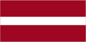
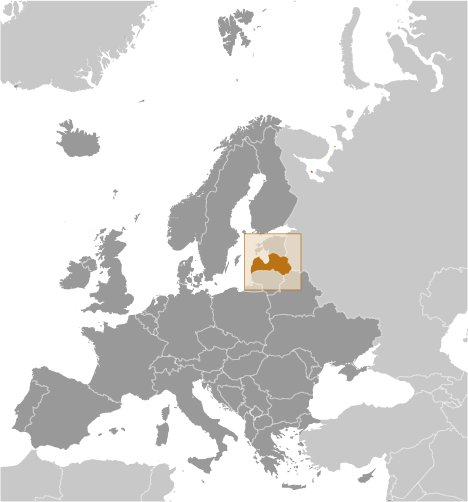
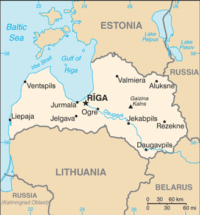

# Latvia

## Introduction

**_Background:_**   
The name "Latvia" originates from the ancient Latgalians, one of four eastern Baltic tribes that formed the ethnic core of the Latvian people (ca. 8th-12th centuries A.D.). The region subsequently came under the control of Germans, Poles, Swedes, and finally, Russians. A Latvian republic emerged following World War I, but it was annexed by the USSR in 1940 - an action never recognized by the US and many other countries. Latvia reestablished its independence in 1991 following the breakup of the Soviet Union. Although the last Russian troops left in 1994, the status of the Russian minority (some 28% of the population) remains of concern to Moscow. Latvia acceded to both NATO and the EU in the spring of 2004; it joined the eurozone in 2014.

## Geography

**_Location:_**   
Eastern Europe, bordering the Baltic Sea, between Estonia and Lithuania

**_Geographic coordinates:_**   
57 00 N, 25 00 E

**_Map references:_**   
Europe

**_Area:_**   
**total:** 64,589 sq km   
**land:** 62,249 sq km   
**water:** 2,340 sq km

**_Area - comparative:_**   
slightly larger than West Virginia

**_Land boundaries:_**   
**total:** 1,382 km   
**border countries:** Belarus 171 km, Estonia 343 km, Lithuania 576 km, Russia 292 km

**_Coastline:_**   
498 km

**_Maritime claims:_**   
**territorial sea:** 12 nm   
**exclusive economic zone:** 200 nm   
**continental shelf:** 200 m depth or to the depth of exploitation

**_Climate:_**   
maritime; wet, moderate winters

**_Terrain:_**   
low plain

**_Elevation extremes:_**   
**lowest point:** Baltic Sea 0 m   
**highest point:** Gaizina Kalns 312 m

**_Natural resources:_**   
peat, limestone, dolomite, amber, hydropower, timber, arable land

**_Land use:_**   
**arable land:** 17.96%   
**permanent crops:** 0.11%   
**other:** 81.93% (2011)

**_Irrigated land:_**   
8.3 sq km   
**note:** land in Latvia is often too wet and in need of drainage not irrigation; approximately 16,000 sq km or 85% of agricultural land has been improved by drainage (2007)

**_Total renewable water resources:_**   
35.45 cu km (2011)

**_Freshwater withdrawal (domestic/industrial/agricultural):_**   
**total:** 0.42 cu km/yr (42%/45%/13%)   
**per capita:** 177.9 cu m/yr (2007)

**_Natural hazards:_**   
NA

**_Environment - current issues:_**   
Latvia's environment has benefited from a shift to service industries after the country regained independence; the main environmental priorities are improvement of drinking water quality and sewage system, household, and hazardous waste management, as well as reduction of air pollution; in 2001, Latvia closed the EU accession negotiation chapter on environment committing to full enforcement of EU environmental directives by 2010

**_Environment - international agreements:_**   
**party to:** Air Pollution, Air Pollution-Persistent Organic Pollutants, Biodiversity, Climate Change, Climate Change-Kyoto Protocol, Desertification, Endangered Species, Hazardous Wastes, Law of the Sea, Ozone Layer Protection, Ship Pollution, Wetlands   
**signed, but not ratified:** none of the selected agreements

**_Geography - note:_**   
most of the country is composed of fertile low-lying plains with some hills in the east

## People and Society

**_Nationality:_**   
**noun:** Latvian(s)   
**adjective:** Latvian

**_Ethnic groups:_**   
Latvian 61.1%, Russian 26.2%, Belarusian 3.5%, Ukrainian 2.3%, Polish 2.2%, Lithuanian 1.3%, other 3.4% (2013 est.)

**_Languages:_**   
Latvian (official) 56.3%, Russian 33.8%, other 0.6% (includes Polish, Ukrainian, and Belarusian), unspecified 9.4% (2011 est.)

**_Religions:_**   
Lutheran 19.6%, Orthodox 15.3%, other Christian 1%, other 0.4%, unspecified 63.7% (2006)

**_Population:_**   
2,165,165 (July 2014 est.)

**_Age structure:_**   
**0-14 years:** 14.2% (male 156,851/female 150,074)   
**15-24 years:** 11% (male 121,435/female 116,602)   
**25-54 years:** 44.8% (male 481,336/female 487,991)   
**55-64 years:** 12.8% (male 122,544/female 155,114)   
**65 years and over:** 17.1% (male 121,668/female 251,550) (2014 est.)

**_Dependency ratios:_**   
**total dependency ratio:** 51 %   
**youth dependency ratio:** 22.9 %   
**elderly dependency ratio:** 28.1 %   
**potential support ratio:** 3.6 (2014 est.)

**_Median age:_**   
**total:** 41.4 years   
**male:** 38.4 years   
**female:** 44.3 years (2014 est.)

**_Population growth rate:_**   
-0.62% (2014 est.)

**_Birth rate:_**   
9.79 births/1,000 population (2014 est.)

**_Death rate:_**   
13.6 deaths/1,000 population (2014 est.)

**_Net migration rate:_**   
-2.37 migrant(s)/1,000 population (2014 est.)

**_Urbanization:_**   
**urban population:** 67.7% of total population (2011)   
**rate of urbanization:** -0.38% annual rate of change (2010-15 est.)

**_Major urban areas - population:_**   
RIGA (capital) 701,000 (2011)

**_Sex ratio:_**   
**at birth:** 1.05 male(s)/female   
**0-14 years:** 1.05 male(s)/female   
**15-24 years:** 1.04 male(s)/female   
**25-54 years:** 0.99 male(s)/female   
**55-64 years:** 0.86 male(s)/female   
**65 years and over:** 0.48 male(s)/female   
**total population:** 0.86 male(s)/female (2014 est.)

**_Mother's mean age at first birth:_**   
26.4 (2011 est.)

**_Maternal mortality rate:_**   
34 deaths/100,000 live births (2010)

**_Infant mortality rate:_**   
**total:** 7.91 deaths/1,000 live births   
**male:** 9.6 deaths/1,000 live births   
**female:** 6.13 deaths/1,000 live births (2014 est.)

**_Life expectancy at birth:_**   
**total population:** 73.44 years   
**male:** 68.41 years   
**female:** 78.75 years (2014 est.)

**_Total fertility rate:_**   
1.35 children born/woman (2014 est.)

**_Contraceptive prevalence rate:_**   
67.8%   
**note:** percent of women aged 18-49 (1995)

**_Health expenditures:_**   
6.7% of GDP (2010)

**_Physicians density:_**   
2.9 physicians/1,000 population (2010)

**_Hospital bed density:_**   
5.3 beds/1,000 population (2010)

**_Drinking water source:_**   
**improved:** urban: 99.6% of population; rural: 95.8% of population; total: 98.4% of population   
**unimproved:** urban: 0.4% of population; rural: 4.2% of population; total: 1.6% of population (2012 est.)

**_Sanitation facility access:_**   
**improved:** urban: 82.1% of population; rural: 71.1% of population; total: 78.6% of population   
**unimproved:** urban: 17.9% of population; rural: 28.9% of population; total: 21.4% of population (2009 est.)

**_HIV/AIDS - adult prevalence rate:_**   
0.7% (2009 est.)

**_HIV/AIDS - people living with HIV/AIDS:_**   
8,600 (2009 est.)

**_HIV/AIDS - deaths:_**   
fewer than 1,000 (2009 est.)

**_Major infectious diseases:_**   
**degree of risk:** intermediate   
**vectorborne diseases:** tickborne encephalitis (2013)

**_Obesity - adult prevalence rate:_**   
24.9% (2008)

**_Education expenditures:_**   
5% of GDP (2010)

**_Literacy:_**   
**definition:** age 15 and over can read and write   
**total population:** 99.8%   
**male:** 99.8%   
**female:** 99.8% (2011 est.)

**_School life expectancy (primary to tertiary education):_**   
**total:** 16 years   
**male:** 15 years   
**female:** 16 years (2011)

**_Unemployment, youth ages 15-24:_**   
**total:** 28.4%   
**male:** 27.6%   
**female:** 29.3% (2012)

## Government

**_Country name:_**   
**conventional long form:** Republic of Latvia   
**conventional short form:** Latvia   
**local long form:** Latvijas Republika   
**local short form:** Latvija   
**former:** Latvian Soviet Socialist Republic

**_Government type:_**   
parliamentary democracy

**_Capital:_**   
**name:** Riga   
**geographic coordinates:** 56 57 N, 24 06 E   
**time difference:** UTC+2 (7 hours ahead of Washington, DC, during Standard Time)   
**daylight saving time:** +1hr, begins last Sunday in March; ends last Sunday in October

**_Administrative divisions:_**   
110 municipalities (novadi, singular - novads) and 9 cities   
**municipalities:** Adazu Novads, Aglonas Novads, Aizkraukles Novads, Aizputes Novads, Aknistes Novads, Alojas Novads, Alsungas Novads, Aluksnes Novads, Amatas Novads, Apes Novads, Auces Novads, Babites Novads, Baldones Novads, Baltinavas Novads, Balvu Novads, Bauskas Novads, Beverinas Novads, Brocenu Novads, Burtnieku Novads, Carnikavas Novads, Cesu Novads, Cesvaines Novads, Ciblas Novads, Dagdas Novads, Daugavpils Novads, Dobeles Novads, Dundagas Novads, Durbes Novads, Engures Novads, Erglu Novads, Garkalnes Novads, Grobinas Novads, Gulbenes Novads, Iecavas Novads, Ikskiles Novads, Ilukstes Novads, Incukalna Novads, Jaunjelgavas Novads, Jaunpiebalgas Novads, Jaunpils Novads, Jekabpils Novads, Jelgavas Novads, Kandavas Novads, Karsavas Novads, Keguma Novads, Kekavas Novads, Kocenu Novads, Kokneses Novads, Kraslavas Novads, Krimuldas Novads, Krustpils Novads, Kuldigas Novads, Lielvardes Novads, Ligatnes Novads, Limbazu Novads, Livanu Novads, Lubanas Novads, Ludzas Novads, Madonas Novads, Malpils Novads, Marupes Novads, Mazsalacas Novads, Mersraga Novads, Nauksenu Novads, Neretas Novads, Nicas Novads, Ogres Novads, Olaines Novads, Ozolnieku Novads, Pargaujas Novads, Pavilostas Novads, Plavinu Novads, Preilu Novads, Priekules Novads, Priekulu Novads, Raunas Novads, Rezeknes Novads, Riebinu Novads, Rojas Novads, Ropazu Novads, Rucavas Novads, Rugaju Novads, Rujienas Novads, Rundales Novads, Salacgrivas Novads, Salas Novads, Salaspils Novads, Saldus Novads, Saulkrastu Novads, Sejas Novads, Siguldas Novads, Skriveru Novads, Skrundas Novads, Smiltenes Novads, Stopinu Novads, Strencu Novads, Talsu Novads, Tervetes Novads, Tukuma Novads, Vainodes Novads, Valkas Novads, Varaklanu Novads, Varkavas Novads, Vecpiebalgas Novads, Vecumnieku Novads, Ventspils Novads, Viesites Novads, Vilakas Novads, Vilanu Novads, Zilupes Novads   
**cities:** Daugavpils, Jekabpils, Jelgava, Jurmala, Liepaja, Rezekne, Riga, Valmiera, Ventspils

**_Independence:_**   
4 May 1990 (declared); 6 September 1991 (recognized by the Soviet Union)

**_National holiday:_**   
Independence Day, 18 November (1918); note - 18 November 1918 was the date Latvia declared independence from Soviet Russia and established its statehood; 4 May 1990 was the date it declared its independence from the Soviet Union

**_Constitution:_**   
several previous (preindependence); note - at independence, parts of the 1922 constitution were reinforced and fully reinforced 6 July 1993; amended several times, last in 2009 (2009)

**_Legal system:_**   
civil law system with traces of socialist legal traditions and practices

**_International law organization participation:_**   
has not submitted an ICJ jurisdiction declaration; accepts ICCt jurisdiction

**_Suffrage:_**   
18 years of age; universal

**_Executive branch:_**   
**chief of state:** President Andris BERZINS (since 8 July 2011)   
**head of government:** Prime Minister Laimdota STRAUJUMA (since 22 January 2014)   
**cabinet:** Cabinet of Ministers nominated by the prime minister and appointed by Parliament   
**elections:** president elected by Parliament for a four-year term (eligible for a second term); election last held on 2 June 2011 (next to be held in 2015); prime minister appointed by the president, confirmed by Parliament   
**election results:** Andris BERZINS elected president; parliamentary vote - Andris BERZINS 53, Valdis ZATLERS 41

**_Legislative branch:_**   
unicameral Parliament or Saeima (100 seats; members elected by proportional representation from party lists by popular vote to serve four-year terms)   
**elections:** last held on 17 September 2011 (next to be held in October 2014)   
**election results:** percent of vote by party - SC 28.4%, Reform 20.8%, Unity 18.8%, National Alliance 13.9%, ZZS 12.2%, other 5.9%; seats by party - SC 31, Unity 20, Reform 16, National Alliance 14, ZZS 13, unaffiliated 6

**_Judicial branch:_**   
**highest court(s):** Supreme Court (consists of the Senate with 27 judges and Supreme Court of Chambers with 22 judges); Constitutional Court (consists of 7 judges)   
**judge selection and term of office:** Supreme Court judges nominated by chief justice and confirmed by the Saeima; judges serve until age 70, but term can be extended 2 years; Constitutional Court judges - 3 nominated by Saeima members, 2 by Cabinet ministers, and 2 by plenum of Supreme Court; all judges confirmed by Saeima majority vote; Constitutional Court president and vice president serve in their positions for 3 years; all judges serve 10-year terms; mandatory retirement at age 70   
**subordinate courts:** district (city) and regional courts

**_Political parties and leaders:_**   
Union of Greens and Farmers or ZZS [Raimonds VEJONIS]   
Harmony Center or SC [Nils USAKOVS]   
National Alliance "All For Latvia!"-"For Fatherland and Freedom/LNNK" or NA [Gaidis BERZINS, Raivis DZINTARS]   
Unity [Solvita ABOLTINA]   
Reform Party or RP [Edmunds DEMITERS]

**_Political pressure groups and leaders:_**   
Free Trade Union Confederation of Latvia [Peteris KRIGERS]   
Employers' Confederation of Latvia [Vitalijs GAVRILOVS]   
Farmers' Parliament [Juris LAZDINS]

**_International organization participation:_**   
Australia Group, BA, BIS, CBSS, CD, CE, EAPC, EBRD, EIB, EU, FAO, IAEA, IBRD, ICAO, ICC (NGOs), ICRM, IDA, IFC, IFRCS, IHO, ILO, IMF, IMO, IMSO, Interpol, IOC, IOM, IPU, ISO (correspondent), ITU, ITUC (NGOs), MIGA, NATO, NIB, NSG, OAS (observer), OIF (observer), OPCW, OSCE, PCA, Schengen Convention, UN, UNCTAD, UNESCO, UNWTO, UPU, WCO, WHO, WIPO, WMO, WTO

**_Diplomatic representation in the US:_**   
**chief of mission:** Ambassador Andris RAZANS (since 27 July 2012)   
**chancery:** 2306 Massachusetts Ave. NW, Washington, DC 20008   
**telephone:** [1] (202) 328-2840   
**FAX:** [1] (202) 328-2860

**_Diplomatic representation from the US:_**   
**chief of mission:** Ambassador Mark A. PEKALA (since 10 July 2012)   
**embassy:** 1 Samnera Velsa St, Riga LV-1510   
**mailing address:** Embassy of the United States of America, 1 Samnera Velsa St, Riga, LV-1510, Latvia   
**telephone:** [371] 6710-7000   
**FAX:** [371] 6710-7050

**_Flag description:_**   
three horizontal bands of maroon (top), white (half-width), and maroon; the flag is one of the older banners in the world; a medieval chronicle mentions a red standard with a white stripe being used by Latvian tribes in about 1280

**_National symbol(s):_**   
white wagtail (bird)

**_National anthem:_**   
**name:** "Dievs, sveti Latviju!" (God Bless Latvia)   
**lyrics/music:** Karlis BAUMANIS   
**note:** adopted 1920, restored 1990; the song was first performed in 1873 while Latvia was a part of Russia; the anthem was banned during the Soviet occupation from 1940 to 1990

## Economy

**_Economy - overview:_**   
Latvia is a small, open economy with exports contributing nearly a third of GDP. Due to its geographical location, transit services are highly-developed, along with timber and wood-processing, agriculture and food products, and manufacturing of machinery and electronics industries. Corruption continues to be an impediment to attracting foreign direct investment and Latvia's low birth rate and decreasing population are major challenges to its long-term economic vitality. Latvia's economy experienced GDP growth of more than 10% per year during 2006-07, but entered a severe recession in 2008 as a result of an unsustainable current account deficit and large debt exposure amid the softening world economy. Triggered by the collapse of the second largest bank, GDP plunged 18% in 2009. The economy has not returned to pre-crisis levels despite strong growth, especially in the export sector in 2011-12. The IMF, EU, and other international donors provided substantial financial assistance to Latvia as part of an agreement to defend the currency's peg to the euro in exchange for the government's commitment to stringent austerity measures. The IMF/EU program successfully concluded in December 2011. The government of Prime Minister Valdis DOMBROVSKIS remains committed to fiscal prudence and reducing the fiscal deficit. The majority of companies, banks, and real estate have been privatized, although the state still holds sizable stakes in a few large enterprises, including 99.8% ownership of the Latvian national airline. Latvia officially joined the World Trade Organization in February 1999 and the EU in May 2004. Latvia intends to join the euro zone in 2014.

**_GDP (purchasing power parity):_**   
$38.87 billion (2013 est.)   
$37.38 billion (2012 est.)   
$35.4 billion (2011 est.)   
**note:** data are in 2013 US dollars

**_GDP (official exchange rate):_**   
$30.38 billion (2013 est.)

**_GDP - real growth rate:_**   
4% (2013 est.)   
5.6% (2012 est.)   
5.5% (2011 est.)

**_GDP - per capita (PPP):_**   
$19,100 (2013 est.)   
$18,300 (2012 est.)   
$17,100 (2011 est.)   
**note:** data are in 2013 US dollars

**_Gross national saving:_**   
23.2% of GDP (2013 est.)   
24.6% of GDP (2012 est.)   
22.7% of GDP (2011 est.)

**_GDP - composition, by end use:_**   
**household consumption:** 62.4%   
**government consumption:** 15%   
**investment in fixed capital:** 22.5%   
**investment in inventories:** 2.8%   
**exports of goods and services:** 61.3%   
**imports of goods and services:** -63.9%; (2013 est.)

**_GDP - composition, by sector of origin:_**   
**agriculture:** 4.9%   
**industry:** 25.7%   
**services:** 69.4% (2013 est.)

**_Agriculture - products:_**   
grain, rapeseed, potatoes, vegetables; pork, poultry, milk, eggs; fish

**_Industries:_**   
processed foods, processed wood products, textiles, processed metals, pharmaceuticals, railroad cars, synthetic fibers, electronics

**_Industrial production growth rate:_**   
4.2% (2013 est.)

**_Labor force:_**   
1.022 million (2013 est.)

**_Labor force - by occupation:_**   
**agriculture:** 8.8%   
**industry:** 24%   
**services:** 67.2% (2010 est.)

**_Unemployment rate:_**   
9.8% (2013 est.)   
11.4% (2012 est.)

**_Population below poverty line:_**   
NA%

**_Household income or consumption by percentage share:_**   
**lowest 10%:** 2.7%   
**highest 10%:** 27.6% (2008)

**_Distribution of family income - Gini index:_**   
35.2 (2010)   
32 (1999)

**_Budget:_**   
**revenues:** $10.9 billion   
**expenditures:** $10.95 billion (2013 est.)

**_Taxes and other revenues:_**   
35.9% of GDP (2013 est.)

**_Budget surplus (+) or deficit (-):_**   
-0.2% of GDP (2013 est.)

**_Public debt:_**   
39.2% of GDP (2013 est.)   
40.7% of GDP (2012 est.)   
**note:** data cover general government debt, and includes debt instruments issued (or owned) by government entities, including sub-sectors of central government, state government, local government, and social security funds

**_Fiscal year:_**   
calendar year

**_Inflation rate (consumer prices):_**   
0.2% (2013 est.)   
2.3% (2012 est.)

**_Central bank discount rate:_**   
3.5% (31 December 2011 est.)   
3.5% (31 December 2010 est.)

**_Commercial bank prime lending rate:_**   
5% (31 December 2013 est.)   
5.52% (31 December 2012 est.)

**_Stock of narrow money:_**   
$9.865 billion (31 December 2013 est.)   
$9.099 billion (31 December 2012 est.)

**_Stock of broad money:_**   
$12.57 billion (31 December 2013 est.)   
$12.63 billion (31 December 2012 est.)

**_Stock of domestic credit:_**   
$17.39 billion (31 December 2013 est.)   
$18.39 billion (31 December 2012 est.)

**_Market value of publicly traded shares:_**   
$1.115 billion (31 December 2012 est.)   
$1.076 billion (31 December 2011)   
$1.252 billion (31 December 2010 est.)

**_Current account balance:_**   
-$613.9 million (2013 est.)   
-$473.4 million (2012 est.)

**_Exports:_**   
$12.67 billion (2013 est.)   
$12.23 billion (2012 est.)

**_Exports - commodities:_**   
food products, wood and wood products, metals, machinery and equipment, textiles

**_Exports - partners:_**   
Russia 18.2%, Lithuania 14.9%, Estonia 12.1%, Germany 7.5%, Poland 5.6%, Sweden 4.8% (2012)

**_Imports:_**   
$15.56 billion (2013 est.)   
$15.15 billion (2012 est.)

**_Imports - commodities:_**   
machinery and equipment, consumer goods, chemicals, fuels, vehicles

**_Imports - partners:_**   
Lithuania 19.1%, Germany 11.6%, Russia 9.2%, Poland 8.2%, Estonia 7.6%, Italy 4.6%, Finland 4.4% (2012)

**_Reserves of foreign exchange and gold:_**   
$7.22 billion (31 December 2013 est.)   
$7.523 billion (31 December 2012 est.)

**_Debt - external:_**   
$39.87 billion (31 December 2013 est.)   
$39.43 billion (31 December 2012 est.)

**_Stock of direct foreign investment - at home:_**   
$15.49 billion (31 December 2013 est.)   
$14.14 billion (31 December 2012 est.)

**_Stock of direct foreign investment - abroad:_**   
$2.212 billion (31 December 2013 est.)   
$1.992 billion (31 December 2012 est.)

**_Exchange rates:_**   
lati (LVL) per US dollar -   
0.5313 (2013 est.)   
0.5469 (2012 est.)   
0.5305 (2010 est.)   
0.5056 (2009)   
0.4701 (2008)   
**note:** Latvia joined the EMU and adopted the euro as its currency on 1 January 2014

## Energy

**_Electricity - production:_**   
6.412 billion kWh (2010 est.)

**_Electricity - consumption:_**   
6.56 billion kWh (2010 est.)

**_Electricity - exports:_**   
2.764 billion kWh (2011 est.)

**_Electricity - imports:_**   
4.009 billion kWh (2011 est.)

**_Electricity - installed generating capacity:_**   
2.166 million kW (2010 est.)

**_Electricity - from fossil fuels:_**   
27.2% of total installed capacity (2010 est.)

**_Electricity - from nuclear fuels:_**   
0% of total installed capacity (2010 est.)

**_Electricity - from hydroelectric plants:_**   
70.9% of total installed capacity (2010 est.)

**_Electricity - from other renewable sources:_**   
1.9% of total installed capacity (2010 est.)

**_Crude oil - production:_**   
1,000 bbl/day (2012 est.)

**_Crude oil - exports:_**   
0 bbl/day (2010 est.)

**_Crude oil - imports:_**   
0 bbl/day (2010 est.)

**_Crude oil - proved reserves:_**   
0 bbl (1 January 2013 est.)

**_Refined petroleum products - production:_**   
0 bbl/day (2010 est.)

**_Refined petroleum products - consumption:_**   
31,340 bbl/day (2011 est.)

**_Refined petroleum products - exports:_**   
6,146 bbl/day (2010 est.)

**_Refined petroleum products - imports:_**   
35,930 bbl/day (2010 est.)

**_Natural gas - production:_**   
0 cu m (2011 est.)

**_Natural gas - consumption:_**   
1.52 billion cu m (2010 est.)

**_Natural gas - exports:_**   
0 cu m (2011 est.)

**_Natural gas - imports:_**   
1.58 billion cu m (2011 est.)

**_Natural gas - proved reserves:_**   
0 cu m (1 January 2013 est.)

**_Carbon dioxide emissions from consumption of energy:_**   
8.475 million Mt (2011 est.)

## Communications

**_Telephones - main lines in use:_**   
501,000 (2012)

**_Telephones - mobile cellular:_**   
2.31 million (2012)

**_Telephone system:_**   
**general assessment:** recent efforts focused on bringing competition to the telecommunications sector; the number of fixed lines is decreasing as mobile-cellular telephone service expands   
**domestic:** number of telecommunications operators has grown rapidly since the fixed-line market opened to competition in 2003; combined fixed-line and mobile-cellular subscribership roughly 150 per 100 persons   
**international:** country code - 371; the Latvian network is now connected via fiber optic cable to Estonia, Finland, and Sweden (2008)

**_Broadcast media:_**   
several national and regional commercial TV stations are foreign-owned, 2 national TV stations are publicly owned; system supplemented by privately owned regional and local TV stations; cable and satellite multi-channel TV services with domestic and foreign broadcasts available; publicly owned broadcaster operates 4 radio networks with dozens of stations throughout the country; dozens of private broadcasters also operate radio stations (2007)

**_Internet country code:_**   
.lv

**_Internet hosts:_**   
359,604 (2012)

**_Internet users:_**   
1.504 million (2009)

## Transportation

**_Airports:_**   
42 (2013)

**_Airports - with paved runways:_**   
**total:** 18   
**over 3,047 m:** 1   
**2,438 to 3,047 m:** 3   
**1,524 to 2,437 m:** 4   
**914 to 1,523 m:** 3   
**under 914 m:** 7 (2013)

**_Airports - with unpaved runways:_**   
**total:** 24   
**under 914 m:** 24 (2013)

**_Heliports:_**   
1 (2013)

**_Pipelines:_**   
gas 928 km; refined products 415 km (2013)

**_Railways:_**   
**total:** 2,239 km   
**broad gauge:** 2,206 km 1.520-m gauge   
**narrow gauge:** 33 km 0.750-m gauge (2008)

**_Roadways:_**   
**total:** 72,440 km   
**paved:** 14,707 km   
**unpaved:** 57,733 km (2013)

**_Waterways:_**   
300 km (navigable year round) (2010)

**_Merchant marine:_**   
**total:** 11   
**by type:** cargo 3, chemical tanker 1, passenger/cargo 4, petroleum tanker 2, roll on/roll off 1   
**foreign-owned:** 3 (Estonia 3)   
**registered in other countries:** 79 (Antigua and Barbuda 16, Belize 9, Comoros 2, Dominica 2, Georgia 1, Liberia 5, Malta 8, Marshall Islands 19, Russia 2, Saint Vincent and the Grenadines 15) (2010)

**_Ports and terminals:_**   
**major seaport(s):** Riga, Ventspils

## Military

**_Military branches:_**   
National Armed Forces (Nacionalo Brunoto Speku): Land Forces (Latvijas Sauszemes Speki), Navy (Latvijas Juras Speki; includes Coast Guard (Latvijas Kara Flotes)), Latvian Air Force (Latvijas Gaisa Speki), Latvian Home Guard (Latvijas Zemessardze) (2011)

**_Military service age and obligation:_**   
18 years of age for voluntary male and female military service; no conscription; under current law, every citizen is entitled to serve in the armed forces for life (2012)

**_Manpower available for military service:_**   
**males age 16-49:** 546,090   
**females age 16-49:** 540,810 (2010 est.)

**_Manpower fit for military service:_**   
**males age 16-49:** 401,691   
**females age 16-49:** 447,638 (2010 est.)

**_Manpower reaching militarily significant age annually:_**   
**male:** 10,482   
**female:** 9,858 (2010 est.)

**_Military expenditures:_**   
0.92% of GDP (2012)   
1.05% of GDP (2011)   
0.92% of GDP (2010)

## Transnational Issues

**_Disputes - international:_**   
Russia demands better Latvian treatment of ethnic Russians in Latvia; boundary demarcated with Latvia and Lithuania; the Latvian parliament has not ratified its 1998 maritime boundary treaty with Lithuania, primarily due to concerns over oil exploration rights; as a member state that forms part of the EU's external border, Latvia has implemented the strict Schengen border rules with Russia

**_Refugees and internally displaced persons:_**   
**stateless persons:** 280,759 (2012); note - individuals who were Latvian citizens prior to the 1940 Soviet occupation and their descendants were recognized as Latvian citizens when the country's independence was restored in 1991; citizens of the former Soviet Union residing in Latvia who have neither Latvian nor other citizenship are considered non-citizens (officially there is no statelessness in Latvia) and are entitled to non-citizen passports; children born after Latvian independence to stateless parents are entitled to Latvian citizenship upon their parents' request; non-citizens cannot vote or hold certain government jobs and are exempt from military service but can travel visa-free in the EU under the Schengen accord like Latvian citizens; non-citizens can obtain naturalization if they have been permanent residents of Latvia for at least five years, pass tests in Latvian language and history, and know the words of the Latvian national anthem

**_Illicit drugs:_**   
transshipment and destination point for cocaine, synthetic drugs, opiates, and cannabis from Southwest Asia, Western Europe, Latin America, and neighboring Balkan countries; despite improved legislation, vulnerable to money laundering due to nascent enforcement capabilities and comparatively weak regulation of offshore companies and the gaming industry; CIS organized crime (including counterfeiting, corruption, extortion, stolen cars, and prostitution) accounts for most laundered proceeds

............................................................   
_Page last updated on June 20, 2014_
