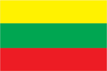
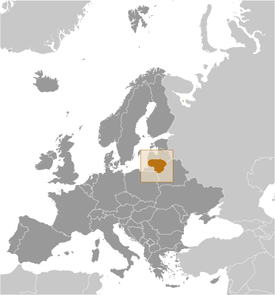
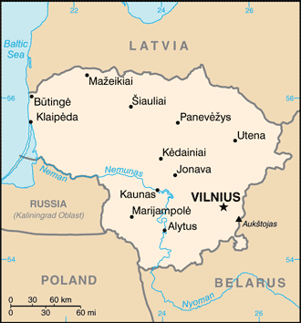

# Lithuania

## Introduction

**_Background:_**   
Lithuanian lands were united under MINDAUGAS in 1236; over the next century, through alliances and conquest, Lithuania extended its territory to include most of present-day Belarus and Ukraine. By the end of the 14th century Lithuania was the largest state in Europe. An alliance with Poland in 1386 led the two countries into a union through the person of a common ruler. In 1569, Lithuania and Poland formally united into a single dual state, the Polish-Lithuanian Commonwealth. This entity survived until 1795 when its remnants were partitioned by surrounding countries. Lithuania regained its independence following World War I but was annexed by the USSR in 1940 - an action never recognized by the US and many other countries. On 11 March 1990, Lithuania became the first of the Soviet republics to declare its independence, but Moscow did not recognize this proclamation until September of 1991 (following the abortive coup in Moscow). The last Russian troops withdrew in 1993. Lithuania subsequently restructured its economy for integration into Western European institutions; it joined both NATO and the EU in the spring of 2004. In January 2014, Lithuania assumed a nonpermanent seat on the UN Security Council for the 2014-15 term.

## Geography

**_Location:_**   
Eastern Europe, bordering the Baltic Sea, between Latvia and Russia

**_Geographic coordinates:_**   
56 00 N, 24 00 E

**_Map references:_**   
Europe

**_Area:_**   
**total:** 65,300 sq km   
**land:** 62,680 sq km   
**water:** 2,620 sq km

**_Area - comparative:_**   
slightly larger than West Virginia

**_Land boundaries:_**   
**total:** 1,574 km   
**border countries:** Belarus 680 km, Latvia 576 km, Poland 91 km, Russia (Kaliningrad) 227 km

**_Coastline:_**   
90 km

**_Maritime claims:_**   
**territorial sea:** 12 nm

**_Climate:_**   
transitional, between maritime and continental; wet, moderate winters and summers

**_Terrain:_**   
lowland, many scattered small lakes, fertile soil

**_Elevation extremes:_**   
**lowest point:** Baltic Sea 0 m   
**highest point:** Aukstojas 294 m

**_Natural resources:_**   
peat, arable land, amber

**_Land use:_**   
**arable land:** 33.48%   
**permanent crops:** 0.47%   
**other:** 66.05% (2011)

**_Irrigated land:_**   
13.4 sq km (2007)

**_Total renewable water resources:_**   
24.9 cu km (2011)

**_Freshwater withdrawal (domestic/industrial/agricultural):_**   
**total:** 2.38 cu km/yr (7%/90%/3%)   
**per capita:** 703.8 cu m/yr (2009)

**_Natural hazards:_**   
NA

**_Environment - current issues:_**   
contamination of soil and groundwater with petroleum products and chemicals at military bases

**_Environment - international agreements:_**   
**party to:** Air Pollution, Air Pollution-Nitrogen Oxides, Air Pollution-Persistent Organic Pollutants, Air Pollution-Sulphur 85, Air Pollution-Sulphur 94, Air Pollution-Volatile Organic Compounds, Biodiversity, Climate Change, Climate Change-Kyoto Protocol, Desertification, Endangered Species, Environmental Modification, Hazardous Wastes, Law of the Sea, Ozone Layer Protection, Ship Pollution, Wetlands   
**signed, but not ratified:** none of the selected agreements

**_Geography - note:_**   
fertile central plains are separated by hilly uplands that are ancient glacial deposits

## People and Society

**_Nationality:_**   
**noun:** Lithuanian(s)   
**adjective:** Lithuanian

**_Ethnic groups:_**   
Lithuanian 84.1%, Polish 6.6%, Russian 5.8%, Belarusian 1.2%, other 1.1%, unspecified 1.2% (2011 est.)

**_Languages:_**   
Lithuanian (official) 82%, Russian 8%, Polish 5.6%, other 0.9%, unspecified 3.5% (2011 est.)

**_Religions:_**   
Roman Catholic 77.2%, Russian Orthodox 4.1%, Old Believer 0.8%, Evangelical Lutheran 0.6%, Evangelical Reformist 0.2%, other (including Sunni Muslim, Jewish, Greek Catholic, and Karaite) 0.8%, none 6.1%, unspecified 10.1% (2011 est.)

**_Population:_**   
3,505,738   
**note:** Statistics Lithuania (the national statistical agency of Lithuania) estimates the country's total population at the start of 2013 to be 2,971,905, which takes into account the findings of Lithuania's 2011 census and the high rate of net outmigration since the country joined the EU in 2004 (July 2014 est.)

**_Age structure:_**   
**0-14 years:** 13.5% (male 243,001/female 230,674)   
**15-24 years:** 12.5% (male 224,584/female 214,184)   
**25-54 years:** 44.7% (male 782,238/female 785,521)   
**55-64 years:** 12.2% (male 193,374/female 235,595)   
**65 years and over:** 16.8% (male 207,222/female 389,345) (2014 est.)

**_Dependency ratios:_**   
**total dependency ratio:** 44.9 %   
**youth dependency ratio:** 22.1 %   
**elderly dependency ratio:** 22.7 %   
**potential support ratio:** 4.4 (2014 est.)

**_Median age:_**   
**total:** 41.2 years   
**male:** 38.5 years   
**female:** 43.7 years (2014 est.)

**_Population growth rate:_**   
-0.29% (2014 est.)

**_Birth rate:_**   
9.36 births/1,000 population (2014 est.)

**_Death rate:_**   
11.55 deaths/1,000 population (2014 est.)

**_Net migration rate:_**   
-0.73 migrant(s)/1,000 population (2014 est.)

**_Urbanization:_**   
**urban population:** 67.1% of total population (2011)   
**rate of urbanization:** -0.27% annual rate of change (2010-15 est.)

**_Major urban areas - population:_**   
VILNIUS (capital) 546,000 (2011)

**_Sex ratio:_**   
**at birth:** 1.06 male(s)/female   
**0-14 years:** 1.05 male(s)/female   
**15-24 years:** 1.05 male(s)/female   
**25-54 years:** 1 male(s)/female   
**55-64 years:** 0.89 male(s)/female   
**65 years and over:** 0.53 male(s)/female   
**total population:** 0.89 male(s)/female (2014 est.)

**_Mother's mean age at first birth:_**   
26.7 (2011 est.)

**_Maternal mortality rate:_**   
8 deaths/100,000 live births (2010)

**_Infant mortality rate:_**   
**total:** 6 deaths/1,000 live births   
**male:** 7.14 deaths/1,000 live births   
**female:** 4.78 deaths/1,000 live births (2014 est.)

**_Life expectancy at birth:_**   
**total population:** 75.98 years   
**male:** 71.2 years   
**female:** 81.02 years (2014 est.)

**_Total fertility rate:_**   
1.29 children born/woman (2014 est.)

**_Contraceptive prevalence rate:_**   
62.9%   
**note:** percent of women aged 18-49 (2006)

**_Health expenditures:_**   
7% of GDP (2010)

**_Physicians density:_**   
3.64 physicians/1,000 population (2010)

**_Hospital bed density:_**   
6.8 beds/1,000 population (2010)

**_Drinking water source:_**   
**improved:** urban: 99.3% of population; rural: 88.9% of population; total: 95.9% of population   
**unimproved:** urban: 0.7% of population; rural: 11.1% of population; total: 4.1% of population (2012 est.)

**_Sanitation facility access:_**   
**improved:** urban: 98.7% of population; rural: 85.4% of population; total: 94.3% of population   
**unimproved:** urban: 1.3% of population; rural: 14.6% of population; total: 5.7% of population (2012 est.)

**_HIV/AIDS - adult prevalence rate:_**   
0.1% (2009 est.)

**_HIV/AIDS - people living with HIV/AIDS:_**   
1,200 (2009 est.)

**_HIV/AIDS - deaths:_**   
fewer than 100 (2009 est.)

**_Major infectious diseases:_**   
**degree of risk:** intermediate   
**vectorborne diseases:** tickborne encephalitis (2013)

**_Obesity - adult prevalence rate:_**   
27.6% (2008)

**_Education expenditures:_**   
5.4% of GDP (2010)

**_Literacy:_**   
**definition:** age 15 and over can read and write   
**total population:** 99.7%   
**male:** 99.7%   
**female:** 99.7% (2011 est.)

**_School life expectancy (primary to tertiary education):_**   
**total:** 17 years   
**male:** 16 years   
**female:** 17 years (2011)

**_Unemployment, youth ages 15-24:_**   
**total:** 26.4%   
**male:** 29.9%   
**female:** 21.8% (2012)

## Government

**_Country name:_**   
**conventional long form:** Republic of Lithuania   
**conventional short form:** Lithuania   
**local long form:** Lietuvos Respublika   
**local short form:** Lietuva   
**former:** Lithuanian Soviet Socialist Republic

**_Government type:_**   
parliamentary democracy

**_Capital:_**   
**name:** Vilnius   
**geographic coordinates:** 54 41 N, 25 19 E   
**time difference:** UTC+2 (7 hours ahead of Washington, DC, during Standard Time)   
**daylight saving time:** +1hr, begins last Sunday in March; ends last Sunday in October

**_Administrative divisions:_**   
60 municipalities (savivaldybe, singular - savivaldybe); Akmene, Alytaus Miestas, Alytus, Ankšciai, Birštono, Biržai, Druskininkai, Elektrénai, Ignalina, Jonava, Joniškis, Jurbarkas, Kaišiadorys, Kalvarijos, Kauno Miestas, Kaunas, Kazlu Rudos, Kedainiai, Kelme, Klaipedos Miestas, Klaipeda, Kretinga, Kupiškis, Lazdijai, Marijampole, Mažeikiai, Moletai, Neringa, Pagégiai, Pakruojis, Palangos Miestas, Panevežys, Pasvalys, Plunge, Prienai, Radviliškis, Raseiniai, Rietavo, Rokiškis, Šakiai, Šalcininkai, Šiauliu Miestas, Šiauliai, Šilale, Šilute, Širvintos, Skuodas, Švencionys, Taurage, Telšiai, Trakai, Ukmerge, Utena, Varena, Vilkaviškis, Vilniaus, Vilnius, Visaginas, Zarasai

**_Independence:_**   
11 March 1990 (declared); 6 September 1991 (recognized by the Soviet Union); notable earlier dates: 6 July 1253 (coronation of MINDAUGAS, traditional founding date), 1 July 1569 (Polish-Lithuanian Commonwealth created)

**_National holiday:_**   
Independence Day, 16 February (1918); note - 16 February 1918 was the date Lithuania declared its independence from Soviet Russia and established its statehood; 11 March 1990 was the date it declared its independence from the Soviet Union

**_Constitution:_**   
several previous; latest adopted by referendum 25 October 1992, entered into force 2 November 1992; amended 2003 (2012)

**_Legal system:_**   
civil law system; legislative acts can be appealed to the constitutional court

**_International law organization participation:_**   
has not submitted an ICJ jurisdiction declaration; accepts ICCt jurisdiction

**_Suffrage:_**   
18 years of age; universal

**_Executive branch:_**   
**chief of state:** President Dalia GRYBAUSKAITE (since 12 July 2009)   
**head of government:** Prime Minister Algirdas BUTKEVICIUS (since 22 November 2012)   
**cabinet:** Council of Ministers appointed by the president on the nomination of the prime minister and approval of the Parliament   
**elections:** president elected by popular vote for a five-year term (eligible for a second term); elections last held on 11 and 25 May 2014 (next to be held in May 2019); prime minister appointed by the president on the approval of the Parliament   
**election results:** Dalia GRYBAUSKAITE reelected president; percent of vote - Dalia GRYBAUSKAITE 59%, Zigmantas BALCYTIS 41%; Algirdas BUTKEVICIUS approved by Parliament 90-40

**_Legislative branch:_**   
unicameral Parliament or Seimas (141 seats; 71 members elected in single-member districts, 70 elected by proportional representation; members to serve four-year terms)   
**elections:** last held on 14 and 28 October 2012 (next to be held in October 2016)   
**election results:** percent of vote by party (proportional vote) - DP 19.8%, LSDP 18.4%, TS-LKD 15.1%, LS 8.6%, DK 8%, TT 7.3%, LLRA 5.8%, LVZS 3.9%, other parties 13.1%; seats by party - LSDP 38, TS-LKD 33, DP 29, TT 11, LS 10, LLRA 8, DK 7, unaffiliated 4, vacant 1

**_Judicial branch:_**   
**highest court(s):** Supreme Court (consists of 37 judges); Constitutional Court (consists of 9 judges)   
**judge selection and term of office:** Supreme Court judges nominated by the president and appointed by the Seimas; judges serve 5-year renewable terms; Constitutional Court judges selected by Seimas from among nominations by the president, by the Seimas chairperson, and Supreme Court chairperson; judges serve 9-year, nonrenewable terms; note - one-third of court judges reconstituted every 3 years   
**subordinate courts:** Court of Appeals; district and local courts

**_Political parties and leaders:_**   
Christian Party or KP [Gediminas VAGNORIUS]   
Civil Democracy Party or PDP [Algimantas MATULEVICIUS]   
Democratic Labor and Unity Party or DDVP [Kristina BRAZAUSKIENE]   
Electoral Action of Lithuanian Poles or LLRA [Valdemar TOMASEVSKI]   
Emigrants Party or EP [Juozas MURAUSKAS]   
Homeland Union-Lithuanian Christian Democrats or TS-LKD [Andrius KUBILIUS]   
Labor Party or DP [Loreta GRAUZINIENE]   
Liberal and Center Union or LCS [Arturas MELIANAS]   
Liberal Movement or LS or LRLS [Eligijus MASIULIS]   
Lithuanian People's Party or LLP [Kazimiera PRUNSKIENE]   
Lithuanian People's Party or LZP [Joana SIMANAUSKIENE]   
Lithuanian Russian Union or LRS [Sergejus DMITRIJEVAS]   
Lithuanian Social Democratic Party or LSDP [Algirdas BUTKEVICIUS]   
Nationalist Union or TS [Gintaras SONGAILA]   
Order and Justice Party or TT [Rolandas PAKSAS]   
Peasant and Greens Union or LVZS [Ramunas KARBAUSKIS]   
Republican Party or RP [Valdemaras VALKIUNAS]   
Russian Alliance or RA [Tamara LOCHANKINA]   
Socialist People's Front or SLF [Algirdas PALECKIS]   
Way of Courage or DK [Jonas VARKALA]   
YES-Homeland Revival and Perspective or YES Union or TAIP Union or TAIP [Arturas ZUOKAS]   
Young Lithuania Party or PJL [Stanislovas BUSKEVICIUS]

**_International organization participation:_**   
Australia Group, BA, BIS, CBSS, CD, CE, EAPC, EBRD, EIB, EU, FAO, IAEA, IBRD, ICAO, ICC (national committees), ICRM, IDA, IFC, IFRCS, ILO, IMF, IMO, Interpol, IOC, IOM, IPU, ISO, ITU, ITUC (NGOs), MIGA, NATO, NIB, NSG, OAS (observer), OIF (observer), OPCW, OSCE, PCA, Schengen Convention, UN, UN Security Council (temporary), UNCTAD, UNESCO, UNIDO, UNWTO, UPU, WCO, WHO, WIPO, WMO, WTO

**_Diplomatic representation in the US:_**   
**chief of mission:** Ambassador Zygimantas PAVILIONIS (since 5 August 2010)   
**chancery:** 2622 16th Street NW, Washington, DC 20009   
**telephone:** [1] (202) 234-5860   
**FAX:** [1] (202) 328-0466   
**consulate(s) general:** Chicago, New York

**_Diplomatic representation from the US:_**   
**chief of mission:** Ambassador Deborah A. MCCARTHY (since 5 February 2013)   
**embassy:** Akmenu gatve 6, Vilnius, LT-03106   
**mailing address:** American Embassy, Akmenu Gatve 6, Vilnius LT-03106   
**telephone:** [370] (5) 266-5500   
**FAX:** [370] (5) 266-5510

**_Flag description:_**   
three equal horizontal bands of yellow (top), green, and red; yellow symbolizes golden fields, as well as the sun, light, and goodness; green represents the forests of the countryside, in addition to nature, freedom, and hope; red stands for courage and the blood spilled in defense of the homeland

**_National symbol(s):_**   
mounted knight known as Vytis (the Chaser)

**_National anthem:_**   
**name:** "Tautiska giesme" (The National Song)   
**lyrics/music:** Vincas KUDIRKA   
**note:** adopted 1918, restored 1990; the anthem was written in 1898 while Lithuania was a part of Russia; it was banned during the Soviet occupation from 1940 to 1990

## Economy

**_Economy - overview:_**   
Lithuania gained membership in the World Trade Organization and joined the EU in May 2004. Despite its EU accession, Lithuania's trade with its Central and Eastern European neighbors, and Russia in particular, accounts for a significant share of total trade. Foreign investment and business support have helped in the transition from the old command economy to a market economy. The three former Soviet Baltic republics were among the hardest hit by the 2008-09 financial crisis. The government's efforts to attract foreign investment, to develop export markets, and to pursue broad economic reforms has been key to Lithuania's quick recovery from a deep recession, making Lithuania one of the fastest growing economies in the EU. Lithuania is committed to meeting the Maastricht criteria to join the euro zone, which the government expects to achieve by 2015. Under the Conservative Party's leadership, Lithuania raised the monthly minimum wage in January 2012 nearly 25% over 2011. In January 2013, the new Social Democrat-led government increased the minimum wage another 25% over January 2012. Despite government efforts, unemployment remains high.

**_GDP (purchasing power parity):_**   
$67.43 billion (2013 est.)   
$65.19 billion (2012 est.)   
$62.92 billion (2011 est.)   
**note:** data are in 2013 US dollars

**_GDP (official exchange rate):_**   
$46.71 billion (2013 est.)

**_GDP - real growth rate:_**   
3.4% (2013 est.)   
3.6% (2012 est.)   
5.9% (2011 est.)

**_GDP - per capita (PPP):_**   
$22,600 (2013 est.)   
$21,700 (2012 est.)   
$20,800 (2011 est.)   
**note:** data are in 2013 US dollars

**_Gross national saving:_**   
16.5% of GDP (2013 est.)   
17.2% of GDP (2012 est.)   
18.9% of GDP (2011 est.)

**_GDP - composition, by end use:_**   
**household consumption:** 64.4%   
**government consumption:** 17.2%   
**investment in fixed capital:** 16.8%   
**investment in inventories:** 0.9%   
**exports of goods and services:** 85.4%   
**imports of goods and services:** -84.7%; (2013 est.)

**_GDP - composition, by sector of origin:_**   
**agriculture:** 3.7%   
**industry:** 28.3%   
**services:** 68% (2013 est.)

**_Agriculture - products:_**   
grain, potatoes, sugar beets, flax, vegetables; beef, milk, eggs; fish

**_Industries:_**   
metal-cutting machine tools, electric motors, television sets, refrigerators and freezers, petroleum refining, shipbuilding (small ships), furniture, textiles, food processing, fertilizers, agricultural machinery, optical equipment, electronic components, computers, amber jewelry

**_Industrial production growth rate:_**   
2% (2013 est.)

**_Labor force:_**   
1.452 million (2013 est.)

**_Labor force - by occupation:_**   
**agriculture:** 7.9%   
**industry:** 19.6%   
**services:** 72.5% (2012 est.)

**_Unemployment rate:_**   
12.4% (2013 est.)   
13.2% (2012 est.)

**_Population below poverty line:_**   
4% (2008)

**_Household income or consumption by percentage share:_**   
**lowest 10%:** 2.6%   
**highest 10%:** 29.1% (2008)

**_Distribution of family income - Gini index:_**   
35.5 (2009)   
34 (1999)

**_Budget:_**   
**revenues:** $14.5 billion   
**expenditures:** $15.43 billion (2013 est.)

**_Taxes and other revenues:_**   
31% of GDP (2013 est.)

**_Budget surplus (+) or deficit (-):_**   
-2% of GDP (2013 est.)

**_Public debt:_**   
40.2% of GDP (2013 est.)   
41% of GDP (2012 est.)   
**note:** official data; data cover general government debt, and includes debt instruments issued (or owned) by government entities other than the treasury; the data include treasury debt held by foreign entities, debt issued by subnational entities, as well as intra-governmental debt; intra-governmental debt consists of treasury borrowings from surpluses in the social funds, such as for retirement, medical care, and unemployment; debt instruments for the social funds are sold at public auctions

**_Fiscal year:_**   
calendar year

**_Inflation rate (consumer prices):_**   
1.2% (2013 est.)   
3.1% (2012 est.)

**_Central bank discount rate:_**   
3% (31 December 2010 est.)   
2.06% (31 December 2009 est.)

**_Commercial bank prime lending rate:_**   
4.5% (31 December 2013 est.)   
5.28% (31 December 2012 est.)

**_Stock of narrow money:_**   
$13.83 billion (31 December 2013 est.)   
$13.77 billion (31 December 2012 est.)

**_Stock of broad money:_**   
$20.59 billion (31 December 2013 est.)   
$20.58 billion (31 December 2012 est.)

**_Stock of domestic credit:_**   
$22.02 billion (31 December 2013 est.)   
$22.69 billion (31 December 2012 est.)

**_Market value of publicly traded shares:_**   
$3.964 billion (31 December 2012 est.)   
$4.075 billion (31 December 2011)   
$5.661 billion (31 December 2010 est.)

**_Current account balance:_**   
-$567 million (2013 est.)   
-$231 million (2012 est.)

**_Exports:_**   
$30.4 billion (2013 est.)   
$28.76 billion (2012 est.)

**_Exports - commodities:_**   
mineral products, machinery and equipment, chemicals, textiles , foodstuffs, plastics

**_Exports - partners:_**   
Russia 19.8%, Latvia 9.9%, Estonia 7.5%, Poland 7.3%, Germany 7.1%, Belarus 5.1%, United Kingdom 4.9%, Netherlands 4.3% (2013 est.)

**_Imports:_**   
$32.52 billion (2013 est.)   
$30.44 billion (2012 est.)

**_Imports - commodities:_**   
mineral products, machinery and equipment, transport equipment, chemicals, textiles and clothing, metals

**_Imports - partners:_**   
Russia 29.3%, Germany 10.3%, Poland 9.3%, Latvia 6.1% (2013 est.)

**_Reserves of foreign exchange and gold:_**   
$10.37 billion (31 December 2013 est.)   
$8.529 billion (31 December 2012 est.)

**_Debt - external:_**   
$29.55 billion (31 December 2013 est.)   
$32.84 billion (31 December 2012 est.)

**_Stock of direct foreign investment - at home:_**   
$16.57 billion (31 December 2013 est.)   
$15.56 billion (31 December 2012 est.)

**_Stock of direct foreign investment - abroad:_**   
$3.029 billion (31 December 2013 est.)   
$2.729 billion (31 December 2012 est.)

**_Exchange rates:_**   
litai (LTL) per US dollar -   
2.658 (2013 est.)   
2.685 (2012 est.)   
2.6063 (2010 est.)   
2.4787 (2009)   
2.3251 (2008)

## Energy

**_Electricity - production:_**   
12.27 billion kWh (2012 est.)

**_Electricity - consumption:_**   
10.3 billion kWh (2012 est.)

**_Electricity - exports:_**   
186 million kWh (2012 est.)

**_Electricity - imports:_**   
1.17 billion kWh (2012 est.)

**_Electricity - installed generating capacity:_**   
3.82 million kW (2011 est.)

**_Electricity - from fossil fuels:_**   
70.6% of total installed capacity (2010 est.)

**_Electricity - from nuclear fuels:_**   
0% of total installed capacity (2010 est.)

**_Electricity - from hydroelectric plants:_**   
3.2% of total installed capacity (2010 est.)

**_Electricity - from other renewable sources:_**   
5% of total installed capacity (2010 est.)

**_Crude oil - production:_**   
9,111 bbl/day (2012 est.)

**_Crude oil - exports:_**   
2,181 bbl/day (2010 est.)

**_Crude oil - imports:_**   
190,100 bbl/day (2010 est.)

**_Crude oil - proved reserves:_**   
12 million bbl (1 January 2013 est.)

**_Refined petroleum products - production:_**   
197,400 bbl/day (2010 est.)

**_Refined petroleum products - consumption:_**   
70,390 bbl/day (2011 est.)

**_Refined petroleum products - exports:_**   
155,000 bbl/day (2010 est.)

**_Refined petroleum products - imports:_**   
16,110 bbl/day (2010 est.)

**_Natural gas - production:_**   
0 cu m (2011 est.)

**_Natural gas - consumption:_**   
3.3 billion cu m (2012 est.)

**_Natural gas - exports:_**   
0 cu m (2012 est.)

**_Natural gas - imports:_**   
3.4 billion cu m (2011 est.)

**_Natural gas - proved reserves:_**   
0 cu m (1 January 2013 est.)

**_Carbon dioxide emissions from consumption of energy:_**   
16.05 million Mt (2011 est.)

## Communications

**_Telephones - main lines in use:_**   
667,300 (2012)

**_Telephones - mobile cellular:_**   
5 million (2012)

**_Telephone system:_**   
**general assessment:** adequate; being modernized to provide improved international capability and better residential access   
**domestic:** rapid expansion of mobile-cellular services has resulted in a steady decline in the number of fixed-line connections; mobile-cellular teledensity stands at about 140 per 100 persons   
**international:** country code - 370; major international connections to Denmark, Sweden, and Norway by submarine cable for further transmission by satellite; landline connections to Latvia and Poland (2010)

**_Broadcast media:_**   
public broadcaster operates 3 channels with the third channel - a satellite channel - introduced in 2007; various privately owned commercial TV broadcasters operate national and multiple regional channels; many privately owned local TV stations; multi-channel cable and satellite TV services available; publicly owned broadcaster operates 3 radio networks; many privately owned commercial broadcasters, many with repeater stations in various regions throughout the country (2007)

**_Internet country code:_**   
.lt

**_Internet hosts:_**   
1.205 million (2012)

**_Internet users:_**   
1.964 million (2009)

## Transportation

**_Airports:_**   
61 (2013)

**_Airports - with paved runways:_**   
**total:** 22   
**over 3,047 m:** 3   
**2,438 to 3,047 m:** 1   
**1,524 to 2,437 m:** 7   
**914 to 1,523 m:** 2   
**under 914 m:** 9 (2013)

**_Airports - with unpaved runways:_**   
**total:** 39   
**over 3,047 m:** 1   
**914 to 1,523 m:** 2   
**under 914 m:** 36 (2013)

**_Pipelines:_**   
gas 1,921 km; refined products 121 km (2013)

**_Railways:_**   
**total:** 1,767 km   
**broad gauge:** 1,745 km 1.524-m gauge (122 km electrified)   
**standard gauge:** 22 km 1.435-m gauge (2011)

**_Roadways:_**   
**total:** 84,166 km   
**paved:** 72,297 km (includes 312 km of expressways)   
**unpaved:** 11,869 km (2012)

**_Waterways:_**   
441 km (navigable year round) (2007)

**_Merchant marine:_**   
**total:** 38   
**by type:** cargo 20, container 1, passenger/cargo 6, refrigerated cargo 9, roll on/roll off 2   
**foreign-owned:** 8 (Denmark 8)   
**registered in other countries:** 22 (Antigua and Barbuda 3, Belize 1, Comoros 1, Cook Islands 1, Norway 1, Panama 3, Saint Vincent and the Grenadines 9, unknown 3) (2010)

**_Ports and terminals:_**   
**major seaport(s):** Klaipeda   
**oil terminals:** Butinge oil terminal

## Military

**_Military branches:_**   
Lithuanian Armed Forces (Lietuvos Ginkluotosios Pajegos): Land Forces (Sausumos Pajegos), Naval Forces (Karines Juru Pajegos), Air Forces (Karines Oro Pajegos) (2013)

**_Military service age and obligation:_**   
18 years of age for voluntary military service; service obligation 1 year; Lithuania converted to a professional military in the fall of 2008, although the decision continues under judicial review (2012)

**_Manpower available for military service:_**   
**males age 16-49:** 890,074   
**females age 16-49:** 875,780 (2010 est.)

**_Manpower fit for military service:_**   
**males age 16-49:** 669,111   
**females age 16-49:** 724,803 (2010 est.)

**_Manpower reaching militarily significant age annually:_**   
**male:** 20,425   
**female:** 19,527 (2010 est.)

**_Military expenditures:_**   
0.97% of GDP (2012)   
1.04% of GDP (2011)   
0.97% of GDP (2010)

## Transnational Issues

**_Disputes - international:_**   
Lithuania and Russia committed to demarcating their boundary in 2006 in accordance with the land and maritime treaty ratified by Russia in May 2003 and by Lithuania in 1999; Lithuania operates a simplified transit regime for Russian nationals traveling from the Kaliningrad coastal exclave into Russia, while still conforming, as a EU member state having an external border with a non-EU member, to strict Schengen border rules; boundary demarcated with Latvia and Lithuania; as of January 2007, ground demarcation of the boundary with Belarus was complete and mapped with final ratification documents in preparation

**_Refugees and internally displaced persons:_**   
**stateless persons:** 4,130 (2012)

**_Illicit drugs:_**   
transshipment and destination point for cannabis, cocaine, ecstasy, and opiates from Southwest Asia, Latin America, Western Europe, and neighboring Baltic countries; growing production of high-quality amphetamines, but limited production of cannabis, methamphetamines; susceptible to money laundering despite changes to banking legislation

............................................................   
_Page last updated on June 20, 2014_
