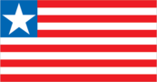
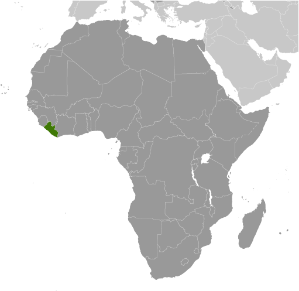
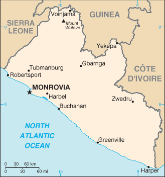

# Liberia

## Introduction

**_Background:_**   
Settlement of freed slaves from the US in what is today Liberia began in 1822; by 1847, the Americo-Liberians were able to establish a republic. William TUBMAN, president from 1944-71, did much to promote foreign investment and to bridge the economic, social, and political gaps between the descendants of the original settlers and the inhabitants of the interior. In 1980, a military coup led by Samuel DOE ushered in a decade of authoritarian rule. In December 1989, Charles TAYLOR launched a rebellion against DOE's regime that led to a prolonged civil war in which DOE was killed. A period of relative peace in 1997 allowed for elections that brought TAYLOR to power, but major fighting resumed in 2000. An August 2003 peace agreement ended the war and prompted the resignation of former president Charles TAYLOR, who faces war crimes charges in The Hague related to his involvement in Sierra Leone's civil war. After two years of rule by a transitional government, democratic elections in late 2005 brought President Ellen JOHNSON SIRLEAF to power. She subsequently won reelection in 2011 in a second round vote that was boycotted by the opposition and remains challenged to build Liberia's economy and reconcile a nation still recovering from 14 years of fighting. The United Nations Security Council in September 2012 passed Resolution 2066 which calls for a reduction of UN troops in Liberia by half by 2015, bringing the troop total down to fewer than 4000, and challenging Liberia's security sector to fill the gaps.

## Geography

**_Location:_**   
Western Africa, bordering the North Atlantic Ocean, between Cote d'Ivoire and Sierra Leone

**_Geographic coordinates:_**   
6 30 N, 9 30 W

**_Map references:_**   
Africa

**_Area:_**   
**total:** 111,369 sq km   
**land:** 96,320 sq km   
**water:** 15,049 sq km

**_Area - comparative:_**   
slightly larger than Tennessee

**_Land boundaries:_**   
**total:** 1,585 km   
**border countries:** Guinea 563 km, Cote d'Ivoire 716 km, Sierra Leone 306 km

**_Coastline:_**   
579 km

**_Maritime claims:_**   
**territorial sea:** 200 nm

**_Climate:_**   
tropical; hot, humid; dry winters with hot days and cool to cold nights; wet, cloudy summers with frequent heavy showers

**_Terrain:_**   
mostly flat to rolling coastal plains rising to rolling plateau and low mountains in northeast

**_Elevation extremes:_**   
**lowest point:** Atlantic Ocean 0 m   
**highest point:** Mount Wuteve 1,380 m

**_Natural resources:_**   
iron ore, timber, diamonds, gold, hydropower

**_Land use:_**   
**arable land:** 4.04%   
**permanent crops:** 1.62%   
**other:** 94.34% (2011)

**_Irrigated land:_**   
21 sq km (2003)

**_Total renewable water resources:_**   
232 cu km (2011)

**_Freshwater withdrawal (domestic/industrial/agricultural):_**   
**total:** 0.13 cu km/yr (55%/37%/8%)   
**per capita:** 43.66 cu m/yr (2005)

**_Natural hazards:_**   
dust-laden harmattan winds blow from the Sahara (December to March)

**_Environment - current issues:_**   
tropical rain forest deforestation; soil erosion; loss of biodiversity; pollution of coastal waters from oil residue and raw sewage

**_Environment - international agreements:_**   
**party to:** Biodiversity, Climate Change, Climate Change-Kyoto Protocol, Desertification, Endangered Species, Hazardous Wastes, Law of the Sea, Ozone Layer Protection, Ship Pollution, Tropical Timber 83, Tropical Timber 94, Wetlands   
**signed, but not ratified:** Environmental Modification, Marine Life Conservation

**_Geography - note:_**   
facing the Atlantic Ocean, the coastline is characterized by lagoons, mangrove swamps, and river-deposited sandbars; the inland grassy plateau supports limited agriculture

## People and Society

**_Nationality:_**   
**noun:** Liberian(s)   
**adjective:** Liberian

**_Ethnic groups:_**   
Kpelle 20.3%, Bassa 13.4%, Grebo 10%, Gio 8%, Mano 7.9%, Kru 6%, Lorma 5.1%, Kissi 4.8%, Gola 4.4%, other 20.1% (2008 Census)

**_Languages:_**   
English 20% (official), some 20 ethnic group languages few of which can be written or used in correspondence

**_Religions:_**   
Christian 85.6%, Muslim 12.2%, Traditional 0.6%, other 0.2%, none 1.4% (2008 Census)

**_Population:_**   
4,092,310 (July 2014 est.)

**_Age structure:_**   
**0-14 years:** 43.2% (male 891,002/female 876,655)   
**15-24 years:** 17.9% (male 357,952/female 375,708)   
**25-54 years:** 31.5% (male 642,835/female 646,104)   
**55-64 years:** 4.3% (male 85,906/female 89,943)   
**65 years and over:** 3% (male 62,475/female 63,730) (2014 est.)

**_Dependency ratios:_**   
**total dependency ratio:** 83.9 %   
**youth dependency ratio:** 78.4 %   
**elderly dependency ratio:** 5.6 %   
**potential support ratio:** 18 (2014 est.)

**_Median age:_**   
**total:** 17.9 years   
**male:** 17.7 years   
**female:** 18.1 years (2014 est.)

**_Population growth rate:_**   
2.52% (2014 est.)

**_Birth rate:_**   
35.07 births/1,000 population (2014 est.)

**_Death rate:_**   
9.9 deaths/1,000 population (2014 est.)

**_Net migration rate:_**   
0 migrant(s)/1,000 population (2014 est.)

**_Urbanization:_**   
**urban population:** 48.2% of total population (2011)   
**rate of urbanization:** 3.43% annual rate of change (2010-15 est.)

**_Major urban areas - population:_**   
MONROVIA (capital) 750,000 (2011)

**_Sex ratio:_**   
**at birth:** 1.03 male(s)/female   
**0-14 years:** 1.02 male(s)/female   
**15-24 years:** 0.95 male(s)/female   
**25-54 years:** 1 male(s)/female   
**55-64 years:** 0.99 male(s)/female   
**65 years and over:** 1.01 male(s)/female   
**total population:** 1 male(s)/female (2014 est.)

**_Mother's mean age at first birth:_**   
19   
**note:** median age at first birth among women 25-29 (2009 est.)

**_Maternal mortality rate:_**   
770 deaths/100,000 live births (2010)

**_Infant mortality rate:_**   
**total:** 69.19 deaths/1,000 live births   
**male:** 73.46 deaths/1,000 live births   
**female:** 64.79 deaths/1,000 live births (2014 est.)

**_Life expectancy at birth:_**   
**total population:** 58.21 years   
**male:** 56.56 years   
**female:** 59.9 years (2014 est.)

**_Total fertility rate:_**   
4.81 children born/woman (2014 est.)

**_Contraceptive prevalence rate:_**   
11.4% (2007)

**_Health expenditures:_**   
19.5% of GDP (2011)

**_Physicians density:_**   
0.01 physicians/1,000 population (2008)

**_Hospital bed density:_**   
0.8 beds/1,000 population (2010)

**_Drinking water source:_**   
**improved:** urban: 86.8% of population; rural: 63% of population; total: 74.6% of population   
**unimproved:** urban: 13.2% of population; rural: 37% of population; total: 25.4% of population (2012 est.)

**_Sanitation facility access:_**   
**improved:** urban: 28.4% of population; rural: 5.9% of population; total: 16.8% of population   
**unimproved:** urban: 71.6% of population; rural: 94.1% of population; total: 83.2% of population (2012 est.)

**_HIV/AIDS - adult prevalence rate:_**   
0.9% (2012 est.)

**_HIV/AIDS - people living with HIV/AIDS:_**   
21,800 (2012 est.)

**_HIV/AIDS - deaths:_**   
1,700 (2012 est.)

**_Major infectious diseases:_**   
**degree of risk:** very high   
**food or waterborne diseases:** bacterial and protozoal diarrhea, hepatitis A, and typhoid fever   
**vectorborne diseases:** malaria, dengue fever, and yellow fever   
**water contact disease:** schistosomiasis   
**aerosolized dust or soil contact disease:** Lassa fever   
**animal contact disease:** rabies (2013)

**_Obesity - adult prevalence rate:_**   
4.8% (2008)

**_Children under the age of 5 years underweight:_**   
20.4% (2007)

**_Education expenditures:_**   
2.8% of GDP (2012)

**_Literacy:_**   
**definition:** age 15 and over can read and write   
**total population:** 60.8%   
**male:** 64.8%   
**female:** 56.8% (2010 est.)

**_School life expectancy (primary to tertiary education):_**   
**total:** 11 years   
**male:** 12 years   
**female:** 9 years (2000)

**_Child labor - children ages 5-14:_**   
**total number:** 177,160   
**percentage:** 21 % (2007 est.)

**_Unemployment, youth ages 15-24:_**   
**total:** 5.1%   
**male:** 3.4%   
**female:** 6.6% (2010)

## Government

**_Country name:_**   
**conventional long form:** Republic of Liberia   
**conventional short form:** Liberia

**_Government type:_**   
republic

**_Capital:_**   
**name:** Monrovia   
**geographic coordinates:** 6 18 N, 10 48 W   
**time difference:** UTC 0 (5 hours ahead of Washington, DC, during Standard Time)

**_Administrative divisions:_**   
15 counties; Bomi, Bong, Gbarpolu, Grand Bassa, Grand Cape Mount, Grand Gedeh, Grand Kru, Lofa, Margibi, Maryland, Montserrado, Nimba, River Cess, River Gee, Sinoe

**_Independence:_**   
26 July 1847

**_National holiday:_**   
Independence Day, 26 July (1847)

**_Constitution:_**   
previous 1847 (at independence); latest drafted 19 October 1983, revised version adopted by referendum 3 July 1984, effective 6 January 1986; amended 2011 (2011)

**_Legal system:_**   
mixed legal system of common law (based on Anglo-American law) and customary law

**_International law organization participation:_**   
accepts compulsory ICJ jurisdiction with reservations; accepts ICCt jurisdiction

**_Suffrage:_**   
18 years of age; universal

**_Executive branch:_**   
**chief of state:** President Ellen JOHNSON SIRLEAF (since 16 January 2006); Vice President Joseph BOAKAI (since 16 January 2006); note - the president is both chief of state and head of government   
**head of government:** President Ellen JOHNSON SIRLEAF (since 16 January 2006); Vice President Joseph BOAKAI (since 16 January 2006)   
**cabinet:** Cabinet appointed by the president and confirmed by the Senate   
**elections:** president elected by popular vote for a six-year term (eligible for a second term); elections last held on 11 October and 8 November 2011 (next to be held in 2017)   
**election results:** Ellen JOHNSON SIRLEAF reelected president; percent of vote in second round - Ellen JOHNSON SIRLEAF 90.7%, Winston TUBMAN 9.3%

**_Legislative branch:_**   
bicameral National Assembly consists of the Senate (30 seats; members elected by popular vote to serve nine-year terms) and the House of Representatives (73 seats; members elected by popular vote to serve six-year terms)   
**elections:** Senate - last held on 11 October 2011 (next to be held in 2014); House of Representatives - last held on 11 October 2011 (next to be held in 2017)   
**election results:** Senate - percent of vote by party - NA; seats by party - UP 10, NPP 6, CDC 3, APD 2, NUDP 2, LDP 1, LP 1, NDC 1, NDPL 1, independents 3; House of Representatives - percent of vote by party - NA; seats by party - UP 24, CDC 11, LP 7, NUDP 6, NDC 5, APD 3, NPP 3, MPC 2, LDP 1, LTP 1, NRP 1, independents 9

**_Judicial branch:_**   
**highest court(s):** Supreme Court (consists of a chief Justice and 4 associate justices); note - the Supreme Court has jurisdiction for all constitutional cases   
**judge selection and term of office:** chief justice and associate justices appointed by the president of Liberia with consent of the Senate; judges can serve until age 70   
**subordinate courts:** judicial circuit courts; special courts including criminal, civil, labor, traffic; magistrate and traditional or customary courts

**_Political parties and leaders:_**   
Alliance for Peace and Democracy or APD [Marcus S. G. DAHN]   
Alternative National Congress or ANC [Orishil GOULD]   
Congress for Democratic Change or CDC [George WEAH]   
Liberia Destiny Party or LDP [Nathaniel BARNES]   
Liberty Party or LP [J. Fonati KOFFA]   
Liberia Transformation Party or LTP [Julius SUKU]   
Movement for Progressive Change or MPC [Simeon FREEMAN]   
National Democratic Coalition or NDC [Dew MAYSON]   
National Democratic Party of Liberia or NDPL [D. Nyandeh SIEH]   
National Patriotic Party or NPP [Theophilus C. GOULD]   
National Reformist Party or NRP [Maximillian T. W. DIABE]   
National Union for Democratic Progress or NUDP [Victor BARNEY]   
Unity Party or UP [Varney SHERMAN]

**_Political pressure groups and leaders:_**   
**other:** demobilized former military officers

**_International organization participation:_**   
ACP, AfDB, AU, ECOWAS, EITI (compliant country), FAO, G-77, IAEA, IBRD, ICAO, ICC (NGOs), ICRM, IDA, IFAD, IFC, IFRCS, ILO, IMF, IMO, IMSO, Interpol, IOC, IOM, ISO (correspondent), ITU, ITUC (NGOs), MIGA, MINUSMA, NAM, OPCW, UN, UNCTAD, UNESCO, UNIDO, UNWTO, UPU, WCO, WFTU (NGOs), WHO, WIPO, WMO, WTO (observer)

**_Diplomatic representation in the US:_**   
**chief of mission:** Ambassador Jeremiah Congbeh SULUNTEH (since 25 April 2012)   
**chancery:** 5201 16th Street NW, Washington, DC 20011   
**telephone:** [1] (202) 723-0437   
**FAX:** [1] (202) 723-0436   
**consulate(s) general:** New York

**_Diplomatic representation from the US:_**   
**chief of mission:** Ambassador Deborah R. MALAC (since 26 July 2012)   
**embassy:** U.S. Embassy, P.O. Box 98, 502 Benson Street, Monrovia   
**mailing address:** P.O. Box 98, Monrovia   
**telephone:** [231] 77-677-7000   
**FAX:** [231] 77-677-7370

**_Flag description:_**   
11 equal horizontal stripes of red (top and bottom) alternating with white; a white five-pointed star appears on a blue square in the upper hoist-side corner; the stripes symbolize the signatories of the Liberian Declaration of Independence; the blue square represents the African mainland, and the star represents the freedom granted to the ex-slaves; according to the constitution, the blue color signifies liberty, justice, and fidelity, the white color purity, cleanliness, and guilelessness, and the red color steadfastness, valor, and fervor   
**note:** the design is based on the US flag

**_National symbol(s):_**   
white star

**_National anthem:_**   
**name:** "All Hail, Liberia Hail!"   
**lyrics/music:** Daniel Bashiel WARNER/Olmstead LUCA   
**note:** lyrics adopted 1847, music adopted 1860; the anthem's author would become the third president of Liberia

## Economy

**_Economy - overview:_**   
Liberia is a low income country that relies heavily on foreign assistance. Civil war and government mismanagement destroyed much of Liberia's economy, especially the infrastructure in and around the capital, Monrovia. Many businesses fled the country, taking capital and expertise with them, but with the conclusion of fighting and the installation of a democratically elected government in 2006, several have returned. Liberia is richly endowed with water, mineral resources, forests, and a climate favorable to agriculture, and iron ore and rubber have driven growth in recent years. Liberia is also reviving its raw timber sector and is encouraging oil exploration. President JOHNSON SIRLEAF, a Harvard-educated banker and administrator, has taken steps to reduce corruption, build support from international donors, and encourage private investment. Rebuilding infrastructure and raising incomes will depend on financial and technical assistance from donor countries and foreign investment in key sectors, such as infrastructure and power generation. The country achieved high growth during 2010-13 due to favorable world prices for its commodities. In the future, growth will depend on global commodity prices, on sustained foreign aid, trade, investment, and remittances, on the development of infrastructure and institutions, but mostly on maintaining political stability and security.

**_GDP (purchasing power parity):_**   
$2.898 billion (2013 est.)   
$2.681 billion (2012 est.)   
$2.475 billion (2011 est.)   
**note:** data are in 2013 US dollars

**_GDP (official exchange rate):_**   
$1.977 billion (2013 est.)

**_GDP - real growth rate:_**   
8.1% (2013 est.)   
8.3% (2012 est.)   
7.9% (2011 est.)

**_GDP - per capita (PPP):_**   
$700 (2013 est.)   
$700 (2012 est.)   
$600 (2011 est.)   
**note:** data are in 2013 US dollars

**_Gross national saving:_**   
NA (2012 est.)   
-36.6% of GDP (2011 est.)

**_GDP - composition, by end use:_**   
**household consumption:** 125.6%   
**government consumption:** 15.2%   
**investment in fixed capital:** 25%   
**investment in inventories:** 0%   
**exports of goods and services:** 27.5%   
**imports of goods and services:** -93.3%; (2011 est.)

**_GDP - composition, by sector of origin:_**   
**agriculture:** 76.9%   
**industry:** 5.4%   
**services:** 17.7% (2002 est.)

**_Agriculture - products:_**   
rubber, coffee, cocoa, rice, cassava (manioc, tapioca), palm oil, sugarcane, bananas; sheep, goats; timber

**_Industries:_**   
mining (iron ore), rubber processing, palm oil processing, timber, diamonds

**_Industrial production growth rate:_**   
NA%

**_Labor force:_**   
1.372 million (2007)

**_Labor force - by occupation:_**   
**agriculture:** 70%   
**industry:** 8%   
**services:** 22% (2000 est.)

**_Unemployment rate:_**   
85% (2003 est.)

**_Population below poverty line:_**   
80% (2000 est.)

**_Household income or consumption by percentage share:_**   
**lowest 10%:** 2.4%   
**highest 10%:** 30.1% (2007)

**_Budget:_**   
**revenues:** $465 million   
**expenditures:** $521.7 million (2013 est.)

**_Taxes and other revenues:_**   
23.5% of GDP (2013 est.)

**_Budget surplus (+) or deficit (-):_**   
-2.9% of GDP (2013 est.)

**_Public debt:_**   
3.3% of GDP (2013 est.)   
0.4% of GDP (2012 est.)

**_Fiscal year:_**   
calendar year

**_Inflation rate (consumer prices):_**   
5.2% (2013 est.)   
6.8% (2012 est.)

**_Commercial bank prime lending rate:_**   
14% (31 December 2013 est.)   
13.52% (31 December 2012 est.)

**_Stock of narrow money:_**   
$419.4 million (31 December 2013 est.)   
$408.2 million (31 December 2012 est.)

**_Stock of broad money:_**   
$799.5 million (31 December 2013 est.)   
$591.3 million (31 December 2012 est.)

**_Stock of domestic credit:_**   
$705.4 million (31 December 2013 est.)   
$521.9 million (31 December 2012 est.)

**_Market value of publicly traded shares:_**   
$NA

**_Current account balance:_**   
-$742.4 million (2013 est.)   
-$918.8 million (2012 est.)

**_Exports:_**   
$929.8 million (2013 est.)   
$774.8 million (2012 est.)

**_Exports - commodities:_**   
rubber, timber, iron, diamonds, cocoa, coffee

**_Exports - partners:_**   
China 24%, US 15.3%, Spain 11%, Algeria 6.5%, Thailand 4.5%, Malaysia 4.1%, France 4% (2012)

**_Imports:_**   
$2.457 billion (2013 est.)   
$2.275 billion (2012 est.)

**_Imports - commodities:_**   
fuels, chemicals, machinery, transportation equipment, manufactured goods; foodstuffs

**_Imports - partners:_**   
South Korea 26.7%, China 24.4%, Singapore 23.2%, Japan 16.1% (2012)

**_Debt - external:_**   
$438.1 million (31 December 2013 est.)   
$349.2 million (31 December 2012 est.)

**_Stock of direct foreign investment - at home:_**   
$4.241 billion (31 December 2013 est.)   
$3.574 billion (31 December 2012 est.)

**_Stock of direct foreign investment - abroad:_**   
$NA (31 December 2013 est.)   
$NA (31 December 2012 est.)

**_Exchange rates:_**   
Liberian dollars (LRD) per US dollar -   
77.63 (2013 est.)   
73.515 (2012 est.)   
71.403 (2010 est.)

## Energy

**_Electricity - production:_**   
335 million kWh (2010 est.)

**_Electricity - consumption:_**   
311.6 million kWh (2010 est.)

**_Electricity - exports:_**   
0 kWh (2012 est.)

**_Electricity - imports:_**   
0 kWh (2012 est.)

**_Electricity - installed generating capacity:_**   
197,000 kW (2010 est.)

**_Electricity - from fossil fuels:_**   
100% of total installed capacity (2010 est.)

**_Electricity - from nuclear fuels:_**   
0% of total installed capacity (2010 est.)

**_Electricity - from hydroelectric plants:_**   
0% of total installed capacity (2010 est.)

**_Electricity - from other renewable sources:_**   
0% of total installed capacity (2010 est.)

**_Crude oil - production:_**   
0 bbl/day (2012 est.)

**_Crude oil - exports:_**   
0 bbl/day (2010 est.)

**_Crude oil - imports:_**   
0 bbl/day (2010 est.)

**_Crude oil - proved reserves:_**   
0 bbl (1 January 2013 est.)

**_Refined petroleum products - production:_**   
0 bbl/day (2010 est.)

**_Refined petroleum products - consumption:_**   
3,533 bbl/day (2011 est.)

**_Refined petroleum products - exports:_**   
23 bbl/day (2010 est.)

**_Refined petroleum products - imports:_**   
3,673 bbl/day (2010 est.)

**_Natural gas - production:_**   
0 cu m (2011 est.)

**_Natural gas - consumption:_**   
0 cu m (2010 est.)

**_Natural gas - exports:_**   
0 cu m (2011 est.)

**_Natural gas - imports:_**   
0 cu m (2011 est.)

**_Natural gas - proved reserves:_**   
0 cu m (1 January 2013 est.)

**_Carbon dioxide emissions from consumption of energy:_**   
588,000 Mt (2011 est.)

## Communications

**_Telephones - main lines in use:_**   
3,200 (2011)

**_Telephones - mobile cellular:_**   
2.394 million (2012)

**_Telephone system:_**   
**general assessment:** the limited services available are found almost exclusively in the capital Monrovia; fixed-line service stagnant and extremely limited; telephone coverage extended to a number of other towns and rural areas by four mobile-cellular network operators   
**domestic:** mobile-cellular subscription base growing and teledensity reached 50 per 100 persons in 2011   
**international:** country code - 231; satellite earth station - 1 Intelsat (Atlantic Ocean) (2010)

**_Broadcast media:_**   
3 private TV stations; satellite TV service available; 1 state-owned radio station; about 15 independent radio stations broadcasting in Monrovia, with another 25 local stations operating in other areas; transmissions of 2 international broadcasters are available (2007)

**_Internet country code:_**   
.lr

**_Internet hosts:_**   
7 (2012)

**_Internet users:_**   
20,000 (2009)

## Transportation

**_Airports:_**   
29 (2013)

**_Airports - with paved runways:_**   
**total:** 2   
**over 3,047 m:** 1   
**1,524 to 2,437 m:** 1 (2013)

**_Airports - with unpaved runways:_**   
**total:** 27   
**1,524 to 2,437 m:** 5   
**914 to 1,523 m:** 8   
**under 914 m:** 14 (2013)

**_Pipelines:_**   
oil 4 km (2013)

**_Railways:_**   
**total:** 429 km   
**standard gauge:** 345 km 1.435-m gauge   
**narrow gauge:** 84 km 1.067-m gauge   
**note:** most sections of the railways were inoperable because of damage suffered during the civil wars from 1980 to 2003, but many are being rebuilt (2008)

**_Roadways:_**   
**total:** 10,600 km   
**paved:** 657 km   
**unpaved:** 9,943 km (2000)

**_Merchant marine:_**   
**total:** 2,771   
**by type:** barge carrier 5, bulk carrier 662, cargo 143, carrier 2, chemical tanker 248, combination ore/oil 8, container 937, liquefied gas 92, passenger 2, passenger/cargo 2, petroleum tanker 526, refrigerated cargo 102, roll on/roll off 5, specialized tanker 10, vehicle carrier 27   
**foreign-owned:** 2,581 (Angola 1, Argentina 1, Australia 1, Belgium 1, Bermuda 4, Brazil 20, Canada 2, Chile 9, China 4, Croatia 1, Cyprus 9, Denmark 8, Egypt 3, Germany 1185, Gibraltar 5, Greece 505, Hong Kong 48, India 8, Indonesia 4, Israel 34, Italy 47, Japan 110, Latvia 5, Lebanon 1, Monaco 8, Netherlands 31, Nigeria 4, Norway 38, Poland 13, Qatar 5, Romania 3, Russia 109, Saudi Arabia 20, Singapore 22, Slovenia 7, South Korea 2, Sweden 12, Switzerland 25, Syria 1, Taiwan 94, Turkey 16, UAE 37, UK 32, UK 22, Ukraine 10, Uruguay 1, US 53) (2010)

**_Ports and terminals:_**   
**major seaport(s):** Buchanan, Monrovia

## Military

**_Military branches:_**   
Armed Forces of Liberia (AFL): Army, Navy, Air Force

**_Military service age and obligation:_**   
18 years of age for voluntary military service; no conscription (2012)

**_Manpower available for military service:_**   
**males age 16-49:** 815,826   
**females age 16-49:** 828,484 (2010 est.)

**_Manpower fit for military service:_**   
**males age 16-49:** 524,243   
**females age 16-49:** 544,349 (2010 est.)

**_Manpower reaching militarily significant age annually:_**   
**male:** 36,585   
**female:** 38,516 (2010 est.)

**_Military expenditures:_**   
0.82% of GDP (2012)   
0.86% of GDP (2011)   
0.82% of GDP (2010)

## Transnational Issues

**_Disputes - international:_**   
although civil unrest continues to abate with the assistance of 6,500 UN Mission in Liberia peacekeepers, as of January 2013, Liberian refugees still remain in Guinea, Cote d'Ivoire, Sierra Leone, and Ghana; Liberia, in turn, shelters refugees fleeing turmoil in Cote d'Ivoire; despite the presence of over 9,000 UN forces in Cote d'Ivoire since 2004, ethnic conflict continues to spread into neighboring states who can no longer send their migrant workers to Ivorian cocoa plantations; UN sanctions ban Liberia from exporting diamonds and timber

**_Refugees and internally displaced persons:_**   
**refugees (country of origin):** 42,026 (Cote d'Ivoire) (2014)   
**IDPs:** up to 23,000 (civil war from 1990-2004; post-election violence in March and April 2011; unclear how many have found durable solutions; many dwell in slums in Monrovia) (2013)

**_Trafficking in persons:_**   
**current situation:** Liberia is a source, transit, and destination country for men, women, and children subjected to forced labor and sex trafficking; most victims are Liberian and are exploited within the country, where they are forced into domestic servitude, begging, prostitution, street vending, agricultural work, and diamond mining; a small number of Liberian men, women, and children are trafficked to Cote d'Ivoire, Guinea, Sierra Leone, Nigeria, and the US, while trafficking victims are brought to Liberia from neighboring West African countries, including Sierra Leone, Guinea, Cote d'Ivoire, and Nigeria   
**tier rating:** Tier 2 Watch List - Liberia does not fully comply with the minimum standards for the elimination of trafficking; however, it is making significant efforts to do so; the government has increased its anti-trafficking law enforcement efforts and achieved its first conviction under its 2005 anti-trafficking law; the government has failed to make adequate efforts to identify and protect trafficking victims and has not adopted or implemented the standard operating procedures for assisting victims finalized by the anti-trafficking secretariat in 2012; the referral of victims to NGOs for protective services is inconsistent (2013)

**_Illicit drugs:_**   
transshipment point for Southeast and Southwest Asian heroin and South American cocaine for the European and US markets; corruption, criminal activity, arms-dealing, and diamond trade provide significant potential for money laundering, but the lack of well-developed financial system limits the country's utility as a major money-laundering center

............................................................   
_Page last updated on June 20, 2014_
