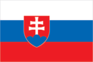
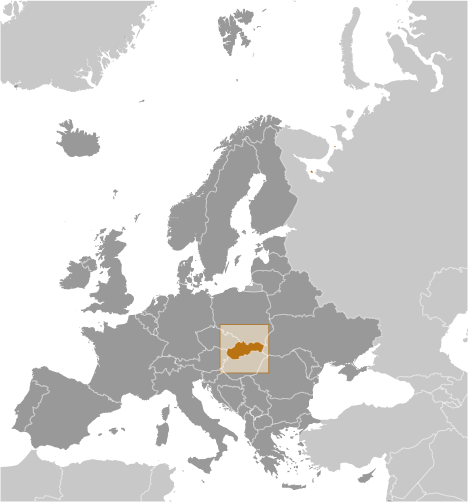
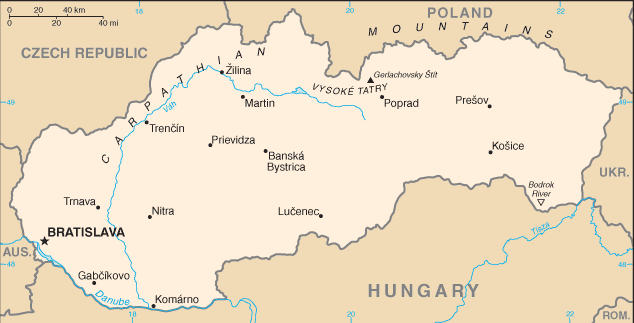

# Slovakia

## Introduction

**_Background:_**   
Slovakia's roots can be traced to the 9th century state of Great Moravia. Subsequently, the Slovaks became part of the Hungarian Kingdom, where they remained for the next 1,000 years. Following the formation of the dual Austro-Hungarian monarchy in 1867, language and education policies favoring the use of Hungarian (Magyarization) resulted in a strengthening of Slovak nationalism and a cultivation of cultural ties with the closely related Czechs, who were under Austrian rule. After the dissolution of the Austro-Hungarian Empire at the close of World War I, the Slovaks joined the Czechs to form Czechoslovakia. During the interwar period, Slovak nationalist leaders pushed for autonomy within Czechoslovakia, and in 1939 Slovakia became an independent state allied with Nazi Germany. Following World War II, Czechoslovakia was reconstituted and came under communist rule within Soviet-dominated Eastern Europe. In 1968, an invasion by Warsaw Pact troops ended the efforts of the country's leaders to liberalize communist rule and create "socialism with a human face," ushering in a period of repression known as "normalization." The peaceful "Velvet Revolution" swept the Communist Party from power at the end of 1989 and inaugurated a return to democratic rule and a market economy. On 1 January 1993, the country underwent a nonviolent "velvet divorce" into its two national components, Slovakia and the Czech Republic. Slovakia joined both NATO and the EU in the spring of 2004 and the euro zone on 1 January 2009.

## Geography

**_Location:_**   
Central Europe, south of Poland

**_Geographic coordinates:_**   
48 40 N, 19 30 E

**_Map references:_**   
Europe

**_Area:_**   
**total:** 49,035 sq km   
**land:** 48,105 sq km   
**water:** 930 sq km

**_Area - comparative:_**   
about twice the size of New Hampshire

**_Land boundaries:_**   
**total:** 1,474 km   
**border countries:** Austria 91 km, Czech Republic 197 km, Hungary 676 km, Poland 420 km, Ukraine 90 km

**_Coastline:_**   
0 km (landlocked)

**_Maritime claims:_**   
none (landlocked)

**_Climate:_**   
temperate; cool summers; cold, cloudy, humid winters

**_Terrain:_**   
rugged mountains in the central and northern part and lowlands in the south

**_Elevation extremes:_**   
**lowest point:** Bodrok River 94 m   
**highest point:** Gerlachovsky Stit 2,655 m

**_Natural resources:_**   
brown coal and lignite; small amounts of iron ore, copper and manganese ore; salt; arable land

**_Land use:_**   
**arable land:** 28.36%   
**permanent crops:** 0.41%   
**other:** 71.22% (2011)

**_Irrigated land:_**   
1,720 sq km (2007)

**_Total renewable water resources:_**   
50.1 cu km (2011)

**_Freshwater withdrawal (domestic/industrial/agricultural):_**   
**total:** 0.69 cu km/yr (47%/51%/3%)   
**per capita:** 126.7 cu m/yr (2010)

**_Natural hazards:_**   
NA

**_Environment - current issues:_**   
air pollution from metallurgical plants presents human health risks; acid rain damaging forests

**_Environment - international agreements:_**   
**party to:** Air Pollution, Air Pollution-Nitrogen Oxides, Air Pollution-Persistent Organic Pollutants, Air Pollution-Sulfur 85, Air Pollution-Sulfur 94, Air Pollution-Volatile Organic Compounds, Antarctic Treaty, Biodiversity, Climate Change, Climate Change-Kyoto Protocol, Desertification, Endangered Species, Environmental Modification, Hazardous Wastes, Law of the Sea, Ozone Layer Protection, Ship Pollution, Wetlands, Whaling   
**signed, but not ratified:** none of the selected agreements

**_Geography - note:_**   
landlocked; most of the country is rugged and mountainous; the Tatra Mountains in the north are interspersed with many scenic lakes and valleys

## People and Society

**_Nationality:_**   
**noun:** Slovak(s)   
**adjective:** Slovak

**_Ethnic groups:_**   
Slovak 80.7%, Hungarian 8.5%, Roma 2%, other and unspecified 8.8% (2011 est.)

**_Languages:_**   
Slovak (official) 78.6%, Hungarian 9.4%, Roma 2.3%, Ruthenian 1%, other or unspecified 8.8% (2011 est.)

**_Religions:_**   
Roman Catholic 62%, Protestant 8.2%, Greek Catholic 3.8%, other or unspecified 12.5%, none 13.4% (2011 est.)

**_Population:_**   
5,443,583 (July 2014 est.)

**_Age structure:_**   
**0-14 years:** 15.2% (male 422,636/female 403,626)   
**15-24 years:** 12.2% (male 341,500/female 322,287)   
**25-54 years:** 45.2% (male 1,241,930/female 1,218,706)   
**55-64 years:** 13.5% (male 347,438/female 388,461)   
**65 years and over:** 13.4% (male 288,010/female 468,989) (2014 est.)

**_Dependency ratios:_**   
**total dependency ratio:** 39.6 %   
**youth dependency ratio:** 21.1 %   
**elderly dependency ratio:** 18.5 %   
**potential support ratio:** 5.4 (2014 est.)

**_Median age:_**   
**total:** 39.2 years   
**male:** 37.5 years   
**female:** 41 years (2014 est.)

**_Population growth rate:_**   
0.03% (2014 est.)

**_Birth rate:_**   
10.01 births/1,000 population (2014 est.)

**_Death rate:_**   
9.7 deaths/1,000 population (2014 est.)

**_Net migration rate:_**   
0.01 migrant(s)/1,000 population (2014 est.)

**_Urbanization:_**   
**urban population:** 54.7% of total population (2011)   
**rate of urbanization:** 0.06% annual rate of change (2010-15 est.)

**_Major urban areas - population:_**   
BRATISLAVA (capital) 434,000 (2011)

**_Sex ratio:_**   
**at birth:** 1.07 male(s)/female   
**0-14 years:** 1.05 male(s)/female   
**15-24 years:** 1.06 male(s)/female   
**25-54 years:** 1.02 male(s)/female   
**55-64 years:** 0.94 male(s)/female   
**65 years and over:** 0.6 male(s)/female   
**total population:** 0.94 male(s)/female (2014 est.)

**_Mother's mean age at first birth:_**   
27.8 (2010 est.)

**_Maternal mortality rate:_**   
6 deaths/100,000 live births (2010)

**_Infant mortality rate:_**   
**total:** 5.35 deaths/1,000 live births   
**male:** 6 deaths/1,000 live births   
**female:** 4.66 deaths/1,000 live births (2014 est.)

**_Life expectancy at birth:_**   
**total population:** 76.69 years   
**male:** 73.09 years   
**female:** 80.52 years (2014 est.)

**_Total fertility rate:_**   
1.39 children born/woman (2014 est.)

**_Health expenditures:_**   
9% of GDP (2010)

**_Physicians density:_**   
3 physicians/1,000 population (2007)

**_Hospital bed density:_**   
6.4 beds/1,000 population (2010)

**_Drinking water source:_**   
**improved:** urban: 100% of population; rural: 100% of population; total: 100% of population   
**unimproved:** urban: 0% of population; rural: 0% of population; total: 0% of population (2012 est.)

**_Sanitation facility access:_**   
**improved:** urban: 99.9% of population; rural: 99.6% of population; total: 99.7% of population   
**unimproved:** urban: 0.1% of population; rural: 0.4% of population; total: 0.3% of population (2012 est.)

**_HIV/AIDS - adult prevalence rate:_**   
less than 0.1% (2009 est.)

**_HIV/AIDS - people living with HIV/AIDS:_**   
fewer than 500 (2009 est.)

**_HIV/AIDS - deaths:_**   
fewer than 100 (2009 est.)

**_Obesity - adult prevalence rate:_**   
25.4% (2008)

**_Education expenditures:_**   
4.2% of GDP (2010)

**_Literacy:_**   
**definition:** age 15 and over can read and write   
**total population:** 99.6%   
**male:** 99.7%   
**female:** 99.6% (2004)

**_School life expectancy (primary to tertiary education):_**   
**total:** 12 years   
**male:** 12 years   
**female:** 12 years (2012)

**_Unemployment, youth ages 15-24:_**   
**total:** 34%   
**male:** 35%   
**female:** 32.5% (2012)

## Government

**_Country name:_**   
**conventional long form:** Slovak Republic   
**conventional short form:** Slovakia   
**local long form:** Slovenska republika   
**local short form:** Slovensko

**_Government type:_**   
parliamentary democracy

**_Capital:_**   
**name:** Bratislava   
**geographic coordinates:** 48 09 N, 17 07 E   
**time difference:** UTC+1 (6 hours ahead of Washington, DC,. during Standard Time)   
**daylight saving time:** +1hr, begins last Sunday in March; ends last Sunday in October

**_Administrative divisions:_**   
8 regions (kraje, singular - kraj); Banskobystricky, Bratislavsky, Kosicky, Nitriansky, Presovsky, Trenciansky, Trnavsky, Zilinsky

**_Independence:_**   
1 January 1993 (Czechoslovakia split into the Czech Republic and Slovakia)

**_National holiday:_**   
Constitution Day, 1 September (1992)

**_Constitution:_**   
several previous (preindependence); latest passed by legislature 1 September 1992, signed 3 September 1992, effective 1 October 1992; amended several times, last in 2011 (2011)

**_Legal system:_**   
civil law system based on Austro-Hungarian codes; note - legal code modified to comply with the obligations of Organization on Security and Cooperation in Europe and to expunge Marxist-Leninist legal system

**_International law organization participation:_**   
accepts compulsory ICJ jurisdiction with reservations; accepts ICCt jurisdiction

**_Suffrage:_**   
18 years of age; universal

**_Executive branch:_**   
**chief of state:** President Andrej KISKA (since 15 June 2014)   
**head of government:** Prime Minister Robert FICO (since 4 April 2012); Deputy Prime Ministers Robert KALINAK, Peter KAZIMIR, Miroslav LAJCAK (since 4 April 2012), Lubomir VAZNY (since 26 November 2012)   
**cabinet:** Cabinet appointed by the president on the recommendation of the prime minister   
**elections:** president elected by popular vote for a five-year term (eligible for a second term); election last held on 15 and 29 March 2014 (next to be held in March 2019); following National Council elections, the leader of the majority party or the leader of a majority coalition usually appointed prime minister by the president   
**election results:** Andrej KISKA elected president in runoff; percent of vote - Andrej KISKA 59.4%, Robert FICO 40.6%

**_Legislative branch:_**   
unicameral National Council of the Slovak Republic or Narodna Rada Slovenskej Republiky (150 seats; members elected on the basis of proportional representation to serve four-year terms)   
**elections:** last held on 10 March 2012 (next to be held in 2016)   
**election results:** percent of vote by party - Smer-SD 44.4%, KDH 8.8%, OLaNO 8.6%, Most-Hid 6.9%, SDKU-DS 6.1%, SaS 5.9%, other 19.3%; seats by party - Smer-SD 83, KDH 16, OLaNO 16, Most-Hid 13, SDKU-DS 11, SaS 11

**_Judicial branch:_**   
**highest court(s):** Supreme Court of the Slovak Republic (consists of 78 judges - as of 2003 - organized into criminal, civil, commercial, and administrative divisions with 3- and 5-judge panels; Constitutional Court (consists of 13 judges)   
**judge selection and term of office:** Supreme Court judge candidates proposed by the Judicial Council of the Slovak Republic, a 17-member independent body to include the Supreme Court chief justice and presidential and governmental appointees; judges appointed by the president for life with mandatory retirement at age 65; Constitutional Court judges nominated by the National Council of the Republic and appointed by the president; judges appointed for 12-year terms   
**subordinate courts:** regional and district civil courts; Higher Military Court; military district courts; Court of Audit

**_Political parties and leaders:_**   
**parties in the Parliament:** Christian Democratic Movement or KDH [Jan FIGEL]; Direction-Social Democracy or Smer-SD [Robert FICO]; Freedom and Solidarity or SaS [Richard SULIK]; Most-Hid or Bridge [Bela BUGAR]; Ordinary People and Independent Personalities or OLaNO [Igor MATOVIC]; Slovak Democratic and Christian Union-Democratic Party or SDKU-DS [Pavol FRESO]   
**selected parties outside the Parliament:** Civic Conservative Party or OKS [Ondrej DOSTAL]; Nation and Justice - Our Party or NAS [Anna BELOUSOVOVA]; Party of the Democratic Left or SDL [Jozef DURICA]; Party of the Hungarian Coalition or SMK [Jozsef BERENYI]; People's Party - Our Slovakia or LSNS [Marian KOTLEBA]; Slovak National Party or SNS [Andrej DANKO]

**_Political pressure groups and leaders:_**   
Association of Towns and Villages or ZMOS   
Confederation of Trade Unions or KOZ   
Entrepreneurs Association of Slovakia or ZPS   
Federation of Employers' Associations of the Slovak Republic   
Medical Trade Association or LOZ   
National Union of Employers or RUZ   
Slovak Chamber of Commerce and Industry or SOPK   
The Business Alliance of Slovakia or PAS

**_International organization participation:_**   
Australia Group, BIS, BSEC (observer), CBSS (observer), CD, CE, CEI, CERN, EAPC, EBRD, ECB, EIB, EMU, EU, FAO, IAEA, IBRD, ICAO, ICC (national committees), ICRM, IDA, IEA, IFC, IFRCS, ILO, IMF, IMO, IMSO, Interpol, IOC, IOM, IPU, ISO, ITU, ITUC (NGOs), MIGA, NATO, NEA, NSG, OAS (observer), OECD, OIF (observer), OPCW, OSCE, PCA, Schengen Convention, SELEC (observer), UN, UNCTAD, UNESCO, UNFICYP, UNIDO, UNTSO, UNWTO, UPU, WCO, WFTU (NGOs), WHO, WIPO, WMO, WTO, ZC

**_Diplomatic representation in the US:_**   
**chief of mission:** Ambassador Peter KMEC (since 17 September 2012)   
**chancery:** 3523 International Court NW, Washington, DC 20008   
**telephone:** [1] (202) 237-1054   
**FAX:** [1] (202) 237-6438   
**consulate(s) general:** New York

**_Diplomatic representation from the US:_**   
**chief of mission:** Ambassador Theodore SEDGWICK (since 4 July 2010)   
**embassy:** Hviezdoslavovo Namestie 4, 81102 Bratislava   
**mailing address:** P.O. Box 309, 814 99 Bratislava   
**telephone:** [421] (2) 5443-3338   
**FAX:** [421] (2) 5441-8861

**_Flag description:_**   
three equal horizontal bands of white (top), blue, and red derive from the Pan-Slav colors; the Slovakian coat of arms (consisting of a red shield bordered in white and bearing a white double-barred cross of St. Cyril and St. Methodius surmounting three blue hills) is centered over the bands but offset slightly to the hoist side   
**note:** the Pan-Slav colors were inspired by the 19th-century flag of Russia

**_National symbol(s):_**   
double-barred cross (Cross of St. Cyril and St. Methodius) surmounting three peaks

**_National anthem:_**   
**name:** "Nad Tatrou sa blyska" (Lightning Over the Tatras)   
**lyrics/music:** Janko MATUSKA/traditional   
**note:** adopted 1993, in use since 1844; the anthem's music is based on the Slovak folk song "Kopala studienku"

## Economy

**_Economy - overview:_**   
Slovakia has made significant economic reforms since its separation from the Czech Republic in 1993. After a period of relative stagnation in the early and mid 1990s, reforms to the taxation, healthcare, pension, and social welfare systems helped Slovakia consolidate its budget, get on track to join the EU in 2004, and adopt the euro in January 2009. Major privatizations are nearly complete, the banking sector is almost entirely in foreign hands, and the government has facilitated a foreign investment boom with business friendly policies. Foreign direct investment (FDI), especially in the automotive and electronic sectors, fueled much of the growth until 2008. Cheap, skilled labor, low taxes, no dividend taxes, a relatively liberal labor code, and a favorable geographical location are Slovakia's main advantages to foreign investors. Growth returned, following a contraction in 2009, but has remained sluggish in large part due to continued weakness in external demand. In 2012 the government of Prime Minister Robert FICO rolled back some of Slovakia's pro-growth reforms to help shore up public finances. Corruption and slow dispute resolution remain key factors constraining economic growth.

**_GDP (purchasing power parity):_**   
$133.4 billion (2013 est.)   
$132.3 billion (2012 est.)   
$129.6 billion (2011 est.)   
**note:** data are in 2013 US dollars

**_GDP (official exchange rate):_**   
$96.96 billion (2013 est.)

**_GDP - real growth rate:_**   
0.8% (2013 est.)   
2% (2012 est.)   
3.2% (2011 est.)

**_GDP - per capita (PPP):_**   
$24,700 (2013 est.)   
$24,500 (2012 est.)   
$24,000 (2011 est.)   
**note:** data are in 2013 US dollars

**_Gross national saving:_**   
21.1% of GDP (2013 est.)   
23% of GDP (2012 est.)   
21.8% of GDP (2011 est.)

**_GDP - composition, by end use:_**   
**household consumption:** 58%   
**government consumption:** NA%   
**investment in fixed capital:** NA%   
**investment in inventories:** NA%   
**exports of goods and services:** NA%   
**imports of goods and services:** -90.2%; (2013 est.)

**_GDP - composition, by sector of origin:_**   
**agriculture:** 3.1%   
**industry:** 30.8%   
**services:** 47% (2013 est.)

**_Agriculture - products:_**   
grains, potatoes, sugar beets, hops, fruit; pigs, cattle, poultry; forest products

**_Industries:_**   
metal and metal products; food and beverages; electricity, gas, coke, oil, nuclear fuel; chemicals, synthetic fibers; machinery; paper and printing; earthenware and ceramics; transport vehicles; textiles; electrical and optical apparatus; rubber products

**_Industrial production growth rate:_**   
6.5% (2013 est.)

**_Labor force:_**   
2.727 million (2013 est.)

**_Labor force - by occupation:_**   
**agriculture:** 3.5%   
**industry:** 27%   
**services:** 69.4% (December 2009)

**_Unemployment rate:_**   
14.4% (2013 est.)   
13.6% (2012 est.)

**_Population below poverty line:_**   
21% (2002)

**_Household income or consumption by percentage share:_**   
**lowest 10%:** 4.4%   
**highest 10%:** 22.4% (2009 est.)

**_Distribution of family income - Gini index:_**   
26 (2005)   
26.3 (1996)

**_Budget:_**   
**revenues:** $32.41 billion   
**expenditures:** $35.72 billion (2013 est.)

**_Taxes and other revenues:_**   
33.4% of GDP (2013 est.)

**_Budget surplus (+) or deficit (-):_**   
-3.4% of GDP (2013 est.)

**_Public debt:_**   
55.5% of GDP (2013 est.)   
52.1% of GDP (2012 est.)   
**note:** data cover general Government Gross Debt, and includes debt instruments issued (or owned) by Government entities, including sub-sectors of central government, state government, local government, and social security funds.

**_Fiscal year:_**   
calendar year

**_Inflation rate (consumer prices):_**   
1.7% (2013 est.)   
3.6% (2012 est.)

**_Central bank discount rate:_**   
1.75% (31 December 2011 est.)   
1.75% (31 December 2010 est.)   
**note:** this is the European Central Bank's rate on the marginal lending facility, which offers overnight credit to banks from the euro area; Slovakia became a member of the Economic and Monetary Union (EMU) on 1 January 2009

**_Commercial bank prime lending rate:_**   
3.3% (31 December 2013 est.)   
3.47% (31 December 2012 est.)

**_Stock of narrow money:_**   
$38.48 billion (31 December 2013 est.)   
$37.14 billion (31 December 2012 est.)   
**note:** see entry for the European Union for money supply in the euro area; the European Central Bank (ECB) controls monetary policy for the 17 members of the Economic and Monetary Union (EMU); individual members of the EMU do not control the quantity of money circulating within their own borders

**_Stock of broad money:_**   
$59.89 billion (31 December 2013 est.)   
$56.57 billion (31 December 2012 est.)

**_Stock of domestic credit:_**   
$72.6 billion (31 December 2013 est.)   
$68.47 billion (31 December 2012 est.)

**_Market value of publicly traded shares:_**   
$4.611 billion (31 December 2012 est.)   
$NA (31 December 2011)   
$4.15 billion (31 December 2010 est.)

**_Current account balance:_**   
$3.315 billion (2013 est.)   
$2.096 billion (2012 est.)

**_Exports:_**   
$82.7 billion (2013 est.)   
$80.67 billion (2012 est.)

**_Exports - commodities:_**   
machinery and electrical equipment 35.9%, vehicles 21%, base metals 11.3%, chemicals and minerals 8.1%, plastics 4.9% (2009 est.)

**_Exports - partners:_**   
Germany 22.3%, Czech Republic 14.9%, Poland 8.8%, Hungary 7.8%, Austria 7%, France 5.6%, Italy 4.9%, UK 4.1% (2012)

**_Imports:_**   
$77.96 billion (2013 est.)   
$75.99 billion (2012 est.)

**_Imports - commodities:_**   
machinery and transport equipment 31%, mineral products 13%, vehicles 12%, base metals 9%, chemicals 8%, plastics 6% (2009 est.)

**_Imports - partners:_**   
Germany 18.6%, Czech Republic 18%, Russia 9.9%, Austria 8%, Hungary 6.8%, Poland 6%, South Korea 4.1% (2012)

**_Reserves of foreign exchange and gold:_**   
$2.258 billion (31 December 2013 est.)   
$2.519 billion (31 December 2012 est.)

**_Debt - external:_**   
$68.44 billion (31 December 2012 est.)   
$68.61 billion (31 December 2011 est.)

**_Stock of direct foreign investment - at home:_**   
$63.99 billion (31 December 2013 est.)   
$62.49 billion (31 December 2012 est.)

**_Stock of direct foreign investment - abroad:_**   
$11.15 billion (31 December 2013 est.)   
$11.09 billion (31 December 2012 est.)

**_Exchange rates:_**   
euros (EUR) per US dollar -   
0.7634 (2013 est.)   
0.7752 (2012 est.)   
0.755 (2010 est.)   
0.7198 (2009 est.)   
0.6827 (2008 est.)

## Energy

**_Electricity - production:_**   
24.39 billion kWh (2011 est.)

**_Electricity - consumption:_**   
26.27 billion kWh (2010 est.)

**_Electricity - exports:_**   
13.08 billion kWh (2012 est.)

**_Electricity - imports:_**   
13.88 billion kWh (2012 est.)

**_Electricity - installed generating capacity:_**   
7.855 million kW (2010 est.)

**_Electricity - from fossil fuels:_**   
42.2% of total installed capacity (2010 est.)

**_Electricity - from nuclear fuels:_**   
23.2% of total installed capacity (2010 est.)

**_Electricity - from hydroelectric plants:_**   
20.4% of total installed capacity (2010 est.)

**_Electricity - from other renewable sources:_**   
2.6% of total installed capacity (2010 est.)

**_Crude oil - production:_**   
9,277 bbl/day (2012 est.)

**_Crude oil - exports:_**   
262.5 bbl/day (2010 est.)

**_Crude oil - imports:_**   
108,400 bbl/day (2010 est.)

**_Crude oil - proved reserves:_**   
9 million bbl (1 January 2013 est.)

**_Refined petroleum products - production:_**   
129,600 bbl/day (2010 est.)

**_Refined petroleum products - consumption:_**   
83,910 bbl/day (2011 est.)

**_Refined petroleum products - exports:_**   
70,520 bbl/day (2010 est.)

**_Refined petroleum products - imports:_**   
28,380 bbl/day (2010 est.)

**_Natural gas - production:_**   
105 million cu m (2012 est.)

**_Natural gas - consumption:_**   
6.468 billion cu m (2011 est.)

**_Natural gas - exports:_**   
45.43 billion cu m (2012 est.)

**_Natural gas - imports:_**   
50.18 billion cu m (2012 est.)

**_Natural gas - proved reserves:_**   
14.16 billion cu m (1 January 2013 est.)

**_Carbon dioxide emissions from consumption of energy:_**   
34.88 million Mt (2011 est.)

## Communications

**_Telephones - main lines in use:_**   
975,000 (2012)

**_Telephones - mobile cellular:_**   
6.095 million (2012)

**_Telephone system:_**   
**general assessment:** Slovakia has a modern telecommunications system that has expanded dramatically in recent years with the growth in cellular services   
**domestic:** analog system is now receiving digital equipment and is being enlarged with fiber-optic cable, especially in the larger cities; 3 companies provide nationwide cellular services   
**international:** country code - 421; 3 international exchanges (1 in Bratislava and 2 in Banska Bystrica) are available; Slovakia is participating in several international telecommunications projects that will increase the availability of external services (2011)

**_Broadcast media:_**   
state-owned public broadcaster, Radio and Television of Slovakia (RTVS), operates 3 national TV stations and multiple national and regional radio networks; roughly 35 privately owned TV stations operating nationally, regionally, and locally; about 40% of households are connected to multi-channel cable or satellite TV; more than 20 privately owned radio stations (2008)

**_Internet country code:_**   
.sk

**_Internet hosts:_**   
1.384 million (2012)

**_Internet users:_**   
4.063 million (2009)

## Transportation

**_Airports:_**   
35 (2013)

**_Airports - with paved runways:_**   
**total:** 21   
**over 3,047 m:** 2   
**2,438 to 3,047 m:** 2   
**1,524 to 2,437 m:** 3   
**914 to 1,523 m:** 3   
**under 914 m:** 11 (2013)

**_Airports - with unpaved runways:_**   
**total:** 14   
**914 to 1,523 m:** 9   
**under 914 m:** 5 (2013)

**_Heliports:_**   
1 (2013)

**_Pipelines:_**   
gas 6,774 km; oil 419 km (2013)

**_Railways:_**   
**total:** 3,622 km   
**broad gauge:** 99 km 1.520-m gauge   
**standard gauge:** 3,473 km 1.435-m gauge (1,615 km electrified)   
**narrow gauge:** 50 km 1.000-m or 0.750-m gauge (2008)

**_Roadways:_**   
**total:** 43,916 km   
**paved:** 38,238 km (includes 417 km of expressways)   
**unpaved:** 5,678 km (2010)

**_Waterways:_**   
172 km (on Danube River) (2012)

**_Merchant marine:_**   
**total:** 11   
**by type:** cargo 9, refrigerated cargo 2   
**foreign-owned:** 11 (Germany 3, Ireland 1, Italy 2, Montenegro 1, Slovenia 1, Turkey 1, Ukraine 2) (2010)

**_Ports and terminals:_**   
**river port(s):** Bratislava, Komarno (Danube)

## Military

**_Military branches:_**   
Armed Forces of the Slovak Republic (Ozbrojene Sily Slovenskej Republiky): Land Forces (Pozemne Sily), Air Forces (Vzdusne Sily) (2010)

**_Military service age and obligation:_**   
18-30 years of age for voluntary military service; conscription in peacetime suspended in 2006; women are eligible to serve (2012)

**_Manpower available for military service:_**   
**males age 16-49:** 1,405,310   
**females age 16-49:** 1,369,897 (2010 est.)

**_Manpower fit for military service:_**   
**males age 16-49:** 1,156,113   
**females age 16-49:** 1,139,380 (2010 est.)

**_Manpower reaching militarily significant age annually:_**   
**male:** 31,646   
**female:** 30,219 (2010 est.)

**_Military expenditures:_**   
1.12% of GDP (2012)   
1.1% of GDP (2011)   
1.12% of GDP (2010)

## Transnational Issues

**_Disputes - international:_**   
bilateral government, legal, technical and economic working group negotiations continued in 2006 between Slovakia and Hungary over Hungary's completion of its portion of the Gabcikovo-Nagymaros hydroelectric dam project along the Danube; as a member state that forms part of the EU's external border, Slovakia has implemented the strict Schengen border rules

**_Refugees and internally displaced persons:_**   
**stateless persons:** 1,523 (2013)

**_Illicit drugs:_**   
transshipment point for Southwest Asian heroin bound for Western Europe; producer of synthetic drugs for regional market; consumer of ecstasy

............................................................   
_Page last updated on June 20, 2014_
