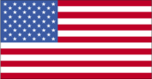
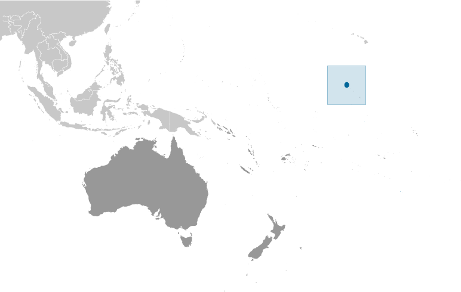
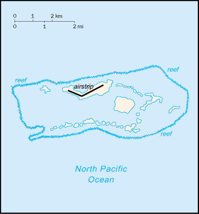

# Palmyra Atoll

_territory of the US_

## Introduction

**_Background:_**   
The Kingdom of Hawaii claimed the atoll in 1862, and the US included it among the Hawaiian Islands when it annexed the archipelago in 1898. The Hawaii Statehood Act of 1959 did not include Palmyra Atoll, which is now part privately owned by the Nature Conservancy and part US Government-owned and administered as a nature preserve. The lagoons and surrounding waters within the 12-nautical-mile US territorial seas were transferred to the US Fish and Wildlife Service and were designated a National Wildlife Refuge in January 2001.

## Geography

**_Location:_**   
Oceania, atoll in the North Pacific Ocean, about half way between Hawaii and American Samoa

**_Geographic coordinates:_**   
5 52 N, 162 04 W

**_Map references:_**   
Oceania

**_Area:_**   
**total:** 11.9 sq km   
**land:** 11.9 sq km   
**water:** 0 sq km

**_Area - comparative:_**   
about 20 times the size of The Mall in Washington, DC

**_Land boundaries:_**   
0 km

**_Coastline:_**   
14.5 km

**_Maritime claims:_**   
**territorial sea:** 12 nm   
**exclusive economic zone:** 200 nm

**_Climate:_**   
equatorial, hot, and very rainy

**_Terrain:_**   
very low

**_Elevation extremes:_**   
**lowest point:** Pacific Ocean 0 m   
**highest point:** unnamed location 2 m

**_Natural resources:_**   
terrestrial and aquatic wildlife

**_Land use:_**   
**arable land:** 0%   
**permanent crops:** 0%   
**other:** 100% (forests and woodlands) (2011)

**_Natural hazards:_**   
NA

**_Environment - current issues:_**   
NA

**_Geography - note:_**   
about 50 islets covered with dense vegetation, coconut trees, and balsa-like trees up to 30 meters tall

## People and Society

**_Population:_**   
no indigenous inhabitants   
**note:** variable temporary population of 4 to 20 staff and scientists of the the Nature Conservancy and the US Fish and Wildlife Service (July 2014 est.)

## Government

**_Country name:_**   
**conventional long form:** none   
**conventional short form:** Palmyra Atoll

**_Dependency status:_**   
incorporated territory of the US; privately owned, but administered from Washington, DC, by the Fish and Wildlife Service of the US Department of the Interior; the Office of Insular Affairs of the US Department of the Interior continues to administer nine excluded areas comprising certain tidal and submerged lands within the 12 nm territorial sea or within the lagoon

**_Legal system:_**   
the laws of the US, where applicable, apply

**_Flag description:_**   
the flag of the US is used

## Transportation

**_Airports - with unpaved runways:_**   
**total:** 1   
**1,524 to 2,437 m:** 1 (2013)

**_Ports and terminals:_**   
West Lagoon

## Military

**_Military - note:_**   
defense is the responsibility of the US

## Transnational Issues

**_Disputes - international:_**   
none

............................................................   
_Page last updated on May 21, 2014_
