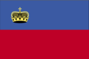
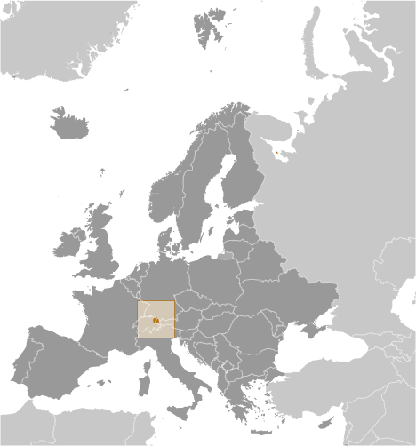
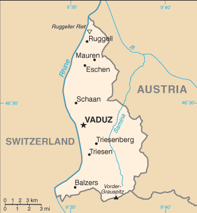

# Liechtenstein

## Introduction

**_Background:_**   
The Principality of Liechtenstein was established within the Holy Roman Empire in 1719. Occupied by both French and Russian troops during the Napoleonic Wars, it became a sovereign state in 1806 and joined the Germanic Confederation in 1815. Liechtenstein became fully independent in 1866 when the Confederation dissolved. Until the end of World War I, it was closely tied to Austria, but the economic devastation caused by that conflict forced Liechtenstein to enter into a customs and monetary union with Switzerland. Since World War II (in which Liechtenstein remained neutral), the country's low taxes have spurred outstanding economic growth. In 2000, shortcomings in banking regulatory oversight resulted in concerns about the use of financial institutions for money laundering. However, Liechtenstein implemented anti-money laundering legislation and a Mutual Legal Assistance Treaty with the US that went into effect in 2003.

## Geography

**_Location:_**   
Central Europe, between Austria and Switzerland

**_Geographic coordinates:_**   
47 16 N, 9 32 E

**_Map references:_**   
Europe

**_Area:_**   
**total:** 160 sq km   
**land:** 160 sq km   
**water:** 0 sq km

**_Area - comparative:_**   
about 0.9 times the size of Washington, DC

**_Land boundaries:_**   
**total:** 76 km   
**border countries:** Austria 34.9 km, Switzerland 41.1 km

**_Coastline:_**   
0 km (doubly landlocked)

**_Maritime claims:_**   
none (landlocked)

**_Climate:_**   
continental; cold, cloudy winters with frequent snow or rain; cool to moderately warm, cloudy, humid summers

**_Terrain:_**   
mostly mountainous (Alps) with Rhine Valley in western third

**_Elevation extremes:_**   
**lowest point:** Ruggeller Riet 430 m   
**highest point:** Vorder-Grauspitz 2,599 m

**_Natural resources:_**   
hydroelectric potential, arable land

**_Land use:_**   
**arable land:** 21.88%   
**permanent crops:** 0%   
**other:** 78.12% (2011)

**_Irrigated land:_**   
NA

**_Natural hazards:_**   
NA

**_Environment - current issues:_**   
NA

**_Environment - international agreements:_**   
**party to:** Air Pollution, Air Pollution-Nitrogen Oxides, Air Pollution-Persistent Organic Pollutants, Air Pollution-Sulfur 85, Air Pollution-Sulfur 94, Air Pollution-Volatile Organic Compounds, Biodiversity, Climate Change, Climate Change-Kyoto Protocol, Desertification, Endangered Species, Hazardous Wastes, Ozone Layer Protection, Wetlands   
**signed, but not ratified:** Law of the Sea

**_Geography - note:_**   
along with Uzbekistan, one of only two doubly landlocked countries in the world; variety of microclimatic variations based on elevation

## People and Society

**_Nationality:_**   
**noun:** Liechtensteiner(s)   
**adjective:** Liechtenstein

**_Ethnic groups:_**   
Liechtensteiner 65.6%, other 34.4% (2000 census)

**_Languages:_**   
German 94.5% (official) (Alemannic is the main dialect), Italian 1.1%, other 4.3% (2010 est.)

**_Religions:_**   
Roman Catholic (official) 75.9%, Protestant Reformed 6.5%, Muslim 5.4%, Lutheran 1.3%, other 2.9%, none 5.4%, unspecified 2.6% (2010 est.)

**_Population:_**   
37,313 (July 2014 est.)

**_Age structure:_**   
**0-14 years:** 15.7% (male 3,130/female 2,744)   
**15-24 years:** 11.7% (male 2,160/female 2,197)   
**25-54 years:** 43.1% (male 8,029/female 8,069)   
**55-64 years:** 13.4% (male 2,479/female 2,535)   
**65 years and over:** 15.4% (male 2,713/female 3,257) (2014 est.)

**_Median age:_**   
**total:** 42.4 years   
**male:** 41.3 years   
**female:** 43.5 years (2014 est.)

**_Population growth rate:_**   
0.82% (2014 est.)

**_Birth rate:_**   
10.53 births/1,000 population (2014 est.)

**_Death rate:_**   
7.02 deaths/1,000 population (2014 est.)

**_Net migration rate:_**   
4.72 migrant(s)/1,000 population (2014 est.)

**_Urbanization:_**   
**urban population:** 14.4% of total population (2011)   
**rate of urbanization:** 0.53% annual rate of change (2010-15 est.)

**_Major urban areas - population:_**   
VADUZ (capital) 5,000 (2011)

**_Sex ratio:_**   
**at birth:** 1.26 male(s)/female   
**0-14 years:** 1.14 male(s)/female   
**15-24 years:** 0.98 male(s)/female   
**25-54 years:** 1 male(s)/female   
**55-64 years:** 0.99 male(s)/female   
**65 years and over:** 0.81 male(s)/female   
**total population:** 0.98 male(s)/female (2014 est.)

**_Infant mortality rate:_**   
**total:** 4.33 deaths/1,000 live births   
**male:** 4.62 deaths/1,000 live births   
**female:** 3.96 deaths/1,000 live births (2014 est.)

**_Life expectancy at birth:_**   
**total population:** 81.68 years   
**male:** 79.52 years   
**female:** 84.4 years (2014 est.)

**_Total fertility rate:_**   
1.69 children born/woman (2014 est.)

**_HIV/AIDS - adult prevalence rate:_**   
NA

**_HIV/AIDS - people living with HIV/AIDS:_**   
NA

**_HIV/AIDS - deaths:_**   
NA

**_Education expenditures:_**   
2.1% of GDP (2008)

**_Literacy:_**   
**definition:** age 10 and over can read and write   
**total population:** 100%   
**male:** 100%   
**female:** 100%

**_School life expectancy (primary to tertiary education):_**   
**total:** 15 years   
**male:** 16 years   
**female:** 14 years (2011)

## Government

**_Country name:_**   
**conventional long form:** Principality of Liechtenstein   
**conventional short form:** Liechtenstein   
**local long form:** Fuerstentum Liechtenstein   
**local short form:** Liechtenstein

**_Government type:_**   
hereditary constitutional monarchy

**_Capital:_**   
**name:** Vaduz   
**geographic coordinates:** 47 08 N, 9 31 E   
**time difference:** UTC+1 (6 hours ahead of Washington, DC, during Standard Time)   
**daylight saving time:** +1hr, begins last Sunday in March; ends last Sunday in October

**_Administrative divisions:_**   
11 communes (Gemeinden, singular - Gemeinde); Balzers, Eschen, Gamprin, Mauren, Planken, Ruggell, Schaan, Schellenberg, Triesen, Triesenberg, Vaduz

**_Independence:_**   
23 January 1719 (Principality of Liechtenstein established); 12 July 1806 (independence from the Holy Roman Empire); 24 August 1866 (independence from the German Confederation)

**_National holiday:_**   
Assumption Day, 15 August

**_Constitution:_**   
previous 1862; latest adopted 5 October 1921; amended many times, last in 2011 (2013)

**_Legal system:_**   
civil law system influenced by Swiss, Austrian, and German law

**_International law organization participation:_**   
accepts compulsory ICJ jurisdiction with reservations; accepts ICCt jurisdiction

**_Suffrage:_**   
18 years of age; universal

**_Executive branch:_**   
**chief of state:** Prince HANS ADAM II (since 13 November 1989, assumed executive powers on 26 August 1984); Heir Apparent Prince ALOIS, son of the monarch (born 11 June 1968); note - on 15 August 2004, HANS ADAM transferred the official duties of the ruling prince to ALOIS, but HANS ADAM retains status of chief of state   
**head of government:** Head of Government (Prime Minister) Adrian HASLER (since 27 March 2013)   
**cabinet:** Cabinet elected by the Parliament, confirmed by the monarch   
**elections:** the monarchy is hereditary; following legislative elections, the leader of the majority party in the Landtag usually appointed the head of government by the monarch and the leader of the largest minority party in the Landtag usually appointed the deputy head of government by the monarch if there is a coalition government

**_Legislative branch:_**   
unicameral Parliament or Landtag (25 seats; members elected by popular vote under proportional representation to serve four-year terms)   
**elections:** last held on 3 February 2013 (next to be held in February 2017)   
**election results:** percent of vote by party - FBP 40.0%, VU 33.5%, DU 15.3% FL 11.1%; seats by party - FBP 10, VU 8, DU 4, FL 3

**_Judicial branch:_**   
**highest court(s):** Supreme Court or Oberster Gerichtshof (consists of 5 judges); Constitutional Court or Verfassungsgericht (consists of 5 judges and 5 alternates)   
**judge selection and term of office:** judges of both courts elected by the Landtag and appointed by the monarch; Supreme Court judges serve 4-year renewable terms; Constitutional Court judge tenure NA   
**subordinate courts:** Court of Appeal or Obergericht (second instance), Court of Justice (first instance), Administrative Court, county courts

**_Political parties and leaders:_**   
The Free List (Die Freie Liste) or FL [Wolfgang MARXER]   
the independents (Die Unabhaengigen) or DU [Harry QUADERER]   
Progressive Citizens' Party (Fortschrittliche Buergerpartei) or FBP [Alexander BATLINER]   
Fatherland Union (Vaterlaendische Union) or VU [Jakob BUECHEL]

**_Political pressure groups and leaders:_**   
NA

**_International organization participation:_**   
CD, CE, EBRD, EFTA, IAEA, ICRM, IFRCS, Interpol, IOC, IPU, ITSO, ITU, ITUC (NGOs), OPCW, OSCE, PCA, Schengen Convention, UN, UNCTAD, UPU, WIPO, WTO

**_Diplomatic representation in the US:_**   
**chief of mission:** Ambassador Claudia FRITSCHE (since 7 December 2000)   
**chancery:** 2900 K Street, NW, Suite 602B, Washington, DC 20007   
**telephone:** [1] (202) 331-0590   
**FAX:** [1] (202) 331-3221

**_Diplomatic representation from the US:_**   
the US does not have an embassy in Liechtenstein; the US Ambassador to Switzerland, currently Charge d'Affaires Jeffrey R. CELLARS, is accredited to Liechtenstein

**_Flag description:_**   
two equal horizontal bands of blue (top) and red with a gold crown on the hoist side of the blue band; the colors may derive from the blue and red livery design used in the principality's household in the 18th century; the prince's crown was introduced in 1937 to distinguish the flag from that of Haiti

**_National anthem:_**   
**name:** "Oben am jungen Rhein" (High Above the Young Rhine)   
**lyrics/music:** Jakob Joseph JAUCH/Josef FROMMELT   
**note:** adopted 1850, revised 1963; the anthem uses the tune of "God Save the Queen"

## Economy

**_Economy - overview:_**   
Despite its small size and limited natural resources, Liechtenstein has developed into a prosperous, highly industrialized, free-enterprise economy with a vital financial service sector and likely the second highest per capita income in the world. The Liechtenstein economy is widely diversified with a large number of small businesses. Low business taxes - the maximum tax rate is 20% - and easy incorporation rules have induced many holding companies to establish nominal offices in Liechtenstein providing 30% of state revenues. The country participates in a customs union with Switzerland and uses the Swiss franc as its national currency. It imports more than 90% of its energy requirements. Liechtenstein has been a member of the European Economic Area (an organization serving as a bridge between the European Free Trade Association (EFTA) and the EU) since May 1995. The government is working to harmonize its economic policies with those of an integrated Europe. Since 2008, Liechtenstein has faced renewed international pressure - particularly from Germany - to improve transparency in its banking and tax systems. In December 2008, Liechtenstein signed a Tax Information Exchange Agreement with the US. Upon Liechtenstein's conclusion of 12 bilateral information-sharing agreements, the OECD in October 2009 removed the principality from its "grey list" of countries that had yet to implement the organization's Model Tax Convention. By the end of 2010, Liechtenstein had signed 25 Tax Information Exchange Agreements or Double Tax Agreements. In 2011 Liechtenstein joined the Schengen area, which allows passport-free travel across 26 European countries.

**_GDP (purchasing power parity):_**   
$3.2 billion (2009)   
$3.216 billion (2008)   
$3.159 billion (2007)

**_GDP (official exchange rate):_**   
$5.113 billion (2010 est.)

**_GDP - real growth rate:_**   
1.8% (2012 est.)   
-0.5% (2009 est.)   
3.1% (2007 est.)

**_GDP - per capita (PPP):_**   
$89,400 (2009 est.)   
$90,600 (2008 est.)   
$89,700 (2007 est.)

**_GDP - composition, by sector of origin:_**   
**agriculture:** 8%   
**industry:** 37%   
**services:** 55% (2009)

**_Agriculture - products:_**   
wheat, barley, corn, potatoes; livestock, dairy products

**_Industries:_**   
electronics, metal manufacturing, dental products, ceramics, pharmaceuticals, food products, precision instruments, tourism, optical instruments

**_Industrial production growth rate:_**   
NA%

**_Labor force:_**   
35,830 (2012)   
**note:** 51% of the labor force in Liechtenstein commuted daily from Austria, Switzerland, or Germany (2012)

**_Labor force - by occupation:_**   
**agriculture:** 0.8%   
**industry:** 39.4%   
**services:** 59.9% (2012)

**_Unemployment rate:_**   
2.3% (2012)   
2.5% (2011)

**_Population below poverty line:_**   
NA%

**_Household income or consumption by percentage share:_**   
**lowest 10%:** NA%   
**highest 10%:** NA%

**_Budget:_**   
**revenues:** $995.3 million   
**expenditures:** $890.4 million (2011 est.)

**_Taxes and other revenues:_**   
25.2% of GDP (2011 est.)

**_Budget surplus (+) or deficit (-):_**   
-1.6% of GDP (2011 est.)

**_Fiscal year:_**   
calendar year

**_Inflation rate (consumer prices):_**   
-0.7% (2012)   
0.2% (2011)

**_Market value of publicly traded shares:_**   
$NA

**_Exports:_**   
$3.801 billion (2012 est.)   
$3.757 billion (2011 est.)   
**note:** trade data exclude trade with Switzerland

**_Exports - commodities:_**   
small specialty machinery, connectors for audio and video, parts for motor vehicles, dental products, hardware, prepared foodstuffs, electronic equipment, optical products

**_Imports:_**   
$2.09 billion (2012 est.)   
$2.218 billion (2011 est.)   
**note:** trade data exclude trade with Switzerland

**_Imports - commodities:_**   
agricultural products, raw materials, energy products, machinery, metal goods, textiles, foodstuffs, motor vehicles

**_Debt - external:_**   
$0 (2001)

**_Exchange rates:_**   
Swiss francs (CHF) per US dollar -   
0.9542 (2013)   
0.9374 (2012)   
1.0429 (2010)   
1.0881 (2009)   
1.0774 (2008)

## Energy

**_Electricity - production:_**   
145.3 million kWh (2012)

**_Electricity - consumption:_**   
1.36 billion kWh (2012)

**_Electricity - imports:_**   
1.214 billion kWh (2012)

## Communications

**_Telephones - main lines in use:_**   
20,000 (2012)

**_Telephones - mobile cellular:_**   
38,000 (2012)

**_Telephone system:_**   
**general assessment:** automatic telephone system   
**domestic:** fixed-line and mobile-cellular services widely available; combined telephone service subscribership exceeds 150 per 100 persons   
**international:** country code - 423; linked to Swiss networks by cable and microwave radio relay (2011)

**_Broadcast media:_**   
relies on foreign terrestrial and satellite broadcasters for most broadcast media services; first Liechtenstein-based TV station established August 2008; Radio Liechtenstein operates multiple radio stations; a Swiss-based broadcaster operates several radio stations in Liechtenstein (2008)

**_Internet country code:_**   
.li

**_Internet hosts:_**   
14,278 (2012)

**_Internet users:_**   
23,000 (2009)

## Transportation

**_Pipelines:_**   
gas 20 km (2013)

**_Railways:_**   
**total:** 9 km   
**standard gauge:** 9 km 1.435-m gauge (electrified)   
**note:** belongs to the Austrian Railway System connecting Austria and Switzerland (2008)

**_Roadways:_**   
**total:** 380 km   
**paved:** 380 km (2012)

**_Waterways:_**   
28 km (2010)

## Military

**_Military branches:_**   
no regular military forces; National Police maintains close relations with neighboring forces (2013)

**_Manpower available for military service:_**   
**males age 16-49:** 8,009 (2010 est.)

**_Manpower fit for military service:_**   
**males age 16-49:** 6,538   
**females age 16-49:** 6,746 (2010 est.)

**_Manpower reaching militarily significant age annually:_**   
**male:** 219   
**female:** 211 (2010 est.)

**_Military - note:_**   
Liechtenstein has no military forces, but the modern National Police maintains close relations with neighboring forces. (2013)

## Transnational Issues

**_Disputes - international:_**   
none

**_Refugees and internally displaced persons:_**   
**stateless persons:** 5 (2012)

**_Illicit drugs:_**   
has strengthened money laundering controls, but money laundering remains a concern due to Liechtenstein's sophisticated offshore financial services sector

............................................................   
_Page last updated on June 19, 2014_
