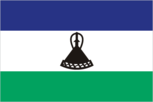
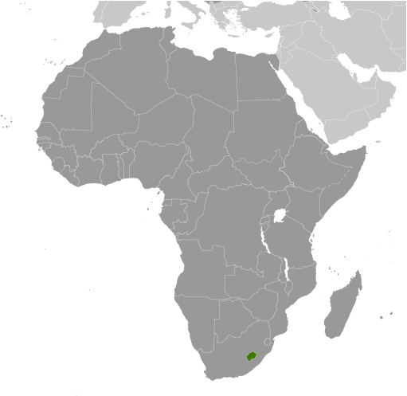
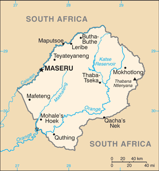

# Lesotho

## Introduction

**_Background:_**   
Basutoland was renamed the Kingdom of Lesotho upon independence from the UK in 1966. The Basuto National Party ruled the country during its first two decades. King MOSHOESHOE was exiled in 1990, but returned to Lesotho in 1992 and was reinstated in 1995 and subsequently succeeded by his son, King LETSIE III, in 1996. Constitutional government was restored in 1993 after seven years of military rule. In 1998, violent protests and a military mutiny following a contentious election prompted a brief but bloody intervention by South African and Batswana military forces under the aegis of the Southern African Development Community. Subsequent constitutional reforms restored relative political stability. Peaceful parliamentary elections were held in 2002, but the National Assembly elections of February 2007 were hotly contested and aggrieved parties disputed how the electoral law was applied to award proportional seats in the Assembly. In May 2012, competitive elections involving 18 parties saw Prime Minister Motsoahae Thomas THABANE form a coalition government - the first in the country's history - that ousted the 14-year incumbent, Pakalitha MOSISILI, who peacefully transferred power the following month.

## Geography

**_Location:_**   
Southern Africa, an enclave of South Africa

**_Geographic coordinates:_**   
29 30 S, 28 30 E

**_Map references:_**   
Africa

**_Area:_**   
**total:** 30,355 sq km   
**land:** 30,355 sq km   
**water:** 0 sq km

**_Area - comparative:_**   
slightly smaller than Maryland

**_Land boundaries:_**   
**total:** 909 km   
**border countries:** South Africa 909 km

**_Coastline:_**   
0 km (landlocked)

**_Maritime claims:_**   
none (landlocked)

**_Climate:_**   
temperate; cool to cold, dry winters; hot, wet summers

**_Terrain:_**   
mostly highland with plateaus, hills, and mountains

**_Elevation extremes:_**   
**lowest point:** junction of the Orange and Makhaleng Rivers 1,400 m   
**highest point:** Thabana Ntlenyana 3,482 m

**_Natural resources:_**   
water, agricultural and grazing land, diamonds, sand, clay, building stone

**_Land use:_**   
**arable land:** 10.14%   
**permanent crops:** 0.13%   
**other:** 89.72% (2011)

**_Irrigated land:_**   
26.37 sq km (2003)

**_Total renewable water resources:_**   
3.02 cu km (2011)

**_Freshwater withdrawal (domestic/industrial/agricultural):_**   
**total:** 0.04 cu km/yr (46%/46%/9%)   
**per capita:** 21.79 cu m/yr (2000)

**_Natural hazards:_**   
periodic droughts

**_Environment - current issues:_**   
population pressure forcing settlement in marginal areas results in overgrazing, severe soil erosion, and soil exhaustion; desertification; Highlands Water Project controls, stores, and redirects water to South Africa

**_Environment - international agreements:_**   
**party to:** Biodiversity, Climate Change, Climate Change-Kyoto Protocol, Desertification, Endangered Species, Hazardous Wastes, Law of the Sea, Marine Life Conservation, Ozone Layer Protection, Wetlands   
**signed, but not ratified:** none of the selected agreements

**_Geography - note:_**   
landlocked, completely surrounded by South Africa; mountainous, more than 80% of the country is 1,800 m above sea level

## People and Society

**_Nationality:_**   
**noun:** Mosotho (singular), Basotho (plural)   
**adjective:** Basotho

**_Ethnic groups:_**   
Sotho 99.7%, Europeans, Asians, and other 0.3%,

**_Languages:_**   
Sesotho (official) (southern Sotho), English (official), Zulu, Xhosa

**_Religions:_**   
Christian 80%, indigenous beliefs 20%

**_Population:_**   
1,942,008   
**note:** estimates for this country explicitly take into account the effects of excess mortality due to AIDS; this can result in lower life expectancy, higher infant mortality, higher death rates, lower population growth rates, and changes in the distribution of population by age and sex than would otherwise be expected (July 2014 est.)

**_Age structure:_**   
**0-14 years:** 32.9% (male 321,017/female 318,265)   
**15-24 years:** 19.9% (male 184,006/female 203,336)   
**25-54 years:** 36.8% (male 349,365/female 364,970)   
**55-64 years:** 4.9% (male 51,274/female 44,847)   
**65 years and over:** 5.4% (male 52,955/female 51,973) (2014 est.)

**_Dependency ratios:_**   
**total dependency ratio:** 67.1 %   
**youth dependency ratio:** 60.1 %   
**elderly dependency ratio:** 7 %   
**potential support ratio:** 14.3 (2014 est.)

**_Median age:_**   
**total:** 23.6 years   
**male:** 23.6 years   
**female:** 23.6 years (2014 est.)

**_Population growth rate:_**   
0.34% (2014 est.)

**_Birth rate:_**   
25.92 births/1,000 population (2014 est.)

**_Death rate:_**   
14.91 deaths/1,000 population (2014 est.)

**_Net migration rate:_**   
-7.62 migrant(s)/1,000 population (2014 est.)

**_Urbanization:_**   
**urban population:** 27.6% of total population (2011)   
**rate of urbanization:** 3.57% annual rate of change (2010-15 est.)

**_Major urban areas - population:_**   
MASERU (capital) 239,000 (2011)

**_Sex ratio:_**   
**at birth:** 1.03 male(s)/female   
**0-14 years:** 1.01 male(s)/female   
**15-24 years:** 0.91 male(s)/female   
**25-54 years:** 0.96 male(s)/female   
**55-64 years:** 0.98 male(s)/female   
**65 years and over:** 0.99 male(s)/female   
**total population:** 0.97 male(s)/female (2014 est.)

**_Mother's mean age at first birth:_**   
21.2   
**note:** median age at first birth among women 25-29 (2009 est.)

**_Maternal mortality rate:_**   
620 deaths/100,000 live births (2010)

**_Infant mortality rate:_**   
**total:** 50.48 deaths/1,000 live births   
**male:** 54.38 deaths/1,000 live births   
**female:** 46.45 deaths/1,000 live births (2014 est.)

**_Life expectancy at birth:_**   
**total population:** 52.65 years   
**male:** 52.55 years   
**female:** 52.75 years (2014 est.)

**_Total fertility rate:_**   
2.78 children born/woman (2014 est.)

**_Contraceptive prevalence rate:_**   
47% (2009/10)

**_Health expenditures:_**   
12.8% of GDP (2011)

**_Physicians density:_**   
0.05 physicians/1,000 population (2003)

**_Hospital bed density:_**   
1.3 beds/1,000 population (2006)

**_Drinking water source:_**   
**improved:** urban: 93.2% of population; rural: 76.7% of population; total: 81.3% of population   
**unimproved:** urban: 6.8% of population; rural: 23.3% of population; total: 18.7% of population (2012 est.)

**_Sanitation facility access:_**   
**improved:** urban: 37% of population; rural: 26.7% of population; total: 29.6% of population   
**unimproved:** urban: 63% of population; rural: 73.3% of population; total: 70.4% of population (2012 est.)

**_HIV/AIDS - adult prevalence rate:_**   
23.1% (2012 est.)

**_HIV/AIDS - people living with HIV/AIDS:_**   
358,700 (2012 est.)

**_HIV/AIDS - deaths:_**   
15,500 (2012 est.)

**_Obesity - adult prevalence rate:_**   
14.6% (2008)

**_Children under the age of 5 years underweight:_**   
13.5% (2010)

**_Education expenditures:_**   
13% of GDP (2008)

**_Literacy:_**   
**definition:** age 15 and over can read and write   
**total population:** 89.6%   
**male:** 83.3%   
**female:** 95.6% (2010 est.)

**_School life expectancy (primary to tertiary education):_**   
**total:** 11 years   
**male:** 11 years   
**female:** 12 years (2012)

**_Child labor - children ages 5-14:_**   
**total number:** 103,020   
**percentage:** 23 % (2000 est.)

**_Unemployment, youth ages 15-24:_**   
**total:** 34.4%   
**male:** 29%   
**female:** 41.9% (2008)

## Government

**_Country name:_**   
**conventional long form:** Kingdom of Lesotho   
**conventional short form:** Lesotho   
**local long form:** Kingdom of Lesotho   
**local short form:** Lesotho   
**former:** Basutoland

**_Government type:_**   
parliamentary constitutional monarchy

**_Capital:_**   
**name:** Maseru   
**geographic coordinates:** 29 19 S, 27 29 E   
**time difference:** UTC+2 (7 hours ahead of Washington, DC, during Standard Time)

**_Administrative divisions:_**   
10 districts; Berea, Butha-Buthe, Leribe, Mafeteng, Maseru, Mohale's Hoek, Mokhotlong, Qacha's Nek, Quthing, Thaba-Tseka

**_Independence:_**   
4 October 1966 (from the UK)

**_National holiday:_**   
Independence Day, 4 October (1966)

**_Constitution:_**   
previous 1959, 1967; latest adopted 2 April 1993 (effectively restoring the 1967 version); amended 2001 (2013)

**_Legal system:_**   
mixed legal system of English common law and Roman-Dutch law; judicial review of legislative acts in High Court and Court of Appeal

**_International law organization participation:_**   
accepts compulsory ICJ jurisdiction with reservations; accepts ICCt jurisdiction

**_Suffrage:_**   
18 years of age; universal

**_Executive branch:_**   
**chief of state:** King LETSIE III (since 7 February 1996); note - King LETSIE III formerly occupied the throne from November 1990 to February 1995 while his father was in exile   
**head of government:** Prime Minister Motsoahae Thomas THABANE (since 8 June 2012)   
**cabinet:** Cabinet   
**elections:** the leader of the majority party, or coalition of parties, in the Assembly automatically becomes prime minister; the monarchy is hereditary, but, under the terms of the constitution that came into effect after the March 1993 election, the monarch is a "living symbol of national unity" with no executive or legislative powers; under traditional law, the college of chiefs has the power to depose the monarch, determine next in line of succession or shall serve as regent in the event that the successor is not of mature age

**_Legislative branch:_**   
bicameral Parliament consists of the Senate (33 members - 22 principal chiefs and 11 other members appointed by the ruling party) and the Assembly (120 seats, 80 by popular vote and 40 by proportional vote; members elected by popular vote to serve five-year terms)   
**elections:** last held on 26 May 2012 (next to be held in 2017)   
**election results:** percent of vote by party - NA; seats by party - DC 48, ABC 30, LCD 26, BNP 5, PFD 3, NIP 2, other 6

**_Judicial branch:_**   
**highest court(s):** Court of Appeal (consists of the court president, such number of justices of appeal as set by Parliament, and the Chief Justice and the puisne judges of the High Court ex officio); High Court (consists of the chief justice and such number of puisne judges as set by Parliament); note - both the Court of Appeal and the High Court have jurisdiction in constitutional issues   
**judge selection and term of office:** Court of Appeal president and High Court chief justice appointed by the monarch on the advice of the prime minister; puisne judges appointed by the monarch on advice of the Judicial Service Commission, an independent body of judicial officers and officials designated by the monarch; judges of both courts can serve until age 75   
**subordinate courts:** Magistrate Courts; customary or traditional courts; Courts Martial

**_Political parties and leaders:_**   
Pakalitha Mosisili All Basotho Convention or ABC [Motsoahae Thomas THABANE]   
Basotho Batho Democratic Party or BBDP [Geremane RAMATHEBANE]   
Basotho Congress Party or BCP [Thulo MAHLAKENG]   
Basotho Democratic National Party or BDNP [Thabang NYEOE]   
Basotho National Party or BNP [Thesele MASERIBANE]   
Democratic Congress or DC [Pakalitha MOSISILI]   
Lesotho Congress for Democracy or LCD [Mothetjoa METSING]   
Lesotho Peoples Congress or LPC [Kelebone MAOPE]   
Lesotho Workers Party or LWP [Macaefa BILLY]   
Marematlou Freedom Party or MFP [Vincent MALEBO]   
National Independent Party or NIP [Kimetso MATHABA]

**_Political pressure groups and leaders:_**   
Media Institute of Southern Africa, Lesotho chapter [Tsebo MATŠASA] (pushes for media freedom)

**_International organization participation:_**   
ACP, AfDB, AU, C, CD, FAO, G-77, IAEA, IBRD, ICAO, ICRM, IDA, IFAD, IFC, IFRCS, ILO, IMF, Interpol, IOC, IOM, IPU, ISO (correspondent), ITU, MIGA, NAM, OPCW, SACU, SADC, UN, UNAMID, UNCTAD, UNESCO, UNHCR, UNIDO, UNWTO, UPU, WCO, WFTU (NGOs), WHO, WIPO, WMO, WTO

**_Diplomatic representation in the US:_**   
**chief of mission:** Ambassador Eliachim Molapi SEBATANE (since 2 November 2011)   
**chancery:** 2511 Massachusetts Avenue NW, Washington, DC 20008   
**telephone:** [1] (202) 797-5533   
**FAX:** [1] (202) 234-6815

**_Diplomatic representation from the US:_**   
**chief of mission:** Ambassador (vacant); Charge d'Affaires Carl B. FOX   
**embassy:** 254 Kingsway Road, Maseru West (Consular Section)   
**mailing address:** P. O. Box 333, Maseru 100, Lesotho   
**telephone:** [266] 22 312666   
**FAX:** [266] 22 310116

**_Flag description:_**   
three horizontal stripes of blue (top), white, and green in the proportions of 3:4:3; the colors represent rain, peace, and prosperity respectively; centered in the white stripe is a black Basotho hat representing the indigenous people; the flag was unfurled in October 2006 to celebrate 40 years of independence

**_National symbol(s):_**   
Basotho hat

**_National anthem:_**   
**name:** "Lesotho fatse la bo ntat'a rona" (Lesotho, Land of Our Fathers)   
**lyrics/music:** Francois COILLARD/Ferdinand-Samuel LAUR   
**note:** adopted 1967; the anthem's music derives from an 1823 Swiss songbook

## Economy

**_Economy - overview:_**   
Small, mountainous, and completely landlocked by South Africa, Lesotho is a least developed country in which about three-fourths of the people live in rural areas and engage in subsistence agriculture. Lesotho produces less than 20% of the nation's demand for food. Rain-fed agriculture is vulnerable to weather and climate variability; an estimated 725,500 people will require food assistance in 2012/13. The distribution of income in Lesotho remains inequitable. Lesotho relies on South Africa for much of its economic activity. Lesotho imports 90% of the goods it consumes from South Africa, including most agricultural inputs. Households depend heavily on remittances from family members working in South Africa, in mines, on farms and as domestic workers, though mining employment has declined substantially since the 1990s. Government revenue depends heavily on transfers from South Africa. Customs duties from the Southern Africa Customs Union accounted for 44% of government revenue in 2012. The South African Government also pays royalties for water transferred to South Africa from a dam and reservoir system in Lesotho. However, the government continues to strengthen its tax system to reduce dependency on customs duties and other transfers. Access to credit remains a problem for the private sector. The government maintains a large presence in the economy - government consumption accounted for 39% of GDP in 2013 and the government remains Lesotho's largest employer. Lesotho's largest private employer is the textile and garment industry - approximately 36,000 Basotho, mainly women, work in factories producing garments for export to South Africa and the US. Diamond mining in Lesotho has grown in recent years and may contribute 8.5% to GDP by 2015, according to current forecasts. Lesotho's $362.5 million Millennium Challenge Account Compact, which focused on strengthening the healthcare system, developing the private sector, and providing access to improved water supplies and sanitation facilities, will end in September 2013. Despite the 2008/09 global economic crisis, the economy has had strong, but declining growth since 2010.

**_GDP (purchasing power parity):_**   
$4.265 billion (2013 est.)   
$4.096 billion (2012 est.)   
$3.918 billion (2011 est.)   
**note:** data are in 2013 US dollars

**_GDP (official exchange rate):_**   
$2.457 billion (2013 est.)

**_GDP - real growth rate:_**   
4.1% (2013 est.)   
4.5% (2012 est.)   
5.7% (2011 est.)

**_GDP - per capita (PPP):_**   
$2,200 (2013 est.)   
$2,200 (2012 est.)   
$2,100 (2011 est.)   
**note:** data are in 2013 US dollars

**_Gross national saving:_**   
11.4% of GDP (2013 est.)   
7.8% of GDP (2012 est.)   
7.8% of GDP (2011 est.)

**_GDP - composition, by end use:_**   
**household consumption:** 86%   
**government consumption:** 39.4%   
**investment in fixed capital:** 33.7%   
**investment in inventories:** 1.2%   
**exports of goods and services:** 47.9%   
**imports of goods and services:** -108.2%; (2013 est.)

**_GDP - composition, by sector of origin:_**   
**agriculture:** 7.4%   
**industry:** 34.5%   
**services:** 58.2% (2013 est.)

**_Agriculture - products:_**   
corn, wheat, pulses, sorghum, barley; livestock

**_Industries:_**   
food, beverages, textiles, apparel assembly, handicrafts, construction, tourism

**_Industrial production growth rate:_**   
4.3% (2013 est.)

**_Labor force:_**   
874,200 (2013 est.)

**_Labor force - by occupation:_**   
**agriculture:** 86%   
**industry and services:** 14%   
**note:** most of the resident population is engaged in subsistence agriculture; roughly 35% of the active male wage earners work in South Africa (2002 est.)

**_Unemployment rate:_**   
25% (2008 est.)   
45% (2002 est.)

**_Population below poverty line:_**   
49% (1999)

**_Household income or consumption by percentage share:_**   
**lowest 10%:** 1%   
**highest 10%:** 39.4% (2003)

**_Distribution of family income - Gini index:_**   
63.2 (1995)   
56 (1986-87)

**_Budget:_**   
**revenues:** $1.462 billion   
**expenditures:** $1.483 billion (2013 est.)

**_Taxes and other revenues:_**   
59.5% of GDP (2013 est.)

**_Budget surplus (+) or deficit (-):_**   
-0.9% of GDP (2013 est.)

**_Public debt:_**   
NA

**_Fiscal year:_**   
1 April - 31 March

**_Inflation rate (consumer prices):_**   
5% (2013 est.)   
6.1% (2012 est.)

**_Central bank discount rate:_**   
9.36% (31 December 2012 est.)   
10% (31 December 2010 est.)

**_Commercial bank prime lending rate:_**   
10% (31 December 2013 est.)   
10.12% (31 December 2012 est.)

**_Stock of narrow money:_**   
$425.1 million (31 December 2013 est.)   
$408.9 million (31 December 2012 est.)

**_Stock of broad money:_**   
$903.4 million (31 December 2013 est.)   
$840.9 million (31 December 2012 est.)

**_Stock of domestic credit:_**   
$85,420 (31 December 2013 est.)   
$75,280 (31 December 2012 est.)

**_Current account balance:_**   
-$518.4 million (2013 est.)   
-$587.4 million (2012 est.)

**_Exports:_**   
$941.2 million (2013 est.)   
$972.4 million (2012 est.)

**_Exports - commodities:_**   
manufactures (clothing, footwear), wool and mohair, food and live animals, electricity, water, diamonds

**_Imports:_**   
$2.148 billion (2013 est.)   
$2.239 billion (2012 est.)

**_Imports - commodities:_**   
food; building materials, vehicles, machinery, medicines, petroleum products

**_Reserves of foreign exchange and gold:_**   
$857.9 million (31 December 2013 est.)   
$749.4 million (31 December 2012 est.)

**_Debt - external:_**   
$794 million (31 December 2013 est.)   
$779.8 million (31 December 2012 est.)

**_Stock of direct foreign investment - at home:_**   
$635.7 million (31 December 2013 est.)   
$398 million (31 December 2012 est.)

**_Exchange rates:_**   
maloti (LSL) per US dollar -   
9.575 (2013 est.)   
8.2 (2012 est.)   
7.32 (2010 est.)   
8.47 (2009)   
7.75 (2008)

## Energy

**_Electricity - production:_**   
200 million kWh (2010 est.)

**_Electricity - consumption:_**   
307 million kWh (2010 est.)

**_Electricity - exports:_**   
0 kWh (2012 est.)

**_Electricity - imports:_**   
247 million kWh (2011 est.)

**_Electricity - installed generating capacity:_**   
76,000 kW (2010 est.)

**_Electricity - from fossil fuels:_**   
0% of total installed capacity (2010 est.)

**_Electricity - from nuclear fuels:_**   
0% of total installed capacity (2010 est.)

**_Electricity - from hydroelectric plants:_**   
100% of total installed capacity (2010 est.)

**_Electricity - from other renewable sources:_**   
0% of total installed capacity (2010 est.)

**_Crude oil - production:_**   
0 bbl/day (2012 est.)

**_Crude oil - exports:_**   
0 bbl/day (2010 est.)

**_Crude oil - imports:_**   
0 bbl/day (2010 est.)

**_Crude oil - proved reserves:_**   
0 bbl (1 January 2013 est.)

**_Refined petroleum products - production:_**   
0 bbl/day (2010 est.)

**_Refined petroleum products - consumption:_**   
1,777 bbl/day (2011 est.)

**_Refined petroleum products - exports:_**   
0 bbl/day (2010 est.)

**_Refined petroleum products - imports:_**   
3,711 bbl/day (2010 est.)

**_Natural gas - production:_**   
0 cu m (2011 est.)

**_Natural gas - consumption:_**   
0 cu m (2010 est.)

**_Natural gas - exports:_**   
0 cu m (2011 est.)

**_Natural gas - imports:_**   
0 cu m (2011 est.)

**_Natural gas - proved reserves:_**   
0 cu m (1 January 2013 est.)

**_Carbon dioxide emissions from consumption of energy:_**   
445,600 Mt (2011 est.)

## Communications

**_Telephones - main lines in use:_**   
43,100 (2012)

**_Telephones - mobile cellular:_**   
1.312 million (2012)

**_Telephone system:_**   
**general assessment:** rudimentary system consisting of a modest number of landlines, a small microwave radio relay system, and a small radiotelephone communication system; mobile-cellular telephone system is expanding   
**domestic:** privatized in 2001, Telecom Lesotho was tasked with providing an additional 50,000 fixed-line connections within five years, a target not met; mobile-cellular service dominates the market and is expanding with a subscribership roughly 65 per 100 persons in 2011; rural services are scant   
**international:** country code - 266; satellite earth station - 1 Intelsat (Atlantic Ocean) (2011)

**_Broadcast media:_**   
1 state-owned TV station and 2 state-owned radio stations; government controls most private broadcast media; satellite TV subscription service available; transmissions of multiple international broadcasters obtainable (2008)

**_Internet country code:_**   
.ls

**_Internet hosts:_**   
11,030 (2012)

**_Internet users:_**   
76,800 (2009)

## Transportation

**_Airports:_**   
24 (2013)

**_Airports - with paved runways:_**   
**total:** 3   
**over 3,047 m:** 1   
**914 to 1,523 m:** 1   
**under 914 m:** 1 (2013)

**_Airports - with unpaved runways:_**   
**total:** 21   
**914 to 1,523 m:** 5   
**under 914 m:** 16 (2013)

**_Roadways:_**   
**total:** 5,940 km   
**paved:** 1,069 km   
**unpaved:** 4,871 km (2011)

## Military

**_Military branches:_**   
Lesotho Defense Force (LDF): Army (includes Air Wing) (2012)

**_Military service age and obligation:_**   
18-24 years of age for voluntary military service; no conscription; women serve as commissioned officers (2012)

**_Manpower available for military service:_**   
**males age 16-49:** 472,456   
**females age 16-49:** 508,953 (2010 est.)

**_Manpower fit for military service:_**   
**males age 16-49:** 270,184   
**females age 16-49:** 275,734 (2010 est.)

**_Manpower reaching militarily significant age annually:_**   
**male:** 19,110   
**female:** 20,037 (2010 est.)

**_Military expenditures:_**   
1.94% of GDP (2012)   
2.3% of GDP (2011)   
1.94% of GDP (2010)

**_Military - note:_**   
Lesotho's declared policy is maintenance of its independent sovereignty and preservation of internal security; in practice, external security is guaranteed by South Africa; restructuring of the Lesotho Defense Force (LDF) and Ministry of Defense and Public Service over the past five years has focused on subordinating the defense apparatus to civilian control and restoring the LDF's cohesion; the restructuring has considerably improved capabilities and professionalism, but the LDF is disproportionately large for a small, poor country; the government has outlined a reduction to a planned 1,500-man strength, but these plans have met with vociferous resistance from the political opposition and from inside the LDF (2008)

## Transnational Issues

**_Disputes - international:_**   
South Africa has placed military units to assist police operations along the border of Lesotho, Zimbabwe, and Mozambique to control smuggling, poaching, and illegal migration

**_Trafficking in persons:_**   
**current situation:** Lesotho is a source, transit, and destination country for women and children subjected to forced labor and sex trafficking and for men subjected to forced labor; Basotho women and children are subjected to domestic servitude and children, to a lesser extent, commercial sexual exploitation within Lesotho and South Africa; some Basotho women willingly migrate to South Africa seeking work in domestic service only to be forced into prostitution; some Basotho men who voluntarily migrate to South Africa for work become victims of forced labor in agriculture and mining or are coerced into committing crimes

............................................................   
_Page last updated on June 20, 2014_
