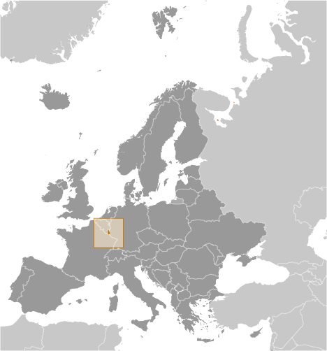

# Luxembourg

## Introduction

**_Background:_**   
Founded in 963, Luxembourg became a grand duchy in 1815 and an independent state under the Netherlands. It lost more than half of its territory to Belgium in 1839 but gained a larger measure of autonomy. Full independence was attained in 1867. Overrun by Germany in both world wars, it ended its neutrality in 1948 when it entered into the Benelux Customs Union and when it joined NATO the following year. In 1957, Luxembourg became one of the six founding countries of the European Economic Community (later the European Union), and in 1999 it joined the euro currency area. In January 2013, Luxembourg assumed a nonpermanent seat on the UN Security Council for the 2013-14 term.

## Geography

**_Location:_**   
Western Europe, between France and Germany

**_Geographic coordinates:_**   
49 45 N, 6 10 E

**_Map references:_**   
Europe

**_Area:_**   
**total:** 2,586 sq km   
**land:** 2,586 sq km   
**water:** 0 sq km

**_Area - comparative:_**   
slightly smaller than Rhode Island

**_Land boundaries:_**   
**total:** 359 km   
**border countries:** Belgium 148 km, France 73 km, Germany 138 km

**_Coastline:_**   
0 km (landlocked)

**_Maritime claims:_**   
none (landlocked)

**_Climate:_**   
modified continental with mild winters, cool summers

**_Terrain:_**   
mostly gently rolling uplands with broad, shallow valleys; uplands to slightly mountainous in the north; steep slope down to Moselle flood plain in the southeast

**_Elevation extremes:_**   
**lowest point:** Moselle River 133 m   
**highest point:** Buurgplaatz 559 m

**_Natural resources:_**   
iron ore (no longer exploited), arable land

**_Land use:_**   
**arable land:** 23.9%   
**permanent crops:** 0.58%   
**other:** 75.52% (includes Belgium) (2011)

**_Irrigated land:_**   
NA

**_Total renewable water resources:_**   
3.1 cu km (2011)

**_Freshwater withdrawal (domestic/industrial/agricultural):_**   
**total:** 0.06 cu km/yr (65%/33%/1%)   
**per capita:** 135.9 cu m/yr (2010)

**_Natural hazards:_**   
NA

**_Environment - current issues:_**   
air and water pollution in urban areas, soil pollution of farmland

**_Environment - international agreements:_**   
**party to:** Air Pollution, Air Pollution-Nitrogen Oxides, Air Pollution-Persistent Organic Pollutants, Air Pollution-Sulfur 85, Air Pollution-Sulfur 94, Air Pollution-Volatile Organic Compounds, Biodiversity, Climate Change, Climate Change-Kyoto Protocol, Desertification, Endangered Species, Hazardous Wastes, Law of the Sea, Marine Dumping, Ozone Layer Protection, Ship Pollution, Tropical Timber 83, Tropical Timber 94, Wetlands   
**signed, but not ratified:** Environmental Modification

**_Geography - note:_**   
landlocked; the only Grand Duchy in the world

## People and Society

**_Nationality:_**   
**noun:** Luxembourger(s)   
**adjective:** Luxembourg

**_Ethnic groups:_**   
Luxembourger 63.1%, Portuguese 13.3%, French 4.5%, Italian 4.3%, German 2.3%, other EU 7.3%, other 5.2% (2000 census)

**_Languages:_**   
Luxembourgish (official administrative language and national language (spoken vernacular)), French (official administrative language), German (official administrative language)

**_Religions:_**   
Roman Catholic 87%, other (includes Protestant, Jewish, and Muslim) 13% (2000)

**_Population:_**   
520,672 (July 2014 est.)

**_Age structure:_**   
**0-14 years:** 17.9% (male 47,968/female 45,100)   
**15-24 years:** 12.7% (male 33,657/female 32,212)   
**25-54 years:** 42.1% (male 109,528/female 109,662)   
**55-64 years:** 12% (male 31,076/female 31,212)   
**65 years and over:** 15.2% (male 33,892/female 46,365) (2014 est.)

**_Dependency ratios:_**   
**total dependency ratio:** 46.6 %   
**youth dependency ratio:** 25.6 %   
**elderly dependency ratio:** 21 %   
**potential support ratio:** 4.8 (2014 est.)

**_Median age:_**   
**total:** 39.6 years   
**male:** 38.5 years   
**female:** 40.7 years (2014 est.)

**_Population growth rate:_**   
1.12% (2014 est.)

**_Birth rate:_**   
11.75 births/1,000 population (2014 est.)

**_Death rate:_**   
8.53 deaths/1,000 population (2014 est.)

**_Net migration rate:_**   
7.97 migrant(s)/1,000 population (2014 est.)

**_Urbanization:_**   
**urban population:** 85.4% of total population (2011)   
**rate of urbanization:** 1.62% annual rate of change (2010-15 est.)

**_Major urban areas - population:_**   
LUXEMBOURG (capital) 94,000 (2011)

**_Sex ratio:_**   
**at birth:** 1.07 male(s)/female   
**0-14 years:** 1.06 male(s)/female   
**15-24 years:** 1.05 male(s)/female   
**25-54 years:** 1 male(s)/female   
**55-64 years:** 0.97 male(s)/female   
**65 years and over:** 0.71 male(s)/female   
**total population:** 0.97 male(s)/female (2014 est.)

**_Mother's mean age at first birth:_**   
30.2   
**note:** data are based on events and not on fertility rates (2012 est.)

**_Maternal mortality rate:_**   
20 deaths/100,000 live births (2010)

**_Infant mortality rate:_**   
**total:** 4.28 deaths/1,000 live births   
**male:** 4.32 deaths/1,000 live births   
**female:** 4.24 deaths/1,000 live births (2014 est.)

**_Life expectancy at birth:_**   
**total population:** 80.01 years   
**male:** 76.77 years   
**female:** 83.46 years (2014 est.)

**_Total fertility rate:_**   
1.77 children born/woman (2014 est.)

**_Health expenditures:_**   
7.7% of GDP (2011)

**_Physicians density:_**   
2.78 physicians/1,000 population (2011)

**_Hospital bed density:_**   
5.4 beds/1,000 population (2010)

**_Drinking water source:_**   
**improved:** urban: 100% of population; rural: 100% of population; total: 100% of population   
**unimproved:** urban: 0% of population; rural: 0% of population; total: 0% of population (2012 est.)

**_Sanitation facility access:_**   
**improved:** urban: 100% of population; rural: 100% of population; total: 100% of population   
**unimproved:** urban: 0% of population; rural: 0% of population; total: 0% of population (2012 est.)

**_HIV/AIDS - adult prevalence rate:_**   
0.3% (2009 est.)

**_HIV/AIDS - people living with HIV/AIDS:_**   
fewer than 1,000 (2009 est.)

**_HIV/AIDS - deaths:_**   
fewer than 100 (2009 est.)

**_Obesity - adult prevalence rate:_**   
26% (2008)

**_Education expenditures:_**   
3.7% of GDP (2001)

**_Literacy:_**   
**definition:** age 15 and over can read and write   
**total population:** 100%   
**male:** 100%   
**female:** 100% (2000 est.)

**_School life expectancy (primary to tertiary education):_**   
**total:** 14 years   
**male:** 14 years   
**female:** 14 years (2010)

**_Unemployment, youth ages 15-24:_**   
**total:** 18.8%   
**male:** 18.9%   
**female:** 18.6% (2012)

## Government

**_Country name:_**   
**conventional long form:** Grand Duchy of Luxembourg   
**conventional short form:** Luxembourg   
**local long form:** Grand Duche de Luxembourg   
**local short form:** Luxembourg

**_Government type:_**   
constitutional monarchy

**_Capital:_**   
**name:** Luxembourg   
**geographic coordinates:** 49 36 N, 6 07 E   
**time difference:** UTC+1 (6 hours ahead of Washington, DC, during Standard Time)   
**daylight saving time:** +1hr, begins last Sunday in March; ends last Sunday in October

**_Administrative divisions:_**   
3 districts; Diekirch, Grevenmacher, Luxembourg

**_Independence:_**   
1839 (from the Netherlands)

**_National holiday:_**   
National Day (birthday of Grand Duchess Charlotte) 23 June; note - the actual date of birth was 23 January 1896, but the festivities were shifted by five months to allow observance during a more favorable time of year

**_Constitution:_**   
previous 1842 (heavily amended 1848, 1856); latest effective 17 October 1968; amended many times, last in 2008 (2008)

**_Legal system:_**   
civil law system

**_International law organization participation:_**   
accepts compulsory ICJ jurisdiction; accepts ICCt jurisdiction

**_Suffrage:_**   
18 years of age; universal and compulsory

**_Executive branch:_**   
**chief of state:** Grand Duke HENRI (since 7 October 2000); Heir Apparent Prince GUILLAUME (son of the monarch, born 11 November 1981)   
**head of government:** Prime Minister Xavier BETTEL (since 4 December 2013); Deputy Prime Minister Etienne SCHNEIDER (since 4 December 2013)   
**cabinet:** Council of Ministers recommended by the prime minister and appointed by the monarch   
**elections:** the monarchy is hereditary; following popular elections to the Chamber of Deputies, the leader of the majority party or the leader of the majority coalition usually appointed prime minister by the monarch; the deputy prime minister appointed by the monarch; the prime minister and deputy prime minister are responsible to the Chamber of Deputies   
**note:** government coalition - DP, LSAP, and the Green Party (first time since 1979 that the CSV is in opposition)

**_Legislative branch:_**   
unicameral Chamber of Deputies or Chambre des Deputes (60 seats; members elected by popular vote to serve five-year terms)   
**elections:** last held on 20 October 2013 (next to be held by June 2018)   
**election results:** percent of vote by party - CSV 33.7%, LSAP 20.3%, DP 18.3%, Green Party 10.1%, ADR 6.6%, The Left 4.5%, other 6.1%; seats by party - CSV 23, LSAP 13, DP 13, Green Party 6, ADR 3, The Left 2   
**note:** there is also a Council of State that serves as an advisory body to the Chamber of Deputies; the Council of State has 21 members appointed by the Grand Duke on the advice of the prime minister

**_Judicial branch:_**   
**highest court(s):** Superior Court of Justice includes Court of Appeal and Court of Cassation (consists of 27 judges on 9 benches); Constitutional Court (consists of 9 members)   
**judge selection and term of office:** judges of both courts appointed by the monarch for life   
**subordinate courts:** district and local tribunals and courts

**_Political parties and leaders:_**   
Alternative Democratic Reform Party or ADR [Jean SCHOOS]   
Christian Social People's Party or CSV [Michel WOLTER]   
The Left (dei Lenk/la Gauche) [Serge URBANY]   
Democratic Party or DP [Xavier BETTEL]   
Green Party [Sam TANSON and Christian KMIOTEK]   
Luxembourg Socialist Workers' Party or LSAP [Alex BODRY]   
other minor parties

**_Political pressure groups and leaders:_**   
ABBL (bankers' association) [Ernst Wilhelm CONTZEN]   
ALEBA (financial sector trade union) [Marc GLESENER]   
Centrale Paysanne (federation of agricultural producers) [Marc FISCH]   
CEP (professional sector chamber) [Stephane LIA]   
CGFP (trade union representing civil service) [Joseph DALEIDEN]   
Chamber of Commerce (Chambre de Commerce) [Carlo THELEN]   
Chamber of Artisans (Chambre des Metiers) [Roland KUHN]   
FEDIL (federation of industrialists) [Nicolas SOISSON]   
Greenpeace (environment protection) [Kumi NAIDOO]   
LCGP (center-right trade union) [Patrick DURY]   
Mouvement Ecologique (environment protection) [Blanche WEBER]   
OGBL (center-left trade union) [Jean-Claude REDING]

**_International organization participation:_**   
ADB (nonregional member), Australia Group, Benelux, BIS, CD, CE, EAPC, EBRD, ECB, EIB, EMU, ESA, EU, FAO, FATF, IAEA, IBRD, ICAO, ICC (national committees), ICRM, IDA, IEA, IFAD, IFC, IFRCS, ILO, IMF, IMO, Interpol, IOC, IOM, IPU, ISO, ITSO, ITU, ITUC (NGOs), MIGA, NATO, NEA, NSG, OAS (observer), OECD, OIF, OPCW, OSCE, PCA, Schengen Convention, UN, UN Security Council (temporary), UNCTAD, UNESCO, UNHCR, UNIDO, UNIFIL, UNRWA, UPU, WCO, WHO, WIPO, WMO, WTO, ZC

**_Diplomatic representation in the US:_**   
**chief of mission:** Ambassador Jean-Louis WOLZFELD (since 11 September 2012)   
**chancery:** 2200 Massachusetts Avenue NW, Washington, DC 20008   
**telephone:** [1] (202) 265-4171 through 72   
**FAX:** [1] (202) 328-8270   
**consulate(s) general:** New York, San Francisco

**_Diplomatic representation from the US:_**   
**chief of mission:** Ambassador Robert MANDELL (since 25 October 2011)   
**embassy:** 22 Boulevard Emmanuel Servais, L-2535 Luxembourg City   
**mailing address:** American Embassy Luxembourg, Unit 1410, APO AE 09126-1410 (official mail); American Embassy Luxembourg, PSC 9, Box 9500, APO AE 09123 (personal mail)   
**telephone:** [352] 46-01-23   
**FAX:** [352] 46-14-01

**_Flag description:_**   
three equal horizontal bands of red (top), white, and light blue; similar to the flag of the Netherlands, which uses a darker blue and is shorter; the coloring is derived from the Grand Duke's coat of arms (a red lion on a white and blue striped field)

**_National symbol(s):_**   
lion

**_National anthem:_**   
**name:** "Ons Heemecht" (Our Motherland); "De Wilhelmus" (The William)   
**lyrics/music:** Michel LENTZ/Jean-Antoine ZINNEN; Nikolaus WELTER/unknown   
**note:** "Ons Heemecht," adopted 1864, is the national anthem, while "De Wilhelmus," adopted 1919, serves as a royal anthem for use when members of the grand ducal family enter or exit a ceremony in Luxembourg

## Economy

**_Economy - overview:_**   
This small, stable, high-income economy - benefiting from its proximity to France, Belgium, and Germany - has historically featured solid growth, low inflation, and low unemployment. The industrial sector, initially dominated by steel, has become increasingly diversified to include chemicals, rubber, automobile components, and other products. Growth in the financial sector, which now accounts for about 36% of GDP, has more than compensated for the decline in steel. Most banks are foreign-owned and have extensive foreign dealings, but Luxembourg has lost some of its advantages as a favorable tax location because of OECD and EU pressure. The economy depends on foreign and cross-border workers for about 40% of its labor force. Luxembourg, like all EU members, suffered from the global economic crisis that began in late 2008, but unemployment has trended below the EU average. Following strong expansion from 2004 to 2007, Luxembourg's economy contracted 3.6% in 2009, but rebounded in 2010-11 before slowing again in 2012. The country continues to enjoy an extraordinarily high standard of living - GDP per capita ranks among the highest in the world, and is the highest in the euro zone. Turmoil in the world financial markets and lower global demand during 2008-09 prompted the government to inject capital into the banking sector and implement stimulus measures to boost the economy. Government stimulus measures and support for the banking sector, however, led to a 5% government budget deficit in 2009. Nevertheless, the deficit was cut to 1.1% in 2011 and 0.9% in 2012. Even during the financial crisis and recovery, Luxembourg retained the highest current account surplus as a share of GDP in the euro zone, owing largely to their strength in financial services. Public debt remains among the lowest of the region although it has more than doubled since 2007 as percentage of GDP. Luxembourg's economy, while stabile, grew slowly in 2012 due to ongoing weak growth in the euro area. Authorities have strengthened supervision of domestic banks because of their exposure to the activities of foreign banks.

**_GDP (purchasing power parity):_**   
$42.67 billion (2013 est.)   
$42.44 billion (2012 est.)   
$42.3 billion (2011 est.)   
**note:** data are in 2013 US dollars

**_GDP (official exchange rate):_**   
$60.54 billion (2013 est.)

**_GDP - real growth rate:_**   
0.5% (2013 est.)   
0.3% (2012 est.)   
1.7% (2011 est.)

**_GDP - per capita (PPP):_**   
$77,900 (2013 est.)   
$79,000 (2012 est.)   
$81,400 (2011 est.)   
**note:** data are in 2013 US dollars

**_GDP - composition, by end use:_**   
**household consumption:** 32.3%   
**government consumption:** 17.5%   
**investment in fixed capital:** 22.2%   
**investment in inventories:** -2.4%   
**exports of goods and services:** 170.5%   
**imports of goods and services:** -140.1%; (2013 est.)

**_GDP - composition, by sector of origin:_**   
**agriculture:** 0.3%   
**industry:** 13.3%   
**services:** 86.4% (2013 est.)

**_Agriculture - products:_**   
grapes, barley, oats, potatoes, wheat, fruits; dairy and livestock products

**_Industries:_**   
banking and financial services, iron and steel, information technology, telecommunications, cargo transportation, food processing, chemicals, metal products, engineering, tires, glass, aluminum, tourism, biotechnology, logistics

**_Industrial production growth rate:_**   
-1% (2013 est.)

**_Labor force:_**   
208,800   
**note:** data exclude foreign workers; in addition to the figure for domestic labor force, about 150,000 workers commute daily from France, Belgium, and Germany (2013 est.)

**_Labor force - by occupation:_**   
**agriculture:** 1.2%   
**industry:** 19.4%   
**services:** 79.4% (2012 est.)

**_Unemployment rate:_**   
4.9% (2013 est.)   
6.1% (2012 est.)

**_Population below poverty line:_**   
NA%

**_Household income or consumption by percentage share:_**   
**lowest 10%:** 3.5%   
**highest 10%:** 23.8% (2000)

**_Distribution of family income - Gini index:_**   
26 (2005)

**_Budget:_**   
**revenues:** $23.91 billion   
**expenditures:** $24.94 billion (2013 est.)

**_Taxes and other revenues:_**   
39.5% of GDP (2013 est.)

**_Budget surplus (+) or deficit (-):_**   
-1.7% of GDP (2013 est.)

**_Public debt:_**   
22.9% of GDP (2013 est.)   
20.8% of GDP (2012 est.)   
**note:** data cover general government debt, and includes debt instruments issued (or owned) by government entities other than the treasury; the data include treasury debt held by foreign entities; the data include debt issued by subnational entities, as well as intra-governmental debt; intra-governmental debt consists of treasury borrowings from surpluses in the social funds, such as for retirement, medical care, and unemployment; debt instruments for the social funds are not sold at public auctions

**_Fiscal year:_**   
calendar year

**_Inflation rate (consumer prices):_**   
1.8% (2013 est.)   
2.9% (2012 est.)

**_Central bank discount rate:_**   
0.75% (31 December 2013)   
1.5% (31 December 2010)   
**note:** this is the European Central Bank's rate on the marginal lending facility, which offers overnight credit to banks in the euro area

**_Stock of narrow money:_**   
$84.91 billion (31 December 2013 est.)   
$89.87 billion (31 December 2012 est.)   
**note:** see entry for the European Union for money supply in the euro area; the European Central Bank (ECB) controls monetary policy for the 17 members of the Economic and Monetary Union (EMU); individual members of the EMU do not control the quantity of money circulating within their own borders

**_Stock of broad money:_**   
$235.8 billion (31 December 2013 est.)   
$238.2 billion

**_Stock of domestic credit:_**   
$97.73 billion (31 December 2013 est.)   
$97.39 billion (31 December 2012 est.)

**_Market value of publicly traded shares:_**   
$70.34 billion (31 December 2012 est.)   
$67.63 billion (31 December 2011)   
$101.1 billion (31 December 2010 est.)

**_Current account balance:_**   
$2.7 billion (2013 est.)   
$3.428 billion (2012 est.)

**_Exports:_**   
$15.8 billion (2013 est.)   
$15.93 billion (2012 est.)

**_Exports - commodities:_**   
machinery and equipment, steel products, chemicals, rubber products, glass

**_Exports - partners:_**   
Germany 21.5%, France 15.5%, Belgium 14.5%, UK 5.8%, Italy 5.6%, Switzerland 4.7% (2012)

**_Imports:_**   
$23.12 billion (2013 est.)   
$23.78 billion (2012 est.)

**_Imports - commodities:_**   
minerals, metals, foodstuffs, quality consumer goods

**_Imports - partners:_**   
Belgium 30.6%, Germany 23.6%, France 10.4%, US 8.3%, China 7.2%, Netherlands 5.1% (2012)

**_Reserves of foreign exchange and gold:_**   
$991 million (31 December 2012 est.)   
$1.014 billion (31 December 2011 est.)

**_Debt - external:_**   
$2.935 trillion (31 December 2012 est.)   
$2.084 trillion (31 December 2011)

**_Stock of direct foreign investment - at home:_**   
$NA   
$11.21 billion (31 December 2008 est.)

**_Stock of direct foreign investment - abroad:_**   
$NA

**_Exchange rates:_**   
euros (EUR) per US dollar -   
0.7634 (2013 est.)   
0.7752 (2012 est.)   
0.755 (2010 est.)   
0.7198 (2009 est.)   
0.6827 (2008 est.)

## Energy

**_Electricity - production:_**   
2.07 billion kWh (2011 est.)

**_Electricity - consumption:_**   
6.445 billion kWh (2010 est.)

**_Electricity - exports:_**   
2.623 billion kWh (2012 est.)

**_Electricity - imports:_**   
6.684 billion kWh (2012 est.)

**_Electricity - installed generating capacity:_**   
1.723 million kW (2010 est.)

**_Electricity - from fossil fuels:_**   
28.3% of total installed capacity (2010 est.)

**_Electricity - from nuclear fuels:_**   
0% of total installed capacity (2010 est.)

**_Electricity - from hydroelectric plants:_**   
2% of total installed capacity (2010 est.)

**_Electricity - from other renewable sources:_**   
5.9% of total installed capacity (2010 est.)

**_Crude oil - production:_**   
0 bbl/day (2012 est.)

**_Crude oil - exports:_**   
0 bbl/day (2010 est.)

**_Crude oil - imports:_**   
0 bbl/day (2010 est.)

**_Crude oil - proved reserves:_**   
0 bbl (1 January 2013 est.)

**_Refined petroleum products - production:_**   
0 bbl/day (2010 est.)

**_Refined petroleum products - consumption:_**   
61,380 bbl/day (2011 est.)

**_Refined petroleum products - exports:_**   
52 bbl/day (2010 est.)

**_Refined petroleum products - imports:_**   
56,780 bbl/day (2010 est.)

**_Natural gas - production:_**   
0 cu m (2011 est.)

**_Natural gas - consumption:_**   
1.364 billion cu m (2010 est.)

**_Natural gas - exports:_**   
0 cu m (2011 est.)

**_Natural gas - imports:_**   
1.206 billion cu m (2012 est.)

**_Natural gas - proved reserves:_**   
0 cu m (1 January 2013 est.)

**_Carbon dioxide emissions from consumption of energy:_**   
11.87 million Mt (2011 est.)

## Communications

**_Telephones - main lines in use:_**   
266,700 (2012)

**_Telephones - mobile cellular:_**   
761,300 (2012)

**_Telephone system:_**   
**general assessment:** highly developed, completely automated and efficient system, mainly buried cables   
**domestic:** fixed line teledensity over 50 per 100 persons; nationwide mobile-cellular telephone system with market for mobile-cellular phones virtually saturated   
**international:** country code - 352 (2010)

**_Broadcast media:_**   
Luxembourg has a long tradition of operating radio and TV services to pan-European audiences and is home to Europe's largest privately owned broadcast media group, the RTL group, which operates 46 TV stations and 29 radio stations in Europe; also home to Europe's largest satellite operator, Societe Europeenne des Satellites (SES); domestically, the RTL group operates TV and radio networks; other domestic private radio and TV operators and French and German stations available; satellite and cable TV services available (2008)

**_Internet country code:_**   
.lu

**_Internet hosts:_**   
250,900 (2012)

**_Internet users:_**   
424,500 (2009)

## Transportation

**_Airports:_**   
2 (2013)

**_Airports - with paved runways:_**   
**total:** 1   
**over 3,047 m:** 1 (2013)

**_Airports - with unpaved runways:_**   
**total:** 1   
**under 914 m:** 1 (2013)

**_Heliports:_**   
1 (2013)

**_Pipelines:_**   
gas 142 km; refined products 27 km (2013)

**_Railways:_**   
**total:** 275 km   
**standard gauge:** 275 km 1.435-m gauge (243 km electrified) (2008)

**_Roadways:_**   
**total:** 2,899 km   
**paved:** 2,899 km (includes 152 km of expressways) (2011)

**_Waterways:_**   
37 km (on Moselle River) (2010)

**_Merchant marine:_**   
**total:** 49   
**by type:** bulk carrier 2, cargo 3, chemical tanker 20, container 10, petroleum tanker 2, roll on/roll off 12   
**foreign-owned:** 48 (Belgium 11, Denmark 1, France 15, Germany 9, Japan 3, Netherlands 3, Switzerland 1, UK 5)   
**registered in other countries:** 18 (Italy 14, Malta 3, Panama 1) (2010)

**_Ports and terminals:_**   
**river port(s):** Mertert (Moselle)

## Military

**_Military branches:_**   
Luxembourg Army (L'Armee Luxembourgeoises) (2013)

**_Military service age and obligation:_**   
18-24 years of age for male and female voluntary military service; no conscription; Luxembourg citizen or EU citizen with 3-year residence in Luxembourg (2012)

**_Manpower available for military service:_**   
**males age 16-49:** 118,665   
**females age 16-49:** 117,456 (2010 est.)

**_Manpower fit for military service:_**   
**males age 16-49:** 97,290   
**females age 16-49:** 96,361 (2010 est.)

**_Manpower reaching militarily significant age annually:_**   
**male:** 3,263   
**female:** 3,084 (2010 est.)

**_Military expenditures:_**   
0.6% of GDP (2012)   
0.61% of GDP (2011)   
0.6% of GDP (2010)

## Transnational Issues

**_Disputes - international:_**   
none

............................................................   
_Page last updated on June 20, 2014_
