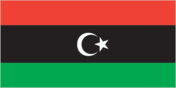
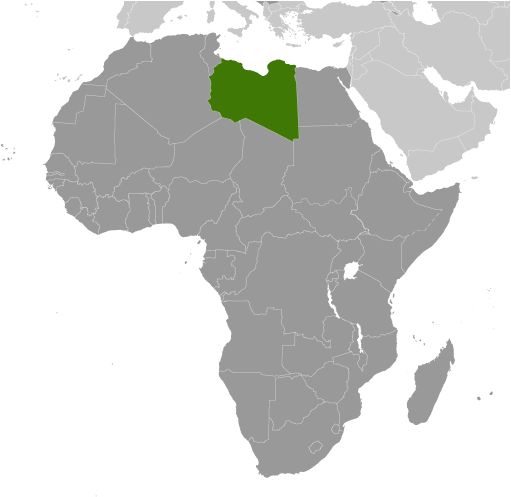
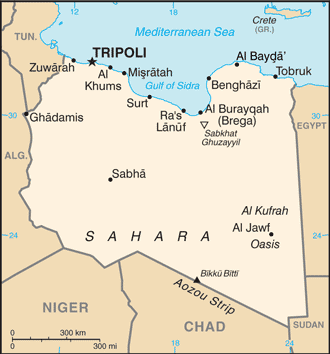

# Libya

## Introduction

**_Background:_**   
The Italians supplanted the Ottoman Turks in the area around Tripoli in 1911 and did not relinquish their hold until 1943 when defeated in World War II. Libya then passed to UN administration and achieved independence in 1951. Following a 1969 military coup, Col. Muammar al-QADHAFI assumed leadership and began to espouse his political system at home, which was a combination of socialism and Islam. During the 1970s, QADHAFI used oil revenues to promote his ideology outside Libya, supporting subversive and terrorist activities that included the downing of two airliners - one over Scotland, another in Northern Africa - and a discotheque bombing in Berlin. UN sanctions in 1992 isolated QADHAFI politically and economically following the attacks; sanctions were lifted in 2003 following Libyan acceptance of responsibility for the bombings and agreement to claimant compensation. QADHAFI also agreed to end Libya's program to develop weapons of mass destruction, and he made significant strides in normalizing relations with Western nations. Unrest that began in several Middle Eastern and North African countries in late 2010 erupted in Libyan cities in early 2011. QADHAFI's brutal crackdown on protesters spawned a civil war that triggered UN authorization of air and naval intervention by the international community. After months of seesaw fighting between government and opposition forces, the QADHAFI regime was toppled in mid-2011 and replaced by a transitional government. Libya in 2012 formed a new parliament and elected a new prime minister.

## Geography

**_Location:_**   
Northern Africa, bordering the Mediterranean Sea, between Egypt, Tunisia, and Algeria

**_Geographic coordinates:_**   
25 00 N, 17 00 E

**_Map references:_**   
Africa

**_Area:_**   
**total:** 1,759,540 sq km   
**land:** 1,759,540 sq km   
**water:** 0 sq km

**_Area - comparative:_**   
about 2.5 times the size of Texas; slightly larger than Alaska

**_Land boundaries:_**   
**total:** 4,348 km   
**border countries:** Algeria 982 km, Chad 1,055 km, Egypt 1,115 km, Niger 354 km, Sudan 383 km, Tunisia 459 km

**_Coastline:_**   
1,770 km

**_Maritime claims:_**   
**territorial sea:** 12 nm   
**note:** Gulf of Sidra closing line - 32 degrees, 30 minutes north   
**exclusive fishing zone:** 62 nm

**_Climate:_**   
Mediterranean along coast; dry, extreme desert interior

**_Terrain:_**   
mostly barren, flat to undulating plains, plateaus, depressions

**_Elevation extremes:_**   
**lowest point:** Sabkhat Ghuzayyil -47 m   
**highest point:** Bikku Bitti 2,267 m

**_Natural resources:_**   
petroleum, natural gas, gypsum

**_Land use:_**   
**arable land:** 0.99%   
**permanent crops:** 0.19%   
**other:** 98.82% (2011)

**_Irrigated land:_**   
4,700 sq km (2003)

**_Total renewable water resources:_**   
0.7 cu km (2011)

**_Freshwater withdrawal (domestic/industrial/agricultural):_**   
**total:** 4.33 cu km/yr (14%/3%/83%)   
**per capita:** 796.1 cu m/yr (2000)

**_Natural hazards:_**   
hot, dry, dust-laden ghibli is a southern wind lasting one to four days in spring and fall; dust storms, sandstorms

**_Environment - current issues:_**   
desertification; limited natural freshwater resources; the Great Manmade River Project, the largest water development scheme in the world, brings water from large aquifers under the Sahara to coastal cities

**_Environment - international agreements:_**   
**party to:** Biodiversity, Climate Change, Climate Change-Kyoto Protocol, Desertification, Endangered Species, Hazardous Wastes, Marine Dumping, Ozone Layer Protection, Ship Pollution, Wetlands   
**signed, but not ratified:** Law of the Sea

**_Geography - note:_**   
more than 90% of the country is desert or semidesert

## People and Society

**_Nationality:_**   
**noun:** Libyan(s)   
**adjective:** Libyan

**_Ethnic groups:_**   
Berber and Arab 97%, other 3% (includes Greeks, Maltese, Italians, Egyptians, Pakistanis, Turks, Indians, and Tunisians)

**_Languages:_**   
Arabic (official), Italian, English (all widely understood in the major cities); Berber (Nafusi, Ghadamis, Suknah, Awjilah, Tamasheq)

**_Religions:_**   
Muslim (official; virtually all Sunni) 96.6%, Christian 2.7%, Buddhist 0.3%, Hindu note: non-Sunni Muslims include native Ibadhi Muslims (   
**note:** non-Sunni Muslims include native Ibadhi Muslims (

**_Population:_**   
6,244,174   
**note:** immigrants make up just over 12% of the total population, according to UN data (2013) (July 2014 est.)

**_Age structure:_**   
**0-14 years:** 26.9% (male 859,016/female 820,643)   
**15-24 years:** 18.2% (male 586,749/female 546,602)   
**25-54 years:** 46.1% (male 1,509,108/female 1,370,709)   
**55-64 years:** 4.8% (male 154,847/female 145,330)   
**65 years and over:** 3.9% (male 126,691/female 124,479) (2014 est.)

**_Dependency ratios:_**   
**total dependency ratio:** 52.2 %   
**youth dependency ratio:** 44.8 %   
**elderly dependency ratio:** 7.4 %   
**potential support ratio:** 13.5 (2014 est.)

**_Median age:_**   
**total:** 27.5 years   
**male:** 27.7 years   
**female:** 27.4 years (2014 est.)

**_Population growth rate:_**   
3.08% (2014 est.)

**_Birth rate:_**   
18.4 births/1,000 population (2014 est.)

**_Death rate:_**   
3.57 deaths/1,000 population (2014 est.)

**_Net migration rate:_**   
16.01 migrant(s)/1,000 population (2014 est.)

**_Urbanization:_**   
**urban population:** 77.7% of total population (2011)   
**rate of urbanization:** 1% annual rate of change (2010-15 est.)

**_Major urban areas - population:_**   
TRIPOLI (capital) 1.127 million (2011)

**_Sex ratio:_**   
**at birth:** 1.05 male(s)/female   
**0-14 years:** 1.05 male(s)/female   
**15-24 years:** 1.07 male(s)/female   
**25-54 years:** 1.1 male(s)/female   
**55-64 years:** 1.08 male(s)/female   
**65 years and over:** 1.04 male(s)/female   
**total population:** 1.08 male(s)/female (2014 est.)

**_Maternal mortality rate:_**   
58 deaths/100,000 live births (2010)

**_Infant mortality rate:_**   
**total:** 11.87 deaths/1,000 live births   
**male:** 12.83 deaths/1,000 live births   
**female:** 10.85 deaths/1,000 live births (2014 est.)

**_Life expectancy at birth:_**   
**total population:** 76.04 years   
**male:** 74.36 years   
**female:** 77.82 years (2014 est.)

**_Total fertility rate:_**   
2.07 children born/woman (2014 est.)

**_Health expenditures:_**   
4.4% of GDP (2011)

**_Physicians density:_**   
1.9 physicians/1,000 population (2009)

**_Hospital bed density:_**   
3.7 beds/1,000 population (2009)

**_Drinking water source:_**   
**improved:** urban: 54.2% of population; rural: 54.9% of population; total: 54.4% of population   
**unimproved:** urban: 45.8% of population; rural: 45.1% of population; total: 45.6% of population (2001 est.)

**_Sanitation facility access:_**   
**improved:** urban: 96.8% of population; rural: 95.7% of population; total: 96.6% of population   
**unimproved:** urban: 3.2% of population; rural: 4.3% of population; total: 3.4% of population (2012 est.)

**_HIV/AIDS - adult prevalence rate:_**   
0.3% (2001 est.)

**_HIV/AIDS - people living with HIV/AIDS:_**   
10,000 (2001 est.)

**_HIV/AIDS - deaths:_**   
NA

**_Obesity - adult prevalence rate:_**   
27.8% (2008)

**_Children under the age of 5 years underweight:_**   
5.6% (2007)

**_Education expenditures:_**   
NA

**_Literacy:_**   
**definition:** age 15 and over can read and write   
**total population:** 89.5%   
**male:** 95.8%   
**female:** 83.3% (2011 est.)

**_School life expectancy (primary to tertiary education):_**   
**total:** 16 years   
**male:** 16 years   
**female:** 16 years (2003)

## Government

**_Country name:_**   
**conventional long form:** none   
**conventional short form:** Libya   
**local long form:** none   
**local short form:** Libiya

**_Government type:_**   
operates under a transitional government

**_Capital:_**   
**name:** Tripoli (Tarabulus)   
**geographic coordinates:** 32 53 N, 13 10 E   
**time difference:** UTC+1 (6 hours ahead of Washington, DC, during Standard Time)   
**daylight saving time:** +1hr, begins last Friday in March; ends last Friday in October   
**note:** on 10 November 2012, Libya changed its standard time from UTC+2 to UTC+1

**_Administrative divisions:_**   
22 districts (shabiyat, singular - shabiyat); Al Butnan, Al Jabal al Akhdar, Al Jabal al Gharbi, Al Jafarah, Al Jufrah, Al Kufrah, Al Marj, Al Marqab, Al Wahat, An Nuqat al Khams, Az Zawiyah, Banghazi, Darnah, Ghat, Misratah, Murzuq, Nalut, Sabha, Surt, Tarabulus, Wadi al Hayat, Wadi ash Shati

**_Independence:_**   
24 December 1951 (from UN trusteeship)

**_National holiday:_**   
Liberation Day, 23 October (2011)

**_Constitution:_**   
previous 1951, 1977; latest 2011 (interim); note - in mid-July 2013, Libya's legislative body agreed on steps for drafting a new constitution (2013)

**_Legal system:_**   
Libya's post-revolution legal system is in flux and driven by state and non-state entities

**_International law organization participation:_**   
has not submitted an ICJ jurisdiction declaration; non-party state to the ICCt

**_Suffrage:_**   
18 years of age, universal

**_Executive branch:_**   
**chief of state:** President, General National Congress, Nuri Abu SAHMAYN   
**head of government:** Abdullah al-THANI remains Prime Minister after the 4 May 2014 election is declared unconstitutional; Deputy Prime Ministers Awad Ibrik Ibrahim al-BARASI, Sadiq Abd al-Karim Abd al-Rahman KARIM, Abd-al-Salam Muhammad al-Mahdi al-QADI   
**cabinet:** new cabinet approved by the General National Congress on 31 October 2012   
**elections:** prime minister and General National Congress president elected by the National Congress   
**election results:** NA

**_Legislative branch:_**   
unicameral General National Congress (200 seats; 120 individual seats elected from 69 constituencies and 80 party list seats elected from 20 constituencies; member term NA)   
**elections:** first General National Congress election held on 7 July 2012 (next to be held NA)   
**election results:** percent of vote for party list seats only - NFA 48.7%, JCP 21.3%, other parties 30%; list and constituent seats - NFA 39, JCP 17, other 24, independents 120

**_Judicial branch:_**   
**highest court(s):** NA; note - government in transition

**_Political parties and leaders:_**   
Al-Watan (Homeland) Party   
Justice and Construction Party or JCP [Muhammad SAWAN]   
National Front (initially the National Front for the Salvation of Libya, formed in 1981 as a diaspora opposition group)   
National Forces Alliance or NFA [Mahmoud JIBRIL, founder] (includes many political organizations, NGOs, and independents)   
Union for the Homeland [Abd al-Rahman al-SUWAYHILI]   
**note:** list includes some of the larger political parties and leaders

**_Political pressure groups and leaders:_**   
NA

**_International organization participation:_**   
ABEDA, AfDB, AFESD, AMF, AMU, AU, BDEAC, CAEU, COMESA, FAO, G-77, IAEA, IBRD, ICAO, ICC (NGOs), ICRM, IDA, IDB, IFAD, IFC, IFRCS, ILO, IMF, IMO, IMSO, Interpol, IOC, IOM, IPU, ISO, ITSO, ITU, LAS, MIGA, NAM, OAPEC, OIC, OPCW, OPEC, PCA, UN, UNCTAD, UNESCO, UNIDO, UNWTO, UPU, WCO, WFTU (NGOs), WHO, WIPO, WMO, WTO (observer)

**_Diplomatic representation in the US:_**   
**chief of mission:** Ambassador (vacant); Charge d'Affaires Suleiman ABULHI   
**chancery:** 2600 Virginia Avenue NW, Suite 705, Washington, DC 20037   
**telephone:** [1] (202) 944-9601   
**FAX:** [1] (202) 944-9606

**_Diplomatic representation from the US:_**   
**chief of mission:** Ambassador Deborah K. JONES (since 11 June 2013)   
**note:** on 11 September 2012, US Ambassador Christopher STEVENS and three other American diplomats were killed in an attack by heavily armed militants on a US diplomatic post in the eastern city of Benghazi   
**embassy:** Sidi Slim Area/Walie Al-Ahed Road, Tripoli   
**mailing address:** US Embassy, 8850 Tripoli Place, Washington, DC 20521-8850   
**telephone:** [218] (0) 91-220-3239

**_Flag description:_**   
three horizontal bands of red (top), black (double width), and green with a white crescent and star centered on the black stripe; the National Transitional Council reintroduced this flag design of the former Kingdom of Libya (1951-1969) on 27 February 2011; it replaced the former all-green banner promulgated by the QADHAFI regime in 1977; the colors represent the three major regions of the country: red stands for Fezzan, black symbolizes Cyrenaica, and green denotes Tripolitania; the crescent and star represent Islam, the main religion of the country

**_National symbol(s):_**   
star and crescent; hawk

**_National anthem:_**   
**name:** "Allahu Akbar" (God Is Greatest)   
**lyrics/music:** Mahmoud el-SHERIF/Abdalla Shams el-DIN   
**note:** adopted 1969; the anthem was originally a battle song for the Egyptian Army in the 1956 Suez War

## Economy

**_Economy - overview:_**   
Libya's economy is structured primarily around the nation's energy sector, which generates about 95% of export earnings, 80% of GDP, and 99% of government income. Substantial revenue from the energy sector coupled with a small population give Libya one of the highest per capita GDPs in Africa, but Tripoli largely has not used its significant financial resources to develop national infrastructure or the economy, leaving many citizens poor. In the final five years of QADHAFI's rule, Libya made some progress on economic reform as part of a broader campaign to reintegrate the country into the international fold. This effort picked up steam after UN sanctions were lifted in September 2003 and after Libya announced in December 2003 that it would abandon programs to build weapons of mass destruction. The process of lifting US unilateral sanctions began in the spring of 2004; all sanctions were removed by June 2006, helping Libya attract greater foreign direct investment, especially in the energy and banking sectors. Libyan oil and gas licensing rounds drew high international interest, but new rounds are unlikely to be successful until Libya establishes a more permanent government and is able to offer more attractive financial terms on contracts and increase security. Libya faces a long road ahead in liberalizing its primarily socialist economy, but the revolution has unleashed previously restrained entrepreneurial activity and increased the potential for the evolution of a more market-based economy. The service and construction sectors expanded over the past five years and could become a larger share of GDP if Tripoli prioritizes capital spending on development projects once political and security uncertainty subside. Climatic conditions and poor soils severely limit agricultural output, and Libya imports about 80% of its food. Libya's primary agricultural water source is the Great Manmade River Project.

**_GDP (purchasing power parity):_**   
$73.6 billion (2013 est.)   
$77.57 billion (2012 est.)   
$37.94 billion (2011 est.)   
**note:** data are in 2013 US dollars

**_GDP (official exchange rate):_**   
$70.92 billion (2013 est.)

**_GDP - real growth rate:_**   
-5.1% (2013 est.)   
104.5% (2012 est.)   
-62.1% (2011 est.)

**_GDP - per capita (PPP):_**   
$11,300 (2013 est.)   
$12,100 (2012 est.)   
$6,000 (2011 est.)   
**note:** data are in 2013 US dollars

**_Gross national saving:_**   
14% of GDP (2013 est.)   
44.4% of GDP (2012 est.)   
-3.5% of GDP (2011 est.)

**_GDP - composition, by end use:_**   
**household consumption:** 58%   
**government consumption:** 20.2%   
**investment in fixed capital:** 8.6%   
**investment in inventories:** 0.5%   
**exports of goods and services:** 54.5%   
**imports of goods and services:** -41.9%; (2013 est.)

**_GDP - composition, by sector of origin:_**   
**agriculture:** 2%   
**industry:** 58.3%   
**services:** 39.7% (2013 est.)

**_Agriculture - products:_**   
wheat, barley, olives, dates, citrus, vegetables, peanuts, soybeans; cattle

**_Industries:_**   
petroleum, petrochemicals, aluminum, iron and steel, food processing, textiles, handicrafts, cement

**_Industrial production growth rate:_**   
9.6% (2013 est.)

**_Labor force:_**   
1.644 million (2013 est.)

**_Labor force - by occupation:_**   
**agriculture:** 17%   
**industry:** 23%   
**services:** 59% (2004 est.)

**_Unemployment rate:_**   
30% (2004 est.)

**_Population below poverty line:_**   
NA%   
**note:** about one-third of Libyans live at or below the national poverty line

**_Household income or consumption by percentage share:_**   
**lowest 10%:** NA%   
**highest 10%:** NA%

**_Budget:_**   
**revenues:** $41.54 billion   
**expenditures:** $41.87 billion (2013 est.)

**_Taxes and other revenues:_**   
58.6% of GDP (2013 est.)

**_Budget surplus (+) or deficit (-):_**   
-0.5% of GDP (2013 est.)

**_Public debt:_**   
4.8% of GDP (2013 est.)   
4.1% of GDP (2012 est.)

**_Fiscal year:_**   
calendar year

**_Inflation rate (consumer prices):_**   
3.2% (2013 est.)   
6.1% (2012 est.)

**_Central bank discount rate:_**   
9.52% (31 December 2010 est.)   
3% (31 December 2009 est.)

**_Commercial bank prime lending rate:_**   
6% (31 December 2013 est.)   
6% (31 December 2012 est.)

**_Stock of narrow money:_**   
$47.25 billion (31 December 2013 est.)   
$45.2 billion (31 December 2012 est.)

**_Stock of broad money:_**   
$51.86 billion (31 December 2013 est.)   
$49.28 billion (31 December 2012 est.)

**_Stock of domestic credit:_**   
$-54.04 billion (31 December 2013 est.)   
$-47.25 billion (31 December 2012 est.)

**_Market value of publicly traded shares:_**   
$NA

**_Current account balance:_**   
$2.727 billion (2013 est.)   
$27.17 billion (2012 est.)

**_Exports:_**   
$38.45 billion (2013 est.)   
$52.02 billion (2012 est.)

**_Exports - commodities:_**   
crude oil, refined petroleum products, natural gas, chemicals

**_Exports - partners:_**   
Italy 23.3%, Germany 12.4%, China 11.2%, France 9.7%, Spain 7.6%, UK 4.7%, US 4.5% (2012)

**_Imports:_**   
$27.15 billion (2013 est.)   
$18.1 billion (2012 est.)

**_Imports - commodities:_**   
machinery, semi-finished goods, food, transport equipment, consumer products

**_Imports - partners:_**   
China 13%, Turkey 11.6%, Italy 8.2%, Egypt 7.7%, Tunisia 6.6%, South Korea 5.8%, Greece 5.4%, Germany 4.6% (2012)

**_Reserves of foreign exchange and gold:_**   
$120.9 billion (31 December 2013 est.)   
$118.6 billion (31 December 2012 est.)

**_Debt - external:_**   
$6.319 billion (31 December 2013 est.)   
$5.278 billion (31 December 2012 est.)

**_Stock of direct foreign investment - at home:_**   
$17.92 billion (31 December 2013 est.)   
$16.84 billion (31 December 2012 est.)

**_Stock of direct foreign investment - abroad:_**   
$17.82 billion (31 December 2013 est.)   
$17.21 billion (31 December 2012 est.)

**_Exchange rates:_**   
Libyan dinars (LYD) per US dollar -   
1.277 (2013 est.)   
1.2617 (2012 est.)   
1.2668 (2010 est.)   
1.2535 (2009)   
1.2112 (2008)

## Energy

**_Electricity - production:_**   
29.72 billion kWh (2010 est.)

**_Electricity - consumption:_**   
25.24 billion kWh (2010 est.)

**_Electricity - exports:_**   
129 million kWh (2010 est.)

**_Electricity - imports:_**   
76 million kWh (2010 est.)

**_Electricity - installed generating capacity:_**   
6.766 million kW (2010 est.)

**_Electricity - from fossil fuels:_**   
100% of total installed capacity (2010 est.)

**_Electricity - from nuclear fuels:_**   
0% of total installed capacity (2010 est.)

**_Electricity - from hydroelectric plants:_**   
0% of total installed capacity (2010 est.)

**_Electricity - from other renewable sources:_**   
0% of total installed capacity (2010 est.)

**_Crude oil - production:_**   
1.483 million bbl/day (2012 est.)

**_Crude oil - exports:_**   
1.378 million bbl/day (2010 est.)

**_Crude oil - imports:_**   
0 bbl/day (2010 est.)

**_Crude oil - proved reserves:_**   
48.01 billion bbl (1 January 2013 est.)

**_Refined petroleum products - production:_**   
388,300 bbl/day (2010 est.)

**_Refined petroleum products - consumption:_**   
314,000 bbl/day (2011 est.)

**_Refined petroleum products - exports:_**   
119,000 bbl/day (2010 est.)

**_Refined petroleum products - imports:_**   
575 bbl/day (2010 est.)

**_Natural gas - production:_**   
7.855 billion cu m (2011 est.)

**_Natural gas - consumption:_**   
6.844 billion cu m (2010 est.)

**_Natural gas - exports:_**   
3.666 billion cu m (2011 est.)

**_Natural gas - imports:_**   
0 cu m (2011 est.)

**_Natural gas - proved reserves:_**   
1.547 trillion cu m (1 January 2013 est.)

**_Carbon dioxide emissions from consumption of energy:_**   
49.67 million Mt (2011 est.)

## Communications

**_Telephones - main lines in use:_**   
814,000 (2012)

**_Telephones - mobile cellular:_**   
9.59 million (2012)

**_Telephone system:_**   
**general assessment:** telecommunications system is state-owned and service is poor, but investment is being made to upgrade; state retains monopoly in fixed-line services; mobile-cellular telephone system became operational in 1996   
**domestic:** multiple providers for a mobile telephone system that is growing rapidly; combined fixed-line and mobile-cellular teledensity has soared   
**international:** country code - 218; satellite earth stations - 4 Intelsat, NA Arabsat, and NA Intersputnik; submarine cable to France and Italy; microwave radio relay to Tunisia and Egypt; tropospheric scatter to Greece; participant in Medarabtel (2010)

**_Broadcast media:_**   
state-funded and private TV stations; some provinces operate local TV stations; pan-Arab satellite TV stations are available; state-funded radio (2012)

**_Internet country code:_**   
.ly

**_Internet hosts:_**   
17,926 (2012)

**_Internet users:_**   
353,900 (2009)

## Transportation

**_Airports:_**   
146 (2013)

**_Airports - with paved runways:_**   
**total:** 68   
**over 3,047 m:** 23   
**2,438 to 3,047 m:** 7   
**1,524 to 2,437 m:** 30   
**914 to 1,523 m:** 7   
**under 914 m:** 1 (2013)

**_Airports - with unpaved runways:_**   
**total:** 78   
**over 3,047 m:** 2   
**2,438 to 3,047 m:** 5   
**1,524 to 2,437 m:** 14   
**914 to 1,523 m:** 37   
**under 914 m:** 20 (2013)

**_Heliports:_**   
2 (2013)

**_Pipelines:_**   
condensate 882 km; gas 3,743 km; oil 7,005 km (2013)

**_Roadways:_**   
**total:** 100,024 km   
**paved:** 57,214 km   
**unpaved:** 42,810 km (2003)

**_Merchant marine:_**   
**total:** 23   
**by type:** cargo 2, chemical tanker 4, liquefied gas 3, petroleum tanker 13, roll on/roll off 1   
**foreign-owned:** 2 (Kuwait 1, Norway 1)   
**registered in other countries:** 6 (Hong Kong 1, Malta 5) (2010)

**_Ports and terminals:_**   
**major seaport(s):** Marsa al Burayqah (Marsa el Brega), Tripoli   
**oil terminal(s):** Az Zawiyah, Ra's Lanuf

## Military

**_Military branches:_**   
note - in transition; government attempting to staff a new national army with anti-QADAFI militia fighters and former members of QADAFI's military (2008)

**_Military service age and obligation:_**   
18 years of age for mandatory or voluntary service (2012)

**_Manpower available for military service:_**   
**males age 16-49:** 1,775,078   
**females age 16-49:** 1,714,194 (2010 est.)

**_Manpower fit for military service:_**   
**males age 16-49:** 1,511,144   
**females age 16-49:** 1,458,934 (2010 est.)

**_Manpower reaching militarily significant age annually:_**   
**male:** 59,547   
**female:** 57,070 (2010 est.)

## Transnational Issues

**_Disputes - international:_**   
dormant disputes include Libyan claims of about 32,000 sq km still reflected on its maps of southeastern Algeria and the FLN's assertions of a claim to Chirac Pastures in southeastern Morocco; various Chadian rebels from the Aozou region reside in southern Libya

**_Refugees and internally displaced persons:_**   
**refugees (country of origin):** 16,796 (Syria) (2013)   
**IDPs:** at least 80,400 (59,400 still displaced at the end of 2013 from the conflict between pro-Qadhafi and anti-Qadhafi forces in 2011; 21,000 displaced by clashes in and around Sebha in 2014) (2014)

**_Trafficking in persons:_**   
**current situation:** Libya is a destination and transit country for men and women from sub-Saharan Africa and Asia subjected to forced labor and forced prostitution; migrants who seek employment in Libya as laborers and domestic workers or transit Libya en route to Europe may be subject to forced labor; private employers also recruit migrants from detention centers as forced laborers on farms and construction sites; some sub-Saharan women are reportedly forced to work in Libyan brothels

............................................................   
_Page last updated on June 20, 2014_
