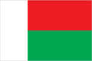
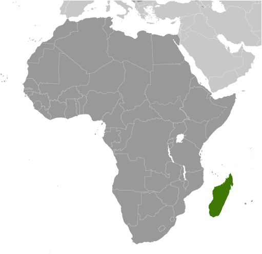
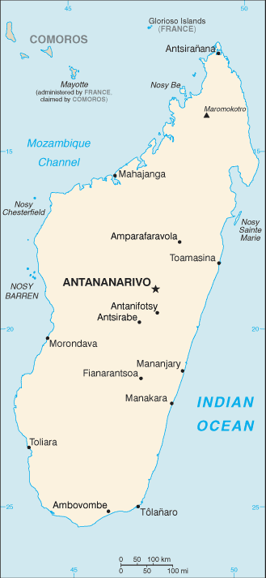

# Madagascar

## Introduction

**_Background:_**   
Formerly an independent kingdom, Madagascar became a French colony in 1896 but regained independence in 1960. During 1992-93, free presidential and National Assembly elections were held ending 17 years of single-party rule. In 1997, in the second presidential race, Didier RATSIRAKA, the leader during the 1970s and 1980s, was returned to the presidency. The 2001 presidential election was contested between the followers of Didier RATSIRAKA and Marc RAVALOMANANA, nearly causing secession of half of the country. In April 2002, the High Constitutional Court announced RAVALOMANANA the winner. RAVALOMANANA achieved a second term following a landslide victory in the generally free and fair presidential elections of 2006. In early 2009, protests over increasing restrictions on opposition press and activities resulted in RAVALOMANANA handing over power to the military, which then conferred the presidency on the mayor of Antananarivo, Andry RAJOELINA, in what amounted to a coup d'etat. Following a lengthy mediation process led by the Southern African Development Community (SADC), Madagascar held UN-supported presidential and parliamentary elections in 2013. Former de facto finance minister Hery RAJAONARIMAMPIANINA defeated RAVALOMANANA's favored candidate Jean-Louis ROBINSON in a presidential runoff and was inaugurated in January 2014. Most international observers, while noting some irregularities, declared polls to be a credible reflection of the Malagasy public's will.

## Geography

**_Location:_**   
Southern Africa, island in the Indian Ocean, east of Mozambique

**_Geographic coordinates:_**   
20 00 S, 47 00 E

**_Map references:_**   
Africa

**_Area:_**   
**total:** 587,041 sq km   
**land:** 581,540 sq km   
**water:** 5,501 sq km

**_Area - comparative:_**   
slightly less than twice the size of Arizona

**_Land boundaries:_**   
0 km

**_Coastline:_**   
4,828 km

**_Maritime claims:_**   
**territorial sea:** 12 nm   
**contiguous zone:** 24 nm   
**exclusive economic zone:** 200 nm   
**continental shelf:** 200 nm or 100 nm from the 2,500-m isobath

**_Climate:_**   
tropical along coast, temperate inland, arid in south

**_Terrain:_**   
narrow coastal plain, high plateau and mountains in center

**_Elevation extremes:_**   
**lowest point:** Indian Ocean 0 m   
**highest point:** Maromokotro 2,876 m

**_Natural resources:_**   
graphite, chromite, coal, bauxite, rare earth elements, salt, quartz, tar sands, semiprecious stones, mica, fish, hydropower

**_Land use:_**   
**arable land:** 5.96%   
**permanent crops:** 1.02%   
**other:** 93.02% (2011)

**_Irrigated land:_**   
10,860 sq km (2003)

**_Total renewable water resources:_**   
337 cu km (2011)

**_Freshwater withdrawal (domestic/industrial/agricultural):_**   
**total:** 16.5 cu km/yr (2%/1%/97%)   
**per capita:** 1,010 cu m/yr (2005)

**_Natural hazards:_**   
periodic cyclones; drought; and locust infestation   
**volcanism:** Madagascar's volcanoes have not erupted in historical times

**_Environment - current issues:_**   
soil erosion results from deforestation and overgrazing; desertification; surface water contaminated with raw sewage and other organic wastes; several endangered species of flora and fauna unique to the island

**_Environment - international agreements:_**   
**party to:** Biodiversity, Climate Change, Climate Change-Kyoto Protocol, Desertification, Endangered Species, Hazardous Wastes, Law of the Sea, Marine Life Conservation, Ozone Layer Protection, Ship Pollution, Wetlands   
**signed, but not ratified:** none of the selected agreements

**_Geography - note:_**   
world's fourth-largest island; strategic location along Mozambique Channel

## People and Society

**_Nationality:_**   
**noun:** Malagasy (singular and plural)   
**adjective:** Malagasy

**_Ethnic groups:_**   
Malayo-Indonesian (Merina and related Betsileo), Cotiers (mixed African, Malayo-Indonesian, and Arab ancestry - Betsimisaraka, Tsimihety, Antaisaka, Sakalava), French, Indian, Creole, Comoran

**_Languages:_**   
French (official), Malagasy (official), English

**_Religions:_**   
indigenous beliefs 52%, Christian 41%, Muslim 7%

**_Population:_**   
23,201,926 (July 2014 est.)

**_Age structure:_**   
**0-14 years:** 40.7% (male 4,765,523/female 4,685,298)   
**15-24 years:** 20.6% (male 2,394,146/female 2,384,564)   
**25-54 years:** 31.3% (male 3,635,506/female 3,629,204)   
**55-64 years:** 4.2% (male 466,263/female 503,375)   
**65 years and over:** 3.1% (male 334,533/female 403,514) (2014 est.)

**_Dependency ratios:_**   
**total dependency ratio:** 81.4 %   
**youth dependency ratio:** 76.3 %   
**elderly dependency ratio:** 5.1 %   
**potential support ratio:** 19.6 (2014 est.)

**_Median age:_**   
**total:** 19.2 years   
**male:** 19 years   
**female:** 19.4 years (2014 est.)

**_Population growth rate:_**   
2.62% (2014 est.)

**_Birth rate:_**   
33.12 births/1,000 population (2014 est.)

**_Death rate:_**   
6.95 deaths/1,000 population (2014 est.)

**_Net migration rate:_**   
0 migrant(s)/1,000 population (2014 est.)

**_Urbanization:_**   
**urban population:** 32.6% of total population (2011)   
**rate of urbanization:** 4.73% annual rate of change (2010-15 est.)

**_Major urban areas - population:_**   
ANTANANARIVO (capital) 1.987 million (2011)

**_Sex ratio:_**   
**at birth:** 1.03 male(s)/female   
**0-14 years:** 1.02 male(s)/female   
**15-24 years:** 1 male(s)/female   
**25-54 years:** 1 male(s)/female   
**55-64 years:** 1 male(s)/female   
**65 years and over:** 0.83 male(s)/female   
**total population:** 1 male(s)/female (2014 est.)

**_Mother's mean age at first birth:_**   
19.5   
**note:** median age at first birth among women 25-29 (2008-09 est.)

**_Maternal mortality rate:_**   
240 deaths/100,000 live births (2010)

**_Infant mortality rate:_**   
**total:** 44.88 deaths/1,000 live births   
**male:** 48.86 deaths/1,000 live births   
**female:** 40.78 deaths/1,000 live births (2014 est.)

**_Life expectancy at birth:_**   
**total population:** 65.2 years   
**male:** 63.77 years   
**female:** 66.67 years (2014 est.)

**_Total fertility rate:_**   
4.28 children born/woman (2014 est.)

**_Contraceptive prevalence rate:_**   
39.9% (2008/09)

**_Health expenditures:_**   
4.1% of GDP (2011)

**_Physicians density:_**   
0.16 physicians/1,000 population (2007)

**_Hospital bed density:_**   
0.2 beds/1,000 population (2010)

**_Drinking water source:_**   
**improved:** urban: 78.2% of population; rural: 35.4% of population; total: 49.6% of population   
**unimproved:** urban: 21.8% of population; rural: 64.6% of population; total: 50.4% of population (2012 est.)

**_Sanitation facility access:_**   
**improved:** urban: 19.2% of population; rural: 11.3% of population; total: 13.9% of population   
**unimproved:** urban: 80.8% of population; rural: 88.7% of population; total: 86.1% of population (2012 est.)

**_HIV/AIDS - adult prevalence rate:_**   
0.5% (2012 est.)

**_HIV/AIDS - people living with HIV/AIDS:_**   
58,800 (2012 est.)

**_HIV/AIDS - deaths:_**   
6,200 (2012 est.)

**_Major infectious diseases:_**   
**degree of risk:** very high   
**food or waterborne diseases:** bacterial diarrhea, hepatitis A, and typhoid fever   
**vectorborne diseases:** malaria and dengue fever   
**water contact disease:** schistosomiasis   
**animal contact disease:** rabies (2013)

**_Obesity - adult prevalence rate:_**   
1.6% (2008)

**_Children under the age of 5 years underweight:_**   
36.8% (2004)

**_Education expenditures:_**   
2.7% of GDP (2012)

**_Literacy:_**   
**definition:** age 15 and over can read and write   
**total population:** 64.5%   
**male:** 67.4%   
**female:** 61.6% (2009 est.)

**_School life expectancy (primary to tertiary education):_**   
**total:** 10 years   
**male:** 11 years   
**female:** 10 years (2012)

**_Child labor - children ages 5-14:_**   
**total number:** 1,827,423   
**percentage:** 28 %   
**note:** data represents children ages 5-17 (2007 est.)

**_Unemployment, youth ages 15-24:_**   
**total:** 2.3%   
**male:** 1.7%   
**female:** 2.8% (2005)

## Government

**_Country name:_**   
**conventional long form:** Republic of Madagascar   
**conventional short form:** Madagascar   
**local long form:** Republique de Madagascar/Repoblikan'i Madagasikara   
**local short form:** Madagascar/Madagasikara   
**former:** Malagasy Republic

**_Government type:_**   
republic

**_Capital:_**   
**name:** Antananarivo   
**geographic coordinates:** 18 55 S, 47 31 E   
**time difference:** UTC+3 (8 hours ahead of Washington, DC, during Standard Time)

**_Administrative divisions:_**   
Hi Trent,6 provinces (faritany); Antananarivo, Antsiranana, Fianarantsoa, Mahajanga, Toamasina, Toliara

**_Independence:_**   
26 June 1960 (from France)

**_National holiday:_**   
Independence Day, 26 June (1960)

**_Constitution:_**   
previous 1992; latest passed by referendum 17 November 2010, promulgated 11 December 2010 (2012)

**_Legal system:_**   
civil law system based on the old French civil code and customary law in matters of marriage, family, and obligation

**_International law organization participation:_**   
accepts compulsory ICJ jurisdiction with reservations; accepts ICCt jurisdiction

**_Suffrage:_**   
18 years of age; universal

**_Executive branch:_**   
**chief of state:** President Hery Martial RAJAONARIMAMPIANINA Rakotoarimana (since 25 January 2014)   
**head of government:** Prime Minister Roger Laurent Christophe KOLO, M.D. (since 11 April 2014)   
**cabinet:** Council of Ministers appointed by the prime minister   
**elections:** president elected by popular vote for a five-year term (eligible for a second term); election last held on 20 December 2013 (next to be held in 2018); prime minister nominated by the National Assembly and appointed by the president   
**election results:** Hery RAJAONARIMAMPIANINA elected president in second round; percent of vote - Hery RAJAONARIMAMPIANINA 53.5%, Jean Louis ROBINSON 46.5%   
**note:** on 17 March 2009, democratically elected President Marc RAVALOMANANA stepped down handing the government over to the military, which in turn conferred the presidency on opposition leader and Antananarivo mayor Andry RAJOELINA; a power-sharing agreement established a 15-month transition period to conclude with a general election in 2010, which failed to occur; a subsequent agreement aimed for an early 2013 election - the first round was held on 25 October 2013 and the second on 20 December 2013

**_Legislative branch:_**   
bicameral legislature consists of a Senate or Senat (33 seats; 22 elected from each of the 22 regions; the remaining 11 appointed by the president; members to serve six-year terms) and a National Assembly or Assemblee Nationale (151 seats in the December 2013 election; reduced from 160 seats to 127 seats by an April 2007 national referendum - never used; members elected by popular vote to serve four-year terms)   
**elections:** National Assembly - last held on 20 December 2013 (next to be held in 2017); note - a power-sharing agreement in the summer of 2009 established a 15-month transition, concluding in general elections scheduled for late 2013 after repeated delays   
**election results:** National Assembly - percent of vote by party - Party of Andry Rajoelina 17.3%, Ravalomannana Movement 10.8%, Vondrona Politika 8.2%, independents and others 63.7%; seats by party - Party of Andry Rajoelina 49, the Ravalomannana Movement 20, Malagasy Miara Mianinga 13, independents 25, seats with delayed elections 4, other 40

**_Judicial branch:_**   
**highest court(s):** Supreme Court or Cour Supreme (consists of 11 members; addresses judicial administration issues only); High Constitutional Court or Haute Cour Constitutionnelle (consists of 9 members); note - the judiciary includes a High Court of Justice responsible for adjudicating crimes and misdemeanors by government officials including the president   
**judge selection and term of office:** Supreme Court heads elected by the president and judiciary officials to serve single-renewable, 3-year terms; High Constitutional Court members appointed - 3 each by the president, by both legislative bodies, and by the Council of Magistrates; members serve single, 6-year terms   
**subordinate courts:** Courts of Appeal; provincial and city tribunals

**_Political parties and leaders:_**   
AVANA Party [Jean-Louis ROBINSON]   
Economic Liberalism and Democratic Action for National Recovery or LEADER/Fanilo [Manasse ESOAVELOMANDROSO]   
Green Party or Parti Vert [Sarah Georget RABEHARISOA]   
I Love Madagascar or TIM [Marc RAVALOMANANA]   
Judged by Your Work or AVI [Norbert RATSIRAHONANA]   
Malagasy Miara-Miainga or MMM [Hajo ANDRIANAINARIVELO]   
Malagasy Tonga Saina or MTS [Roland RATSIRAKA]   
Movement for Democracy in Madagascar or MDM [Pierrot RAJAONARIVELO]   
New Force for Madagascar of FIDIO [Hery RAJAONARIMAMPIANINA]   
Renewal of the Social Democratic Party or RPSD [Evariste MARSON]   
Socialist and Democratic Party for the Unity of Madagascar or PSDUM [Jean LAHINIRIKO]   
Union Party or Tambatra [Pety RAKOTONIAINA]   
Young Malagasies Determined or TGV [Andry RAJOELINA]

**_Political pressure groups and leaders:_**   
Committee for the Defense of Truth and Justice or KMMR   
Committee for National Reconciliation or CRN [Albert Zafy]   
National Council of Christian Churches or FFKM

**_International organization participation:_**   
ACP, AfDB, AU, CD, COMESA, EITI (candidate country), FAO, G-77, IAEA, IBRD, ICAO, ICC (national committees), ICRM, IDA, IFAD, IFC, IFRCS, ILO, IMF, IMO, InOC, Interpol, IOC, IOM, ISO (correspondent), ITSO, ITU, ITUC (NGOs), MIGA, NAM, OIF, OPCW, PCA, SADC, UN, UNCTAD, UNESCO, UNHCR, UNIDO, UNWTO, UPU, WCO, WFTU (NGOs), WHO, WIPO, WMO, WTO

**_Diplomatic representation in the US:_**   
**chief of mission:** Ambassador (vacant); Charge d'Affaires Velotiana Rakotoanosy RAOBELINA (since 20 June 1011)   
**chancery:** 2374 Massachusetts Avenue NW, Washington, DC 20008   
**telephone:** [1] (202) 265-5525 through 5526   
**FAX:** [1] (202) 265-3034   
**consulate(s) general:** New York

**_Diplomatic representation from the US:_**   
**chief of mission:** Ambassador (vacant); Charge d'Affaires Eric WONG note - also accredited to Comoros   
**embassy:** Lot 207A, Point Liberty, Andranoro, Antehiroka, 105 Antananarivo   
**mailing address:** B. P. 620, Antsahavola, Antananarivo   
**telephone:** [261] (23) 480 00/01   
**FAX:** [261] (23) 480 35

**_Flag description:_**   
two equal horizontal bands of red (top) and green with a vertical white band of the same width on hoist side; by tradition, red stands for sovereignty, green for hope, white for purity

**_National anthem:_**   
**name:** "Ry Tanindraza nay malala o" (Oh, Our Beloved Fatherland)   
**lyrics/music:** Pasteur RAHAJASON/Norbert RAHARISOA   
**note:** adopted 1959

## Economy

**_Economy - overview:_**   
After discarding socialist economic policies in the mid-1990s, Madagascar followed a World Bank- and IMF-led policy of privatization and liberalization that has been undermined since the start of the political crisis. This strategy placed the country on a slow and steady growth path from an extremely low level. Agriculture, including fishing and forestry, is a mainstay of the economy, accounting for more than one-fourth of GDP and employing 80% of the population. Exports of apparel boomed in recent years primarily due to duty-free access to the US; however, Madagascar's failure to comply with the requirements of the African Growth and Opportunity Act (AGOA) led to the termination of the country's duty-free access in January 2010 and a sharp fall in textile production. Deforestation and erosion, aggravated by the use of firewood as the primary source of fuel, are serious concerns. The current political crisis, which began in early 2009, has dealt additional blows to the economy. Tourism dropped more than 50% in 2009 compared with the previous year, and many investors are wary of entering the uncertain investment environment. Growth was slow during 2010 to 2013 although expansion in mining and agricultural sectors is expected to contribute to more growth in 2014. International organizations and foreign donors are expected to resume development aid to Madagascar once RAJAONARIMAMPIANINA appoints a new government.

**_GDP (purchasing power parity):_**   
$22.03 billion (2013 est.)   
$21.47 billion (2012 est.)   
$21.06 billion (2011 est.)   
**note:** data are in 2013 US dollars

**_GDP (official exchange rate):_**   
$10.53 billion (2013 est.)

**_GDP - real growth rate:_**   
2.6% (2013 est.)   
1.9% (2012 est.)   
1.8% (2011 est.)

**_GDP - per capita (PPP):_**   
$1,000 (2013 est.)   
$1,000 (2012 est.)   
$1,000 (2011 est.)   
**note:** data are in 2013 US dollars

**_Gross national saving:_**   
-3.7% of GDP (2013 est.)   
-5.8% of GDP (2012 est.)   
-7.2% of GDP (2011 est.)

**_GDP - composition, by end use:_**   
**household consumption:** 84%   
**government consumption:** 12.7%   
**investment in fixed capital:** 14%   
**investment in inventories:** 0%   
**exports of goods and services:** 24.7%   
**imports of goods and services:** -35.3%; (2013 est.)

**_GDP - composition, by sector of origin:_**   
**agriculture:** 27.3%   
**industry:** 16.4%   
**services:** 56.3% (2013 est.)

**_Agriculture - products:_**   
coffee, vanilla, sugarcane, cloves, cocoa, rice, cassava (manioc, tapioca), beans, bananas, peanuts; livestock products

**_Industries:_**   
meat processing, seafood, soap, beer, leather, sugar, textiles, glassware, cement, automobile assembly plant, paper, petroleum, tourism

**_Industrial production growth rate:_**   
4% (2013 est.)

**_Labor force:_**   
9.504 million (2007)

**_Population below poverty line:_**   
50% (2004 est.)

**_Household income or consumption by percentage share:_**   
**lowest 10%:** 2.2%   
**highest 10%:** 34.7% (2010 est.)

**_Distribution of family income - Gini index:_**   
47.5 (2001)   
38.1 (1999)

**_Budget:_**   
**revenues:** $2.113 billion   
**expenditures:** $2.356 billion (2013 est.)

**_Taxes and other revenues:_**   
20.1% of GDP (2013 est.)

**_Budget surplus (+) or deficit (-):_**   
-2.3% of GDP (2013 est.)

**_Fiscal year:_**   
calendar year

**_Inflation rate (consumer prices):_**   
8.8% (2013 est.)   
6.4% (2012 est.)

**_Central bank discount rate:_**   
5% (31 December 2010 est.)   
NA% (31 December 2009 est.)

**_Commercial bank prime lending rate:_**   
44% (31 December 2013 est.)   
56.25% (31 December 2012 est.)

**_Stock of narrow money:_**   
$1.839 billion (31 December 2013 est.)   
$1.492 billion (31 December 2012 est.)

**_Stock of broad money:_**   
$3.163 billion (31 December 2013 est.)   
$2.357 billion (31 December 2012 est.)

**_Stock of domestic credit:_**   
$1.663 billion (31 December 2013 est.)   
$1.245 billion (31 December 2012 est.)

**_Market value of publicly traded shares:_**   
$NA

**_Current account balance:_**   
-$1.945 billion (2013 est.)   
-$1.989 billion (2012 est.)

**_Exports:_**   
$644.4 million (2013 est.)   
$592.1 million (2012 est.)

**_Exports - commodities:_**   
coffee, vanilla, shellfish, sugar, cotton cloth, clothing, chromite, petroleum products

**_Exports - partners:_**   
France 23.4%, China 6.6%, US 6.6%, Singapore 5.9%, Canada 5.5%, Germany 5.4%, Indonesia 5.3%, India 5.2%, South Africa 4.5% (2012)

**_Imports:_**   
$2.794 billion (2013 est.)   
$2.755 billion (2012 est.)

**_Imports - commodities:_**   
capital goods, petroleum, consumer goods, food

**_Imports - partners:_**   
China 17.7%, France 12.4%, South Africa 5.3%, India 5.1%, Mauritius 5%, Bahrain 4.7%, Kuwait 4.6% (2012)

**_Reserves of foreign exchange and gold:_**   
$1.249 billion (31 December 2013 est.)   
$1.191 billion (31 December 2012 est.)

**_Debt - external:_**   
$3.361 billion (31 December 2013 est.)   
$3.116 billion (31 December 2012 est.)

**_Stock of direct foreign investment - at home:_**   
$NA

**_Stock of direct foreign investment - abroad:_**   
$NA

**_Exchange rates:_**   
Malagasy ariary (MGA) per US dollar -   
2,227.8 (2013 est.)   
2,195 (2012 est.)   
2,090 (2010 est.)   
1,956.2 (2009)   
1,654.78 (2008)

## Energy

**_Electricity - production:_**   
1.211 billion kWh (2010 est.)

**_Electricity - consumption:_**   
1.126 billion kWh (2010 est.)

**_Electricity - exports:_**   
0 kWh (2012 est.)

**_Electricity - imports:_**   
0 kWh (2012 est.)

**_Electricity - installed generating capacity:_**   
430,000 kW (2010 est.)

**_Electricity - from fossil fuels:_**   
65.6% of total installed capacity (2010 est.)

**_Electricity - from nuclear fuels:_**   
0% of total installed capacity (2010 est.)

**_Electricity - from hydroelectric plants:_**   
34.4% of total installed capacity (2010 est.)

**_Electricity - from other renewable sources:_**   
0% of total installed capacity (2010 est.)

**_Crude oil - production:_**   
0 bbl/day (2012 est.)

**_Crude oil - exports:_**   
0 bbl/day (2010 est.)

**_Crude oil - imports:_**   
0 bbl/day (2010 est.)

**_Crude oil - proved reserves:_**   
0 bbl (1 January 2013 est.)

**_Refined petroleum products - production:_**   
0 bbl/day (2010 est.)

**_Refined petroleum products - consumption:_**   
17,480 bbl/day (2011 est.)

**_Refined petroleum products - exports:_**   
365 bbl/day (2010 est.)

**_Refined petroleum products - imports:_**   
12,120 bbl/day (2010 est.)

**_Natural gas - production:_**   
0 cu m (2011 est.)

**_Natural gas - consumption:_**   
0 cu m (2010 est.)

**_Natural gas - exports:_**   
0 cu m (2011 est.)

**_Natural gas - imports:_**   
0 cu m (2011 est.)

**_Natural gas - proved reserves:_**   
2.01 billion cu m (1 January 2012 est.)

**_Carbon dioxide emissions from consumption of energy:_**   
1.843 million Mt (2011 est.)

## Communications

**_Telephones - main lines in use:_**   
143,700 (2012)

**_Telephones - mobile cellular:_**   
8.564 million (2012)

**_Telephone system:_**   
**general assessment:** system is above average for the region; Antananarivo's main telephone exchange modernized in the late 1990s, but the rest of the analogue-based telephone system is poorly developed   
**domestic:** combined fixed-line and mobile-cellular teledensity about 40 per 100 persons   
**international:** country code - 261; landing point for the EASSy, SEACOM, and LION fiber-optic submarine cable systems; satellite earth stations - 2 (1 Intelsat - Indian Ocean, 1 Intersputnik - Atlantic Ocean region) (2010)

**_Broadcast media:_**   
state-owned Radio Nationale Malagasy (RNM) and Television Malagasy (TVM) have an extensive national network reach; privately owned radio and TV broadcasters in cities and major towns; state-run radio dominates in rural areas; relays of 2 international broadcasters are available in Antananarivo (2007)

**_Internet country code:_**   
.mg

**_Internet hosts:_**   
38,392 (2012)

**_Internet users:_**   
319,900 (2009)

## Transportation

**_Airports:_**   
83 (2013)

**_Airports - with paved runways:_**   
**total:** 26   
**over 3,047 m:** 1   
**2,438 to 3,047 m:** 2   
**1,524 to 2,437 m:** 6   
**914 to 1,523 m:** 16   
**under 914 m:** 1 (2013)

**_Airports - with unpaved runways:_**   
**total:** 57   
**1,524 to 2,437 m:** 1   
**914 to 1,523 m:** 38   
**under 914 m:** 18 (2013)

**_Railways:_**   
**total:** 854 km   
**narrow gauge:** 854 km 1.000-m gauge (2008)

**_Roadways:_**   
**total:** 34,476 km   
**paved:** 5,613 km   
**unpaved:** 2,886 km (2010)

**_Waterways:_**   
600 km (432 km navigable) (2011)

**_Merchant marine:_**   
**total:** 1   
**by type:** cargo 1   
**registered in other countries:** 1 (unknown 1) (2010)

**_Ports and terminals:_**   
**major seaport(s):** Antsiranana (Diego Suarez), Mahajanga, Toamasina, Toliara (Tulear)

## Military

**_Military branches:_**   
People's Armed Forces: Intervention Force, Development Force, and Aeronaval Force (navy and air); National Gendarmerie

**_Military service age and obligation:_**   
18-25 years of age for male-only voluntary military service; no conscription; service obligation is 18 months for military or equivalent civil service; 20-30 years of age for National Gendarmerie recruits and 35 years of age for those with military experience (2012)

**_Manpower available for military service:_**   
**males age 16-49:** 4,900,729   
**females age 16-49:** 4,909,061 (2010 est.)

**_Manpower fit for military service:_**   
**males age 16-49:** 3,390,071   
**females age 16-49:** 3,682,180 (2010 est.)

**_Manpower reaching militarily significant age annually:_**   
**male:** 248,184   
**female:** 246,769 (2010 est.)

**_Military expenditures:_**   
0.69% of GDP (2012)   
0.73% of GDP (2011)   
0.69% of GDP (2010)

## Transnational Issues

**_Disputes - international:_**   
claims Bassas da India, Europa Island, Glorioso Islands, and Juan de Nova Island (all administered by France); the vegetated drying cays of Banc du Geyser, which were claimed by Madagascar in 1976, also fall within the EEZ claims of the Comoros and France (Glorioso Islands, part of the French Southern and Antarctic Lands)

**_Trafficking in persons:_**   
**current situation:** Madagascar is a source country for men, women, and children subjected to forced labor and women and children subjected to sex trafficking; poor Malagasy women hired as domestic workers in Lebanon and Kuwait are vulnerable to abuse by recruitment agencies and employers; an increasing number of Malagasy men were victimized by labor trafficking abroad in 2012; Malagasy children are subjected to domestic servitude, prostitution, forced begging, and forced labor within the country, often with the complicity of family members; coastal cities have child sex tourism trades, with Malagasy men being the main clients   
**tier rating:** Tier 2 Watch List - Madagascar does not fully comply with the minimum standards for the elimination of trafficking; however, it is making significant efforts to do so; law enforcement authorities have made a significant increase in efforts in 2012, resulting in 30 trafficking-related prosecutions and two convictions; public officials complicity in human trafficking, however, remains a significant problem; the government has failed to identify and refer victims to protective services and has not supported NGO-run care facilities; the government also has not engaged any Middle Eastern governments regarding the protection of and legal remedies for Malagasy workers exploited abroad (2013)

**_Illicit drugs:_**   
illicit producer of cannabis (cultivated and wild varieties) used mostly for domestic consumption; transshipment point for heroin

............................................................   
_Page last updated on June 20, 2014_
