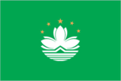
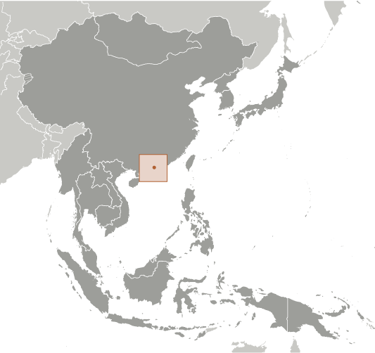
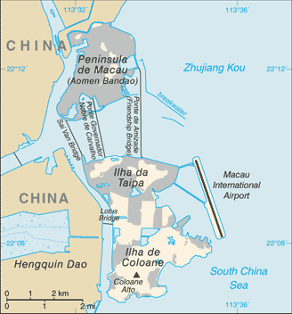

# Macau

_special administrative region of China_

## Introduction

**_Background:_**   
Colonized by the Portuguese in the 16th century, Macau was the first European settlement in the Far East. Pursuant to an agreement signed by China and Portugal on 13 April 1987, Macau became the Macau Special Administrative Region (SAR) of the People's Republic of China on 20 December 1999. In this agreement, China promised that, under its "one country, two systems" formula, China's political and economic system would not be imposed on Macau, and that Macau would enjoy a "high degree of autonomy" in all matters except foreign affairs and defense for the subsequent 50 years.

## Geography

**_Location:_**   
Eastern Asia, bordering the South China Sea and China

**_Geographic coordinates:_**   
22 10 N, 113 33 E

**_Map references:_**   
Southeast Asia

**_Area:_**   
**total:** 28.2 sq km   
**land:** 28.2 sq km   
**water:** 0 sq km

**_Area - comparative:_**   
less than one-sixth the size of Washington, DC

**_Land boundaries:_**   
**total:** 0.34 km   
**regional border:** China 0.34 km

**_Coastline:_**   
41 km

**_Maritime claims:_**   
not specified

**_Climate:_**   
subtropical; marine with cool winters, warm summers

**_Terrain:_**   
generally flat

**_Elevation extremes:_**   
**lowest point:** South China Sea 0 m   
**highest point:** Coloane Alto 172 m

**_Natural resources:_**   
NEGL

**_Land use:_**   
**arable land:** 0%   
**permanent crops:** 0%   
**other:** 100% (2011)

**_Irrigated land:_**   
NA; note - included in the total for China

**_Natural hazards:_**   
typhoons

**_Environment - current issues:_**   
NA

**_Environment - international agreements:_**   
**party to:** Marine Dumping (associate member), Ship Pollution (associate member)

**_Geography - note:_**   
essentially urban; an area of land reclaimed from the sea measuring 5.2 sq km and known as Cotai now connects the islands of Coloane and Taipa; the island area is connected to the mainland peninsula by three bridges

## People and Society

**_Nationality:_**   
**noun:** Chinese   
**adjective:** Chinese

**_Ethnic groups:_**   
Chinese 92.4%, Portuguese 0.6%, mixed 1.1%, other 5.9% (includes Macanese - mixed Portuguese and Asian ancestry) (2011 est.)

**_Languages:_**   
Cantonese 83.3%, Mandarin 5%, Hokkien 3.7%, English 2.3%, other Chinese dialects 2%, Tagalog 1.7%, Portuguese 0.7%, other 1.3%   
**note:** Chinese and Portuguese are official languages (2011 est.)

**_Religions:_**   
Buddhist 50%, Roman Catholic 15%, none or other 35% (1997 est.)

**_Population:_**   
587,914   
**note:** Macau's statistical agency estimated the total population to be approximately 607,500 as of 31 December 2013 (July 2014 est.)

**_Age structure:_**   
**0-14 years:** 14.4% (male 44,350/female 40,272)   
**15-24 years:** 13.7% (male 41,941/female 38,697)   
**25-54 years:** 50.9% (male 133,612/female 165,735)   
**55-64 years:** 11.8% (male 35,011/female 34,372)   
**65 years and over:** 8.8% (male 25,254/female 28,670) (2014 est.)

**_Dependency ratios:_**   
**total dependency ratio:** 26.6 %   
**youth dependency ratio:** 15.7 %   
**elderly dependency ratio:** 10.8 %   
**potential support ratio:** 9.2 (2014 est.)

**_Median age:_**   
**total:** 37.7 years   
**male:** 38.3 years   
**female:** 37.3 years (2014 est.)

**_Population growth rate:_**   
0.83% (2014 est.)

**_Birth rate:_**   
8.98 births/1,000 population (2014 est.)

**_Death rate:_**   
4.1 deaths/1,000 population (2014 est.)

**_Net migration rate:_**   
3.4 migrant(s)/1,000 population (2014 est.)

**_Urbanization:_**   
**urban population:** 100% of total population (2011)   
**rate of urbanization:** 2.01% annual rate of change (2010-15 est.)

**_Sex ratio:_**   
**at birth:** 1.05 male(s)/female   
**0-14 years:** 1.1 male(s)/female   
**15-24 years:** 1.08 male(s)/female   
**25-54 years:** 0.81 male(s)/female   
**55-64 years:** 0.91 male(s)/female   
**65 years and over:** 0.88 male(s)/female   
**total population:** 0.91 male(s)/female (2014 est.)

**_Infant mortality rate:_**   
**total:** 3.13 deaths/1,000 live births   
**male:** 3.29 deaths/1,000 live births   
**female:** 2.97 deaths/1,000 live births (2014 est.)

**_Life expectancy at birth:_**   
**total population:** 84.48 years   
**male:** 81.52 years   
**female:** 87.59 years (2014 est.)

**_Total fertility rate:_**   
0.93 children born/woman (2014 est.)

**_HIV/AIDS - adult prevalence rate:_**   
NA

**_HIV/AIDS - people living with HIV/AIDS:_**   
NA

**_HIV/AIDS - deaths:_**   
NA

**_Education expenditures:_**   
2.7% of GDP (2011)

**_Literacy:_**   
**definition:** age 15 and over can read and write   
**total population:** 95.6%   
**male:** 97.8%   
**female:** 93.7% (2011 est.)

**_School life expectancy (primary to tertiary education):_**   
**total:** 14 years   
**male:** 15 years   
**female:** 14 years (2008)

**_Unemployment, youth ages 15-24:_**   
**total:** 5.8%   
**male:** 7%   
**female:** 4.7% (2011)

## Government

**_Country name:_**   
**conventional long form:** Macau Special Administrative Region   
**conventional short form:** Macau   
**official long form:** Aomen Tebie Xingzhengqu (Chinese); Regiao Administrativa Especial de Macau (Portuguese)   
**official short form:** Aomen (Chinese); Macau (Portuguese)

**_Dependency status:_**   
special administrative region of the People's Republic of China

**_Government type:_**   
limited democracy

**_Administrative divisions:_**   
none (special administrative region of the People's Republic of China)

**_Independence:_**   
none (special administrative region of China)

**_National holiday:_**   
National Day (anniversary of the Founding of the People's Republic of China), 1 October (1949); note - 20 December 1999 is celebrated as Macau Special Administrative Region Establishment Day

**_Constitution:_**   
previous 1976 (Organic Statute of Macau, by Portugal); latest adopted 31 March 1993, effective 20 December 1999 (Basic Law of the Macau Special Administrative Region, by the People's Republic of China, serves as Macau's constitution) (2013)

**_Legal system:_**   
civil law system based on the Portuguese model

**_Suffrage:_**   
18 years of age in direct elections for some legislative positions, universal for permanent residents living in Macau for the past seven years; note - indirect elections are limited to organizations registered as "corporate voters" (973 were registered in the 2009 legislative elections) and a 400-member Election Committee for the Chief Executive drawn from broad regional groupings, municipal organizations, central government bodies, and elected Macau officials

**_Executive branch:_**   
**chief of state:** President of China XI Jinping (since 14 March 2013)   
**head of government:** Chief Executive Fernando CHUI Sai On (since 20 December 2009)   
**cabinet:** Executive Council consists of 1 government secretary, 3 legislators, 4 businessmen, 2 pro-Beijing unionists, and 1 professional   
**elections:** chief executive chosen by a 400-member Election Committee for a five-year term (current chief executive is eligible for a second term); election last held on 26 July 2009 (next to be held in August 2014)   
**note:** the Legislative Assembly voted in August 2012 to expand the electoral committee from 300 to 400 seats for the 2014 election.   
**election results:** Fernando CHUI Sai On elected with 282 votes and took office on 20 December 2009

**_Legislative branch:_**   
unicameral Legislative Assembly (33 seats; 14 geographical constituency seats elected by popular vote, 12 functional constituency seats elected by indirect vote, and 7 seats appointed by the chief executive; members serve four-year terms)   
**elections:** last held on 15 September 2013 (next to be held in September 2017)   
**election results:** percent of vote - ACUM 18.0%, UMG 11.1%, UPP 10.8%, NE 9.0%, NUDM 8.9%, UPD 8.2%, APMD 7.5%, ANMD 6.0%, APM 6.0%, others 14.5%; seats by political group - ACUM 3, UMG 2, UPP 2, NE 2, NUDM 1, UPD 1, APMD 1, ANMD 1, APM 1; 12 seats filled by professional and business groups; 7 members appointed by the chief executive

**_Judicial branch:_**   
**highest court(s):** Court of Final Appeal of Macau Special Administrative Region (consists of the court president and 2 associate justices)   
**judge selection and term of office:** justices appointed by the Macau chief executive upon the recommendation of an independent commission of judges, lawyers, and "eminent" persons; judge tenure NA   
**subordinate courts:** Court of Second Instance; Court of First instance; Lower Court; Administrative Court

**_Political parties and leaders:_**   
Alliance for Change or APM [Melinda CHAN Mei-yi]   
Macau-Guangdong Union or UMG [MAK Soi-kun]   
New Democratic Macau Association or ANMD (an electoral list of New Macau Association [Jason CHAO Teng-hei]   
New Hope or NE [Jose Maria Pereira COUTINHO]   
New Macau Association or AMN [Jason CHAO Teng-hei]   
New Union for Macau's Development or NUDM [Angela LEONG On-kei]   
Prosperous Democratic Macau Association or APMD (an electoral list of New Macau Association [Jason CHAO Teng-hei]   
Union for Development or UPD [KWAN Tsui-hang]   
Union for Promoting Progress or UPP [HO Ion-sang]   
United Citizens Association of Macau or ACUM [CHAN Meng-kam]   
**note:** there is no political party ordinance, so there are no registered political parties; politically active groups register as societies or companies

**_Political pressure groups and leaders:_**   
Civic Power [Agnes LAM lok-fong]   
Democratic Action [LEE Kin-yun]   
Bar-Bending Workers' Association [WONG Wai-Man]   
Macau New Chinese Youth Association [LEONG Sin-man]   
Macau Worker's Union [HO Heng-kuok]   
New Macau Association [Antonio NG Kuok-cheong]   
Workers' Self-Help Union [CHEONG Weng-fat]

**_International organization participation:_**   
ICC (national committees), IHO, IMF, IMO (associate), Interpol (subbureau), ISO (correspondent), UNESCO (associate), UNWTO (associate), UPU, WCO, WTO

**_Diplomatic representation in the US:_**   
none (Special Administrative Region of China)

**_Diplomatic representation from the US:_**   
the US has no offices in Macau; US Consulate General in Hong Kong, currently Consul General Clifford A. HART Jr., is accredited to Macau

**_Flag description:_**   
green with a lotus flower above a stylized bridge and water in white, beneath an arc of five gold, five-pointed stars: one large in the center of the arc and two smaller on either side; the lotus is the floral emblem of Macau, the three petals represent the peninsula and two islands that make up Macau; the five stars echo those on the flag of China

**_National symbol(s):_**   
lotus blossom

**_National anthem:_**   
**note:** as a Special Administrative Region of China, "Yiyongjun Jinxingqu" is the official anthem (see China)

## Economy

**_Economy - overview:_**   
Since opening up its locally-controlled casino industry to foreign competition in 2001, Macau has attracted tens of billions of dollars in foreign investment, transforming the territory into one of the world's largest gaming centers. Macau's gaming and tourism businesses were fueled by China''s decision to relax travel restrictions on Chinese citizens wishing to visit Macau. - In 2013, Macau's gaming-related taxes accounted for more than 85% of total government revenue. Macau''s economy slowed dramatically in 2009 as a result of the global economic slowdown, but strong growth resumed in 2010-13, largely on the back of tourism from mainland China and the gaming sectors. In 2013, this city of 607,500 hosted nearly 29.3 million visitors. Almost 64% came from mainland China. Macau''s traditional manufacturing industry has slowed greatly since the termination of the Multi-Fiber Agreement in 2005. China is Macau''s second largest goods export market, behind Hong Kong, and followed by the United States. In 2013, exports were US$1.1 billion, while gaming receipts were US$45.2 billion, an 18.6% increase over 2012. Macau''s economy expanded by 11.9% in 2013; although impressive, it was a slower growth rate than in previous years. Macau continues to face the challenges of managing its growing casino industry, money-laundering, and the need to diversify the economy away from heavy dependence on gaming revenues. Macau''s currency, the pataca, is closely tied to the Hong Kong dollar, which is also freely accepted in the territory.

**_GDP (purchasing power parity):_**   
$51.68 billion (2013 est.)   
$46.19 billion (2012 est.)   
$42.34 billion (2011 est.)   
**note:** data are in 2013 US dollars

**_GDP (official exchange rate):_**   
$51.68 billion (2013 est.)

**_GDP - real growth rate:_**   
11.9% (2013 est.)   
9.1% (2012 est.)   
21.3% (2011 est.)

**_GDP - per capita (PPP):_**   
$88,700 (2013 est.)   
$79,900 (2010 est.)   
$73,900 (2009 est.)

**_GDP - composition, by end use:_**   
**household consumption:** 18.7%   
**government consumption:** 6.5%   
**investment in fixed capital:** 12.8%   
**investment in inventories:** 1.1%   
**exports of goods and services:** 107%   
**imports of goods and services:** -46%; (2013 est.)

**_GDP - composition, by sector of origin:_**   
**agriculture:** 0%   
**industry:** 6.5%   
**services:** 93.5% (2013 est.)

**_Agriculture - products:_**   
only 2% of land area is cultivated, mainly by vegetable growers; fishing, mostly for crustaceans, is important; some of the catch is exported to Hong Kong

**_Industries:_**   
tourism, gambling, clothing, textiles, electronics, footwear, toys

**_Industrial production growth rate:_**   
17.6% (2013 est.)

**_Labor force:_**   
367,800 (2013 est.)

**_Labor force - by occupation:_**   
**manufacturing:** 2.5%   
**construction:** 9.8%   
**transport and communications:** 4.4%   
**wholesale and retail trade:** 12.4%   
**restaurants and hotels:** 15%   
**gambling:** 25.9%   
**public sector:** 7.1%   
**financial services:** 2.6%   
**other services:** 20.3% (2013)

**_Unemployment rate:_**   
1.8% (2013 est.)   
2% (2012 est.)

**_Population below poverty line:_**   
NA%

**_Household income or consumption by percentage share:_**   
**lowest 10%:** NA%   
**highest 10%:** NA%

**_Distribution of family income - Gini index:_**   
35 (2013)   
38 (2008)

**_Budget:_**   
**revenues:** $19.44 billion   
**expenditures:** $7.407 billion (2013 est.)

**_Taxes and other revenues:_**   
37.6% of GDP (2013 est.)

**_Budget surplus (+) or deficit (-):_**   
23.3% of GDP (2013 est.)

**_Fiscal year:_**   
calendar year

**_Inflation rate (consumer prices):_**   
5.5% (2013 est.)   
6.1% (2012 est.)

**_Commercial bank prime lending rate:_**   
5.25% (31 December 2013 est.)   
5.25% (31 December 2012 est.)

**_Stock of narrow money:_**   
$7.363 billion (31 December 2013 est.)   
$5.953 billion (31 December 2012 est.)

**_Stock of broad money:_**   
$55.17 billion (31 December 2013 est.)   
$46.87 billion (31 December 2012 est.)

**_Stock of domestic credit:_**   
$-5.504 billion (31 December 2013 est.)   
$-5.678 billion (31 December 2012 est.)

**_Market value of publicly traded shares:_**   
$85.5 billion (2 March 2012 est.)   
$46.1 billion (31 February 2011)   
$2.3 billion (31 December 2008 est.)

**_Current account balance:_**   
$18.69 billion (2012 est.)   
$16.2 billion (2011 est.)

**_Exports:_**   
$1.137 billion (2013 est.)   
$1.02 billion (2012 est.)   
**note:** includes reexports

**_Exports - commodities:_**   
clothing, textiles, footwear, toys, electronics, machinery and parts

**_Exports - partners:_**   
Hong Kong 53.4%, China 17.7%, US 4% (2013 est.)

**_Imports:_**   
$10.13 billion (2013 est.)   
$8.866 billion (2012 est.)

**_Imports - commodities:_**   
raw materials and semi-manufactured goods, consumer goods (foodstuffs, beverages, tobacco, garments and footwear, motor vehicles), capital goods, mineral fuels and oils

**_Imports - partners:_**   
China 32.6%, Hong Kong 13%, France 8.6%, Japan 5.9%, US 5% (2013 est.)

**_Reserves of foreign exchange and gold:_**   
$16.15 billion (31 December 2013 est.)   
$16.6 billion (31 December 2012 est.)   
**note:** the Fiscal Reserves Act that came into force on 1 January 2012 requires the fiscal reserve to be separated from the foreign exchange reserves and to be managed separately; the transfer of assets took place in February 2012

**_Debt - external:_**   
$0 (31 December 2013)   
$0 (31 December 2012)

**_Stock of direct foreign investment - at home:_**   
$18.91 billion (31 December 2011 est.)   
$14.91 billion (31 December 2011 est.)

**_Stock of direct foreign investment - abroad:_**   
$1.166 billion (2012 est.)   
$667.8 million (2011)

**_Exchange rates:_**   
patacas (MOP) per US dollar -   
8 (2013 est.)   
7.9899 (2012 est.)   
8.0022 (2010 est.)   
7.983 (2008)   
8.011 (2007)

## Energy

**_Electricity - production:_**   
413.7 million kWh (2013 est.)

**_Electricity - consumption:_**   
4.291 billion kWh (2013 est.)

**_Electricity - exports:_**   
0 kWh (2013 est.)

**_Electricity - imports:_**   
4.059 billion kWh (2013 est.)

**_Electricity - installed generating capacity:_**   
472,000 kW (2013 est.)

**_Electricity - from fossil fuels:_**   
100% of total installed capacity (2013 est.)

**_Electricity - from nuclear fuels:_**   
0% of total installed capacity (2013 est.)

**_Electricity - from hydroelectric plants:_**   
0% of total installed capacity (2013 est.)

**_Electricity - from other renewable sources:_**   
0% of total installed capacity (2013 est.)

**_Crude oil - production:_**   
0 bbl/day (2013 est.)

**_Crude oil - exports:_**   
0 bbl/day (2013 est.)

**_Crude oil - imports:_**   
0 bbl/day (2013 est.)

**_Crude oil - proved reserves:_**   
0 bbl (1 January 2013 est.)

**_Refined petroleum products - production:_**   
0 bbl/day (2013 est.)

**_Refined petroleum products - consumption:_**   
7,376 bbl/day (2013 est.)

**_Refined petroleum products - exports:_**   
0 bbl/day (2013 est.)

**_Refined petroleum products - imports:_**   
5,780 bbl/day (2013 est.)

**_Natural gas - production:_**   
0 cu m (2013 est.)

**_Natural gas - consumption:_**   
355,000 cu m (2013 est.)

**_Natural gas - exports:_**   
0 cu m (2013 est.)

**_Natural gas - imports:_**   
371,000 cu m (2013 est.)

**_Natural gas - proved reserves:_**   
0 cu m (1 January 2013 est.)

**_Carbon dioxide emissions from consumption of energy:_**   
1.805 million Mt (2011 est.)

## Communications

**_Telephones - main lines in use:_**   
162,500 (2012)

**_Telephones - mobile cellular:_**   
1.613 million (2012)

**_Telephone system:_**   
**general assessment:** fairly modern communication facilities maintained for domestic and international services   
**domestic:** termination of monopoly over mobile-cellular telephone services in 2001 spurred sharp increase in subscriptions with mobile-cellular teledensity exceeding 200 per 100 persons; fixed-line subscribership appears to have peaked and is now in decline   
**international:** country code - 853; landing point for the SEA-ME-WE-3 submarine cable network that provides links to Asia, the Middle East, and Europe; HF radiotelephone communication facility; satellite earth station - 1 Intelsat (Indian Ocean) (2011)

**_Broadcast media:_**   
local government dominates broadcast media; 2 television stations operated by the government with one broadcasting in Portuguese and the other in Cantonese and Mandarin; 1 cable TV and 4 satellite TV services available; 3 radio stations broadcasting, of which 2 are government-operated (2012)

**_Internet country code:_**   
.mo

**_Internet hosts:_**   
327 (2012)

**_Internet users:_**   
270,200 (2009)

## Transportation

**_Airports:_**   
1 (2013)

**_Airports - with paved runways:_**   
**total:** 1   
**over 3,047 m:** 1 (2013)

**_Heliports:_**   
2 (2013)

**_Roadways:_**   
**total:** 413 km   
**paved:** 413 km (2009)

**_Ports and terminals:_**   
**major seaport(s):** Macau

## Military

**_Military branches:_**   
no regular indigenous military forces

**_Manpower available for military service:_**   
**males age 16-49:** 150,780 (2010 est.)

**_Manpower fit for military service:_**   
**males age 16-49:** 124,189   
**females age 16-49:** 149,514 (2010 est.)

**_Manpower reaching militarily significant age annually:_**   
**male:** 4,274   
**female:** 3,674 (2010 est.)

**_Military - note:_**   
defense is the responsibility of China

## Transnational Issues

**_Disputes - international:_**   
none

**_Illicit drugs:_**   
transshipment point for drugs going into mainland China; consumer of opiates and amphetamines

............................................................   
_Page last updated on June 19, 2014_
