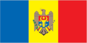
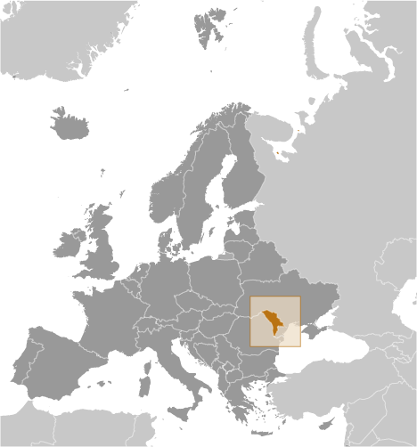
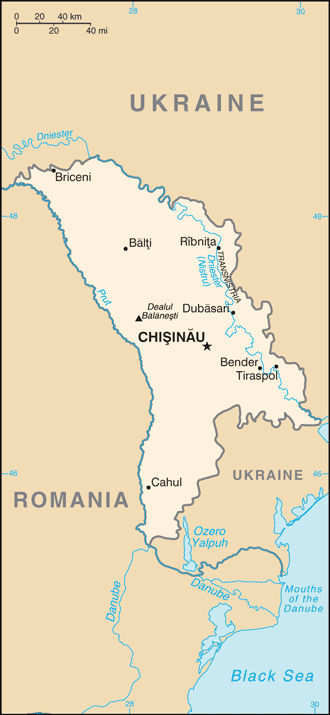

# Moldova

## Introduction

**_Background:_**   
Part of Romania during the interwar period, Moldova was incorporated into the Soviet Union at the close of World War II. Although the country has been independent from the USSR since 1991, Russian forces have remained on Moldovan territory east of the Nistru River supporting the separatist region of Transnistria, composed of a Slavic majority population (mostly Ukrainians and Russians), but with a sizeable ethnic Moldovan minority. One of the poorest nations in Europe, Moldova became the first former Soviet state to elect a communist, Vladimir VORONIN, as its president in 2001. VORONIN served as Moldova's president until he resigned in September 2009, following the opposition's gain of a narrow majority in July parliamentary elections and the Communist Party's (PCRM) subsequent inability to attract the three-fifths of parliamentary votes required to elect a president and, by doing so, put into place a permanent government. Four Moldovan opposition parties formed a new coalition, the Alliance for European Integration (AEI), iterations of which have acted as Moldova's governing coalitions since. Moldova experienced significant political uncertainty between 2009 and early 2012, holding three general elections and numerous presidential ballots in parliament, all of which failed to secure a president. Following November 2010 parliamentary elections, a reconstituted AEI-coalition consisting of three of the four original AEI parties formed a government, and in March 2012 was finally able to elect an independent as president. As of late May 2013, the ruling coalition - comprised of two of the original AEI parties and a splinter group from a third - is called the Pro-European Coalition. In November 2013, the Moldovan Government initialed an Association Agreement with the European Union (EU), advancing the coalition's policy priority of EU integration.

## Geography

**_Location:_**   
Eastern Europe, northeast of Romania

**_Geographic coordinates:_**   
47 00 N, 29 00 E

**_Map references:_**   
Europe

**_Area:_**   
**total:** 33,851 sq km   
**land:** 32,891 sq km   
**water:** 960 sq km

**_Area - comparative:_**   
slightly larger than Maryland

**_Land boundaries:_**   
**total:** 1,390 km   
**border countries:** Romania 450 km, Ukraine 940 km

**_Coastline:_**   
0 km (landlocked)

**_Maritime claims:_**   
none (landlocked)

**_Climate:_**   
moderate winters, warm summers

**_Terrain:_**   
rolling steppe, gradual slope south to Black Sea

**_Elevation extremes:_**   
**lowest point:** Dniester (Nistru) 2 m   
**highest point:** Dealul Balanesti 430 m

**_Natural resources:_**   
lignite, phosphorites, gypsum, arable land, limestone

**_Land use:_**   
**arable land:** 53.47%   
**permanent crops:** 8.77%   
**other:** 37.75% (2011)

**_Irrigated land:_**   
2,283 sq km (2011)

**_Total renewable water resources:_**   
11.65 cu km (2011)

**_Freshwater withdrawal (domestic/industrial/agricultural):_**   
**total:** 1.07 cu km/yr (14%/83%/4%)   
**per capita:** 290 cu m/yr (2010)

**_Natural hazards:_**   
landslides

**_Environment - current issues:_**   
heavy use of agricultural chemicals, including banned pesticides such as DDT, has contaminated soil and groundwater; extensive soil erosion from poor farming methods

**_Environment - international agreements:_**   
**party to:** Air Pollution, Air Pollution-Persistent Organic Pollutants, Biodiversity, Climate Change, Climate Change-Kyoto Protocol, Desertification, Endangered Species, Hazardous Wastes, Ozone Layer Protection, Ship Pollution, Wetlands   
**signed, but not ratified:** none of the selected agreements

**_Geography - note:_**   
landlocked; well endowed with various sedimentary rocks and minerals including sand, gravel, gypsum, and limestone

## People and Society

**_Nationality:_**   
**noun:** Moldovan(s)   
**adjective:** Moldovan

**_Ethnic groups:_**   
Moldovan 75.8%, Ukrainian 8.4%, Russian 5.9%, Gagauz 4.4%, Romanian 2.2%, Bulgarian 1.9%, other 1%, unspecified 0.4%   
**note:** internal disputes with ethnic Slavs in the Transnistrian region (2004 est.)

**_Languages:_**   
Moldovan 58.8% (official; virtually the same as the Romanian language), Romanian 16.4%, Russian 16%, Ukrainian 3.8%, Gagauz 3.1% (a Turkish language), Bulgarian 1.1%, other 0.3%, unspecified 0.4%   
**note:** percentages represent lanugage usually spoken (2004 est.)

**_Religions:_**   
Orthodox 93.3%, Baptist 1%, other Christian 1.2%, other 0.9%, atheist 0.4%, none 1%, unspecified 2.2% (2004 est.)

**_Population:_**   
3,583,288 (July 2014 est.)

**_Age structure:_**   
**0-14 years:** 17.7% (male 326,968/female 306,948)   
**15-24 years:** 14.2% (male 262,559/female 246,283)   
**25-54 years:** 43.9% (male 785,392/female 786,421)   
**55-64 years:** 13.1% (male 214,899/female 255,046)   
**65 years and over:** 10.7% (male 151,629/female 247,143) (2014 est.)

**_Dependency ratios:_**   
**total dependency ratio:** 39.3 %   
**youth dependency ratio:** 23.2 %   
**elderly dependency ratio:** 16.1 %   
**potential support ratio:** 6.2 (2014 est.)

**_Median age:_**   
**total:** 35.7 years   
**male:** 33.9 years   
**female:** 37.7 years (2014 est.)

**_Population growth rate:_**   
-1.02% (2014 est.)

**_Birth rate:_**   
12.21 births/1,000 population (2014 est.)

**_Death rate:_**   
12.6 deaths/1,000 population (2014 est.)

**_Net migration rate:_**   
-9.8 migrant(s)/1,000 population (2014 est.)

**_Urbanization:_**   
**urban population:** 47.7% of total population (2011)   
**rate of urbanization:** 0.79% annual rate of change (2010-15 est.)

**_Major urban areas - population:_**   
CHISINAU (capital) 677,000 (2011)

**_Sex ratio:_**   
**at birth:** 1.06 male(s)/female   
**0-14 years:** 1.07 male(s)/female   
**15-24 years:** 1.07 male(s)/female   
**25-54 years:** 1 male(s)/female   
**55-64 years:** 0.95 male(s)/female   
**65 years and over:** 0.6 male(s)/female   
**total population:** 0.94 male(s)/female (2014 est.)

**_Mother's mean age at first birth:_**   
23.7 (2011 est.)

**_Maternal mortality rate:_**   
41 deaths/100,000 live births (2010)

**_Infant mortality rate:_**   
**total:** 12.93 deaths/1,000 live births   
**male:** 14.82 deaths/1,000 live births   
**female:** 10.93 deaths/1,000 live births (2014 est.)

**_Life expectancy at birth:_**   
**total population:** 70.12 years   
**male:** 66.25 years   
**female:** 74.24 years (2014 est.)

**_Total fertility rate:_**   
1.56 children born/woman (2014 est.)

**_Contraceptive prevalence rate:_**   
67.8% (2005)

**_Health expenditures:_**   
11.4% of GDP (2011)

**_Physicians density:_**   
3.64 physicians/1,000 population (2011)

**_Hospital bed density:_**   
6.2 beds/1,000 population (2011)

**_Drinking water source:_**   
**improved:** urban: 99.5% of population; rural: 93.7% of population; total: 96.5% of population   
**unimproved:** urban: 0.5% of population; rural: 6.3% of population; total: 3.5% of population (2012 est.)

**_Sanitation facility access:_**   
**improved:** urban: 89.2% of population; rural: 84.4% of population; total: 86.7% of population   
**unimproved:** urban: 10.8% of population; rural: 15.6% of population; total: 13.3% of population (2012 est.)

**_HIV/AIDS - adult prevalence rate:_**   
0.7% (2012 est.)

**_HIV/AIDS - people living with HIV/AIDS:_**   
18,700 (2012 est.)

**_HIV/AIDS - deaths:_**   
1,300 (2012 est.)

**_Obesity - adult prevalence rate:_**   
21.2% (2008)

**_Children under the age of 5 years underweight:_**   
3.2% (2005)

**_Education expenditures:_**   
8.4% of GDP (2012)

**_Literacy:_**   
**definition:** age 15 and over can read and write   
**total population:** 99%   
**male:** 99.5%   
**female:** 98.5% (2011 est.)

**_School life expectancy (primary to tertiary education):_**   
**total:** 12 years   
**male:** 12 years   
**female:** 12 years (2012)

**_Child labor - children ages 5-14:_**   
**total number:** 72,364   
**percentage:** 16 % (2009 est.)

**_Unemployment, youth ages 15-24:_**   
**total:** 13.1%   
**male:** 12.8%   
**female:** 13.4% (2012)

## Government

**_Country name:_**   
**conventional long form:** Republic of Moldova   
**conventional short form:** Moldova   
**local long form:** Republica Moldova   
**local short form:** Moldova   
**former:** Moldavian Soviet Socialist Republic, Moldovan Soviet Socialist Republic

**_Government type:_**   
republic

**_Capital:_**   
**name:** Chisinau in Romanian (Kishinev in Russian)   
**note:** pronounced KEE-shee-now (KIH-shi-nyev)   
**geographic coordinates:** 47 00 N, 28 51 E   
**time difference:** UTC+2 (7 hours ahead of Washington, DC, during Standard Time)   
**daylight saving time:** +1hr, begins last Sunday in March; ends last Sunday in October

**_Administrative divisions:_**   
32 raions (raioane, singular - raion), 3 municipalities (municipii, singular - municipiul), 1 autonomous territorial unit (unitatea teritoriala autonoma), and 1 territorial unit (unitatea teritoriala)   
**raions:** Anenii Noi, Basarabeasca, Briceni, Cahul, Cantemir, Calarasi, Causeni, Cimislia, Criuleni, Donduseni, Drochia, Dubasari, Edinet, Falesti, Floresti, Glodeni, Hincesti, Ialoveni, Leova, Nisporeni, Ocnita, Orhei, Rezina, Riscani, Singerei, Soldanesti, Soroca, Stefan-Voda, Straseni, Taraclia, Telenesti, Ungheni   
**municipalities:** Balti, Bender, Chisinau   
**autonomous territorial unit:** Gagauzia   
**territorial unit:** Stinga Nistrului (Transnistria)

**_Independence:_**   
27 August 1991 (from the Soviet Union)

**_National holiday:_**   
Independence Day, 27 August (1991)

**_Constitution:_**   
previous 1978; latest adopted 29 July 1994, effective 27 August 1994; amended 2003 (2011)

**_Legal system:_**   
civil law system with Germanic law influences; Constitutional Court review of legislative acts

**_International law organization participation:_**   
has not submitted an ICJ jurisdiction declaration; accepts ICCt jurisdiction

**_Suffrage:_**   
18 years of age; universal

**_Executive branch:_**   
**chief of state:** President Nicolae TIMOFTI (since 23 March 2012)   
**head of government:** Prime Minister Iurie LEANCA (since 25 April 2013; acting until 30 May 2013, sworn in on 31 May 2013)   
**cabinet:** Cabinet selected by president with approval of Parliament   
**elections:** president elected by Parliament for a four-year term (eligible for a second term); election last held 16 March 2012 (next to be held in March 2016); note - prime minister designated by the president upon consultation with Parliament; within 15 days from designation, the prime minister-designate must request a vote of confidence from the Parliament regarding his/her work program and entire cabinet; the prime minister and Cabinet received a vote of confidence on 30 May 2013   
**election results:** Nicolae TIMOFTI elected president; parliamentary votes - 62 of 101 votes Iurie LEANCA designated prime minister; parliamentary votes of confidence - 58 of 101

**_Legislative branch:_**   
unicameral Parliament or Parlamentul (101 seats; members elected on an at-large basis by popular vote to serve four-year terms)   
**elections:** last held on 28 November 2010 (next to be held in November 2014); note - this was the third parliamentary election in less than two years; the earlier parliaments (elected 5 April 2009 and 29 July 2009) were dissolved after they could not elect a presidential candidate with the necessary three-fifths majority   
**election results:** percent of vote by party - PCRM 39.3%, PLDM 29.4%, PD 12.7%, PL 10%, other 8.6%; seats by party - PCRM 42, PLDM 32, PD 15, PL 12; note - in November of 2011, 3 legislators defected from the Communist Party (PCRM) and voted with the PLDM, PD, and PL governing coalition - termed the Alliance for European Integration (AEI) - to reach a 62-seat majority sufficient to elect a new president; the 3 former PCRM legislators are now aligned with the Party of Socialists, and in 2012 an additional 5 legislators defected from the PCRM; 1 PLDM legislator also defected and is independent

**_Judicial branch:_**   
**highest court(s):** Supreme Court of Justice (consists of a chief judges, 3 deputy-chief judges, 45 judges, and 7 assistant judges); Constitutional Court (consists of the court president and 6 judges); note - the Constitutional Court is autonomous to the other branches of government; the Court interprets the Constitution and reviews the constitutionality of parliamentary laws and decisions, decrees of the president, and acts of the government.   
**judge selection and term of office:** Supreme Court of Justice judges appointed by Parliament upon the recommendation of the Supreme Council of the Magistracy; all judges serve 4-year renewable terms; Constitutional Court judges appointed 2 each by Parliament, the Moldovan president, and the Higher Council of Magistracy; court president elected by other court judges for a 3-year term; other judges appointed for 6-year terms   
**subordinate courts:** Courts of Appeal; Court of Business Audit; municipal courts

**_Political parties and leaders:_**   
**represented in Parliament:** Communist Party of the Republic of Moldova or PCRM [Vladimir VORONIN]; Democratic Party or PD [Marian LUPU]; Liberal Democratic Party or PLDM [Vladimir FILAT]; Liberal Party or PL [Mihai GHIMPU]; Liberal Reformers Party or PLR [Ion HADARCA]; Pro-European Coalition (coalition of the PD, PLDM, and PLR);   
**not represented in Parliament:** Christian Democratic People's Party or PPCD [Iurie ROSCA]; Conservative Party or PC [Natalia NIRCA]; Ecological Party of Moldova "Green Alliance" or PEMAVE [Vladimir BRAGA]; European Action Movement or MAE [Veaceslav UNTILA]; For Nation and Country Party or PpNT [Sergiu MOCANU]; Humanist Party of Moldova or PUM [Valeriu PASAT]; Labor Party or PM [Gheorghe SIMA]; National Liberal Party or PNL [Vitalia PAVLICENKO]; Party of Socialists or PSRM [Igor DODON]; Patriots of Moldova Party or PPM [Mihail GARBUZ]; Popular Republican Party or PPR [Nicolae ANDRONIC]; Republican Party of Moldova or PRM [Andrei STRATAN]; Roma Social Political Movement of the Republic of Moldova or MRRM [Ion BUCUR]; Social Democratic Party or PSD [Victor SELIN]; Social Political Movement "Equality" or MR [Valeriy KLIMENCO]; United Moldova Party or PMUEM [Vladimir TURCAN]

**_Political pressure groups and leaders:_**   
NA

**_International organization participation:_**   
BSEC, CD, CE, CEI, CIS, EAEC (observer), EAPC, EBRD, FAO, GCTU, GUAM, IAEA, IBRD, ICAO, ICC (NGOs), ICRM, IDA, IFAD, IFC, IFRCS, ILO, IMF, IMO, Interpol, IOC, IOM, IPU, ISO (correspondent), ITU, ITUC (NGOs), MIGA, OIF, OPCW, OSCE, PFP, SELEC, UN, UNCTAD, UNESCO, UNHCR, UNIDO, Union Latina, UNMIL, UNMISS, UNOCI, UNWTO, UPU, WCO, WHO, WIPO, WMO, WTO

**_Diplomatic representation in the US:_**   
**chief of mission:** Ambassador Igor MUNTEANU (since 7 September 2010)   
**chancery:** 2101 S Street NW, Washington, DC 20008   
**telephone:** [1] (202) 667-1130   
**FAX:** [1] (202) 667-2624

**_Diplomatic representation from the US:_**   
**chief of mission:** Ambassador William H. MOSER (since 6 September 2011)   
**embassy:** 103 Mateevici Street, Chisinau MD-2009   
**mailing address:** use embassy street address   
**telephone:** [373] (22) 40-8300   
**FAX:** [373] (22) 23-3044

**_Flag description:_**   
three equal vertical bands of blue (hoist side), yellow, and red; emblem in center of flag is of a Roman eagle of gold outlined in black with a red beak and talons carrying a yellow cross in its beak and a green olive branch in its right talons and a yellow scepter in its left talons; on its breast is a shield divided horizontally red over blue with a stylized aurochs head, star, rose, and crescent all in black-outlined yellow; based on the color scheme of the flag of Romania - with which Moldova shares a history and culture - but Moldova's blue band is lighter; the reverse of the flag does not display any coat of arms   
**note:** one of only three national flags that differ on their obverse and reverse sides - the others are Paraguay and Saudi Arabia

**_National symbol(s):_**   
aurochs (a type of wild cattle)

**_National anthem:_**   
**name:** "Limba noastra" (Our Language)   
**lyrics/music:** Alexei MATEEVICI/Alexandru CRISTEA   
**note:** adopted 1994

## Economy

**_Economy - overview:_**   
Despite recent progress, Moldova remains one of the poorest countries in Europe. With a moderate climate and good farmland, Moldova's economy relies heavily on its agriculture sector, featuring fruits, vegetables, wine, and tobacco. Moldova also depends on annual remittances of about $1.6 billion from the roughly one million Moldovans working in Europe, Russia, and other former Soviet Bloc countries. With few natural energy resources, Moldova imports almost all of its energy supplies from Russia and Ukraine. Moldova's dependence on Russian energy is underscored by a growing $5 billion debt to Russian natural gas supplier Gazprom, largely the result of unreimbursed natural gas consumption in the separatist Transnistria region. In August 2013, work began on a new pipeline between Moldova and Romania that may eventually break Russia's monopoly on Moldova's gas supplies. The government's goal of EU integration has resulted in some market-oriented progress. Moldova experienced better than expected economic growth in 2013 due to increased agriculture production, to economic policies adopted by the Moldovan government since 2009, and to the receipt of EU trade preferences. Moldova is poised to sign an Association Agreement and a Deep and Comprehensive Free Trade Agreement with the EU during fall 2014, connecting Moldovan products to the world’s largest market. Still, growth has been hampered by high prices for Russian natural gas, a Russian import ban on Moldovan wine, increased foreign scrutiny of Moldovan agricultural products, and by Moldova’s large external debt. Over the longer term, Moldova's economy remains vulnerable to political uncertainty, weak administrative capacity, vested bureaucratic interests, corruption, higher fuel prices, Russian pressure, and the illegal separatist regime in Moldova's Transnistria region.

**_GDP (purchasing power parity):_**   
$13.25 billion (2013 est.)   
$12.16 billion (2012 est.)   
$12.26 billion (2011 est.)   
**note:** data are in 2013 US dollars

**_GDP (official exchange rate):_**   
$7.932 billion (2013 est.)

**_GDP - real growth rate:_**   
8.9% (2013 est.)   
-0.7% (2012 est.)   
6.8% (2011 est.)

**_GDP - per capita (PPP):_**   
$3,800 (2013 est.)   
$3,500 (2012 est.)   
$3,500 (2011 est.)   
**note:** data are in 2013 US dollars

**_Gross national saving:_**   
16.9% of GDP (2013 est.)   
16.1% of GDP (2012 est.)   
11.8% of GDP (2011 est.)

**_GDP - composition, by end use:_**   
**household consumption:** 92.9%   
**government consumption:** 20.6%   
**investment in fixed capital:** 22.6%   
**investment in inventories:** 1.7%   
**exports of goods and services:** 44.1%   
**imports of goods and services:** -81.9%; (2013 est.)

**_GDP - composition, by sector of origin:_**   
**agriculture:** 13.8%   
**industry:** 19.9%   
**services:** 66.2% (2013 est.)

**_Agriculture - products:_**   
vegetables, fruits, grapes, grain, sugar beets, sunflower seeds, tobacco; beef, milk; wine

**_Industries:_**   
sugar, vegetable oil, food processing, agricultural machinery; foundry equipment, refrigerators and freezers, washing machines; hosiery, shoes, textiles

**_Industrial production growth rate:_**   
6.8% (2013 est.)

**_Labor force:_**   
1.206 million (2013 est.)

**_Labor force - by occupation:_**   
**agriculture:** 26.4%   
**industry:** 13.2%   
**services:** 60.4% (2012 est.)

**_Unemployment rate:_**   
5.8% (2013 est.)   
5.6% (2012 est.)

**_Population below poverty line:_**   
21.9% (2010 est.)

**_Household income or consumption by percentage share:_**   
**lowest 10%:** 3.3%   
**highest 10%:** 26% (2010 est.)

**_Distribution of family income - Gini index:_**   
33 (2010)   
33.2 (2003)

**_Budget:_**   
**revenues:** $2.931 billion   
**expenditures:** $3.071 billion   
**note:** National Public Budget (2013 est.)

**_Taxes and other revenues:_**   
37% of GDP (2013 est.)

**_Budget surplus (+) or deficit (-):_**   
-1.8% of GDP (2013 est.)

**_Public debt:_**   
16.6% of GDP (2013 est.)   
17.8% of GDP (2012 est.)

**_Fiscal year:_**   
calendar year

**_Inflation rate (consumer prices):_**   
4.6% (2013 est.)   
4.6% (2012 est.)

**_Central bank discount rate:_**   
3.5% (31 December 2013)   
4.5% (31 December 2012)   
**note:** this is the basic rate on short-term operations

**_Commercial bank prime lending rate:_**   
12.26% (31 December 2013 est.)   
13.34% (31 December 2012 est.)

**_Stock of narrow money:_**   
$2.154 billion (31 December 2013 est.)   
$1.701 billion (31 December 2012 est.)

**_Stock of broad money:_**   
$4.974 billion (31 December 2013 est.)   
$4.088 billion (31 December 2012 est.)

**_Stock of domestic credit:_**   
$2.978 billion (31 December 2013 est.)   
$2.908 billion (31 December 2012 est.)

**_Market value of publicly traded shares:_**   
$65.28 million (31 December 2012 est.)   
$51.46 million (31 December 2012)   
$20.71 million

**_Current account balance:_**   
-$507.7 million (2013 est.)   
-$495.3 million (2012 est.)

**_Exports:_**   
$2.399 billion (2013 est.)   
$2.162 billion (2012 est.)

**_Exports - commodities:_**   
foodstuffs, textiles, machinery

**_Exports - partners:_**   
Russia 26.3%, Romania 17.2%, Italy 7.7%, Ukraine 5.9%, Turkey 5.3%, Germany 4.7%, GB 4.4% (2012 est.)

**_Imports:_**   
$5.493 billion (2013 est.)   
$5.213 billion (2012 est.)

**_Imports - commodities:_**   
mineral products and fuel, machinery and equipment, chemicals, textiles

**_Imports - partners:_**   
Russia 14.3%, Romania 13.1%, Ukraine 12%, China 8.7%, Germany 7.2%, Turkey 6.9%, Italy 6.3% (2012 est.)

**_Reserves of foreign exchange and gold:_**   
$2.814 billion (31 December 2013 est.)   
$2.513 billion (31 December 2012 est.)

**_Debt - external:_**   
$6.218 billion (30 September, 2013 est.)   
$5.984 billion (31 December 2012 est.)

**_Stock of direct foreign investment - at home:_**   
$3.448 billion (31 December 2012 est.)   
$3.262 billion (31 December 2011 est.)

**_Stock of direct foreign investment - abroad:_**   
$108.2 million (31 December 2012)   
$88.42 million (31 December 2011)

**_Exchange rates:_**   
Moldovan lei (MDL) per US dollar -   
12.592 (2013 est.)   
12.112 (2012 est.)   
12.369 (2010 est.)   
11.11 (2009)   
10.326 (2008)

## Energy

**_Electricity - production:_**   
932 million kWh (2012 est.)

**_Electricity - consumption:_**   
4.211 billion kWh (2012 est.)

**_Electricity - exports:_**   
0 kWh (2012 est.)

**_Electricity - imports:_**   
3.297 billion kWh (2012 est.)

**_Electricity - installed generating capacity:_**   
439,900 kW   
**note:** excludes Transnistria (2013 est.)

**_Electricity - from fossil fuels:_**   
96.4% of total installed capacity (2013 est.)

**_Electricity - from nuclear fuels:_**   
0% of total installed capacity (2013 est.)

**_Electricity - from hydroelectric plants:_**   
3.6% of total installed capacity (2013 est.)

**_Electricity - from other renewable sources:_**   
0% of total installed capacity (2013 est.)

**_Crude oil - production:_**   
221 bbl/day (2012 est.)

**_Crude oil - exports:_**   
0 bbl/day (2012 est.)

**_Crude oil - imports:_**   
0 bbl/day (2012 est.)

**_Crude oil - proved reserves:_**   
7,330 bbl (1 January 2013 est.)

**_Refined petroleum products - production:_**   
321 bbl/day (2012 est.)

**_Refined petroleum products - consumption:_**   
15,320 bbl/day (2012 est.)

**_Refined petroleum products - exports:_**   
552 bbl/day (2012 est.)

**_Refined petroleum products - imports:_**   
15,280 bbl/day (2012 est.)

**_Natural gas - production:_**   
0 cu m (2012 est.)

**_Natural gas - consumption:_**   
1.095 billion cu m (2012 est.)

**_Natural gas - exports:_**   
0 cu m (2012 est.)

**_Natural gas - imports:_**   
1.095 billion cu m   
**note:** excludes Transnistria (2012 est.)

**_Natural gas - proved reserves:_**   
0 cu m (1 January 2013 est.)

**_Carbon dioxide emissions from consumption of energy:_**   
6.467 million Mt (2011 est.)

## Communications

**_Telephones - main lines in use:_**   
1.206 million (2012)

**_Telephones - mobile cellular:_**   
4.08 million (2012)

**_Telephone system:_**   
**general assessment:** poor service outside Chisinau; some modernization is under way   
**domestic:** multiple private operators of GSM mobile-cellular telephone service are operating; GPRS system is being introduced; a CDMA mobile telephone network began operations in 2007; combined fixed-line and mobile-cellular teledensity 100 per 100 persons   
**international:** country code - 373; service through Romania and Russia via landline; satellite earth stations - at least 3 (Intelsat, Eutelsat, and Intersputnik) (2011)

**_Broadcast media:_**   
state-owned national radio-TV broadcaster operates 2 TV and 2 radio stations; a total of nearly 40 terrestrial TV channels and some 50 radio stations are in operation; Russian and Romanian channels also are available (2007)

**_Internet country code:_**   
.md

**_Internet hosts:_**   
711,564 (2012)

**_Internet users:_**   
1.333 million (2009)

## Transportation

**_Airports:_**   
7 (2013)

**_Airports - with paved runways:_**   
**total:** 5   
**over 3,047 m:** 1   
**2,438 to 3,047 m:** 2   
**1,524 to 2,437 m:** 2 (2013)

**_Airports - with unpaved runways:_**   
**total:** 2   
**1,524 to 2,437 m:** 1   
**under 914 m:** 1 (2013)

**_Pipelines:_**   
gas 1,906 km (2013)

**_Railways:_**   
**total:** 1,190 km   
**broad gauge:** 1,176 km 1.520-m gauge   
**standard gauge:** 14 km 1.435-m gauge (2008)

**_Roadways:_**   
**total:** 9,352 km   
**paved:** 8,835 km   
**unpaved:** 517 km (2012)

**_Waterways:_**   
558 km (in public use on Danube, Dniester and Prut rivers) (2011)

**_Merchant marine:_**   
**total:** 121   
**by type:** bulk carrier 7, cargo 88, carrier 1, chemical tanker 3, passenger/cargo 7, petroleum tanker 2, refrigerated cargo 1, roll on/roll off 11, specialized tanker 1   
**foreign-owned:** 63 (Bulgaria 1, Denmark 1, Egypt 5, Greece 1, Israel 2, Lebanon 1, Pakistan 1, Romania 2, Russia 5, Syria 5, Turkey 18, UK 3, Ukraine 14, Yemen 4) (2010)

## Military

**_Military branches:_**   
National Army: Land Forces Command, Air Forces Command (includes air defense unit), Logistics Command (2013)

**_Military service age and obligation:_**   
18 years of age for compulsory or voluntary military service; male registration required at age 16; 1-year service obligation (2012)

**_Manpower available for military service:_**   
**males age 16-49:** 1,143,440   
**females age 16-49:** 1,156,958 (2010 est.)

**_Manpower fit for military service:_**   
**males age 16-49:** 875,224   
**females age 16-49:** 969,903 (2010 est.)

**_Manpower reaching militarily significant age annually:_**   
**male:** 28,213   
**female:** 26,614 (2010 est.)

**_Military expenditures:_**   
0.3% of GDP (2012)   
0.3% of GDP (2011)   
0.3% of GDP (2010)

## Transnational Issues

**_Disputes - international:_**   
Moldova and Ukraine operate joint customs posts to monitor the transit of people and commodities through Moldova's break-away Transnistria region, which remains under the auspices of an Organization for Security and Cooperation in Europe-mandated peacekeeping mission comprised of Moldovan, Transnistrian, Russian, and Ukrainian troops

**_Refugees and internally displaced persons:_**   
**stateless persons:** 1,998 (2012)

**_Illicit drugs:_**   
limited cultivation of opium poppy and cannabis, mostly for CIS consumption; transshipment point for illicit drugs from Southwest Asia via Central Asia to Russia, Western Europe, and possibly the US; widespread crime and underground economic activity

............................................................   
_Page last updated on June 20, 2014_
