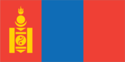
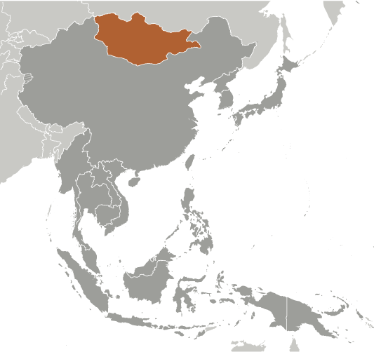
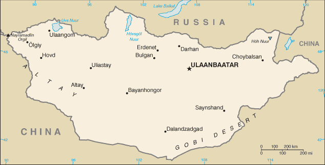

# Mongolia

## Introduction

**_Background:_**   
The Mongols gained fame in the 13th century when under Chinggis KHAAN they established a huge Eurasian empire through conquest. After his death the empire was divided into several powerful Mongol states, but these broke apart in the 14th century. The Mongols eventually retired to their original steppe homelands and in the late 17th century came under Chinese rule. Mongolia won its independence in 1921 with Soviet backing and a communist regime was installed in 1924. The modern country of Mongolia, however, represents only part of the Mongols' historical homeland; more ethnic Mongolians live in the Inner Mongolia Autonomous Region in the People's Republic of China than in Mongolia. Following a peaceful democratic revolution, the ex-communist Mongolian People's Revolutionary Party (MPRP) won elections in 1990 and 1992, but was defeated by the Democratic Union Coalition (DUC) in the 1996 parliamentary election. The MPRP won an overwhelming majority in the 2000 parliamentary election, but the party lost seats in the 2004 election and shared power with democratic coalition parties from 2004-08. The MPRP regained a solid majority in the 2008 parliamentary elections but nevertheless formed a coalition government with the Democratic Party that lasted until January 2012. In 2009, current President ELBEGDORJ of the Democratic Party was elected to office and was re-elected for his second term in June 2013. In 2010, the MPRP voted to retake the name of the Mongolian People's Party (MPP), a name it used in the early 1920s. Shortly thereafter, a new party was formed by former president ENKHBAYAR, which adopted the MPRP name. In the 2012 Parliamentary elections, a coalition of four political parties led by the Democratic Party, gained control of the Parliament.

## Geography

**_Location:_**   
Northern Asia, between China and Russia

**_Geographic coordinates:_**   
46 00 N, 105 00 E

**_Map references:_**   
Asia

**_Area:_**   
**total:** 1,564,116 sq km   
**land:** 1,553,556 sq km   
**water:** 10,560 sq km

**_Area - comparative:_**   
slightly smaller than Alaska

**_Land boundaries:_**   
**total:** 8,220 km   
**border countries:** China 4,677 km, Russia 3,543 km

**_Coastline:_**   
0 km (landlocked)

**_Maritime claims:_**   
none (landlocked)

**_Climate:_**   
desert; continental (large daily and seasonal temperature ranges)

**_Terrain:_**   
vast semidesert and desert plains, grassy steppe, mountains in west and southwest; Gobi Desert in south-central

**_Elevation extremes:_**   
**lowest point:** Hoh Nuur 560 m   
**highest point:** Nayramadlin Orgil (Huyten Orgil) 4,374 m

**_Natural resources:_**   
oil, coal, copper, molybdenum, tungsten, phosphates, tin, nickel, zinc, fluorspar, gold, silver, iron

**_Land use:_**   
**arable land:** 0.39%   
**permanent crops:** 0%   
**other:** 99.61% (2011)

**_Irrigated land:_**   
843 sq km (2003)

**_Total renewable water resources:_**   
34.8 cu km (2011)

**_Freshwater withdrawal (domestic/industrial/agricultural):_**   
**total:** 0.55 cu km/yr (13%/43%/44%)   
**per capita:** 196.8 cu m/yr (2009)

**_Natural hazards:_**   
dust storms; grassland and forest fires; drought; "zud," which is harsh winter conditions

**_Environment - current issues:_**   
limited natural freshwater resources in some areas; the policies of former Communist regimes promoted rapid urbanization and industrial growth that had negative effects on the environment; the burning of soft coal in power plants and the lack of enforcement of environmental laws severely polluted the air in Ulaanbaatar; deforestation, overgrazing, and the converting of virgin land to agricultural production increased soil erosion from wind and rain; desertification and mining activities had a deleterious effect on the environment

**_Environment - international agreements:_**   
**party to:** Biodiversity, Climate Change, Climate Change-Kyoto Protocol, Desertification, Endangered Species, Environmental Modification, Hazardous Wastes, Law of the Sea, Ozone Layer Protection, Ship Pollution, Wetlands, Whaling   
**signed, but not ratified:** none of the selected agreements

**_Geography - note:_**   
landlocked; strategic location between China and Russia

## People and Society

**_Nationality:_**   
**noun:** Mongolian(s)   
**adjective:** Mongolian

**_Ethnic groups:_**   
Khalkh 81.9%, Kazak 3.8%, Dorvod 2.7%, Bayad 2.1%, Buryat-Bouriates 1.7%, Zakhchin 1.2%, Dariganga 1%, Uriankhai 1%, other 4.6% (2010 est.)

**_Languages:_**   
Khalkha Mongol 90% (official), Turkic, Russian (1999)

**_Religions:_**   
Buddhist 53%, Muslim 3%, Christian 2.2%, Shamanist 2.9%, other 0.4%, none 38.6% (2010 est.)

**_Population:_**   
2,953,190 (July 2014 est.)

**_Age structure:_**   
**0-14 years:** 26.8% (male 404,051/female 388,546)   
**15-24 years:** 18.7% (male 278,912/female 273,167)   
**25-54 years:** 44.5% (male 636,799/female 677,236)   
**55-64 years:** 5.9% (male 80,267/female 94,021)   
**65 years and over:** 4% (male 49,314/female 70,877) (2014 est.)

**_Dependency ratios:_**   
**total dependency ratio:** 45.4 %   
**youth dependency ratio:** 39.9 %   
**elderly dependency ratio:** 5.5 %   
**potential support ratio:** 18 (2014 est.)

**_Median age:_**   
**total:** 27.1 years   
**male:** 26.3 years   
**female:** 27.8 years (2014 est.)

**_Population growth rate:_**   
1.37% (2014 est.)

**_Birth rate:_**   
20.88 births/1,000 population (2014 est.)

**_Death rate:_**   
6.38 deaths/1,000 population (2014 est.)

**_Net migration rate:_**   
-0.85 migrant(s)/1,000 population (2014 est.)

**_Urbanization:_**   
**urban population:** 68.5% of total population (2011)   
**rate of urbanization:** 2.81% annual rate of change (2010-15 est.)

**_Major urban areas - population:_**   
ULAANBAATAR (capital) 1.184 million (2011)

**_Sex ratio:_**   
**at birth:** 1.05 male(s)/female   
**0-14 years:** 1.04 male(s)/female   
**15-24 years:** 1.02 male(s)/female   
**25-54 years:** 0.94 male(s)/female   
**55-64 years:** 0.96 male(s)/female   
**65 years and over:** 0.77 male(s)/female   
**total population:** 1 male(s)/female (2014 est.)

**_Mother's mean age at first birth:_**   
21.9   
**note:** median age at first birth among women 25-29 (2008 est.)

**_Maternal mortality rate:_**   
63 deaths/100,000 live births (2010)

**_Infant mortality rate:_**   
**total:** 23.15 deaths/1,000 live births   
**male:** 26.4 deaths/1,000 live births   
**female:** 19.75 deaths/1,000 live births (2014 est.)

**_Life expectancy at birth:_**   
**total population:** 68.98 years   
**male:** 64.72 years   
**female:** 73.45 years (2014 est.)

**_Total fertility rate:_**   
2.22 children born/woman (2014 est.)

**_Contraceptive prevalence rate:_**   
55% (2010)

**_Health expenditures:_**   
5.3% of GDP (2011)

**_Physicians density:_**   
2.76 physicians/1,000 population (2008)

**_Hospital bed density:_**   
6.8 beds/1,000 population (2011)

**_Drinking water source:_**   
**improved:** urban: 94.8% of population; rural: 61.2% of population; total: 84.6% of population   
**unimproved:** urban: 5.2% of population; rural: 38.8% of population; total: 15.4% of population (2012 est.)

**_Sanitation facility access:_**   
**improved:** urban: 65.3% of population; rural: 35.4% of population; total: 56.2% of population   
**unimproved:** urban: 34.7% of population; rural: 64.6% of population; total: 43.8% of population (2012 est.)

**_HIV/AIDS - adult prevalence rate:_**   
less than 0.1% (2009 est.)

**_HIV/AIDS - people living with HIV/AIDS:_**   
fewer than 500 (2009 est.)

**_HIV/AIDS - deaths:_**   
fewer than 100 (2009 est.)

**_Obesity - adult prevalence rate:_**   
14.4% (2008)

**_Children under the age of 5 years underweight:_**   
5.3% (2005)

**_Education expenditures:_**   
5.5% of GDP (2011)

**_Literacy:_**   
**definition:** age 15 and over can read and write   
**total population:** 97.4%   
**male:** 96.8%   
**female:** 97.9% (2011 est.)

**_School life expectancy (primary to tertiary education):_**   
**total:** 15 years   
**male:** 14 years   
**female:** 16 years (2012)

**_Child labor - children ages 5-14:_**   
**total number:** 106,203   
**percentage:** 18 % (2005 est.)

**_Unemployment, youth ages 15-24:_**   
**total:** 11.9%   
**male:** 10.7%   
**female:** 13.2% (2011)

## Government

**_Country name:_**   
**conventional long form:** none   
**conventional short form:** Mongolia   
**local long form:** none   
**local short form:** Mongol Uls   
**former:** Outer Mongolia

**_Government type:_**   
parliamentary

**_Capital:_**   
**name:** Ulaanbaatar   
**geographic coordinates:** 47 55 N, 106 55 E   
**time difference:** UTC+8 (13 hours ahead of Washington, DC, during Standard Time)

**_Administrative divisions:_**   
21 provinces (aymguud, singular - aymag) and 1 municipality\* (singular - hot); Arhangay, Bayanhongor, Bayan-Olgiy, Bulgan, Darhan-Uul, Dornod, Dornogovi, Dundgovi, Dzavhan (Zavkhan), Govi-Altay, Govisumber, Hentiy, Hovd, Hovsgol, Omnogovi, Orhon, Ovorhangay, Selenge, Suhbaatar, Tov, Ulaanbaatar\*, Uvs

**_Independence:_**   
11 July 1921 (from China)

**_National holiday:_**   
Independence Day/Revolution Day, 11 July (1921)

**_Constitution:_**   
several previous; latest adopted 13 January 1992, effective 12 February 1992; amended 1999, 2001 (2011)

**_Legal system:_**   
civil law system influenced by Soviet and Romano-Germanic legal systems; constitution ambiguous on judicial review of legislative acts

**_International law organization participation:_**   
has not submitted an ICJ jurisdiction declaration; accepts ICCt jurisdiction

**_Suffrage:_**   
18 years of age; universal

**_Executive branch:_**   
**chief of state:** President Tsakhia ELBEGDORJ (since 18 June 2009)   
**head of government:** Prime Minister Norov ALTANKHUYAG (since 9 August 2012); Deputy Prime Minister Dendev TERBISHDAGVA (since 20 August 2012)   
**cabinet:** Cabinet nominated by the prime minister in consultation with the president and confirmed by the State Great Hural (parliament)   
**elections:** presidential candidates nominated by political parties represented in State Great Hural and elected by popular vote for a four-year term (eligible for a second term); election last held on 26 June 2013 (next to be held in June 2017); following legislative elections, leaders of the majority party or a majority coalition usually elect the prime minister of the State Great Hural   
**election results:** Tsakhia ELBEGDORJ elected president; percent of vote - Tsakhia ELBEGDORJ 50.2%, Badmaanyambuu BAT-ERDENE 42%, Natsag UDVAL 6.5%, other 1.3%

**_Legislative branch:_**   
unicameral State Great Hural (76 seats; of which 48 members are directly elected from 26 electoral districts, while 28 members are proportionally elected based on a party's share of the total votes; all serve four-year terms)   
**elections:** last held on 28 June 2012 (next to be held in June 2016)   
**election results:** percent of vote by party - NA; seats by party - DP 33, MPP 25, Justice Coalition 11, others 5, vacant 2

**_Judicial branch:_**   
**highest court(s):** Supreme Court (consists of the Chief Justice and 16 judges organized into civil, criminal, and administrative chambers); Constitutional Court or Tsets (consists of a chairman and 8 members)   
**judge selection and term of office:** Supreme Court chief justice and judges appointed by the president upon recommendation to the State Great Hural by the General Council of Courts; term of appointment is for life; chairman of the Constitutional Court elected from among its members; members appointed by the State Great Heral upon nominations - 3 each by the president, the State Great Hural, and the Supreme Court; term of appointment is 6 years; chairmanship limited to a single renewable 3-year term   
**subordinate courts:** aimag (provincial) and capital city appellate courts; soum, inter-soum, and district courts; Administrative Cases Courts (established in 2004)

**_Political parties and leaders:_**   
Civil Will-Green Party or CWGP [Sanjaasuren OYUN]   
Democratic Party or DP [Norov ALTANHUYAG]   
Justice Coalition (includes MPRP and MNDP)   
Mongolian National Democratic Party or MNDP [Mendsaikhan ENKHSAIKHAN]   
Mongolian People's Party or MPP [Miyegombo ENKHBOLD]   
Mongolian People's Revolutionary Party or MPRP [Nambar ENKHBAYAR]

**_Political pressure groups and leaders:_**   
**other:** human rights groups; women's groups

**_International organization participation:_**   
ADB, ARF, CD, CICA, CP, EBRD, EITI (compliant country), FAO, G-77, IAEA, IBRD, ICAO, ICC (NGOs), ICRM, IDA, IFAD, IFC, IFRCS, ILO, IMF, IMO, IMSO, Interpol, IOC, IOM, IPU, ISO, ITSO, ITU, ITUC, MIGA, MINURSO, MONUSCO, NAM, OPCW, OSCE, SCO (observer), UN, UNAMID, UNCTAD, UNESCO, UNIDO, UNISFA, UNMISS, UNWTO, UPU, WCO, WHO, WIPO, WMO, WTO

**_Diplomatic representation in the US:_**   
**chief of mission:** Ambassador Bulgaa ALTANGEREL (since 8 January 2013)   
**chancery:** 2833 M Street NW, Washington, DC 20007   
**telephone:** [1] (202) 333-7117   
**FAX:** [1] (202) 298-9227   
**consulate(s) general:** New York, San Francisco

**_Diplomatic representation from the US:_**   
**chief of mission:** Ambassador Piper Anne Wind CAMPBELL (since 6 August 2012)   
**embassy:** Denver Street #3, 11th Micro Region, Big Ring Road, Ulaanbaatar, 14190 Mongolia   
**mailing address:** PSC 461, Box 300, FPO AP 96521-0002; P.O. Box 341, Ulaanbaatar-14192   
**telephone:** [976] 7007-6001   
**FAX:** [976] 7007-6016

**_Flag description:_**   
three equal, vertical bands of red (hoist side), blue, and red; centered on the hoist-side red band in yellow is the national emblem ("soyombo" - a columnar arrangement of abstract and geometric representation for fire, sun, moon, earth, water, and the yin-yang symbol); blue represents the sky, red symbolizes progress and prosperity

**_National symbol(s):_**   
soyombo emblem

**_National anthem:_**   
**name:** "Mongol ulsyn toriin duulal" (National Anthem of Mongolia)   
**lyrics/music:** Tsendiin DAMDINSUREN/Bilegiin DAMDINSUREN and Luvsanjamts MURJORJ   
**note:** music adopted 1950, lyrics adopted 2006; the anthem's lyrics have been altered on numerous occasions

## Economy

**_Economy - overview:_**   
Mongolia's extensive mineral deposits and attendant growth in mining-sector activities have transformed Mongolia's economy, which traditionally has been dependent on herding and agriculture. Mongolia's copper, gold, coal, molybdenum, fluorspar, uranium, tin, and tungsten deposits, among others, have attracted foreign direct investment. Soviet assistance, at its height one-third of GDP, disappeared almost overnight in 1990 and 1991 at the time of the dismantlement of the USSR. The following decade saw Mongolia endure both deep recession, because of political inaction and natural disasters, as well as economic growth, because of reform-embracing, free-market economics and extensive privatization of the formerly state-run economy. The country opened a fledgling stock exchange in 1991. Mongolia joined the World Trade Organization in 1997 and seeks to expand its participation in regional economic and trade regimes. Growth averaged nearly 9% per year in 2004-08 largely because of high copper prices globally and new gold production. By late 2008, Mongolia was hit hard by the global financial crisis. Slower global economic growth hurt the country's exports, notably copper, and slashed government revenues. As a result, Mongolia's real economy contracted 1.3% in 2009. In early 2009, the International Monetary Fund reached a $236 million Stand-by Arrangement with Mongolia and the country has largely emerged from the crisis with better regulations and closer supervision. The banking sector strengthened but weaknesses remain. In October 2009, Mongolia passed long-awaited legislation on an investment agreement to develop the Oyu Tolgoi mine, considered to be among the world's largest untapped copper-gold deposits. Mongolia's ongoing dispute with a foreign investor over Oyu Tolgoi, however, has called into question the attractiveness of Mongolia as a destination for foreign direct investment. Negotiations to develop the massive Tavan Tolgoi coal field also have stalled. The economy has grown more than 10% per year since 2010, largely on the strength of commodity exports to nearby countries and high government spending domestically. Mongolia's economy, however, faces near-term economic risks from the government's loose fiscal and monetary policies, which are contributing to high inflation, and from uncertainties in foreign demand for Mongolian exports. Trade with China represents more than half of Mongolia's total external trade - China receives more than 90% of Mongolia's exports and is Mongolia's largest supplier. Mongolia has relied on Russia for energy supplies, leaving it vulnerable to price increases; in the first 11 months of 2013, Mongolia purchased 76% of its gasoline and diesel fuel and a substantial amount of electric power from Russia. A drop in foreign direct investment and a decrease in Chinese demand for Mongolia's mineral exports are putting pressure on Mongolia's balance of payments. Remittances from Mongolians working abroad, particularly in South Korea, are significant.

**_GDP (purchasing power parity):_**   
$17.03 billion (2013 est.)   
$15.23 billion (2012 est.)   
$13.57 billion (2011 est.)   
**note:** data are in 2013 US dollars

**_GDP (official exchange rate):_**   
$11.14 billion (2013 est.)

**_GDP - real growth rate:_**   
11.8% (2013 est.)   
12.3% (2012 est.)   
17.5% (2011 est.)

**_GDP - per capita (PPP):_**   
$5,900 (2013 est.)   
$5,400 (2012 est.)   
$4,900 (2011 est.)   
**note:** data are in 2013 US dollars

**_GDP - composition, by end use:_**   
**household consumption:** 58.5%   
**government consumption:** 14.9%   
**investment in fixed capital:** 55.8%   
**investment in inventories:** 0%   
**exports of goods and services:** 50%   
**imports of goods and services:** -79.2%; (2013 est.)

**_GDP - composition, by sector of origin:_**   
**agriculture:** 16.5%   
**industry:** 32.6%   
**services:** 50.9% (2013 est.)

**_Agriculture - products:_**   
wheat, barley, vegetables, forage crops; sheep, goats, cattle, camels, horses

**_Industries:_**   
construction and construction materials; mining (coal, copper, molybdenum, fluorspar, tin, tungsten, gold); oil; food and beverages; processing of animal products, cashmere and natural fiber manufacturing

**_Industrial production growth rate:_**   
11% (2013 est.)

**_Labor force:_**   
1.037 million (2011 est.)

**_Labor force - by occupation:_**   
**agriculture:** 33%   
**industry:** 10.6%   
**services:** 56.4% (2011)

**_Unemployment rate:_**   
9% (2011 est.)   
13% (2010)

**_Population below poverty line:_**   
29.8% (2011 est.)

**_Household income or consumption by percentage share:_**   
**lowest 10%:** 3%   
**highest 10%:** 28.4% (2008)

**_Distribution of family income - Gini index:_**   
36.5 (2008)   
32.8 (2002)

**_Budget:_**   
**revenues:** $3.462 billion   
**expenditures:** $4.36 billion (2013 est.)

**_Taxes and other revenues:_**   
31.1% of GDP (2013 est.)

**_Budget surplus (+) or deficit (-):_**   
-8.1% of GDP (2013 est.)

**_Fiscal year:_**   
calendar year

**_Inflation rate (consumer prices):_**   
8.2% (2013 est.)   
15% (2012 est.)

**_Central bank discount rate:_**   
13.25% (31 December 2012)   
12.25% (31 December 2011 est.)

**_Commercial bank prime lending rate:_**   
17.5% (31 December 2013 est.)   
18.2% (31 December 2012 est.)

**_Stock of narrow money:_**   
$1.219 billion (31 December 2013 est.)   
$1.318 billion (31 December 2012 est.)

**_Stock of broad money:_**   
$6.329 billion (31 December 2013 est.)   
$5.472 billion (31 December 2012 est.)

**_Stock of domestic credit:_**   
$3.297 billion (31 December 2013 est.)   
$3.09 billion (31 December 2012 est.)

**_Market value of publicly traded shares:_**   
$1.293 billion (31 December 2012 est.)   
$1.579 billion (31 December 2011)   
$1.093 billion (31 December 2010 est.)

**_Current account balance:_**   
-$3.639 billion (2013 est.)   
-$3.362 billion (2012 est.)

**_Exports:_**   
$4.294 billion (2013 est.)   
$4.382 billion (2012 est.)

**_Exports - commodities:_**   
copper, apparel, livestock, animal products, cashmere, wool, hides, fluorspar, other nonferrous metals, coal, crude oil

**_Exports - partners:_**   
China 89%, Canada 4.1% (2012)

**_Imports:_**   
$5.696 billion (2013 est.)   
$5.934 billion (2012 est.)

**_Imports - commodities:_**   
machinery and equipment, fuel, cars, food products, industrial consumer goods, chemicals, building materials, cigarettes and tobacco, appliances, soap and detergent

**_Imports - partners:_**   
China 37.5%, Russia 25.6%, US 9.4%, South Korea 6.1%, Japan 4.9% (2012)

**_Debt - external:_**   
$4.954 billion (31 December 2013 est.)   
$4.669 billion (31 December 2012 est.)

**_Stock of direct foreign investment - at home:_**   
$1.69 billion (31 December 2013 est.)   
$4.452 billion (31 December 2012 est.)

**_Stock of direct foreign investment - abroad:_**   
$NA (31 December 2013 est.)   
$44 million (31 December 2012 est.)

**_Exchange rates:_**   
togrog/tugriks (MNT) per US dollar -   
1,444.3 (2013 est.)   
1,357.6 (2012 est.)   
1,357.1 (2010 est.)   
1,442.8 (2009)   
1,170 (2007)

## Energy

**_Electricity - production:_**   
4.48 billion kWh (2010 est.)

**_Electricity - consumption:_**   
3.951 billion kWh (2010 est.)

**_Electricity - exports:_**   
22 million kWh (2010 est.)

**_Electricity - imports:_**   
263 million kWh (2010 est.)

**_Electricity - installed generating capacity:_**   
833,200 kW (2010 est.)

**_Electricity - from fossil fuels:_**   
99.9% of total installed capacity (2010 est.)

**_Electricity - from nuclear fuels:_**   
0% of total installed capacity (2010 est.)

**_Electricity - from hydroelectric plants:_**   
0% of total installed capacity (2010 est.)

**_Electricity - from other renewable sources:_**   
0.1% of total installed capacity (2010 est.)

**_Crude oil - production:_**   
9,935 bbl/day (2012 est.)

**_Crude oil - exports:_**   
5,680 bbl/day (2010 est.)

**_Crude oil - imports:_**   
0 bbl/day (2010 est.)

**_Crude oil - proved reserves:_**   
NA bbl

**_Refined petroleum products - production:_**   
0 bbl/day (2010 est.)

**_Refined petroleum products - consumption:_**   
21,610 bbl/day (2011 est.)

**_Refined petroleum products - exports:_**   
0 bbl/day (2010 est.)

**_Refined petroleum products - imports:_**   
17,360 bbl/day (2010 est.)

**_Natural gas - production:_**   
0 cu m (2011 est.)

**_Natural gas - consumption:_**   
0 cu m (2010 est.)

**_Natural gas - exports:_**   
0 cu m (2011 est.)

**_Natural gas - imports:_**   
0 cu m (2011 est.)

**_Natural gas - proved reserves:_**   
0 cu m (1 January 2013 est.)

**_Carbon dioxide emissions from consumption of energy:_**   
10.21 million Mt (2011 est.)

## Communications

**_Telephones - main lines in use:_**   
176,700 (2012)

**_Telephones - mobile cellular:_**   
3.375 million (2012)

**_Telephone system:_**   
**general assessment:** network is improving with international direct dialing available in many areas; a fiber-optic network has been installed that is improving broadband and communication services between major urban centers with multiple companies providing inter-city fiber-optic cable services   
**domestic:** very low fixed-line teledensity; there are multiple mobile-cellular providers and subscribership is increasing   
**international:** country code - 976; satellite earth stations - 7 (2011)

**_Broadcast media:_**   
following a law passed in 2005, Mongolia's state-run radio and TV provider converted to a public service provider; also available are private radio and TV broadcasters, as well as multi-channel satellite and cable TV providers; more than 100 radio stations, including some 20 via repeaters for the public broadcaster; transmissions of multiple international broadcasters are available (2008)

**_Internet country code:_**   
.mn

**_Internet hosts:_**   
20,084 (2012)

**_Internet users:_**   
330,000 (2008)

## Transportation

**_Airports:_**   
44 (2013)

**_Airports - with paved runways:_**   
**total:** 15   
**over 3,047 m:** 2   
**2,438 to 3,047 m:** 10   
**1,524 to 2,437 m:** 3 (2013)

**_Airports - with unpaved runways:_**   
**total:** 29   
**over 3,047 m:** 2   
**2,438 to 3,047 m:** 2   
**1,524 to 2,437 m:** 24   
**under 914 m:** 1 (2013)

**_Heliports:_**   
1 (2013)

**_Railways:_**   
**total:** 1,908 km   
**broad gauge:** 1,908 km 1.520-m gauge   
**note:** the railway is 50 percent owned by the Russian State Railway (2010)

**_Roadways:_**   
**total:** 49,249 km   
**paved:** 4,800 km   
**unpaved:** 44,449 km (2013)

**_Waterways:_**   
580 km (the only waterway in operation is Lake Hovsgol) (135 km); Selenge River (270 km) and Orhon River (175 km) are navigable but carry little traffic; lakes and rivers freeze in winter, they are open from May to September) (2010)

**_Merchant marine:_**   
**total:** 57   
**by type:** bulk carrier 21, cargo 25, chemical tanker 1, container 2, liquefied gas 2, passenger/cargo 2, roll on/roll off 3, vehicle carrier 1   
**foreign-owned:** 44 (Indonesia 2, Japan 2, North Korea 1, Russia 2, Singapore 3, Ukraine 1, Vietnam 33) (2010)

## Military

**_Military branches:_**   
Mongolian Armed Forces (Mongol ulsyn zevsegt huchin): Mongolian Army (includes Mongolian Air and Air Defense, which is to become a separate service in 2015); there is no navy (2013)

**_Military service age and obligation:_**   
18-25 years of age for compulsory and voluntary military service; conscript service obligation is 12 months in land or air defense forces or police; a small portion of Mongolian land forces (2.5 percent) is comprised of contract soldiers; women cannot be deployed overseas for military operations (2012)

**_Manpower available for military service:_**   
**males age 16-49:** 898,546   
**females age 16-49:** 891,192 (2010 est.)

**_Manpower fit for military service:_**   
**males age 16-49:** 726,199   
**females age 16-49:** 756,628 (2010 est.)

**_Manpower reaching militarily significant age annually:_**   
**male:** 30,829   
**female:** 29,648 (2010 est.)

**_Military expenditures:_**   
1.12% of GDP (2012)   
0.99% of GDP (2011)   
1.12% of GDP (2010)

## Transnational Issues

**_Disputes - international:_**   
none

............................................................   
_Page last updated on June 20, 2014_
