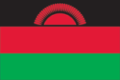
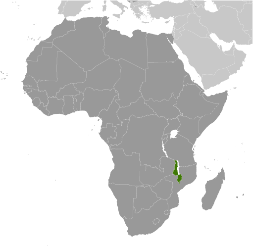
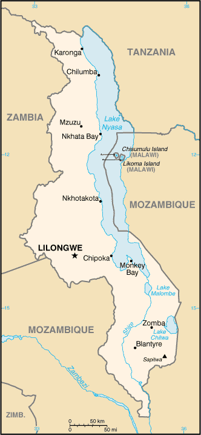

# Malawi

## Introduction

**_Background:_**   
Established in 1891, the British protectorate of Nyasaland became the independent nation of Malawi in 1964. After three decades of one-party rule under President Hastings Kamuzu BANDA the country held multiparty elections in 1994, under a provisional constitution that came into full effect the following year. President Bingu wa MUTHARIKA, elected in May 2004 after a failed attempt by the previous president to amend the constitution to permit another term, struggled to assert his authority against his predecessor and subsequently started his own party, the Democratic Progressive Party (DPP) in 2005. MUTHARIKA was reelected to a second term in May 2009. He oversaw some economic improvement in his first term, but was accused of economic mismanagement and poor governance in his second term. He died abruptly in April 2012 and was succeeded by his vice president, Joyce BANDA, who had earlier started her own party, the People's Party (PP). Population growth, increasing pressure on agricultural lands, corruption, and the scourge of HIV/AIDS pose major problems for Malawi.

## Geography

**_Location:_**   
Southern Africa, east of Zambia, west and north of Mozambique

**_Geographic coordinates:_**   
13 30 S, 34 00 E

**_Map references:_**   
Africa

**_Area:_**   
**total:** 118,484 sq km   
**land:** 94,080 sq km   
**water:** 24,404 sq km

**_Area - comparative:_**   
slightly smaller than Pennsylvania

**_Land boundaries:_**   
**total:** 2,881 km   
**border countries:** Mozambique 1,569 km, Tanzania 475 km, Zambia 837 km

**_Coastline:_**   
0 km (landlocked)

**_Maritime claims:_**   
none (landlocked)

**_Climate:_**   
sub-tropical; rainy season (November to May); dry season (May to November)

**_Terrain:_**   
narrow elongated plateau with rolling plains, rounded hills, some mountains

**_Elevation extremes:_**   
**lowest point:** junction of the Shire River and international boundary with Mozambique 37 m   
**highest point:** Sapitwa (Mount Mlanje) 3,002 m

**_Natural resources:_**   
limestone, arable land, hydropower, unexploited deposits of uranium, coal, and bauxite

**_Land use:_**   
**arable land:** 30.38%   
**permanent crops:** 1.1%   
**other:** 68.52% (2011)

**_Irrigated land:_**   
735 sq km (2006)

**_Total renewable water resources:_**   
17.28 cu km (2011)

**_Freshwater withdrawal (domestic/industrial/agricultural):_**   
**total:** 1.36 cu km/yr (11%/4%/86%)   
**per capita:** 99.86 cu m/yr (2005)

**_Natural hazards:_**   
NA

**_Environment - current issues:_**   
deforestation; land degradation; water pollution from agricultural runoff, sewage, industrial wastes; siltation of spawning grounds endangers fish populations

**_Environment - international agreements:_**   
**party to:** Biodiversity, Climate Change, Climate Change-Kyoto Protocol, Desertification, Endangered Species, Environmental Modification, Hazardous Wastes, Marine Life Conservation, Ozone Layer Protection, Ship Pollution, Wetlands   
**signed, but not ratified:** Law of the Sea

**_Geography - note:_**   
landlocked; Lake Nyasa, some 580 km long, is the country's most prominent physical feature; it contains more fish species than any other lake on earth

## People and Society

**_Nationality:_**   
**noun:** Malawian(s)   
**adjective:** Malawian

**_Ethnic groups:_**   
Chewa 32.6%, Lomwe 17.6%, Yao 13.5%, Ngoni 11.5%, Tumbuka 8.8%, Nyanja 5.8%, Sena 3.6%, Tonga 2.1%, Ngonde 1%, other 3.5%

**_Languages:_**   
English (official), Chichewa (common), Chinyanja, Chiyao, Chitumbuka, Chilomwe, Chinkhonde, Chingoni, Chisena, Chitonga, Chinyakyusa, Chilambya

**_Religions:_**   
Christian 82.6%, Muslim 13%, other 1.9%, none 2.5% (2008 est.)

**_Population:_**   
17,377,468   
**note:** estimates for this country explicitly take into account the effects of excess mortality due to AIDS; this can result in lower life expectancy, higher infant mortality, higher death rates, lower population growth rates, and changes in the distribution of population by age and sex than would otherwise be expected (July 2014 est.)

**_Age structure:_**   
**0-14 years:** 46.9% (male 4,056,810/female 4,100,841)   
**15-24 years:** 20.2% (male 1,748,919/female 1,765,212)   
**25-54 years:** 27.1% (male 2,329,952/female 2,371,274)   
**55-64 years:** 3.1% (male 256,034/female 280,997)   
**65 years and over:** 2.7% (male 206,923/female 260,506) (2014 est.)

**_Dependency ratios:_**   
**total dependency ratio:** 93.3 %   
**youth dependency ratio:** 87 %   
**elderly dependency ratio:** 6.3 %   
**potential support ratio:** 16 (2014 est.)

**_Median age:_**   
**total:** 16.3 years   
**male:** 16.2 years   
**female:** 16.4 years (2014 est.)

**_Population growth rate:_**   
3.33% (2014 est.)

**_Birth rate:_**   
41.8 births/1,000 population (2014 est.)

**_Death rate:_**   
8.74 deaths/1,000 population (2014 est.)

**_Net migration rate:_**   
0.25 migrant(s)/1,000 population (2014 est.)

**_Urbanization:_**   
**urban population:** 15.7% of total population (2011)   
**rate of urbanization:** 4.2% annual rate of change (2010-15 est.)

**_Major urban areas - population:_**   
LILONGWE (capital) 772,000 (2011)

**_Sex ratio:_**   
**at birth:** 1.02 male(s)/female   
**0-14 years:** 0.99 male(s)/female   
**15-24 years:** 0.99 male(s)/female   
**25-54 years:** 0.98 male(s)/female   
**55-64 years:** 0.98 male(s)/female   
**65 years and over:** 0.75 male(s)/female   
**total population:** 0.99 male(s)/female (2014 est.)

**_Mother's mean age at first birth:_**   
18.9   
**note:** median age at first birth among women 25-29 (2010 est.)

**_Maternal mortality rate:_**   
460 deaths/100,000 live births (2010)

**_Infant mortality rate:_**   
**total:** 48.01 deaths/1,000 live births   
**male:** 54.94 deaths/1,000 live births   
**female:** 40.98 deaths/1,000 live births (2014 est.)

**_Life expectancy at birth:_**   
**total population:** 59.99 years   
**male:** 58.04 years   
**female:** 61.97 years (2014 est.)

**_Total fertility rate:_**   
5.66 children born/woman (2014 est.)

**_Contraceptive prevalence rate:_**   
46.1% (2010)

**_Health expenditures:_**   
8.4% of GDP (2011)

**_Physicians density:_**   
0.02 physicians/1,000 population (2008)

**_Hospital bed density:_**   
1.3 beds/1,000 population (2011)

**_Drinking water source:_**   
**improved:** urban: 94.6% of population; rural: 83.2% of population; total: 85% of population   
**unimproved:** urban: 5.4% of population; rural: 16.8% of population; total: 15% of population (2012 est.)

**_Sanitation facility access:_**   
**improved:** urban: 22.3% of population; rural: 8% of population; total: 10.3% of population   
**unimproved:** urban: 77.7% of population; rural: 92% of population; total: 89.7% of population (2012 est.)

**_HIV/AIDS - adult prevalence rate:_**   
10.8% (2012 est.)

**_HIV/AIDS - people living with HIV/AIDS:_**   
1,129,800 (2012 est.)

**_HIV/AIDS - deaths:_**   
45,600 (2012 est.)

**_Major infectious diseases:_**   
**degree of risk:** very high   
**food or waterborne diseases:** bacterial and protozoal diarrhea, hepatitis A, and typhoid fever   
**vectorborne diseases:** malaria and dengue fever   
**water contact disease:** schistosomiasis   
**animal contact disease:** rabies (2013)

**_Obesity - adult prevalence rate:_**   
4.3% (2008)

**_Children under the age of 5 years underweight:_**   
13.8% (2010)

**_Education expenditures:_**   
5.4% of GDP (2011)

**_Literacy:_**   
**definition:** age 15 and over can read and write   
**total population:** 74.8%   
**male:** 81.1%   
**female:** 68.5% (2010 est.)

**_School life expectancy (primary to tertiary education):_**   
**total:** 11 years   
**male:** 11 years   
**female:** 11 years (2011)

**_Child labor - children ages 5-14:_**   
**total number:** 993,318   
**percentage:** 26 % (2006 est.)

## Government

**_Country name:_**   
**conventional long form:** Republic of Malawi   
**conventional short form:** Malawi   
**local long form:** Dziko la Malawi   
**local short form:** Malawi   
**former:** British Central African Protectorate, Nyasaland Protectorate, Nyasaland

**_Government type:_**   
multiparty democracy

**_Capital:_**   
**name:** Lilongwe   
**geographic coordinates:** 13 58 S, 33 47 E   
**time difference:** UTC+2 (7 hours ahead of Washington, DC, during Standard Time)

**_Administrative divisions:_**   
28 districts; Balaka, Blantyre, Chikwawa, Chiradzulu, Chitipa, Dedza, Dowa, Karonga, Kasungu, Likoma, Lilongwe, Machinga, Mangochi, Mchinji, Mulanje, Mwanza, Mzimba, Neno, Ntcheu, Nkhata Bay, Nkhotakota, Nsanje, Ntchisi, Phalombe, Rumphi, Salima, Thyolo, Zomba

**_Independence:_**   
6 July 1964 (from the UK)

**_National holiday:_**   
Independence Day (Republic Day), 6 July (1964)

**_Constitution:_**   
previous 1953 (preindependence), 1966; latest drafted January to May 1994, approved 16 May 1994, entered into force 18 May 1995; amended several times, last in 2013 (2013)

**_Legal system:_**   
mixed legal system of English common law and customary law; judicial review of legislative acts in the Supreme Court of Appeal

**_International law organization participation:_**   
accepts compulsory ICJ jurisdiction with reservations; accepts ICCt jurisdiction

**_Suffrage:_**   
18 years of age; universal

**_Executive branch:_**   
**chief of state:** President Arthur Peter MUTHARIKA (since 31 May 2014); Vice President Saulos CHILIMA (since 31 May 2014); note - the president is both chief of state and head of government   
**head of government:** President Arthur Peter MUTHARIKA (since 31 May 2014); Vice President Saulos CHILIMA (since 31 May 2014)   
**cabinet:** 26-32-member Cabinet named by the president   
**elections:** president elected by popular vote for a five-year term (eligible for a second term); election last held on 20 May 2014 (next to be held in May 2019)   
**election results:** Peter MUTHARIKA elected president; percent of vote - Peter MUTHARIKA 36.4%, Lazarus CHAKWERA 27.8%, Joyce BANDA 20.2%, Atupele MULUZI 13.7%, other 1.9%

**_Legislative branch:_**   
unicameral National Assembly (193 seats; members elected by popular vote to serve five-year terms)   
**elections:** last held on 19 May 2009 (next to be held 20 May 2014)   
**election results:** percent of vote by party - NA; seats by party - DPP 114, MCP 26, UDF 17, independents 32, other 4

**_Judicial branch:_**   
**highest court(s):** Supreme Court of Appeal (consists of the chief justice and at least 3 judges)   
**judge selection and term of office:** Supreme Court chief justice appointed by the president and confirmed by the National Assembly; other judges appointed by the president upon recommendation of the Judicial Service Commission, which regulates judicial officers; judges serve until age 65   
**subordinate courts:** High Court; magistrate courts; Industrial Relations Court; district and city traditional or local courts

**_Political parties and leaders:_**   
Alliance for Democracy or AFORD [Godfrey SHAWA]   
Chipani Cha Fuko or CCP [Davis KATSONGA PHIRI]   
Christian Liberation Party or CONU [Sylvester CHABUKA]   
Democratic Progressive Party or DPP [Peter MUTHARIKA]   
Malawi Congress Party or MCP [Lazarus CHAKWERA]   
Malawi Democratic Party or MDP [Kampelo KALUA]   
Malawi Forum for Unity and Development or MAFUNDE [George MNESA]   
National Rainbow Coalition or NARC [Loveness GONDWE]   
National Salvation Front or NASAF [James NYONDO]   
Nthanda Congress Party or NCP [Dr. Chakhumbila KHAILA]   
New Labour Party or NLP [Friday JUMBE]   
New Republican Party [Gwanda CHAKUWAMBA]   
People's Party or PP [Joyce BANDA]   
People's Progressive Movement or PPM [Mark Katsonga PHIRI]   
People's Transformation Movement or PETRA [Kamuzu CHIBAMBO]   
Umodzi Party or UP [John CHISI]   
United Democratic Front or UDF [Atupele MULUZI]   
United Independent Party or UIP [Helen SINGH]

**_Political pressure groups and leaders:_**   
Council for NGOs in Malawi or CONGOMA (human rights, democracy, and development)   
Human Rights Consultative Committee or HRCC (human rights)   
Malawi Economic Justice Network or MEJN (pro economic growth, development, government accountability)   
Malawi Law Society (an umbrella organization of all lawyers in Malawi)   
Public Affairs Committee or PAC (promotes democracy, development, peace and unity)

**_International organization participation:_**   
ACP, AfDB, AU, C, CD, COMESA, FAO, G-77, IAEA, IBRD, ICAO, ICRM, IDA, IFAD, IFC, IFRCS, ILO, IMF, IMO, Interpol, IOC, IPU, ISO (correspondent), ITSO, ITU, ITUC (NGOs), MIGA, MINURSO, MONUSCO, NAM, OPCW, SADC, UN, UNAMID, UNCTAD, UNESCO, UNIDO, UNOCI, UNWTO, UPU, WCO, WFTU (NGOs), WHO, WIPO, WMO, WTO

**_Diplomatic representation in the US:_**   
**chief of mission:** Ambassador Stephen Dick Tennyson MATENSE (since 10 September 2010)   
**chancery:** 2408 Massachusetts Avenue NW, Washington, DC 20008   
**telephone:** [1] (202) 721-0270   
**FAX:** [1] (202) 721-0288

**_Diplomatic representation from the US:_**   
**chief of mission:** Ambassador Jeanine E. JACKSON (since 11 September 2011)   
**embassy:** 16 Jomo Kenyatta Road, Lilongwe 3   
**mailing address:** P. O. Box 30016, Lilongwe 3, Malawi   
**telephone:** [265] (1) 773-166   
**FAX:** [265] (1) 770-471

**_Flag description:_**   
three equal horizontal bands of black (top), red, and green with a radiant, rising, red sun centered on the black band; black represents the native peoples, red the blood shed in their struggle for freedom, and green the color of nature; the rising sun represents the hope of freedom for the continent of Africa

**_National anthem:_**   
**name:** "Mulungu dalitsa Malawi" (Oh God Bless Our Land of Malawi)   
**lyrics/music:** Michael-Fredrick Paul SAUKA   
**note:** adopted 1964

## Economy

**_Economy - overview:_**   
Landlocked Malawi ranks among the world's most densely populated and least developed countries. The economy is predominately agricultural with about 80% of the population living in rural areas. Agriculture, which has benefited from fertilizer subsidies since 2006, accounts for one-third of GDP and 90% of export revenues. The performance of the tobacco sector is key to short-term growth as tobacco accounts for more than half of exports. The economy depends on substantial inflows of economic assistance from the IMF, the World Bank, and individual donor nations. In 2006, Malawi was approved for relief under the Heavily Indebted Poor Countries (HIPC) program. In December 2007, the US granted Malawi eligibility status to receive financial support within the Millennium Challenge Corporation (MCC) initiative. The government faces many challenges including developing a market economy, improving educational facilities, facing up to environmental problems, dealing with the rapidly growing problem of HIV/AIDS, and satisfying foreign donors that fiscal discipline is being tightened. Between 2005 and 2009 President BANDA'S government exhibited improved financial discipline under the guidance of Finance Minister Goodall GONDWE and signed a three year IMF Poverty Reduction and Growth Facility (PRGF) worth $56 million. The government announced infrastructure projects that could yield improvements, such as a new oil pipeline for better fuel access, and the potential for a waterway link through Mozambican rivers to the ocean for better transportation options. Since 2009, however, Malawi has experienced some setbacks, including a general shortage of foreign exchange, which has damaged its ability to pay for imports, and fuel shortages that hinder transportation and productivity. Investment has fallen continuously for several years and in 2013 amounted to just 13% of GDP. The government has failed to address barriers to investment such as unreliable power, water shortages, poor telecommunications infrastructure, and the high costs of services. Donors, who provided an average of 36% of government revenue in the past five years, suspended general budget support for Malawi in 2011 due to a negative IMF review and governance issues.

**_GDP (purchasing power parity):_**   
$15.02 billion (2013 est.)   
$14.3 billion (2012 est.)   
$14.04 billion (2011 est.)   
**note:** data are in 2013 US dollars

**_GDP (official exchange rate):_**   
$3.683 billion (2013 est.)

**_GDP - real growth rate:_**   
5% (2013 est.)   
1.9% (2012 est.)   
4.3% (2011 est.)

**_GDP - per capita (PPP):_**   
$900 (2013 est.)   
$900 (2012 est.)   
$900 (2011 est.)   
**note:** data are in 2013 US dollars

**_Gross national saving:_**   
8.2% of GDP (2013 est.)   
8.2% of GDP (2012 est.)   
1.9% of GDP (2011 est.)

**_GDP - composition, by end use:_**   
**household consumption:** 73.6%   
**government consumption:** 20.7%   
**investment in fixed capital:** 13%   
**investment in inventories:** 1.9%   
**exports of goods and services:** 29.2%   
**imports of goods and services:** -38.4%; (2013 est.)

**_GDP - composition, by sector of origin:_**   
**agriculture:** 29.4%   
**industry:** 18.9%   
**services:** 51.7% (2013 est.)

**_Agriculture - products:_**   
tobacco, sugarcane, cotton, tea, corn, potatoes, cassava (manioc, tapioca), sorghum, pulses, groundnuts, Macadamia nuts; cattle, goats

**_Industries:_**   
tobacco, tea, sugar, sawmill products, cement, consumer goods

**_Industrial production growth rate:_**   
2.8% (2013 est.)

**_Labor force:_**   
5.747 million (2007 est.)

**_Labor force - by occupation:_**   
**agriculture:** 90%   
**industry and services:** 10% (2003 est.)

**_Unemployment rate:_**   
NA%

**_Population below poverty line:_**   
53% (2004)

**_Household income or consumption by percentage share:_**   
**lowest 10%:** 3%   
**highest 10%:** 31.9% (2004)

**_Distribution of family income - Gini index:_**   
39 (2004)

**_Budget:_**   
**revenues:** $1.347 billion   
**expenditures:** $1.4 billion (2013 est.)

**_Taxes and other revenues:_**   
36.6% of GDP (2013 est.)

**_Budget surplus (+) or deficit (-):_**   
-1.4% of GDP (2013 est.)

**_Public debt:_**   
50.8% of GDP (2013 est.)   
62.7% of GDP (2012 est.)

**_Fiscal year:_**   
1 July - 30 June

**_Inflation rate (consumer prices):_**   
26.9% (2013 est.)   
21.4% (2012 est.)

**_Central bank discount rate:_**   
15% (31 December 2009)   
15% (31 December 2008)

**_Commercial bank prime lending rate:_**   
29.5% (31 December 2013 est.)   
32.4% (31 December 2012 est.)

**_Stock of narrow money:_**   
$585.3 million (31 December 2013 est.)   
$457.6 million (31 December 2012 est.)

**_Stock of broad money:_**   
$1.494 billion (31 December 2013 est.)   
$1.153 billion (31 December 2012 est.)

**_Stock of domestic credit:_**   
$1.243 billion (31 December 2013 est.)   
$1.128 billion (31 December 2012 est.)

**_Market value of publicly traded shares:_**   
$753.6 million (31 December 2012 est.)   
$1.384 billion (31 December 2011)   
$NA (31 December 2010 est.)

**_Current account balance:_**   
-$280.1 million (2013 est.)   
-$315.1 million (2012 est.)

**_Exports:_**   
$1.427 billion (2013 est.)   
$1.224 billion (2012 est.)

**_Exports - commodities:_**   
tobacco 53%, tea, sugar, cotton, coffee, peanuts, wood products, apparel

**_Exports - partners:_**   
Canada 10.6%, Zimbabwe 9.3%, Germany 7.3%, South Africa 6.6%, Russia 6.5%, US 6.1%, China 4.2% (2012)

**_Imports:_**   
$2.42 billion (2013 est.)   
$2.151 billion (2012 est.)

**_Imports - commodities:_**   
food, petroleum products, semi-manufactures, consumer goods, transportation equipment

**_Imports - partners:_**   
South Africa 27%, China 16.6%, India 8.7%, Zambia 8.5%, Tanzania 5.1%, US 4.3% (2012)

**_Reserves of foreign exchange and gold:_**   
$364.2 million (31 December 2013 est.)   
$246 million (31 December 2012 est.)

**_Debt - external:_**   
$1.556 billion (31 December 2013 est.)   
$1.354 billion (31 December 2012 est.)

**_Stock of direct foreign investment - at home:_**   
$NA

**_Stock of direct foreign investment - abroad:_**   
$NA

**_Exchange rates:_**   
Malawian kwachas (MWK) per US dollar -   
342.1 (2013 est.)   
249.11 (2012 est.)   
150.49 (2010 est.)   
141.14 (2009)   
142.41 (2008)

## Energy

**_Electricity - production:_**   
1.973 billion kWh (2010 est.)

**_Electricity - consumption:_**   
1.835 billion kWh (2010 est.)

**_Electricity - exports:_**   
0 kWh (2012 est.)

**_Electricity - imports:_**   
0 kWh (2012 est.)

**_Electricity - installed generating capacity:_**   
287,000 kW (2010 est.)

**_Electricity - from fossil fuels:_**   
0.3% of total installed capacity (2010 est.)

**_Electricity - from nuclear fuels:_**   
0% of total installed capacity (2010 est.)

**_Electricity - from hydroelectric plants:_**   
99.7% of total installed capacity (2010 est.)

**_Electricity - from other renewable sources:_**   
0% of total installed capacity (2010 est.)

**_Crude oil - production:_**   
200 bbl/day (2012 est.)

**_Crude oil - exports:_**   
0 bbl/day (2010 est.)

**_Crude oil - imports:_**   
0 bbl/day (2010 est.)

**_Crude oil - proved reserves:_**   
0 bbl (1 January 2013 est.)

**_Refined petroleum products - production:_**   
0 bbl/day (2010 est.)

**_Refined petroleum products - consumption:_**   
12,060 bbl/day (2011 est.)

**_Refined petroleum products - exports:_**   
0 bbl/day (2010 est.)

**_Refined petroleum products - imports:_**   
6,059 bbl/day (2010 est.)

**_Natural gas - production:_**   
0 cu m (2011 est.)

**_Natural gas - consumption:_**   
0 cu m (2010 est.)

**_Natural gas - exports:_**   
0 cu m (2011 est.)

**_Natural gas - imports:_**   
0 cu m (2011 est.)

**_Natural gas - proved reserves:_**   
0 cu m (1 January 2013 est.)

**_Carbon dioxide emissions from consumption of energy:_**   
956,900 Mt (2011 est.)

## Communications

**_Telephones - main lines in use:_**   
227,300 (2012)

**_Telephones - mobile cellular:_**   
4.42 million (2012)

**_Telephone system:_**   
**general assessment:** rudimentary; privatization of Malawi Telecommunications (MTL), a necessary step in bringing improvement to telecommunications services, completed in 2006   
**domestic:** limited fixed-line subscribership of about 1 per 100 persons; mobile-cellular services are expanding but network coverage is limited and is based around the main urban areas; mobile-cellular subscribership about 25 per 100 persons   
**international:** country code - 265; satellite earth stations - 2 Intelsat (1 Indian Ocean, 1 Atlantic Ocean) (2010)

**_Broadcast media:_**   
radio is the main broadcast medium; privately-owned Zodiac radio has the widest national broadcasting reach, followed by state-run radio; about a dozen private and community radio stations broadcast in cities and towns around the country; the largest TV network is government-owned, but two private TV networks now broadcast in urban areas and more plan to begin broadcasting in 2014; relays of multiple international broadcasters are available (2014)

**_Internet country code:_**   
.mw

**_Internet hosts:_**   
1,099 (2012)

**_Internet users:_**   
716,400 (2009)

## Transportation

**_Airports:_**   
32 (2013)

**_Airports - with paved runways:_**   
**total:** 7   
**over 3,047 m:** 1   
**1,524 to 2,437 m:** 2   
**914 to 1,523 m:** 4 (2013)

**_Airports - with unpaved runways:_**   
**total:** 25   
**1,524 to 2,437 m:** 1   
**914 to 1,523 m:** 11   
**under 914 m:** 13 (2013)

**_Railways:_**   
**total:** 797 km   
**narrow gauge:** 797 km 1.067-m gauge (2008)

**_Roadways:_**   
**total:** 15,450 km   
**paved:** 6,951 km   
**unpaved:** 8,499 km (2011)

**_Waterways:_**   
700 km (on Lake Nyasa [Lake Malawi] and Shire River) (2010)

**_Ports and terminals:_**   
**lake port(s):** Chipoka, Monkey Bay, Nkhata Bay, Nkhotakota, Chilumba

## Military

**_Military branches:_**   
Malawi Defense Forces (MDF): Army (includes Air Wing, Marine Unit) (2012)

**_Military service age and obligation:_**   
18 years of age for voluntary military service; high school equivalent required for enlisted recruits and college equivalent for officer recruits; initial engagement is 7 years for enlisted personnel and 10 years for officers (2014)

**_Manpower available for military service:_**   
**males age 16-49:** 3,514,809 (2010 est.)

**_Manpower fit for military service:_**   
**males age 16-49:** 2,132,909   
**females age 16-49:** 2,043,925 (2010 est.)

**_Manpower reaching militarily significant age annually:_**   
**male:** 183,683   
**female:** 183,028 (2010 est.)

**_Military expenditures:_**   
0.93% of GDP (2012)   
0.79% of GDP (2011)   
0.93% of GDP (2010)

## Transnational Issues

**_Disputes - international:_**   
dispute with Tanzania over the boundary in Lake Nyasa (Lake Malawi) and the meandering Songwe River; Malawi contends that the entire lake up to the Tanzanian shoreline is its territory, while Tanzania claims the border is in the center of the lake; the conflict was reignited in 2012 when Malawi awarded a license to a British company for oil exploration in the lake

............................................................   
_Page last updated on June 20, 2014_
