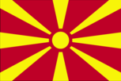
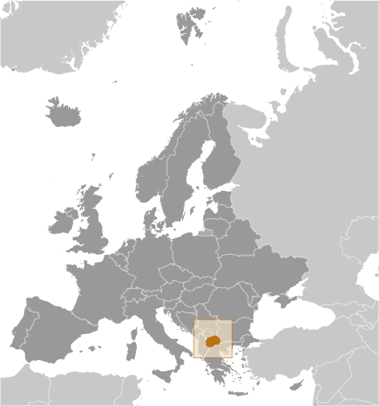
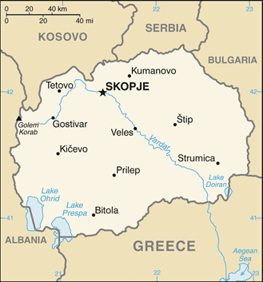

# Macedonia

## Introduction

**_Background:_**   
Macedonia gained its independence peacefully from Yugoslavia in 1991. Greece's objection to the new state's use of what it considered a Hellenic name and symbols delayed international recognition, which occurred under the provisional designation of "the Former Yugoslav Republic of Macedonia." In 1995, Greece lifted a 20-month trade embargo and the two countries agreed to normalize relations, but the issue of the name remained unresolved and negotiations for a solution are ongoing. Since 2004, the US and over 130 other nations have recognized Macedonia by its constitutional name, Republic of Macedonia. Ethnic Albanian grievances over perceived political and economic inequities escalated into an insurgency in 2001 that eventually led to the internationally brokered Ohrid Framework Agreement, which ended the fighting and established guidelines for constitutional amendments and the creation of new laws that enhanced the rights of minorities. Although Macedonia became an EU candidate in 2005, the country still faces challenges, including fully implementing the Framework Agreement, improving relations with Bulgaria, carrying out democratic reforms, and stimulating economic growth and development. Macedonia's membership in NATO was blocked by Greece at the Alliance's Summit of Bucharest in 2008.

## Geography

**_Location:_**   
Southeastern Europe, north of Greece

**_Geographic coordinates:_**   
41 50 N, 22 00 E

**_Map references:_**   
Europe

**_Area:_**   
**total:** 25,713 sq km   
**land:** 25,433 sq km   
**water:** 280 sq km

**_Area - comparative:_**   
slightly larger than Vermont

**_Land boundaries:_**   
**total:** 766 km   
**border countries:** Albania 151 km, Bulgaria 148 km, Greece 246 km, Kosovo 159 km, Serbia 62 km

**_Coastline:_**   
0 km (landlocked)

**_Maritime claims:_**   
none (landlocked)

**_Climate:_**   
warm, dry summers and autumns; relatively cold winters with heavy snowfall

**_Terrain:_**   
mountainous territory covered with deep basins and valleys; three large lakes, each divided by a frontier line; country bisected by the Vardar River

**_Elevation extremes:_**   
**lowest point:** Vardar River 50 m   
**highest point:** Golem Korab (Maja e Korabit) 2,764 m

**_Natural resources:_**   
low-grade iron ore, copper, lead, zinc, chromite, manganese, nickel, tungsten, gold, silver, asbestos, gypsum, timber, arable land

**_Land use:_**   
**arable land:** 16.1%   
**permanent crops:** 1.36%   
**other:** 82.54% (2011)

**_Irrigated land:_**   
1,278 sq km (2004)

**_Total renewable water resources:_**   
6.4 cu km (2011)

**_Freshwater withdrawal (domestic/industrial/agricultural):_**   
**total:** 1.03 cu km/yr (21%/67%/12%)   
**per capita:** 502 cu m/yr (2007)

**_Natural hazards:_**   
high seismic risks

**_Environment - current issues:_**   
air pollution from metallurgical plants

**_Environment - international agreements:_**   
**party to:** Air Pollution, Biodiversity, Climate Change, Climate Change-Kyoto Protocol, Desertification, Endangered Species, Hazardous Wastes, Law of the Sea, Ozone Layer Protection, Wetlands   
**signed, but not ratified:** none of the selected agreements

**_Geography - note:_**   
landlocked; major transportation corridor from Western and Central Europe to Aegean Sea and Southern Europe to Western Europe

## People and Society

**_Nationality:_**   
**noun:** Macedonian(s)   
**adjective:** Macedonian

**_Ethnic groups:_**   
Macedonian 64.2%, Albanian 25.2%, Turkish 3.9%, Roma (Gypsy) 2.7%, Serb 1.8%, other 2.2% (2002 census)

**_Languages:_**   
Macedonian (official) 66.5%, Albanian (official) 25.1%, Turkish 3.5%, Roma 1.9%, Serbian 1.2%, other 1.8% (2002 census)

**_Religions:_**   
Macedonian Orthodox 64.7%, Muslim 33.3%, other Christian 0.37%, other and unspecified 1.63% (2002 census)

**_Population:_**   
2,091,719 (July 2014 est.)

**_Age structure:_**   
**0-14 years:** 17.7% (male 191,682/female 178,510)   
**15-24 years:** 14.1% (male 151,901/female 142,679)   
**25-54 years:** 43.8% (male 464,392/female 451,038)   
**55-64 years:** 12.1% (male 123,272/female 129,081)   
**65 years and over:** 12.1% (male 111,090/female 148,074) (2014 est.)

**_Dependency ratios:_**   
**total dependency ratio:** 41.2 %   
**youth dependency ratio:** 23.4 %   
**elderly dependency ratio:** 17.8 %   
**potential support ratio:** 5.6 (2014 est.)

**_Median age:_**   
**total:** 36.8 years   
**male:** 35.7 years   
**female:** 37.9 years (2014 est.)

**_Population growth rate:_**   
0.21% (2014 est.)

**_Birth rate:_**   
11.64 births/1,000 population (2014 est.)

**_Death rate:_**   
9.04 deaths/1,000 population (2014 est.)

**_Net migration rate:_**   
-0.48 migrant(s)/1,000 population (2014 est.)

**_Urbanization:_**   
**urban population:** 59.3% of total population (2011)   
**rate of urbanization:** 0.33% annual rate of change (2010-15 est.)

**_Major urban areas - population:_**   
SKOPJE (capital) 499,000 (2011)

**_Sex ratio:_**   
**at birth:** 1.08 male(s)/female   
**0-14 years:** 1.07 male(s)/female   
**15-24 years:** 1.07 male(s)/female   
**25-54 years:** 1.03 male(s)/female   
**55-64 years:** 0.99 male(s)/female   
**65 years and over:** 0.75 male(s)/female   
**total population:** 0.99 male(s)/female (2014 est.)

**_Mother's mean age at first birth:_**   
26.2 (2011 est.)

**_Maternal mortality rate:_**   
10 deaths/100,000 live births (2010)

**_Infant mortality rate:_**   
**total:** 7.9 deaths/1,000 live births   
**male:** 8.16 deaths/1,000 live births   
**female:** 7.63 deaths/1,000 live births (2014 est.)

**_Life expectancy at birth:_**   
**total population:** 75.8 years   
**male:** 73.23 years   
**female:** 78.56 years (2014 est.)

**_Total fertility rate:_**   
1.59 children born/woman (2014 est.)

**_Health expenditures:_**   
6.6% of GDP (2011)

**_Physicians density:_**   
2.62 physicians/1,000 population (2009)

**_Hospital bed density:_**   
4.6 beds/1,000 population (2010)

**_Drinking water source:_**   
**improved:** urban: 99.8% of population; rural: 98.8% of population; total: 99.4% of population   
**unimproved:** urban: 0.2% of population; rural: 1.2% of population; total: 0.6% of population (2012 est.)

**_Sanitation facility access:_**   
**improved:** urban: 97.2% of population; rural: 82.8% of population; total: 91.4% of population   
**unimproved:** urban: 2.8% of population; rural: 17.2% of population; total: 8.6% of population (2012 est.)

**_HIV/AIDS - adult prevalence rate:_**   
less than 0.1% (2007 est.)

**_HIV/AIDS - people living with HIV/AIDS:_**   
fewer than 200 (2007 est.)

**_HIV/AIDS - deaths:_**   
fewer than 100 (2003 est.)

**_Obesity - adult prevalence rate:_**   
21.1% (2008)

**_Children under the age of 5 years underweight:_**   
1.8% (2005)

**_Literacy:_**   
**definition:** age 15 and over can read and write   
**total population:** 97.4%   
**male:** 98.7%   
**female:** 96% (2011 est.)

**_School life expectancy (primary to tertiary education):_**   
**total:** 13 years   
**male:** 13 years   
**female:** 13 years (2010)

**_Child labor - children ages 5-14:_**   
**total number:** 16,782   
**percentage:** 6 % (2005 est.)

**_Unemployment, youth ages 15-24:_**   
**total:** 53.9%   
**male:** 55.2%   
**female:** 51.7% (2012)

## Government

**_Country name:_**   
**conventional long form:** Republic of Macedonia   
**conventional short form:** Macedonia   
**local long form:** Republika Makedonija   
**local short form:** Makedonija   
**note:** the provisional designation used by the UN, EU, and NATO is the "former Yugoslav Republic of Macedonia" (FYROM)   
**former:** People's Republic of Macedonia, Socialist Republic of Macedonia

**_Government type:_**   
parliamentary democracy

**_Capital:_**   
**name:** Skopje   
**geographic coordinates:** 42 00 N, 21 26 E   
**time difference:** UTC+1 (6 hours ahead of Washington, DC, during Standard Time)   
**daylight saving time:** +1hr, begins last Sunday in March; ends last Sunday in October

**_Administrative divisions:_**   
71 municipalities (opstini, singular - opstina); Aracinovo, Berovo, Bitola, Bogdanci, Bogovinje, Bosilovo, Brvenica, Caska, Centar Zupa, Cesinovo-Oblesevo, Cucer Sandevo, Debar, Debarca, Delcevo, Demir Hisar, Demir Kapija, Dojran, Dolneni, Gevgelija, Gostivar, Grad Skopje, Gradsko, Ilinden, Jegunovce, Karbinci, Kavadarci, Kicevo, Kocani, Konce, Kratovo, Kriva Palanka, Krivogastani, Krusevo, Kumanovo, Lipkovo, Lozovo, Makedonska Kamenica, Makedonski Brod, Mavrovo i Rostusa, Mogila, Negotino, Novaci, Novo Selo, Ohrid, Pehcevo, Petrovec, Plasnica, Prilep, Probistip, Radovis, Rankovce, Resen, Rosoman, Sopiste, Staro Nagoricane, Stip, Struga, Strumica, Studenicani, Sveti Nikole, Tearce, Tetovo, Valandovo, Vasilevo, Veles, Vevcani, Vinica, Vrapciste, Zelenikovo, Zelino, Zrnovci

**_Independence:_**   
8 September 1991 (referendum by registered voters endorsed independence from Yugoslavia)

**_National holiday:_**   
Independence Day, 8 September (1991); also known as National Day

**_Constitution:_**   
several previous; latest adopted 17 November 1991, effective 20 November 1991; amended several times, last in 2011 (2011)

**_Legal system:_**   
civil law system; judicial review of legislative acts

**_International law organization participation:_**   
has not submitted an ICJ jurisdiction declaration; accepts ICCt jurisdiction

**_Suffrage:_**   
18 years of age; universal

**_Executive branch:_**   
**chief of state:** President Gjorge IVANOV (since 12 May 2009)   
**head of government:** Prime Minister Nikola GRUEVSKI (since 26 August 2006)   
**cabinet:** Council of Ministers elected by the majority vote of all the deputies in the Assembly; note - current cabinet formed by the government coalition parties VMRO-DPMNE, DUI, and several small parties   
**elections:** president elected by popular vote for a five-year term (eligible for a second term); two-round election: first round held on 13 April 2014, second round held on 27 April 2014; prime minister elected by the Assembly following legislative elections; the leader of the majority party or majority coalition usually elected prime minister   
**election results:** Gjorge IVANOV re-elected president in second-round; percent of vote - Gjorge IVANOV 55.3%, Stevo PENDAROVSKI 41.1%; note - 13 April 2014 first round results - Gjorge IVANOV 51.7%, Stevo PENDAROVSKI 37.5%

**_Legislative branch:_**   
unicameral Assembly or Sobranie (123 seats; all members elected by popular vote from party lists based on the percentage of the overall vote the parties gain in each of the six domestic and three diaspora electoral districts; members serve four-year terms)   
**elections:** last held on 27 April 2014 (next to be held in April 2019)   
**election results:** percent of vote by party - VMRO-DPMNE 43.0%, SDSM 25.3%, DUI 13.7%, DPA 5.9%, GROM 2.8%, NDR 1.6%, other 4.3%, invalid 3.4%; seats by party - VMRO-DPMNE 61, SDSM 34, DUI 19, DPA 7, GROM 1, NDR 2

**_Judicial branch:_**   
**highest court(s):** Supreme Court (consist of NA judges); Constitutional Court (consists of 9 judges)   
**judge selection and term of office:** Supreme Court judges nominated by the Judicial Council, a 7-member body of legal professionals, and appointed by the Assembly; judge tenure NA; Constitutional Court judges appointed by the legislature for nonrenewable, 9-year terms   
**subordinate courts:** Courts of Appeal; Basic Courts

**_Political parties and leaders:_**   
Alliance for Positive Macedonia or APM [Ljupco ZIKOV]   
Citizens Option for Macedonia or GROM [Stevco JAKIMOVSKI]   
Democratic Party of Albanians or DPA [Menduh THACI]   
Democratic Union for Integration or DUI [Ali AHMETI]   
Dosoinstvo (Diginity) [Stojance ANGELOV]   
Internal Macedonian Revolutionary Organization - Democratic Party for Macedonian National Unity or VMRO-DPMNE [Nikola GRUEVSKI]   
Internal Macedonian Revolutionary Organization - People's Party or VMRO-NP [Ljubco GEORGIEVSKI]   
National Democratic Revival or NDR [Rufi OSMANI]   
Party for a European Future or PEI [Fijat CANOSKI]   
Party for Democratic Prosperity [Abdyladi VEJSELI]   
Social Democratic Union of Macedonia or SDSM [Zoran ZAEV]

**_Political pressure groups and leaders:_**   
Federation of Free Trade Unions [Mirjana ANDREVSKA]   
Federation of Trade Unions [Zivko MITREVSKI]   
Trade Union of Education, Science and Culture [Jakim NEDELKOV]

**_International organization participation:_**   
BIS, CD, CE, CEI, EAPC, EBRD, EU (candidate country), FAO, IAEA, IBRD, ICAO, ICC (NGOs), ICRM, IDA, IFAD, IFC, IFRCS, ILO, IMF, IMO, Interpol, IOC, IOM (observer), IPU, ISO, ITU, ITUC (NGOs), MIGA, OAS (observer), OIF, OPCW, OSCE, PCA, PFP, SELEC, UN, UNCTAD, UNESCO, UNHCR, UNIDO, UNIFIL, UNWTO, UPU, WCO, WHO, WIPO, WMO, WTO

**_Diplomatic representation in the US:_**   
**chief of mission:** Ambassador Zoran JOLEVSKI (since 22 March 2007)   
**chancery:** 2129 Wyoming Avenue NW, Washington, DC 20008   
**telephone:** [1] (202) 667-0501   
**FAX:** [1] (202) 667-2131   
**consulate(s) general:** Chicago, New York, Southfield (MI)

**_Diplomatic representation from the US:_**   
**chief of mission:** Ambassador Paul D. WOHLERS (since 11 August 2011)   
**embassy:** Str. Samolilova, Nr. 21, 1000 Skopje   
**mailing address:** American Embassy Skopje, US Department of State, 7120 Skopje Place, Washington, DC 20521-7120 (pouch)   
**telephone:** [389] (2) 310-2000   
**FAX:** [389] (2) 310-2499

**_Flag description:_**   
a yellow sun (the Sun of Liberty) with eight broadening rays extending to the edges of the red field; the red and yellow colors have long been associated with Macedonia

**_National symbol(s):_**   
eight-rayed sun

**_National anthem:_**   
**name:** "Denes Nad Makedonija" (Today Over Macedonia)   
**lyrics/music:** Vlado MALESKI/Todor SKALOVSKI   
**note:** adopted 1991; the song, written in 1943, previously served as the anthem of the Socialist Republic of Macedonia while part of Yugoslavia

## Economy

**_Economy - overview:_**   
Since its independence in 1991, Macedonia has made significant progress in liberalizing its economy and improving its business environment, but has lagged the Balkan region in attracting foreign investment. Unemployment has remained consistently high at more than 30% since 2008, but may be overstated based on the existence of an extensive gray market, estimated to be between 20% and 45% of GDP, that is not captured by official statistics. Macedonia’s economy is closely linked to Europe as a customer for exports and source of investment, and has suffered as a result of prolonged weakness in the euro zone. Macedonia maintained macroeconomic stability through the global financial crisis by conducting prudent monetary policy, which keeps the domestic currency pegged against the euro, and by limiting fiscal deficits. The government has been loosening fiscal policy, however, and the budget deficit expanded to 4.2% of GDP in 2013. Macedonia achieved modest GDP growth in 2013 after a small contraction in 2012; inflation is under control.

**_GDP (purchasing power parity):_**   
$22.57 billion (2013 est.)   
$21.89 billion (2012 est.)   
$21.98 billion (2011 est.)   
**note:** data are in 2013 US dollars; Macedonia has a large informal sector that may not be reflected in these data

**_GDP (official exchange rate):_**   
$10.65 billion (2013 est.)

**_GDP - real growth rate:_**   
3.1% (2013 est.)   
-0.4% (2012 est.)   
2.9% (2011 est.)

**_GDP - per capita (PPP):_**   
$10,800 (2013 est.)   
$10,600 (2012 est.)   
$10,700 (2011 est.)   
**note:** data are in 2013 US dollars

**_Gross national saving:_**   
23.2% of GDP (2013 est.)   
24.7% of GDP (2012 est.)   
23.2% of GDP (2011 est.)

**_GDP - composition, by end use:_**   
**household consumption:** 77.5%   
**government consumption:** 15.3%   
**investment in fixed capital:** 22.5%   
**investment in inventories:** 3.1%   
**exports of goods and services:** 47.7%   
**imports of goods and services:** -66.1%; (2013 est.)

**_GDP - composition, by sector of origin:_**   
**agriculture:** 10.2%   
**industry:** 27.5%   
**services:** 62.3% (2013 est.)

**_Agriculture - products:_**   
grapes, tobacco, vegetables, fruits; milk, eggs

**_Industries:_**   
food processing, beverages, textiles, chemicals, iron, steel, cement, energy, pharmaceuticals

**_Industrial production growth rate:_**   
3.2% (2013 est.)

**_Labor force:_**   
960,700 (2013 est.)

**_Labor force - by occupation:_**   
**agriculture:** 18.8%   
**industry:** 27.5%   
**services:** 53.7% (31 September 2013)

**_Unemployment rate:_**   
28.6% (2013 est.)   
31% (2012 est.)

**_Population below poverty line:_**   
30.4% (2011)

**_Household income or consumption by percentage share:_**   
**lowest 10%:** 2.2%   
**highest 10%:** 34.5% (2009 est.)

**_Distribution of family income - Gini index:_**   
39.2 (2011)   
43.2 (2009)

**_Budget:_**   
**revenues:** $3.023 billion   
**expenditures:** $3.438 billion (2013 est.)

**_Taxes and other revenues:_**   
30.6% of GDP (2013 est.)

**_Budget surplus (+) or deficit (-):_**   
-4.1% of GDP (2013 est.)

**_Public debt:_**   
34.3% of GDP (2013 est.)   
34.1% of GDP (2012 est.)   
**note:** official data from Ministry of Finance; data cover central government debt; this data excludes debt instruments issued (or owned) by government entities other than the treasury; includes treasury debt held by foreign entitites; excludes debt issued by sub-national entities, as well as intra-governmental debt; there are no debt instruments sold for social funds

**_Fiscal year:_**   
calendar year

**_Inflation rate (consumer prices):_**   
2.8% (2013 est.)   
3.3% (2012 est.)

**_Central bank discount rate:_**   
3.25% (31 December 2013 est.)   
3.75% (31 December 2012 est.)   
**note:** series discontinued in January 2010; the discount rate has been replaced by a referent rate for calculating the penalty rate

**_Commercial bank prime lending rate:_**   
6.4% (31 December 2013 est.)   
6.8% (31 December 2012 est.)

**_Stock of narrow money:_**   
$1.57 billion (31 December 2013 est.)   
$1.414 billion (31 December 2012 est.)

**_Stock of broad money:_**   
$6.286 billion (31 December 2013 est.)   
$5.708 billion (31 December 2012 est.)

**_Stock of domestic credit:_**   
$5.211 billion (31 December 2013 est.)   
$4.681 billion (31 December 2012 est.)

**_Market value of publicly traded shares:_**   
$2.214 billion (31 December 2013)   
$2.423 billion (31 December 2012)   
$2.495 billion (31 December 2011)

**_Current account balance:_**   
-$194.1 million (2013 est.)   
-$385.2 million (2012 est.)

**_Exports:_**   
$4.267 billion (2013 est.)   
$4.002 billion (2012 est.)

**_Exports - commodities:_**   
food, beverages, tobacco; textiles, miscellaneous manufactures, iron, steel; automotive parts

**_Exports - partners:_**   
Germany 36.9%, Bulgaria 7.6%, Italy 6.5%, Kosovo 6.5%, Serbia 6.3%, Greece 5% (2012 est.)

**_Imports:_**   
$6.6 billion (2013 est.)   
$6.511 billion (2012 est.)

**_Imports - commodities:_**   
machinery and equipment, automobiles, chemicals, fuels, food products

**_Imports - partners:_**   
Great Britain 11%, Greece 10.6%, Germany 10.5%, Serbia 7.9%, Italy 6.5%, China 5.8%, Bulgaria 5.5%, Turkey 4.8% (2012 est.)

**_Reserves of foreign exchange and gold:_**   
$2.747 billion (31 December 2013 est.)   
$2.891 billion (31 December 2012 est.)

**_Debt - external:_**   
$7.451 billion (30 September 2013 est.)   
$6.818 billion (31 December 2012 est.)

**_Stock of direct foreign investment - at home:_**   
$4.695 billion (31 December 2013 est.)   
$4.361 billion (31 December 2012 est.)

**_Stock of direct foreign investment - abroad:_**   
$NA   
$564 million (31 December 2009 est.)

**_Exchange rates:_**   
Macedonian denars (MKD) per US dollar -   
46.398 (2013 est.)   
47.885 (2012 est.)   
46.485 (2010 est.)   
44.1 (2009)   
41.414 (2008)

## Energy

**_Electricity - production:_**   
5.676 billion kWh (2013 est.)

**_Electricity - consumption:_**   
6.989 billion kWh (2013 est.)

**_Electricity - exports:_**   
62.36 million kWh (2013 est.)

**_Electricity - imports:_**   
2.491 billion kWh (2013 est.)

**_Electricity - installed generating capacity:_**   
1.953 million kW (2013 est.)

**_Electricity - from fossil fuels:_**   
66.4% of total installed capacity (2013 est.)

**_Electricity - from nuclear fuels:_**   
0% of total installed capacity (2013 est.)

**_Electricity - from hydroelectric plants:_**   
33.2% of total installed capacity (2013 est.)

**_Electricity - from other renewable sources:_**   
0.4% of total installed capacity (2013 est.)

**_Crude oil - production:_**   
0 bbl/day (2013 est.)

**_Crude oil - exports:_**   
0 bbl/day (2013)

**_Crude oil - imports:_**   
51,510 bbl/day (2013 est.)

**_Crude oil - proved reserves:_**   
0 bbl (1 January 2013 est. est.)

**_Refined petroleum products - production:_**   
17,030 bbl/day (2010 est.)

**_Refined petroleum products - consumption:_**   
17,490 bbl/day (2011 est.)

**_Refined petroleum products - exports:_**   
6,750 bbl/day (2010 est.)

**_Refined petroleum products - imports:_**   
21,530 bbl/day (2010 est.)

**_Natural gas - production:_**   
0 cu m (2013)

**_Natural gas - consumption:_**   
158.6 million cu m (2013 est.)

**_Natural gas - exports:_**   
0 cu m (2013)

**_Natural gas - imports:_**   
158.6 million cu m (2013 est.)

**_Natural gas - proved reserves:_**   
0 cu m (1 January 2013 est.)

**_Carbon dioxide emissions from consumption of energy:_**   
6.947 million Mt (2011 est.)

## Communications

**_Telephones - main lines in use:_**   
407,900 (2012)

**_Telephones - mobile cellular:_**   
2.235 million (2012)

**_Telephone system:_**   
**general assessment:** competition from the mobile-cellular segment of the telecommunications market has led to a drop in fixed-line telephone subscriptions   
**domestic:** combined fixed-line and mobile-cellular telephone subscribership about 130 per 100 persons   
**international:** country code - 389 (2012)

**_Broadcast media:_**   
public TV broadcaster operates 3 national channels and a satellite network; 5 privately owned TV channels broadcast nationally using terrestrial transmitters and about 15 broadcast on national level via satellite; roughly 75 local commercial TV stations; large number of cable operators offering domestic and international programming; public radio broadcaster operates over multiple stations; 3 privately owned radio stations broadcast nationally; about 70 local commercial radio stations (2012)

**_Internet country code:_**   
.mk

**_Internet hosts:_**   
62,826 (2012)

**_Internet users:_**   
1.057 million (2009)

## Transportation

**_Airports:_**   
10 (2013)

**_Airports - with paved runways:_**   
**total:** 8   
**2,438 to 3,047 m:** 2   
**under 914 m:** 6 (2013)

**_Airports - with unpaved runways:_**   
**total:** 2   
**914 to 1,523 m:** 1   
**under 914 m:** 1 (2013)

**_Pipelines:_**   
gas 268 km; oil 120 km (2013)

**_Railways:_**   
**total:** 699 km   
**standard gauge:** 699 km 1.435-m gauge (234 km electrified) (2012)

**_Roadways:_**   
**total:** 14,038 km (includes 259 km of expressways)   
**paved:** 9,489 km   
**unpaved:** 4,549 km (2012)

## Military

**_Military branches:_**   
Army of the Republic of Macedonia (ARM; includes General Staff and subordinate Joint Operational Command, Training and Doctrine Command, Special Operations Regiment) (2012)

**_Military service age and obligation:_**   
18 years of age for voluntary military service; conscription abolished in 2008 (2013)

**_Manpower available for military service:_**   
**males age 16-49:** 532,196   
**females age 16-49:** 511,964 (2010 est.)

**_Manpower fit for military service:_**   
**males age 16-49:** 443,843   
**females age 16-49:** 426,251 (2010 est.)

**_Manpower reaching militarily significant age annually:_**   
**male:** 16,144   
**female:** 14,920 (2010 est.)

**_Military expenditures:_**   
1.38% of GDP (2012)   
1.27% of GDP (2011)   
1.38% of GDP (2010)

## Transnational Issues

**_Disputes - international:_**   
Kosovo and Macedonia completed demarcation of their boundary in September 2008; Greece continues to reject the use of the name Macedonia or Republic of Macedonia

**_Refugees and internally displaced persons:_**   
**stateless persons:** 905 (2012)

**_Illicit drugs:_**   
major transshipment point for Southwest Asian heroin and hashish; minor transit point for South American cocaine destined for Europe; although not a financial center and most criminal activity is thought to be domestic, money laundering is a problem due to a mostly cash-based economy and weak enforcement

............................................................   
_Page last updated on June 20, 2014_
