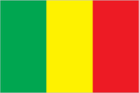
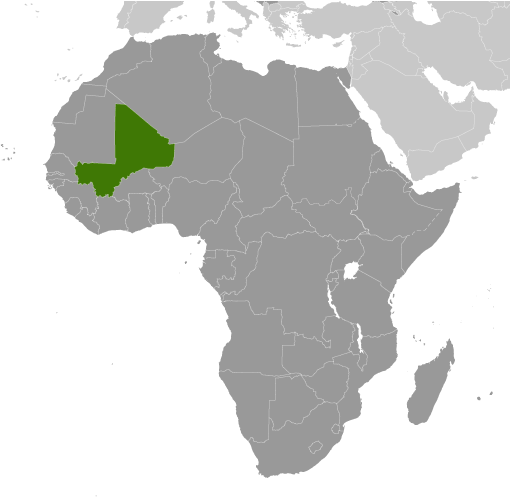
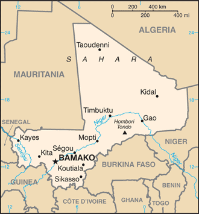

# Mali

## Introduction

**_Background:_**   
The Sudanese Republic and Senegal became independent of France in 1960 as the Mali Federation. When Senegal withdrew after only a few months, what formerly made up the Sudanese Republic was renamed Mali. Rule by dictatorship was brought to a close in 1991 by a military coup that ushered in a period of democratic rule. President Alpha KONARE won Mali's first two democratic presidential elections in 1992 and 1997. In keeping with Mali's two-term constitutional limit, he stepped down in 2002 and was succeeded by Amadou Toumani TOURE, who was elected to a second term in 2007 elections that were widely judged to be free and fair. Malian returnees from Libya in 2011 exacerbated tensions in northern Mali, and Tuareg ethnic militias started a rebellion in January 2012. Low- and mid-level soldiers, frustrated with the poor handling of the rebellion overthrew TOURE on 22 March. Intensive mediation efforts led by the Economic Community of West African States (ECOWAS) returned power to a civilian administration in April with the appointment of interim President Dioncounda TRAORE. The post-coup chaos led to rebels expelling the Malian military from the three northern regions of the country and allowed Islamic militants to set up strongholds. Hundreds of thousands of northern Malians fled the violence to southern Mali and neighboring countries, exacerbating regional food insecurity in host communities. An international military intervention to retake the three northern regions began in January 2013 and within a month most of the north had been retaken. In a democratic presidential election conducted in July and August of 2013, Ibrahim Boubacar KEITA was elected president in the second round.

## Geography

**_Location:_**   
interior Western Africa, southwest of Algeria, north of Guinea, Cote d'Ivoire, and Burkina Faso, west of Niger

**_Geographic coordinates:_**   
17 00 N, 4 00 W

**_Map references:_**   
Africa

**_Area:_**   
**total:** 1,240,192 sq km   
**land:** 1,220,190 sq km   
**water:** 20,002 sq km

**_Area - comparative:_**   
slightly less than twice the size of Texas

**_Land boundaries:_**   
**total:** 7,243 km   
**border countries:** Algeria 1,376 km, Burkina Faso 1,000 km, Guinea 858 km, Cote d'Ivoire 532 km, Mauritania 2,237 km, Niger 821 km, Senegal 419 km

**_Coastline:_**   
0 km (landlocked)

**_Maritime claims:_**   
none (landlocked)

**_Climate:_**   
subtropical to arid; hot and dry (February to June); rainy, humid, and mild (June to November); cool and dry (November to February)

**_Terrain:_**   
mostly flat to rolling northern plains covered by sand; savanna in south, rugged hills in northeast

**_Elevation extremes:_**   
**lowest point:** Senegal River 23 m   
**highest point:** Hombori Tondo 1,155 m

**_Natural resources:_**   
gold, phosphates, kaolin, salt, limestone, uranium, gypsum, granite, hydropower   
**note:** bauxite, iron ore, manganese, tin, and copper deposits are known but not exploited

**_Land use:_**   
**arable land:** 5.53%   
**permanent crops:** 0.1%   
**other:** 94.37% (2011)

**_Irrigated land:_**   
2,358 sq km (2003)

**_Total renewable water resources:_**   
100 cu km (2011)

**_Freshwater withdrawal (domestic/industrial/agricultural):_**   
**total:** 6.55 cu km/yr (9%/1%/90%)   
**per capita:** 545.4 cu m/yr (2000)

**_Natural hazards:_**   
hot, dust-laden harmattan haze common during dry seasons; recurring droughts; occasional Niger River flooding

**_Environment - current issues:_**   
deforestation; soil erosion; desertification; inadequate supplies of potable water; poaching

**_Environment - international agreements:_**   
**party to:** Biodiversity, Climate Change, Climate Change-Kyoto Protocol, Desertification, Endangered Species, Hazardous Wastes, Law of the Sea, Ozone Layer Protection, Wetlands, Whaling   
**signed, but not ratified:** none of the selected agreements

**_Geography - note:_**   
landlocked; divided into three natural zones: the southern, cultivated Sudanese; the central, semiarid Sahelian; and the northern, arid Saharan

## People and Society

**_Nationality:_**   
**noun:** Malian(s)   
**adjective:** Malian

**_Ethnic groups:_**   
Mande 50% (Bambara, Malinke, Soninke), Peul 17%, Voltaic 12%, Songhai 6%, Tuareg and Moor 10%, other 5%

**_Languages:_**   
French (official), Bambara 46.3%, Peul/foulfoulbe 9.4%, Dogon 7.2%, Maraka/soninke 6.4%, Malinke 5.6%, Sonrhai/djerma 5.6%, Minianka 4.3%, Tamacheq 3.5%, Senoufo 2.6%, unspecified 0.6%, other 8.5%   
**note:** Mali has 13 national languages in addition to its official language

**_Religions:_**   
Muslim 94.8%, Christian 2.4%, Animist 2%, none 0.5%, unspecified 0.3% (2009 Census)

**_Population:_**   
16,455,903 (July 2014 est.)

**_Age structure:_**   
**0-14 years:** 47.6% (male 3,931,818/female 3,899,535)   
**15-24 years:** 19% (male 1,489,830/female 1,638,995)   
**25-54 years:** 26.7% (male 2,042,666/female 2,348,337)   
**55-64 years:** 3.7% (male 307,167/female 306,470)   
**65 years and over:** 3% (male 246,084/female 245,001) (2014 est.)

**_Dependency ratios:_**   
**total dependency ratio:** 100.9 %   
**youth dependency ratio:** 95.4 %   
**elderly dependency ratio:** 5.5 %   
**potential support ratio:** 18.2 (2014 est.)

**_Median age:_**   
**total:** 16 years   
**male:** 15.4 years   
**female:** 16.7 years (2014 est.)

**_Population growth rate:_**   
3% (2014 est.)

**_Birth rate:_**   
45.53 births/1,000 population (2014 est.)

**_Death rate:_**   
13.22 deaths/1,000 population (2014 est.)

**_Net migration rate:_**   
-2.33 migrant(s)/1,000 population (2014 est.)

**_Urbanization:_**   
**urban population:** 34.9% of total population (2011)   
**rate of urbanization:** 4.77% annual rate of change (2010-15 est.)

**_Major urban areas - population:_**   
BAMAKO (capital) 2.037 million (2011)

**_Sex ratio:_**   
**at birth:** 1.03 male(s)/female   
**0-14 years:** 1.01 male(s)/female   
**15-24 years:** 0.91 male(s)/female   
**25-54 years:** 0.87 male(s)/female   
**55-64 years:** 0.95 male(s)/female   
**65 years and over:** 1.01 male(s)/female   
**total population:** 0.95 male(s)/female (2014 est.)

**_Mother's mean age at first birth:_**   
18.6   
**note:** median age at first birth among women 25-29 (2006 est.)

**_Maternal mortality rate:_**   
540 deaths/100,000 live births (2010)

**_Infant mortality rate:_**   
**total:** 104.34 deaths/1,000 live births   
**male:** 111.04 deaths/1,000 live births   
**female:** 97.44 deaths/1,000 live births (2014 est.)

**_Life expectancy at birth:_**   
**total population:** 54.95 years   
**male:** 53.12 years   
**female:** 56.83 years (2014 est.)

**_Total fertility rate:_**   
6.16 children born/woman (2014 est.)

**_Contraceptive prevalence rate:_**   
8.2% (2006)

**_Health expenditures:_**   
6.8% of GDP (2011)

**_Physicians density:_**   
0.08 physicians/1,000 population (2010)

**_Hospital bed density:_**   
0.1 beds/1,000 population (2010)

**_Drinking water source:_**   
**improved:** urban: 90.9% of population; rural: 54.2% of population; total: 67.2% of population   
**unimproved:** urban: 9.1% of population; rural: 45.8% of population; total: 32.8% of population (2012 est.)

**_Sanitation facility access:_**   
**improved:** urban: 35.3% of population; rural: 14.5% of population; total: 21.9% of population   
**unimproved:** urban: 64.7% of population; rural: 85.5% of population; total: 78.1% of population (2012 est.)

**_HIV/AIDS - adult prevalence rate:_**   
0.9% (2012 est.)

**_HIV/AIDS - people living with HIV/AIDS:_**   
100,300 (2012 est.)

**_HIV/AIDS - deaths:_**   
4,900 (2012 est.)

**_Major infectious diseases:_**   
**degree of risk:** very high   
**food or waterborne diseases:** bacterial and protozoal diarrhea, hepatitis A, and typhoid fever   
**vectorborne diseases:** malaria and dengue fever   
**water contact disease:** schistosomiasis   
**respiratory disease:** meningococcal meningitis   
**animal contact disease:** rabies (2013)

**_Obesity - adult prevalence rate:_**   
4.3% (2008)

**_Children under the age of 5 years underweight:_**   
27.9% (2006)

**_Education expenditures:_**   
4.8% of GDP (2011)

**_Literacy:_**   
**definition:** age 15 and over can read and write   
**total population:** 33.4%   
**male:** 43.1%   
**female:** 24.6% (2011 est.)

**_School life expectancy (primary to tertiary education):_**   
**total:** 9 years   
**male:** 10 years   
**female:** 8 years (2012)

**_Child labor - children ages 5-14:_**   
**total number:** 1,485,027   
**percentage:** 36 % (2010 est.)

## Government

**_Country name:_**   
**conventional long form:** Republic of Mali   
**conventional short form:** Mali   
**local long form:** Republique de Mali   
**local short form:** Mali   
**former:** French Sudan and Sudanese Republic

**_Government type:_**   
republic

**_Capital:_**   
**name:** Bamako   
**geographic coordinates:** 12 39 N, 8 00 W   
**time difference:** UTC 0 (5 hours ahead of Washington, DC, during Standard Time)

**_Administrative divisions:_**   
8 regions (regions, singular - region), 1 district\*; District de Bamako\*, Gao, Kayes, Kidal, Koulikoro, Mopti, Segou, Sikasso, Tombouctou (Timbuktu)

**_Independence:_**   
22 September 1960 (from France)

**_National holiday:_**   
Independence Day, 22 September (1960)

**_Constitution:_**   
several previous; latest drafted August 1991, approved by referendum 12 January 1992, effective 25 February 1992; amended 1999; note - suspended briefly in 2012 (2012)

**_Legal system:_**   
civil law system based on the French civil law model and influenced by customary law; judicial review of legislative acts in Constitutional Court

**_International law organization participation:_**   
has not submitted an ICJ jurisdiction declaration; accepts ICCt jurisdiction

**_Suffrage:_**   
18 years of age; universal

**_Executive branch:_**   
**chief of state:** President Ibrahim Boubacar KEITA (since 4 September 2013)   
**head of government:** Prime Minister Moussa MARA (since 9 April 2014)   
**cabinet:** Council of Ministers appointed by the prime minister   
**elections:** president elected by popular vote for a five-year term (eligible for a second term); the election scheduled for 29 April 2012 and delayed following the March 2012 coup took place 28 July 2013 and a runoff election was held on 11 August 2013; prime minister appointed by the president   
**election results:** Ibrahim Boubacar KEITA elected president in a runoff election; percent of vote - Ibrahim Boubacar KEITA 77.6%, Soumaila CISSE 22.4%

**_Legislative branch:_**   
unicameral National Assembly or Assemblee Nationale (160 seats: 147 seats elected in single seat constituencies and 13 seats elected by Malians abroad; members elected by popular vote to serve five-year terms)   
**elections:** last held in two rounds on 24 November 2013 and on 15 December 2013 (next to be held in 2017); note the scheduled July 2012 election was cancelled due to a coup d'etat and the Tuareg Rebellion   
**election results:** percent of vote by party - NA; seats by party - FDR coalition 64 (RPM 61, PARENA 3), ADP coalition 42 (ADEMA 20, URD 18, CNID 4), FARE 5, CODEM 5, SADI 4, ASMA-CFP 4, Yelema 2, independents 16, other 5; note - 13 seats were from voters abroad

**_Judicial branch:_**   
**highest court(s):** Supreme Court or Cour Supreme (consists of 19 members organized into 3 civil chambers and a criminal chamber); Constitutional Court (consists of 9 members)   
**judge selection and term of office:** Supreme Court members appointed by the Ministry of Justice to serve 5-year terms; Constitutional Court members selected - 3 each by the president, the National Assembly, and the Supreme Council of the Magistracy; members serve single renewable 7-year terms   
**subordinate courts:** High Court of Justice (jurisdiction limited to cases of high treason or criminal offenses by the president or ministers while in office)

**_Political parties and leaders:_**   
African Solidarity for Democracy and Independence or SADI [Oumar MARIKO, secretary general]   
Alliance for Democracy or ADEMA [Dionconda TRAORE]   
Alliance for Democracy and Progress or ADP (a coalition of political parties including ADEMA and URD formed in December 2006 to support the presidential candidacy of Amadou TOURE)   
Alliance for Democratic Change (political group comprised mainly of Tuareg from Mali's northern region)   
Alliance for the Solidarity of Mali-Convergence of Patriotic Forces or ASMA-CFP [Soumeylou Boubeye MAIGA]   
Alternative Forces for Renewal and Emergence or FARE [Modibo SIDIBE]   
Convergence for the development of Mali or CODEM [Housseyni GUINDO]   
Economic and Social Development Party or PDES [Jamille BITTAR]   
Front for Democracy and the Republic or FDR (a coalition of political parties including RPM and PARENA formed to oppose the presidential candidacy of Amadou TOURE)   
Movement for a Common Destiny or MODEC [Koniba SIDIBE]   
National Congress for Democratic Initiative or CNID [Mountaga TALL]   
Party for Democracy and Progress or PDP [Mady KONATE]   
Party for National Renewal or PARENA [Tiebile DRAME]   
Patriotic Movement for Renewal or MPR [Choguel Kokalla MAIGA]   
Rally for Democracy and Labor or RDT [Amadou Ali NIANGADOU]   
Rally for Mali or RPM [Ibrahim Boubacar KEITA]   
Sudanese Union/African Democratic Rally or US/RDA [Mamadou Bamou TOURE]   
Union for Democracy and Development or UDD [Tieman Hubert COULIBALY]   
Union for Republic and Democracy or URD [Younoussi TOURE]   
Yelema [Moussa Mara]

**_Political pressure groups and leaders:_**   
**other:** the army; Islamic authorities; state-run cotton company CMDT

**_International organization participation:_**   
ACP, AfDB, AU, CD, ECOWAS, EITI (compliant country), FAO, FZ, G-77, IAEA, IBRD, ICAO, ICRM, IDA, IDB, IFAD, IFC, IFRCS, ILO, IMF, Interpol, IOC, IOM, IPU, ISO, ITSO, ITU, ITUC (NGOs), MIGA, MONUSCO, NAM, OIC, OIF, OPCW, UN, UNAMID, UNCTAD, UNESCO, UNIDO, UNMIL, UNMISS, UNWTO, UPU, WADB (regional), WAEMU, WCO, WFTU (NGOs), WHO, WIPO, WMO, WTO

**_Diplomatic representation in the US:_**   
**chief of mission:** Ambassador Al Maamoun Baba Lamine KEITA (since 8 January 2013)   
**chancery:** 2130 R Street NW, Washington, DC 20008   
**telephone:** [1] (202) 332-2249, 939-8950   
**FAX:** [1] (202) 332-6603

**_Diplomatic representation from the US:_**   
**chief of mission:** Ambassador Mary Beth LEONARD (since 7 November 2011)   
**embassy:** located just off the Roi Bin Fahad Aziz Bridge just west of the Bamako central district   
**mailing address:** ACI 2000, Rue 243, Porte 297, Bamako   
**telephone:** [223] 2070-2300   
**FAX:** [223] 2070-2479

**_Flag description:_**   
three equal vertical bands of green (hoist side), yellow, and red   
**note:** uses the popular Pan-African colors of Ethiopia; the colors from left to right are the same as those of neighboring Senegal (which has an additional green central star) and the reverse of those on the flag of neighboring Guinea

**_National anthem:_**   
**name:** "Le Mali" (Mali)   
**lyrics/music:** Seydou Badian KOUYATE/Banzoumana SISSOKO   
**note:** adopted 1962; the anthem is also known as "Pour L'Afrique et pour toi, Mali" (For Africa and for You, Mali) and "A ton appel Mali" (At Your Call, Mali)

## Economy

**_Economy - overview:_**   
Among the 25 poorest countries in the world, Mali is a landlocked country that depends on gold mining and agricultural exports for revenue. Economic activity is largely confined to the riverine area irrigated by the Niger River and about 65% of its land area is desert or semidesert. About 10% of the population is nomadic and about 80% of the labor force is engaged in farming and fishing. Mali remains dependent on foreign aid. The country's fiscal status fluctuates with gold and agricultural commodity prices and the harvest; cotton and gold exports make up around 80% of export earnings. Industrial activity is concentrated on processing farm commodities. Mali is developing its iron ore extraction industry to diversify foreign exchange earnings away from gold. Mali has invested in tourism but security issues hurt the industry. Mali experienced economic growth of about 5% per year between 1996-2011, but the global recession, a military coup, and terrorist activity in the north of the country caused a decline in output in 2012; growth resumed at a slow pace in 2013. The main threat to Mali’s economy is a return to physical insecurity. Other long term threats to the economy include high population growth, corruption, a weak infrastructure, and low levels of human capital.

**_GDP (purchasing power parity):_**   
$18.9 billion (2013 est.)   
$18.03 billion (2012 est.)   
$18.25 billion (2011 est.)   
**note:** data are in 2013 US dollars

**_GDP (official exchange rate):_**   
$11.37 billion (2013 est.)

**_GDP - real growth rate:_**   
4.8% (2013 est.)   
-1.2% (2012 est.)   
2.7% (2011 est.)

**_GDP - per capita (PPP):_**   
$1,100 (2013 est.)   
$1,100 (2012 est.)   
$1,200 (2011 est.)   
**note:** data are in 2013 US dollars

**_Gross national saving:_**   
15.8% of GDP (2013 est.)   
21.6% of GDP (2012 est.)   
12.1% of GDP (2011 est.)

**_GDP - composition, by end use:_**   
**household consumption:** 68.8%   
**government consumption:** 18.6%   
**investment in fixed capital:** 23.5%   
**investment in inventories:** 0.6%   
**exports of goods and services:** 22.5%   
**imports of goods and services:** -34%; (2013 est.)

**_GDP - composition, by sector of origin:_**   
**agriculture:** 38.5%   
**industry:** 24.4%   
**services:** 37% (2013 est.)

**_Agriculture - products:_**   
cotton, millet, rice, corn, vegetables, peanuts; cattle, sheep, goats

**_Industries:_**   
food processing; construction; phosphate and gold mining

**_Industrial production growth rate:_**   
7% (2013 est.)

**_Labor force:_**   
3.241 million (2007 est.)

**_Labor force - by occupation:_**   
**agriculture:** 80%   
**industry and services:** 20% (2005 est.)

**_Unemployment rate:_**   
30% (2004 est.)

**_Population below poverty line:_**   
36.1% (2005 est.)

**_Household income or consumption by percentage share:_**   
**lowest 10%:** 3.5%   
**highest 10%:** 25.8% (2010 est.)

**_Distribution of family income - Gini index:_**   
40.1 (2001)   
50.5 (1994)

**_Budget:_**   
**revenues:** $2.868 billion   
**expenditures:** $2.948 billion (2013 est.)

**_Taxes and other revenues:_**   
25.2% of GDP (2013 est.)

**_Budget surplus (+) or deficit (-):_**   
-0.7% of GDP (2013 est.)

**_Public debt:_**   
30.5% of GDP (2013 est.)   
27.5% of GDP (2012 est.)

**_Fiscal year:_**   
calendar year

**_Inflation rate (consumer prices):_**   
0.1% (2013 est.)   
5.4% (2012 est.)

**_Central bank discount rate:_**   
16% (31 December 2010 est.)   
4.25% (31 December 2009 est.)

**_Commercial bank prime lending rate:_**   
9.3% (31 December 2013 est.)   
9.3% (31 December 2012 est.)

**_Stock of narrow money:_**   
$2.848 billion (31 December 2013 est.)   
$2.583 billion (31 December 2012 est.)

**_Stock of broad money:_**   
$3.942 billion (31 December 2013 est.)   
$3.446 billion (31 December 2012 est.)

**_Stock of domestic credit:_**   
$2.234 billion (31 December 2013 est.)   
$2.102 billion (31 December 2012 est.)

**_Market value of publicly traded shares:_**   
$NA

**_Current account balance:_**   
-$918 million (2013 est.)   
-$737.5 million (2012 est.)

**_Exports:_**   
$2.577 billion (2013 est.)   
$2.756 billion (2012 est.)

**_Exports - commodities:_**   
cotton, gold, livestock

**_Exports - partners:_**   
China 52.9%, Malaysia 11%, Indonesia 5.3%, India 4.1% (2012)

**_Imports:_**   
$2.895 billion (2013 est.)   
$2.794 billion (2012 est.)

**_Imports - commodities:_**   
petroleum, machinery and equipment, construction materials, foodstuffs, textiles

**_Imports - partners:_**   
France 11.2%, Senegal 9.9%, Cote dIvoire 8.7%, China 8.6% (2012)

**_Debt - external:_**   
$3.349 billion (31 December 2013 est.)   
$3.041 billion (31 December 2012 est.)

**_Stock of direct foreign investment - at home:_**   
$2.75 billion (31 December 2013 est.)   
$2.545 billion (31 December 2012 est.)

**_Stock of direct foreign investment - abroad:_**   
$NA (31 December 2013 est.)   
$848.2 million (31 December 2012 est.)

**_Exchange rates:_**   
Communaute Financiere Africaine francs (XOF) per US dollar -   
500.7 (2013 est.)   
510.53 (2012 est.)   
495.28 (2010 est.)   
472.19 (2009)   
447.81 (2008)

## Energy

**_Electricity - production:_**   
520 million kWh (2010 est.)

**_Electricity - consumption:_**   
483.6 million kWh (2010 est.)

**_Electricity - exports:_**   
0 kWh (2012 est.)

**_Electricity - imports:_**   
0 kWh (2012 est.)

**_Electricity - installed generating capacity:_**   
304,000 kW (2010 est.)

**_Electricity - from fossil fuels:_**   
48.4% of total installed capacity (2010 est.)

**_Electricity - from nuclear fuels:_**   
0% of total installed capacity (2010 est.)

**_Electricity - from hydroelectric plants:_**   
51.6% of total installed capacity (2010 est.)

**_Electricity - from other renewable sources:_**   
0% of total installed capacity (2010 est.)

**_Crude oil - production:_**   
0 bbl/day (2012 est.)

**_Crude oil - exports:_**   
0 bbl/day (2010 est.)

**_Crude oil - imports:_**   
0 bbl/day (2010 est.)

**_Crude oil - proved reserves:_**   
0 bbl (1 January 2013 est.)

**_Refined petroleum products - production:_**   
0 bbl/day (2010 est.)

**_Refined petroleum products - consumption:_**   
4,994 bbl/day (2011 est.)

**_Refined petroleum products - exports:_**   
0 bbl/day (2010 est.)

**_Refined petroleum products - imports:_**   
4,698 bbl/day (2010 est.)

**_Natural gas - production:_**   
0 cu m (2011 est.)

**_Natural gas - consumption:_**   
0 cu m (2010 est.)

**_Natural gas - exports:_**   
0 cu m (2011 est.)

**_Natural gas - imports:_**   
0 cu m (2011 est.)

**_Natural gas - proved reserves:_**   
0 cu m (1 January 2013 est.)

**_Carbon dioxide emissions from consumption of energy:_**   
742,300 Mt (2011 est.)

## Communications

**_Telephones - main lines in use:_**   
112,000 (2012)

**_Telephones - mobile cellular:_**   
14.613 million (2012)

**_Telephone system:_**   
**general assessment:** domestic system unreliable but improving; increasing use of local radio loops to extend network coverage to remote areas   
**domestic:** fixed-line subscribership remains less than 1 per 100 persons; mobile-cellular subscribership has increased sharply to about 70 per 100 persons   
**international:** country code - 223; satellite communications center and fiber-optic links to neighboring countries; satellite earth stations - 2 Intelsat (1 Atlantic Ocean, 1 Indian Ocean) (2010)

**_Broadcast media:_**   
national public TV broadcaster; 2 privately owned companies provide subscription services to foreign multi-channel TV packages; national public radio broadcaster supplemented by a large number of privately owned and community broadcast stations; transmissions of multiple international broadcasters are available (2007)

**_Internet country code:_**   
.ml

**_Internet hosts:_**   
437 (2012)

**_Internet users:_**   
249,800 (2009)

## Transportation

**_Airports:_**   
25 (2013)

**_Airports - with paved runways:_**   
**total:** 8   
**over 3,047 m:** 1   
**2,438 to 3,047 m:** 4   
**1,524 to 2,437 m:** 2   
**914 to 1,523 m:** 1 (2013)

**_Airports - with unpaved runways:_**   
**total:** 17   
**1,524 to 2,437 m:** 3   
**914 to 1,523 m:** 9   
**under 914 m:** 5 (2013)

**_Heliports:_**   
2 (2013)

**_Railways:_**   
**total:** 593 km   
**narrow gauge:** 593 km 1.000-m gauge (2008)

**_Roadways:_**   
**total:** 22,474 km   
**paved:** 5,522 km   
**unpaved:** 16,952 km (2009)

**_Waterways:_**   
1,800 km (downstream of Koulikoro; low water levels on the River Niger cause problems in dry years; in the months before the rainy season the river is not navigable by commercial vessels) (2011)

**_Ports and terminals:_**   
**river port(s):** Koulikoro (Niger)

## Military

**_Military branches:_**   
Malian Armed Forces: Army (Armee de Terre), Republic of Mali Air Force (Force Aerienne de la Republique du Mali, FARM), National Guard (Garde National du Mali) (2013)

**_Military service age and obligation:_**   
18 years of age for selective compulsory and voluntary military service; conscript service obligation - 2 years (2012)

**_Manpower available for military service:_**   
**males age 16-49:** 2,848,412   
**females age 16-49:** 2,981,106 (2010 est.)

**_Manpower fit for military service:_**   
**males age 16-49:** 1,825,779   
**females age 16-49:** 1,968,563 (2010 est.)

**_Manpower reaching militarily significant age annually:_**   
**male:** 158,031   
**female:** 159,733 (2010 est.)

**_Military expenditures:_**   
1.44% of GDP (2012)   
1.51% of GDP (2011)   
1.44% of GDP (2010)

## Transnational Issues

**_Disputes - international:_**   
demarcation is underway with Burkina Faso

**_Refugees and internally displaced persons:_**   
**refugees (country of origin):** 12,897 (Mauritania) (2013)   
**IDPs:** 151,150 (Tuareg rebellion since 2012) (2014)

**_Trafficking in persons:_**   
**current situation:** Mali is a source, transit, and destination country for men, women, and children subjected to forced labor and sex trafficking; women and girls are forced into domestic servitude, agricultural labor, and support roles in gold mines, as well as subjected to sex trafficking; Malian boys are found in conditions of forced labor in agricultural settings, gold mines, and the informal commercial sector, as well as forced begging both within Mali and neighboring countries; Malians and other Africans who travel through Mali to Mauritania, Algeria, or Libya in hopes of reaching Europe are particularly at risk of becoming victims of human trafficking; men and boys, primarily of Songhai ethnicity, are subjected to the longstanding practice of debt bondage in the salt mines of Taoudenni in northern Mali; some members of Mali's black Tamachek community are subjected to traditional slavery-related practices, and this involuntary servitude reportedly has extended to their children; reports indicate that non-governmental armed groups operating in northern Mali recruited children as combatants, cooks, porters, guards, spies, and sex slaves

............................................................   
_Page last updated on June 20, 2014_
