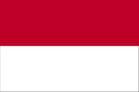
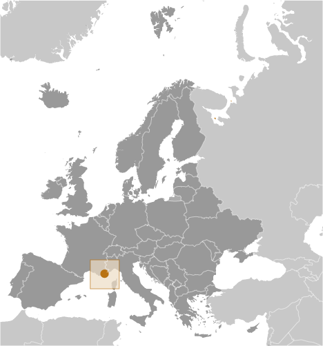
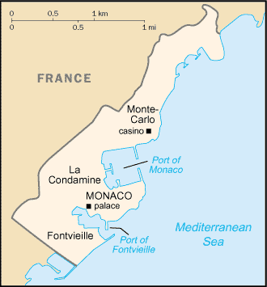

# Monaco

## Introduction

**_Background:_**   
The Genoese built a fortress on the site of present day Monaco in 1215. The current ruling GRIMALDI family first seized temporary control in 1297, and again in 1331, but were not able to permanently secure their holding until 1419. Economic development was spurred in the late 19th century with a railroad linkup to France and the opening of a casino. Since then, the principality's mild climate, splendid scenery, and gambling facilities have made Monaco world famous as a tourist and recreation center.

## Geography

**_Location:_**   
Western Europe, bordering the Mediterranean Sea on the southern coast of France, near the border with Italy

**_Geographic coordinates:_**   
43 44 N, 7 24 E

**_Map references:_**   
Europe

**_Area:_**   
**total:** 2 sq km   
**land:** 2 sq km   
**water:** 0 sq km

**_Area - comparative:_**   
about three times the size of The Mall in Washington, DC

**_Land boundaries:_**   
**total:** 6 km   
**border countries:** France 6 km

**_Coastline:_**   
4.1 km

**_Maritime claims:_**   
**territorial sea:** 12 nm   
**exclusive economic zone:** 12 nm

**_Climate:_**   
Mediterranean with mild, wet winters and hot, dry summers

**_Terrain:_**   
hilly, rugged, rocky

**_Elevation extremes:_**   
**lowest point:** Mediterranean Sea 0 m   
**highest point:** Mont Agel 140 m

**_Natural resources:_**   
none

**_Land use:_**   
**arable land:** 0%   
**permanent crops:** 1%   
**other:** 99% (urban area) (2011)

**_Irrigated land:_**   
NA

**_Natural hazards:_**   
NA

**_Environment - current issues:_**   
NA

**_Environment - international agreements:_**   
**party to:** Air Pollution, Air Pollution-Sulfur 94, Air Pollution-Volatile Organic Compounds, Biodiversity, Climate Change, Climate Change-Kyoto Protocol, Desertification, Endangered Species, Hazardous Wastes, Law of the Sea, Marine Dumping, Ozone Layer Protection, Ship Pollution, Wetlands, Whaling   
**signed, but not ratified:** none of the selected agreements

**_Geography - note:_**   
second-smallest independent state in the world (after Holy See); smallest country with a coastline; almost entirely urban

## People and Society

**_Nationality:_**   
**noun:** Monegasque(s) or Monacan(s)   
**adjective:** Monegasque or Monacan

**_Ethnic groups:_**   
French 47%, Monegasque 16%, Italian 16%, other 21%

**_Languages:_**   
French (official), English, Italian, Monegasque

**_Religions:_**   
Roman Catholic 90% (official), other 10%

**_Population:_**   
30,508   
**note:** immigrants make up more than 60% of the total population, according to UN data (2013) (July 2014 est.)

**_Age structure:_**   
**0-14 years:** 11.7% (male 1,828/female 1,742)   
**15-24 years:** 9.2% (male 1,445/female 1,371)   
**25-54 years:** 35.1% (male 5,332/female 5,363)   
**55-64 years:** 14.5% (male 2,223/female 2,203)   
**65 years and over:** 28.7% (male 4,020/female 4,981) (2014 est.)

**_Median age:_**   
**total:** 51.1 years   
**male:** 50 years   
**female:** 52.3 years (2014 est.)

**_Population growth rate:_**   
0.06% (2014 est.)

**_Birth rate:_**   
6.72 births/1,000 population (2014 est.)

**_Death rate:_**   
9.01 deaths/1,000 population (2014 est.)

**_Net migration rate:_**   
2.85 migrant(s)/1,000 population (2014 est.)

**_Urbanization:_**   
**urban population:** 100% of total population (2011)   
**rate of urbanization:** 0.04% annual rate of change (2010-15 est.)

**_Sex ratio:_**   
**at birth:** 1.04 male(s)/female   
**0-14 years:** 1.05 male(s)/female   
**15-24 years:** 1.05 male(s)/female   
**25-54 years:** 0.99 male(s)/female   
**55-64 years:** 0.95 male(s)/female   
**65 years and over:** 0.81 male(s)/female   
**total population:** 0.95 male(s)/female (2014 est.)

**_Infant mortality rate:_**   
**total:** 1.81 deaths/1,000 live births   
**male:** 2.05 deaths/1,000 live births   
**female:** 1.56 deaths/1,000 live births (2014 est.)

**_Life expectancy at birth:_**   
**total population:** 89.57 years   
**male:** 85.66 years   
**female:** 93.64 years (2014 est.)

**_Total fertility rate:_**   
1.52 children born/woman (2014 est.)

**_Health expenditures:_**   
4.3% of GDP (2011)

**_Physicians density:_**   
7.06 physicians/1,000 population (2011)

**_Hospital bed density:_**   
16.5 beds/1,000 population (2011)

**_Drinking water source:_**   
**improved:** urban: 100% of population; total: 100% of population (2012 est.)

**_Sanitation facility access:_**   
**improved:** urban: 100% of population; total: 100% of population   
**unimproved:** urban: 0% of population; total: 0% of population (2012 est.)

**_HIV/AIDS - adult prevalence rate:_**   
NA

**_HIV/AIDS - people living with HIV/AIDS:_**   
NA

**_HIV/AIDS - deaths:_**   
NA

**_Education expenditures:_**   
1.6% of GDP (2011)

**_Literacy:_**   
**definition:** age 15 and over can read and write   
**total population:** 99%   
**male:** 99%   
**female:** 99% (2003 est.)

**_Unemployment, youth ages 15-24:_**   
**total:** 6.9%   
**male:** 6.6%   
**female:** 7.4% (2000)

## Government

**_Country name:_**   
**conventional long form:** Principality of Monaco   
**conventional short form:** Monaco   
**local long form:** Principaute de Monaco   
**local short form:** Monaco

**_Government type:_**   
constitutional monarchy

**_Capital:_**   
**name:** Monaco   
**geographic coordinates:** 43 44 N, 7 25 E   
**time difference:** UTC+1 (6 hours ahead of Washington, DC, during Standard Time)   
**daylight saving time:** +1hr, begins last Sunday in March; ends last Sunday in October

**_Administrative divisions:_**   
none; there are no first-order administrative divisions as defined by the US Government, but there are four quarters (quartiers, singular - quartier); Fontvieille, La Condamine, Monaco-Ville, Monte-Carlo; note - Moneghetti, a part of La Condamine, is sometimes called the 5th quarter of Monaco

**_Independence:_**   
1419 (beginning of permanent rule by the House of GRIMALDI)

**_National holiday:_**   
National Day (Saint Rainier's Day), 19 November (1857)

**_Constitution:_**   
previous 1911 (suspended 1959); latest adopted 17 December 1962; amended 2002 (2013)

**_Legal system:_**   
civil law system influenced by French legal tradition

**_International law organization participation:_**   
has not submitted an ICJ jurisdiction declaration; non-party state to the ICCt

**_Suffrage:_**   
18 years of age; universal

**_Executive branch:_**   
**chief of state:** Prince ALBERT II (since 6 April 2005)   
**head of government:** Minister of State Michel ROGER (since 29 March 2010)   
**cabinet:** Council of Government under the authority of the monarch   
**elections:** the monarchy is hereditary; minister of state appointed by the monarch from a list of three French national candidates presented by the French Government

**_Legislative branch:_**   
unicameral National Council or Conseil National (24 seats; 16 members elected by list majority system, 8 by proportional representation to serve five-year terms)   
**elections:** last held on 10 February 2013 (next to be held in February 2018)   
**election results:** percent of vote by party - Horizon Monaco 50.3%, Union Monegasque 39%, Renaissance 10.7%; seats by party - Horizon Monaco 20, Union Monegasque 3, Renaissance 1

**_Judicial branch:_**   
**highest court(s):** Supreme Court (consists of 5 permanent members and 2 substitutes)   
**judge selection and term of office:** Supreme Court members appointed by the monarch upon the proposals of the National Council, State Council, Crown Council, Court of Appeal, and Trial Court   
**subordinate courts:** Court of Appeal; Civil Court of First Instance

**_Political parties and leaders:_**   
Horizon Monaco [Laurent NOUVION]   
Renaissance [SBM (public corporation)]   
Union Monegasque [Stephane VALERI]

**_Political pressure groups and leaders:_**   
NA

**_International organization participation:_**   
CD, CE, FAO, IAEA, ICAO, ICC (national committees), ICRM, IFRCS, IHO, IMO, IMSO, Interpol, IOC, IPU, ITSO, ITU, OAS (observer), OIF, OPCW, OSCE, Schengen Convention (de facto member), UN, UNCTAD, UNESCO, UNIDO, Union Latina, UNWTO, UPU, WHO, WIPO, WMO

**_Diplomatic representation in the US:_**   
**chief of mission:** Ambassador Maguy MACCARIO-DOYLE (since 3 December 2013)   
**chancery:** 3400 International Drive NW, Suite 2K-100, Washington, DC 20008   
**telephone:** (202) 234-1530   
**FAX:** (202) 244-7656   
**consulate(s) general:** New York

**_Diplomatic representation from the US:_**   
the US does not have an embassy in Monaco; the US Ambassador to France is accredited to Monaco; the US Consul General in Marseille (France), under the authority of the US ambassador to France, handles diplomatic and consular matters concerning Monaco

**_Flag description:_**   
two equal horizontal bands of red (top) and white; the colors are those of the ruling House of Grimaldi and have been in use since 1339, making the flag one of the world's oldest national banners   
**note:** similar to the flag of Indonesia which is longer and the flag of Poland which is white (top) and red

**_National anthem:_**   
**name:** "A Marcia de Muneghu" (The March of Monaco)   
**lyrics/music:** Louis NOTARI/Charles ALBRECHT   
**note:** music adopted 1867, lyrics adopted 1931; although French is commonly spoken, only the Monegasque lyrics are official; the French version is known as "Hymne Monegasque" (Monegasque Anthem); the words are generally only sung on official occasions

## Economy

**_Economy - overview:_**   
Monaco, bordering France on the Mediterranean coast, is a popular resort, attracting tourists to its casino and pleasant climate. The principality also is a banking center and has successfully sought to diversify into services and small, high-value-added, nonpolluting industries. The state has no income tax and low business taxes and thrives as a tax haven both for individuals who have established residence and for foreign companies that have set up businesses and offices. Monaco, however, is not a tax-free shelter; it charges nearly 20% value-added tax, collects stamp duties, and companies face a 33% tax on profits unless they can show that three-quarters of profits are generated within the principality. Monaco's reliance on tourism and banking for its economic growth has left it vulnerable to a downturn in France and other European economies which are the principality's main trade partners. In 2009, Monaco's GDP fell by 11.5% as the euro-zone crisis precipitated a sharp drop in tourism and retail activity and home sales. A modest recovery ensued in 2010, but Monaco's economic prospects remain uncertain, and tied to future euro-zone growth. Weak economic growth also has deteriorated public finances as the principality recorded budget deficits in 2011-12. Monaco was formally removed from the OECD's "grey list" of uncooperative tax jurisdictions in late 2009, but continues to face international pressure to abandon its banking secrecy laws and help combat tax evasion. The state retains monopolies in a number of sectors, including tobacco, the telephone network, and the postal service. Living standards are high, roughly comparable to those in prosperous French metropolitan areas.

**_GDP (purchasing power parity):_**   
$6.213 billion (2012 est.)   
$5.748 billion (2011 est.)   
$5.47 billion (2010 est.)   
**note:** data are in 2012 US dollars

**_GDP (official exchange rate):_**   
$5.748 billion (2011 est.)

**_GDP - real growth rate:_**   
0.9% (2012 est.)   
2.5% (2010 est.)   
-11.5% (2009 est.)

**_GDP - per capita (PPP):_**   
$85,500 (2011)

**_GDP - composition, by sector of origin:_**   
**agriculture:** 0%   
**industry:** 10%   
**services:** 90% (2011)

**_Agriculture - products:_**   
none

**_Industries:_**   
banking, insurance, tourism, construction, small-scale industrial and consumer products

**_Industrial production growth rate:_**   
NA%

**_Labor force:_**   
52,490   
**note:** includes all foreign workers (2012 est.)

**_Labor force - by occupation:_**   
**agriculture:** 0%   
**industry:** 16.1%   
**services:** 83.9% (2012 est.)

**_Unemployment rate:_**   
2% (2012)

**_Population below poverty line:_**   
NA%

**_Household income or consumption by percentage share:_**   
**lowest 10%:** NA%   
**highest 10%:** NA%

**_Budget:_**   
**revenues:** $1.044 billion   
**expenditures:** $1.111 billion (2011 est.)

**_Taxes and other revenues:_**   
18.2% of GDP (2011 est.)

**_Budget surplus (+) or deficit (-):_**   
-1.2% of GDP (2011 est.)

**_Fiscal year:_**   
calendar year

**_Inflation rate (consumer prices):_**   
1.5% (2010)

**_Market value of publicly traded shares:_**   
$NA

**_Exports:_**   
$1.115 billion (2011)   
$684.9 million (2010)   
**note:** full customs integration with France, which collects and rebates Monegasque trade duties; also participates in EU market system through customs union with France

**_Exports - partners:_**   
Europe 73.2%, Africa 14.6%, America 5.2%, Asia 4.9% (2013 est.)

**_Imports:_**   
$1.162 billion (2011)   
$850.2 million (2010)   
**note:** full customs integration with France, which collects and rebates Monegasque trade duties; also participates in EU market system through customs union with France

**_Imports - partners:_**   
Europe 70.4%, Asia 20.8%, America 4.4%, Africa 4.1% (2013 est.)

**_Debt - external:_**   
$NA

**_Exchange rates:_**   
euros (EUR) per US dollar -   
0.7634 (2013 est.)   
0.7752 (2012 est.)   
0.755 (2010 est.)   
0.7198 (2009 est.)   
0.6827 (2008 est.)

## Communications

**_Telephones - main lines in use:_**   
44,500 (2012)

**_Telephones - mobile cellular:_**   
33,200 (2012)

**_Telephone system:_**   
**general assessment:** modern automatic telephone system; the country's sole fixed line operator offers a full range of services to residential and business customers   
**domestic:** combined fixed-line and mobile-cellular teledensity exceeds 200 per 100 persons   
**international:** country code - 377; no satellite earth stations; connected by cable into the French communications system (2011)

**_Broadcast media:_**   
TV Monte-Carlo (TMC) operates a TV network; cable TV available; Radio Monte-Carlo has extensive radio networks in France and Italy with French-language broadcasts to France beginning in the 1960s and Italian-language broadcasts to Italy beginning in the 1970s; other radio stations include Riviera Radio and Radio Monaco (2012)

**_Internet country code:_**   
.mc

**_Internet hosts:_**   
26,009 (2012)

**_Internet users:_**   
23,000 (2009)

## Transportation

**_Heliports:_**   
1 (2012)

**_Roadways:_**   
**total:** 77 km   
**paved:** 77 km (2010)

**_Merchant marine:_**   
**registered in other countries:** 64 (Bahamas 8, Bermuda 2, Liberia 8, Malta 3, Marshall Islands 30, Panama 11, Saint Vincent and the Grenadines 2) (2010)

**_Ports and terminals:_**   
**major seaport(s):** Monaco

## Military

**_Military branches:_**   
no regular military forces; Directorate of Public Security (2012)

**_Manpower available for military service:_**   
**males age 16-49:** 5,749 (2010 est.)

**_Manpower fit for military service:_**   
**males age 16-49:** 4,629   
**females age 16-49:** 4,597 (2010 est.)

**_Manpower reaching militarily significant age annually:_**   
**male:** 153   
**female:** 141 (2010 est.)

**_Military - note:_**   
defense is the responsibility of France

## Transnational Issues

**_Disputes - international:_**   
none

............................................................   
_Page last updated on June 20, 2014_
