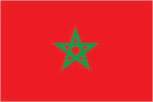
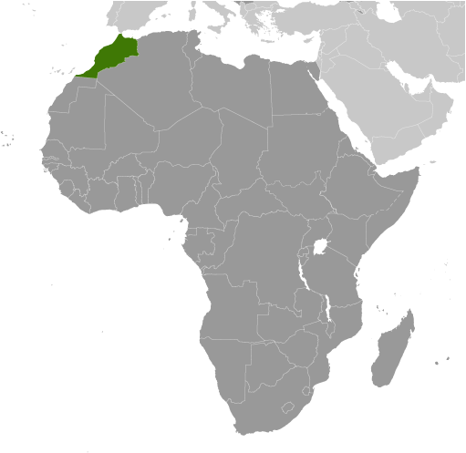
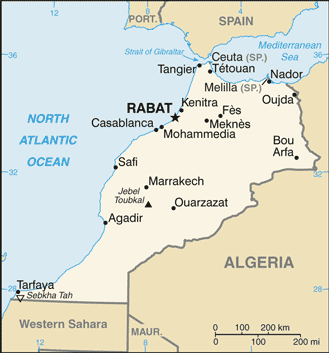

# Morocco

## Introduction

**_Background:_**   
In 788, about a century after the Arab conquest of North Africa, a series of Moroccan Muslim dynasties began to rule in Morocco. In the 16th century, the Sa'adi monarchy, particularly under Ahmad al-MANSUR (1578-1603), repelled foreign invaders and inaugurated a golden age. The Alaouite Dynasty, to which the current Moroccan royal family belongs, dates from the 17th century. In 1860, Spain occupied northern Morocco and ushered in a half century of trade rivalry among European powers that saw Morocco's sovereignty steadily erode; in 1912, the French imposed a protectorate over the country. A protracted independence struggle with France ended successfully in 1956. The internationalized city of Tangier and most Spanish possessions were turned over to the new country that same year. Sultan MOHAMMED V, the current monarch's grandfather, organized the new state as a constitutional monarchy and in 1957 assumed the title of king. Although Morocco is not the UN-recognized Administering Power for the Western Sahara, it exercises de facto administrative control over 80% of the territory. The UN since 1991 has monitored a ceasefire between Morocco and the Polisario Front and leads ongoing negotiations over the status of the territory. King MOHAMMED VI in early 2011 responded to the spread of pro-democracy protests in the region by implementing a reform program that included a new constitution, passed by popular referendum in July 2011, under which some new powers were extended to parliament and the prime minister but ultimate authority remains in the hands of the monarch. In November 2012, the Justice and Development Party - a moderate Islamist party - won the largest number of seats in parliamentary elections, becoming the first Islamist party to lead the Moroccan Government.

## Geography

**_Location:_**   
Northern Africa, bordering the North Atlantic Ocean and the Mediterranean Sea, between Algeria and Western Sahara

**_Geographic coordinates:_**   
32 00 N, 5 00 W

**_Map references:_**   
Africa

**_Area:_**   
**total:** 446,550 sq km   
**land:** 446,300 sq km   
**water:** 250 sq km

**_Area - comparative:_**   
slightly larger than California

**_Land boundaries:_**   
**total:** 2,020.5 km   
**border countries:** Algeria 1,559 km, Western Sahara 443 km, Spain (Ceuta) 8 km, Spain (Melilla) 10.5 km   
**note:** an additional 75-meter border segment exists between Morocco and the Spanish exclave of Penon de Velez de la Gomera

**_Coastline:_**   
1,835 km

**_Maritime claims:_**   
**territorial sea:** 12 nm   
**contiguous zone:** 24 nm   
**exclusive economic zone:** 200 nm   
**continental shelf:** 200 m depth or to the depth of exploitation

**_Climate:_**   
Mediterranean, becoming more extreme in the interior

**_Terrain:_**   
northern coast and interior are mountainous with large areas of bordering plateaus, intermontane valleys, and rich coastal plains

**_Elevation extremes:_**   
**lowest point:** Sebkha Tah -55 m   
**highest point:** Jebel Toubkal 4,165 m

**_Natural resources:_**   
phosphates, iron ore, manganese, lead, zinc, fish, salt

**_Land use:_**   
**arable land:** 17.79%   
**permanent crops:** 2.6%   
**other:** 79.61% (2011)

**_Irrigated land:_**   
14,850 sq km (2004)

**_Total renewable water resources:_**   
29 cu km (2011)

**_Freshwater withdrawal (domestic/industrial/agricultural):_**   
**total:** 12.61 cu km/yr (12%/4%/84%)   
**per capita:** 428.1 cu m/yr (2005)

**_Natural hazards:_**   
northern mountains geologically unstable and subject to earthquakes; periodic droughts

**_Environment - current issues:_**   
land degradation/desertification (soil erosion resulting from farming of marginal areas, overgrazing, destruction of vegetation); water supplies contaminated by raw sewage; siltation of reservoirs; oil pollution of coastal waters

**_Environment - international agreements:_**   
**party to:** Biodiversity, Climate Change, Climate Change-Kyoto Protocol, Desertification, Endangered Species, Hazardous Wastes, Law of the Sea, Marine Dumping, Ozone Layer Protection, Ship Pollution, Wetlands, Whaling   
**signed, but not ratified:** Environmental Modification

**_Geography - note:_**   
strategic location along Strait of Gibraltar

## People and Society

**_Nationality:_**   
**noun:** Moroccan(s)   
**adjective:** Moroccan

**_Ethnic groups:_**   
Arab-Berber 99%, other 1%

**_Languages:_**   
Arabic (official), Berber languages (Tamazight (official), Tachelhit, Tarifit), French (often the language of business, government, and diplomacy)

**_Religions:_**   
Muslim 99% (official; virtually all Sunni,

**_Population:_**   
32,987,206 (July 2014 est.)

**_Age structure:_**   
**0-14 years:** 26.7% (male 4,479,676/female 4,342,605)   
**15-24 years:** 17.7% (male 2,899,041/female 2,931,856)   
**25-54 years:** 42% (male 6,693,877/female 7,146,696)   
**55-64 years:** 7.3% (male 1,200,733/female 1,203,447)   
**65 years and over:** 6.3% (male 940,291/female 1,148,984) (2014 est.)

**_Dependency ratios:_**   
**total dependency ratio:** 49.1 %   
**youth dependency ratio:** 41.6 %   
**elderly dependency ratio:** 7.5 %   
**potential support ratio:** 13.4 (2014 est.)

**_Median age:_**   
**total:** 28.1 years   
**male:** 27.5 years   
**female:** 28.7 years (2014 est.)

**_Population growth rate:_**   
1.02% (2014 est.)

**_Birth rate:_**   
18.47 births/1,000 population (2014 est.)

**_Death rate:_**   
4.79 deaths/1,000 population (2014 est.)

**_Net migration rate:_**   
-3.46 migrant(s)/1,000 population (2014 est.)

**_Urbanization:_**   
**urban population:** 57% of total population (2011)   
**rate of urbanization:** 1.62% annual rate of change (2010-15 est.)

**_Major urban areas - population:_**   
Casablanca 3.046 million; RABAT (capital) 1.843 million; Fes 1.088 million; Marrakech 939,000; Tangier 810,000; Agadir 805,000 (2011)

**_Sex ratio:_**   
**at birth:** 1.05 male(s)/female   
**0-14 years:** 1.03 male(s)/female   
**15-24 years:** 0.99 male(s)/female   
**25-54 years:** 0.94 male(s)/female   
**55-64 years:** 0.97 male(s)/female   
**65 years and over:** 0.82 male(s)/female   
**total population:** 0.97 male(s)/female (2014 est.)

**_Mother's mean age at first birth:_**   
25.4   
**note:** median age at first birth among women 30-34 (2003-04 est.)

**_Maternal mortality rate:_**   
100 deaths/100,000 live births (2010)

**_Infant mortality rate:_**   
**total:** 24.52 deaths/1,000 live births   
**male:** 28.96 deaths/1,000 live births   
**female:** 19.87 deaths/1,000 live births (2014 est.)

**_Life expectancy at birth:_**   
**total population:** 76.51 years   
**male:** 73.44 years   
**female:** 79.74 years (2014 est.)

**_Total fertility rate:_**   
2.15 children born/woman (2014 est.)

**_Contraceptive prevalence rate:_**   
67.4% (2011)

**_Health expenditures:_**   
6% of GDP (2011)

**_Physicians density:_**   
0.62 physicians/1,000 population (2009)

**_Hospital bed density:_**   
1.1 beds/1,000 population (2009)

**_Drinking water source:_**   
**improved:** urban: 98.5% of population; rural: 63.6% of population; total: 83.6% of population   
**unimproved:** urban: 1.5% of population; rural: 36.4% of population; total: 16.4% of population (2012 est.)

**_Sanitation facility access:_**   
**improved:** urban: 84.5% of population; rural: 63.1% of population; total: 75.4% of population   
**unimproved:** urban: 15.5% of population; rural: 36.9% of population; total: 24.6% of population (2012 est.)

**_HIV/AIDS - adult prevalence rate:_**   
0.1% (2012 est.)

**_HIV/AIDS - people living with HIV/AIDS:_**   
30,000 (2012 est.)

**_HIV/AIDS - deaths:_**   
1,200 (2012 est.)

**_Obesity - adult prevalence rate:_**   
16.4% (2008)

**_Children under the age of 5 years underweight:_**   
3.1% (2011)

**_Education expenditures:_**   
5.4% of GDP (2009)

**_Literacy:_**   
**definition:** age 15 and over can read and write   
**total population:** 67.1%   
**male:** 76.1%   
**female:** 57.6% (2011 est.)

**_School life expectancy (primary to tertiary education):_**   
**total:** 11 years   
**male:** 12 years   
**female:** 11 years (2010)

**_Child labor - children ages 5-14:_**   
**total number:** 500,960   
**percentage:** 8 % (2007 est.)

**_Unemployment, youth ages 15-24:_**   
**total:** 18.6%   
**male:** 18.4%   
**female:** 19.2% (2012)

## Government

**_Country name:_**   
**conventional long form:** Kingdom of Morocco   
**conventional short form:** Morocco   
**local long form:** Al Mamlakah al Maghribiyah   
**local short form:** Al Maghrib

**_Government type:_**   
constitutional monarchy

**_Capital:_**   
**name:** Rabat   
**geographic coordinates:** 34 01 N, 6 49 W   
**time difference:** UTC 0 (5 hours ahead of Washington, DC, during Standard Time)   
**daylight saving time:** +1 hr, begins last Sunday in April; ends last Sunday in September

**_Administrative divisions:_**   
15 regions; Grand Casablanca, Chaouia-Ouardigha, Doukkala-Abda, Fes-Boulemane, Gharb-Chrarda-Beni Hssen, Guelmim-Es Smara, Laayoune-Boujdour-Sakia El Hamra, Marrakech-Tensift-Al Haouz, Meknes-Tafilalet, Oriental, Rabat-Sale-Zemmour-Zaer, Souss-Massa-Draa, Tadla-Azilal, Tanger-Tetouan, Taza-Al Hoceima-Taounate   
**note:** Morocco claims the territory of Western Sahara, the political status of which is considered undetermined by the US Government; portions of the regions Guelmim-Es Smara and Laayoune-Boujdour-Sakia El Hamra as claimed by Morocco lie within Western Sahara; Morocco also claims Oued Eddahab-Lagouira, another region that falls entirely within Western Sahara

**_Independence:_**   
2 March 1956 (from France)

**_National holiday:_**   
Throne Day (accession of King MOHAMMED VI to the throne), 30 July (1999)

**_Constitution:_**   
several previous; latest drafted 17 June 2011, approved by referendum 1 July 2011; note - sources disagree on whether the 2011 referendum was for a new constitution or for reforms to the previous constitution (2011)

**_Legal system:_**   
mixed legal system of civil law based on French law and Islamic law; judicial review of legislative acts by Supreme Court

**_International law organization participation:_**   
has not submitted an ICJ jurisdiction declaration; non-party state to the ICCt

**_Suffrage:_**   
18 years of age; universal

**_Executive branch:_**   
**chief of state:** King MOHAMMED VI (since 30 July 1999)   
**head of government:** Prime Minister Abdelillah BENKIRANE (since 29 November 2011)   
**cabinet:** Council of Ministers appointed by the prime minister as well as Minister Delegates to each ministry appoined by the Palace   
**elections:** the monarchy is hereditary; prime minister appointed by the monarch from the winning party following legislative elections

**_Legislative branch:_**   
bicameral Parliament consists of the Chamber of Counselors or Majlis al-Mustacharin (270 seats - to be reduced to a maximum of 120; members elected indirectly by local councils, professional organizations, and labor syndicates to serve six-year terms; one-third of the members are elected every three years) and Chamber of Representatives or Majlis al-Nuwab (395 seats; members elected by popular vote to serve five-year terms)   
**elections:** Chamber of Counselors - last held on 3 October 2009 (next pending legislation by the 2011 constitution); Chamber of Representatives - last held on 25 November 2011 (next to be held in 2016)   
**election results:** Chamber of Counselors - percent of vote by party - NA; seats by party - NA; Chamber of Representatives - percent of vote by party - NA; seats by party - PJD 107, PI 60, RNI 52, PAM 47, USFP 39, MP 32, UC 23, PPS 18, other 17

**_Judicial branch:_**   
**highest court(s):** Supreme Court or Court of Cassation (consists of 5-judge panels organized into civil, family matters, commercial, administrative, social, and criminal sections)   
**judge selection and term of office:** Supreme Court judges appointed by the monarch upon the recommendation of the Supreme Council of the Judiciary   
**subordinate courts:** courts of appeal; regional and sadad courts (for religious, civil and administrative, and penal adjudication)

**_Political parties and leaders:_**   
Action Party or PA [Mohammed EL IDRISSI]   
Al Ahd (The Covenant) Party [Najib EL OUAZZANI]   
Alliance des Libert'es (Alliance of Liberties) or ADL [Ali BELHAJ]   
An-Nahj Ad-Dimocrati or An-Nahj [Abdellah EL HARIF]   
Authenticity and Modernity Party or PAM [Mustapha BAKKOURY, secretary general]   
Choura et Istiqlal (Consultation and Independence) Party or PCI [Abdelwahed MAACH]   
Citizens' Forces or FC [Abderrahman LAHJOUJI]   
Citizenship and Development Initiative or ICD [Mohamed BENHAMOU]   
Constitutional Union Party or UC [Mohammed ABIED]   
Democratic and Social Movement or MDS [Mahmoud ARCHANE]   
Democratic Forces Front or FFD [Touhami EL KHIARI]   
Democratic Socialist Vanguard Party or PADS [Ahmed BENJELLOUN]   
Democratic Society Party or PSD [Zhor CHEKKAFI]   
Democratic Union or UD [Bouazza IKKEN]   
Environment and Development Party or PED [Ahmed EL ALAMI]   
Istiqlal (Independence) Party or PI [Hamid CHABAT]   
   
Labor Party or LP [Abdelkrim BENATIK]   
Moroccan Liberal Party or PML [Mohamed ZIANE]   
National Democratic Party or PND [Abdallah KADIRI]   
National Ittihadi Congress Party or CNI [Abdelmajid BOUZOUBAA]   
National Popular Movement or MNP [Mahjoubi AHERDANE]   
National Rally of Independents or RNI [Salaheddine MEZOUAR]   
National Union of Popular Forces or UNFP [Abdellah IBRAHIM]   
Party of Justice and Development or PJD [Abdelillah BENKIRANE]; Popular Movement or MP [Mohamed LAENSER]   
Progress and Socialism Party or PPS [Nabil BENABDELLAH]   
Reform and Development Party or PRD [Abderrahmane EL KOUHEN]   
Renaissance and Virtue Party or PRV [Mohamed KHALIDI]   
Renewal and Equity Party or PRE [Chakir ACHABAR]   
Social Center Party or PSC [Lahcen MADIH]   
Socialist Democratic Party or PSD [Aissa OUARDIGHI]   
Socialist Union of Popular Forces or USFP [Driss LACHGAR]   
Unified Socialist Left Party or PGSU [Mohamed Ben Said AIT IDDER]

**_Political pressure groups and leaders:_**   
Democratic Confederation of Labor or CDT [Noubir AMAOUI]   
General Union of Moroccan Workers or UGTM [Abderrazzak AFILAL]   
Justice and Charity Organization or JCO   
Moroccan Employers Association or CGEM [Hassan CHAMI]   
National Labor Union of Morocco or UNMT [Abdelslam MAATI]   
Union of Moroccan Workers or UMT [Mahjoub BENSEDDIK]

**_International organization participation:_**   
ABEDA, AfDB, AFESD, AMF, AMU, CAEU, CD, EBRD, FAO, G-11, G-77, IAEA, IBRD, ICAO, ICC (national committees), ICRM, IDA, IDB, IFAD, IFC, IFRCS, IHO, ILO, IMF, IMO, IMSO, Interpol, IOC, IOM, IPU, ISO, ITSO, ITU, ITUC (NGOs), LAS, MIGA, MONUSCO, NAM, OAS (observer), OIC, OIF, OPCW, OSCE (partner), Pacific Alliance (observer), Paris Club (associate), PCA, UN, UN Security Council (temporary), UNCTAD, UNESCO, UNHCR, UNIDO, UNOCI, UNSC (temporary), UNWTO, UPU, WCO, WHO, WIPO, WMO, WTO

**_Diplomatic representation in the US:_**   
**chief of mission:** Ambassador Mohammed Rachad BOUHLAL (since 22 December 2011)   
**chancery:** 1601 21st Street NW, Washington, DC 20009   
**telephone:** [1] (202) 462-7979   
**FAX:** [1] (202) 462-7643   
**consulate(s) general:** New York

**_Diplomatic representation from the US:_**   
**chief of mission:** Ambassador (vacant); Charge d'Affaires Matthew LUSSENHOP (since July 2013)   
**embassy:** 2 Avenue de Mohamed El Fassi, Rabat   
**mailing address:** Unit 9400, Box 021, DPO AE 09718   
**telephone:** [212] (537) 76 22 65   
**FAX:** [212] (537) 76 56 61   
**consulate(s) general:** Casablanca

**_Flag description:_**   
red with a green pentacle (five-pointed, linear star) known as Sulayman's (Solomon's) seal in the center of the flag; red and green are traditional colors in Arab flags, although the use of red is more commonly associated with the Arab states of the Persian gulf; the pentacle represents the five pillars of Islam and signifies the association between God and the nation; design dates to 1912

**_National symbol(s):_**   
pentacle symbol; lion

**_National anthem:_**   
**name:** "Hymne Cherifien" (Hymn of the Sharif)   
**lyrics/music:** Ali Squalli HOUSSAINI/Leo MORGAN   
**note:** music adopted 1956, lyrics adopted 1970

## Economy

**_Economy - overview:_**   
Morocco has capitalized on its proximity to Europe and relatively low labor costs to build a diverse, open, market-oriented economy. In the 1980s Morocco was a heavily indebted country before pursuing austerity measures and pro-market reforms, overseen by the IMF. Since taking the throne in 1999, King MOHAMMED VI has presided over a stable economy marked by steady growth, low inflation, and gradually falling unemployment, although a poor harvest and economic difficulties in Europe contributed to an economic slowdown in 2012. Industrial development strategies and infrastructure improvements - most visibly illustrated by a new port and free trade zone near Tangier - are improving Morocco's competitiveness. Morocco also seeks to expand its renewable energy capacity with a goal of making renewable 40% of electricity output by 2020. Key sectors of the economy include agriculture, tourism, phosphates, textiles, apparel, and subcomponents. To boost exports, Morocco entered into a bilateral Free Trade Agreement with the United States in 2006 and an Advanced Status agreement with the European Union in 2008. Despite Morocco's economic progress, the country suffers from high unemployment, poverty, and illiteracy, particularly in rural areas. In 2011 and 2012, high prices on fuel - which is subsidized and almost entirely imported - strained the government's budget and widened the country's current account deficit. In the fall of 2013, Morocco capped some of its fuel subsidies in an effort to gradually reduce the country’s large budgetary deficit. Key economic challenges for Morocco include fighting corruption and reforming the education system, the judiciary, and the government's costly subsidy program.

**_GDP (purchasing power parity):_**   
$180 billion (2013 est.)   
$171.2 billion (2012 est.)   
$166.7 billion (2011 est.)   
**note:** data are in 2013 US dollars

**_GDP (official exchange rate):_**   
$104.8 billion (2013 est.)

**_GDP - real growth rate:_**   
5.1% (2013 est.)   
2.7% (2012 est.)   
5% (2011 est.)

**_GDP - per capita (PPP):_**   
$5,500 (2013 est.)   
$5,300 (2012 est.)   
$5,200 (2011 est.)   
**note:** data are in 2013 US dollars

**_Gross national saving:_**   
25.4% of GDP (2013 est.)   
25.1% of GDP (2012 est.)   
27.6% of GDP (2011 est.)

**_GDP - composition, by end use:_**   
**household consumption:** 59.5%   
**government consumption:** 19.1%   
**investment in fixed capital:** 30.8%   
**investment in inventories:** 3.7%   
**exports of goods and services:** 35.4%   
**imports of goods and services:** -48.5%; (2013 est.)

**_GDP - composition, by sector of origin:_**   
**agriculture:** 15.1%   
**industry:** 31.7%   
**services:** 53.2% (2012 est.)

**_Agriculture - products:_**   
barley, wheat, citrus fruits, grapes, vegetables, olives; livestock; wine

**_Industries:_**   
phosphate mining and processing, food processing, leather goods, textiles, construction, energy, tourism

**_Industrial production growth rate:_**   
1.2% (2013 est.)

**_Labor force:_**   
11.73 million (2013 est.)

**_Labor force - by occupation:_**   
**agriculture:** 44.6%   
**industry:** 19.8%   
**services:** 35.5% (2006 est.)

**_Unemployment rate:_**   
9.5% (2013 est.)   
9% (2012 est.)

**_Population below poverty line:_**   
15% (2007 est.)

**_Household income or consumption by percentage share:_**   
**lowest 10%:** 2.7%   
**highest 10%:** 33.2% (2007)

**_Distribution of family income - Gini index:_**   
40.9 (2007 est.)   
39.5 (1999 est.)

**_Budget:_**   
**revenues:** $26.07 billion   
**expenditures:** $34.51 billion (2013 est.)

**_Taxes and other revenues:_**   
24.9% of GDP (2013 est.)

**_Budget surplus (+) or deficit (-):_**   
-8% of GDP (2013 est.)

**_Public debt:_**   
76.9% of GDP (2013 est.)   
71.2% of GDP (2012 est.)

**_Fiscal year:_**   
calendar year

**_Inflation rate (consumer prices):_**   
2.5% (2013 est.)   
1.2% (2012 est.)

**_Central bank discount rate:_**   
6.5% (31 December 2010 est.)   
3.31% (31 December 2009 est.)

**_Commercial bank prime lending rate:_**   
6.3% (31 December 2013 est.)   
6.3% (31 December 2012 est.)

**_Stock of narrow money:_**   
$75.71 billion (31 December 2013 est.)   
$71.51 billion (31 December 2012 est.)

**_Stock of broad money:_**   
$90.76 billion (31 December 2013 est.)   
$84.52 billion (31 December 2012 est.)

**_Stock of domestic credit:_**   
$121 billion (31 December 2013 est.)   
$111.6 billion (31 December 2012 est.)

**_Market value of publicly traded shares:_**   
$NA (31 December 2012 est.)   
$60.09 billion (31 December 2011)   
$69.15 billion (31 December 2010 est.)

**_Current account balance:_**   
-$9.595 billion (2013 est.)   
-$9.843 billion (2012 est.)

**_Exports:_**   
$16.78 billion (2013 est.)   
$16.99 billion (2012 est.)

**_Exports - commodities:_**   
clothing and textiles, electric components, inorganic chemicals, transistors, crude minerals, fertilizers (including phosphates), petroleum products, citrus fruits, vegetables, fish

**_Exports - partners:_**   
France 21%, Spain 17.3%, Brazil 5.4%, India 4.9%, US 4.6% (2012)

**_Imports:_**   
$38.66 billion (2013 est.)   
$38.88 billion (2012 est.)

**_Imports - commodities:_**   
crude petroleum, textile fabric, telecommunications equipment, wheat, gas and electricity, transistors, plastics

**_Imports - partners:_**   
Spain 13.1%, France 12.1%, China 6.9%, US 6.8%, Saudi Arabia 6.2%, Italy 5.1%, Russia 5%, Germany 4.9% (2012)

**_Reserves of foreign exchange and gold:_**   
$19.16 billion (31 December 2013 est.)   
$17.54 billion (31 December 2012 est.)

**_Debt - external:_**   
$36.51 billion (31 December 2013 est.)   
$32.15 billion (31 December 2012 est.)

**_Stock of direct foreign investment - at home:_**   
$51.82 billion (31 December 2013 est.)   
$48.18 billion (31 December 2012 est.)

**_Stock of direct foreign investment - abroad:_**   
$1.972 billion (31 December 2013 est.)   
$2.423 billion (31 December 2012 est.)

**_Exchange rates:_**   
Moroccan dirhams (MAD) per US dollar -   
8.439 (2013 est.)   
8.6026 (2012 est.)   
8.4172 (2010 est.)   
8.0571 (2009)   
7.526 (2008)

## Energy

**_Electricity - production:_**   
21.13 billion kWh (2010 est.)

**_Electricity - consumption:_**   
23.61 billion kWh (2010 est.)

**_Electricity - exports:_**   
0 kWh (2012 est.)

**_Electricity - imports:_**   
3.94 billion kWh (2010 est.)

**_Electricity - installed generating capacity:_**   
6.62 million kW (2010 est.)

**_Electricity - from fossil fuels:_**   
69.3% of total installed capacity (2010 est.)

**_Electricity - from nuclear fuels:_**   
0% of total installed capacity (2010 est.)

**_Electricity - from hydroelectric plants:_**   
19.4% of total installed capacity (2010 est.)

**_Electricity - from other renewable sources:_**   
4.3% of total installed capacity (2010 est.)

**_Crude oil - production:_**   
5,057 bbl/day (2012 est.)

**_Crude oil - exports:_**   
0 bbl/day (2010 est.)

**_Crude oil - imports:_**   
122,900 bbl/day (2010 est.)

**_Crude oil - proved reserves:_**   
680,000 bbl (1 January 2013 est.)

**_Refined petroleum products - production:_**   
131,500 bbl/day (2010 est.)

**_Refined petroleum products - consumption:_**   
203,600 bbl/day (2011 est.)

**_Refined petroleum products - exports:_**   
20,830 bbl/day (2010 est.)

**_Refined petroleum products - imports:_**   
143,000 bbl/day (2010 est.)

**_Natural gas - production:_**   
60 million cu m (2011 est.)

**_Natural gas - consumption:_**   
560 million cu m (2010 est.)

**_Natural gas - exports:_**   
0 cu m (2011 est.)

**_Natural gas - imports:_**   
150 million cu m (2011 est.)

**_Natural gas - proved reserves:_**   
1.444 billion cu m (1 January 2013 est.)

**_Carbon dioxide emissions from consumption of energy:_**   
43.71 million Mt (2011 est.)

## Communications

**_Telephones - main lines in use:_**   
3.28 million (2012)

**_Telephones - mobile cellular:_**   
39.016 million (2012)

**_Telephone system:_**   
**general assessment:** good system composed of open-wire lines, cables, and microwave radio relay links; principal switching centers are Casablanca and Rabat; national network nearly 100% digital using fiber-optic links; improved rural service employs microwave radio relay; Internet available but expensive   
**domestic:** fixed-line teledensity is roughly 10 per 100 persons; mobile-cellular subscribership exceeds 100 per 100 persons   
**international:** country code - 212; landing point for the Atlas Offshore, Estepona-Tetouan, Euroafrica, Spain-Morocco, and SEA-ME-WE-3 fiber-optic telecommunications undersea cables that provide connectivity to Asia, the Middle East, and Europe; satellite earth stations - 2 Intelsat (Atlantic Ocean) and 1 Arabsat; microwave radio relay to Gibraltar, Spain, and Western Sahara; coaxial cable and microwave radio relay to Algeria; participant in Medarabtel; fiber-optic cable link from Agadir to Algeria and Tunisia (2011)

**_Broadcast media:_**   
2 TV broadcast networks with state-run Radio-Television Marocaine (RTM) operating one network and the state partially owning the other; foreign TV broadcasts are available via satellite dish; 3 radio broadcast networks with RTM operating one; the government-owned network includes 10 regional radio channels in addition to its national service (2007)

**_Internet country code:_**   
.ma

**_Internet hosts:_**   
277,338 (2012)

**_Internet users:_**   
13.213 million (2009)

## Transportation

**_Airports:_**   
55 (2013)

**_Airports - with paved runways:_**   
**total:** 31   
**over 3,047 m:** 11   
**2,438 to 3,047 m:** 9   
**1,524 to 2,437 m:** 7   
**914 to 1,523 m:** 4 (2013)

**_Airports - with unpaved runways:_**   
**total:** 24   
**2,438 to 3,047 m:** 1   
**1,524 to 2,437 m:** 7   
**914 to 1,523 m:** 11   
**under 914 m:** 5 (2013)

**_Heliports:_**   
1 (2013)

**_Pipelines:_**   
gas 944 km; oil 270 km; refined products 175 km (2013)

**_Railways:_**   
**total:** 2,067 km   
**standard gauge:** 2,067 km 1.435-m gauge (1,022 km electrified) (2008)

**_Roadways:_**   
**total:** 58,395 km   
**paved:** 41,116 km (includes 1,080 km of expressways)   
**unpaved:** 17,279 km (2010)

**_Merchant marine:_**   
**total:** 26   
**by type:** cargo 1, chemical tanker 3, container 6, passenger/cargo 14, roll on/roll off 2   
**foreign-owned:** 14 (France 3, Germany 1, Italy 1, Spain 9)   
**registered in other countries:** 4 (Gibraltar 4) (2010)

**_Ports and terminals:_**   
**major seaport(s):** Casablanca, Jorf Lasfar, Mohammedia, Safi, Tangier   
**container port(s) (TEUs):** Tangier (2,093,408)

## Military

**_Military branches:_**   
Royal Armed Forces (Forces Armees Royales, FAR): Royal Moroccan Army (includes Air Defense), Royal Moroccan Navy (includes Coast Guard, Marines), Royal Moroccan Air Force (Al Quwwat al Jawyiya al Malakiya Marakishiya; Force Aerienne Royale Marocaine) (2010)

**_Military service age and obligation:_**   
20 years of age for voluntary military service; no conscription; service obligation - 18 months (2012)

**_Manpower available for military service:_**   
**males age 16-49:** 8,252,682   
**females age 16-49:** 8,691,419 (2010 est.)

**_Manpower fit for military service:_**   
**males age 16-49:** 7,026,016   
**females age 16-49:** 7,377,045 (2010 est.)

**_Manpower reaching militarily significant age annually:_**   
**male:** 300,327   
**female:** 298,366 (2010 est.)

**_Military expenditures:_**   
3.55% of GDP (2012)   
3.37% of GDP (2011)   
3.55% of GDP (2010)

## Transnational Issues

**_Disputes - international:_**   
claims and administers Western Sahara whose sovereignty remains unresolved; Morocco protests Spain's control over the coastal enclaves of Ceuta, Melilla, and Penon de Velez de la Gomera, the islands of Penon de Alhucemas and Islas Chafarinas, and surrounding waters; both countries claim Isla Perejil (Leila Island); discussions have not progressed on a comprehensive maritime delimitation, setting limits on resource exploration and refugee interdiction, since Morocco's 2002 rejection of Spain's unilateral designation of a median line from the Canary Islands; Morocco serves as one of the primary launching areas of illegal migration into Spain from North Africa; Algeria's border with Morocco remains an irritant to bilateral relations, each nation accusing the other of harboring militants and arms smuggling; the National Liberation Front's assertions of a claim to Chirac Pastures in southeastern Morocco is a dormant dispute

**_Trafficking in persons:_**   
**current situation:** Morocco is a source, destination, and transit country for men, women, and children who are subjected to forced labor and sex trafficking; Moroccan adults and children are exploited for forced labor and forced prostitution in the Middle East and Europe; some Moroccan girls recruited to work as maids experience conditions of forced labor, while some Moroccan boys are forced to work as apprentices in the artisan and construction industries and in mechanic shops; women and children from sub-Saharan Africa and South Asia who voluntarily enter Morocco are subsequently coerced into prostitution or, less frequently, domestic service; women and children from Cote d'Ivoire, the Democratic Republic of the Congo, and Nigeria are also vulnerable to sex trafficking and, to a lesser extent, forced labor in Morocco   
**tier rating:** Tier 2 Watch List - Morocco does not comply with the minimum standards for the elimination of trafficking; however, it is making significant efforts to do so; the government does not demonstrate progress in investigating, prosecuting, convicting, and adequately punishing trafficking offenders and has failed to provide law enforcement data; it has not developed or employed systematic procedures to proactively identify trafficking victims among vulnerable groups, particularly the sub-Saharan migrant community, but has made some efforts to offer protective services to Moroccan women and child trafficking victims; Morocco continues to lack a single comprehensive anti-trafficking law (2013)

**_Illicit drugs:_**   
one of the world's largest producers of illicit hashish; shipments of hashish mostly directed to Western Europe; transit point for cocaine from South America destined for Western Europe; significant consumer of cannabis

............................................................   
_Page last updated on June 20, 2014_
