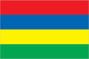
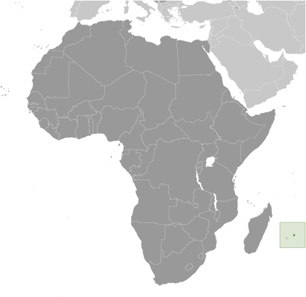
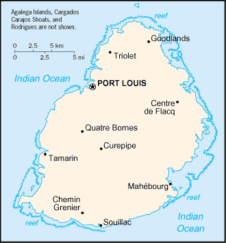

# Mauritius

## Introduction

**_Background:_**   
Although known to Arab and Malay sailors as early as the 10th century, Mauritius was first explored by the Portuguese in the 16th century and subsequently settled by the Dutch - who named it in honor of Prince Maurits van NASSAU - in the 17th century. The French assumed control in 1715, developing the island into an important naval base overseeing Indian Ocean trade, and establishing a plantation economy of sugar cane. The British captured the island in 1810, during the Napoleonic Wars. Mauritius remained a strategically important British naval base, and later an air station, playing an important role during World War II for anti-submarine and convoy operations, as well as the collection of signals intelligence. Independence from the UK was attained in 1968. A stable democracy with regular free elections and a positive human rights record, the country has attracted considerable foreign investment and has earned one of Africa's highest per capita incomes.

## Geography

**_Location:_**   
Southern Africa, island in the Indian Ocean, about 800 km (500 mi) east of Madagascar

**_Geographic coordinates:_**   
20 17 S, 57 33 E

**_Map references:_**   
Africa

**_Area:_**   
**total:** 2,040 sq km   
**land:** 2,030 sq km   
**water:** 10 sq km   
**note:** includes Agalega Islands, Cargados Carajos Shoals (Saint Brandon), and Rodrigues

**_Area - comparative:_**   
almost 11 times the size of Washington, DC

**_Land boundaries:_**   
0 km

**_Coastline:_**   
177 km

**_Maritime claims:_**   
measured from claimed archipelagic straight baselines   
**territorial sea:** 12 nm   
**exclusive economic zone:** 200 nm   
**continental shelf:** 200 nm or to the edge of the continental margin

**_Climate:_**   
tropical, modified by southeast trade winds; warm, dry winter (May to November); hot, wet, humid summer (November to May)

**_Terrain:_**   
small coastal plain rising to discontinuous mountains encircling central plateau

**_Elevation extremes:_**   
**lowest point:** Indian Ocean 0 m   
**highest point:** Mont Piton 828 m

**_Natural resources:_**   
arable land, fish

**_Land use:_**   
**arable land:** 38.24%   
**permanent crops:** 1.96%   
**other:** 59.8% (2011)

**_Irrigated land:_**   
212.2 sq km (2003)

**_Total renewable water resources:_**   
2.75 cu km (2011)

**_Freshwater withdrawal (domestic/industrial/agricultural):_**   
**total:** 0.73 cu km/yr (30%/3%/68%)   
**per capita:** 568.2 cu m/yr (2003)

**_Natural hazards:_**   
cyclones (November to April); almost completely surrounded by reefs that may pose maritime hazards

**_Environment - current issues:_**   
water pollution, degradation of coral reefs

**_Environment - international agreements:_**   
**party to:** Antarctic-Marine Living Resources, Biodiversity, Climate Change, Climate Change-Kyoto Protocol, Desertification, Endangered Species, Environmental Modification, Hazardous Wastes, Law of the Sea, Marine Life Conservation, Ozone Layer Protection, Ship Pollution, Wetlands   
**signed, but not ratified:** none of the selected agreements

**_Geography - note:_**   
the main island, from which the country derives its name, is of volcanic origin and is almost entirely surrounded by coral reefs; former home of the dodo, a large flightless bird related to pigeons, driven to extinction by the end of the 17th century through a combination of hunting and the introduction of predatory species

## People and Society

**_Nationality:_**   
**noun:** Mauritian(s)   
**adjective:** Mauritian

**_Ethnic groups:_**   
Indo-Mauritian 68%, Creole 27%, Sino-Mauritian 3%, Franco-Mauritian 2%

**_Languages:_**   
Creole 86.5%, Bhojpuri 5.3%, French 4.1%, two languages 1.4%, other 2.6% (includes English, the official language, which is spoken by less than 1% of the population), unspecified 0.1% (2011 est.)

**_Religions:_**   
Hindu 48.5%, Roman Catholic 26.3%, Muslim 17.3%, other Christian 6.4%, other 0.6%, none 0.7%, unspecified 0.1% (2011 est.)

**_Population:_**   
1,331,155 (July 2014 est.)

**_Age structure:_**   
**0-14 years:** 21% (male 143,064/female 137,021)   
**15-24 years:** 15.5% (male 104,257/female 102,233)   
**25-54 years:** 44.1% (male 293,607/female 294,029)   
**55-64 years:** 10.9% (male 68,749/female 76,407)   
**65 years and over:** 8% (male 45,145/female 66,643) (2014 est.)

**_Dependency ratios:_**   
**total dependency ratio:** 39.8 %   
**youth dependency ratio:** 27.1 %   
**elderly dependency ratio:** 12.8 %   
**potential support ratio:** 7.8 (2014 est.)

**_Median age:_**   
**total:** 33.9 years   
**male:** 33.1 years   
**female:** 34.8 years (2014 est.)

**_Population growth rate:_**   
0.66% (2014 est.)

**_Birth rate:_**   
13.46 births/1,000 population (2014 est.)

**_Death rate:_**   
6.85 deaths/1,000 population (2014 est.)

**_Net migration rate:_**   
0 migrant(s)/1,000 population (2014 est.)

**_Urbanization:_**   
**urban population:** 41.8% of total population (2011)   
**rate of urbanization:** 0.57% annual rate of change (2010-15 est.)

**_Major urban areas - population:_**   
PORT LOUIS (capital) 151,000 (2011)

**_Sex ratio:_**   
**at birth:** 1.05 male(s)/female   
**0-14 years:** 1.04 male(s)/female   
**15-24 years:** 1.02 male(s)/female   
**25-54 years:** 1 male(s)/female   
**55-64 years:** 0.97 male(s)/female   
**65 years and over:** 0.67 male(s)/female   
**total population:** 0.97 male(s)/female (2014 est.)

**_Maternal mortality rate:_**   
60 deaths/100,000 live births (2010)

**_Infant mortality rate:_**   
**total:** 10.59 deaths/1,000 live births   
**male:** 12.59 deaths/1,000 live births   
**female:** 8.5 deaths/1,000 live births (2014 est.)

**_Life expectancy at birth:_**   
**total population:** 75.17 years   
**male:** 71.71 years   
**female:** 78.81 years (2014 est.)

**_Total fertility rate:_**   
1.77 children born/woman (2014 est.)

**_Contraceptive prevalence rate:_**   
75.8% (2002)

**_Health expenditures:_**   
5.9% of GDP (2011)

**_Physicians density:_**   
1.06 physicians/1,000 population (2004)

**_Hospital bed density:_**   
3.4 beds/1,000 population (2011)

**_Drinking water source:_**   
**improved:** urban: 99.9% of population; rural: 99.7% of population; total: 99.8% of population   
**unimproved:** urban: 0.1% of population; rural: 0.3% of population; total: 0.2% of population (2012 est.)

**_Sanitation facility access:_**   
**improved:** urban: 91.7% of population; rural: 90.1% of population; total: 90.8% of population   
**unimproved:** urban: 8.3% of population; rural: 9.9% of population; total: 9.2% of population (2012 est.)

**_HIV/AIDS - adult prevalence rate:_**   
1.2% (2012 est.)

**_HIV/AIDS - people living with HIV/AIDS:_**   
10,500 (2012 est.)

**_HIV/AIDS - deaths:_**   
700 (2012 est.)

**_Obesity - adult prevalence rate:_**   
18.5% (2008)

**_Education expenditures:_**   
3.5% of GDP (2012)

**_Literacy:_**   
**definition:** age 15 and over can read and write   
**total population:** 88.8%   
**male:** 91.1%   
**female:** 86.7% (2011 est.)

**_School life expectancy (primary to tertiary education):_**   
**total:** 16 years   
**male:** 15 years   
**female:** 16 years (2012)

**_Unemployment, youth ages 15-24:_**   
**total:** 23.7%   
**male:** 20.4%   
**female:** 28.4% (2012)

## Government

**_Country name:_**   
**conventional long form:** Republic of Mauritius   
**conventional short form:** Mauritius   
**local long form:** Republic of Mauritius   
**local short form:** Mauritius

**_Government type:_**   
parliamentary democracy

**_Capital:_**   
**name:** Port Louis   
**geographic coordinates:** 20 09 S, 57 29 E   
**time difference:** UTC+4 (9 hours ahead of Washington, DC, during Standard Time)

**_Administrative divisions:_**   
9 districts and 3 dependencies\*; Agalega Islands\*, Black River, Cargados Carajos Shoals\*, Flacq, Grand Port, Moka, Pamplemousses, Plaines Wilhems, Port Louis, Riviere du Rempart, Rodrigues\*, Savanne

**_Independence:_**   
12 March 1968 (from the UK)

**_National holiday:_**   
Independence Day, 12 March (1968)

**_Constitution:_**   
several previous; latest adopted 12 March 1968; amended many times, last in 2012 (2012)

**_Legal system:_**   
civil legal system based on French civil law with some elements of English common law

**_International law organization participation:_**   
accepts compulsory ICJ jurisdiction with reservations; accepts ICCt jurisdiction

**_Suffrage:_**   
18 years of age; universal

**_Executive branch:_**   
**chief of state:** President Rajkeswur Kailash PURRYAG (since 21 July 2012); note - former President Sir Anerood JUGNAUTH resigned on 31 March 2012   
**head of government:** Prime Minister Navinchandra RAMGOOLAM (since 5 July 2005)   
**cabinet:** Council of Ministers appointed by the president on the recommendation of the prime minister   
**elections:** president and vice president elected by the National Assembly for five-year terms (eligible for a second term); elections last held on 21 July 2012 (next to be held in 2017); prime minister and deputy prime minister appointed by the president, responsible to the National Assembly; note - former President Sir Anerood JUGNAUTH resigned on 31 March 2012   
**election results:** Rajkeswur Kailash PURRYAG elected president by unanimous vote

**_Legislative branch:_**   
unicameral National Assembly (70 seats; 62 members elected by popular vote, 8 appointed by the election commission to give representation to various ethnic minorities; members to serve five-year terms)   
**elections:** last held on 5 May 2010 (next to be held in 2015)   
**election results:** percent of vote by party - NA; seats by party - AF 41, MMM 18, MR 2, FSM 1; appointed seats - to be assigned 8; note - as of 4 March 2014 seats by party were AF 38, MMM 19, MSM 9, FSM 1, MMSD 1, OPR 1, other 1

**_Judicial branch:_**   
**highest court(s):** Supreme Court of Mauritius (consists of the chief justice, a senior puisne judge, and 17 puisne judges)   
**judge selection and term of office:** chief justice appointed by the president after consultation with the prime minister; senior puisne judge appointed by the president with the advice of the chief justice; other puisne judges appointed by the president with the advice of the Judicial and Legal Commission, a 4-member body of judicial officials including the chief justice; all judges serve until retirement at age 62   
**subordinate courts:** Court of Civil Appeal; Court of Criminal Appeal; Public Bodies Appeal Tribunal (formed by a 2008 constitutional amendment)

**_Political parties and leaders:_**   
Alliance of the Future (l'Alliance de l'Avenir) or AF [Navinchandra RAMGOOLAM] (governing coalition - includes PTR-PMSD-MSM)   
Alliance of the Heart (l'Alliance du Coeur) or AC [Paul BERENGER] (coalition includes - MMM, UN, MMSD)   
Labor Party (Parti Travailliste) or PTR [Navinchandra RAMGOOLAM]   
Mauritian Militant Movement (Mouvement Militant Mauricien) or MMM [Paul BERENGER]   
Militant Socialist Movement (Mouvement Socialist Mauricien) or MSM [Pravind JUGNAUTH]   
Maurition Social Democratic Party (Parti Mauricien Social Democrate) or PMSD [Xavier Luc DUVAL]   
Mauritian Solidarity Front (Front Solidarite Mauricienne) or FSM [Cehl FAKEERMEEAH]   
Mauritian Social Democratic Movement (Mouvement Mauricien Social Democrate) or MMSD [Eric GUIMBEAU]   
Mauritian Militant Socialist Movement (Mouvement Militant Socialiste Mauricienne) or MMSM [Madan DULLOO]   
National Union (Union Nationale) or UN [Ashok JUGNAUTH]   
Rodrigues Movement (Mouvement Rodriguais) or MR [Joseph (Nicholas) Von MALLY]   
Rodrigues Peoples Organization (Organisation du Peuple Rodriguais) or OPR [Serge CLAIR]

**_Political pressure groups and leaders:_**   
LALIT Political Party   
Blok 104. Rezistans ek Alternativ (Resistence and Alternative), Say No to Coal!   
**other:** various labor unions

**_International organization participation:_**   
ACP, AfDB, AOSIS, AU, C, CD, COMESA, CPLP (associate), FAO, G-77, IAEA, IBRD, ICAO, ICC (NGOs), ICRM, IDA, IFAD, IFC, IFRCS, IHO, ILO, IMF, IMO, IMSO, InOC, Interpol, IOC, IOM, IPU, ISO, ITSO, ITU, ITUC (NGOs), MIGA, NAM, OIF, OPCW, PCA, SAARC (observer), SADC, UN, UNCTAD, UNESCO, UNIDO, UNWTO, UPU, WCO, WFTU (NGOs), WHO, WIPO, WMO, WTO

**_Diplomatic representation in the US:_**   
**chief of mission:** Ambassador Somduth SOBORUN (since 28 January 2011)   
**chancery:** 1709 N Street NW, Washington, DC 20036; administrative offices - 3201 Connecticut Avenue NW, Suite 441, Washington, DC 20036   
**telephone:** [1] (202) 244-1491 through 1492   
**FAX:** [1] (202) 966-0983

**_Diplomatic representation from the US:_**   
**chief of mission:** Ambassador Sharon VILLAROSA (since 10 September 2012; note - also accredited to Seychelles   
**embassy:** 4th Floor, Rogers House, John Kennedy Street, Port Louis   
**mailing address:** international mail: P. O. Box 544, Port Louis; US mail: American Embassy, Port Louis, US Department of State, Washington, DC 20521-2450   
**telephone:** [230] 202-4400   
**FAX:** [230] 208-9534

**_Flag description:_**   
four equal horizontal bands of red (top), blue, yellow, and green; red represents self-determination and independence, blue the Indian Ocean surrounding the island, yellow has been interpreted as the new light of independence, golden sunshine, or the bright future, and green can symbolize either agriculture or the lush vegetation of the island

**_National anthem:_**   
**name:** "Motherland"   
**lyrics/music:** Jean Georges PROSPER/Philippe GENTIL   
**note:** adopted 1968

## Economy

**_Economy - overview:_**   
Since independence in 1968, Mauritius has developed from a low-income, agriculturally based economy to a middle-income diversified economy with growing industrial, financial, and tourist sectors. Mauritius has achieved steady and strong growth over the last several decades, resulting in more equitable income distribution, increased life expectancy, lowered infant mortality, and a much-improved infrastructure. The economy rests on sugar, tourism, textiles and apparel, and financial services, and is expanding into fish processing, information and communications technology, and hospitality and property development. Sugarcane is grown on about 90% of the cultivated land area and accounts for 15% of export earnings. The government's development strategy centers on creating vertical and horizontal clusters of development in these sectors. Mauritius has attracted more than 32,000 offshore entities, many aimed at commerce in India, South Africa, and China. Investment in the banking sector alone has reached over $1 billion. Mauritius, with its strong textile sector, has been well poised to take advantage of the Africa Growth and Opportunity Act (AGOA). Mauritius' sound economic policies and prudent banking practices helped to mitigate negative effects of the global financial crisis in 2008-09. GDP grew in the 3-4% per year range in 2010-13, and the country continues to expand its trade and investment outreach around the globe.

**_GDP (purchasing power parity):_**   
$20.95 billion (2013 est.)   
$20.26 billion (2012 est.)   
$19.61 billion (2011 est.)   
**note:** data are in 2013 US dollars

**_GDP (official exchange rate):_**   
$11.9 billion (2013 est.)

**_GDP - real growth rate:_**   
3.4% (2013 est.)   
3.3% (2012 est.)   
3.8% (2011 est.)

**_GDP - per capita (PPP):_**   
$16,100 (2013 est.)   
$15,600 (2012 est.)   
$15,200 (2011 est.)   
**note:** data are in 2013 US dollars

**_Gross national saving:_**   
32% of GDP (2013 est.)   
32% of GDP (2012 est.)   
31% of GDP (2011 est.)

**_GDP - composition, by end use:_**   
**household consumption:** 74.1%   
**government consumption:** 13.2%   
**investment in fixed capital:** 22%   
**investment in inventories:** 1.5%   
**exports of goods and services:** 54.6%   
**imports of goods and services:** -65.4%; (2013 est.)

**_GDP - composition, by sector of origin:_**   
**agriculture:** 4.5%   
**industry:** 22%   
**services:** 73.4% (2013 est.)

**_Agriculture - products:_**   
sugarcane, tea, corn, potatoes, bananas, pulses; cattle, goats; fish

**_Industries:_**   
food processing (largely sugar milling), textiles, clothing, mining, chemicals, metal products, transport equipment, nonelectrical machinery, tourism

**_Industrial production growth rate:_**   
0.2% (2013 est.)

**_Labor force:_**   
637,600 (2013 est.)

**_Labor force - by occupation:_**   
**agriculture and fishing:** 9%   
**construction and industry:** 30%   
**transportation and communication:** 7%   
**trade, restaurants, hotels:** 22%   
**finance:** 6%   
**other services:** 25% (2007)

**_Unemployment rate:_**   
8.3% (2013 est.)   
8.1% (2012 est.)

**_Population below poverty line:_**   
8% (2006 est.)

**_Household income or consumption by percentage share:_**   
**lowest 10%:** NA%   
**highest 10%:** NA%

**_Distribution of family income - Gini index:_**   
39 (2006 est.)   
37 (1987 est.)

**_Budget:_**   
**revenues:** $2.507 billion   
**expenditures:** $2.736 billion (2013 est.)

**_Taxes and other revenues:_**   
21.1% of GDP (2013 est.)

**_Budget surplus (+) or deficit (-):_**   
-1.9% of GDP (2013 est.)

**_Public debt:_**   
58% of GDP (2013 est.)   
57.7% of GDP (2012 est.)

**_Fiscal year:_**   
1 July - 30 June

**_Inflation rate (consumer prices):_**   
3.5% (2013 est.)   
3.9% (2012 est.)

**_Central bank discount rate:_**   
9% (31 December 2010 est.)

**_Commercial bank prime lending rate:_**   
NA% (31 December 2013 est.)   
8.67% (31 December 2012 est.)

**_Stock of narrow money:_**   
$2.475 billion (31 December 2013 est.)   
$2.378 billion (31 December 2012 est.)

**_Stock of broad money:_**   
$11.73 billion (31 December 2013 est.)   
$11.38 billion (31 December 2012 est.)

**_Stock of domestic credit:_**   
$13.03 billion (31 December 2013 est.)   
$12.87 billion (31 December 2012 est.)

**_Market value of publicly traded shares:_**   
$NA (31 December 2012 est.)   
$7.667 billion (31 December 2011)   
$7.442 billion (31 December 2010 est.)

**_Current account balance:_**   
-$1.099 billion (2013 est.)   
-$1.175 billion (2012 est.)

**_Exports:_**   
$2.788 billion (2013 est.)   
$2.673 billion (2012 est.)

**_Exports - commodities:_**   
clothing and textiles, sugar, cut flowers, molasses, fish, primates (for research)

**_Exports - partners:_**   
UK 19.3%, France 16.4%, US 9.9%, South Africa 9.8%, Spain 7.5%, Italy 6.9%, Madagascar 6.8% (2012)

**_Imports:_**   
$4.953 billion (2013 est.)   
$5.104 billion (2012 est.)

**_Imports - commodities:_**   
manufactured goods, capital equipment, foodstuffs, petroleum products, chemicals

**_Imports - partners:_**   
India 23.1%, China 16%, France 8.5%, South Africa 6.5% (2012)

**_Reserves of foreign exchange and gold:_**   
$3.286 billion (31 December 2013 est.)   
$3.046 billion (31 December 2012 est.)

**_Debt - external:_**   
$2.894 billion (31 December 2013 est.)   
$2.606 billion (31 December 2012 est.)

**_Stock of direct foreign investment - at home:_**   
NA

**_Stock of direct foreign investment - abroad:_**   
NA

**_Exchange rates:_**   
Mauritian rupees (MUR) per US dollar -   
30.89 (2013 est.)   
30.051 (2012 est.)   
30.784 (2010 est.)   
31.96 (2009)   
27.973 (2008)

## Energy

**_Electricity - production:_**   
2.628 billion kWh (2011 est.)

**_Electricity - consumption:_**   
2.358 billion kWh (2010 est.)

**_Electricity - exports:_**   
0 kWh (2012 est.)

**_Electricity - imports:_**   
0 kWh (2012 est.)

**_Electricity - installed generating capacity:_**   
900,200 kW (2010 est.)

**_Electricity - from fossil fuels:_**   
75.7% of total installed capacity (2010 est.)

**_Electricity - from nuclear fuels:_**   
0% of total installed capacity (2010 est.)

**_Electricity - from hydroelectric plants:_**   
6.6% of total installed capacity (2010 est.)

**_Electricity - from other renewable sources:_**   
17.8% of total installed capacity (2010 est.)

**_Crude oil - production:_**   
0 bbl/day (2012 est.)

**_Crude oil - exports:_**   
0 bbl/day (2010 est.)

**_Crude oil - imports:_**   
0 bbl/day (2010 est.)

**_Crude oil - proved reserves:_**   
0 bbl (1 January 2013 est.)

**_Refined petroleum products - production:_**   
0 bbl/day (2010 est.)

**_Refined petroleum products - consumption:_**   
24,710 bbl/day (2011 est.)

**_Refined petroleum products - exports:_**   
0 bbl/day (2010 est.)

**_Refined petroleum products - imports:_**   
20,620 bbl/day (2010 est.)

**_Natural gas - production:_**   
0 cu m (2011 est.)

**_Natural gas - consumption:_**   
0 cu m (2010 est.)

**_Natural gas - exports:_**   
0 cu m (2011 est.)

**_Natural gas - imports:_**   
0 cu m (2011 est.)

**_Natural gas - proved reserves:_**   
0 cu m (1 January 2013 est.)

**_Carbon dioxide emissions from consumption of energy:_**   
5.06 million Mt (2011 est.)

## Communications

**_Telephones - main lines in use:_**   
349,100 (2012)

**_Telephones - mobile cellular:_**   
1.485 million (2012)

**_Telephone system:_**   
**general assessment:** small system with good service   
**domestic:** monopoly over fixed-line services terminated in 2005; fixed-line teledensity roughly 30 per 100 persons; mobile-cellular services launched in 1989 with current teledensity roughly 100 per 100 persons   
**international:** country code - 230; landing point for the SAFE submarine cable that provides links to Asia and South Africa where it connects to the SAT-3/WASC submarine cable that provides further links to parts of East Africa, and Europe; satellite earth station - 1 Intelsat (Indian Ocean); new microwave link to Reunion; HF radiotelephone links to several countries (2011)

**_Broadcast media:_**   
the government maintains control over TV broadcasting through the Mauritius Broadcasting Corporation (MBC), which operates 3 analog and 10 digital TV stations; MBC is a shareholder in a local company that operates 2 pay-TV stations; the state retains the largest radio broadcast network with multiple stations; several private radio broadcasters have entered the market since 2001; transmissions of at least 2 international broadcasters are available (2007)

**_Internet country code:_**   
.mu

**_Internet hosts:_**   
51,139 (2012)

**_Internet users:_**   
290,000 (2009)

## Transportation

**_Airports:_**   
5 (2013)

**_Airports - with paved runways:_**   
**total:** 2   
**over 3,047 m:** 1   
**914 to 1,523 m:** 1 (2013)

**_Airports - with unpaved runways:_**   
**total:** 3   
**914 to 1,523 m:** 2   
**under 914 m:** 1 (2013)

**_Roadways:_**   
**total:** 2,149 km   
**paved:** 2,149 km (includes 75 km of expressways) (2012)

**_Merchant marine:_**   
**total:** 4   
**by type:** passenger/cargo 2, petroleum tanker 1, refrigerated cargo 1 (2010)

**_Ports and terminals:_**   
**major seaport(s):** Port Louis

## Military

**_Military branches:_**   
no regular military forces; Mauritius Police Force, Special Mobile Force, National Coast Guard (2011)

**_Manpower available for military service:_**   
**males age 16-49:** 343,628 (2010 est.)

**_Manpower fit for military service:_**   
**males age 16-49:** 280,596   
**females age 16-49:** 283,317 (2010 est.)

**_Manpower reaching militarily significant age annually:_**   
**male:** 10,193   
**female:** 10,104 (2010 est.)

**_Military expenditures:_**   
0.19% of GDP (2012)   
0.16% of GDP (2011)   
0.19% of GDP (2010)

## Transnational Issues

**_Disputes - international:_**   
Mauritius and Seychelles claim the Chagos Islands; claims French-administered Tromelin Island

**_Illicit drugs:_**   
consumer and transshipment point for heroin from South Asia; small amounts of cannabis produced and consumed locally; significant offshore financial industry creates potential for money laundering, but corruption levels are relatively low and the government appears generally to be committed to regulating its banking industry

............................................................   
_Page last updated on June 20, 2014_
