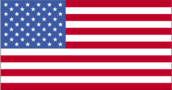
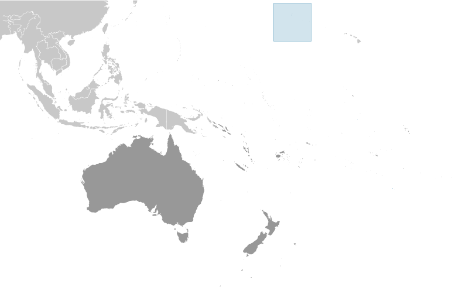
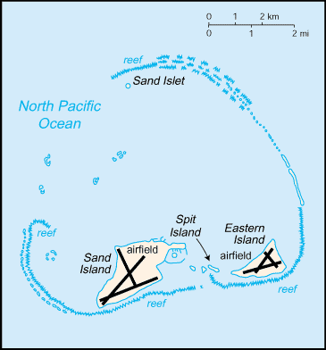

# Midway Islands

_territory of the US_

## Introduction

**_Background:_**   
The US took formal possession of the islands in 1867. The laying of the trans-Pacific cable, which passed through the islands, brought the first residents in 1903. Between 1935 and 1947, Midway was used as a refueling stop for trans-Pacific flights. The US naval victory over a Japanese fleet off Midway in 1942 was one of the turning points of World War II. The islands continued to serve as a naval station until closed in 1993. Today the islands are a US National Wildlife Refuge. From 1996 to 2001 the refuge was open to the public; it is now temporarily closed.

## Geography

**_Location:_**   
Oceania, atoll in the North Pacific Ocean, about one-third of the way from Honolulu to Tokyo

**_Geographic coordinates:_**   
28 12 N, 177 22 W

**_Map references:_**   
Oceania

**_Area:_**   
**total:** 6.2 sq km   
**land:** 6.2 sq km   
**water:** 0 sq km   
**note:** includes Eastern Island, Sand Island, and Spit Island

**_Area - comparative:_**   
about nine times the size of The Mall in Washington, DC

**_Land boundaries:_**   
0 km

**_Coastline:_**   
15 km

**_Maritime claims:_**   
**territorial sea:** 12 nm   
**exclusive economic zone:** 200 nm

**_Climate:_**   
subtropical; moderated by prevailing easterly winds

**_Terrain:_**   
low, nearly level

**_Elevation extremes:_**   
**lowest point:** Pacific Ocean 0 m   
**highest point:** unnamed location 13 m

**_Natural resources:_**   
wildlife, terrestrial and aquatic

**_Land use:_**   
**arable land:** 0%   
**permanent crops:** 0%   
**other:** 100% (2011)

**_Irrigated land:_**   
0 sq km (2011)

**_Natural hazards:_**   
NA

**_Environment - current issues:_**   
NA

**_Geography - note:_**   
a coral atoll managed as a national wildlife refuge and open to the public for wildlife-related recreation in the form of wildlife observation and photography, sport fishing, snorkeling, and scuba diving; in 2000 the lands and waters of the Midway National Wildlife Refuge were also designated as the Battle of Midway National Monument; Henderson Airfield on Sand Island continues to serve as an emergency landing field for military and civilian aircraft transiting the Pacific Ocean (2012)

## People and Society

**_Population:_**   
no indigenous inhabitants; approximately 40 people make up the staff of US Fish and Wildlife Service and their services contractor living at the atoll (July 2014 est.)

## Government

**_Country name:_**   
**conventional long form:** none   
**conventional short form:** Midway Islands

**_Dependency status:_**   
unincorporated territory of the US; formerly administered from Washington, DC, by the US Navy; on 31 October 1996, through a presidential executive order, the jurisdiction and control of the atoll was transferred to the Fish and Wildlife Service of the US Department of the Interior as part of the National Wildlife Refuge System

**_Legal system:_**   
the laws of the US, where applicable, apply

**_Flag description:_**   
the flag of the US is used

## Transportation

**_Airports - with paved runways:_**   
**total:** 2   
**1,524 to 2,437 m:** 2 (2013)

**_Airports - with unpaved runways:_**   
**total:** 1   
**914 to 1,523 m:** 1 (2013)

**_Ports and terminals:_**   
**major seaport(s):** Sand Island

**_Transportation - note:_**   
Henderson Field on Sand Island serves as an emergency landing site for aircraft crossing the Pacific Ocean

## Military

**_Military - note:_**   
defense is the responsibility of the US

## Transnational Issues

**_Disputes - international:_**   
none

............................................................   
_Page last updated on May 21, 2014_
