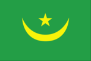
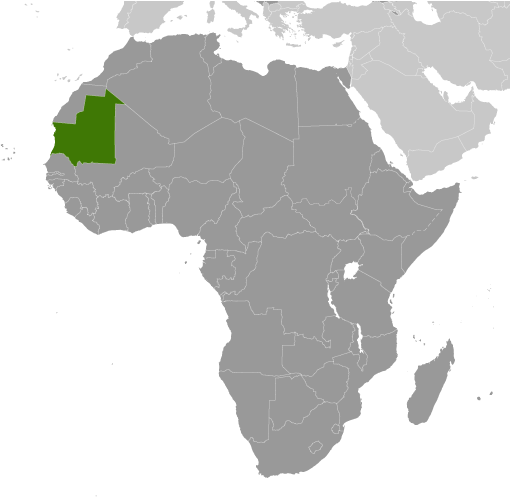
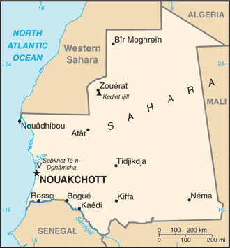

# Mauritania

## Introduction

**_Background:_**   
Independent from France in 1960, Mauritania annexed the southern third of the former Spanish Sahara (now Western Sahara) in 1976 but relinquished it after three years of raids by the Polisario guerrilla front seeking independence for the territory. Maaouya Ould Sid Ahmed TAYA seized power in a coup in 1984 and ruled Mauritania with a heavy hand for more than two decades. A series of presidential elections that he held were widely seen as flawed. A bloodless coup in August 2005 deposed President TAYA and ushered in a military council that oversaw a transition to democratic rule. Independent candidate Sidi Ould Cheikh ABDALLAHI was inaugurated in April 2007 as Mauritania's first freely and fairly elected president. His term ended prematurely in August 2008 when a military junta led by General Mohamed Ould Abdel AZIZ deposed him and installed a military council government. AZIZ was subsequently elected president in July 2009 and sworn in the following month. AZIZ sustained injuries from an accidental shooting by his own troops in October 2012 but has continued to maintain his authority. The country continues to experience ethnic tensions among its black population (Afro-Mauritanians) and white and black Moor (Arab-Berber) communities, and confronts a terrorism threat by al-Qa'ida in the Islamic Maghreb (AQIM).

## Geography

**_Location:_**   
Western Africa, bordering the North Atlantic Ocean, between Senegal and Western Sahara

**_Geographic coordinates:_**   
20 00 N, 12 00 W

**_Map references:_**   
Africa

**_Area:_**   
**total:** 1,030,700 sq km   
**land:** 1,030,700 sq km   
**water:** 0 sq km

**_Area - comparative:_**   
slightly larger than three times the size of New Mexico

**_Land boundaries:_**   
**total:** 5,074 km   
**border countries:** Algeria 463 km, Mali 2,237 km, Senegal 813 km, Western Sahara 1,561 km

**_Coastline:_**   
754 km

**_Maritime claims:_**   
**territorial sea:** 12 nm   
**contiguous zone:** 24 nm   
**exclusive economic zone:** 200 nm   
**continental shelf:** 200 nm or to the edge of the continental margin

**_Climate:_**   
desert; constantly hot, dry, dusty

**_Terrain:_**   
mostly barren, flat plains of the Sahara; some central hills

**_Elevation extremes:_**   
**lowest point:** Sebkhet Te-n-Dghamcha -5 m   
**highest point:** Kediet Ijill 915 m

**_Natural resources:_**   
iron ore, gypsum, copper, phosphate, diamonds, gold, oil, fish

**_Land use:_**   
**arable land:** 0.44%   
**permanent crops:** 0.01%   
**other:** 99.55% (2011)

**_Irrigated land:_**   
450.1 sq km (2004)

**_Total renewable water resources:_**   
11.4 cu km (2011)

**_Freshwater withdrawal (domestic/industrial/agricultural):_**   
**total:** 1.35 cu km/yr (7%/2%/91%)   
**per capita:** 420.2 cu m/yr (2005)

**_Natural hazards:_**   
hot, dry, dust/sand-laden sirocco wind blows primarily in March and April; periodic droughts

**_Environment - current issues:_**   
overgrazing, deforestation, and soil erosion aggravated by drought are contributing to desertification; limited natural freshwater resources away from the Senegal, which is the only perennial river; locust infestation

**_Environment - international agreements:_**   
**party to:** Biodiversity, Climate Change, Climate Change-Kyoto Protocol, Desertification, Endangered Species, Hazardous Wastes, Law of the Sea, Ozone Layer Protection, Ship Pollution, Wetlands, Whaling   
**signed, but not ratified:** none of the selected agreements

**_Geography - note:_**   
most of the population is concentrated in the cities of Nouakchott and Nouadhibou and along the Senegal River in the southern part of the country

## People and Society

**_Nationality:_**   
**noun:** Mauritanian(s)   
**adjective:** Mauritanian

**_Ethnic groups:_**   
black Moors (Haratines - Arab-speaking slaves, former slaves, and their descendants of African origin, enslaved by white Moors) 40%, white Moors (of Arab-Berber descent, known as Bidhan) 30%, black Africans (non-Arabic speaking, Halpulaar, Soninke, Wolof, and Bamara ethnic groups) 30%

**_Languages:_**   
Arabic (official and national), Pulaar, Soninke, Wolof (all national languages), French, Hassaniya (a variety of Arabic)

**_Religions:_**   
Muslim (official) 100%

**_Population:_**   
3,516,806 (July 2014 est.)

**_Age structure:_**   
**0-14 years:** 39.5% (male 697,156/female 691,548)   
**15-24 years:** 20% (male 343,214/female 358,533)   
**25-54 years:** 32.5% (male 528,133/female 613,324)   
**55-64 years:** 4.5% (male 71,265/female 87,086)   
**65 years and over:** 3.5% (male 53,705/female 72,842) (2014 est.)

**_Dependency ratios:_**   
**total dependency ratio:** 75.7 %   
**youth dependency ratio:** 70.1 %   
**elderly dependency ratio:** 5.6 %   
**potential support ratio:** 17.9 (2014 est.)

**_Median age:_**   
**total:** 19.9 years   
**male:** 19 years   
**female:** 20.9 years (2014 est.)

**_Population growth rate:_**   
2.26% (2014 est.)

**_Birth rate:_**   
31.83 births/1,000 population (2014 est.)

**_Death rate:_**   
8.35 deaths/1,000 population (2014 est.)

**_Net migration rate:_**   
-0.85 migrant(s)/1,000 population (2014 est.)

**_Urbanization:_**   
**urban population:** 41.5% of total population (2011)   
**rate of urbanization:** 2.91% annual rate of change (2010-15 est.)

**_Major urban areas - population:_**   
NOUAKCHOTT (capital) 786,000 (2011)

**_Sex ratio:_**   
**at birth:** 1.03 male(s)/female   
**0-14 years:** 1.01 male(s)/female   
**15-24 years:** 0.96 male(s)/female   
**25-54 years:** 0.86 male(s)/female   
**55-64 years:** 0.93 male(s)/female   
**65 years and over:** 0.74 male(s)/female   
**total population:** 0.93 male(s)/female (2014 est.)

**_Mother's mean age at first birth:_**   
21.9   
**note:** median age at first birth among women 25-29 (2000-01 est.)

**_Maternal mortality rate:_**   
510 deaths/100,000 live births (2010)

**_Infant mortality rate:_**   
**total:** 56.06 deaths/1,000 live births   
**male:** 61.04 deaths/1,000 live births   
**female:** 50.93 deaths/1,000 live births (2014 est.)

**_Life expectancy at birth:_**   
**total population:** 62.28 years   
**male:** 60 years   
**female:** 64.63 years (2014 est.)

**_Total fertility rate:_**   
4.07 children born/woman (2014 est.)

**_Contraceptive prevalence rate:_**   
9.3% (2007)

**_Health expenditures:_**   
5.4% of GDP (2011)

**_Physicians density:_**   
0.13 physicians/1,000 population (2009)

**_Hospital bed density:_**   
0.4 beds/1,000 population (2006)

**_Drinking water source:_**   
**improved:** urban: 52.3% of population; rural: 47.7% of population; total: 49.6% of population   
**unimproved:** urban: 47.7% of population; rural: 52.3% of population; total: 50.4% of population (2012 est.)

**_Sanitation facility access:_**   
**improved:** urban: 51.1% of population; rural: 9.2% of population; total: 26.7% of population   
**unimproved:** urban: 48.9% of population; rural: 90.8% of population; total: 73.3% of population (2012 est.)

**_HIV/AIDS - adult prevalence rate:_**   
0.4% (2012 est.)

**_HIV/AIDS - people living with HIV/AIDS:_**   
10,500 (2012 est.)

**_HIV/AIDS - deaths:_**   
800 (2012 est.)

**_Major infectious diseases:_**   
**degree of risk:** very high   
**food or waterborne diseases:** bacterial and protozoal diarrhea, hepatitis A, and typhoid fever   
**vectorborne diseases:** malaria and dengue fever   
**respiratory disease:** meningococcal meningitis   
**animal contact disease:** rabies (2013)

**_Obesity - adult prevalence rate:_**   
12.7% (2008)

**_Children under the age of 5 years underweight:_**   
19.5% (2012)

**_Education expenditures:_**   
3.7% of GDP (2011)

**_Literacy:_**   
**definition:** age 15 and over can read and write   
**total population:** 58.6%   
**male:** 65.3%   
**female:** 52% (2011 est.)

**_School life expectancy (primary to tertiary education):_**   
**total:** 8 years   
**male:** 8 years   
**female:** 8 years (2012)

**_Child labor - children ages 5-14:_**   
**total number:** 127,251   
**percentage:** 16 % (2007 est.)

## Government

**_Country name:_**   
**conventional long form:** Islamic Republic of Mauritania   
**conventional short form:** Mauritania   
**local long form:** Al Jumhuriyah al Islamiyah al Muritaniyah   
**local short form:** Muritaniyah

**_Government type:_**   
military junta

**_Capital:_**   
**name:** Nouakchott   
**geographic coordinates:** 18 04 N, 15 58 W   
**time difference:** UTC 0 (5 hours ahead of Washington, DC, during Standard Time)

**_Administrative divisions:_**   
13 regions (wilayas, singular - wilaya); Adrar, Assaba, Brakna, Dakhlet Nouadhibou, Gorgol, Guidimaka, Hodh ech Chargui, Hodh el Gharbi, Inchiri, Nouakchott, Tagant, Tiris Zemmour, Trarza

**_Independence:_**   
28 November 1960 (from France)

**_National holiday:_**   
Independence Day, 28 November (1960)

**_Constitution:_**   
previous 1964; latest adopted 12 July 1991; amended 2006, 2012 (2012)

**_Legal system:_**   
mixed legal system of Islamic and French civil law

**_International law organization participation:_**   
has not submitted an ICJ jurisdiction declaration; non-party state to the ICCt

**_Suffrage:_**   
18 years of age; universal

**_Executive branch:_**   
**chief of state:** President Mohamed Ould Abdel AZIZ (since 5 August 2009); note - AZIZ, who deposed democratically elected President Sidi Ould Cheikh ABDELLAHI in a coup and installed himself as President of the High State Council on 6 August 2008, retired from the military and stepped down from the presidency in April 2009 to run for president; he was elected president in an election held on 18 July 2009   
**head of government:** Prime Minister Moulaye Ould Mohamed LAGHDAF (since 14 August 2008)   
**cabinet:** Council of Ministers   
**elections:** president elected by popular vote for a five-year term; election last held on 18 July 2009 (next to be held by 2014)   
**election results:** Mohamed Ould Abdel AZIZ elected president; percent of vote - Mohamed Ould Abdel AZIZ 52.6%, Messaoud Ould BOULKHEIR 16.3%, Ahmed Ould DADDAH 13.7%, other 17.4%

**_Legislative branch:_**   
bicameral legislature consists of the Senate or Majlis al-Shuyukh (56 seats; 53 members elected by municipal leaders and 3 members elected for Mauritanians abroad to serve six-year terms; a portion of seats up for election every two years) and the National Assembly or Al Jamiya Al Wataniya (146 seats; 106 members elected in single- and multi-member constituencies to serve five-year terms and 40 are elected nationwide through a closed list proportional representation system to serve five-year terms; of the 40 seats elected at the nationwide level, 20 are reserved for women)   
**elections:** Senate - last held in November 2009; National Assembly - first round last held on 23 November and second round on 21 December 2013   
**election results:** Senate - percent of vote by party - NA; seats by party - CPM (Coalition of Majority Parties) 45, COD 7, RNRD-TAWASSOUL 4; National Assembly - percent of vote by party - NA; seats by party - UPR 75, RNRD-TAWASSOUL 16, El Wiam 10, APP 7, UDP 6, El Karam Party 6, AJD/MR 4, Surge of Youth for the Nation 4, El Vadila Party 3, PUD 3, Ravah Party 3, PRDR 3, others 6

**_Judicial branch:_**   
**highest court(s):** Supreme Court or Cour Supreme (subdivided into 1 criminal and 2 civil chambers, each with a president and 5 counselors); Constitutional Council (consists of 6 members)   
**judge selection and term of office:** Supreme Court president appointed by the president of the republic to serve a 5-year renewable term; Constitutional Council members appointed - 3 by the president of the republic, 2 by the president of the National Assembly, and 1 by the president of the Senate; members serve single, 9-year terms with one-third of membership renewed every 3 years   
**subordinate courts:** High Court of Justice (cases involving treason and criminal acts of high government officials); courts of appeal; wilaya (regional) courts (located at the headquarters of each of the 13 regions); commercial and labor courts; criminal courts; moughataa (district) courts; informal/customary courts

**_Political parties and leaders:_**   
Alliance for Justice and Democracy/Movement for Renewal or AJD/MR [Ibrahima Moctar SARR]   
Alternative or El-Badil [Mohamed Yahdhi Ould MOCTAR HACEN]   
Coalition of Majority Parties or CPM (parties supporting the regime including PRDR, UPR, UDP, RD, HATEM-PMUC, UCD)   
Coalition for Pacific Alternation or CAP (coalition of opposition parties, including APP, El Wiam, and Sawab)   
Coordination of Democratic Opposition or COD [Ahmed Ould DADDAH] (coalition of 11 opposition political parties including RNRD-TAWASSOUL, RFD, UFP, PNDD-ADIL, Alternative or El-Badil)   
Democratic Renewal or RD [Moustapha Ould ABDEIDARRAHMANE]   
El Karama Party [Cheikhna Ould Mohamed Ould HAJBOU]   
El Vadila Party [Ethmane Ould Ahmed ABOULMAALY]   
El Wiam [Boidiel Ould HOUMEIT]   
Mauritanian Party for Unity and Change or HATEM-PMUC [Saleh Ould HANENA]   
National Pact for Democracy and Development or PNDD-ADIL [Yahya Ould Ahmed El WAGHEF] (independents formerly supporting President Abdellahi)   
National Rally for Freedom, Democracy and Equality or RNLDE   
National Rally for Reform and Development or RNRD-TAWASSOUL [Mohamed Jamil MANSOUR] (moderate Islamists)   
Party of Unity and Development or PUD [Mohamed BARO]   
Popular Progressive Alliance or APP [Messaoud Ould BOULKHEIR]   
Popular Front or FP [Mohamed Lemine Ch'bih Ould CHEIKH MALAININE]   
Rally of Democratic Forces or RFD [Ahmed Ould DADDAH]   
Ravah Party   
Republican Party for Democracy and Renewal or PRDR [Mintata Mint HIDEID]   
Sawab [Abdel Salem Ould HORMA]   
Socialist and Democratic Unity Party or PUDS [Mahfouz Weld AZIZ]   
Surge of Youth for the Nation [Lalla CHERIVA]   
Union for Democracy and Progress or UDP [Naha Mint MOUKNASS]   
Union for the Republic or UPR [Mohamed Mahmoud Ould Mohamed LEMINE]   
Union of Democratic Center or UCD [Cheikh Sid'Ahmed Ould BABA]   
Union of the Forces for Progress or UFP [Mohamed Ould MAOULOUD]

**_Political pressure groups and leaders:_**   
General Confederation of Mauritanian Workers or CGTM [Abdallahi Ould MOHAMED, secretary general]   
Independent Confederation of Mauritanian Workers or CLTM [Samory Ould BEYE]   
Mauritanian Workers Union or UTM [Mohamed Ely Ould BRAHIM, secretary general]   
**other:** Arab nationalists; Ba'thists; Islamists

**_International organization participation:_**   
ABEDA, ACP, AfDB, AFESD, AMF, AMU, AU, CAEU (candidate), EITI (compliant country), FAO, G-77, IAEA, IBRD, ICAO, ICRM, IDA, IDB, IFAD, IFC, IFRCS, IHO (pending member), ILO, IMF, IMO, Interpol, IOC, IOM, IPU, ISO (correspondent), ITSO, ITU, ITUC (NGOs), LAS, MIGA, MIUSMA, NAM, OIC, OIF, OPCW, UN, UNCTAD, UNESCO, UNIDO, UNWTO, UPU, WCO, WHO, WIPO, WMO, WTO

**_Diplomatic representation in the US:_**   
**chief of mission:** Ambassador Mohamed Lemine El HAYCEN (since 28 July 2010)   
**chancery:** 2129 Leroy Place NW, Washington, DC 20008   
**telephone:** [1] (202) 232-5700 through 5701   
**FAX:** [1] (202) 319-2623

**_Diplomatic representation from the US:_**   
**chief of mission:** Ambassador (vacant); Charge d'Affaires David REIMER   
**embassy:** 288 Rue Abdallaye, Rue 42-100 (between Presidency building and Spanish Embassy), Nouakchott   
**mailing address:** BP 222, Nouakchott   
**telephone:** [222] 4525-2660 through 2663   
**FAX:** [222] 4525-1592

**_Flag description:_**   
green with a yellow five-pointed star above a yellow, horizontal crescent; the closed side of the crescent is down; the crescent, star, and color green are traditional symbols of Islam; the gold color stands for the sands of the Sahara

**_National symbol(s):_**   
star and crescent

**_National anthem:_**   
**name:** "Hymne National de la Republique Islamique de Mauritanie" (National Anthem of the Islamic Republic of Mauritania)   
**lyrics/music:** Baba Ould CHEIKH/traditional, arranged by Tolia NIKIPROWETZKY   
**note:** adopted 1960; the unique rhythm of the Mauritanian anthem makes it particularly challenging to sing

## Economy

**_Economy - overview:_**   
Mauritania's economy is dominated by natural resources and agriculture. Half the population still depends on agriculture and livestock for a livelihood, even though many of the nomads and subsistence farmers were forced into the cities by recurrent droughts in the 1970s and 1980s. Mauritania's extensive mineral resources include iron ore, gold, copper, gypsum, and phosphate rock and exploration is ongoing for uranium, crude oil, and natural gas. Extractive commodities make up 75% of Mauritania's total exports. The nation's coastal waters are among the richest fishing areas in the world, and fishing accounts for 20% of budget revenues, but overexploitation by foreigners threatens this key source of revenue. Risks to Mauritania's economy include its recurring exposure to droughts, dependence on foreign aid and investment, and insecurity in neighboring Mali, as well as significant shortages of infrastructure, institutional capacity, and human capital.

**_GDP (purchasing power parity):_**   
$8.204 billion (2013 est.)   
$7.708 billion (2012 est.)   
$7.212 billion (2011 est.)   
**note:** data are in 2013 US dollars

**_GDP (official exchange rate):_**   
$4.183 billion (2013 est.)

**_GDP - real growth rate:_**   
6.4% (2013 est.)   
6.9% (2012 est.)   
3.6% (2011 est.)

**_GDP - per capita (PPP):_**   
$2,200 (2013 est.)   
$2,100 (2012 est.)   
$2,000 (2011 est.)   
**note:** data are in 2013 US dollars

**_Gross national saving:_**   
27.4% of GDP (2013 est.)   
26.2% of GDP (2012 est.)   
39.3% of GDP (2011 est.)

**_GDP - composition, by end use:_**   
**household consumption:** 52.4%   
**government consumption:** 22.7%   
**investment in fixed capital:** 61.9%   
**investment in inventories:** -8.9%   
**exports of goods and services:** 56.8%   
**imports of goods and services:** -84.9%; (2013 est.)

**_GDP - composition, by sector of origin:_**   
**agriculture:** 16.9%   
**industry:** 54.6%   
**services:** 28.5% (2013 est.)

**_Agriculture - products:_**   
dates, millet, sorghum, rice, corn; cattle, sheep

**_Industries:_**   
fish processing, oil production, mining (iron ore, gold, copper)   
**note:** gypsum deposits have never been exploited

**_Industrial production growth rate:_**   
8% (2013 est.)

**_Labor force:_**   
1.318 million (2007)

**_Labor force - by occupation:_**   
**agriculture:** 50%   
**industry:** 2%   
**services:** 48% (2001 est.)

**_Unemployment rate:_**   
30% (2008 est.)   
20% (2004 est.)

**_Population below poverty line:_**   
40% (2004 est.)

**_Household income or consumption by percentage share:_**   
**lowest 10%:** 2.5%   
**highest 10%:** 29.5% (2000)

**_Distribution of family income - Gini index:_**   
39 (2000)   
37.3 (1995)

**_Budget:_**   
**revenues:** $1.677 billion   
**expenditures:** $1.702 billion (2013 est.)

**_Taxes and other revenues:_**   
40.1% of GDP (2013 est.)

**_Budget surplus (+) or deficit (-):_**   
-0.6% of GDP (2013 est.)

**_Fiscal year:_**   
calendar year

**_Inflation rate (consumer prices):_**   
4.6% (2013 est.)   
4.9% (2012 est.)

**_Central bank discount rate:_**   
9% (31 December 2009 est.)   
12% (31 December 2007)

**_Commercial bank prime lending rate:_**   
18% (31 December 2013 est.)   
17% (31 December 2012 est.)

**_Stock of domestic credit:_**   
$1.739 billion (31 December 2013 est.)   
$1.514 billion (31 December 2012 est.)

**_Market value of publicly traded shares:_**   
$NA

**_Current account balance:_**   
-$1.24 billion (2013 est.)   
-$1.263 billion (2012 est.)

**_Exports:_**   
$2.728 billion (2013 est.)   
$2.642 billion (2012 est.)

**_Exports - commodities:_**   
iron ore, fish and fish products, gold, copper, petroleum

**_Exports - partners:_**   
China 50.5%, Italy 7.8%, Japan 7.3%, France 4.9%, Spain 4.2%, Cote dIvoire 4.1%, Netherlands 4% (2012)

**_Imports:_**   
$3.355 billion (2013 est.)   
$3.176 billion (2012 est.)

**_Imports - commodities:_**   
machinery and equipment, petroleum products, capital goods, foodstuffs, consumer goods

**_Imports - partners:_**   
China 12.9%, Netherlands 10.5%, US 7.8%, France 7.8%, Brazil 5.6%, Germany 5.5%, Spain 5.1%, Belgium 4.7% (2012)

**_Debt - external:_**   
$3.233 billion (31 December 2013 est.)   
$2.922 billion (31 December 2012 est.)

**_Exchange rates:_**   
ouguiyas (MRO) per US dollar -   
298.1 (2013 est.)   
296.6 (2012 est.)   
275.89 (2010 est.)   
262.4 (2009)   
238.2 (2008)

## Energy

**_Electricity - production:_**   
701 million kWh (2010 est.)

**_Electricity - consumption:_**   
651.9 million kWh (2010 est.)

**_Electricity - exports:_**   
0 kWh (2012 est.)

**_Electricity - imports:_**   
0 kWh (2012 est.)

**_Electricity - installed generating capacity:_**   
263,000 kW (2010 est.)

**_Electricity - from fossil fuels:_**   
63.1% of total installed capacity (2010 est.)

**_Electricity - from nuclear fuels:_**   
0% of total installed capacity (2010 est.)

**_Electricity - from hydroelectric plants:_**   
36.9% of total installed capacity (2010 est.)

**_Electricity - from other renewable sources:_**   
0% of total installed capacity (2010 est.)

**_Crude oil - production:_**   
6,577 bbl/day (2012 est.)

**_Crude oil - exports:_**   
7,337 bbl/day (2010 est.)

**_Crude oil - imports:_**   
0 bbl/day (2010 est.)

**_Crude oil - proved reserves:_**   
20 million bbl (1 January 2013 est.)

**_Refined petroleum products - production:_**   
0 bbl/day (2010 est.)

**_Refined petroleum products - consumption:_**   
18,120 bbl/day (2011 est.)

**_Refined petroleum products - exports:_**   
0 bbl/day (2010 est.)

**_Refined petroleum products - imports:_**   
12,810 bbl/day (2010 est.)

**_Natural gas - production:_**   
0 cu m (2011 est.)

**_Natural gas - consumption:_**   
0 cu m (2010 est.)

**_Natural gas - exports:_**   
0 cu m (2011 est.)

**_Natural gas - imports:_**   
0 cu m (2011 est.)

**_Natural gas - proved reserves:_**   
28.32 billion cu m (1 January 2013 est.)

**_Carbon dioxide emissions from consumption of energy:_**   
1.774 million Mt (2011 est.)

## Communications

**_Telephones - main lines in use:_**   
65,100 (2012)

**_Telephones - mobile cellular:_**   
4.024 million (2012)

**_Telephone system:_**   
**general assessment:** limited system of cable and open-wire lines, minor microwave radio relay links, and radiotelephone communications stations; mobile-cellular services expanding rapidly   
**domestic:** Mauritel, the national telecommunications company, was privatized in 2001 but remains the monopoly provider of fixed-line services; fixed-line teledensity 2 per 100 persons; mobile-cellular network coverage extends mainly to urban areas with a teledensity of roughly 106 per 100 persons; mostly cable and open-wire lines; a domestic satellite telecommunications system links Nouakchott with regional capitals   
**international:** country code - 222; satellite earth stations - 3 (1 Intelsat - Atlantic Ocean, 2 Arabsat); fiber-optic and Asymmetric Digital Subscriber Line (ADSL) cables for Internet access (2009)

**_Broadcast media:_**   
one state-run TV (Television de Mauritanie) and one state-run radio network (Radio de Mauritanie); Television de Mauritanie has three channels, Al Mahadra station (for Islamic content) and Channels 1 and 2, which cover news, sports, and other programming; Radio de Mauritanie runs 12 regional stations as well as a radio station for youth and the Holy Quran station; five private TV channels and five private radio stations also broadcast from Mauritania; six private international radio stations broadcast in Mauritania on the FM band; with satellite connections, Mauritanians also have access to hundreds of foreign TV channels (2013)

**_Internet country code:_**   
.mr

**_Internet hosts:_**   
22 (2012)

**_Internet users:_**   
75,000 (2009)

## Transportation

**_Airports:_**   
30 (2013)

**_Airports - with paved runways:_**   
**total:** 9   
**2,438 to 3,047 m:** 5   
**1,524 to 2,437 m:** 4 (2013)

**_Airports - with unpaved runways:_**   
**total:** 21   
**2,438 to 3,047 m:** 1   
**1,524 to 2,437 m:** 10   
**914 to 1,523 m:** 8   
**under 914 m:** 2 (2013)

**_Railways:_**   
728 km   
**standard gauge:** 728 km 1.435-m gauge (2008)

**_Roadways:_**   
**total:** 10,628 km   
**paved:** 3,158 km   
**unpaved:** 7,470 km (2010)

**_Waterways:_**   
(some navigation is possible on the Senegal River) (2011)

**_Ports and terminals:_**   
**major seaport(s):** Nouadhibou, Nouakchott

## Military

**_Military branches:_**   
Mauritanian Armed Forces: Army, Mauritanian Navy (Marine Mauritanienne; includes naval infantry), Islamic Republic of Mauritania Air Group (Groupement Aerienne Islamique de Mauritanie, GAIM) (2013)

**_Military service age and obligation:_**   
18 is the legal minimum age for voluntary military service; no conscription (2012)

**_Manpower available for military service:_**   
**males age 16-49:** 718,713   
**females age 16-49:** 804,622 (2010 est.)

**_Manpower fit for military service:_**   
**males age 16-49:** 480,042   
**females age 16-49:** 581,473 (2010 est.)

**_Manpower reaching militarily significant age annually:_**   
**male:** 36,116   
**female:** 36,826 (2010 est.)

## Transnational Issues

**_Disputes - international:_**   
Mauritanian claims to Western Sahara remain dormant

**_Refugees and internally displaced persons:_**   
**refugees (country of origin):** 26,001 (Western Saharan - Sahrawis) (2013); 52,647 (Mali) (2014)

**_Trafficking in persons:_**   
**current situation:** Mauritania is a source, transit, and destination country for men, women, and children subjected to conditions of forced labor and sex trafficking; adults and children from traditional slave castes are subjected to slavery-related practices rooted in ancestral master-slave relationships; Mauritanian boys called talibe are trafficked within the country by religious teachers for forced begging; Mauritanian girls, as well as girls from Mali, Senegal, The Gambia, and other West African countries are forced into domestic servitude; Mauritanian women and girls are forced into prostitution in the country or transported to countries in the Middle East for the same purpose

............................................................   
_Page last updated on June 20, 2014_
