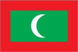
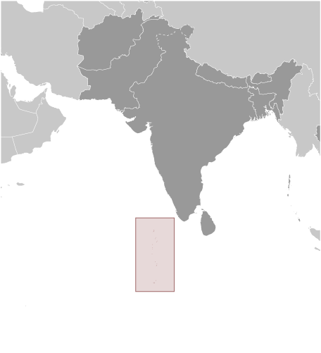
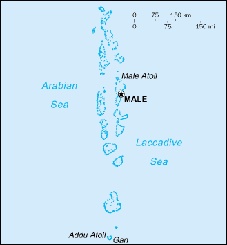

# Maldives

## Introduction

**_Background:_**   
A sultanate since the 12th century, the Maldives became a British protectorate in 1887. It became a republic in 1968, three years after independence. President Maumoon Abdul GAYOOM dominated the islands' political scene for 30 years, elected to six successive terms by single-party referendums. Following political demonstrations in the capital Male in August 2003, the president and his government pledged to embark upon a process of liberalization and democratic reforms, including a more representative political system and expanded political freedoms. Progress was sluggish, however, and many promised reforms were slow to be realized. Nonetheless, political parties were legalized in 2005. In June 2008, a constituent assembly - termed the "Special Majlis" - finalized a new constitution, which was ratified by the president in August. The first-ever presidential elections under a multi-candidate, multi-party system were held in October 2008. GAYOOM was defeated in a runoff poll by Mohamed NASHEED, a political activist who had been jailed several years earlier by the former regime. President NASHEED faced a number of challenges including strengthening democracy and combating poverty and drug abuse. In early February 2012, after several weeks of street protests following his sacking of a top judge, NASHEED resigned the presidency and handed over power to Vice President Mohammed WAHEED Hassan Maniku. In mid-2012, a Commission of National Inquiry was set by the government to probe events leading up to NASHEED's resignation. Though the commission found no evidence of a coup, the report recommended the need to strengthen the country's democratic institutions to avert similar events in the future, and to further investigate alleged police misconduct during the crisis. Maldivian officials have played a prominent role in international climate change discussions (due to the islands' low elevation and the threat from sea-level rise) on the UN Human Rights Council and in other international forums, as well as in encouraging regional cooperation, especially between India and Pakistan.

## Geography

**_Location:_**   
Southern Asia, group of atolls in the Indian Ocean, south-southwest of India

**_Geographic coordinates:_**   
3 15 N, 73 00 E

**_Map references:_**   
Asia

**_Area:_**   
**total:** 298 sq km   
**land:** 298 sq km   
**water:** 0 sq km

**_Area - comparative:_**   
about 1.7 times the size of Washington, DC

**_Land boundaries:_**   
0 km

**_Coastline:_**   
644 km

**_Maritime claims:_**   
measured from claimed archipelagic straight baselines   
**territorial sea:** 12 nm   
**contiguous zone:** 24 nm   
**exclusive economic zone:** 200 nm

**_Climate:_**   
tropical; hot, humid; dry, northeast monsoon (November to March); rainy, southwest monsoon (June to August)

**_Terrain:_**   
flat, with white sandy beaches

**_Elevation extremes:_**   
**lowest point:** Indian Ocean 0 m   
**highest point:** unnamed location on Viligili in the Addu Atholhu 2.4 m

**_Natural resources:_**   
fish

**_Land use:_**   
**arable land:** 10%   
**permanent crops:** 10%   
**other:** 80% (2011)

**_Irrigated land:_**   
0 sq km NA (2003)

**_Total renewable water resources:_**   
0.03 cu km (2011)

**_Freshwater withdrawal (domestic/industrial/agricultural):_**   
**total:** 0.01 cu km/yr (95%/5%/0%)   
**per capita:** 18.44 cu m/yr (2008)

**_Natural hazards:_**   
tsunamis; low elevation of islands makes them sensitive to sea level rise

**_Environment - current issues:_**   
depletion of freshwater aquifers threatens water supplies; global warming and sea level rise; coral reef bleaching

**_Environment - international agreements:_**   
**party to:** Biodiversity, Climate Change, Climate Change-Kyoto Protocol, Desertification, Hazardous Wastes, Law of the Sea, Ozone Layer Protection, Ship Pollution   
**signed, but not ratified:** none of the selected agreements

**_Geography - note:_**   
smallest Asian country; archipelago of 1,190 coral islands grouped into 26 atolls (200 inhabited islands, plus 80 islands with tourist resorts); strategic location astride and along major sea lanes in Indian Ocean

## People and Society

**_Nationality:_**   
**noun:** Maldivian(s)   
**adjective:** Maldivian

**_Ethnic groups:_**   
South Indians, Sinhalese, Arabs

**_Languages:_**   
Dhivehi (official, dialect of Sinhala, script derived from Arabic), English (spoken by most government officials)

**_Religions:_**   
Sunni Muslim (official)

**_Population:_**   
393,595 (July 2014 est.)

**_Age structure:_**   
**0-14 years:** 21% (male 42,154/female 40,490)   
**15-24 years:** 23.4% (male 53,760/female 38,385)   
**25-54 years:** 46.5% (male 107,703/female 75,360)   
**55-64 years:** 4.8% (male 9,782/female 9,180)   
**65 years and over:** 4.2% (male 7,974/female 8,807) (2014 est.)

**_Dependency ratios:_**   
**total dependency ratio:** 50 %   
**youth dependency ratio:** 42.7 %   
**elderly dependency ratio:** 7.4 %   
**potential support ratio:** 13.6 (2014 est.)

**_Median age:_**   
**total:** 27.1 years   
**male:** 27.3 years   
**female:** 26.7 years (2014 est.)

**_Population growth rate:_**   
-0.09% (2014 est.)

**_Birth rate:_**   
15.59 births/1,000 population (2014 est.)

**_Death rate:_**   
3.84 deaths/1,000 population (2014 est.)

**_Net migration rate:_**   
-12.67 migrant(s)/1,000 population (2014 est.)

**_Urbanization:_**   
**urban population:** 41.2% of total population (2011)   
**rate of urbanization:** 3.91% annual rate of change (2010-15 est.)

**_Major urban areas - population:_**   
MALE (capital) 132,000 (2011)

**_Sex ratio:_**   
**at birth:** 1.05 male(s)/female   
**0-14 years:** 1.04 male(s)/female   
**15-24 years:** 1.4 male(s)/female   
**25-54 years:** 1.43 male(s)/female   
**55-64 years:** 1.29 male(s)/female   
**65 years and over:** 0.94 male(s)/female   
**total population:** 1.34 male(s)/female (2014 est.)

**_Mother's mean age at first birth:_**   
23.9   
**note:** median age at first birth among women 25-29 (2009 est.)

**_Maternal mortality rate:_**   
60 deaths/100,000 live births (2010)

**_Infant mortality rate:_**   
**total:** 24.59 deaths/1,000 live births   
**male:** 27.01 deaths/1,000 live births   
**female:** 22.04 deaths/1,000 live births (2014 est.)

**_Life expectancy at birth:_**   
**total population:** 75.15 years   
**male:** 72.86 years   
**female:** 77.55 years (2014 est.)

**_Total fertility rate:_**   
1.76 children born/woman (2014 est.)

**_Contraceptive prevalence rate:_**   
34.7% (2009)

**_Health expenditures:_**   
8.5% of GDP (2011)

**_Physicians density:_**   
1.6 physicians/1,000 population (2007)

**_Hospital bed density:_**   
4.3 beds/1,000 population (2009)

**_Drinking water source:_**   
**improved:** urban: 99.5% of population; rural: 97.9% of population; total: 98.6% of population   
**unimproved:** urban: 0.5% of population; rural: 2.1% of population; total: 1.4% of population (2012 est.)

**_Sanitation facility access:_**   
**improved:** urban: 97.5% of population; rural: 99.6% of population; total: 98.7% of population   
**unimproved:** urban: 2.5% of population; rural: 0.4% of population; total: 1.3% of population (2012 est.)

**_HIV/AIDS - adult prevalence rate:_**   
0.1% (2012 est.)

**_HIV/AIDS - people living with HIV/AIDS:_**   
NA

**_HIV/AIDS - deaths:_**   
fewer than 100 (2009 est.)

**_Obesity - adult prevalence rate:_**   
12.9% (2008)

**_Children under the age of 5 years underweight:_**   
17.8% (2009)

**_Education expenditures:_**   
6.8% of GDP (2011)

**_Literacy:_**   
**definition:** age 15 and over can read and write   
**total population:** 98.4%   
**male:** 98.4%   
**female:** 98.4% (2006 est.)

**_School life expectancy (primary to tertiary education):_**   
**total:** 13 years   
**male:** 13 years   
**female:** 13 years (2003)

**_Unemployment, youth ages 15-24:_**   
**total:** 22.2%   
**male:** 15.5%   
**female:** 30.5% (2006)

## Government

**_Country name:_**   
**conventional long form:** Republic of Maldives   
**conventional short form:** Maldives   
**local long form:** Dhivehi Raajjeyge Jumhooriyyaa   
**local short form:** Dhivehi Raajje

**_Government type:_**   
republic

**_Capital:_**   
**name:** Male   
**geographic coordinates:** 4 10 N, 73 30 E   
**time difference:** UTC+5 (10 hours ahead of Washington, DC, during Standard Time)

**_Administrative divisions:_**   
7 provinces and 1 municipality\*; Dhekunu (South), Maale\*, Mathi Dhekunu (Upper South), Mathi Uthuru (Upper North), Medhu (Central), Medhu Dhekunu (South Central), Medhu Uthuru (North Central), Uthuru (North)

**_Independence:_**   
26 July 1965 (from the UK)

**_National holiday:_**   
Independence Day, 26 July (1965)

**_Constitution:_**   
many previous; latest ratified 7 August 2008 (2010)

**_Legal system:_**   
Islamic religious legal system with English common law influences, primarily in commercial matters

**_International law organization participation:_**   
has not submitted an ICJ jurisdiction declaration; non-party state to the ICCt

**_Suffrage:_**   
18 years of age; universal

**_Executive branch:_**   
**chief of state:** President Abdulla YAMEEN Abdul Gayoom (since 17 November 2013); Vice President Mohamed JAMEEL Ahmed (since 17 November 2013); note - the president is both chief of state and head of government   
**head of government:** President Abdulla YAMEEN Abdul Gayoom (since 17 November 2013); Vice President Mohamed JAMEEL Ahmed (since 17 November 2013)   
**cabinet:** Cabinet of Ministers is appointed by the president   
**elections:** president elected by direct vote for a five-year term (eligible for a second term); the election held on 7 September 2013 was annulled by the Supreme Court; rerun of first round held on 9 November 2013 and runoff held on 16 November (next election to be held in 2018)   
**election results:** first round (9 November 2013); percent of vote - Mohamed NASHEED 46.9%, Abdulla YAMEEN Abdul Gayoom 29.7%, Qasim IBRAHIM 23.3%; runoff (postponed to 16 November 2013); percent of vote - Abdulla YAMEEN Abdul Gayoom elected president 51.4%, Mohamed NASHEED 48.6%

**_Legislative branch:_**   
unicameral Parliament or People's Majlis (85 seats; members elected by direct vote to serve 5-year terms); note - the Elections Commission in December 2013 increased the number of seats to 85 from 77   
**elections:** last held on 22 March 2014 (next to be held in 2019)   
**election results:** percent of vote - PPM 40%, MDP 28.2%, JP 18.8%, MDA 5.9%, other 1.2%, independents 5.9%; seats by party - PPM 33, MDP 26, JP 15, MDA 5, other 1, independents 5

**_Judicial branch:_**   
**highest court(s):** Supreme Court (consists of the chief justice and 6 judges)   
**judge selection and term of office:** Supreme Court judges appointed by the president in consultation with the Judicial Service Commission - a separate 10-member body of selected high government officials and the public - and upon confirmation by voting members of the People's Majlis; judges serve until mandatory retirement at age 70   
**subordinate courts:** High Court; Criminal, Civil, Family, Juvenile, and Drug Courts; Magistrate Courts (on each of the inhabited islands)

**_Political parties and leaders:_**   
**note:** political parties with an asterisk were dissolved on 7 February 2014 by the Elections Commission under the Political Parties Act, which requires a minimum membership; the status of these parties is unresolved, as the Supreme Court later ruled the dissolution invalid; ; Adhaalath (Justice) Party or AP [Sheikh Imran ABDULLA]; Dhivehi Qaumee Party or DQP [Hassan SAEED]\*; Dhivehi Rayyithunge Party (Maldivian People's Party) or DRP; Gaumee Itthihaad Party (National Unity Party) or GIP [Mohamed WAHEED]; Islamic Democratic Party or IDP\*; Maldives Development Alliance or MDA [Ahmed SIYAM]; Maldives National Congress or MNC [Ali AMJAD]\*; Maldives Reform Movement or MRM [Mohamed MUNAWWAR]; Maldivian Democratic Party or MDP [Reeko Moosa MANIKU]; Maldivian Labor Party or MLP [Ahmed MOOSA]\*; Maldivian Social Democratic Party or MSDP [Reeko Ibrahim MANIKU]\*; Meedhu Dhaaira; People's Alliance or PA [Moosa ZAMEERI]\*; People's Party or PP [Ahmed RIYAZ]\*; Poverty Alleviation Party or PAP; Progressive Party of Maldives or PPM [Maumoon Abdul GAYOOM]; Republican (Jumhooree) Party or JP [Qasim IBRAHIM]; Social Liberal Party or SLP [Mazian RASHEED]\*

**_Political pressure groups and leaders:_**   
**other:** various unregistered political parties

**_International organization participation:_**   
ADB, AOSIS, C, CP, FAO, G-77, IBRD, ICAO, ICC (NGOs), IDA, IDB, IFAD, IFC, IFRCS, ILO, IMF, IMO, Interpol, IOC, IOM, IPU, ITU, MIGA, NAM, OIC, OPCW, SAARC, SACEP, UN, UNCTAD, UNESCO, UNIDO, UNWTO, UPU, WCO, WHO, WIPO, WMO, WTO

**_Diplomatic representation in the US:_**   
**chief of mission:** Ambassador Ahmed SAREER (since 11 January 2013)   
**chancery:** 800 2nd Avenue, Suite 400E, New York, NY 10017   
**telephone:** [1] (212) 599-6194   
**FAX:** [1] (212) 599-6195

**_Diplomatic representation from the US:_**   
the US does not have an embassy in Maldives; the US Ambassador to Sri Lanka, currently Ambassador Michele J. SISON, is accredited to Maldives and makes periodic visits

**_Flag description:_**   
red with a large green rectangle in the center bearing a vertical white crescent moon; the closed side of the crescent is on the hoist side of the flag; red recalls those who have sacrificed their lives in defense of their country, the green rectangle represents peace and prosperity, and the white crescent signifies Islam

**_National symbol(s):_**   
coconut palm, yellowfin tuna

**_National anthem:_**   
**name:** "Gaumee Salaam" (National Salute)   
**lyrics/music:** Mohamed Jameel DIDI/Wannakuwattawaduge DON AMARADEVA   
**note:** lyrics adopted 1948, music adopted 1972; between 1948 and 1972, the lyrics were sung to the tune of "Auld Lang Syne"

## Economy

**_Economy - overview:_**   
Tourism, Maldives' largest economic activity, accounts for nearly 30% of GDP and more than 60% of foreign exchange receipts. Fishing is the second leading sector, but the fish catch has dropped sharply in recent years. Agriculture and manufacturing continue to play a lesser role in the economy, constrained by the limited availability of cultivable land and the shortage of domestic labor. Lower than expected tourist arrivals and fish exports, combined with high government spending on social needs, subsidies, and civil servant salaries contributed to a balance of payments crisis, which was temporarily eased with a $79.3 million IMF Stand-By agreement. However, after the first two disbursements, the IMF withheld subsequent disbursements due to concerns over Maldives' growing budget deficit, and the government has been seeking other sources of budgetary support ever since. A new Goods and Services Tax (GST) on tourism introduced in January 2011, on general goods and services in October 2011, and a new Business Profit Tax introduced in July 2011 have provided a boost to revenue. In recent years, gross foreign reserves have hovered around $300 million, sufficient to finance about two to three months of imports. Diversifying the economy beyond tourism and fishing, reforming public finance, increasing employment opportunities, and combating corruption, cronyism, and a growing drug problem are other near-term challenges facing the government. Over the longer term Maldivian authorities worry about the impact of erosion and possible global warming on their low-lying country; 80% of the area is 1 meter or less above sea level.

**_GDP (purchasing power parity):_**   
$3.073 billion (2013 est.)   
$2.97 billion (2012 est.)   
$2.945 billion (2011 est.)   
**note:** data are in 2013 US dollars

**_GDP (official exchange rate):_**   
$2.27 billion (2013 est.)

**_GDP - real growth rate:_**   
3.5% (2013 est.)   
0.9% (2012 est.)   
6.5% (2011 est.)

**_GDP - per capita (PPP):_**   
$9,100 (2013 est.)   
$9,000 (2012 est.)   
$9,000 (2011 est.)   
**note:** data are in 2013 US dollars

**_GDP - composition, by sector of origin:_**   
**agriculture:** 3%   
**industry:** 17%   
**services:** 80% (2012 est.)

**_Agriculture - products:_**   
coconuts, corn, sweet potatoes; fish

**_Industries:_**   
tourism, fish processing, shipping, boat building, coconut processing, woven mats, rope, handicrafts, coral and sand mining

**_Industrial production growth rate:_**   
14% (2012 est.)

**_Labor force:_**   
159,700 (2012)

**_Labor force - by occupation:_**   
**agriculture:** 15%   
**industry:** 15%   
**services:** 70% (2010 est.)

**_Unemployment rate:_**   
28% (2012 est.)   
14.5% (2010 est.)

**_Population below poverty line:_**   
16% (2008)

**_Household income or consumption by percentage share:_**   
**lowest 10%:** 1.2%   
**highest 10%:** 33.3% (FY09/10)

**_Distribution of family income - Gini index:_**   
37.4 (2004)

**_Budget:_**   
**revenues:** $638 million   
**expenditures:** $917 million (2012 est.)

**_Taxes and other revenues:_**   
28.1% of GDP (2012 est.)

**_Budget surplus (+) or deficit (-):_**   
-12.3% of GDP (2012 est.)

**_Fiscal year:_**   
calendar year

**_Inflation rate (consumer prices):_**   
5.1% (2012 est.)   
16.7% (2011 est.)

**_Central bank discount rate:_**   
7% (31 December 2012 est.)   
6.96% (31 December 2011 est.)

**_Commercial bank prime lending rate:_**   
10.5% (31 December 2012 est.)   
10.2% (31 December 2011 est.)

**_Stock of narrow money:_**   
$547.1 million (31 December 2012 est.)   
$531.4 million (31 December 2011 est.)

**_Stock of broad money:_**   
$1.298 billion (31 December 2012 est.)   
$1.237 billion (31 December 2011 est.)

**_Stock of domestic credit:_**   
$1.559 billion (31 December 2012 est.)   
$1.601 billion (31 December 2011 est.)

**_Market value of publicly traded shares:_**   
$555 million (31 December 2011 est.)

**_Current account balance:_**   
-$600 million (2012 est.)   
$437 million (2011 est.)

**_Exports:_**   
$283 million (2012 est.)   
$316 million (2011 est.)

**_Exports - commodities:_**   
fish

**_Exports - partners:_**   
France 18.9%, Thailand 15.8%, UK 11.4%, US 9.4%, Sri Lanka 8.6%, Italy 8.1%, Germany 6.4% (2012)

**_Imports:_**   
$1.406 billion (2012 est.)   
$1.314 billion (2011 est.)

**_Imports - commodities:_**   
petroleum products, clothing, intermediate and capital goods

**_Imports - partners:_**   
Singapore 21.7%, UAE 20.9%, India 9.6%, Malaysia 7.6%, China 6%, Thailand 5.6%, Sri Lanka 4% (2012)

**_Reserves of foreign exchange and gold:_**   
$356 million (30 November 2012 est.)   
$326 million (30 November 2011 est.)

**_Debt - external:_**   
$890.8 million (2012 est.)   
$684.2 million (2011 est.)

**_Exchange rates:_**   
rufiyaa (MVR) per US dollar -   
15.365 (2011)   
14.602 (2011)   
12.8 (2008)   
12.8 (2007)

## Energy

**_Electricity - production:_**   
301.1 million kWh (2010 est.)

**_Electricity - consumption:_**   
280 million kWh (2010 est.)

**_Electricity - exports:_**   
0 kWh (2012 est.)

**_Electricity - imports:_**   
0 kWh (2012 est.)

**_Electricity - installed generating capacity:_**   
62,080 kW (2010 est.)

**_Electricity - from fossil fuels:_**   
99.9% of total installed capacity (2010 est.)

**_Electricity - from nuclear fuels:_**   
0% of total installed capacity (2010 est.)

**_Electricity - from hydroelectric plants:_**   
0% of total installed capacity (2010 est.)

**_Electricity - from other renewable sources:_**   
0.1% of total installed capacity (2010 est.)

**_Crude oil - production:_**   
0 bbl/day (2012 est.)

**_Crude oil - exports:_**   
0 bbl/day (2012 est.)

**_Crude oil - imports:_**   
0 bbl/day (2012 est.)

**_Crude oil - proved reserves:_**   
0 bbl (1 January 2013 est.)

**_Refined petroleum products - production:_**   
0 bbl/day (2012 est.)

**_Refined petroleum products - consumption:_**   
6,875 bbl/day (2011 est.)

**_Refined petroleum products - exports:_**   
0 bbl/day (2009 est.)

**_Refined petroleum products - imports:_**   
6,088 bbl/day (2012 est.)

**_Natural gas - production:_**   
0 cu m (2012 est.)

**_Natural gas - consumption:_**   
0 cu m (2012 est.)

**_Natural gas - exports:_**   
0 cu m (2012 est.)

**_Natural gas - imports:_**   
0 cu m (2012 est.)

**_Natural gas - proved reserves:_**   
0 cu m (1 January 2013 est.)

**_Carbon dioxide emissions from consumption of energy:_**   
1.071 million Mt (2011 est.)

## Communications

**_Telephones - main lines in use:_**   
23,140 (2012)

**_Telephones - mobile cellular:_**   
560,000 (2012)

**_Telephone system:_**   
**general assessment:** telephone services have improved; inter-atoll communication through microwave links; all inhabited islands and resorts are connected with telephone and fax service   
**domestic:** each island now has at least 1 public telephone, and there are mobile-cellular networks with a rapidly expanding subscribership that has reached 135 per 100 persons   
**international:** country code - 960; linked to international submarine cable Fiber-Optic Link Around the Globe (FLAG); satellite earth station - 3 Intelsat (Indian Ocean) (2011)

**_Broadcast media:_**   
state-owned radio and TV monopoly until recently; state-owned TV operates 2 channels; 3 privately owned TV stations; state owns Voice of Maldives and operates both an entertainment and a music-based station; 5 privately owned radio stations (2012)

**_Internet country code:_**   
.mv

**_Internet hosts:_**   
3,296 (2012)

**_Internet users:_**   
86,400 (2009)

## Transportation

**_Airports:_**   
9 (2013)

**_Airports - with paved runways:_**   
**total:** 7   
**over 3,047 m:** 1   
**2,438 to 3,047 m:** 1   
**1,524 to 2,437 m:** 1   
**914 to 1,523 m:** 4 (2013)

**_Airports - with unpaved runways:_**   
**total:** 2   
**914 to 1,523 m:** 2 (2013)

**_Roadways:_**   
**total:** 88 km   
**paved roads:** 88 km - 60 km in Male; 14 km on Addu Atolis; 14 km on Laamu   
**note:** island roads are mainly compacted coral (2013)

**_Merchant marine:_**   
**total:** 18   
**by type:** bulk carrier 1, cargo 14, petroleum tanker 1, refrigerated cargo 2   
**foreign-owned:** 4 (Singapore 4)   
**registered in other countries:** 4 (Panama 2, Tuvalu 1, unknown 1) (2010)

**_Ports and terminals:_**   
**major seaport(s):** Male

## Military

**_Military branches:_**   
Maldives National Defense Force (MNDF): Marine Corps, Security Protection Group, Coast Guard (2010)

**_Military service age and obligation:_**   
18-28 years of age for voluntary service; no conscription; 10th grade or equivalent education required; must not be a member of a political party (2012)

**_Manpower available for military service:_**   
**males age 16-49:** 156,319   
**females age 16-49:** 98,815 (2010 est.)

**_Manpower fit for military service:_**   
**males age 16-49:** 135,374   
**females age 16-49:** 85,181 (2010 est.)

**_Manpower reaching militarily significant age annually:_**   
**male:** 4,167   
**female:** 3,595 (2010 est.)

**_Military - note:_**   
the Maldives National Defense Force (MNDF), with its small size and with little serviceable equipment, is inadequate to prevent external aggression and is primarily tasked to reinforce the Maldives Police Service (MPS) and ensure security in the exclusive economic zone (2008)

## Transnational Issues

**_Disputes - international:_**   
none

**_Trafficking in persons:_**   
**current situation:** Maldives is a destination country for men, women, and children subjected to forced labor and sex trafficking and a source country for Maldivian children subjected to human trafficking within the country; Bangladeshi and Indian migrants working both legally and illegally in the construction and service sectors face conditions of forced labor, including fraudulent recruitment, confiscation of identity and travel documents, nonpayment of wages, and debt bondage; a small number of women from Sri Lanka, Thailand, India, China, the Philippines, Bangladesh, Eastern Europe, and former Soviet states are trafficked to Maldives for sexual exploitation; some Maldivian children are transported to the capital for forced domestic service, where they may also be sexually abused

............................................................   
_Page last updated on June 20, 2014_
