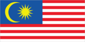
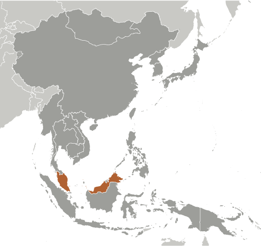
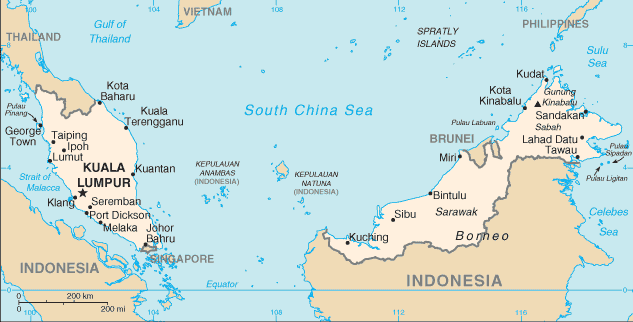

# Malaysia

## Introduction

**_Background:_**   
During the late 18th and 19th centuries, Great Britain established colonies and protectorates in the area of current Malaysia; these were occupied by Japan from 1942 to 1945. In 1948, the British-ruled territories on the Malay Peninsula except Singapore formed the Federation of Malaya, which became independent in 1957. Malaysia was formed in 1963 when the former British colonies of Singapore, as well as Sabah and Sarawak on the northern coast of Borneo, joined the Federation. The first several years of the country's independence were marred by a communist insurgency, Indonesian confrontation with Malaysia, Philippine claims to Sabah, and Singapore's withdrawal in 1965. During the 22-year term of Prime Minister MAHATHIR bin Mohamad (1981-2003), Malaysia was successful in diversifying its economy from dependence on exports of raw materials to the development of manufacturing, services, and tourism. Prime Minister Mohamed NAJIB bin Abdul Razak (in office since April 2009) has continued these pro-business policies and has introduced some civil reforms.

## Geography

**_Location:_**   
Southeastern Asia, peninsula bordering Thailand and northern one-third of the island of Borneo, bordering Indonesia, Brunei, and the South China Sea, south of Vietnam

**_Geographic coordinates:_**   
2 30 N, 112 30 E

**_Map references:_**   
Southeast Asia

**_Area:_**   
**total:** 329,847 sq km   
**land:** 328,657 sq km   
**water:** 1,190 sq km

**_Area - comparative:_**   
slightly larger than New Mexico

**_Land boundaries:_**   
**total:** 2,669 km   
**border countries:** Brunei 381 km, Indonesia 1,782 km, Thailand 506 km

**_Coastline:_**   
4,675 km (Peninsular Malaysia 2,068 km, East Malaysia 2,607 km)

**_Maritime claims:_**   
**territorial sea:** 12 nm   
**exclusive economic zone:** 200 nm   
**continental shelf:** 200 m depth or to the depth of exploitation; specified boundary in the South China Sea

**_Climate:_**   
tropical; annual southwest (April to October) and northeast (October to February) monsoons

**_Terrain:_**   
coastal plains rising to hills and mountains

**_Elevation extremes:_**   
**lowest point:** Indian Ocean 0 m   
**highest point:** Gunung Kinabalu 4,100 m

**_Natural resources:_**   
tin, petroleum, timber, copper, iron ore, natural gas, bauxite

**_Land use:_**   
**arable land:** 5.44%   
**permanent crops:** 17.49%   
**other:** 77.07% (2011)

**_Irrigated land:_**   
3,800 sq km (2009)

**_Total renewable water resources:_**   
580 cu km (2011)

**_Freshwater withdrawal (domestic/industrial/agricultural):_**   
**total:** 11.2 cu km/yr (35%/43%/22%)   
**per capita:** 414 cu m/yr (2005)

**_Natural hazards:_**   
flooding; landslides; forest fires

**_Environment - current issues:_**   
air pollution from industrial and vehicular emissions; water pollution from raw sewage; deforestation; smoke/haze from Indonesian forest fires

**_Environment - international agreements:_**   
**party to:** Biodiversity, Climate Change, Climate Change-Kyoto Protocol, Desertification, Endangered Species, Hazardous Wastes, Law of the Sea, Marine Life Conservation, Ozone Layer Protection, Ship Pollution, Tropical Timber 83, Tropical Timber 94, Wetlands   
**signed, but not ratified:** none of the selected agreements

**_Geography - note:_**   
strategic location along Strait of Malacca and southern South China Sea

## People and Society

**_Nationality:_**   
**noun:** Malaysian(s)   
**adjective:** Malaysian

**_Ethnic groups:_**   
Malay 50.1%, Chinese 22.6%, indigenous 11.8%, Indian 6.7%, other 0.7%, non-citizens 8.2% (2010 est.)

**_Languages:_**   
Bahasa Malaysia (official), English, Chinese (Cantonese, Mandarin, Hokkien, Hakka, Hainan, Foochow), Tamil, Telugu, Malayalam, Panjabi, Thai   
**note:** in East Malaysia there are several indigenous languages; most widely spoken are Iban and Kadazan

**_Religions:_**   
Muslim (official) 61.3%, Buddhist 19.8%, Christian 9.2%, Hindu 6.3%, Confucianism, Taoism, other traditional Chinese religions 1.3%, other 0.4%, none 0.8%, unspecified 1% (2010 est.)

**_Population:_**   
30,073,353 (July 2014 est.)

**_Age structure:_**   
**0-14 years:** 28.8% (male 4,456,033/female 4,206,727)   
**15-24 years:** 16.9% (male 2,580,486/female 2,511,579)   
**25-54 years:** 41.2% (male 6,277,694/female 6,114,312)   
**55-64 years:** 7.6% (male 1,163,861/female 1,122,746)   
**65 years and over:** 5.3% (male 777,338/female 862,577) (2014 est.)

**_Dependency ratios:_**   
**total dependency ratio:** 45.5 %   
**youth dependency ratio:** 37.4 %   
**elderly dependency ratio:** 8.1 %   
**potential support ratio:** 12.4 (2014 est.)

**_Median age:_**   
**total:** 27.7 years   
**male:** 27.4 years   
**female:** 27.9 years (2014 est.)

**_Population growth rate:_**   
1.47% (2014 est.)

**_Birth rate:_**   
20.06 births/1,000 population (2014 est.)

**_Death rate:_**   
5 deaths/1,000 population (2014 est.)

**_Net migration rate:_**   
-0.34 migrant(s)/1,000 population   
**note:** does not reflect net flow of an unknown number of illegal immigrants from other countries in the region (2014 est.)

**_Urbanization:_**   
**urban population:** 72.8% of total population (2011)   
**rate of urbanization:** 2.49% annual rate of change (2010-15 est.)

**_Major urban areas - population:_**   
KUALA LUMPUR (capital) 1.556 million; Klang 1.19 million; Johor Bahru 1.045 million (2011)

**_Sex ratio:_**   
**at birth:** 1.07 male(s)/female   
**0-14 years:** 1.06 male(s)/female   
**15-24 years:** 1.03 male(s)/female   
**25-54 years:** 1.03 male(s)/female   
**55-64 years:** 1.03 male(s)/female   
**65 years and over:** 0.89 male(s)/female   
**total population:** 1.03 male(s)/female (2014 est.)

**_Maternal mortality rate:_**   
29 deaths/100,000 live births (2010)

**_Infant mortality rate:_**   
**total:** 13.69 deaths/1,000 live births   
**male:** 15.82 deaths/1,000 live births   
**female:** 11.42 deaths/1,000 live births (2014 est.)

**_Life expectancy at birth:_**   
**total population:** 74.52 years   
**male:** 71.74 years   
**female:** 77.48 years (2014 est.)

**_Total fertility rate:_**   
2.58 children born/woman (2014 est.)

**_Contraceptive prevalence rate:_**   
49% (2004)

**_Health expenditures:_**   
3.6% of GDP (2011)

**_Physicians density:_**   
1.2 physicians/1,000 population (2010)

**_Hospital bed density:_**   
1.8 beds/1,000 population (2011)

**_Drinking water source:_**   
**improved:** urban: 100% of population; rural: 98.5% of population; total: 99.6% of population   
**unimproved:** urban: 0% of population; rural: 1.5% of population; total: 0.4% of population (2012 est.)

**_Sanitation facility access:_**   
**improved:** urban: 96.1% of population; rural: 94.6% of population; total: 95.7% of population   
**unimproved:** urban: 3.9% of population; rural: 5.4% of population; total: 4.3% of population (2012 est.)

**_HIV/AIDS - adult prevalence rate:_**   
0.4% (2012 est.)

**_HIV/AIDS - people living with HIV/AIDS:_**   
82,000 (2012 est.)

**_HIV/AIDS - deaths:_**   
5,200 (2009 est.)

**_Major infectious diseases:_**   
**degree of risk:** intermediate   
**food or waterborne diseases:** bacterial diarrhea   
**vectorborne diseases:** dengue fever   
**water contact disease:** leptospirosis   
**note:** highly pathogenic H5N1 avian influenza has been identified in this country; it poses a negligible risk with extremely rare cases possible among US citizens who have close contact with birds (2013)

**_Obesity - adult prevalence rate:_**   
14% (2008)

**_Children under the age of 5 years underweight:_**   
12.9% (2006)

**_Education expenditures:_**   
5.9% of GDP (2011)

**_Literacy:_**   
**definition:** age 15 and over can read and write   
**total population:** 93.1%   
**male:** 95.4%   
**female:** 90.7% (2010 est.)

**_School life expectancy (primary to tertiary education):_**   
**total:** 13 years   
**male:** 13 years   
**female:** 13 years (2005)

**_Unemployment, youth ages 15-24:_**   
**total:** 10.3%   
**male:** 9.8%   
**female:** 11% (2012)

## Government

**_Country name:_**   
**conventional long form:** none   
**conventional short form:** Malaysia   
**local long form:** none   
**local short form:** Malaysia   
**former:** Federation of Malaya

**_Government type:_**   
constitutional monarchy   
**note:** nominally headed by paramount ruler (commonly referred to as the king) and a bicameral Parliament consisting of a nonelected upper house and an elected lower house; all Peninsular Malaysian states have hereditary rulers (commonly referred to as sultans) except Melaka (Malacca) and Pulau Pinang (Penang); those two states along with Sabah and Sarawak in East Malaysia have governors appointed by government; powers of state governments are limited by federal constitution; under terms of federation, Sabah and Sarawak retain certain constitutional prerogatives (e.g., right to maintain their own immigration controls)

**_Capital:_**   
**name:** Kuala Lumpur; note - Putrajaya is referred to as an administrative center not the capital; Parliament meets in Kuala Lumpur   
**geographic coordinates:** 3 10 N, 101 42 E   
**time difference:** UTC+8 (13 hours ahead of Washington, DC, during Standard Time)

**_Administrative divisions:_**   
13 states (negeri-negeri, singular - negeri); Johor, Kedah, Kelantan, Melaka, Negeri Sembilan, Pahang, Perak, Perlis, Pulau Pinang, Sabah, Sarawak, Selangor, Terengganu; and 1 federal territory (Wilayah Persekutuan) with 3 components, Kuala Lumpur, Labuan, and Putrajaya

**_Independence:_**   
31 August 1957 (from the UK)

**_National holiday:_**   
Independence Day 31 August (1957) (independence of Malaya); Malaysia Day 16 September (1963) (formation of Malaysia)

**_Constitution:_**   
previous 1948; latest drafted 21 February 1957, effective 27 August 1957; amended many times, last in 2007 (2010)

**_Legal system:_**   
mixed legal system of English common law, Islamic law, and customary law; judicial review of legislative acts in the Supreme Court at request of supreme head of the federation

**_International law organization participation:_**   
has not submitted an ICJ jurisdiction declaration; non-party state to the ICCt

**_Suffrage:_**   
21 years of age; universal

**_Executive branch:_**   
**chief of state:** King Tuanku ABDUL HALIM Mu'adzam Shah (selected on 13 December 2011; installed on 11 April 2012); the position of the king is primarily ceremonial   
**head of government:** Prime Minister Mohamed NAJIB bin Abdul Najib Razak (since 3 April 2009); Deputy Prime Minister MUHYIDDIN bin Mohamed Yassin (since 9 April 2009)   
**cabinet:** Cabinet appointed by the prime minister from among the members of Parliament with consent of the king   
**elections:** kings are elected by and from the hereditary rulers of nine of the states for five-year terms; selection is based on the principle of rotation among rulers of states; elections were last held on 14 October 2011 (next to be held in 2016); prime ministers are designated from among the members of the House of Representatives; following legislative elections, the leader who commands the support of the majority of members in the House becomes prime minister (since independence this has been the leader of the UMNO party)   
**election results:** Tuanku ABDUL HALIM Mu'adzam Shah elected king by fellow hereditary rulers of nine states; Mohamed NAJIB bin Abdul Najib Razak was sworn in as prime minister the day after his National Front (BN) coalition won a majority of seats during the 5 May 2013 national election; NAJIB was re-elected uncontested as UMNO president on 19 October 2013

**_Legislative branch:_**   
bicameral Parliament or Parlimen consists of Senate or Dewan Negara (70 seats; 44 members appointed by the king, 26 elected by 13 state legislatures to serve three-year terms with a two term limit) and House of Representatives or Dewan Rakyat (222 seats; members elected in 222 constituencies in a first-pass-the-post system to serve up to five-year terms)   
**elections:** House of Representatives - last held on 5 May 2013 (next to be held by May 2018)   
**election results:** House of Representatives - percent of vote - BN coalition 47.4%, opposition parties 50.9%, others 1.7%; seats - BN coalition 133, opposition parties 89

**_Judicial branch:_**   
**highest court(s):** Federal Court (consists of the chief justice and 4 judges); note - Malaysia has a dual judicial hierarchy of civil and religious (sharia) courts   
**judge selection and term of office:** Federal Court justices appointed by the monarch on advice of the prime minister; judges serve till age 65   
**subordinate courts:** Court of Appeal; High Court; Sessions Court; Magistrates' Court

**_Political parties and leaders:_**   
**National Front (Barisan Nasional) or BN (ruling coalition) consists of the following parties:** Gerakan Rakyat Malaysia Party or GERAKAN [KOH Tsu Koon]; Liberal Democratic Party (Parti Liberal Demokratik - Sabah) or LDP [LIEW Vui Keong]; Malaysian Chinese Association (Persatuan China Malaysia) or MCA [CHUA Soi Lek]; Malaysian Indian Congress (Kongres India Malaysia) or MIC [Govindasamy PALANIVEL]; Parti Bersatu Rakyat Sabah or PBRS [Joseph KURUP]; Parti Bersatu Sabah or PBS [Joseph PAIRIN Kitingan]; Parti Pesaka Bumiputera Bersatu or PBB [Abdul TAIB Mahmud]; Parti Rakyat Sarawak or PRS [James MASING]; Sarawak Progressive Democratic Party or SPDP [Tan Sri William MAKAN Ikom]; Sarawak United People's Party (Parti Bersatu Rakyat Sarawak) or SUPP [Peter CHIN Fah Kui]; United Malays National Organization or UMNO [NAJIB bin Abdul Razak]; United Pasokmomogun Kadazandusun Murut Organization (Pertubuhan Pasko Momogun Kadazan Dusun Bersatu) or UPKO [Bernard DOMPOK]; People's Progressive Party (Parti Progresif Penduduk Malaysia) or PPP [M.Kayveas];   
**People's Alliance (Pakatan Rakyat) or PR (opposition coalition) consists of the following parties:** Democratic Action Party (Parti Tindakan Demokratik) or DAP [KARPAL Singh]; Islamic Party of Malaysia (Parti Islam se Malaysia) or PAS [Abdul HADI Awang; People's Justice Party (Parti Keadilan Rakyat) or PKR [WAN AZIZAH Wan Ismail]; Sarawak National Party or SNAP [Edwin DUNDANG];   
**notable independent parties:** Sabah Progressive Party (Parti Progresif Sabah) or SAPP [YONG Teck Lee]; State Reform Pary (Parti Reformasi Negeri) or STAR [Jeffery KITINGAN]

**_Political pressure groups and leaders:_**   
Bar Council   
BERSIH (electoral reform coalition)   
PEMBELA (Muslim NGO coalition)   
PERKASA (defense of Malay rights)   
**other:** religious groups; women's groups; youth groups

**_International organization participation:_**   
ADB, APEC, ARF, ASEAN, BIS, C, CICA (observer), CP, D-8, EAS, FAO, G-15, G-77, IAEA, IBRD, ICAO, ICC (national committees), ICRM, IDA, IDB, IFAD, IFC, IFRCS, IHO, ILO, IMF, IMO, IMSO, Interpol, IOC, IPU, ISO, ITSO, ITU, ITUC (NGOs), MIGA, MINURSO, MONUSCO, NAM, OIC, OPCW, PCA, PIF (partner), UN, UNAMID, UNCTAD, UNESCO, UNIDO, UNIFIL, UNMIL, UNWTO, UPU, WCO, WFTU (NGOs), WHO, WIPO, WMO, WTO

**_Diplomatic representation in the US:_**   
**chief of mission:** Ambassador AWANG ADEK Bin Hussin (since 21 May 2015)   
**chancery:** 3516 International Court NW, Washington, DC 20008   
**telephone:** [1] (202) 572-9700   
**FAX:** [1] (202) 572-9882   
**consulate(s) general:** Los Angeles, New York

**_Diplomatic representation from the US:_**   
**chief of mission:** Ambassador Joseph Y. YUN (since 12 September 2013)   
**embassy:** 376 Jalan Tun Razak, 50400 Kuala Lumpur   
**mailing address:** US Embassy Kuala Lumpur, APO AP 96535-8152   
**telephone:** [60] (3) 2168-5000   
**FAX:** [60] (3) 2142-2207

**_Flag description:_**   
14 equal horizontal stripes of red (top) alternating with white (bottom); there is a blue rectangle in the upper hoist-side corner bearing a yellow crescent and a yellow 14-pointed star; the flag is often referred to as Jalur Gemilang (Stripes of Glory); the 14 stripes stand for the equal status in the federation of the 13 member states and the federal government; the 14 points on the star represent the unity between these entities; the crescent is a traditional symbol of Islam; blue symbolizes the unity of the Malay people and yellow is the royal color of Malay rulers   
**note:** the design is based on the flag of the US

**_National symbol(s):_**   
tiger

**_National anthem:_**   
**name:** "Negaraku" (My Country)   
**lyrics/music:** collective, led by Tunku ABDUL RAHMAN/Pierre Jean DE BERANGER   
**note:** adopted 1957; the full version is only performed in the presence of the king; the tune, which was adopted from a popular French melody titled "La Rosalie," was originally the anthem of the state of Perak

## Economy

**_Economy - overview:_**   
Malaysia, a middle-income country, has transformed itself since the 1970s from a producer of raw materials into an emerging multi-sector economy. Under current Prime Minister NAJIB, Malaysia is attempting to achieve high-income status by 2020 and to move farther up the value-added production chain by attracting investments in Islamic finance, high technology industries, biotechnology, and services. NAJIB's Economic Transformation Program (ETP) is a series of projects and policy measures intended to accelerate the country's economic growth. The government has also taken steps to liberalize some services sub-sectors. The NAJIB administration also is continuing efforts to boost domestic demand and reduce the economy's dependence on exports. Nevertheless, exports - particularly of electronics, oil and gas, palm oil and rubber - remain a significant driver of the economy. As an oil and gas exporter, Malaysia has profited from higher world energy prices, although the rising cost of domestic gasoline and diesel fuel, combined with sustained budget deficits, has forced Kuala Lumpur to begin to address fiscal shortfalls, through initial reductions in energy and sugar subsidies and the announcement of the 2015 implementation of a 6% goods and services tax. The government is also trying to lessen its dependence on state oil producer Petronas. The oil and gas sector supplies about 32% of government revenue in 2013. Bank Negara Malaysia (central bank) maintains healthy foreign exchange reserves, and a well-developed regulatory regime has limited Malaysia's exposure to riskier financial instruments and the global financial crisis. Nevertheless, Malaysia could be vulnerable to a fall in commodity prices or a general slowdown in global economic activity because exports are a major component of GDP. In order to attract increased investment, NAJIB earlier raised possible revisions to the special economic and social preferences accorded to ethnic Malays under the New Economic Policy of 1970, but retreated in 2013 after he encountered significant opposition from Malay nationalists and other vested interests. In September 2013 NAJIB launched the new Bumiputra Economic Empowerment Program (BEEP), policies that favor and advance the economic condition of ethnic Malays.

**_GDP (purchasing power parity):_**   
$525 billion (2013 est.)   
$501.5 billion (2012 est.)   
$474.7 billion (2011 est.)   
**note:** data are in 2013 US dollars

**_GDP (official exchange rate):_**   
$312.4 billion (2013 est.)

**_GDP - real growth rate:_**   
4.7% (2013 est.)   
5.6% (2012 est.)   
5.1% (2011 est.)

**_GDP - per capita (PPP):_**   
$17,500 (2013 est.)   
$17,000 (2012 est.)   
$16,400 (2011 est.)   
**note:** data are in 2013 US dollars

**_Gross national saving:_**   
32.3% of GDP (2013 est.)   
31.9% of GDP (2012 est.)   
34.9% of GDP (2011 est.)

**_GDP - composition, by end use:_**   
**household consumption:** 50.1%   
**government consumption:** 13.9%   
**investment in fixed capital:** 26.2%   
**investment in inventories:** 0.8%   
**exports of goods and services:** 84.1%   
**imports of goods and services:** -75.2%; (2013 est.)

**_GDP - composition, by sector of origin:_**   
**agriculture:** 11.2%   
**industry:** 40.6%   
**services:** 48.1% (2013 est.)

**_Agriculture - products:_**   
Peninsular Malaysia - palm oil, rubber, cocoa, rice; Sabah - palm oil, subsistence crops; rubber, timber; Sarawak - palm oil, rubber, timber; pepper

**_Industries:_**   
Peninsular Malaysia - rubber and oil palm processing and manufacturing, petroleum and natural gas, light manufacturing, pharmaceuticals, medical technology, electronics and semi-conductors, timber processing; Sabah - logging, petroleum and natural gas production; Sarawak - agriculture processing, petroleum and natural gas production, logging

**_Industrial production growth rate:_**   
5% (2013 est.)

**_Labor force:_**   
13.19 million (2013 est.)

**_Labor force - by occupation:_**   
**agriculture:** 11.1%   
**industry:** 36%   
**services:** 53.5% (2012 est.)

**_Unemployment rate:_**   
3.1% (2013 est.)   
3% (2012 est.)

**_Population below poverty line:_**   
3.8% (2009 est.)

**_Household income or consumption by percentage share:_**   
**lowest 10%:** 1.8%   
**highest 10%:** 34.7% (2009 est.)

**_Distribution of family income - Gini index:_**   
46.2 (2009)   
49.2 (1997)

**_Budget:_**   
**revenues:** $65.72 billion   
**expenditures:** $79.4 billion (2013 est.)

**_Taxes and other revenues:_**   
21% of GDP (2013 est.)

**_Budget surplus (+) or deficit (-):_**   
-4.4% of GDP (2013 est.)

**_Public debt:_**   
54.6% of GDP (2013 est.)   
53.3% of GDP (2012 est.)   
**note:** this figure is based on the amount of federal government debt, RM501.6 billion ($167.2 billion) in 2012; this includes Malaysian Treasury bills and other government securities, as well as loans raised externally and bonds and notes issued overseas; this figure excludes debt issued by non-financial public enterprises and guaranteed by the federal government, which was an additional $47.7 billion in 2012

**_Fiscal year:_**   
calendar year

**_Inflation rate (consumer prices):_**   
2.2% (2013 est.)   
1.7% (2012 est.)   
**note:** approximately 30% of goods are price-controlled

**_Central bank discount rate:_**   
3% (31 December 2011)   
2.83% (31 December 2010)

**_Commercial bank prime lending rate:_**   
4.5% (31 December 2013 est.)   
4.7% (31 December 2012 est.)

**_Stock of narrow money:_**   
$97.03 billion (31 December 2013 est.)   
$93.89 billion (31 December 2012 est.)

**_Stock of broad money:_**   
$439.7 billion (31 December 2013 est.)   
$435.2 billion (31 December 2012 est.)

**_Stock of domestic credit:_**   
$421 billion (31 December 2013 est.)   
$412.4 billion (31 December 2012 est.)

**_Market value of publicly traded shares:_**   
$476.3 billion (31 December 2012 est.)   
$395.1 billion (31 December 2011)   
$NA (31 December 2010 est.)

**_Current account balance:_**   
$16.67 billion (2013 est.)   
$18.64 billion (2012 est.)

**_Exports:_**   
$230.7 billion (2013 est.)   
$227.7 billion (2012 est.)

**_Exports - commodities:_**   
semiconductors and electronic equipment, palm oil, petroleum and liquefied natural gas, wood and wood products, palm oil, rubber, textiles, chemicals, solar panels

**_Exports - partners:_**   
Singapore 13.6%, China 12.6%, Japan 11.8%, US 8.7%, Thailand 5.4%, Hong Kong 4.3%, India 4.2%, Australia 4.1% (2012)

**_Imports:_**   
$192.9 billion (2013 est.)   
$186.9 billion (2012 est.)

**_Imports - commodities:_**   
electronics, machinery, petroleum products, plastics, vehicles, iron and steel products, chemicals

**_Imports - partners:_**   
China 15.1%, Singapore 13.3%, Japan 10.3%, US 8.1%, Thailand 6%, Indonesia 5.1%, South Korea 4.1% (2012)

**_Reserves of foreign exchange and gold:_**   
$139.4 billion (31 December 2013 est.)   
$139.7 billion (31 December 2012 est.)

**_Debt - external:_**   
$100.1 billion (31 December 2013 est.)   
$98.82 billion (31 December 2012 est.)

**_Stock of direct foreign investment - at home:_**   
$143.4 billion (31 December 2013 est.)   
$132.4 billion (31 December 2012 est.)

**_Stock of direct foreign investment - abroad:_**   
$133.5 billion (31 December 2013 est.)   
$120.4 billion (31 December 2012 est.)

**_Exchange rates:_**   
ringgits (MYR) per US dollar -   
3.174 (2013 est.)   
3.09 (2012 est.)   
3.22 (2010 est.)   
3.52 (2009)   
3.33 (2008)

## Energy

**_Electricity - production:_**   
118 billion kWh (2012 est.)

**_Electricity - consumption:_**   
112 billion kWh (2012 est.)

**_Electricity - exports:_**   
151 million kWh (2010 est.)

**_Electricity - imports:_**   
33 million kWh (2010 est.)

**_Electricity - installed generating capacity:_**   
25.39 million kW (2010 est.)

**_Electricity - from fossil fuels:_**   
91.7% of total installed capacity (2010 est.)

**_Electricity - from nuclear fuels:_**   
0% of total installed capacity (2010 est.)

**_Electricity - from hydroelectric plants:_**   
8.3% of total installed capacity (2010 est.)

**_Electricity - from other renewable sources:_**   
0% of total installed capacity (2010 est.)

**_Crude oil - production:_**   
642,700 bbl/day (2012 est.)

**_Crude oil - exports:_**   
269,000 bbl/day (2012 est.)

**_Crude oil - imports:_**   
160,500 bbl/day (2010 est.)

**_Crude oil - proved reserves:_**   
4 billion bbl (1 January 2013 est.)

**_Refined petroleum products - production:_**   
568,800 bbl/day (2010 est.)

**_Refined petroleum products - consumption:_**   
542,900 bbl/day (2011 est.)

**_Refined petroleum products - exports:_**   
176,500 bbl/day (2010 est.)

**_Refined petroleum products - imports:_**   
175,100 bbl/day (2010 est.)

**_Natural gas - production:_**   
61.73 billion cu m (2011 est.)

**_Natural gas - consumption:_**   
32.62 billion cu m (2010 est.)

**_Natural gas - exports:_**   
33.1 billion cu m (2011 est.)

**_Natural gas - imports:_**   
1.99 billion cu m (2011 est.)

**_Natural gas - proved reserves:_**   
2.35 trillion cu m (1 January 2013 est.)

**_Carbon dioxide emissions from consumption of energy:_**   
191.4 million Mt (2011 est.)

## Communications

**_Telephones - main lines in use:_**   
4.589 million (2012)

**_Telephones - mobile cellular:_**   
41.325 million (2012)

**_Telephone system:_**   
**general assessment:** modern system featuring good intercity service on Peninsular Malaysia provided mainly by microwave radio relay and an adequate intercity microwave radio relay network between Sabah and Sarawak via Brunei; international service excellent   
**domestic:** domestic satellite system with 2 earth stations; combined fixed-line and mobile-cellular teledensity roughly 140 per 100 persons   
**international:** country code - 60; landing point for several major international submarine cable networks that provide connectivity to Asia, Middle East, and Europe; satellite earth stations - 2 Intelsat (1 Indian Ocean, 1 Pacific Ocean) (2011)

**_Broadcast media:_**   
state-owned TV broadcaster operates 2 TV networks with relays throughout the country, and the leading private commercial media group operates 4 TV stations with numerous relays throughout the country; satellite TV subscription service is available; state-owned radio broadcaster operates multiple national networks as well as regional and local stations; many private commercial radio broadcasters and some subscription satellite radio services are available; about 55 radio stations overall (2012)

**_Internet country code:_**   
.my

**_Internet hosts:_**   
422,470 (2012)

**_Internet users:_**   
15.355 million (2009)

## Transportation

**_Airports:_**   
114 (2013)

**_Airports - with paved runways:_**   
**total:** 39   
**over 3,047 m:** 8   
**2,438 to 3,047 m:** 8   
**1,524 to 2,437 m:** 7   
**914 to 1,523 m:** 8   
**under 914 m:** 8 (2013)

**_Airports - with unpaved runways:_**   
**total:** 75   
**914 to 1,523 m:** 6   
**under 914 m:** 69 (2013)

**_Heliports:_**   
4 (2013)

**_Pipelines:_**   
condensate 354 km; gas 6,439 km; liquid petroleum gas 155 km; oil 1,937 km; oil/gas/water 43 km; refined products 114 km; water 26 km (2013)

**_Railways:_**   
**total:** 1,849 km   
**standard gauge:** 57 km 1.435-m gauge (57 km electrified)   
**narrow gauge:** 1,792 km 1.000-m gauge (150 km electrified) (2010)

**_Roadways:_**   
**total:** 144,403 km (does not include local roads)   
**paved:** 116,169 km (includes 1,821 km of expressways)   
**unpaved:** 28,234 km (2010)

**_Waterways:_**   
7,200 km (Peninsular Malaysia 3,200 km; Sabah 1,500 km; Sarawak 2,500 km) (2011)

**_Merchant marine:_**   
**total:** 315   
**by type:** bulk carrier 11, cargo 83, carrier 2, chemical tanker 47, container 41, liquefied gas 34, passenger/cargo 4, petroleum tanker 86, roll on/roll off 2, vehicle carrier 5   
**foreign-owned:** 26 (Denmark 1, Hong Kong 8, Japan 2, Russia 2, Singapore 13)   
**registered in other countries:** 82 (Bahamas 13, India 1, Indonesia 1, Isle of Man 6, Malta 1, Marshall Islands 11, Panama 12, Papua New Guinea 1, Philippines 1, Saint Kitts and Nevis 1, Singapore 27, Thailand 3, US 2, unknown 2) (2010)

**_Ports and terminals:_**   
**major seaport(s):** Bintulu, Johor Bahru, George Town (Penang), Port Kelang (Port Klang), Tanjung Pelepas   
**container port(s) (TEUs):** George Town (Penang)(1,202,180), Port Kelang (Port Klang)(9,435,403), Tanjung Pelepas (7,302,461)

**_Transportation - note:_**   
the International Maritime Bureau reports that the territorial and offshore waters in the Strait of Malacca and South China Sea remain high risk for piracy and armed robbery against ships; in the past, commercial vessels have been attacked and hijacked both at anchor and while underway; hijacked vessels are often disguised and cargo diverted to ports in East Asia; crews have been murdered or cast adrift; increased naval patrols since 2005 in the Strait of Malacca resulted in no reported incidents in 2010

## Military

**_Military branches:_**   
Malaysian Armed Forces (Angkatan Tentera Malaysia, ATM): Malaysian Army (Tentera Darat Malaysia), Royal Malaysian Navy (Tentera Laut Diraja Malaysia, TLDM), Royal Malaysian Air Force (Tentera Udara Diraja Malaysia, TUDM) (2013)

**_Military service age and obligation:_**   
17 years 6 months of age for voluntary military service (younger with parental consent and proof of age); mandatory retirement age 60; women serve in the Malaysian Armed Forces; no conscription (2013)

**_Manpower available for military service:_**   
**males age 16-49:** 7,501,518   
**females age 16-49:** 7,315,999 (2010 est.)

**_Manpower fit for military service:_**   
**males age 16-49:** 6,247,306   
**females age 16-49:** 6,175,274 (2010 est.)

**_Manpower reaching militarily significant age annually:_**   
**male:** 265,008   
**female:** 254,812 (2010 est.)

**_Military expenditures:_**   
1.55% of GDP (2012)   
1.67% of GDP (2011)   
1.55% of GDP (2010)

## Transnational Issues

**_Disputes - international:_**   
while the 2002 "Declaration on the Conduct of Parties in the South China Sea" has eased tensions over the Spratly Islands, it is not the legally binding "code of conduct" sought by some parties; Malaysia was not party to the March 2005 joint accord among the national oil companies of China, the Philippines, and Vietnam on conducting marine seismic activities in the Spratly Islands; disputes continue over deliveries of fresh water to Singapore, Singapore's land reclamation, bridge construction, and maritime boundaries in the Johor and Singapore Straits; in 2008, ICJ awarded sovereignty of Pedra Branca (Pulau Batu Puteh/Horsburgh Island) to Singapore, and Middle Rocks to Malaysia, but did not rule on maritime regimes, boundaries, or disposition of South Ledge; land and maritime negotiations with Indonesia are ongoing, and disputed areas include the controversial Tanjung Datu and Camar Wulan border area in Borneo and the maritime boundary in the Ambalat oil block in the Celebes Sea; separatist violence in Thailand's predominantly Muslim southern provinces prompts measures to close and monitor border with Malaysia to stem terrorist activities; Philippines retains a dormant claim to Malaysia's Sabah State in northern Borneo; per Letters of Exchange signed in 2009, Malaysia in 2010 ceded two hydrocarbon concession blocks to Brunei in exchange for Brunei's sultan dropping claims to the Limbang corridor, which divides Brunei; piracy remains a problem in the Malacca Strait

**_Refugees and internally displaced persons:_**   
**refugees (country of origin):** 92,287 (Burma) (2013)   
**stateless persons:** 40,001 (2012); note - Malaysia's stateless population consists of Rohingya refugees from Burma, ethnic Indians, and the children of Filipino and Indonesian illegal migrants; Burma stripped the Rohingya of their nationality in 1982; Filipino and Indonesian children who have not have been registered for birth certificates by their parents or who received birth certificates stamped "foreigner" are not eligible to go to government schools; these children are vulnerable to statelessness should they not be able to apply to their parents' country of origin for a passport

**_Trafficking in persons:_**   
**current situation:** Malaysia is a destination and, to a lesser extent, a source and transit country for women and children subjected to conditions of forced labor and women and children subjected to sex trafficking; Malaysia is mainly a destination country for foreign workers who migrate willingly from countries including Indonesia, Nepal, India, Thailand, China, the Philippines, Burma, Cambodia, Laos, Bangladesh, Pakistan, and Vietnam but subsequently encounter forced labor or debt bondage at the hands of their employers in the domestic, agricultural, construction, plantation, and industrial sectors; a small number of Malaysian citizens were reportedly trafficked internally and abroad to Singapore, China, and Japan for commercial sexual exploitation; refugees are also vulnerable to trafficking; some officials are reportedly complicit in facilitating trafficking   
**tier rating:** Tier 2 Watch List - Malaysia does not fully comply with the minimum standards for the elimination of trafficking; however, it is making significant efforts to do so; the government has made no tangible improvements to its inadequate system for identifying and protecting trafficking victims, such as amending its laws to allow victims to reside in NGO shelters; trafficking victims identified by Malaysian authorities are forcibly detained in government facilities, where they are provided with limited, if any, access to legal or psychological assistance by the government or NGOs; increasing efforts are being made to investigate and prosecute trafficking offenders, notably in the area of labor trafficking, though convictions of sex trafficking offenders has decreased; many front-line officials continue to lack the ability to recognize indicators of human trafficking, hindering the investigation of cases and the identification of victims; although the confiscation of passports by employers is illegal, the government has not prosecuted any employers who confiscated migrants' passports or travel documents or confined them to the workplace (2013)

**_Illicit drugs:_**   
drug trafficking prosecuted vigorously and carries severe penalties; heroin still primary drug of abuse, but synthetic drug demand remains strong; continued ecstasy and methamphetamine producer for domestic users and, to a lesser extent, the regional drug market

............................................................   
_Page last updated on June 20, 2014_
