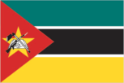
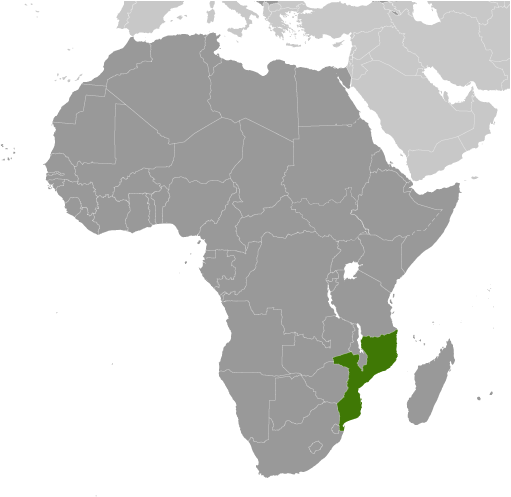
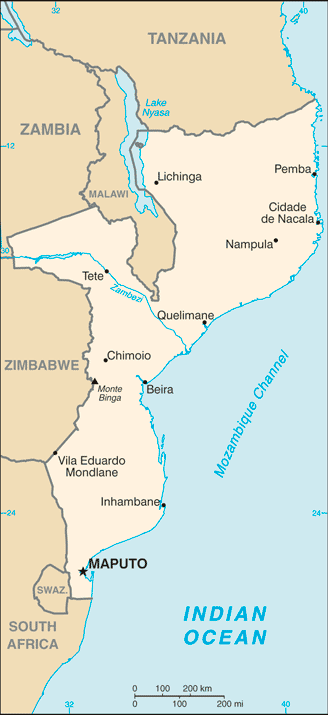

# Mozambique

## Introduction

**_Background:_**   
Almost five centuries as a Portuguese colony came to a close with independence in 1975. Large-scale emigration, economic dependence on South Africa, a severe drought, and a prolonged civil war hindered the country's development until the mid 1990s. The ruling Front for the Liberation of Mozambique (Frelimo) party formally abandoned Marxism in 1989, and a new constitution the following year provided for multiparty elections and a free market economy. A UN-negotiated peace agreement between Frelimo and rebel Mozambique National Resistance (Renamo) forces ended the fighting in 1992. In December 2004, Mozambique underwent a delicate transition as Joaquim CHISSANO stepped down after 18 years in office. His elected successor, Armando Emilio GUEBUZA, promised to continue the sound economic policies that have encouraged foreign investment. President GUEBUZA was reelected to a second term in October 2009. However, the elections were flawed by voter fraud, questionable disqualification of candidates, and Frelimo use of government resources during the campaign. As a result, Freedom House removed Mozambique from its list of electoral democracies.

## Geography

**_Location:_**   
Southeastern Africa, bordering the Mozambique Channel, between South Africa and Tanzania

**_Geographic coordinates:_**   
18 15 S, 35 00 E

**_Map references:_**   
Africa

**_Area:_**   
**total:** 799,380 sq km   
**land:** 786,380 sq km   
**water:** 13,000 sq km

**_Area - comparative:_**   
slightly less than twice the size of California

**_Land boundaries:_**   
**total:** 4,571 km   
**border countries:** Malawi 1,569 km, South Africa 491 km, Swaziland 105 km, Tanzania 756 km, Zambia 419 km, Zimbabwe 1,231 km

**_Coastline:_**   
2,470 km

**_Maritime claims:_**   
**territorial sea:** 12 nm   
**exclusive economic zone:** 200 nm

**_Climate:_**   
tropical to subtropical

**_Terrain:_**   
mostly coastal lowlands, uplands in center, high plateaus in northwest, mountains in west

**_Elevation extremes:_**   
**lowest point:** Indian Ocean 0 m   
**highest point:** Monte Binga 2,436 m

**_Natural resources:_**   
coal, titanium, natural gas, hydropower, tantalum, graphite

**_Land use:_**   
**arable land:** 6.51%   
**permanent crops:** 0.25%   
**other:** 93.24% (2011)

**_Irrigated land:_**   
1,181 sq km (2003)

**_Total renewable water resources:_**   
217.1 cu km (2011)

**_Freshwater withdrawal (domestic/industrial/agricultural):_**   
**total:** 0.88 cu km/yr (26%/4%/70%)   
**per capita:** 46.05 cu m/yr (2005)

**_Natural hazards:_**   
severe droughts; devastating cyclones and floods in central and southern provinces

**_Environment - current issues:_**   
a long civil war and recurrent drought in the hinterlands have resulted in increased migration of the population to urban and coastal areas with adverse environmental consequences; desertification; pollution of surface and coastal waters; elephant poaching for ivory is a problem

**_Environment - international agreements:_**   
**party to:** Biodiversity, Climate Change, Climate Change-Kyoto Protocol, Desertification, Endangered Species, Hazardous Wastes, Law of the Sea, Ozone Layer Protection, Ship Pollution, Wetlands   
**signed, but not ratified:** none of the selected agreements

**_Geography - note:_**   
the Zambezi flows through the north-central and most fertile part of the country

## People and Society

**_Nationality:_**   
**noun:** Mozambican(s)   
**adjective:** Mozambican

**_Ethnic groups:_**   
African 99.66% (Makhuwa, Tsonga, Lomwe, Sena, and others), Europeans 0.06%, Euro-Africans 0.2%, Indians 0.08%

**_Languages:_**   
Emakhuwa 25.3%, Portuguese (official) 10.7%, Xichangana 10.3%, Cisena 7.5%, Elomwe 7%, Echuwabo 5.1%, other Mozambican languages 30.1%, other 4% (1997 census)

**_Religions:_**   
Roman Catholic 28.4%, Muslim 17.9%, Zionist Christian 15.5%, Protestant 12.2% (includes Pentecostal 10.9% and Anglican 1.3%), other 6.7%, none 18.7%, unspecified 0.7% (2007 est.)

**_Population:_**   
24,692,144   
**note:** estimates for this country explicitly take into account the effects of excess mortality due to AIDS; this can result in lower life expectancy, higher infant mortality, higher death rates, lower population growth rates, and changes in the distribution of population by age and sex than would otherwise be expected (July 2014 est.)

**_Age structure:_**   
**0-14 years:** 45.3% (male 5,627,116/female 5,566,260)   
**15-24 years:** 21.3% (male 2,566,298/female 2,689,695)   
**25-54 years:** 27% (male 3,113,095/female 3,553,266)   
**55-64 years:** 3.5% (male 404,988/female 448,814)   
**65 years and over:** 2.9% (male 332,013/female 390,599) (2014 est.)

**_Dependency ratios:_**   
**total dependency ratio:** 94.5 %   
**youth dependency ratio:** 88.1 %   
**elderly dependency ratio:** 6.4 %   
**potential support ratio:** 15.6 (2014 est.)

**_Median age:_**   
**total:** 16.9 years   
**male:** 16.3 years   
**female:** 17.5 years (2014 est.)

**_Population growth rate:_**   
2.45% (2014 est.)

**_Birth rate:_**   
38.83 births/1,000 population (2014 est.)

**_Death rate:_**   
12.34 deaths/1,000 population (2014 est.)

**_Net migration rate:_**   
-2.02 migrant(s)/1,000 population (2014 est.)

**_Urbanization:_**   
**urban population:** 31.2% of total population (2011)   
**rate of urbanization:** 3.05% annual rate of change (2010-15 est.)

**_Major urban areas - population:_**   
MAPUTO (capital) 1.15 million; Matola 790,000 (2011)

**_Sex ratio:_**   
**at birth:** 1.02 male(s)/female   
**0-14 years:** 1.01 male(s)/female   
**15-24 years:** 0.95 male(s)/female   
**25-54 years:** 0.88 male(s)/female   
**55-64 years:** 0.95 male(s)/female   
**65 years and over:** 0.85 male(s)/female   
**total population:** 0.95 male(s)/female (2014 est.)

**_Mother's mean age at first birth:_**   
18.9   
median age at first birth among women 25-29 (2011 est.)

**_Maternal mortality rate:_**   
490 deaths/100,000 live births (2010)

**_Infant mortality rate:_**   
**total:** 72.42 deaths/1,000 live births   
**male:** 74.53 deaths/1,000 live births   
**female:** 70.26 deaths/1,000 live births (2014 est.)

**_Life expectancy at birth:_**   
**total population:** 52.6 years   
**male:** 51.85 years   
**female:** 53.37 years (2014 est.)

**_Total fertility rate:_**   
5.27 children born/woman (2014 est.)

**_Contraceptive prevalence rate:_**   
11.6% (2011)

**_Health expenditures:_**   
6.6% of GDP (2011)

**_Physicians density:_**   
0.03 physicians/1,000 population (2008)

**_Hospital bed density:_**   
0.7 beds/1,000 population (2011)

**_Drinking water source:_**   
**improved:** urban: 80.3% of population; rural: 35% of population; total: 49.2% of population   
**unimproved:** urban: 19.7% of population; rural: 65% of population; total: 50.8% of population (2012 est.)

**_Sanitation facility access:_**   
**improved:** urban: 43.6% of population; rural: 10.7% of population; total: 21% of population   
**unimproved:** urban: 56.4% of population; rural: 89.3% of population; total: 79% of population (2012 est.)

**_HIV/AIDS - adult prevalence rate:_**   
11.1% (2012 est.)

**_HIV/AIDS - people living with HIV/AIDS:_**   
1,554,700 (2012 est.)

**_HIV/AIDS - deaths:_**   
76,800 (2012 est.)

**_Major infectious diseases:_**   
**degree of risk:** very high   
**food or waterborne diseases:** bacterial and protozoal diarrhea, hepatitis A, and typhoid fever   
**vectorborne diseases:** malaria and dengue fever   
**water contact disease:** schistosomiasis   
**animal contact disease:** rabies (2013)

**_Obesity - adult prevalence rate:_**   
4.9% (2008)

**_Children under the age of 5 years underweight:_**   
15.6% (2011)

**_Education expenditures:_**   
5% of GDP (2006)

**_Literacy:_**   
**definition:** age 15 and over can read and write   
**total population:** 56.1%   
**male:** 70.8%   
**female:** 42.8% (2010 est.)

**_School life expectancy (primary to tertiary education):_**   
**total:** 10 years   
**male:** 10 years   
**female:** 9 years (2011)

**_Child labor - children ages 5-14:_**   
**total number:** 1,369,080   
**percentage:** 22 % (2008 est.)

## Government

**_Country name:_**   
**conventional long form:** Republic of Mozambique   
**conventional short form:** Mozambique   
**local long form:** Republica de Mocambique   
**local short form:** Mocambique   
**former:** Portuguese East Africa

**_Government type:_**   
republic

**_Capital:_**   
**name:** Maputo   
**geographic coordinates:** 25 57 S, 32 35 E   
**time difference:** UTC+2 (7 hours ahead of Washington, DC, during Standard Time)

**_Administrative divisions:_**   
10 provinces (provincias, singular - provincia), 1 city (cidade)\*; Cabo Delgado, Gaza, Inhambane, Manica, Maputo, Cidade de Maputo\*, Nampula, Niassa, Sofala, Tete, Zambezia

**_Independence:_**   
25 June 1975 (from Portugal)

**_National holiday:_**   
Independence Day, 25 June (1975)

**_Constitution:_**   
previous 1975, 1990; latest adopted 16 November 2004, effective 21 December 2004; note - draft amendments planned for parliamentary review in late 2013 (2013)

**_Legal system:_**   
mixed legal system of Portuguese civil law, and customary law; note - in rural, predominately Muslim villages with no formal legal system, Islamic law may be applied

**_International law organization participation:_**   
has not submitted an ICJ jurisdiction declaration; non-party state to the ICCt

**_Suffrage:_**   
18 years of age; universal

**_Executive branch:_**   
**chief of state:** President Armando Emilio GUEBUZA (since 2 February 2005)   
**head of government:** Prime Minister Alberto Clementino Antonio VAQUINA (since 8 October 2012)   
**cabinet:** Cabinet   
**elections:** president elected by popular vote for a five-year term (eligible for three terms); election last held on 28 October 2009 (next to be held in 2014); prime minister appointed by the president   
**election results:** Armando GUEBUZA reelected president; percent of vote - Armando GUEBUZA 76.3%, Afonso DHLAKAMA 14.9%, Daviz SIMANGO 8.8%

**_Legislative branch:_**   
unicameral Assembly of the Republic or Assembleia da Republica (250 seats; members directly elected by popular vote to serve five-year terms)   
**elections:** last held on 28 October 2009 (next to be held in 2014)   
**election results:** percent of vote by party - FRELIMO 74.7%, RENAMO 17.7%, MDM 3.9%, other 3.7%; seats by party - FRELIMO 191, RENAMO 51, MDM 8

**_Judicial branch:_**   
**highest court(s):** Supreme Court (consists of the court president, vice president, and 5 judges); Constitutional Council (consists of 7 judges); note - the Higher Council of the Judiciary is responsible for judiciary management and discipline   
**judge selection and term of office:** Supreme Court president and vice president appointed by Mozambique president in consultation with the Higher Council of the Judiciary (CSMJ) and with ratification by the legislature; other judges elected by the legislature; judges serve 5-year renewable terms; Constitutional Council judges appointed - 1 by the president, 5 by the legislature, and 1 by the CSMJ; judges serve 5-year nonrenewable terms   
**subordinate courts:** Administrative Court (capital city only); provincial courts or Tribunais Judicias de Provincia; District Courts or Tribunais Judicias de Districto; customs courts; maritime courts; courts marshal; labor courts; community courts

**_Political parties and leaders:_**   
Democratic Movement of Mozambique (Movimento Democratico de Mocambique) or MDM [Daviz SIMANGO]   
Front for the Liberation of Mozambique (Frente de Liberatacao de Mocambique) or FRELIMO [Armando Emilio GUEBUZA]   
Mozambique National Resistance (Resistencia Nacional Mocambicana) or RENAMO [Afonso DHLAKAMA]

**_Political pressure groups and leaders:_**   
Mozambican League of Human Rights (Liga Mocambicana dos Direitos Humanos) or LDH [Alice MABOTE, president]

**_International organization participation:_**   
ACP, AfDB, AU, C, CD, CPLP, EITI (compliant country), FAO, G-77, IAEA, IBRD, ICAO, ICC (NGOs), ICRM, IDA, IDB, IFAD, IFC, IFRCS, IHO, ILO, IMF, IMO, IMSO, Interpol, IOC, IOM, IPU, ISO (correspondent), ITSO, ITU, ITUC (NGOs), MIGA, NAM, OIC, OIF (observer), OPCW, SADC, UN, UNCTAD, UNESCO, UNHCR, UNIDO, Union Latina, UNISFA, UNWTO, UPU, WCO, WFTU (NGOs), WHO, WIPO, WMO, WTO

**_Diplomatic representation in the US:_**   
**chief of mission:** Ambassador Amelia Narciso Matos SUMBANA (since 2 November 2009)   
**chancery:** 1525 New Hampshire Avenue NW, Washington, DC 20036   
**telephone:** [1] (202) 293-7146   
**FAX:** [1] (202) 835-0245

**_Diplomatic representation from the US:_**   
**chief of mission:** Ambassador Douglas M. GRIFFITHS (since 6 July 2012)   
**embassy:** Avenida Kenneth Kuanda 193, Maputo   
**mailing address:** P. O. Box 783, Maputo   
**telephone:** [258] (21) 492797   
**FAX:** [258] (21) 490114

**_Flag description:_**   
three equal horizontal bands of green (top), black, and yellow with a red isosceles triangle based on the hoist side; the black band is edged in white; centered in the triangle is a yellow five-pointed star bearing a crossed rifle and hoe in black superimposed on an open white book; green represents the riches of the land, white peace, black the African continent, yellow the country's minerals, and red the struggle for independence; the rifle symbolizes defense and vigilance, the hoe refers to the country's agriculture, the open book stresses the importance of education, and the star represents Marxism and internationalism

**_National anthem:_**   
**name:** "Patria Amada" (Lovely Fatherland)   
**lyrics/music:** Salomao J. MANHICA/unknown   
**note:** adopted 2002

## Economy

**_Economy - overview:_**   
At independence in 1975, Mozambique was one of the world's poorest countries. Socialist mismanagement and a brutal civil war from 1977-92 exacerbated the situation. In 1987, the government embarked on a series of macroeconomic reforms designed to stabilize the economy. These steps, combined with donor assistance and with political stability since the multi-party elections in 1994, have led to dramatic improvements in the country's growth rate. Fiscal reforms, including the introduction of a value-added tax and reform of the customs service, have improved the government's revenue collection abilities. In spite of these gains, Mozambique remained dependent upon foreign assistance for 40% of its 2012 annual budget and over half the population remained below the poverty line. Subsistence agriculture continues to employ the vast majority of the country's work force and smallholder agricultural productivity and productivity growth is weak. A substantial trade imbalance persists although aluminum production from the Mozal smelter has significantly boosted export earnings in recent years. In 2012, The Mozambican government took over Portugal's last remaining share in the Cahora Bassa Hydroelectricity Company (HCB), a signficant contributor to the Southern African Power Pool. The government has plans to expand the Cahora Bassa Dam and build additional dams to increase its electricity exports and fulfill the needs of its burgeoning domestic industries. Mozambique's once substantial foreign debt has been reduced through forgiveness and rescheduling under the IMF's Heavily Indebted Poor Countries (HIPC) and Enhanced HIPC initiatives, and is now at a manageable level. In July 2007, the US government's Millennium Challenge Corporation (MCC) signed a $506.9 million Compact with Mozambique. Compact projects will end in September 2013 and are focusing on improving sanitation, roads, agriculture, and the business regulation environment in an effort to spur economic growth in the four northern provinces of the country. Citizens rioted in September 2010, after fuel, water, electricity, and bread price increases were announced. In an attempt to lessen the negative impact on people, the government implemented subsidies, decreased taxes and tariffs, and instituted other fiscal measures. Mozambique grew at an average annual rate of 6%-8% in the decade up to 2013, one of Africa's strongest performances. Mozambique's ability to attract large investment projects in natural resources is expected to fuel continued high growth in coming years. Revenues from these vast resources, including natural gas, coal, titanium and hydroelectric capacity, could overtake donor assistance within five years.

**_GDP (purchasing power parity):_**   
$28.15 billion (2013 est.)   
$26.31 billion (2012 est.)   
$24.49 billion (2011 est.)   
**note:** data are in 2013 US dollars

**_GDP (official exchange rate):_**   
$14.67 billion (2013 est.)

**_GDP - real growth rate:_**   
7% (2013 est.)   
7.4% (2012 est.)   
7.3% (2011 est.)

**_GDP - per capita (PPP):_**   
$1,200 (2013 est.)   
$1,200 (2012 est.)   
$1,100 (2011 est.)   
**note:** data are in 2013 US dollars

**_Gross national saving:_**   
-5.6% of GDP (2013 est.)   
-4.6% of GDP (2012 est.)   
0.8% of GDP (2011 est.)

**_GDP - composition, by end use:_**   
**household consumption:** 71.4%   
**government consumption:** 16.9%   
**investment in fixed capital:** 33.8%   
**investment in inventories:** -1.6%   
**exports of goods and services:** 30%   
**imports of goods and services:** -50.5%; (2013 est.)

**_GDP - composition, by sector of origin:_**   
**agriculture:** 28.7%   
**industry:** 24.9%   
**services:** 46.4% (2013 est.)

**_Agriculture - products:_**   
cotton, cashew nuts, sugarcane, tea, cassava (manioc, tapioca), corn, coconuts, sisal, citrus and tropical fruits, potatoes, sunflowers; beef, poultry

**_Industries:_**   
aluminum, petroleum products, chemicals (fertilizer, soap, paints), textiles, cement, glass, asbestos, tobacco, food, beverages

**_Industrial production growth rate:_**   
8% (2013 est.)

**_Labor force:_**   
10.55 million (2013 est.)

**_Labor force - by occupation:_**   
**agriculture:** 81%   
**industry:** 6%   
**services:** 13% (1997 est.)

**_Unemployment rate:_**   
17% (2007 est.)   
21% (1997 est.)

**_Population below poverty line:_**   
52% (2009 est.)

**_Household income or consumption by percentage share:_**   
**lowest 10%:** 1.9%   
**highest 10%:** 36.7% (2008)

**_Distribution of family income - Gini index:_**   
45.6 (2008)   
47.3 (2002)

**_Budget:_**   
**revenues:** $4.808 billion   
**expenditures:** $6.101 billion (2013 est.)

**_Taxes and other revenues:_**   
32.8% of GDP (2013 est.)

**_Budget surplus (+) or deficit (-):_**   
-8.8% of GDP (2013 est.)

**_Public debt:_**   
46.7% of GDP (2013 est.)   
42.2% of GDP (2012 est.)

**_Fiscal year:_**   
calendar year

**_Inflation rate (consumer prices):_**   
4.4% (2013 est.)   
2.1% (2012 est.)

**_Central bank discount rate:_**   
9.5% (17 January 2013 est.)   
3.25% (31 December 2010 est.)

**_Commercial bank prime lending rate:_**   
15.6% (31 December 2013 est.)   
16.81% (31 December 2012 est.)

**_Stock of narrow money:_**   
$4.665 billion (31 December 2013 est.)   
$4.335 billion (31 December 2012 est.)

**_Stock of broad money:_**   
$6.856 billion (31 December 2013 est.)   
$6.242 billion (31 December 2012 est.)

**_Stock of domestic credit:_**   
$4.438 billion (31 December 2013 est.)   
$3.951 billion (31 December 2012 est.)

**_Market value of publicly traded shares:_**   
$NA

**_Current account balance:_**   
-$5.884 billion (2013 est.)   
-$5.168 billion (2012 est.)

**_Exports:_**   
$3.92 billion (2013 est.)   
$3.47 billion (2012 est.)

**_Exports - commodities:_**   
aluminum, prawns, cashews, cotton, sugar, citrus, timber; bulk electricity

**_Exports - partners:_**   
South Africa 31.3%, Belgium 12.8%, China 9%, Italy 7.9%, Spain 6.2%, India 5.8% (2012)

**_Imports:_**   
$7.068 billion (2013 est.)   
$6.168 billion (2012 est.)

**_Imports - commodities:_**   
machinery and equipment, vehicles, fuel, chemicals, metal products, foodstuffs, textiles

**_Imports - partners:_**   
South Africa 30.5%, China 12.3%, India 11.6%, US 5.1%, Portugal 4.8%, Australia 4.5% (2012)

**_Reserves of foreign exchange and gold:_**   
$2.99 billion (31 December 2013 est.)   
$2.77 billion (31 December 2012 est.)

**_Debt - external:_**   
$6.276 billion (31 December 2013 est.)   
$4.7 billion (31 December 2012 est.)

**_Exchange rates:_**   
meticais (MZM) per US dollar -   
30 (2013 est.)   
28.383 (2012 est.)   
33.96 (2010 est.)   
26.28 (2009)   
24.125 (2008)

## Energy

**_Electricity - production:_**   
14.83 billion kWh (2012 est.)

**_Electricity - consumption:_**   
10.19 billion kWh (2012 est.)

**_Electricity - exports:_**   
9.462 billion kWh (2012 est.)

**_Electricity - imports:_**   
8.537 billion kWh (2012 est.)

**_Electricity - installed generating capacity:_**   
2.428 million kW (2010 est.)

**_Electricity - from fossil fuels:_**   
0.1% of total installed capacity (2012 est.)

**_Electricity - from nuclear fuels:_**   
0% of total installed capacity (2012 est.)

**_Electricity - from hydroelectric plants:_**   
99.9% of total installed capacity (2012 est.)

**_Electricity - from other renewable sources:_**   
0% of total installed capacity (2012 est.)

**_Crude oil - production:_**   
20 bbl/day (2012 est.)

**_Crude oil - exports:_**   
0 bbl/day (2010 est.)

**_Crude oil - imports:_**   
0 bbl/day (2010 est.)

**_Crude oil - proved reserves:_**   
0 bbl (1 January 2013 est.)

**_Refined petroleum products - production:_**   
992 bbl/day (2010 est.)

**_Refined petroleum products - consumption:_**   
19,580 bbl/day (2011 est.)

**_Refined petroleum products - exports:_**   
953 bbl/day (2010 est.)

**_Refined petroleum products - imports:_**   
16,140 bbl/day (2010 est.)

**_Natural gas - production:_**   
3.82 billion cu m (2011 est.)

**_Natural gas - consumption:_**   
80 million cu m (2010 est.)

**_Natural gas - exports:_**   
3.3 billion cu m (2011 est.)

**_Natural gas - imports:_**   
0 cu m (2011 est.)

**_Natural gas - proved reserves:_**   
127.4 billion cu m (1 January 2013 est.)

**_Carbon dioxide emissions from consumption of energy:_**   
3.426 million Mt (2011 est.)

## Communications

**_Telephones - main lines in use:_**   
88,100 (2012)

**_Telephones - mobile cellular:_**   
8.108 million (2012)

**_Telephone system:_**   
**general assessment:** a fair telecommunications system that is shackled with a heavy state presence, lack of competition, and high operating costs and charges   
**domestic:** stagnation in the fixed-line network contrasts with rapid growth in the mobile-cellular network; mobile-cellular coverage now includes all the main cities and key roads, including those from Maputo to the South African and Swaziland borders, the national highway through Gaza and Inhambane provinces, the Beira corridor, and from Nampula to Nacala; extremely low fixed-line teledensity; despite significant growth in mobile-cellular services, teledensity remains low at about 35 per 100 persons   
**international:** country code - 258; landing point for the EASSy and SEACOM fiber-optic submarine cable systems; satellite earth stations - 5 Intelsat (2 Atlantic Ocean and 3 Indian Ocean) (2011)

**_Broadcast media:_**   
1 state-run TV station supplemented by private TV station; Portuguese state TV's African service, RTP Africa, and Brazilian-owned TV Miramar are available; state-run radio provides nearly 100% territorial coverage and broadcasts in multiple languages; a number of privately owned and community-operated stations; transmissions of multiple international broadcasters are available (2007)

**_Internet country code:_**   
.mz

**_Internet hosts:_**   
89,737 (2012)

**_Internet users:_**   
613,600 (2009)

## Transportation

**_Airports:_**   
98 (2013)

**_Airports - with paved runways:_**   
**total:** 21   
**over 3,047 m:** 1   
**2,438 to 3,047 m:** 2   
**1,524 to 2,437 m:** 9   
**914 to 1,523 m:** 5   
**under 914 m:** 4 (2013)

**_Airports - with unpaved runways:_**   
**total:** 77   
**2,438 to 3,047 m:** 1   
**1,524 to 2,437 m:** 9   
**914 to 1,523 m:** 29   
**under 914 m:** 38 (2013)

**_Pipelines:_**   
gas 972 km; refined products 278 km (2013)

**_Railways:_**   
**total:** 4,787 km   
**narrow gauge:** 4,787 km 1.067-m gauge (2008)

**_Roadways:_**   
**total:** 30,331 km   
**paved:** 6,303 km   
**unpaved:** 24,028 km (2009)

**_Waterways:_**   
460 km (Zambezi River navigable to Tete and along Cahora Bassa Lake) (2010)

**_Merchant marine:_**   
**total:** 2   
**by type:** cargo 2   
**foreign-owned:** 2 (Belgium 2) (2010)

**_Ports and terminals:_**   
**major seaport(s):** Beira, Maputo, Nacala

## Military

**_Military branches:_**   
Mozambique Armed Defense Forces (Forcas Armadas de Defesa de Mocambique, FADM): Mozambique Army, Mozambique Navy (Marinha de Guerra de Mocambique, MGM), Mozambique Air Force (Forca Aerea de Mocambique, FAM) (2012)

**_Military service age and obligation:_**   
registration for military service is mandatory for all males and females at 18 years of age; 18-35 years of age for selective compulsory military service; 18 years of age for voluntary service; 2-year service obligation; women may serve as officers or enlisted (2012)

**_Manpower available for military service:_**   
**males age 16-49:** 4,613,367 (2010 est.)

**_Manpower fit for military service:_**   
**males age 16-49:** 2,677,473   
**females age 16-49:** 2,941,073 (2010 est.)

**_Manpower reaching militarily significant age annually:_**   
**male:** 274,602   
**female:** 280,008 (2010 est.)

## Transnational Issues

**_Disputes - international:_**   
South Africa has placed military units to assist police operations along the border of Lesotho, Zimbabwe, and Mozambique to control smuggling, poaching, and illegal migration

**_Illicit drugs:_**   
southern African transit point for South Asian hashish and heroin, and South American cocaine probably destined for the European and South African markets; producer of cannabis (for local consumption) and methaqualone (for export to South Africa); corruption and poor regulatory capability make the banking system vulnerable to money laundering, but the lack of a well-developed financial infrastructure limits the country's utility as a money-laundering center

............................................................   
_Page last updated on June 20, 2014_
