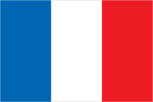
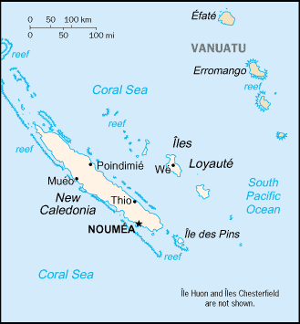

# New Caledonia

_self-governing territory of France_

## Introduction

**_Background:_**   
Settled by both Britain and France during the first half of the 19th century, the island became a French possession in 1853. It served as a penal colony for four decades after 1864. Agitation for independence during the 1980s and early 1990s ended in the 1998 Noumea Accord, which over a period of 15 to 20 years will transfer an increasing amount of governing responsibility from France to New Caledonia. The agreement also commits France to conduct a referendum between 2014 and 2018 to decide whether New Caledonia should assume full sovereignty and independence.

## Geography

**_Location:_**   
Oceania, islands in the South Pacific Ocean, east of Australia

**_Geographic coordinates:_**   
21 30 S, 165 30 E

**_Map references:_**   
Oceania

**_Area:_**   
**total:** 18,575 sq km   
**land:** 18,275 sq km   
**water:** 300 sq km

**_Area - comparative:_**   
slightly smaller than New Jersey

**_Land boundaries:_**   
0 km

**_Coastline:_**   
2,254 km

**_Maritime claims:_**   
**territorial sea:** 12 nm   
**exclusive economic zone:** 200 nm

**_Climate:_**   
tropical; modified by southeast trade winds; hot, humid

**_Terrain:_**   
coastal plains with interior mountains

**_Elevation extremes:_**   
**lowest point:** Pacific Ocean 0 m   
**highest point:** Mont Panie 1,628 m

**_Natural resources:_**   
nickel, chrome, iron, cobalt, manganese, silver, gold, lead, copper

**_Land use:_**   
**arable land:** 0.38%   
**permanent crops:** 0.27%   
**other:** 99.34% (2011)

**_Irrigated land:_**   
100 sq km (2003)

**_Natural hazards:_**   
cyclones, most frequent from November to March   
**volcanism:** Matthew and Hunter Islands are historically active

**_Environment - current issues:_**   
erosion caused by mining exploitation and forest fires

**_Geography - note:_**   
consists of the main island of New Caledonia (one of the largest in the Pacific Ocean), the archipelago of Iles Loyaute, and numerous small, sparsely populated islands and atolls

## People and Society

**_Nationality:_**   
**noun:** New Caledonian(s)   
**adjective:** New Caledonian

**_Ethnic groups:_**   
Kanak 40.3%, European 29.2%, Wallisian, Futunian 8.7%, Tahitian 2%, Indonesian 1.6%, Vietnamese 1%, Ni-Vanuatu 0.9%, other 16.2% (2009 est.)

**_Languages:_**   
French (official), 33 Melanesian-Polynesian dialects

**_Religions:_**   
Roman Catholic 60%, Protestant 30%, other 10%

**_Population:_**   
267,840 (July 2014 est.)

**_Age structure:_**   
**0-14 years:** 23.6% (male 32,311/female 30,926)   
**15-24 years:** 17% (male 23,218/female 22,260)   
**25-54 years:** 42.8% (male 57,646/female 56,939)   
**55-64 years:** 8.1% (male 10,698/female 11,128)   
**65 years and over:** 8.2% (male 10,135/female 12,579) (2014 est.)

**_Dependency ratios:_**   
**total dependency ratio:** 48.1 %   
**youth dependency ratio:** 33.2 %   
**elderly dependency ratio:** 14.9 %   
**potential support ratio:** 6.7 (2014 est.)

**_Median age:_**   
**total:** 31.1 years   
**male:** 30.4 years   
**female:** 31.7 years (2014 est.)

**_Population growth rate:_**   
1.42% (2014 est.)

**_Birth rate:_**   
15.57 births/1,000 population (2014 est.)

**_Death rate:_**   
5.45 deaths/1,000 population (2014 est.)

**_Net migration rate:_**   
4.06 migrant(s)/1,000 population   
**note:** there has been steady emigration from Wallis and Futuna to New Caledonia (2014 est.)

**_Urbanization:_**   
**urban population:** 61.7% of total population (2011)   
**rate of urbanization:** 1.24% annual rate of change (2010-15 est.)

**_Major urban areas - population:_**   
NOUMEA (capital) 157,000 (2011)

**_Sex ratio:_**   
**at birth:** 1.05 male(s)/female   
**0-14 years:** 1.05 male(s)/female   
**15-24 years:** 1.04 male(s)/female   
**25-54 years:** 1.01 male(s)/female   
**55-64 years:** 1 male(s)/female   
**65 years and over:** 0.81 male(s)/female   
**total population:** 1 male(s)/female (2014 est.)

**_Infant mortality rate:_**   
**total:** 5.46 deaths/1,000 live births   
**male:** 6.43 deaths/1,000 live births   
**female:** 4.43 deaths/1,000 live births (2014 est.)

**_Life expectancy at birth:_**   
**total population:** 77.31 years   
**male:** 73.29 years   
**female:** 81.54 years (2014 est.)

**_Total fertility rate:_**   
1.99 children born/woman (2014 est.)

**_Drinking water source:_**   
**improved:** urban: 98.5% of population; rural: 98.5% of population; total: 98.5% of population   
**unimproved:** urban: 1.5% of population; rural: 1.5% of population; total: 1.5% of population (2012 est.)

**_Sanitation facility access:_**   
**improved:** urban: 100% of population; rural: 100% of population; total: 100% of population   
**unimproved:** urban: 0% of population; rural: 0% of population; total: 0% of population (2012 est.)

**_HIV/AIDS - adult prevalence rate:_**   
NA

**_HIV/AIDS - people living with HIV/AIDS:_**   
NA

**_HIV/AIDS - deaths:_**   
NA

**_Literacy:_**   
**definition:** age 15 and over can read and write   
**total population:** 96.2%   
**male:** 96.8%   
**female:** 95.5% (1996 census)

## Government

**_Country name:_**   
**conventional long form:** Territory of New Caledonia and Dependencies   
**conventional short form:** New Caledonia   
**local long form:** Territoire des Nouvelle-Caledonie et Dependances   
**local short form:** Nouvelle-Caledonie

**_Dependency status:_**   
territorial collectivity (or a sui generis collectivity) of France since 1998

**_Government type:_**   
parliamentary representative democracy

**_Capital:_**   
**name:** Noumea   
**geographic coordinates:** 22 16 S, 166 27 E   
**time difference:** UTC+11 (16 hours ahead of Washington, DC during Standard Time)

**_Administrative divisions:_**   
none (overseas territory of France); there are no first-order administrative divisions as defined by the US Government, but there are three provinces named Province des Iles, Province Nord, and Province Sud

**_Independence:_**   
none (overseas territory of France); note - a referendum on independence was held in 1998 but was rejected; a new referendum is scheduled between 2014 and 2018

**_National holiday:_**   
Fete de la Federation, 14 July (1789); note - the local holiday is New Caledonia Day, 24 September (1853)

**_Constitution:_**   
4 October 1958 (French Constitution with changes as reflected in Noumea Accord of 5 May 1998) (2013)

**_Legal system:_**   
civil law system based on French law; note - the 1988 Matignon Accords (signed in the Matignon Hotel) set up a 10-year period of development during which the Kanak community received substantial autonomy but agreed not to raise the independece issue

**_Suffrage:_**   
18 years of age; universal

**_Executive branch:_**   
**chief of state:** President Francois HOLLANDE (since 15 May 2012); represented by High Commissioner Jean-Jacques BROT (since 2 February 2013)   
**head of government:** President of the Government Harold MARTIN (since 3 March 2011); note - since 3 March 2011, three different governments of Harold MARTIN have collapsed over the choice of a flag that will be used while it is being decolonized; President Harold MARTIN is head of a caretaker government   
**cabinet:** Cabinet consists of 11 members elected from and by the Territorial Congress   
**elections:** French president elected by popular vote for a five-year term; high commissioner appointed by the French president on the advice of the French Ministry of Interior; president of the government elected by the Territorial Congress for a five-year term (no term limits); note - last election held on 10 June 2011 (next to be held in June 2016)

**_Legislative branch:_**   
unicameral Territorial Congress or Congres du territoire (54 seats; members belong to the three Provincial Assemblies, or Assemblees Provinciales, elected by popular vote to serve five-year terms)   
**elections:** last held on 11 May 2014 (next to be held on May 2019)   
**election results:** percent of vote by party - NA; seats by party - L'Avenir Ensemble 13, UMP 7, FLINKS 9, Union for Caledonia in France 6, Build Our Rainbow Nation 6, other 7   
**note:** the Customary Senate is the assembly of the various traditional councils of the Kanaks, the indigenous population, which rules on laws affecting the indigenous population; New Caledonia holds two seats in the French Senate; elections last held on 21 September 2008 (next to be held not later than September 2014); results - percent of vote by party - NA; seats by party - UMP 2; New Caledonia also elects two seats to the French National Assembly; elections last held on 17 June 2012 (next to be held by June 2017); results - percent of vote by party - NA; seats by party - UMP 2

**_Judicial branch:_**   
**highest court(s):** Court of Appeal in Noumea or Cour d'Appel (the highest local judicial court; organized into civil, commercial, social, and pre-trial investigation chambers; number of judges NA); Conseil d'Etat (the highest local administrative court; number of judges NA); note - final appeals are heard before the Court of Cassation or Cour de Cassation, in Paris   
**judge selection and term of office:** NA   
**subordinate courts:** Courts of First Instance include: civil, juvenile, commercial, labor, police, criminal, Assizes, and also a pre-trial investigation chamber; Joint Commerce Tribunal; administrative courts

**_Political parties and leaders:_**   
Build Our Rainbow Nation   
Caledonia Together [Philippe GOMES]   
Caledonian Union or UC [Daniel GOA]   
Front National or FN [Marine LE PEN]   
Future Together (l'Avenir Ensemble) [Harold MARTIN]   
Kanak Socialist Front for National Liberation or FLNKS (includes PALIKA, UNI, UC, and UPM)   
Labor Party (Labor Party) [Louis Kotra UREGEI]   
National Union for Independence (Union Nationale pour l'Independance) or UNI   
Parti de Liberation Kanak or PALIKA [Paul NEAOUTYINE]   
Progressive Melanesian Union (Union Progressiste Mellanesienne) or UPM   
Socialist Group [Jean Pierre BEL]   
Socialist Kanak Liberation or LKS [Nidoish NAISSELINE]   
The Future Together or AE [Harold MARTIN]   
The Rally or UMP [Pierre GROGIER]   
Union for Caledonia in France   
Union of Pro-Independence Co-operation Committees [Francois BURCK]

**_Political pressure groups and leaders:_**   
NA

**_International organization participation:_**   
PIF (associate member), SPC, UPU, WFTU (NGOs)

**_Diplomatic representation in the US:_**   
none (overseas territory of France)

**_Diplomatic representation from the US:_**   
none (overseas territory of France)

**_Flag description:_**   
the flag of France is used

**_National symbol(s):_**   
kagu bird

**_National anthem:_**   
**name:** "Soyons unis, devenons freres" (Let Us Be United, Let Us Become Brothers)   
**lyrics/music:** Chorale Melodia (a local choir)   
**note:** adopted 2008; the anthem contains a mixture of lyrics in both French and Nengone (an indigenous language); as a self-governing territory of France, in addition to the local anthem, "La Marseillaise" is official (see France)

## Economy

**_Economy - overview:_**   
New Caledonia has about 25% of the world's known nickel reserves. Only a small amount of the land is suitable for cultivation, and food accounts for about 20% of imports. In addition to nickel, substantial financial support from France - equal to more than 15% of GDP - and tourism are keys to the health of the economy; during 2009-10, France sent more development assistance to New Caledonia than to any of its other overseas territories. Substantial new investment in the nickel industry, combined with the recovery of global nickel prices, brightens the economic outlook for the next several years.

**_GDP (purchasing power parity):_**   
$9.28 billion (2008 est.)   
$3.158 billion (2003 est.)

**_GDP (official exchange rate):_**   
$9.28 billion (2008 est.)

**_GDP - real growth rate:_**   
0.6% (2008 est.)

**_GDP - per capita (PPP):_**   
$37,700 (2008 est.)   
$15,000 (2003 est.)

**_GDP - composition, by end use:_**   
**household consumption:** 63.5%   
**government consumption:** 27.6%   
**investment in fixed capital:** 29.2%   
**investment in inventories:** 0%   
**exports of goods and services:** 25.1%   
**imports of goods and services:** -45.4%; (2013 est.)

**_GDP - composition, by sector of origin:_**   
**agriculture:** 2.1%   
**industry:** 30%   
**services:** 67.9% (2013 est.)

**_Agriculture - products:_**   
vegetables; beef, venison, other livestock products; fish

**_Industries:_**   
nickel mining and smelting

**_Industrial production growth rate:_**   
8% (2013 est.)

**_Labor force:_**   
106,400 (2010)

**_Labor force - by occupation:_**   
**agriculture:** 20%   
**industry:** 20%   
**services:** 60% (2002)

**_Unemployment rate:_**   
17.1% (2004)

**_Population below poverty line:_**   
NA%

**_Household income or consumption by percentage share:_**   
**lowest 10%:** NA%   
**highest 10%:** NA%

**_Budget:_**   
**revenues:** $996 million   
**expenditures:** $1.072 billion (2001 est.)

**_Budget surplus (+) or deficit (-):_**   
NA% of GDP

**_Fiscal year:_**   
calendar year

**_Inflation rate (consumer prices):_**   
1.7% (2013 est.)   
1.7% (2012 est.)

**_Market value of publicly traded shares:_**   
$NA

**_Exports:_**   
$1.321 billion (2012 est.)   
$1.661 billion (2011 est.)

**_Exports - commodities:_**   
ferronickels, nickel ore, fish

**_Exports - partners:_**   
Japan 17.2%, France 16.3%, South Korea 12.3%, China 9.6%, Australia 8.4%, Belgium 4.9% (2012)

**_Imports:_**   
$3.245 billion (2012 est.)   
$3.698 billion (2011 est.)

**_Imports - commodities:_**   
machinery and equipment, fuels, chemicals, foodstuffs

**_Imports - partners:_**   
France 33.5%, Singapore 22.5%, Australia 11.7%, NZ 5.1% (2012)

**_Debt - external:_**   
$79 million (1998 est.)

**_Exchange rates:_**   
Comptoirs Francais du Pacifique francs (XPF) per US dollar -   
   
85.74 (2011 est.)   
90.01 (2010 est.)

## Energy

**_Electricity - production:_**   
1.978 billion kWh (2010 est.)

**_Electricity - consumption:_**   
1.84 billion kWh (2010 est.)

**_Electricity - exports:_**   
0 kWh (2012 est.)

**_Electricity - imports:_**   
0 kWh (2012 est.)

**_Electricity - installed generating capacity:_**   
499,000 kW (2010 est.)

**_Electricity - from fossil fuels:_**   
76.8% of total installed capacity (2010 est.)

**_Electricity - from nuclear fuels:_**   
0% of total installed capacity (2010 est.)

**_Electricity - from hydroelectric plants:_**   
15.6% of total installed capacity (2010 est.)

**_Electricity - from other renewable sources:_**   
7.6% of total installed capacity (2010 est.)

**_Crude oil - production:_**   
0 bbl/day (2012 est.)

**_Crude oil - exports:_**   
0 bbl/day (2010 est.)

**_Crude oil - imports:_**   
0 bbl/day (2010 est.)

**_Crude oil - proved reserves:_**   
0 bbl (1 January 2013 est.)

**_Refined petroleum products - production:_**   
0 bbl/day (2010 est.)

**_Refined petroleum products - consumption:_**   
13,640 bbl/day (2011 est.)

**_Refined petroleum products - exports:_**   
117 bbl/day (2010 est.)

**_Refined petroleum products - imports:_**   
14,670 bbl/day (2010 est.)

**_Natural gas - production:_**   
0 cu m (2011 est.)

**_Natural gas - consumption:_**   
0 cu m (2010 est.)

**_Natural gas - exports:_**   
0 cu m (2011 est.)

**_Natural gas - imports:_**   
0 cu m (2011 est.)

**_Natural gas - proved reserves:_**   
0 cu m (1 January 2013 est.)

**_Carbon dioxide emissions from consumption of energy:_**   
3.026 million Mt (2011 est.)

## Communications

**_Telephones - main lines in use:_**   
80,000 (2012)

**_Telephones - mobile cellular:_**   
231,000 (2012)

**_Telephone system:_**   
**general assessment:** a submarine cable network connection between New Caledonia and Australia, completed in 2007, increased network capacity and improved high-speed connectivity and access to international networks   
**domestic:** combined fixed-line and mobile-cellular telephone subscribership exceeds 100 per 100 persons   
**international:** country code - 687; satellite earth station - 1 Intelsat (Pacific Ocean) (2010)

**_Broadcast media:_**   
the publicly owned French Overseas Network (RFO), which operates in France's overseas departments and territories, broadcasts over the RFO Nouvelle Caledonie TV and radio stations; a small number of privately owned radio stations also broadcast (2008)

**_Internet country code:_**   
.nc

**_Internet hosts:_**   
34,231 (2012)

**_Internet users:_**   
85,000 (2009)

## Transportation

**_Airports:_**   
25 (2013)

**_Airports - with paved runways:_**   
**total:** 12   
**over 3,047 m:** 1   
**914 to 1,523 m:** 10   
**under 914 m:** 1 (2013)

**_Airports - with unpaved runways:_**   
**total:** 13   
**914 to 1,523 m:** 5   
**under 914 m:** 8 (2013)

**_Heliports:_**   
8 (2013)

**_Roadways:_**   
**total:** 5,622 km (2006)

**_Merchant marine:_**   
**registered in other countries:** 3 (France 3) (2010)

**_Ports and terminals:_**   
**major seaport(s):** Noumea

## Military

**_Military branches:_**   
no regular military forces; French military, police, and gendarmerie (2012)

**_Manpower available for military service:_**   
**males age 16-49:** 68,219 (2010 est.)

**_Manpower fit for military service:_**   
**males age 16-49:** 56,233   
**females age 16-49:** 55,983 (2010 est.)

**_Manpower reaching militarily significant age annually:_**   
**male:** 2,272   
**female:** 2,167 (2010 est.)

**_Military - note:_**   
defense is the responsibility of France

## Transnational Issues

**_Disputes - international:_**   
Matthew and Hunter Islands east of New Caledonia claimed by France and Vanuatu

............................................................   
_Page last updated on June 20, 2014_
