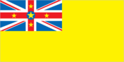
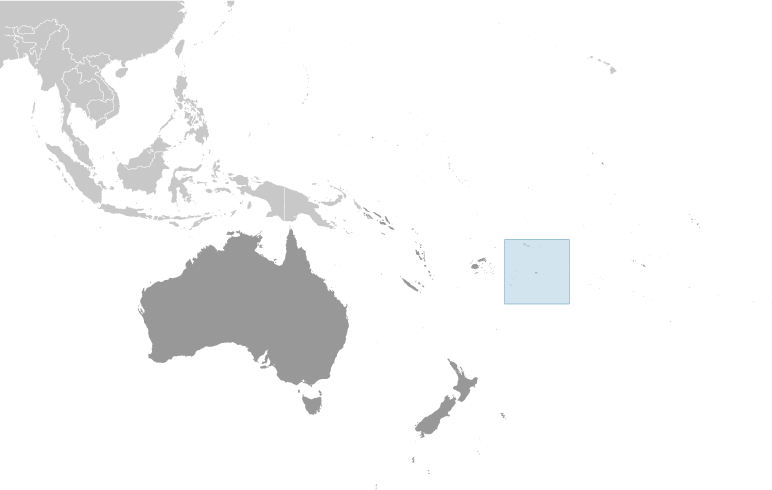
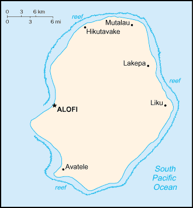

# Niue

_self-governing in free association with New Zealand_

## Introduction

**_Background:_**   
Niue's remoteness, as well as cultural and linguistic differences between its Polynesian inhabitants and those of the adjacent Cook Islands, has caused it to be separately administered by New Zealand. The population of the island continues to drop (from a peak of 5,200 in 1966 to an estimated 1,229 in 2013) with substantial emigration to New Zealand 2,400 km to the southwest.

## Geography

**_Location:_**   
Oceania, island in the South Pacific Ocean, east of Tonga

**_Geographic coordinates:_**   
19 02 S, 169 52 W

**_Map references:_**   
Oceania

**_Area:_**   
**total:** 260 sq km   
**land:** 260 sq km   
**water:** 0 sq km

**_Area - comparative:_**   
1.5 times the size of Washington, DC

**_Land boundaries:_**   
0 km

**_Coastline:_**   
64 km

**_Maritime claims:_**   
**territorial sea:** 12 nm   
**exclusive economic zone:** 200 nm

**_Climate:_**   
tropical; modified by southeast trade winds

**_Terrain:_**   
steep limestone cliffs along coast, central plateau

**_Elevation extremes:_**   
**lowest point:** Pacific Ocean 0 m   
**highest point:** unnamed elevation near Mutalau settlement 68 m

**_Natural resources:_**   
fish, arable land

**_Land use:_**   
**arable land:** 3.85%   
**permanent crops:** 11.54%   
**other:** 84.62% (2011)

**_Irrigated land:_**   
NA

**_Natural hazards:_**   
typhoons

**_Environment - current issues:_**   
increasing attention to conservationist practices to counter loss of soil fertility from traditional slash and burn agriculture

**_Environment - international agreements:_**   
**party to:** Biodiversity, Climate Change, Climate Change-Kyoto Protocol, Desertification, Law of the Sea, Ozone Layer Protection

**_Geography - note:_**   
one of world's largest coral islands

## People and Society

**_Nationality:_**   
**noun:** Niuean(s)   
**adjective:** Niuean

**_Ethnic groups:_**   
Niuen 66.5%, part-Niuen 13.4%, non-Niuen 20.1% (includes 12% European and Asian and 8% Pacific Islanders) (2011 est.)

**_Languages:_**   
Niuean (official) 46% (a Polynesian language closely related to Tongan and Samoan), Niuean and English 32%, English (official) 11%, Niuean and others 5%, other 6% (2011 est.)

**_Religions:_**   
Ekalesia Niue (Congregational Christian Church of Niue - a Protestant church founded by missionaries from the London Missionary Society) 67%, other Protestant 3% (includes Seventh Day Adventist 1%, Presbyterian 1%, and Methodist 1%), Mormon 10%, Roman Catholic 10%, Jehovah's Witnesses 2%, other 6%, none 2% (2011 est.)

**_Population:_**   
1,190 (July 2014 est.)

**_Population growth rate:_**   
-0.03% (2014 est.)

**_Urbanization:_**   
**urban population:** 37.9% of total population (2011)   
**rate of urbanization:** -1.63% annual rate of change (2010-15 est.)

**_Sex ratio:_**   
NA

**_Infant mortality rate:_**   
**total:** NA   
**male:** NA   
**female:** NA

**_Life expectancy at birth:_**   
**total population:** NA   
**male:** NA   
**female:** NA

**_Total fertility rate:_**   
NA

**_Health expenditures:_**   
14.6% of GDP (2011)

**_Physicians density:_**   
6 physicians/1,000 population (2008)

**_Drinking water source:_**   
**improved:** urban: 98.5% of population; rural: 98.6% of population; total: 98.6% of population   
**unimproved:** urban: 1.5% of population; rural: 1.4% of population; total: 1.4% of population (2012 est.)

**_Sanitation facility access:_**   
**improved:** urban: 100% of population; rural: 100% of population; total: 100% of population   
**unimproved:** urban: 0% of population; rural: 0% of population; total: 0% of population (2012 est.)

**_HIV/AIDS - adult prevalence rate:_**   
NA

**_HIV/AIDS - people living with HIV/AIDS:_**   
NA

**_HIV/AIDS - deaths:_**   
NA

**_Education expenditures:_**   
NA

**_Literacy:_**   
**definition:** NA   
**total population:** 95%   
**male:** NA   
**female:** NA

**_School life expectancy (primary to tertiary education):_**   
**total:** 13 years   
**male:** 12 years   
**female:** 15 years (2005)

## Government

**_Country name:_**   
**conventional long form:** none   
**conventional short form:** Niue   
**note:** pronunciation falls between nyu-way and new-way, but not like new-wee   
**former:** Savage Island

**_Dependency status:_**   
self-governing in free association with New Zealand since 1974; Niue fully responsible for internal affairs; New Zealand retains responsibility for external affairs and defense; however, these responsibilities confer no rights of control and are only exercised at the request of the Government of Niue

**_Government type:_**   
self-governing parliamentary democracy

**_Capital:_**   
**name:** Alofi   
**geographic coordinates:** 19 01 S, 169 55 W   
**time difference:** UTC-11 (6 hours behind Washington, DC, during Standard Time)

**_Administrative divisions:_**   
none; note - there are no first-order administrative divisions as defined by the US Government, but there are 14 villages at the second order

**_Independence:_**   
19 October 1974 (Niue became a self-governing parliamentary government in free association with New Zealand)

**_National holiday:_**   
Waitangi Day (Treaty of Waitangi established British sovereignty over New Zealand), 6 February (1840)

**_Constitution:_**   
several previous (New Zealand colonial statutes); latest 19 October 1974 (Niue Constitution Act 1974); amended 1992, 2007 (2007)

**_Legal system:_**   
English common law

**_Suffrage:_**   
18 years of age; universal

**_Executive branch:_**   
**chief of state:** Queen ELIZABETH II (since 6 February 1952); represented by Governor General of New Zealand Anand SATYANAND (since 23 August 2006); the UK and New Zealand are represented by New Zealand High Commissioner Mark BLUMSKY (since September 2011)   
**head of government:** Premier Toke TALAGI (since 18 June 2008)   
**cabinet:** Cabinet consists of the premier and 3 ministers   
**elections:** the monarchy is hereditary; premier elected by the Legislative Assembly for a three-year term; election last held on 24 April 2014 (next to be held in 2017)   
**election results:** Toke TALAGI re-elected premier; Legislative Assembly vote - Toke TALAGI 12, Stanley KALAUNI 8

**_Legislative branch:_**   
unicameral Legislative Assembly (20 seats; members elected by popular vote to serve three-year terms; six elected from a common roll and 14 are village representatives)   
**elections:** last held on 12 April 2014 (next to be held in 2017)   
**election results:** percent of vote by party - NA; seats by party - 20 independents

**_Judicial branch:_**   
**highest court(s):** Court of Appeal (consists of the chief justice and up to 3 judges); note - the Judicial Committee of the Privy Council (in London) is the final appeal court beyond the Niue Court of Appeal; note - Niue is a participant in the Pacific Judicial Development Program; the program is designed to build governance and the rule of law in 15 Pacific island countries   
**judge selection and term of office:** Niue chief justice appointed by the governor-general on the advice of the Cabinet and tendered by the premier; other judges appointed by the governor-general on the advice of the Cabinet and tendered by the chief justice and the minister of justice; judges serve until age 68   
**subordinate courts:** High Court

**_Political parties and leaders:_**   
Alliance of Independents or AI   
Niue People's Action Party or NPP [Young VIVIAN]

**_Political pressure groups and leaders:_**   
NA

**_International organization participation:_**   
ACP, AOSIS, FAO, IFAD, OPCW, PIF, Sparteca, SPC, UNESCO, UPU, WHO, WMO

**_Diplomatic representation in the US:_**   
none (self-governing territory in free association with New Zealand)

**_Diplomatic representation from the US:_**   
none (self-governing territory in free association with New Zealand)

**_Flag description:_**   
yellow with the flag of the UK in the upper hoist-side quadrant; the flag of the UK bears five yellow five-pointed stars - a large star on a blue disk in the center and a smaller star on each arm of the bold red cross; the larger star stands for Niue, the smaller stars recall the Southern Cross constellation on the New Zealand flag and symbolize links with that country; yellow represents the bright sunshine of Niue and the warmth and friendship between Niue and New Zealand

**_National anthem:_**   
**name:** "Ko e Iki he Lagi" (The Lord in Heaven)   
**lyrics/music:** unknown/unknown, prepared by Sioeli FUSIKATA   
**note:** adopted 1974

## Economy

**_Economy - overview:_**   
The economy suffers from the typical Pacific island problems of geographic isolation, few resources, and a small population. Government expenditures regularly exceed revenues, and the shortfall is made up by critically needed grants from New Zealand that are used to pay wages to public employees. Niue has cut government expenditures by reducing the public service by almost half. The agricultural sector consists mainly of subsistence gardening, although some cash crops are grown for export. Industry consists primarily of small factories to process passion fruit, lime oil, honey, and coconut cream. The sale of postage stamps to foreign collectors is an important source of revenue. The island in recent years has suffered a serious loss of population because of emigration to New Zealand. Efforts to increase GDP include the promotion of tourism and financial services, although the International Banking Repeal Act of 2002 resulted in the termination of all offshore banking licenses. Economic aid from New Zealand in FY08/09 was US$5.7 million. While in the process of rebuilding, Niue has been dependent on foreign aid.

**_GDP (purchasing power parity):_**   
$10.01 million (2003 est.)

**_GDP (official exchange rate):_**   
$10.01 million (2003)

**_GDP - real growth rate:_**   
6.2% (2003 est.)

**_GDP - per capita (PPP):_**   
$5,800 (2003 est.)

**_GDP - composition, by sector of origin:_**   
**agriculture:** 23.5%   
**industry:** 26.9%   
**services:** 49.5% (2003)

**_Agriculture - products:_**   
coconuts, passion fruit, honey, limes, taro, yams, cassava (manioc, tapioca), sweet potatoes; pigs, poultry, beef cattle

**_Industries:_**   
handicrafts, food processing

**_Industrial production growth rate:_**   
NA%

**_Labor force:_**   
663 (2001)

**_Labor force - by occupation:_**   
**note:** most work on family plantations; paid work exists only in government service, small industry, and the Niue Development Board

**_Unemployment rate:_**   
12% (2001)

**_Population below poverty line:_**   
NA%

**_Household income or consumption by percentage share:_**   
**lowest 10%:** NA%   
**highest 10%:** NA%

**_Budget:_**   
**revenues:** $15.07 million   
**expenditures:** $16.33 million (FY04/05)

**_Budget surplus (+) or deficit (-):_**   
-12.6% of GDP (FY04/05)

**_Fiscal year:_**   
1 April - 31 March

**_Inflation rate (consumer prices):_**   
4% (2005)

**_Exports:_**   
$201,400 (2004)

**_Exports - commodities:_**   
canned coconut cream, copra, honey, vanilla, passion fruit products, pawpaws, root crops, limes, footballs, stamps, handicrafts

**_Imports:_**   
$9.038 million (2004)

**_Imports - commodities:_**   
food, live animals, manufactured goods, machinery, fuels, lubricants, chemicals, drugs

**_Debt - external:_**   
$418,000 (2002 est.)

**_Exchange rates:_**   
New Zealand dollars (NZD) per US dollar -   
1.247 (2013)   
1.2334 (2012)   
1.3874 (2010)   
1.6002 (2009)   
1.4151 (2008)

## Energy

**_Electricity - production:_**   
3 million kWh (2010 est.)

**_Electricity - consumption:_**   
2.79 million kWh (2010 est.)

**_Electricity - exports:_**   
0 kWh (2012 est.)

**_Electricity - imports:_**   
0 kWh (2012 est.)

**_Electricity - installed generating capacity:_**   
1,000 kW (2010 est.)

**_Electricity - from fossil fuels:_**   
100% of total installed capacity (2010 est.)

**_Electricity - from nuclear fuels:_**   
0% of total installed capacity (2010 est.)

**_Electricity - from hydroelectric plants:_**   
0% of total installed capacity (2010 est.)

**_Electricity - from other renewable sources:_**   
0% of total installed capacity (2010 est.)

**_Crude oil - production:_**   
0 bbl/day (2012 est.)

**_Crude oil - exports:_**   
0 bbl/day (2010 est.)

**_Crude oil - imports:_**   
0 bbl/day (2010 est.)

**_Crude oil - proved reserves:_**   
0 bbl (1 January 2013 est.)

**_Refined petroleum products - production:_**   
0 bbl/day (2010 est.)

**_Refined petroleum products - consumption:_**   
0 bbl/day (2011 est.)

**_Refined petroleum products - exports:_**   
0 bbl/day (2010 est.)

**_Refined petroleum products - imports:_**   
23 bbl/day (2010 est.)

**_Natural gas - production:_**   
0 cu m (2011 est.)

**_Natural gas - consumption:_**   
0 cu m (2010 est.)

**_Natural gas - exports:_**   
0 cu m (2011 est.)

**_Natural gas - imports:_**   
0 cu m (2011 est.)

**_Natural gas - proved reserves:_**   
0 cu m (1 January 2013 est.)

**_Carbon dioxide emissions from consumption of energy:_**   
3,050 Mt (2011 est.)

## Communications

**_Telephone system:_**   
**domestic:** single-line telephone system connects all villages on island   
**international:** country code - 683 (2001)

**_Broadcast media:_**   
1 government-owned TV station with many of the programs supplied by Television New Zealand; 1 government-owned radio station broadcasting in AM and FM (2009)

**_Internet country code:_**   
.nu

**_Internet hosts:_**   
79,508 (2012)

**_Internet users:_**   
1,100 (2009)

## Transportation

**_Airports:_**   
1 (2013)

**_Airports - with paved runways:_**   
**total:** 1   
**1,524 to 2,437 m:** 1 (2012)

**_Airports - with unpaved runways:_**   
**total:** 1   
**1,524 to 2,437 m:** 1 (2013)

**_Roadways:_**   
**total:** 120 km   
**paved:** 120 km (2011)

**_Ports and terminals:_**   
**major seaport(s):** Alofi

## Military

**_Military branches:_**   
no regular indigenous military forces; Police Force

**_Military - note:_**   
defense is the responsibility of New Zealand

## Transnational Issues

**_Disputes - international:_**   
none

............................................................   
_Page last updated on June 20, 2014_
