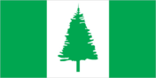
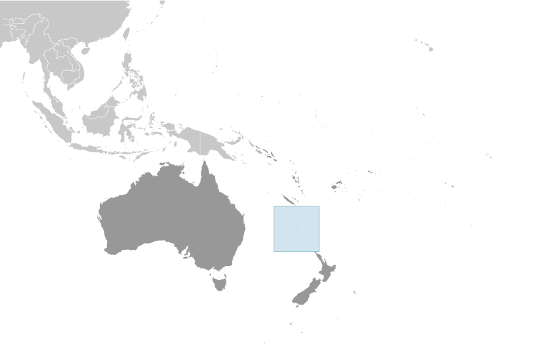
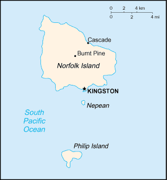

# Norfolk Island

_territory of Australia_

## Introduction

**_Background:_**   
Two British attempts at establishing the island as a penal colony (1788-1814 and 1825-55) were ultimately abandoned. In 1856, the island was resettled by Pitcairn Islanders, descendants of the Bounty mutineers and their Tahitian companions.

## Geography

**_Location:_**   
Oceania, island in the South Pacific Ocean, east of Australia

**_Geographic coordinates:_**   
29 02 S, 167 57 E

**_Map references:_**   
Oceania

**_Area:_**   
**total:** 36 sq km   
**land:** 36 sq km   
**water:** 0 sq km

**_Area - comparative:_**   
about 0.2 times the size of Washington, DC

**_Land boundaries:_**   
0 km

**_Coastline:_**   
32 km

**_Maritime claims:_**   
**territorial sea:** 12 nm   
**exclusive fishing zone:** 200 nm

**_Climate:_**   
subtropical; mild, little seasonal temperature variation

**_Terrain:_**   
volcanic formation with mostly rolling plains

**_Elevation extremes:_**   
**lowest point:** Pacific Ocean 0 m   
**highest point:** Mount Bates 319 m

**_Natural resources:_**   
fish

**_Land use:_**   
**arable land:** 0%   
**permanent crops:** 0%   
**other:** 100% (2011)

**_Irrigated land:_**   
NA

**_Natural hazards:_**   
typhoons (especially May to July)

**_Environment - current issues:_**   
NA

**_Geography - note:_**   
most of the 32 km coastline consists of almost inaccessible cliffs, but the land slopes down to the sea in one small southern area on Sydney Bay, where the capital of Kingston is situated

## People and Society

**_Nationality:_**   
**noun:** Norfolk Islander(s)   
**adjective:** Norfolk Islander(s)

**_Ethnic groups:_**   
Australian 79.5%, New Zealander 13.3%, Fijian 2.5%, Filipino 1.1%, English 1%, other 1.8%, unspecified 0.8% (2011 est.)

**_Languages:_**   
English (official) 67.6%, other 32.4% (includes Norfolk Island 23.7%, which is a mixture of 18th century English and ancient Tahitian) (2011 est.)

**_Religions:_**   
Protestant 49.6% (Anglican 31.8%, Uniting Church in Australia 10.6%, Seventh-Day Adventist 3.2%), Roman Catholic 11.7%, other 8.6%, none 23.5%, unspecified 6.6% (2011 est.)

**_Population:_**   
2,210 (July 2014 est.)

**_Age structure:_**   
**0-14 years:** 20.2%   
**15-64 years:** 63.9%   
**65 years and over:** 15.9% (2013 est.)

**_Population growth rate:_**   
0.01% (2014 est.)

**_Sex ratio:_**   
NA

**_Infant mortality rate:_**   
**total:** NA   
**male:** NA   
**female:** NA

**_Life expectancy at birth:_**   
**total population:** NA   
**male:** NA   
**female:** NA

**_Total fertility rate:_**   
NA

**_HIV/AIDS - adult prevalence rate:_**   
NA

**_HIV/AIDS - people living with HIV/AIDS:_**   
NA

**_HIV/AIDS - deaths:_**   
NA

**_Literacy:_**   
NA

## Government

**_Country name:_**   
**conventional long form:** Territory of Norfolk Island   
**conventional short form:** Norfolk Island

**_Dependency status:_**   
self-governing territory of Australia; administered from Canberra by the Department of Regional Australia, Local Government, Arts and Sport

**_Government type:_**   
NA

**_Capital:_**   
**name:** Kingston   
**geographic coordinates:** 29 03 S, 167 58 E   
**time difference:** UTC+11.5 (16.5 hours ahead of Washington, DC, during Standard Time)

**_Administrative divisions:_**   
none (territory of Australia)

**_Independence:_**   
none (territory of Australia)

**_National holiday:_**   
Bounty Day (commemorates the arrival of Pitcairn Islanders), 8 June (1856)

**_Constitution:_**   
previous 1913, 1957; latest effective 7 August 1979; amended many times, last in 2010 (2011)

**_Legal system:_**   
English common law and the laws of Australia

**_Suffrage:_**   
18 years of age; universal

**_Executive branch:_**   
**chief of state:** Queen ELIZABETH II (since 6 February 1952); represented by the Australian governor general   
**head of government:** Administrator Neil POPE (since 1 April 2012)   
**cabinet:** Executive Council made up of 4 of the 9 members of the Legislative Assembly; the council devises government policy and acts as an advisor to the administrator   
**elections:** the monarchy is hereditary; governor general appointed by the monarch; administrator appointed by the governor general of Australia for a two year term and represents the monarch and Australia

**_Legislative branch:_**   
unicameral Legislative Assembly (9 seats; members elected by electors who have nine equal votes each but only four votes can be given to any one candidate; members to serve three-year terms)   
**elections:** last held on 13 March 2013 (next to be held in 2016)   
**election results:** seats - independents 8; Norfolk Liberals 1

**_Judicial branch:_**   
**highest court(s):** Supreme Court of Norfolk Island (consists of the chief justice and NA justices); note - appeals beyond the Supreme Court of Norfolk Island are heard by the Federal Court of Australia   
**judge selection and term of office:** justices appointed by the governor general of Australia from among justices of the Federal Court of Australia; justices serve until mandatory retirement at age 70   
**subordinate courts:** Petty Court of Sessions; specialized courts including a Coroner's Court and the Employment Tribunal

**_Political parties and leaders:_**   
Norfolk Island Labor Party [Mike KELLY]   
Norfolk Liberals [John BROWN]

**_Political pressure groups and leaders:_**   
none

**_International organization participation:_**   
UPU

**_Diplomatic representation in the US:_**   
none (territory of Australia)

**_Diplomatic representation from the US:_**   
none (territory of Australia)

**_Flag description:_**   
three vertical bands of green (hoist side), white, and green with a large green Norfolk Island pine tree centered in the slightly wider white band; green stands for the rich vegetation on the island, and the pine tree - endemic to the island - is a symbol of Norfolk Island   
**note:** somewhat reminiscent of the flag of Canada with its use of only two colors and depiction of a prominent local floral symbol in the central white band

**_National symbol(s):_**   
Norfolk Island pine

**_National anthem:_**   
**name:** "Come Ye Blessed"   
**lyrics/music:** New Testament/John Prindle SCOTT   
**note:** the local anthem, whose lyrics consist of the words from Matthew 25:34-36, 40, is also known as "The Pitcairn Anthem;" as a territory of Australia, "God Save the Queen" is official (see Australia), however, the island does not recognize "Advance Australia Fair"

## Economy

**_Economy - overview:_**   
Norfolk Island is suffering from a severe economic downturn. Tourism, the primary economic activity, is the main driver of economic growth. The agricultural sector has become self sufficient in the production of beef, poultry, and eggs.

**_GDP (purchasing power parity):_**   
$NA

**_Agriculture - products:_**   
Norfolk Island pine seed, Kentia palm seed, cereals, vegetables, fruit; cattle, poultry

**_Industries:_**   
tourism, light industry, ready mixed concrete

**_Labor force:_**   
978 (2006)

**_Labor force - by occupation:_**   
**agriculture:** 6%   
**industry:** 14%   
**services:** 80% (2006 est.)

**_Budget:_**   
**revenues:** $4.6 million   
**expenditures:** $4.8 million (FY99/00)

**_Fiscal year:_**   
1 July - 30 June

**_Exports:_**   
$NA

**_Exports - commodities:_**   
postage stamps, seeds of the Norfolk Island pine and Kentia palm, small quantities of avocados

**_Imports:_**   
$NA

**_Imports - commodities:_**   
NA

**_Debt - external:_**   
$NA

**_Exchange rates:_**   
Australian dollars (AUD) per US dollar -   
1.031 (2013)   
0.9658 (2012)   
1.0902 (2010)   
1.2822 (2009)   
1.2059 (2008)

## Communications

**_Telephone system:_**   
**general assessment:** adequate   
**domestic:** free local calls   
**international:** country code - 672; submarine cable links with Australia and New Zealand; satellite earth station - 1

**_Broadcast media:_**   
1 local radio station; broadcasts of several Australian radio and TV stations available via satellite (2009)

**_Internet country code:_**   
.nf

**_Internet hosts:_**   
128 (2012)

## Transportation

**_Airports:_**   
1 (2013)

**_Airports - with paved runways:_**   
**total:** 1   
**1,524 to 2,437 m:** 1 (2013)

**_Roadways:_**   
**total:** 80 km   
**paved:** 53 km   
**unpaved:** 27 km (2008)

**_Ports and terminals:_**   
**major seaport(s):** Kingston

## Military

**_Military - note:_**   
defense is the responsibility of Australia

## Transnational Issues

**_Disputes - international:_**   
none

............................................................   
_Page last updated on June 6, 2014_
