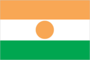
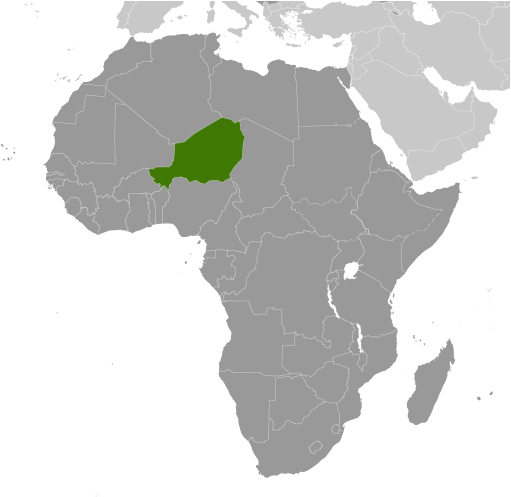
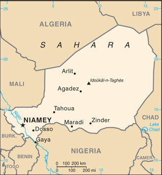

# Niger

## Introduction

**_Background:_**   
Niger became independent from France in 1960 and experienced single-party and military rule until 1991, when Gen. Ali SAIBOU was forced by public pressure to allow multiparty elections, which resulted in a democratic government in 1993. Political infighting brought the government to a standstill and in 1996 led to a coup by Col. Ibrahim BARE. In 1999, BARE was killed in a counter coup by military officers who restored democratic rule and held elections that brought Mamadou TANDJA to power in December of that year. TANDJA was reelected in 2004 and in 2009 spearheaded a constitutional amendment that would allow him to extend his term as president. In February 2010, a military coup deposed TANDJA, immediately suspended the constitution, and dissolved the Cabinet. ISSOUFOU Mahamadou emerged victorious from a crowded field in the election following the coup and was inaugurated in April 2011. Niger is one of the poorest countries in the world with minimal government services and insufficient funds to develop its resource base. The largely agrarian and subsistence-based economy is frequently disrupted by extended droughts common to the Sahel region of Africa. The Nigerien Movement for Justice, a predominantly ethnic Tuareg rebel group, emerged in February 2007, and attacked several military targets in Niger's northern region throughout 2007 and 2008. Successful government offensives in 2009 ended the rebellion. Niger is facing increased security concerns on its borders from various external threats including insecurity in Libya, spillover from the conflict in Mali, and violent extremism in northeastern Nigeria.

## Geography

**_Location:_**   
Western Africa, southeast of Algeria

**_Geographic coordinates:_**   
16 00 N, 8 00 E

**_Map references:_**   
Africa

**_Area:_**   
**total:** 1.267 million sq km   
**land:** 1,266,700 sq km   
**water:** 300 sq km

**_Area - comparative:_**   
slightly less than twice the size of Texas

**_Land boundaries:_**   
**total:** 5,697 km   
**border countries:** Algeria 956 km, Benin 266 km, Burkina Faso 628 km, Chad 1,175 km, Libya 354 km, Mali 821 km, Nigeria 1,497 km

**_Coastline:_**   
0 km (landlocked)

**_Maritime claims:_**   
none (landlocked)

**_Climate:_**   
desert; mostly hot, dry, dusty; tropical in extreme south

**_Terrain:_**   
predominately desert plains and sand dunes; flat to rolling plains in south; hills in north

**_Elevation extremes:_**   
**lowest point:** Niger River 200 m   
**highest point:** Idoukal-n-Taghes 2,022 m

**_Natural resources:_**   
uranium, coal, iron ore, tin, phosphates, gold, molybdenum, gypsum, salt, petroleum

**_Land use:_**   
**arable land:** 11.79%   
**permanent crops:** 0.05%   
**other:** 88.16% (2011)

**_Irrigated land:_**   
736.6 sq km (2005)

**_Total renewable water resources:_**   
33.65 cu km (2011)

**_Freshwater withdrawal (domestic/industrial/agricultural):_**   
**total:** 0.98 cu km/yr (30%/3%/67%)   
**per capita:** 70.53 cu m/yr (2005)

**_Natural hazards:_**   
recurring droughts

**_Environment - current issues:_**   
overgrazing; soil erosion; deforestation; desertification; wildlife populations (such as elephant, hippopotamus, giraffe, and lion) threatened because of poaching and habitat destruction

**_Environment - international agreements:_**   
**party to:** Biodiversity, Climate Change, Climate Change-Kyoto Protocol, Desertification, Endangered Species, Environmental Modification, Hazardous Wastes, Ozone Layer Protection, Wetlands   
**signed, but not ratified:** Law of the Sea

**_Geography - note:_**   
landlocked; one of the hottest countries in the world; northern four-fifths is desert, southern one-fifth is savanna, suitable for livestock and limited agriculture

## People and Society

**_Nationality:_**   
**noun:** Nigerien(s)   
**adjective:** Nigerien

**_Ethnic groups:_**   
Haoussa 55.4%, Djerma Sonrai 21%, Tuareg 9.3%, Peuhl 8.5%, Kanouri Manga 4.7%, other 1.2% (2001 census)

**_Languages:_**   
French (official), Hausa, Djerma

**_Religions:_**   
Muslim 80%, other (includes indigenous beliefs and Christian) 20%

**_Population:_**   
17,466,172 (July 2014 est.)

**_Age structure:_**   
**0-14 years:** 49.8% (male 4,387,785/female 4,308,312)   
**15-24 years:** 18.4% (male 1,586,720/female 1,626,457)   
**25-54 years:** 25.9% (male 2,261,287/female 2,266,576)   
**55-64 years:** 3.3% (male 294,446/female 274,268)   
**65 years and over:** 2.6% (male 234,079/female 226,242) (2014 est.)

**_Dependency ratios:_**   
**total dependency ratio:** 111.6 %   
**youth dependency ratio:** 1.6 %   
**elderly dependency ratio:** 5.5 %   
**potential support ratio:** 18 (2014 est.)

**_Median age:_**   
**total:** 15.1 years   
**male:** 15 years   
**female:** 15.2 years (2014 est.)

**_Population growth rate:_**   
3.28% (2014 est.)

**_Birth rate:_**   
46.12 births/1,000 population (2014 est.)

**_Death rate:_**   
12.73 deaths/1,000 population (2014 est.)

**_Net migration rate:_**   
-0.58 migrant(s)/1,000 population (2014 est.)

**_Urbanization:_**   
**urban population:** 17.8% of total population (2011)   
**rate of urbanization:** 4.91% annual rate of change (2010-15 est.)

**_Major urban areas - population:_**   
NIAMEY (capital) 1.297 million (2011)

**_Sex ratio:_**   
**at birth:** 1.03 male(s)/female   
**0-14 years:** 1.02 male(s)/female   
**15-24 years:** 0.98 male(s)/female   
**25-54 years:** 1 male(s)/female   
**55-64 years:** 1.01 male(s)/female   
**65 years and over:** 1.03 male(s)/female   
**total population:** 1.01 male(s)/female (2014 est.)

**_Mother's mean age at first birth:_**   
18.1   
**note:** median age at first birth among women 25-29 (2012 est.)

**_Maternal mortality rate:_**   
590 deaths/100,000 live births (2010)

**_Infant mortality rate:_**   
**total:** 86.27 deaths/1,000 live births   
**male:** 90.86 deaths/1,000 live births   
**female:** 81.53 deaths/1,000 live births (2014 est.)

**_Life expectancy at birth:_**   
**total population:** 54.74 years   
**male:** 53.54 years   
**female:** 55.97 years (2014 est.)

**_Total fertility rate:_**   
6.89 children born/woman (2014 est.)

**_Contraceptive prevalence rate:_**   
13.9% (2012)

**_Health expenditures:_**   
5.3% of GDP (2011)

**_Physicians density:_**   
0.02 physicians/1,000 population (2008)

**_Hospital bed density:_**   
0.31 beds/1,000 population (2005)

**_Drinking water source:_**   
**improved:** urban: 98.7% of population; rural: 42.1% of population; total: 52.3% of population   
**unimproved:** urban: 1.3% of population; rural: 57.9% of population; total: 47.7% of population (2012 est.)

**_Sanitation facility access:_**   
**improved:** urban: 32.9% of population; rural: 3.8% of population; total: 9% of population   
**unimproved:** urban: 67.1% of population; rural: 96.2% of population; total: 91% of population (2012 est.)

**_HIV/AIDS - adult prevalence rate:_**   
0.5% (2012 est.)

**_HIV/AIDS - people living with HIV/AIDS:_**   
46,300 (2012 est.)

**_HIV/AIDS - deaths:_**   
3,400 (2012 est.)

**_Major infectious diseases:_**   
**degree of risk:** very high   
**food or waterborne diseases:** bacterial and protozoal diarrhea, hepatitis A, and typhoid fever   
**vectorborne diseases:** malaria and dengue fever   
**water contact disease:** schistosomiasis   
**respiratory disease:** meningococcal meningitis   
**animal contact disease:** rabies   
**note:** highly pathogenic H5N1 avian influenza has been identified in this country; it poses a negligible risk with extremely rare cases possible among US citizens who have close contact with birds (2013)

**_Obesity - adult prevalence rate:_**   
2.4% (2008)

**_Children under the age of 5 years underweight:_**   
39.9% (2006)

**_Education expenditures:_**   
4.2% of GDP (2011)

**_Literacy:_**   
**definition:** age 15 and over can read and write   
**total population:** 28.7%   
**male:** 42.9%   
**female:** 15.1% (2005 est.)

**_School life expectancy (primary to tertiary education):_**   
**total:** 5 years   
**male:** 6 years   
**female:** 5 years (2012)

**_Child labor - children ages 5-14:_**   
**total number:** 1,557,913   
**percentage:** 43 % (2006 est.)

**_Unemployment, youth ages 15-24:_**   
**total:** 3.2%   
**male:** 4%   
**female:** 1.7% (2001)

## Government

**_Country name:_**   
**conventional long form:** Republic of Niger   
**conventional short form:** Niger   
**local long form:** Republique du Niger   
**local short form:** Niger

**_Government type:_**   
republic

**_Capital:_**   
**name:** Niamey   
**geographic coordinates:** 13 31 N, 2 07 E   
**time difference:** UTC+1 (6 hours ahead of Washington, DC, during Standard Time)

**_Administrative divisions:_**   
8 regions (regions, singular - region) includes 1 capital district\* (communite urbaine); Agadez, Diffa, Dosso, Maradi, Niamey\*, Tahoua, Tillaberi, Zinder

**_Independence:_**   
3 August 1960 (from France)

**_National holiday:_**   
Republic Day, 18 December (1958); note - commemorates the founding of the Republic of Niger which predated independence from France in 1960

**_Constitution:_**   
several previous; passed by referendum 31 October 2010, entered into force 25 November 2010 (2014)

**_Legal system:_**   
mixed legal system of civil law (based on French civil law), Islamic law, and customary law

**_International law organization participation:_**   
has not submitted an ICJ jurisdiction declaration; accepts ICCt jurisdiction

**_Suffrage:_**   
18 years of age; universal

**_Executive branch:_**   
**chief of state:** President ISSOUFOU Mahamadou (since 7 April 2011)   
**head of government:** Prime Minister Brigi RAFINI (since 7 April 2011); appointed by the president and shares some executive responsibilities with the president   
**cabinet:** 37-member Cabinet appointed by the president; note - in August 2013, the president authorized a cabinet reshuffle and increased its membership to 37 from 26 in order to create a government of national unity   
**elections:** president elected by popular vote for a five-year term (eligible for a second term); candidate must receive a majority of the votes to be elected president; a presidential election to restore civilian rule was held on 31 January 2011 with a runoff election on 12 March 2011 between ISSOUFOU Mahamadou (PNDS-Tarayya) and Seini OUMAROU (MNSD-Nassara)   
**election results:** ISSOUFOU Mahamadou elected president; percent of vote - ISSOUFOU Mahamadou 58%, Seini OUMAROU 42%

**_Legislative branch:_**   
unicameral National Assembly (113 seats; members elected by popular vote to serve five-year terms)   
**elections:** last held on 31 January 2011   
**election results:** percent of vote by party - PNDS-Tarrayya 33%, MNSD-Nassara 21%, MODEN/FA-Lumana 20%, ANDP-Zaman Lahiya 7.5%, RDP-Jama'a 6.5%, UDR-Tabbat 5.4%, CDS-Rahama 3.3%, UNI 1%; seats by party - PNDS-Tarrayya 37, MNSD-Nassara 26, MODEN/FA-Lumana 25, ANDP-Zaman Lahiya 8, RDP-Jama'a 7, UDR-Tabbat 6, CDS-Rahama 3, UNI 1

**_Judicial branch:_**   
**highest court(s):** Constitutional Court (consists of 7 judges); High Court of Justice (consists of 7 members)   
**judge selection and term of office:** Constitutional Court judges nominated/elected - 1 by the president of the Republic, 1 by the president of the National Assembly, 2 by peer judges, 2 by peer lawyers, 1 law professor by peers, and 1 from within Nigerien society; all appointed by the president; judges serve 6-year nonrenewable terms with one-third of membership renewed every 2 years; High Judicial Court members selected from among the legislature and judiciary; members serve 5-year terms   
**subordinate courts:** Court of Cassation; Council of State; Court of Finances; various specialized tribunals and customary courts

**_Political parties and leaders:_**   
Democratic and Social Convention-Rahama or CDS-Rahama [Mahamane OUSMANE]   
National Movement for a Society of Development-Nassara or MNSD-Nassara [Seini OUMAROU]   
National Union of Independents or UNI [Amadou DJIBO ALI]   
Nigerien Alliance for Democracy and Progress-Zaman Lahiya or ANDP-Zaman Lahiya [Moussa Moumouni DJERMAKOYE]   
Nigerien Democratic Movement for an African Federation or MODEN/FA Lumana [Hama AMADOU]   
Nigerien Party for Democracy and Socialism or PNDS-Tarrayya [Mohamed BAZOUM]   
Rally for Democracy and Progress-Jama'a or RDP-Jama'a [Hamid ALGABID]   
Social and Democratic Rally or RSD-Gaskiyya [Cheiffou AMADOU]   
Union for Democracy and the Republic-Tabbat or UDR-Tabbat [Amadou Boubacar CISSE]   
note: the SPLM and SPLM-DC are banned political parties

**_International organization participation:_**   
ACP, AfDB, AU, CD, ECOWAS, EITI (compliant country), Entente, FAO, FZ, G-77, IAEA, IBRD, ICAO, ICRM, IDA, IDB, IFAD, IFC, IFRCS, ILO, IMF, Interpol, IOC, IOM, IPU, ISO (correspondent), ITSO, ITU, ITUC (NGOs), MIGA, MINUSMA, MONUSCO, NAM, OIC, OIF, OPCW, UN, UNCTAD, UNESCO, UNIDO, UNMIL, UNOCI, UNWTO, UPU, WADB (regional), WAEMU, WCO, WFTU (NGOs), WHO, WIPO, WMO, WTO

**_Diplomatic representation in the US:_**   
**chief of mission:** Ambassador Maman Sambo SIDIKOU (since 2 December 2011)   
**chancery:** 2204 R Street NW, Washington, DC 20008   
**telephone:** [1] (202) 483-4224 through 4227   
**FAX:** [1] (202)483-3169

**_Diplomatic representation from the US:_**   
**chief of mission:** Ambassador (vacant); Charge d'Affaires Richard BELL (since September 2012)   
**embassy:** BP 11201, Rue Des Ambassades, Niamey   
**mailing address:** 2420 Niamey Pl, Washington DC 20521-2420   
**telephone:** [227] 20-73-31-69 or [227] 20-72-39-41   
**FAX:** [227] 20-73-55-60

**_Flag description:_**   
three equal horizontal bands of orange (top), white, and green with a small orange disk centered in the white band; the orange band denotes the drier northern regions of the Sahara; white stands for purity and innocence; green symbolizes hope and the fertile and productive southern and western areas, as well as the Niger River; the orange disc represents the sun and the sacrifices made by the people   
**note:** similar to the flag of India, which has a blue spoked wheel centered in the white band

**_National anthem:_**   
**name:** "La Nigerienne" (The Nigerien)   
**lyrics/music:** Maurice Albert THIRIET/Robert JACQUET and Nicolas Abel Francois FRIONNET   
**note:** adopted 1961

## Economy

**_Economy - overview:_**   
Niger is a landlocked, Sub-Saharan nation, whose economy centers on subsistence crops, livestock, and some of the world's largest uranium deposits. Agriculture contributes about one-third of GDP and provides livelihood for about nine-tenths of the population. Drought, desertification, and strong population growth have undercut the economy. Niger shares a common currency, the CFA franc, and a common central bank, the Central Bank of West African States (BCEAO), with seven other members of the West African Monetary Union. Debt relief has significantly reduced Niger's annual debt service obligations, freeing funds for expenditures on basic health care, primary education, HIV/AIDS prevention, rural infrastructure, and other programs geared at poverty reduction. Nearly half of the government's budget is derived from foreign donor resources. The economy in recent years has been hurt by terrorist activity and kidnappings near its uranium mines and instability in Mali. Future growth may be sustained by exploitation of oil, gold, coal, and other mineral resources. Niger has sizable reserves of oil and oil production, which began in 2012, along with refining, and exports are expected to grow through 2016. However, oil revenues have fallen well short of predictions, mainly because of logistical challenges. Food insecurity and drought remain perennial problems for Niger. The mining sector may be affected by the government’s attempt to renegotiate extraction rights contracts.

**_GDP (purchasing power parity):_**   
$13.98 billion (2013 est.)   
$13.17 billion (2012 est.)   
$11.84 billion (2011 est.)   
**note:** data are in 2013 US dollars

**_GDP (official exchange rate):_**   
$7.304 billion (2013 est.)

**_GDP - real growth rate:_**   
6.2% (2013 est.)   
11.2% (2012 est.)   
2.2% (2011 est.)

**_GDP - per capita (PPP):_**   
$800 (2013 est.)   
$800 (2012 est.)   
$800 (2011 est.)   
**note:** data are in 2013 US dollars

**_Gross national saving:_**   
23.7% of GDP (2013 est.)   
22% of GDP (2012 est.)   
25.3% of GDP (2011 est.)

**_GDP - composition, by end use:_**   
**household consumption:** 61%   
**government consumption:** 25.1%   
**investment in fixed capital:** 44.7%   
**investment in inventories:** 0%   
**exports of goods and services:** 26.3%   
**imports of goods and services:** -57.1%; (2013 est.)

**_GDP - composition, by sector of origin:_**   
**agriculture:** 35.2%   
**industry:** 14.2%   
**services:** 50.6% (2013 est.)

**_Agriculture - products:_**   
cowpeas, cotton, peanuts, millet, sorghum, cassava (manioc, tapioca), rice; cattle, sheep, goats, camels, donkeys, horses, poultry

**_Industries:_**   
uranium mining, petroleum, cement, brick, soap, textiles, food processing, chemicals, slaughterhouses

**_Industrial production growth rate:_**   
5.7% (2013 est.)

**_Labor force:_**   
4.688 million (2007)

**_Labor force - by occupation:_**   
**agriculture:** 90%   
**industry:** 6%   
**services:** 4% (1995)

**_Unemployment rate:_**   
NA%

**_Population below poverty line:_**   
63% (1993 est.)

**_Household income or consumption by percentage share:_**   
**lowest 10%:** 3.7%   
**highest 10%:** 28.5% (2007)

**_Distribution of family income - Gini index:_**   
34 (2007)   
50.5 (1995)

**_Budget:_**   
**revenues:** $1.911 billion   
**expenditures:** $2.086 billion (2013 est.)

**_Taxes and other revenues:_**   
26.2% of GDP (2013 est.)

**_Budget surplus (+) or deficit (-):_**   
-2.4% of GDP (2013 est.)

**_Fiscal year:_**   
calendar year

**_Inflation rate (consumer prices):_**   
1.9% (2013 est.)   
0.5% (2012 est.)

**_Central bank discount rate:_**   
4.25% (31 December 2009)   
4.75% (31 December 2008)

**_Commercial bank prime lending rate:_**   
4% (31 December 2013 est.)   
4% (31 December 2012 est.)

**_Stock of narrow money:_**   
$1.388 billion (31 December 2013 est.)   
$1.284 billion (31 December 2012 est.)

**_Stock of broad money:_**   
$1.74 billion (31 December 2013 est.)   
$1.61 billion (31 December 2012 est.)

**_Stock of domestic credit:_**   
$992.7 million (31 December 2013 est.)   
$915 million (31 December 2012 est.)

**_Market value of publicly traded shares:_**   
$NA

**_Current account balance:_**   
-$1.45 billion (2013 est.)   
-$1.453 billion (2012 est.)

**_Exports:_**   
$1.539 billion (2013 est.)   
$1.458 billion (2012 est.)

**_Exports - commodities:_**   
uranium ore, livestock, cowpeas, onions

**_Exports - partners:_**   
Nigeria 40.3%, US 17.2%, India 14.3%, Italy 8.6%, China 7.8%, Ghana 5.3% (2012)

**_Imports:_**   
$2.314 billion (2013 est.)   
$2.273 billion (2012 est.)

**_Imports - commodities:_**   
foodstuffs, machinery, vehicles and parts, petroleum, cereals

**_Imports - partners:_**   
France 14.4%, China 11.3%, Nigeria 10.1%, French Polynesia 9.2%, Togo 5.1%, Cote dIvoire 4.5% (2012)

**_Debt - external:_**   
$1.556 billion (31 December 2013 est.)   
$1.551 billion (31 December 2012 est.)

**_Exchange rates:_**   
Communaute Financiere Africaine francs (XOF) per US dollar -   
500.7 (2013 est.)   
510.53 (2012 est.)   
495.28 (2010)   
472.19 (2009)   
447.81 (2008)

## Energy

**_Electricity - production:_**   
250 million kWh (2010 est.)

**_Electricity - consumption:_**   
832.5 million kWh (2010 est.)

**_Electricity - exports:_**   
0 kWh (2012 est.)

**_Electricity - imports:_**   
600 million kWh (2010 est.)

**_Electricity - installed generating capacity:_**   
134,000 kW (2010 est.)

**_Electricity - from fossil fuels:_**   
100% of total installed capacity (2010 est.)

**_Electricity - from nuclear fuels:_**   
0% of total installed capacity (2010 est.)

**_Electricity - from hydroelectric plants:_**   
0% of total installed capacity (2010 est.)

**_Electricity - from other renewable sources:_**   
0% of total installed capacity (2010 est.)

**_Crude oil - production:_**   
20,000 bbl/day (2012 est.)

**_Crude oil - exports:_**   
0 bbl/day (2010 est.)

**_Crude oil - imports:_**   
0 bbl/day (2010 est.)

**_Crude oil - proved reserves:_**   
NA bbl (1 January 2013 est.)

**_Refined petroleum products - production:_**   
0 bbl/day (2010 est.)

**_Refined petroleum products - consumption:_**   
5,629 bbl/day (2011 est.)

**_Refined petroleum products - exports:_**   
0 bbl/day (2010 est.)

**_Refined petroleum products - imports:_**   
5,136 bbl/day (2010 est.)

**_Natural gas - production:_**   
0 cu m (2011 est.)

**_Natural gas - consumption:_**   
0 cu m (2010 est.)

**_Natural gas - exports:_**   
0 cu m (2011 est.)

**_Natural gas - imports:_**   
0 cu m (2011 est.)

**_Natural gas - proved reserves:_**   
0 cu m (1 January 2013 est.)

**_Carbon dioxide emissions from consumption of energy:_**   
1.272 million Mt (2011 est.)

## Communications

**_Telephones - main lines in use:_**   
100,500 (2012)

**_Telephones - mobile cellular:_**   
5.4 million (2012)

**_Telephone system:_**   
**general assessment:** inadequate; small system of wire, radio telephone communications, and microwave radio relay links concentrated in the southwestern area of Niger   
**domestic:** combined fixed-line and mobile-cellular teledensity remains only about 30 per 100 persons despite a rapidly increasing cellular subscribership base; domestic satellite system with 3 earth stations and 1 planned   
**international:** country code - 227; satellite earth stations - 2 Intelsat (1 Atlantic Ocean and 1 Indian Ocean) (2010)

**_Broadcast media:_**   
state-run TV station; 3 private TV stations provide a mix of local and foreign programming; state-run radio has only radio station with a national reach; about 30 private radio stations operate locally; as many as 100 community radio stations broadcast; transmissions of multiple international broadcasters are available (2007)

**_Internet country code:_**   
.ne

**_Internet hosts:_**   
454 (2012)

**_Internet users:_**   
115,900 (2009)

## Transportation

**_Airports:_**   
30 (2013)

**_Airports - with paved runways:_**   
**total:** 10   
**2,438 to 3,047 m:** 3   
**1,524 to 2,437 m:** 6   
**914 to 1,523 m:** 1 (2013)

**_Airports - with unpaved runways:_**   
**total:** 20   
**1,524 to 2,437 m:** 3   
**914 to 1,523 m:** 15   
**under 914 m:** 2 (2013)

**_Heliports:_**   
1 (2013)

**_Roadways:_**   
**total:** 18,949 km   
**paved:** 3,912 km   
**unpaved:** 15,037 km (2010)

**_Waterways:_**   
300 km (the Niger, the only major river, is navigable to Gaya between September and March) (2012)

## Military

**_Military branches:_**   
Nigerien Armed Forces (Forces Armees Nigeriennes, FAN): Army, Nigerien Air Force (Force Aerienne du Niger) (2012)

**_Military service age and obligation:_**   
18 is the presumed legal minimum age for compulsory or voluntary military service; enlistees must be Nigerien citizens and unmarried; 2-year service term; women may serve in health care (2012)

**_Manpower available for military service:_**   
**males age 16-49:** 3,329,184   
**females age 16-49:** 3,267,669 (2010 est.)

**_Manpower fit for military service:_**   
**males age 16-49:** 2,194,570   
**females age 16-49:** 2,219,416 (2010 est.)

**_Manpower reaching militarily significant age annually:_**   
**male:** 186,348   
**female:** 180,779 (2010 est.)

**_Military expenditures:_**   
1.06% of GDP (2012)   
NA% (2011)   
1.06% of GDP (2010)

## Transnational Issues

**_Disputes - international:_**   
Libya claims about 25,000 sq km in a currently dormant dispute in the Tommo region; location of Benin-Niger-Nigeria tripoint is unresolved; only Nigeria and Cameroon have heeded the Lake Chad Commission's admonition to ratify the delimitation treaty that also includes the Chad-Niger and Niger-Nigeria boundaries; the dispute with Burkina Faso was referred to the ICJ in 2010

**_Refugees and internally displaced persons:_**   
**refugees (country of origin):** 49,770 (Mali) (2013); 10,044 (Nigeria) (2014)

............................................................   
_Page last updated on June 20, 2014_
