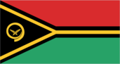
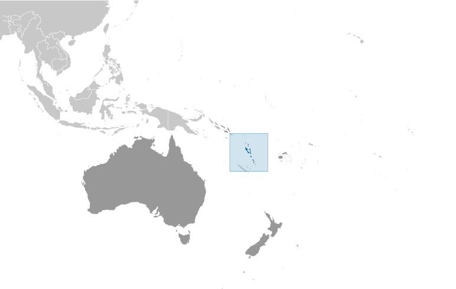
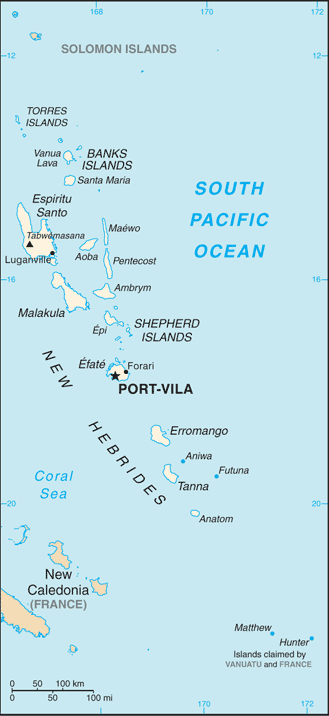

# Vanuatu

## Introduction

**_Background:_**   
Multiple waves of colonizers, each speaking a distinct language, migrated to the New Hebrides in the millennia preceding European exploration in the 18th century. This settlement pattern accounts for the complex linguistic diversity found on the archipelago to this day. The British and French, who settled the New Hebrides in the 19th century, agreed in 1906 to an Anglo-French Condominium, which administered the islands until independence in 1980, when the new name of Vanuatu was adopted.

## Geography

**_Location:_**   
Oceania, group of islands in the South Pacific Ocean, about three-quarters of the way from Hawaii to Australia

**_Geographic coordinates:_**   
16 00 S, 167 00 E

**_Map references:_**   
Oceania

**_Area:_**   
**total:** 12,189 sq km   
**land:** 12,189 sq km   
**water:** 0 sq km   
**note:** includes more than 80 islands, about 65 of which are inhabited

**_Area - comparative:_**   
slightly larger than Connecticut

**_Land boundaries:_**   
0 km

**_Coastline:_**   
2,528 km

**_Maritime claims:_**   
measured from claimed archipelagic baselines   
**territorial sea:** 12 nm   
**contiguous zone:** 24 nm   
**exclusive economic zone:** 200 nm   
**continental shelf:** 200 nm or to the edge of the continental margin

**_Climate:_**   
tropical; moderated by southeast trade winds from May to October; moderate rainfall from November to April; may be affected by cyclones from December to April

**_Terrain:_**   
mostly mountainous islands of volcanic origin; narrow coastal plains

**_Elevation extremes:_**   
**lowest point:** Pacific Ocean 0 m   
**highest point:** Tabwemasana 1,877 m

**_Natural resources:_**   
manganese, hardwood forests, fish

**_Land use:_**   
**arable land:** 1.64%   
**permanent crops:** 10.25%   
**other:** 88.11% (2011)

**_Irrigated land:_**   
NA

**_Natural hazards:_**   
tropical cyclones or typhoons (January to April); volcanic eruption on Aoba (Ambae) island began on 27 November 2005, volcanism also causes minor earthquakes; tsunamis   
**volcanism:** significant volcanic activity with multiple eruptions in recent years; Yasur (elev. 361 m), one of the world's most active volcanoes, has experienced continuous activity in recent centuries; other historically active volcanoes include, Aoba, Ambrym, Epi, Gaua, Kuwae, Lopevi, Suretamatai, and Traitor's Head

**_Environment - current issues:_**   
most of the population does not have access to a reliable supply of potable water; deforestation

**_Environment - international agreements:_**   
**party to:** Antarctic-Marine Living Resources, Biodiversity, Climate Change, Climate Change-Kyoto Protocol, Desertification, Endangered Species, Law of the Sea, Marine Dumping, Ozone Layer Protection, Ship Pollution, Tropical Timber 94   
**signed, but not ratified:** none of the selected agreements

**_Geography - note:_**   
a Y-shaped chain of four main islands and 80 smaller islands; several of the islands have active volcanoes and there are several underwater volcanoes as well

## People and Society

**_Nationality:_**   
**noun:** Ni-Vanuatu (singular and plural)   
**adjective:** Ni-Vanuatu

**_Ethnic groups:_**   
Ni-Vanuatu 97.6%, part Ni-Vanuatu 1.1%, other 1.3% (2009 est.)

**_Languages:_**   
local languages (more than 100) 63.2%, Bislama (official; creole) 33.7%, English (official) 2%, French (official) 0.6%, other 0.5% (2009 est.)

**_Religions:_**   
Protestant 70% (includes Presbyterian 27.9%, Anglican 15.1%, Seventh Day Adventist 12.5%, Assemblies of God 4.7%, Church of Christ 4.5%, Neil Thomas Ministry 3.1%, and Apostolic 2.2%), Roman Catholic 12.4%, customary beliefs 3.7% (including Jon Frum cargo cult), other 12.6%, none 1.1%, unspecified 0.2% (2009 est.)

**_Population:_**   
266,937 (July 2014 est.)

**_Age structure:_**   
**0-14 years:** 37.3% (male 50,810/female 48,753)   
**15-24 years:** 19.8% (male 26,341/female 26,620)   
**25-54 years:** 34.2% (male 44,732/female 46,545)   
**55-64 years:** 5% (male 6,751/female 6,599)   
**65 years and over:** 3.6% (male 5,020/female 4,766) (2014 est.)

**_Dependency ratios:_**   
**total dependency ratio:** 67.9 %   
**youth dependency ratio:** 61.3 %   
**elderly dependency ratio:** 6.6 %   
**potential support ratio:** 15.1 (2014 est.)

**_Median age:_**   
**total:** 21.1 years   
**male:** 20.7 years   
**female:** 21.4 years (2014 est.)

**_Population growth rate:_**   
2.01% (2014 est.)

**_Birth rate:_**   
25.69 births/1,000 population (2014 est.)

**_Death rate:_**   
4.14 deaths/1,000 population (2014 est.)

**_Net migration rate:_**   
-1.5 migrant(s)/1,000 population (2014 est.)

**_Urbanization:_**   
**urban population:** 24.9% of total population (2011)   
**rate of urbanization:** 3.64% annual rate of change (2010-15 est.)

**_Major urban areas - population:_**   
PORT-VILA (capital) 47,000 (2011)

**_Sex ratio:_**   
**at birth:** 1.05 male(s)/female   
**0-14 years:** 1.04 male(s)/female   
**15-24 years:** 0.99 male(s)/female   
**25-54 years:** 0.96 male(s)/female   
**55-64 years:** 1 male(s)/female   
**65 years and over:** 1.07 male(s)/female   
**total population:** 1.01 male(s)/female (2014 est.)

**_Maternal mortality rate:_**   
110 deaths/100,000 live births (2010)

**_Infant mortality rate:_**   
**total:** 16.41 deaths/1,000 live births   
**male:** 17.53 deaths/1,000 live births   
**female:** 15.23 deaths/1,000 live births (2014 est.)

**_Life expectancy at birth:_**   
**total population:** 72.72 years   
**male:** 71.16 years   
**female:** 74.36 years (2014 est.)

**_Total fertility rate:_**   
3.36 children born/woman (2014 est.)

**_Contraceptive prevalence rate:_**   
38.4% (2007)

**_Health expenditures:_**   
4.1% of GDP (2011)

**_Physicians density:_**   
0.12 physicians/1,000 population (2008)

**_Hospital bed density:_**   
1.7 beds/1,000 population (2008)

**_Drinking water source:_**   
**improved:** urban: 97.8% of population; rural: 88.3% of population; total: 90.7% of population   
**unimproved:** urban: 2.2% of population; rural: 11.7% of population; total: 9.3% of population (2012 est.)

**_Sanitation facility access:_**   
**improved:** urban: 65.1% of population; rural: 55.4% of population; total: 57.9% of population   
**unimproved:** urban: 34.9% of population; rural: 44.6% of population; total: 42.1% of population (2012 est.)

**_HIV/AIDS - adult prevalence rate:_**   
NA

**_HIV/AIDS - people living with HIV/AIDS:_**   
NA

**_HIV/AIDS - deaths:_**   
NA

**_Obesity - adult prevalence rate:_**   
27.5% (2008)

**_Children under the age of 5 years underweight:_**   
11.7% (2007)

**_Education expenditures:_**   
5% of GDP (2009)

**_Literacy:_**   
**definition:** age 15 and over can read and write   
**total population:** 83.2%   
**male:** NA 84.9%   
**female:** NA 81.6% (2011 est.)

**_School life expectancy (primary to tertiary education):_**   
**total:** 11 years   
**male:** 11 years   
**female:** 10 years (2004)

## Government

**_Country name:_**   
**conventional long form:** Republic of Vanuatu   
**conventional short form:** Vanuatu   
**local long form:** Ripablik blong Vanuatu   
**local short form:** Vanuatu   
**former:** New Hebrides

**_Government type:_**   
parliamentary republic

**_Capital:_**   
**name:** Port-Vila (on Efate)   
**geographic coordinates:** 17 44 S, 168 19 E   
**time difference:** UTC+11 (16 hours ahead of Washington, DC, during Standard Time)

**_Administrative divisions:_**   
6 provinces; Malampa, Penama, Sanma, Shefa, Tafea, Torba

**_Independence:_**   
30 July 1980 (from France and the UK)

**_National holiday:_**   
Independence Day, 30 July (1980)

**_Constitution:_**   
effective 30 July 1980; amended 1981, 1983, 1988 (2006)

**_Legal system:_**   
mixed legal system of English common law, French law, and customary law

**_International law organization participation:_**   
has not submitted an ICJ jurisdiction declaration; accepts ICCt jurisdiction

**_Suffrage:_**   
18 years of age; universal

**_Executive branch:_**   
**chief of state:** President Iolu Johnson ABBIL (since 3 September 2009)   
**head of government:** Prime Minister Joe NATUMAN (since 14 May 2014)   
**cabinet:** Council of Ministers appointed by the prime minister, responsible to parliament   
**elections:** president elected for a five-year term by an electoral college consisting of parliament and the presidents of the regional councils; election for president last held on 2 September 2009 (next to be held in 2014); following legislative elections, the leader of the majority party or majority coalition usually elected prime minister by parliament from among its members; election for prime minister last held on 23 March 2013 (next to be held following general elections in 2016)   
**election results:** Iolu Johnson ABBIL elected president, with 41 votes out of 58, on the third ballot on 2 September 2009; Joe NATUMAN elected prime minister following a no confidence vote against the government of Moana CARCASSES Kalosil on 15 May 2014

**_Legislative branch:_**   
unicameral Parliament (52 seats; members elected by popular vote to serve four-year terms)   
**elections:** last held on 30 October 2012 (next to be held in 2016)   
**election results:** percent of vote by party - NA; seats by party - VP 8, PPP 6, UMP 5, GJP 4, NUP 4, IG 3, GC 3, NAG 3, RMC 3, MPP 2, NIPDP 2, PSP 1, VLDP 1, VNP 1, VPDP 1, VRP 1, and independent 4; note - political party associations are fluid   
**note:** the National Council of Chiefs advises on matters of culture and language

**_Judicial branch:_**   
**highest court(s):** Supreme Court (consists of a chief justice and 3 judges); note - appeals from the Supreme Court are considered by the Court of Appeal, constituted by 2 or more judges of the Supreme Court sitting together   
**judge selection and term of office:** Supreme Court chief justice appointed by the president after consultation with the prime minister and the leader of the opposition; other judges are appointed by the president on the advice of the Judicial Service Commission, a 4-member advisory body; judges appointed until age of retirement   
**subordinate courts:** magistrates' courts; island courts

**_Political parties and leaders:_**   
Greens Confederation or GC [Moana CARCASSES Kalosil]   
Iauko Group or IG [NA]   
Land and Justice Party (Graon mo Jastis Pati) or GJP [Ralph REGENVANU]   
Melanesian Progressive Party or MPP [Barak SOPE]   
Nagriamel movement or NAG [NA]   
Natatok Indigenous People's Democratic Party or (NATATOK) or NIPDP [Alfred Roland CARLOT]   
National United Party or NUP [Ham LINI]   
People's Progressive Party or PPP [Sato KILMAN]   
People's Service Party or PSP [Don KEN]   
Reunification of Movement for Change or RMC [Charlot SALWAI]   
Union of Moderate Parties or UMP [Serge VOHOR]   
Vanua'aku Pati (Our Land Party) or VP [Edward NATAPEI]   
Vanuatu Democratic Party [Maxime Carlot KORMAN]   
Vanuatu Liberal Democratic Party or VLDP [Tapangararua WILLIE]   
Vanuatu National Party or VNP [Issac HAMARILIU]   
Vanuatu Progressive Development Party or VPDP [Robert Bohn SIKOL]   
Vanuatu Republican Party or VRP [Marcellino PIPITE]

**_Political pressure groups and leaders:_**   
NA

**_International organization participation:_**   
ACP, ADB, AOSIS, C, FAO, G-77, IBRD, ICAO, ICRM, IDA, IFC, IFRCS, ILO, IMF, IMO, IMSO, IOC, IOM, ITU, ITUC (NGOs), MIGA, NAM, OAS (observer), OIF, OPCW, PIF, Sparteca, SPC, UN, UNCTAD, UNESCO, UNIDO, UNWTO, UPU, WCO, WFTU (NGOs), WHO, WIPO, WMO, WTO

**_Diplomatic representation in the US:_**   
Vanuatu does not have an embassy in the US; it does, however, have a Permanent Mission to the UN

**_Diplomatic representation from the US:_**   
the US does not have an embassy in Vanuatu; the US ambassador to Papua New Guinea, currently Ambassador Walter E. North, is accredited to Vanuatu

**_Flag description:_**   
two equal horizontal bands of red (top) and green with a black isosceles triangle (based on the hoist side) all separated by a black-edged yellow stripe in the shape of a horizontal Y (the two points of the Y face the hoist side and enclose the triangle); centered in the triangle is a boar's tusk encircling two crossed namele fern fronds, all in yellow; red represents the blood of boars and men, green the richness of the islands, and black the ni-Vanuatu people; the yellow Y-shape - which reflects the pattern of the islands in the Pacific Ocean - symbolizes the light of the Gospel spreading through the islands; the boar's tusk is a symbol of prosperity frequently worn as a pendant on the islands; the fern fronds represent peace

**_National symbol(s):_**   
boar's tusk

**_National anthem:_**   
**name:** "Yumi, Yumi, Yumi" (We, We, We)   
**lyrics/music:** Francois Vincent AYSSAV   
**note:** adopted 1980, the anthem is written in Bislama, a Creole language that mixes Pidgin English and French

## Economy

**_Economy - overview:_**   
This South Pacific island economy is based primarily on small-scale agriculture, which provides a living for about two-thirds of the population. Fishing, offshore financial services, and tourism, with nearly 197,000 visitors in 2008, are other mainstays of the economy. Mineral deposits are negligible; the country has no known petroleum deposits. A small light industry sector caters to the local market. Tax revenues come mainly from import duties. Economic development is hindered by dependence on relatively few commodity exports, vulnerability to natural disasters, and long distances from main markets and between constituent islands. In response to foreign concerns, the government has promised to tighten regulation of its offshore financial center. In mid-2002, the government stepped up efforts to boost tourism through improved air connections, resort development, and cruise ship facilities. Agriculture, especially livestock farming, is a second target for growth. Australia and New Zealand are the main suppliers of tourists and foreign aid.

**_GDP (purchasing power parity):_**   
$1.27 billion (2013 est.)   
$1.23 billion (2012 est.)   
$1.203 billion (2011 est.)   
**note:** data are in 2013 US dollars

**_GDP (official exchange rate):_**   
$828 million (2013 est.)

**_GDP - real growth rate:_**   
3.3% (2013 est.)   
2.3% (2012 est.)   
1.4% (2011 est.)

**_GDP - per capita (PPP):_**   
$4,800 (2013 est.)   
$4,900 (2012 est.)   
$4,900 (2011 est.)   
**note:** data are in 2013 US dollars

**_GDP - composition, by end use:_**   
**household consumption:** 60.8%   
**government consumption:** 17.8%   
**investment in fixed capital:** 27.3%   
**investment in inventories:** 0%   
**exports of goods and services:** 41.5%   
**imports of goods and services:** -47.3%; (2013 est.)

**_GDP - composition, by sector of origin:_**   
**agriculture:** 22.4%   
**industry:** 9.7%   
**services:** 67.9% (2013 est.)

**_Agriculture - products:_**   
copra, coconuts, cocoa, coffee, taro, yams, fruits, vegetables; beef; fish

**_Industries:_**   
food and fish freezing, wood processing, meat canning

**_Industrial production growth rate:_**   
4.8% (2013 est.)

**_Labor force:_**   
115,900 (2007)

**_Labor force - by occupation:_**   
**agriculture:** 65%   
**industry:** 5%   
**services:** 30% (2000 est.)

**_Unemployment rate:_**   
1.7% (1999)

**_Population below poverty line:_**   
NA%

**_Household income or consumption by percentage share:_**   
**lowest 10%:** NA%   
**highest 10%:** NA%

**_Budget:_**   
**revenues:** $203.5 million   
**expenditures:** $201.3 million (2013 est.)

**_Taxes and other revenues:_**   
24.6% of GDP (2013 est.)

**_Budget surplus (+) or deficit (-):_**   
0.3% of GDP (2013 est.)

**_Fiscal year:_**   
calendar year

**_Inflation rate (consumer prices):_**   
1.9% (2013 est.)   
1.4% (2012 est.)

**_Central bank discount rate:_**   
20% (31 December 2010 est.)   
6% (31 December 2009 est.)

**_Commercial bank prime lending rate:_**   
6.7% (31 December 2013 est.)   
6% (31 December 2012 est.)

**_Stock of narrow money:_**   
$270.7 million (31 December 2013 est.)   
$264.1 million (31 December 2012 est.)

**_Stock of broad money:_**   
$644 million (31 December 2013 est.)   
$643.3 million (31 December 2012 est.)

**_Stock of domestic credit:_**   
$560.8 million (31 December 2013 est.)   
$549.4 million (31 December 2012 est.)

**_Market value of publicly traded shares:_**   
$NA

**_Current account balance:_**   
-$118 million (2013 est.)   
-$128.6 million (2012 est.)

**_Exports:_**   
$43.1 million (2013 est.)   
$57.5 million (2012 est.)

**_Exports - commodities:_**   
copra, beef, cocoa, timber, kava, coffee

**_Exports - partners:_**   
Thailand 41.9%, Cote dIvoire 30.5%, Japan 14.7% (2012)

**_Imports:_**   
$319.4 million (2013 est.)   
$322.6 million (2012 est.)

**_Imports - commodities:_**   
machinery and equipment, foodstuffs, fuels

**_Imports - partners:_**   
China 20.2%, Singapore 18.8%, US 15%, Japan 11.6%, Australia 10.4%, Fiji 5.2%, NZ 4.8% (2012)

**_Reserves of foreign exchange and gold:_**   
$174.2 million (31 December 2013 est.)   
$187.3 million (31 December 2012 est.)

**_Debt - external:_**   
$307.7 million (31 December 2011 est.)   
$258.9 million (31 December 2010 est.)

**_Stock of direct foreign investment - at home:_**   
$620.1 million (31 December 2013 est.)   
$565.1 million (31 December 2012 est.)

**_Stock of direct foreign investment - abroad:_**   
$21.3 million (31 December 2013 est.)   
$22.3 million (31 December 2012 est.)

**_Exchange rates:_**   
vatu (VUV) per US dollar -   
92.38 (2013 est.)   
92.64 (2012 est.)   
96.91 (2010 est.)

## Energy

**_Electricity - production:_**   
55 million kWh (2010 est.)

**_Electricity - consumption:_**   
51.15 million kWh (2010 est.)

**_Electricity - exports:_**   
0 kWh (2012 est.)

**_Electricity - imports:_**   
0 kWh (2012 est.)

**_Electricity - installed generating capacity:_**   
28,000 kW (2010 est.)

**_Electricity - from fossil fuels:_**   
89.3% of total installed capacity (2010 est.)

**_Electricity - from nuclear fuels:_**   
0% of total installed capacity (2010 est.)

**_Electricity - from hydroelectric plants:_**   
0% of total installed capacity (2010 est.)

**_Electricity - from other renewable sources:_**   
10.7% of total installed capacity (2010 est.)

**_Crude oil - production:_**   
0 bbl/day (2012 est.)

**_Crude oil - exports:_**   
0 bbl/day (2010 est.)

**_Crude oil - imports:_**   
0 bbl/day (2010 est.)

**_Crude oil - proved reserves:_**   
0 bbl (1 January 2013 est.)

**_Refined petroleum products - production:_**   
0 bbl/day (2010 est.)

**_Refined petroleum products - consumption:_**   
1,170 bbl/day (2011 est.)

**_Refined petroleum products - exports:_**   
0 bbl/day (2010 est.)

**_Refined petroleum products - imports:_**   
838 bbl/day (2010 est.)

**_Natural gas - production:_**   
0 cu m (2011 est.)

**_Natural gas - consumption:_**   
0 cu m (2010 est.)

**_Natural gas - exports:_**   
0 cu m (2011 est.)

**_Natural gas - imports:_**   
0 cu m (2011 est.)

**_Natural gas - proved reserves:_**   
0 cu m (1 January 2013 est.)

**_Carbon dioxide emissions from consumption of energy:_**   
149,000 Mt (2011 est.)

## Communications

**_Telephones - main lines in use:_**   
5,800 (2012)

**_Telephones - mobile cellular:_**   
137,000 (2012)

**_Telephone system:_**   
**international:** country code - 678; satellite earth station - 1 Intelsat (Pacific Ocean)

**_Broadcast media:_**   
1 state-owned TV station; multi-channel pay TV is available; state-owned Radio Vanuatu operates 2 radio stations; 2 privately owned radio broadcasters; programming from multiple international broadcasters is available (2008)

**_Internet country code:_**   
.vu

**_Internet hosts:_**   
5,655 (2012)

**_Internet users:_**   
17,000 (2009)

## Transportation

**_Airports:_**   
31 (2013)

**_Airports - with paved runways:_**   
**total:** 3   
**2,438 to 3,047 m:** 1   
**1,524 to 2,437 m:** 1   
**914 to 1,523 m:** 1 (2013)

**_Airports - with unpaved runways:_**   
**total:** 28   
**914 to 1,523 m:** 7   
**under 914 m:** 21 (2013)

**_Roadways:_**   
**total:** 1,070 km   
**paved:** 256 km   
**unpaved:** 814 km (2000)

**_Merchant marine:_**   
**total:** 77   
**by type:** bulk carrier 38, cargo 8, chemical tanker 2, container 1, liquefied gas 2, passenger 1, refrigerated cargo 24, vehicle carrier 1   
**foreign-owned:** 72 (Belgium 1, Canada 5, China 1, Greece 3, Japan 39, Norway 1, Poland 9, Russia 7, Singapore 2, Taiwan 1, UAE 1, US 2) (2010)

**_Ports and terminals:_**   
**major seaport(s):** Forari Bay, Luganville (Santo, Espiritu Santo), Port-Vila

## Military

**_Military branches:_**   
no regular military forces; Vanuatu Police Force (VPF), Vanuatu Mobile Force (VMF; includes Police Maritime Wing (PMW)) (2013)

**_Manpower available for military service:_**   
**males age 16-49:** 62,216 (2010 est.)

**_Manpower fit for military service:_**   
**males age 16-49:** 43,331   
**females age 16-49:** 44,927 (2010 est.)

**_Manpower reaching militarily significant age annually:_**   
**male:** 2,323   
**female:** 2,230 (2010 est.)

## Transnational Issues

**_Disputes - international:_**   
Matthew and Hunter Islands east of New Caledonia claimed by Vanuatu and France

............................................................   
_Page last updated on June 20, 2014_
