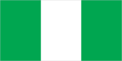
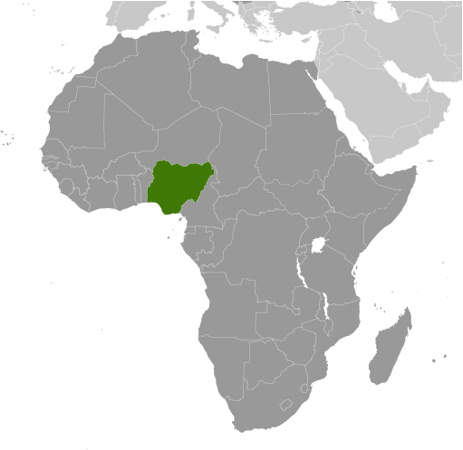
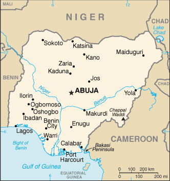

# Nigeria

## Introduction

**_Background:_**   
British influence and control over what would become Nigeria and Africa's most populous country grew through the 19th century. A series of constitutions after World War II granted Nigeria greater autonomy; independence came in 1960. Following nearly 16 years of military rule, a new constitution was adopted in 1999, and a peaceful transition to civilian government was completed. The government continues to face the daunting task of reforming a petroleum-based economy, whose revenues have been squandered through corruption and mismanagement, and institutionalizing democracy. In addition, Nigeria continues to experience longstanding ethnic and religious tensions. Although both the 2003 and 2007 presidential elections were marred by significant irregularities and violence, Nigeria is currently experiencing its longest period of civilian rule since independence. The general elections of April 2007 marked the first civilian-to-civilian transfer of power in the country's history and the elections of 2011 were generally regarded as credible. In January 2014, Nigeria assumed a nonpermanent seat on the UN Security Council for the 2014-15 term.

## Geography

**_Location:_**   
Western Africa, bordering the Gulf of Guinea, between Benin and Cameroon

**_Geographic coordinates:_**   
10 00 N, 8 00 E

**_Map references:_**   
Africa

**_Area:_**   
**total:** 923,768 sq km   
**land:** 910,768 sq km   
**water:** 13,000 sq km

**_Area - comparative:_**   
slightly more than twice the size of California

**_Land boundaries:_**   
**total:** 4,047 km   
**border countries:** Benin 773 km, Cameroon 1,690 km, Chad 87 km, Niger 1,497 km

**_Coastline:_**   
853 km

**_Maritime claims:_**   
**territorial sea:** 12 nm   
**exclusive economic zone:** 200 nm   
**continental shelf:** 200 m depth or to the depth of exploitation

**_Climate:_**   
varies; equatorial in south, tropical in center, arid in north

**_Terrain:_**   
southern lowlands merge into central hills and plateaus; mountains in southeast, plains in north

**_Elevation extremes:_**   
**lowest point:** Atlantic Ocean 0 m   
**highest point:** Chappal Waddi 2,419 m

**_Natural resources:_**   
natural gas, petroleum, tin, iron ore, coal, limestone, niobium, lead, zinc, arable land

**_Land use:_**   
**arable land:** 38.97%   
**permanent crops:** 3.46%   
**other:** 57.57% (2011)

**_Irrigated land:_**   
2,932 sq km (2004)

**_Total renewable water resources:_**   
286.2 cu km (2011)

**_Freshwater withdrawal (domestic/industrial/agricultural):_**   
**total:** 13.11 cu km/yr (31%/15%/54%)   
**per capita:** 89.21 cu m/yr (2005)

**_Natural hazards:_**   
periodic droughts; flooding

**_Environment - current issues:_**   
soil degradation; rapid deforestation; urban air and water pollution; desertification; oil pollution - water, air, and soil; has suffered serious damage from oil spills; loss of arable land; rapid urbanization

**_Environment - international agreements:_**   
**party to:** Biodiversity, Climate Change, Climate Change-Kyoto Protocol, Desertification, Endangered Species, Hazardous Wastes, Law of the Sea, Marine Dumping, Marine Life Conservation, Ozone Layer Protection, Ship Pollution, Wetlands   
**signed, but not ratified:** none of the selected agreements

**_Geography - note:_**   
the Niger enters the country in the northwest and flows southward through tropical rain forests and swamps to its delta in the Gulf of Guinea

## People and Society

**_Nationality:_**   
**noun:** Nigerian(s)   
**adjective:** Nigerian

**_Ethnic groups:_**   
Nigeria, Africa's most populous country, is composed of more than 250 ethnic groups; the following are the most populous and politically influential: Hausa and Fulani 29%, Yoruba 21%, Igbo (Ibo) 18%, Ijaw 10%, Kanuri 4%, Ibibio 3.5%, Tiv 2.5%

**_Languages:_**   
English (official), Hausa, Yoruba, Igbo (Ibo), Fulani, over 500 additional indigenous languages

**_Religions:_**   
Muslim 50%, Christian 40%, indigenous beliefs 10%

**_Population:_**   
177,155,754   
**note:** estimates for this country explicitly take into account the effects of excess mortality due to AIDS; this can result in lower life expectancy, higher infant mortality, higher death rates, lower population growth rates, and changes in the distribution of population by age and sex than would otherwise be expected (July 2014 est.)

**_Age structure:_**   
**0-14 years:** 43.2% (male 39,151,304/female 37,353,737)   
**15-24 years:** 19.3% (male 17,486,117/female 16,732,533)   
**25-54 years:** 30.5% (male 27,697,644/female 26,285,816)   
**55-64 years:** 3.9% (male 3,393,631/female 3,571,301)   
**65 years and over:** 3% (male 2,621,845/female 2,861,826) (2014 est.)

**_Dependency ratios:_**   
**total dependency ratio:** 89.2 %   
**youth dependency ratio:** 84 %   
**elderly dependency ratio:** 5.2 %   
**potential support ratio:** 19.3 (2014 est.)

**_Median age:_**   
**total:** 18.2 years   
**male:** 18.1 years   
**female:** 18.3 years (2014 est.)

**_Population growth rate:_**   
2.47% (2014 est.)

**_Birth rate:_**   
38.03 births/1,000 population (2014 est.)

**_Death rate:_**   
13.16 deaths/1,000 population (2014 est.)

**_Net migration rate:_**   
-0.22 migrant(s)/1,000 population (2014 est.)

**_Urbanization:_**   
**urban population:** 49.6% of total population (2011)   
**rate of urbanization:** 3.75% annual rate of change (2010-15 est.)

**_Major urban areas - population:_**   
Lagos 11.223 million; Kano 3.375 million; Ibadan 2.949 million; ABUJA (capital) 2.153 million; Port Harcourt 1.894 million; Kaduna 1.524 million (2011)

**_Sex ratio:_**   
**at birth:** 1.06 male(s)/female   
**0-14 years:** 1.05 male(s)/female   
**15-24 years:** 1.05 male(s)/female   
**25-54 years:** 1.05 male(s)/female   
**55-64 years:** 1.04 male(s)/female   
**65 years and over:** 0.85 male(s)/female   
**total population:** 1.01 male(s)/female (2014 est.)

**_Mother's mean age at first birth:_**   
20.3   
**note:** median age at first birth among women 25-29 (2013 est.)

**_Maternal mortality rate:_**   
630 deaths/100,000 live births (2010)

**_Infant mortality rate:_**   
**total:** 74.09 deaths/1,000 live births   
**male:** 79.02 deaths/1,000 live births   
**female:** 68.87 deaths/1,000 live births (2014 est.)

**_Life expectancy at birth:_**   
**total population:** 52.62 years   
**male:** 51.63 years   
**female:** 53.66 years (2014 est.)

**_Total fertility rate:_**   
5.25 children born/woman (2014 est.)

**_Contraceptive prevalence rate:_**   
14.1% (2011)

**_Health expenditures:_**   
5.3% of GDP (2011)

**_Physicians density:_**   
0.4 physicians/1,000 population (2008)

**_Hospital bed density:_**   
0.53 beds/1,000 population (2004)

**_Drinking water source:_**   
**improved:** urban: 78.8% of population; rural: 49.1% of population; total: 64% of population   
**unimproved:** urban: 21.2% of population; rural: 50.9% of population; total: 36% of population (2012 est.)

**_Sanitation facility access:_**   
**improved:** urban: 30.8% of population; rural: 24.7% of population; total: 27.8% of population   
**unimproved:** urban: 69.2% of population; rural: 75.3% of population; total: 72.2% of population (2012 est.)

**_HIV/AIDS - adult prevalence rate:_**   
3.1% (2012 est.)

**_HIV/AIDS - people living with HIV/AIDS:_**   
3,426,600 (2012 est.)

**_HIV/AIDS - deaths:_**   
239,700 (2012 est.)

**_Major infectious diseases:_**   
**degree of risk:** very high   
**food or waterborne diseases:** bacterial and protozoal diarrhea, hepatitis A and E, and typhoid fever   
**vectorborne diseases:** malaria, dengue fever, and yellow fever   
**water contact diseases:** leptospirosis and schistosomiasis   
**respiratory disease:** meningococcal meningitis   
**aerosolized dust or soil contact disease:** one of the most highly endemic areas for Lassa fever   
**animal contact disease:** rabies   
**note:** highly pathogenic H5N1 avian influenza has been identified in this country; it poses a negligible risk with extremely rare cases possible among US citizens who have close contact with birds (2013)

**_Obesity - adult prevalence rate:_**   
6.5% (2008)

**_Children under the age of 5 years underweight:_**   
24.4% (2011)

**_Education expenditures:_**   
NA

**_Literacy:_**   
**definition:** age 15 and over can read and write   
**total population:** 61.3%   
**male:** 72.1%   
**female:** 50.4% (2010 est.)

**_School life expectancy (primary to tertiary education):_**   
**total:** 9 years   
**male:** 10 years   
**female:** 8 years (2005)

**_Child labor - children ages 5-14:_**   
**total number:** 11,396,823   
**percentage:** 29 % (2007 est.)

## Government

**_Country name:_**   
**conventional long form:** Federal Republic of Nigeria   
**conventional short form:** Nigeria

**_Government type:_**   
federal republic

**_Capital:_**   
**name:** Abuja   
**geographic coordinates:** 9 05 N, 7 32 E   
**time difference:** UTC+1 (6 hours ahead of Washington, DC, during Standard Time)

**_Administrative divisions:_**   
36 states and 1 territory\*; Abia, Adamawa, Akwa Ibom, Anambra, Bauchi, Bayelsa, Benue, Borno, Cross River, Delta, Ebonyi, Edo, Ekiti, Enugu, Federal Capital Territory\*, Gombe, Imo, Jigawa, Kaduna, Kano, Katsina, Kebbi, Kogi, Kwara, Lagos, Nasarawa, Niger, Ogun, Ondo, Osun, Oyo, Plateau, Rivers, Sokoto, Taraba, Yobe, Zamfara

**_Independence:_**   
1 October 1960 (from the UK)

**_National holiday:_**   
Independence Day (National Day), 1 October (1960)

**_Constitution:_**   
several previous; latest adopted 5 May 1999, effective 29 May 1999; amended 2010 (2010)

**_Legal system:_**   
mixed legal system of English common law, Islamic law (in 12 northern states), and traditional law

**_International law organization participation:_**   
accepts compulsory ICJ jurisdiction with reservations; accepts ICCt jurisdiction

**_Suffrage:_**   
18 years of age; universal

**_Executive branch:_**   
**chief of state:** President Goodluck JONATHAN (since 5 May 2010, acting since 9 February 2010); Vice President Mohammed Namadi SAMBO (since 19 May 2010); note - the president is both chief of state and head of government; JONATHAN assumed the presidency on 5 May 2010 following the death of President YAR'ADUA; JONATHAN was elected president on 16 April 2011   
**head of government:** President Goodluck JONATHAN (since 5 May 2010, acting since 9 February 2010); Vice President Mohammed Namadi SAMBO (since 19 May 2010)   
**cabinet:** Federal Executive Council   
**elections:** president elected by popular vote for a four-year term (eligible for a second term); election last held on 16 April 2011 (next to be held in February 2015)   
**election results:** Goodluck JONATHAN elected president; percent of vote - Goodluck JONATHAN 58.9%, Muhammadu BUHARI 32.0%, Nuhu RIBADU 5.4%, Ibrahim SHEKARAU 2.4%, other 1.3%

**_Legislative branch:_**   
bicameral National Assembly consists of the Senate (109 seats, 3 from each state plus 1 from Abuja; members elected by popular vote to serve four-year terms) and House of Representatives (360 seats; members elected by popular vote to serve four-year terms)   
**elections:** Senate - last held on 9 and 26 April 2011 (next to be held in February 2015); House of Representatives - last held on 9 and 26 April 2011 (next to be held in February 2015)   
**election results:** Senate - percent of vote by party - NA; seats by party - PDP 73, ACN 17, ANPP 7, CPC 6, LP 4, other 2; House of Representatives - percent of vote by party - NA; seats by party - PDP 205, ACN 69, CPC 36, ANPP 28, LP 9, APGA 6, ACC 5, other 2; note - due to logistical problems elections in a number of constituencies were held on 26 April 2011

**_Judicial branch:_**   
**highest court(s):** Supreme Court (consists of the chief justice and 15 justices)   
**judge selection and term of office:** judges appointed by the president on the recommendation of the National Judicial Council, a 23-member independent body of federal and state judicial officials; judge appointments confirmed by the Senate; judges serve until age 65   
**subordinate courts:** Court of Appeal; Federal High Court; High Court of the Federal Capital Territory; Sharia Court of Appeal of the Federal Capital Territory; Customary Court of Appeal of the Federal Capital Territory; state court system similar in structure to federal system

**_Political parties and leaders:_**   
Accord Party or ACC [Mohammad Lawal MALADO]   
Action Congress of Nigeria or ACN [Adebisi Bamidele AKANDE]   
All Nigeria Peoples Party or ANPP [Ogbonnaya C. ONU]   
All Progressives Congress [Adebisi Bamidele AKANDE, acting]   
All Progressives Grand Alliance or APGA [Victor C. UMEH]   
Congress for Progressive Change or CPC [Tony MOMOH]   
Democratic Peoples Party or DPP [Biodun OGUNBIYI]   
Labor Party [Chief Dan NWANYANWU]   
Peoples Democratic Party or PDP [Adamu MU'AZU]

**_Political pressure groups and leaders:_**   
Academic Staff Union for Universities or ASUU   
Campaign for Democracy or CD   
Civil Liberties Organization or CLO   
Committee for the Defense of Human Rights or CDHR   
Constitutional Right Project or CRP   
Human Right Africa   
National Association of Democratic Lawyers or NADL   
National Association of Nigerian Students or NANS   
Nigerian Bar Association or NBA   
Nigerian Labor Congress or NLC   
Nigerian Medical Association or NMA   
the press   
Universal Defenders of Democracy or UDD

**_International organization participation:_**   
ACP, AfDB, AU, C, CD, D-8, ECOWAS, EITI (compliant country), FAO, G-15, G-24, G-77, IAEA, IBRD, ICAO, ICC (national committees), ICRM, IDA, IDB, IFAD, IFC, IFRCS, IHO, ILO, IMF, IMO, IMSO, Interpol, IOC, IOM, IPU, ISO, ITSO, ITU, ITUC (NGOs), MIGA, MINURSO, MINUSMA, MONUSCO, NAM, OAS (observer), OIC, OPCW, OPEC, PCA, UN, UN Security Council (temporary), UNAMID, UNCTAD, UNESCO, UNHCR, UNIDO, UNIFIL, UNISFA, UNITAR, UNMIL, UNMISS, UNOCI, UNWTO, UPU, WCO, WFTU (NGOs), WHO, WIPO, WMO, WTO

**_Diplomatic representation in the US:_**   
**chief of mission:** Ambassador Adebowale Ibidapo ADEFUYE (since 26 March 2010)   
**chancery:** 3519 International Court NW, Washington, DC 20008   
**telephone:** [1] (202) 986-8400   
**FAX:** [1] (202) 362-6541   
**consulate(s) general:** Atlanta, New York

**_Diplomatic representation from the US:_**   
**chief of mission:** Ambassador James F. ENTWISTLE (since 28 October 2013)   
**embassy:** Plot 1075 Diplomatic Drive, Central District Area, Abuja   
**mailing address:** P. O. Box 5760, Garki, Abuja   
**telephone:** [234] (9) 461-4000   
**FAX:** [234] (9) 461-4171

**_Flag description:_**   
three equal vertical bands of green (hoist side), white, and green; the color green represents the forests and abundant natural wealth of the country, white stands for peace and unity

**_National symbol(s):_**   
eagle

**_National anthem:_**   
**name:** "Arise Oh Compatriots, Nigeria's Call Obey"   
**lyrics/music:** John A. ILECHUKWU, Eme Etim AKPAN, B. A. OGUNNAIKE, Sotu OMOIGUI and P. O. ADERIBIGBE/Benedict Elide ODIASE   
**note:** adopted 1978; the lyrics are a mixture of five of the top entries in a national contest

## Economy

**_Economy - overview:_**   
Following an April 2014 statistical "rebasing" exercise, Nigeria has emerged as Africa's largest economy, with 2013 GDP estimated at US$ 502 billion. Oil has been a dominant source of government revenues since the 1970s. Regulatory constraints and security risks have limited new investment in oil and natural gas, and Nigeria's oil production contracted in 2012 and 2013. Nevertheless, the Nigerian economy has continued to grow at a rapid 6-8% per annum (pre-rebasing), driven by growth in agriculture, telecommunications, and services, and the medium-term outlook for Nigeria is good, assuming oil output stabilizes and oil prices remain strong. Fiscal authorities pursued countercyclical policies in 2011-2013, significantly reducing the budget deficit. Monetary policy has also been responsive and effective. Following the 2008-9 global financial crises, the banking sector was effectively recapitalized and regulation enhanced. Despite its strong fundamentals, oil-rich Nigeria has been hobbled by inadequate power supply, lack of infrastructure, delays in the passage of legislative reforms, an inefficient property registration system, restrictive trade policies, an inconsistent regulatory environment, a slow and ineffective judicial system, unreliable dispute resolution mechanisms, insecurity, and pervasive corruption. Economic diversification and strong growth have not translated into a significant decline in poverty levels - over 62% of Nigeria's 170 million people live in extreme poverty. President JONATHAN has established an economic team that includes experienced and reputable members and has announced plans to increase transparency, continue to diversify production, and further improve fiscal management. The government is working to develop stronger public-private partnerships for roads, agriculture, and power.

**_GDP (purchasing power parity):_**   
$478.5 billion (2013 est.)   
$450.4 billion (2012 est.)   
$422.6 billion (2011 est.)   
**note:** data are in 2013 US dollars

**_GDP (official exchange rate):_**   
$502 billion (2013 est.)

**_GDP - real growth rate:_**   
6.2% (2013 est.)   
6.6% (2012 est.)   
7.4% (2011 est.)

**_GDP - per capita (PPP):_**   
$2,800 (2013 est.)   
$2,700 (2012 est.)   
$2,600 (2011 est.)   
**note:** data are in 2013 US dollars

**_Gross national saving:_**   
15.5% of GDP (2013 est.)   
15.9% of GDP (2012 est.)   
15.4% of GDP (2011 est.)

**_GDP - composition, by end use:_**   
**household consumption:** 50.3%   
**government consumption:** 12.8%   
**investment in fixed capital:** 9.8%   
**investment in inventories:** 0%   
**exports of goods and services:** 49.9%   
**imports of goods and services:** -22.8%; (2013 est.)

**_GDP - composition, by sector of origin:_**   
**agriculture:** 30.9%   
**industry:** 43%   
**services:** 26% (2012 est.)

**_Agriculture - products:_**   
cocoa, peanuts, cotton, palm oil, corn, rice, sorghum, millet, cassava (manioc, tapioca), yams, rubber; cattle, sheep, goats, pigs; timber; fish

**_Industries:_**   
crude oil, coal, tin, columbite; rubber products, wood; hides and skins, textiles, cement and other construction materials, food products, footwear, chemicals, fertilizer, printing, ceramics, steel

**_Industrial production growth rate:_**   
0.9% (2013 est.)

**_Labor force:_**   
51.53 million (2011 est.)

**_Labor force - by occupation:_**   
**agriculture:** 70%   
**industry:** 10%   
**services:** 20% (1999 est.)

**_Unemployment rate:_**   
23.9% (2011 est.)   
4.9% (2007 est.)

**_Population below poverty line:_**   
70% (2010 est.)

**_Household income or consumption by percentage share:_**   
**lowest 10%:** 1.8%   
**highest 10%:** 38.2% (2010 est.)

**_Distribution of family income - Gini index:_**   
43.7 (2003)   
50.6 (1997)

**_Budget:_**   
**revenues:** $23.85 billion   
**expenditures:** $31.51 billion (2013 est.)

**_Taxes and other revenues:_**   
4.8% of GDP (2013 est.)

**_Budget surplus (+) or deficit (-):_**   
-1.5% of GDP (2013 est.)

**_Public debt:_**   
19.3% of GDP (2013 est.)   
17.9% of GDP (2012 est.)

**_Fiscal year:_**   
calendar year

**_Inflation rate (consumer prices):_**   
8.7% (2013 est.)   
12.2% (2012 est.)

**_Central bank discount rate:_**   
4.25% (31 December 2010 est.)   
6% (31 December 2009 est.)

**_Commercial bank prime lending rate:_**   
15.5% (31 December 2013 est.)   
16.79% (31 December 2012 est.)

**_Stock of narrow money:_**   
$46.48 billion (31 December 2013 est.)   
$44.41 billion (31 December 2012 est.)

**_Stock of broad money:_**   
$98.75 billion (31 December 2013 est.)   
$96.34 billion (31 December 2012 est.)

**_Stock of domestic credit:_**   
$93.46 billion (31 December 2013 est.)   
$93.5 billion (31 December 2012 est.)

**_Market value of publicly traded shares:_**   
$56.39 billion (31 December 2012 est.)   
$39.27 billion (31 December 2011)   
$50.88 billion (31 December 2010 est.)

**_Current account balance:_**   
$16.16 billion (2013 est.)   
$20.35 billion (2012 est.)

**_Exports:_**   
$93.55 billion (2013 est.)   
$95.68 billion (2012 est.)

**_Exports - commodities:_**   
petroleum and petroleum products 95%, cocoa, rubber

**_Exports - partners:_**   
US 16.8%, India 11.5%, Netherlands 8.6%, Spain 7.8%, Brazil 7.6%, UK 5.1%, Germany 4.9%, Japan 4.1%, France 4.1% (2012)

**_Imports:_**   
$55.98 billion (2013 est.)   
$53.36 billion (2012 est.)

**_Imports - commodities:_**   
machinery, chemicals, transport equipment, manufactured goods, food and live animals

**_Imports - partners:_**   
China 18.3%, US 10.1%, India 5.5% (2012)

**_Reserves of foreign exchange and gold:_**   
$47.7 billion (31 December 2013 est.)   
$46.41 billion (31 December 2012 est.)

**_Debt - external:_**   
$15.73 billion (31 December 2013 est.)   
$13.4 billion (31 December 2012 est.)

**_Stock of direct foreign investment - at home:_**   
$84.56 billion (31 December 2013 est.)   
$76.75 billion (31 December 2012 est.)

**_Stock of direct foreign investment - abroad:_**   
$9.212 billion (31 December 2013 est.)   
$7.444 billion (31 December 2012 est.)

**_Exchange rates:_**   
nairas (NGN) per US dollar -   
156.8 (2013 est.)   
156.81 (2012 est.)   
150.3 (2010 est.)   
148.9 (2009)   
117.8 (2008)

## Energy

**_Electricity - production:_**   
24.87 billion kWh (2010 est.)

**_Electricity - consumption:_**   
20.38 billion kWh (2010 est.)

**_Electricity - exports:_**   
0 kWh (2012 est.)

**_Electricity - imports:_**   
0 kWh (2012 est.)

**_Electricity - installed generating capacity:_**   
5.9 million kW (2010 est.)

**_Electricity - from fossil fuels:_**   
67.1% of total installed capacity (2010 est.)

**_Electricity - from nuclear fuels:_**   
0% of total installed capacity (2010 est.)

**_Electricity - from hydroelectric plants:_**   
32.8% of total installed capacity (2010 est.)

**_Electricity - from other renewable sources:_**   
0% of total installed capacity (2010 est.)

**_Crude oil - production:_**   
2.524 million bbl/day (2012 est.)

**_Crude oil - exports:_**   
2.341 million bbl/day (2010 est.)

**_Crude oil - imports:_**   
0 bbl/day (2010 est.)

**_Crude oil - proved reserves:_**   
37.2 billion bbl (1 January 2013 est.)

**_Refined petroleum products - production:_**   
101,300 bbl/day (2010 est.)

**_Refined petroleum products - consumption:_**   
271,600 bbl/day (2011 est.)

**_Refined petroleum products - exports:_**   
18,750 bbl/day (2010 est.)

**_Refined petroleum products - imports:_**   
151,700 bbl/day (2010 est.)

**_Natural gas - production:_**   
31.36 billion cu m (2011 est.)

**_Natural gas - consumption:_**   
5.03 billion cu m (2010 est.)

**_Natural gas - exports:_**   
25.96 billion cu m (2011 est.)

**_Natural gas - imports:_**   
0 cu m (2011 est.)

**_Natural gas - proved reserves:_**   
5.153 trillion cu m (1 January 2013 est.)

**_Carbon dioxide emissions from consumption of energy:_**   
75.96 million Mt (2011 est.)

## Communications

**_Telephones - main lines in use:_**   
418,200 (2012)

**_Telephones - mobile cellular:_**   
112.78 million (2012)

**_Telephone system:_**   
**general assessment:** further expansion and modernization of the fixed-line telephone network is needed; network quality remains a problem   
**domestic:** the addition of a second fixed-line provider in 2002 resulted in faster growth but subscribership remains only about 1 per 100 persons; mobile-cellular services growing rapidly, in part responding to the shortcomings of the fixed-line network; multiple cellular providers operate nationally with subscribership base approaching 60 per 100 persons   
**international:** country code - 234; landing point for the SAT-3/WASC fiber-optic submarine cable that provides connectivity to Europe and Asia; satellite earth stations - 3 Intelsat (2 Atlantic Ocean and 1 Indian Ocean) (2010)

**_Broadcast media:_**   
nearly 70 federal government-controlled national and regional TV stations; all 36 states operate TV stations; several private TV stations operational; cable and satellite TV subscription services are available; network of federal government-controlled national, regional, and state radio stations; roughly 40 state government-owned radio stations typically carry their own programs except for news broadcasts; about 20 private radio stations; transmissions of international broadcasters are available (2007)

**_Internet country code:_**   
.ng

**_Internet hosts:_**   
1,234 (2012)

**_Internet users:_**   
43.989 million (2009)

## Transportation

**_Airports:_**   
54 (2013)

**_Airports - with paved runways:_**   
**total:** 40   
**over 3,047 m:** 10   
**2,438 to 3,047 m:** 12   
**1,524 to 2,437 m:** 9   
**914 to 1,523 m:** 6   
**under 914 m:** 3 (2013)

**_Airports - with unpaved runways:_**   
**total:** 14   
**1,524 to 2,437 m:** 2   
**914 to 1,523 m:** 9   
**under 914 m:** 3 (2013)

**_Heliports:_**   
5 (2013)

**_Pipelines:_**   
condensate 124 km; gas 4,045 km; liquid petroleum gas 164 km; oil 4,441 km; refined products 3,940 km (2013)

**_Railways:_**   
**total:** 3,505 km   
**narrow gauge:** 3,505 km 1.067-m gauge (2008)

**_Roadways:_**   
**total:** 193,200 km   
**paved:** 28,980 km   
**unpaved:** 164,220 km (2004)

**_Waterways:_**   
8,600 km (Niger and Benue rivers and smaller rivers and creeks) (2011)

**_Merchant marine:_**   
**total:** 89   
**by type:** cargo 2, chemical tanker 28, liquefied gas 1, passenger/cargo 1, petroleum tanker 56, specialized tanker 1   
**foreign-owned:** 3 (India 1, UK 2)   
**registered in other countries:** 33 (Bahamas 2, Bermuda 11, Comoros 1, Italy 1, Liberia 4, North Korea 1, Panama 6, Seychelles 1, unknown 6) (2010)

**_Ports and terminals:_**   
**major seaport(s):** Bonny Inshore Terminal, Calabar, Lagos

**_Transportation - note:_**   
the International Maritime Bureau reports the territorial and offshore waters in the Niger Delta and Gulf of Guinea as high risk for piracy and armed robbery against ships; in 2012, 27 commercial vessels were boarded or attacked compared with 10 attacks in 2011; crews were robbed and stores or cargoes stolen; Nigerian pirates have extended the range of their attacks to as far away as Cote d'Ivoire

## Military

**_Military branches:_**   
Nigerian Armed Forces: Army, Navy, Air Force (2013)

**_Military service age and obligation:_**   
18 years of age for voluntary military service; no conscription (2012)

**_Manpower available for military service:_**   
**males age 16-49:** 37,087,711   
**females age 16-49:** 35,232,127 (2010 est.)

**_Manpower fit for military service:_**   
**males age 16-49:** 20,839,976   
**females age 16-49:** 19,867,683 (2010 est.)

**_Manpower reaching militarily significant age annually:_**   
**male:** 1,767,428   
**female:** 1,687,719 (2010 est.)

**_Military expenditures:_**   
0.89% of GDP (2012)   
0.98% of GDP (2011)   
0.89% of GDP (2010)

## Transnational Issues

**_Disputes - international:_**   
Joint Border Commission with Cameroon reviewed 2002 ICJ ruling on the entire boundary and bilaterally resolved differences, including June 2006 Greentree Agreement that immediately cedes sovereignty of the Bakassi Peninsula to Cameroon with a phase-out of Nigerian control within two years while resolving patriation issues; the ICJ ruled on an equidistance settlement of Cameroon-Equatorial Guinea-Nigeria maritime boundary in the Gulf of Guinea, but imprecisely defined coordinates in the ICJ decision and a sovereignty dispute between Equatorial Guinea and Cameroon over an island at the mouth of the Ntem River all contribute to the delay in implementation; only Nigeria and Cameroon have heeded the Lake Chad Commission's admonition to ratify the delimitation treaty which also includes the Chad-Niger and Niger-Nigeria boundaries; location of Benin-Niger-Nigeria tripoint is unresolved

**_Refugees and internally displaced persons:_**   
**IDPs:** 3.3 million (Boko Haram attacks and counterinsurgency efforts in northern Nigeria; communal violence between Christians and Muslims in the middle belt region, political violence; flooding; forced evictions; cattle rustling; competition for resources; displacement is mostly short-term) (2014)

**_Illicit drugs:_**   
a transit point for heroin and cocaine intended for European, East Asian, and North American markets; consumer of amphetamines; safe haven for Nigerian narcotraffickers operating worldwide; major money-laundering center; massive corruption and criminal activity; Nigeria has improved some anti-money-laundering controls, resulting in its removal from the Financial Action Task Force's (FATF's) Noncooperative Countries and Territories List in June 2006; Nigeria's anti-money-laundering regime continues to be monitored by FATF

............................................................   
_Page last updated on June 20, 2014_
