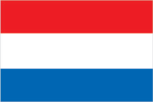
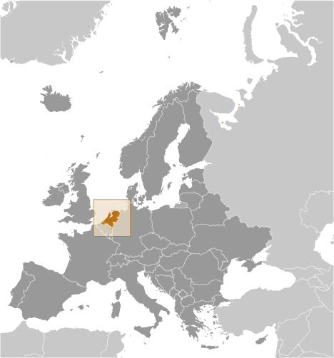
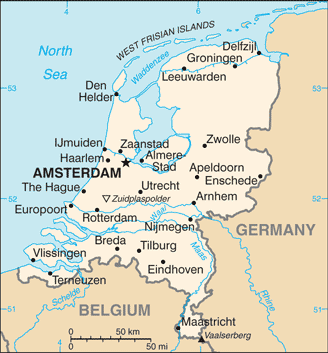

# Netherlands

## Introduction

**_Background:_**   
The Dutch United Provinces declared their independence from Spain in 1579; during the 17th century, they became a leading seafaring and commercial power, with settlements and colonies around the world. After a 20-year French occupation, a Kingdom of the Netherlands was formed in 1815. In 1830 Belgium seceded and formed a separate kingdom. The Netherlands remained neutral in World War I, but suffered invasion and occupation by Germany in World War II. A modern, industrialized nation, the Netherlands is also a large exporter of agricultural products. The country was a founding member of NATO and the EEC (now the EU) and participated in the introduction of the euro in 1999. In October 2010, the former Netherlands Antilles was dissolved and the three smallest islands - Bonaire, Sint Eustatius, and Saba - became special municipalities in the Netherlands administrative structure. The larger islands of Sint Maarten and Curacao joined the Netherlands and Aruba as constituent countries forming the Kingdom of the Netherlands.

## Geography

**_Location:_**   
Western Europe, bordering the North Sea, between Belgium and Germany

**_Geographic coordinates:_**   
52 30 N, 5 45 E

**_Map references:_**   
Europe

**_Area:_**   
**total:** 41,543 sq km   
**land:** 33,893 sq km   
**water:** 7,650 sq km

**_Area - comparative:_**   
slightly less than twice the size of New Jersey

**_Land boundaries:_**   
**total:** 1,027 km   
**border countries:** Belgium 450 km, Germany 577 km

**_Coastline:_**   
451 km

**_Maritime claims:_**   
**territorial sea:** 12 nm   
**contiguous zone:** 24 nm   
**exclusive fishing zone:** 200 nm

**_Climate:_**   
temperate; marine; cool summers and mild winters

**_Terrain:_**   
mostly coastal lowland and reclaimed land (polders); some hills in southeast

**_Elevation extremes:_**   
**lowest point:** Zuidplaspolder -7 m   
**highest point:** Mount Scenery 862 m (on the island of Saba in the Caribbean, now considered an integral part of the Netherlands following the dissolution of the Netherlands Antilles)   
**note:** the highest point on continental Netherlands is Vaalserberg at 322 m

**_Natural resources:_**   
natural gas, petroleum, peat, limestone, salt, sand and gravel, arable land

**_Land use:_**   
**arable land:** 25.08%   
**permanent crops:** 0.88%   
**other:** 74.04% (2011)

**_Irrigated land:_**   
4,572 sq km (2007)

**_Total renewable water resources:_**   
91 cu km (2011)

**_Freshwater withdrawal (domestic/industrial/agricultural):_**   
**total:** 10.61 cu km/yr (12%/88%/1%)   
**per capita:** 636.7 cu m/yr (2008)

**_Natural hazards:_**   
flooding

**_Environment - current issues:_**   
water pollution in the form of heavy metals, organic compounds, and nutrients such as nitrates and phosphates; air pollution from vehicles and refining activities; acid rain

**_Environment - international agreements:_**   
**party to:** Air Pollution, Air Pollution-Nitrogen Oxides, Air Pollution-Persistent Organic Pollutants, Air Pollution-Sulfur 85, Air Pollution-Sulfur 94, Air Pollution-Volatile Organic Compounds, Antarctic-Environmental Protocol, Antarctic-Marine Living Resources, Antarctic Treaty, Biodiversity, Climate Change, Climate Change-Kyoto Protocol, Desertification, Endangered Species, Environmental Modification, Hazardous Wastes, Law of the Sea, Marine Dumping, Marine Life Conservation, Ozone Layer Protection, Ship Pollution, Tropical Timber 83, Tropical Timber 94, Wetlands, Whaling   
**signed, but not ratified:** none of the selected agreements

**_Geography - note:_**   
located at mouths of three major European rivers (Rhine, Maas or Meuse, and Schelde)

## People and Society

**_Nationality:_**   
**noun:** Dutchman(men), Dutchwoman(women)   
**adjective:** Dutch

**_Ethnic groups:_**   
Dutch 80.7%, EU 5%, Indonesian 2.4%, Turkish 2.2%, Surinamese 2%, Moroccan 2%, Caribbean 0.8%, other 4.8% (2008 est.)

**_Languages:_**   
Dutch (official)   
**note:** Frisian, Low Saxon, and Limburgish are recognized as regional languages under the European Charter for Regional or Minority Languages

**_Religions:_**   
Roman Catholic 28%, Protestant 19% (includes Dutch Reformed 9%, Protestant Church of The Netherlands, 7%, Calvinist 3%), other 11% (includes about 5% Muslim and lesser numbers of Hindu, Buddhist, Jehovah's Witness, and Orthodox), none 42% (2009 est.)

**_Population:_**   
16,877,351 (July 2014 est.)

**_Age structure:_**   
**0-14 years:** 16.9% (male 1,460,234/female 1,393,766)   
**15-24 years:** 12.2% (male 1,046,323/female 1,006,114)   
**25-54 years:** 40.4% (male 3,423,777/female 3,399,378)   
**55-64 years:** 12.9% (male 1,088,860/female 1,094,574)   
**65 years and over:** 17.1% (male 1,331,258/female 1,633,067) (2014 est.)

**_Dependency ratios:_**   
**total dependency ratio:** 52.8 %   
**youth dependency ratio:** 25.9 %   
**elderly dependency ratio:** 26.8 %   
**potential support ratio:** 3.7 (2014 est.)

**_Median age:_**   
**total:** 42.1 years   
**male:** 41.2 years   
**female:** 42.9 years (2014 est.)

**_Population growth rate:_**   
0.42% (2014 est.)

**_Birth rate:_**   
10.83 births/1,000 population (2014 est.)

**_Death rate:_**   
8.57 deaths/1,000 population (2014 est.)

**_Net migration rate:_**   
1.97 migrant(s)/1,000 population (2014 est.)

**_Urbanization:_**   
**urban population:** 83.2% of total population (2011)   
**rate of urbanization:** 0.74% annual rate of change (2010-15 est.)

**_Major urban areas - population:_**   
AMSTERDAM (capital) 1.056 million; Rotterdam 1.014 million; The Hague (seat of government) 635,000 (2011)

**_Sex ratio:_**   
**at birth:** 1.05 male(s)/female   
**0-14 years:** 1.05 male(s)/female   
**15-24 years:** 1.04 male(s)/female   
**25-54 years:** 1.01 male(s)/female   
**55-64 years:** 0.98 male(s)/female   
**65 years and over:** 0.8 male(s)/female   
**total population:** 0.98 male(s)/female (2014 est.)

**_Mother's mean age at first birth:_**   
29.4 (2011 est.)

**_Maternal mortality rate:_**   
6 deaths/100,000 live births (2010)

**_Infant mortality rate:_**   
**total:** 3.66 deaths/1,000 live births   
**male:** 3.95 deaths/1,000 live births   
**female:** 3.35 deaths/1,000 live births (2014 est.)

**_Life expectancy at birth:_**   
**total population:** 81.12 years   
**male:** 79.02 years   
**female:** 83.34 years (2014 est.)

**_Total fertility rate:_**   
1.78 children born/woman (2014 est.)

**_Contraceptive prevalence rate:_**   
69%   
**note:** percent of women aged 18-45 (2008)

**_Health expenditures:_**   
12% of GDP (2011)

**_Physicians density:_**   
3.92 physicians/1,000 population (2007)

**_Hospital bed density:_**   
4.7 beds/1,000 population (2009)

**_Drinking water source:_**   
**improved:** urban: 100% of population; rural: 100% of population; total: 100% of population   
**unimproved:** urban: 0% of population; rural: 0% of population; total: 0% of population (2012 est.)

**_Sanitation facility access:_**   
**improved:** urban: 100% of population; rural: 100% of population; total: 100% of population   
**unimproved:** urban: 0% of population; rural: 0% of population; total: 0% of population (2012 est.)

**_HIV/AIDS - adult prevalence rate:_**   
0.2% (2009 est.)

**_HIV/AIDS - people living with HIV/AIDS:_**   
22,000 (2009 est.)

**_HIV/AIDS - deaths:_**   
fewer than 100 (2009 est.)

**_Obesity - adult prevalence rate:_**   
18.8% (2008)

**_Education expenditures:_**   
5.9% of GDP (2011)

**_Literacy:_**   
**definition:** age 15 and over can read and write   
**total population:** 99%   
**male:** 99%   
**female:** 99% (2003 est.)

**_School life expectancy (primary to tertiary education):_**   
**total:** 18 years   
**male:** 18 years   
**female:** 18 years (2011)

**_Unemployment, youth ages 15-24:_**   
**total:** 9.5%   
**male:** 8.9%   
**female:** 10% (2012)

## Government

**_Country name:_**   
**conventional long form:** Kingdom of the Netherlands   
**conventional short form:** Netherlands   
**local long form:** Koninkrijk der Nederlanden   
**local short form:** Nederland

**_Government type:_**   
constitutional monarchy

**_Capital:_**   
**name:** Amsterdam; note - The Hague is the seat of government   
**geographic coordinates:** 52 21 N, 4 55 E   
**time difference:** UTC+1 (6 hours ahead of Washington, DC, during Standard Time)   
**daylight saving time:** +1hr, begins last Sunday in March; ends last Sunday in October   
**note:** time descriptions apply to the continental Netherlands only, not to the Caribbean components

**_Administrative divisions:_**   
12 provinces (provincies, singular - provincie); Drenthe, Flevoland, Fryslan (Friesland), Gelderland, Groningen, Limburg, Noord-Brabant (North Brabant), Noord-Holland (North Holland), Overijssel, Utrecht, Zeeland (Zealand), Zuid-Holland (South Holland)

**_Dependent areas:_**   
Aruba, Curacao, Sint Maarten

**_Independence:_**   
23 January 1579 (the northern provinces of the Low Countries conclude the Union of Utrecht breaking with Spain; on 26 July 1581 they formally declared their independence with an Act of Abjuration; however, it was not until 30 January 1648 and the Peace of Westphalia that Spain recognized this independence)

**_National holiday:_**   
King's Day (for 2014, the holiday will be on 26 April; thereafter it will fall on the King's Birthday of 27 April (1967))

**_Constitution:_**   
previous 1597, 1798; latest adopted 24 August 1815 (substantially revised in 1848); amended many times, last in 2010 (2013)

**_Legal system:_**   
civil law system based on the French system; constitution does not permit judicial review of acts of the States General

**_International law organization participation:_**   
accepts compulsory ICJ jurisdiction with reservations; accepts ICCt jurisdiction

**_Suffrage:_**   
18 years of age; universal

**_Executive branch:_**   
**chief of state:** King WILLEM-ALEXANDER (since 30 April 2013)   
**head of government:** Prime Minister Mark RUTTE (since 14 October 2010); Deputy Prime Minister Lodewijk ASSCHER (since 5 November 2012); note - Mark RUTTE tendered his resignation 23 April 2012; new elections were held on 12 September 2012 in which his party won the most seats; during the interim period he remained in office in a care-taking position; he was sworn in again as prime minister on 5 November 2012   
**cabinet:** Council of Ministers appointed by the monarch   
**elections:** the monarchy is hereditary; following Second Chamber elections, the leader of the majority party or leader of a majority coalition usually appointed prime minister by the monarch; deputy prime ministers appointed by the monarch   
**note:** there is also a Council of State composed of the monarch, heir apparent, and councilors that provides advice to the cabinet on legislative and administrative policy

**_Legislative branch:_**   
bicameral States General or Staten Generaal consists of the First Chamber or Eerste Kamer (75 seats; members indirectly elected by the country's 12 provincial councils to serve four-year terms) and the Second Chamber or Tweede Kamer (150 seats; members elected by popular vote to serve four-year terms)   
**elections:** First Chamber - last held on May 2011 (next to be held in May 2015); Second Chamber - last held on 12 September 2012 (next to be held by May 2017)   
**election results:** First Chamber - percent of vote by party - NA; seats by party - VVD 16, PvdA 14, CDA 11, PVV 10, SP 8, D66 5, GL 5, other 6; Second Chamber - percent of vote by party - VVD 26.6%, PvdA 24.8%, PVV, 10.1%, SP 9.7%, CDA 8.5%, D66 8.0%, CU 3.1%, GL 6.7%, other 2.5%; seats by party - VVD 41, PvdA 38, PVV 15, SP 15, CDA 13, D66 12, CU 5, GL 4, other 7

**_Judicial branch:_**   
**highest court(s):** Supreme Court or Hoge Raad (consists of 41 judges: the president, 6 vice-presidents, 31 justices or raadsheren, and 3 justices in exceptional service, referred to as buitengewone dienst); the court is divided into criminal, civil, tax, and ombuds chambers   
**judge selection and term of office:** justices appointed by the monarch from a list provided by the Second Chamber of the States General; justices appointed for life or until mandatory retirement at age 70   
**subordinate courts:** courts of appeal; district courts, each with up to 5 subdistrict courts

**_Political parties and leaders:_**   
Christian Democratic Appeal or CDA [Sybrand VAN HAERSMA BUMA]   
Christian Union or CU [Arie SLOB]   
Democrats 66 or D66 [Alexander PECHTOLD]   
Green Left or GL [Bram VAN OJIK]   
Labor Party or PvdA [Diederik SAMSOM]   
Party for Freedom or PVV [Geert WILDERS]   
Party for the Animals or PvdD [Marianne THIEME]   
People's Party for Freedom and Democracy or VVD [Mark RUTTE]   
Reformed Political Party or SGP [Kees VAN DER STAAIJ]   
Socialist Party or SP [Emile ROEMER]   
plus a few minor parties

**_Political pressure groups and leaders:_**   
Christian Trade Union Federation or CNV [Jaap SMIT]   
Confederation of Netherlands Industry and Employers or VNO-NCW [Bernard WIENTJES]   
Federation for Small and Medium-sized businesses or MKB [Hans BIESHEUVEL]   
Netherlands Trade Union Federation or FNV [Ton HEERTS]   
Social Economic Council or SER [Wiebe DRAIJER]   
Trade Union Federation of Middle and High Personnel or MHP [Reginald VISSER]

**_International organization participation:_**   
ADB (nonregional member), AfDB (nonregional member), Arctic Council (observer), Australia Group, Benelux, BIS, CBSS (observer), CD, CE, CERN, EAPC, EBRD, ECB, EIB, EITI (implementing country), EMU, ESA, EU, FAO, FATF, G-10, IADB, IAEA, IBRD, ICAO, ICC (national committees), ICRM, IDA, IEA, IFAD, IFC, IFRCS, IGAD (partners), IHO, ILO, IMF, IMO, IMSO, Interpol, IOC, IOM, IPU, ISO, ITSO, ITU, ITUC (NGOs), MIGA, MINUSMA, NATO, NEA, NSG, OAS (observer), OECD, OPCW, OSCE, Pacific Alliance (observer), Paris Club, PCA, Schengen Convention, SELEC (observer), UN, UNAMID, UNCTAD, UNESCO, UNHCR, UNIDO, UNMISS, UNRWA, UNTSO, UNWTO, UPU, WCO, WHO, WIPO, WMO, WTO, ZC

**_Diplomatic representation in the US:_**   
**chief of mission:** Ambassador Rudolf Simon BEKINK (since 20 July 2012)   
**chancery:** 4200 Linnean Avenue NW, Washington, DC 20008   
**telephone:** [1] (202) 244-5300, [1] 877-388-2443   
**FAX:** [1] (202) 362-3430   
**consulate(s) general:** Chicago, Miami, New York, San Francisco   
**consulate(s):** Boston

**_Diplomatic representation from the US:_**   
**chief of mission:** ambassador Timothy BROAS (since 19 March 2014)   
**embassy:** Lange Voorhout 102, 2514 EJ, The Hague   
**mailing address:** PSC 71, Box 1000, APO AE 09715   
**telephone:** [31] (70) 310-2209   
**FAX:** [31] (70) 310-2207   
**consulate(s) general:** Amsterdam

**_Flag description:_**   
three equal horizontal bands of red (top), white, and blue; similar to the flag of Luxembourg, which uses a lighter blue and is longer; the colors were those of WILLIAM I, Prince of Orange, who led the Dutch Revolt against Spanish sovereignty in the latter half of the 16th century; originally the upper band was orange, but because it tended to fade to red over time, the red shade was eventually made the permanent color; the banner is perhaps the oldest tricolor in continuous use

**_National symbol(s):_**   
lion

**_National anthem:_**   
**name:** "Het Wilhelmus" (The William)   
**lyrics/music:** Philips VAN MARNIX van Sint Aldegonde (presumed)/unknown   
**note:** adopted 1932, in use since the 17th century, making it the oldest national anthem in the world; also known as "Wilhelmus van Nassouwe" (William of Nassau), it is in the form of an acrostic, where the first letter of each stanza spells the name of the leader of the Dutch Revolt

## Economy

**_Economy - overview:_**   
Netherlands is the sixth-largest economy in the euro-zone and is noted for its stable industrial relations, moderate unemployment and inflation, sizable trade surplus, and important role as a European transportation hub. Industrial activity is predominantly in food processing, chemicals, petroleum refining, and electrical machinery. A highly mechanized agricultural sector employs only 2% of the labor force but provides large surpluses for the food-processing industry and for exports. Netherlands, along with 11 of its EU partners, began circulating the euro currency on 1 January 2002. The Dutch financial sector suffered as a result of the global financial crisis, due in part to the high exposure of some Dutch banks to US mortgage-backed securities. In 2008, the government nationalized two banks and injected billions of dollars of capital into other financial institutions, to prevent further deterioration of a crucial sector. After 26 years of uninterrupted economic growth, the Dutch economy - highly dependent on an international financial sector and international trade - contracted by 3.5% in 2009. To recover, the government sought to boost the domestic economy by accelerating infrastructure programs, offering corporate tax breaks for employers to retain workers, and expanding export credit facilities. The stimulus programs and bank bailouts, however, resulted in a government budget deficit of 5.3% of GDP in 2010 that contrasted sharply with a surplus of 0.7% in 2008. The government of Prime Minister Mark RUTTE began implementing austerity measures in early 2011, mainly reducting expenditures, which resulted in an improved budget deficit in 2011. However, in 2012 tax revenues dropped, GDP contracted, and the budget deficit deteriorated. In 2013, the government budget deficit decreased to 3.3% of GDP due to increased government revenue from higher taxes. However, spending on social benefits also increased, due to a rise in unemployment benefits and payments for pensions. The high unemployment rate and tax increases have contributed to continued decreases in household disposable income, causing the Dutch economy to contract.

**_GDP (purchasing power parity):_**   
$699.7 billion (2013 est.)   
$705.3 billion (2012 est.)   
$714.2 billion (2011 est.)   
**note:** data are in 2013 US dollars

**_GDP (official exchange rate):_**   
$722.3 billion (2013 est.)

**_GDP - real growth rate:_**   
-0.8% (2013 est.)   
-1.2% (2012 est.)   
0.9% (2011 est.)

**_GDP - per capita (PPP):_**   
$43,300 (2012 est.)   
$43,200 (2011 est.)   
$41,600 (2010 est.)   
**note:** data are in 2012 US dollars

**_Gross national saving:_**   
26.2% of GDP (2013 est.)   
27.5% of GDP (2012 est.)   
28.3% of GDP (2011 est.)

**_GDP - composition, by end use:_**   
**household consumption:** 45.3%   
**government consumption:** 27.7%   
**investment in fixed capital:** 15.7%   
**investment in inventories:** 0.4%   
**exports of goods and services:** 86%   
**imports of goods and services:** -75.2%; (2013 est.)

**_GDP - composition, by sector of origin:_**   
**agriculture:** 2.6%   
**industry:** 25.4%   
**services:** 72.1% (2013 est.)

**_Agriculture - products:_**   
grains, potatoes, sugar beets, fruits, vegetables; livestock

**_Industries:_**   
agroindustries, metal and engineering products, electrical machinery and equipment, chemicals, petroleum, construction, microelectronics, fishing

**_Industrial production growth rate:_**   
0.5% (2013 est.)

**_Labor force:_**   
7.939 million (2013 est.)

**_Labor force - by occupation:_**   
**agriculture:** 2.3%   
**industry:** 18.8%   
**services:** 78.9% (2011 est.)

**_Unemployment rate:_**   
8.3% (2013 est.)   
6.4% (2012 est.)

**_Population below poverty line:_**   
9.1% (2013 est.)

**_Household income or consumption by percentage share:_**   
**lowest 10%:** 2.1%   
**highest 10%:** 24.5% (2012 est.)

**_Distribution of family income - Gini index:_**   
30.9 (2007)   
32.6 (1994)

**_Budget:_**   
**revenues:** $315.5 billion   
**expenditures:** $339.3 billion (2014 est.)

**_Taxes and other revenues:_**   
43.7% of GDP (2014 est.)

**_Budget surplus (+) or deficit (-):_**   
-3.3% of GDP (2014 est.)

**_Public debt:_**   
74.3% of GDP (2013 est.)   
71.3% of GDP (2012 est.)   
**note:** data cover general government debt, and includes debt instruments issued (or owned) by government entities other than the treasury; the data include treasury debt held by foreign entities; the data include debt issued by subnational entities, as well as intra-governmental debt; intra-governmental debt consists of treasury borrowings from surpluses in the social funds, such as for retirement, medical care, and unemployment, debt instruments for the social funds are not sold at public auctions

**_Fiscal year:_**   
calendar year

**_Inflation rate (consumer prices):_**   
2.5% (2013 est.)   
2.5% (2012 est.)

**_Central bank discount rate:_**   
0.75% (31 December 2013)   
1.5% (31 December 2010)   
**note:** this is the European Central Bank's rate on the marginal lending facility, which offers overnight credit to banks in the euro area

**_Commercial bank prime lending rate:_**   
2.3% (31 December 2013 est.)   
2.65% (31 December 2012 est.)

**_Stock of narrow money:_**   
$401.1 billion (31 December 2013 est.)   
$389.9 billion (31 December 2012 est.)   
**note:** see entry for the European Union for money supply in the euro area; the European Central Bank (ECB) controls monetary policy for the 17 members of the Economic and Monetary Union (EMU); individual members of the EMU do not control the quantity of money circulating within their own borders

**_Stock of broad money:_**   
$1.169 trillion (31 December 2013 est.)   
$1.136 trillion (31 December 2012 est.)

**_Stock of domestic credit:_**   
$1.736 trillion (31 December 2013 est.)   
$1.7 trillion (31 December 2012 est.)

**_Market value of publicly traded shares:_**   
$675 billion (31 December 2013 est.)   
$651 billion (31 December 2012)   
$594.7 billion (31 December 2011 est.)

**_Current account balance:_**   
$65.87 billion (2013 est.)   
$51.54 billion (2012 est.)

**_Exports:_**   
$576.9 billion (2013 est.)   
$550 billion (2012 est.)

**_Exports - commodities:_**   
machinery and equipment, chemicals, fuels; foodstuffs

**_Exports - partners:_**   
Germany 26.5%, Belgium 13.7%, France 8.8%, UK 8%, Italy 4.5% (2012)

**_Imports:_**   
$511 billion (2013 est.)   
$498.5 billion (2012 est.)

**_Imports - commodities:_**   
machinery and transport equipment, chemicals, fuels, foodstuffs, clothing

**_Imports - partners:_**   
Germany 13.8%, China 12%, Belgium 8.4%, UK 6.7%, Russia 6.4%, US 6.1% (2012)

**_Reserves of foreign exchange and gold:_**   
$71.95 billion (31 December 2013 est.)   
$54.82 billion (31 December 2012 est.)

**_Debt - external:_**   
$2.347 trillion (31 December 2013 est.)   
$2.434 trillion (31 December 2012 est.)

**_Stock of direct foreign investment - at home:_**   
$646.4 billion (31 December 2013 est.)   
$605.7 billion (31 December 2012 est.)

**_Stock of direct foreign investment - abroad:_**   
$1.034 trillion (31 December 2013 est.)   
$961.4 billion (31 December 2012 est.)

**_Exchange rates:_**   
euros (EUR) per US dollar -   
0.7634 (2013 est.)   
0.7752 (2012 est.)   
0.755 (2010 est.)   
0.7198 (2009 est.)   
0.6827 (2008 est.)

## Energy

**_Electricity - production:_**   
98.57 billion kWh (2013 est.)

**_Electricity - consumption:_**   
116.8 billion kWh (2013 est.)

**_Electricity - exports:_**   
15.02 billion kWh (2013 est.)

**_Electricity - imports:_**   
33.25 billion kWh (2013 est.)

**_Electricity - installed generating capacity:_**   
29.92 million kW (2012)

**_Electricity - from fossil fuels:_**   
85.1% of total installed capacity (2012 est.)

**_Electricity - from nuclear fuels:_**   
1.6% of total installed capacity (2012 est.)

**_Electricity - from hydroelectric plants:_**   
0.1% of total installed capacity (2012 est.)

**_Electricity - from other renewable sources:_**   
13.2% of total installed capacity (2012 est.)

**_Crude oil - production:_**   
29,400 bbl/day (2013 est.)

**_Crude oil - exports:_**   
35,500 bbl/day (2013 est.)

**_Crude oil - imports:_**   
1.202 million bbl/day (2012 est.)

**_Crude oil - proved reserves:_**   
352 million bbl (1 January 2013 est.)

**_Refined petroleum products - production:_**   
1.248 million bbl/day (2010 est.)

**_Refined petroleum products - consumption:_**   
1.01 million bbl/day (2011 est.)

**_Refined petroleum products - exports:_**   
2.138 million bbl/day (2010 est.)

**_Refined petroleum products - imports:_**   
2.079 million bbl/day (2010 est.)

**_Natural gas - production:_**   
81.52 billion cu m (2013 est.)

**_Natural gas - consumption:_**   
44.11 billion cu m (2013 est.)

**_Natural gas - exports:_**   
63.42 billion cu m (2013 est.)

**_Natural gas - imports:_**   
24.65 billion cu m (2013 est.)

**_Natural gas - proved reserves:_**   
1.09 trillion cu m (1 January 2013 est.)

**_Carbon dioxide emissions from consumption of energy:_**   
58.1 million Mt (2012 est.)

## Communications

**_Telephones - main lines in use:_**   
7.086 million (2012)

**_Telephones - mobile cellular:_**   
19.643 million (2012)

**_Telephone system:_**   
**general assessment:** highly developed and well maintained   
**domestic:** extensive fixed-line fiber-optic network; large cellular telephone system with 5 major operators utilizing the third generation of the Global System for Mobile Communications (GSM) technology; one in five households now use Voice over the Internet Protocol (VoIP) services   
**international:** country code - 31; submarine cables provide links to the US and Europe; satellite earth stations - 5 (3 Intelsat - 1 Indian Ocean and 2 Atlantic Ocean, 1 Eutelsat, and 1 Inmarsat (2011)

**_Broadcast media:_**   
more than 90% of households are connected to cable or satellite TV systems that provide a wide range of domestic and foreign channels; public service broadcast system includes multiple broadcasters, 3 with a national reach and the remainder operating in regional and local markets; 2 major nationwide commercial television companies, each with 3 or more stations, and many commercial TV stations in regional and local markets; nearly 600 radio stations with a mix of public and private stations providing national or regional coverage (2008)

**_Internet country code:_**   
.nl

**_Internet hosts:_**   
13.699 million (2012)

**_Internet users:_**   
14.872 million (2009)

## Transportation

**_Airports:_**   
29 (2013)

**_Airports - with paved runways:_**   
**total:** 23   
**over 3,047 m:** 3   
**2,438 to 3,047 m:** 11   
**1,524 to 2,437 m:** 1   
**914 to 1,523 m:** 6   
**under 914 m:** 2 (2013)

**_Airports - with unpaved runways:_**   
**total:** 6   
**914 to 1,523 m:** 4   
**under 914 m:** 2 (2013)

**_Heliports:_**   
1 (2013)

**_Pipelines:_**   
condensate 81 km; gas 8,531 km; oil 578 km; refined products 716 km (2013)

**_Railways:_**   
**total:** 3,013 km   
**standard gauge:** 3,013 km 1.435-m gauge (2,195 km electrified) (2012)

**_Roadways:_**   
**total:** 139,295 km (includes 2,758 km of expressways) (2012)

**_Waterways:_**   
6,237 km (navigable for ships of 50 tons) (2012)

**_Merchant marine:_**   
**total:** 744   
**by type:** bulk carrier 4, cargo 514, carrier 15, chemical tanker 56, container 67, liquefied gas 21, passenger 17, passenger/cargo 14, petroleum tanker 4, refrigerated cargo 10, roll on/roll off 19, specialized tanker 3   
**foreign-owned:** 196 (Australia 1, Bermuda 1, Denmark 27, Finland 13, France 2, Germany 86, Ireland 8, Italy 6, Japan 1, Norway 19, Sweden 12, UAE 4, US 16)   
**registered in other countries:** 233 (Antigua and Barbuda 17, Bahamas 23, Belize 1, Canada 1, Curacao 43, Cyprus 23, Germany 1, Gibraltar 34, Italy 2, Liberia 31, Luxembourg 3, Malta 3, Marshall Islands 21, Panama 6, Paraguay 1, Philippines 17, Russia 2, Saint Vincent and the Grenadines 1, Singapore 1, UK 1, unknown 1) (2010)

**_Ports and terminals:_**   
**major seaport(s):** IJmuiden, Vlissingen   
**river port(s):** Amsterdam (Nordsee Kanaal); Moerdijk (Hollands Diep River); Rotterdam (Rhine River); Terneuzen (Western Scheldt River)   
**container port(s) (TEUs):** Rotterdam (11,876,920)

## Military

**_Military branches:_**   
Royal Netherlands Army, Royal Netherlands Navy (includes Naval Air Service and Marine Corps), Royal Netherlands Air Force (Koninklijke Luchtmacht, KLu), Royal Military Police (2012)

**_Military service age and obligation:_**   
17 years of age for an all-volunteer force (2014)

**_Manpower available for military service:_**   
**males age 16-49:** 3,734,610   
**females age 16-49:** 3,687,940 (2014 est.)

**_Manpower fit for military service:_**   
**males age 16-49:** 3,479,509   
**females age 16-49:** 3,435,564 (2014 est.)

**_Manpower reaching militarily significant age annually:_**   
**male:** 100,446   
**female:** 94,750 (2014 est.)

**_Military expenditures:_**   
1.27% of GDP (2012)   
1.35% of GDP (2011)   
1.27% of GDP (2010)

## Transnational Issues

**_Disputes - international:_**   
none

**_Refugees and internally displaced persons:_**   
**refugees (country of origin):** 18,799 (Somalia); 15,533 (Iraq); 6,269 (Afghanistan) (2013)   
**stateless persons:** 2,005 (2012)

**_Illicit drugs:_**   
major European producer of synthetic drugs, including ecstasy, and cannabis cultivator; important gateway for cocaine, heroin, and hashish entering Europe; major source of US-bound ecstasy; large financial sector vulnerable to money laundering; significant consumer of ecstasy

............................................................   
_Page last updated on June 20, 2014_
