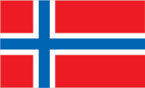
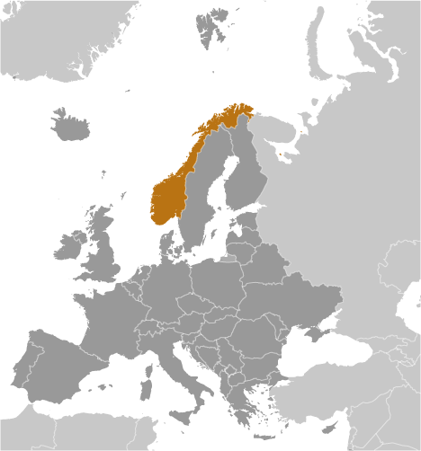

# Norway

## Introduction

**_Background:_**   
Two centuries of Viking raids into Europe tapered off following the adoption of Christianity by King Olav TRYGGVASON in 994. Conversion of the Norwegian kingdom occurred over the next several decades. In 1397, Norway was absorbed into a union with Denmark that lasted more than four centuries. In 1814, Norwegians resisted the cession of their country to Sweden and adopted a new constitution. Sweden then invaded Norway but agreed to let Norway keep its constitution in return for accepting the union under a Swedish king. Rising nationalism throughout the 19th century led to a 1905 referendum granting Norway independence. Although Norway remained neutral in World War I, it suffered heavy losses to its shipping. Norway proclaimed its neutrality at the outset of World War II, but was nonetheless occupied for five years by Nazi Germany (1940-45). In 1949, neutrality was abandoned and Norway became a member of NATO. Discovery of oil and gas in adjacent waters in the late 1960s boosted Norway's economic fortunes. In referenda held in 1972 and 1994, Norway rejected joining the EU. Key domestic issues include immigration and integration of ethnic minorities, maintaining the country's extensive social safety net with an aging population, and preserving economic competitiveness.

## Geography

**_Location:_**   
Northern Europe, bordering the North Sea and the North Atlantic Ocean, west of Sweden

**_Geographic coordinates:_**   
62 00 N, 10 00 E

**_Map references:_**   
Europe

**_Area:_**   
**total:** 323,802 sq km   
**land:** 304,282 sq km   
**water:** 19,520 sq km

**_Area - comparative:_**   
slightly larger than New Mexico

**_Land boundaries:_**   
**total:** 2,542 km   
**border countries:** Finland 727 km, Sweden 1,619 km, Russia 196 km

**_Coastline:_**   
25,148 km (includes mainland 2,650 km, as well as long fjords, numerous small islands, and minor indentations 22,498 km; length of island coastlines 58,133 km)

**_Maritime claims:_**   
**territorial sea:** 12 nm   
**contiguous zone:** 10 nm   
**exclusive economic zone:** 200 nm   
**continental shelf:** 200 nm

**_Climate:_**   
temperate along coast, modified by North Atlantic Current; colder interior with increased precipitation and colder summers; rainy year-round on west coast

**_Terrain:_**   
glaciated; mostly high plateaus and rugged mountains broken by fertile valleys; small, scattered plains; coastline deeply indented by fjords; arctic tundra in north

**_Elevation extremes:_**   
**lowest point:** Norwegian Sea 0 m   
**highest point:** Galdhopiggen 2,469 m

**_Natural resources:_**   
petroleum, natural gas, iron ore, copper, lead, zinc, titanium, pyrites, nickel, fish, timber, hydropower

**_Land use:_**   
**arable land:** 2.52%   
**permanent crops:** 0.01%   
**other:** 97.46% (2011)

**_Irrigated land:_**   
1,149 sq km (2007)

**_Total renewable water resources:_**   
382 cu km (2011)

**_Freshwater withdrawal (domestic/industrial/agricultural):_**   
**total:** 2.94 cu km/yr (28%/43%/29%)   
**per capita:** 622.4 cu m/yr (2006)

**_Natural hazards:_**   
rockslides, avalanches   
**volcanism:** Beerenberg (elev. 2,227 m) on Jan Mayen Island in the Norwegian Sea is the country's only active volcano

**_Environment - current issues:_**   
water pollution; acid rain damaging forests and adversely affecting lakes, threatening fish stocks; air pollution from vehicle emissions

**_Environment - international agreements:_**   
**party to:** Air Pollution, Air Pollution-Nitrogen Oxides, Air Pollution-Persistent Organic Pollutants, Air Pollution-Sulfur 85, Air Pollution-Sulfur 94, Air Pollution-Volatile Organic Compounds, Antarctic-Environmental Protocol, Antarctic-Marine Living Resources, Antarctic Seals, Antarctic Treaty, Biodiversity, Climate Change, Climate Change-Kyoto Protocol, Desertification, Endangered Species, Environmental Modification, Hazardous Wastes, Law of the Sea, Marine Dumping, Ozone Layer Protection, Ship Pollution, Tropical Timber 83, Tropical Timber 94, Wetlands, Whaling   
**signed, but not ratified:** none of the selected agreements

**_Geography - note:_**   
about two-thirds mountains; some 50,000 islands off its much-indented coastline; strategic location adjacent to sea lanes and air routes in North Atlantic; one of the most rugged and longest coastlines in the world

## People and Society

**_Nationality:_**   
**noun:** Norwegian(s)   
**adjective:** Norwegian

**_Ethnic groups:_**   
Norwegian 94.4% (includes Sami, about 60,000), other European 3.6%, other 2% (2007 estimate)

**_Languages:_**   
Bokmal Norwegian (official), Nynorsk Norwegian (official), small Sami- and Finnish-speaking minorities   
**note:** Sami is an official language in nine municipalities

**_Religions:_**   
Church of Norway (Evangelical Lutheran - official) 82.1%, other Christian 3.9%, Muslim 2.3%, Roman Catholic 1.8%, other 2.4%, unspecified 7.5% (2011 est.)

**_Population:_**   
5,147,792 (July 2014 est.)

**_Age structure:_**   
**0-14 years:** 18.2% (male 480,176/female 456,128)   
**15-24 years:** 13.1% (male 347,873/female 329,021)   
**25-54 years:** 40.8% (male 1,080,339/female 1,021,370)   
**55-64 years:** 11.7% (male 305,094/female 298,134)   
**65 years and over:** 16.8% (male 375,909/female 453,748) (2014 est.)

**_Dependency ratios:_**   
**total dependency ratio:** 53.2 %   
**youth dependency ratio:** 28.5 %   
**elderly dependency ratio:** 24.7 %   
**potential support ratio:** 4.1 (2014 est.)

**_Median age:_**   
**total:** 39.1 years   
**male:** 38.2 years   
**female:** 39.9 years (2014 est.)

**_Population growth rate:_**   
1.19% (2014 est.)

**_Birth rate:_**   
12.09 births/1,000 population (2014 est.)

**_Death rate:_**   
8.19 deaths/1,000 population (2014 est.)

**_Net migration rate:_**   
7.96 migrant(s)/1,000 population (2014 est.)

**_Urbanization:_**   
**urban population:** 79.4% of total population (2011)   
**rate of urbanization:** 1.03% annual rate of change (2010-15 est.)

**_Major urban areas - population:_**   
OSLO (capital) 915,000 (2011)

**_Sex ratio:_**   
**at birth:** 1.06 male(s)/female   
**0-14 years:** 1.05 male(s)/female   
**15-24 years:** 1.06 male(s)/female   
**25-54 years:** 1.06 male(s)/female   
**55-64 years:** 1.01 male(s)/female   
**65 years and over:** 0.78 male(s)/female   
**total population:** 0.98 male(s)/female (2014 est.)

**_Mother's mean age at first birth:_**   
28.5   
**note:** data is calculated based on actual age at first births (2012 est.)

**_Maternal mortality rate:_**   
7 deaths/100,000 live births (2010)

**_Infant mortality rate:_**   
**total:** 2.48 deaths/1,000 live births   
**male:** 2.79 deaths/1,000 live births   
**female:** 2.15 deaths/1,000 live births (2014 est.)

**_Life expectancy at birth:_**   
**total population:** 81.6 years   
**male:** 79.63 years   
**female:** 83.69 years (2014 est.)

**_Total fertility rate:_**   
1.86 children born/woman (2014 est.)

**_Contraceptive prevalence rate:_**   
88.4%   
**note:** percent of women aged 20-44 (2005)

**_Health expenditures:_**   
9.1% of GDP (2011)

**_Physicians density:_**   
3.7 physicians/1,000 population (2011)

**_Hospital bed density:_**   
3.3 beds/1,000 population (2010)

**_Drinking water source:_**   
**improved:** urban: 100% of population; rural: 100% of population; total: 100% of population   
**unimproved:** urban: 0% of population; rural: 0% of population; total: 0% of population (2012 est.)

**_Sanitation facility access:_**   
**improved:** urban: 100% of population; rural: 100% of population; total: 100% of population   
**unimproved:** urban: 0% of population; rural: 0% of population; total: 0% of population (2012 est.)

**_HIV/AIDS - adult prevalence rate:_**   
0.1% (2009 est.)

**_HIV/AIDS - people living with HIV/AIDS:_**   
4,000 (2009 est.)

**_HIV/AIDS - deaths:_**   
fewer than 100 (2009 est.)

**_Obesity - adult prevalence rate:_**   
21.5% (2008)

**_Education expenditures:_**   
6.9% of GDP (2010)

**_Literacy:_**   
**definition:** age 15 and over can read and write   
**total population:** 100%   
**male:** 100%   
**female:** 100%

**_School life expectancy (primary to tertiary education):_**   
**total:** 18 years   
**male:** 17 years   
**female:** 18 years (2011)

**_Unemployment, youth ages 15-24:_**   
**total:** 8.6%   
**male:** 10%   
**female:** 7.2% (2012)

## Government

**_Country name:_**   
**conventional long form:** Kingdom of Norway   
**conventional short form:** Norway   
**local long form:** Kongeriket Norge   
**local short form:** Norge

**_Government type:_**   
constitutional monarchy

**_Capital:_**   
**name:** Oslo   
**geographic coordinates:** 59 55 N, 10 45 E   
**time difference:** UTC+1 (6 hours ahead of Washington, DC, during Standard Time)   
**daylight saving time:** +1hr, begins last Sunday in March; ends last Sunday in October

**_Administrative divisions:_**   
19 counties (fylker, singular - fylke); Akershus, Aust-Agder, Buskerud, Finnmark, Hedmark, Hordaland, More og Romsdal, Nordland, Nord-Trondelag, Oppland, Oslo, Ostfold, Rogaland, Sogn og Fjordane, Sor-Trondelag, Telemark, Troms, Vest-Agder, Vestfold

**_Dependent areas:_**   
Bouvet Island, Jan Mayen, Svalbard

**_Independence:_**   
7 June 1905 (Norway declared the union with Sweden dissolved); 26 October 1905 (Sweden agreed to the repeal of the union)

**_National holiday:_**   
Constitution Day, 17 May (1814)

**_Constitution:_**   
drafted spring 1814, adopted 16 May 1814, signed by Constituent Assembly 17 May 1814; amended many times, last in 2012 (2012)

**_Legal system:_**   
mixed legal system of civil, common, and customary law; Supreme Court can advise on legislative acts

**_International law organization participation:_**   
accepts compulsory ICJ jurisdiction with reservations; accepts ICCt jurisdiction

**_Suffrage:_**   
18 years of age; universal

**_Executive branch:_**   
**chief of state:** King HARALD V (since 17 January 1991); Heir Apparent Crown Prince HAAKON MAGNUS, son of the monarch (born 20 July 1973)   
**head of government:** Prime Minister Erna SOLBERG (since 16 October 2013)   
**cabinet:** State Council appointed by the monarch with the approval of parliament   
**elections:** the monarchy is hereditary; following parliamentary elections, the leader of the majority party or the leader of the majority coalition usually appointed prime minister by the monarch with the approval of the parliament

**_Legislative branch:_**   
modified unicameral Parliament or Storting (169 seats; members elected by popular vote by proportional representation to serve four-year terms)   
**elections:** last held on 9 September 2013 (next to be held in September 2017)   
**election results:** percent of vote by party - Ap 30.8%, H 26.3%, FrP 16.3%, KrF 5.6%, Sp 5.5%, V 5.2%, SV 4.1%, MDG 2.8, other 2.7%; seats by party - Ap 55, H 48, FrP 29, Sp 10, KrF 10, V 9, SV 7, MDG 1

**_Judicial branch:_**   
**highest court(s):** Supreme Court or Hoyesterett (consists of the chief justice and 18 associate justices); note - in addition to professionally trained judges, there are elected lay judges that sit on the bench with professional judges in the Courts of Appeal and district courts   
**judge selection and term of office:** justices appointed by the monarch (King in Council) upon the recommendation of the Judicial Appointments Board; justice retirement mandatory at age 70   
**subordinate courts:** Courts of Appeal or Lagmensrett; regional and district courts; Conciliation Boards; ordinary and special courts

**_Political parties and leaders:_**   
Center Party or Sp [Liv Signe NAVARSETE]   
Christian Democratic Party or KrF [Knut Arild HAREIDE]   
Conservative Party or H [Erna SOLBERG]   
Labor Party or Ap [Jens STOLTENBERG]   
Liberal Party or V [Trine SKEI-GRANDE]   
Progress Party or FrP [Siv JENSEN]   
Socialist Left Party or SV [Audun LYSBAKKEN]

**_Political pressure groups and leaders:_**   
Confederation of Norwegian Enterprise (Naeringslivets Hovedorganisasjon) or NHO [President Tore ULSTEIN; CEO Kristin SKOGEN LUND]   
Norwegian Confederation of Trade Unions (Landsorganisasjonen i Norge) or LO [Gerd KRISTIANSEN]   
**other:** environmental groups; media; digital privacy movements

**_International organization participation:_**   
ADB (nonregional member), AfDB (nonregional member), Arctic Council, Australia Group, BIS, CBSS, CD, CE, CERN, EAPC, EBRD, EFTA, EITI (implementing country), ESA, FAO, FATF, IADB, IAEA, IBRD, ICAO, ICC (national committees), ICRM, IDA, IEA, IFAD, IFC, IFRCS, IGAD (partners), IHO, ILO, IMF, IMO, IMSO, Interpol, IOC, IOM, IPU, ISO, ITSO, ITU, ITUC (NGOs), MIGA, MINUSMA, MONUSCO, NATO, NC, NEA, NIB, NSG, OAS (observer), OECD, OPCW, OSCE, Paris Club, PCA, Schengen Convention, UN, UNCTAD, UNESCO, UNHCR, UNIDO, UNITAR, UNMISS, UNRWA, UNTSO, UNWTO, UPU, WCO, WHO, WIPO, WMO, WTO, ZC

**_Diplomatic representation in the US:_**   
**chief of mission:** Ambassador Kare Reidar AAS (since 22 August 2013)   
**chancery:** 2720 34th Street NW, Washington, DC 20008   
**telephone:** [1] (202) 333-6000   
**FAX:** [1] (202) 469-3990   
**consulate(s) general:** Houston, New York, San Francisco

**_Diplomatic representation from the US:_**   
**chief of mission:** Ambassador (vacant); Charge d'Affaires Julie Furuta-Toy (since 27 September 2013)   
**embassy:** Henrik Ibsens gate 48, 0244 Oslo; note - the embassy will move to Huseby in the near future   
**mailing address:** PSC 69, Box 1000, APO AE 09707   
**telephone:** [47] 21-30-85-40   
**FAX:** [47] 22-44-33-63, 22-56-27-51

**_Flag description:_**   
red with a blue cross outlined in white that extends to the edges of the flag; the vertical part of the cross is shifted to the hoist side in the style of the Dannebrog (Danish flag); the colors recall Norway's past political unions with Denmark (red and white) and Sweden (blue)

**_National symbol(s):_**   
lion

**_National anthem:_**   
**name:** "Ja, vi elsker dette landet" (Yes, We Love This Country)   
**lyrics/music:** lyrics/music: Bjornstjerne BJORNSON/Rikard NORDRAAK   
**note:** adopted 1864; in addition to the national anthem, "Kongesangen" (Song of the King), which uses the tune of "God Save the Queen," serves as the royal anthem

## Economy

**_Economy - overview:_**   
The Norwegian economy is a prosperous mixed economy, with a vibrant private sector, a large state sector, and an extensive social safety net. The government controls key areas, such as the vital petroleum sector, through extensive regulation and large-scale state-majority-owned enterprises. The country is richly endowed with natural resources - petroleum, hydropower, fish, forests, and minerals - and is highly dependent on the petroleum sector, which accounts for the largest portion of export revenue and about 30% of government revenue. Norway is the world's third-largest natural gas exporter; and seventh largest oil exporter, making one of its largest offshore oil finds in 2011. Norway opted to stay out of the EU during a referendum in November 1994; nonetheless, as a member of the European Economic Area, it contributes sizably to the EU budget. In anticipation of eventual declines in oil and gas production, Norway saves state revenue from the petroleum sector in the world's largest sovereign wealth fund, valued at over $830 billion in January 2014 and uses the fund's return to help finance public expenses. After solid GDP growth in 2004-07, the economy slowed in 2008, and contracted in 2009, before returning to positive growth in 2010-13. Nevertheless, the government budget remains in surplus.

**_GDP (purchasing power parity):_**   
$282.2 billion (2013 est.)   
$277.8 billion (2012 est.)   
$269.7 billion (2011 est.)   
**note:** data are in 2013 US dollars

**_GDP (official exchange rate):_**   
$515.8 billion (2013 est.)

**_GDP - real growth rate:_**   
1.6% (2013 est.)   
3% (2012 est.)   
1.3% (2011 est.)

**_GDP - per capita (PPP):_**   
$55,400 (2013 est.)   
$55,100 (2012 est.)   
$54,200 (2011 est.)   
**note:** data are in 2013 US dollars

**_Gross national saving:_**   
38.2% of GDP (2013 est.)   
39.4% of GDP (2012 est.)   
37% of GDP (2011 est.)

**_GDP - composition, by end use:_**   
**household consumption:** 40.5%   
**government consumption:** 21.6%   
**investment in fixed capital:** 21.7%   
**investment in inventories:** 3.4%   
**exports of goods and services:** 39.9%   
**imports of goods and services:** -27.1%; (2013 est.)

**_GDP - composition, by sector of origin:_**   
**agriculture:** 1.2%   
**industry:** 42.3%   
**services:** 56.5% (2013 est.)

**_Agriculture - products:_**   
barley, wheat, potatoes; pork, beef, veal, milk; fish

**_Industries:_**   
petroleum and gas, food processing, shipbuilding, pulp and paper products, metals, chemicals, timber, mining, textiles, fishing

**_Industrial production growth rate:_**   
-3% (2013 est.)

**_Labor force:_**   
2.707 million (2014 est.)

**_Labor force - by occupation:_**   
**agriculture:** 2.2%   
**industry:** 20.2%   
**services:** 77.6% (2012)

**_Unemployment rate:_**   
3.6% (2013 est.)   
3.2% (2012 est.)

**_Population below poverty line:_**   
NA%

**_Household income or consumption by percentage share:_**   
**lowest 10%:** 3.9%   
**highest 10%:** 21% (2008)

**_Distribution of family income - Gini index:_**   
25 (2008)   
25.8 (1995)

**_Budget:_**   
**revenues:** $292.8 billion   
**expenditures:** $225 billion (2013 est.)

**_Taxes and other revenues:_**   
56.8% of GDP (2013 est.)

**_Budget surplus (+) or deficit (-):_**   
13.1% of GDP (2013 est.)

**_Public debt:_**   
30.1% of GDP (2013 est.)   
29.1% of GDP (2012 est.)   
**note:** data cover general government debt, and includes debt instruments issued (or owned) by government entities other than the treasury; the data exclude treasury debt held by foreign entities; the data exclude debt issued by subnational entities, as well as intra-governmental debt; intra-governmental debt consists of treasury borrowings from surpluses in the social funds, such as for retirement, medical care, and unemployment; debt instruments for the social funds are not sold at public auctions

**_Fiscal year:_**   
calendar year

**_Inflation rate (consumer prices):_**   
1.9% (2013 est.)   
0.7% (2012 est.)

**_Central bank discount rate:_**   
6.25% (31 December 2010 est.)   
1.75% (31 December 2009 est.)

**_Commercial bank prime lending rate:_**   
NA% (31 December 2013 est.)   
3.7% (31 December 2012 est.)

**_Stock of narrow money:_**   
$146.3 billion (31 December 2013 est.)   
$152.1 billion (31 December 2012 est.)

**_Stock of broad money:_**   
$312.9 billion (31 December 2013 est.)   
$318.5 billion (31 December 2012 est.)

**_Stock of domestic credit:_**   
$706.4 billion (31 December 2013 est.)   
$705.4 billion (31 December 2012 est.)

**_Market value of publicly traded shares:_**   
$252.9 billion (31 December 2012 est.)   
$219.2 billion (31 December 2011)   
$250.9 billion (31 December 2010 est.)

**_Current account balance:_**   
$67.4 billion (2013 est.)   
$71.87 billion (2012 est.)

**_Exports:_**   
$154.2 billion (2013 est.)   
$166 billion (2012 est.)

**_Exports - commodities:_**   
petroleum and petroleum products, machinery and equipment, metals, chemicals, ships, fish

**_Exports - partners:_**   
UK 25.6%, Germany 12.6%, Netherlands 12%, France 6.7%, Sweden 6.3%, US 5% (2012)

**_Imports:_**   
$90.14 billion (2013 est.)   
$89.05 billion (2012 est.)

**_Imports - commodities:_**   
machinery and equipment, chemicals, metals, foodstuffs

**_Imports - partners:_**   
Sweden 13.6%, Germany 12.4%, China 9.3%, Denmark 6.3%, UK 6.1%, US 5.4% (2012)

**_Reserves of foreign exchange and gold:_**   
$51.86 billion (31 December 2012 est.)   
$49.4 billion (31 December 2011 est.)

**_Debt - external:_**   
$720.6 billion (31 December 2012 est.)   
$595.7 billion (31 December 2011)   
**note:** Norway is a net external creditor

**_Stock of direct foreign investment - at home:_**   
$274.5 billion (31 December 2013 est.)   
$256.8 billion (31 December 2012 est.)

**_Stock of direct foreign investment - abroad:_**   
$264.3 billion (31 December 2013 est.)   
$241.3 billion (31 December 2012 est.)

**_Exchange rates:_**   
Norwegian kroner (NOK) per US dollar -   
5.802 (2013 est.)   
5.8162 (2012 est.)   
6.0442 (2010 est.)   
6.288 (2009)   
5.6361 (2008)

## Energy

**_Electricity - production:_**   
125.2 billion kWh (2011 est.)

**_Electricity - consumption:_**   
120.9 billion kWh (2010 est.)

**_Electricity - exports:_**   
22.17 billion kWh (2012 est.)

**_Electricity - imports:_**   
4.168 billion kWh (2012 est.)

**_Electricity - installed generating capacity:_**   
30.18 million kW (2010 est.)

**_Electricity - from fossil fuels:_**   
2% of total installed capacity (2010 est.)

**_Electricity - from nuclear fuels:_**   
0% of total installed capacity (2010 est.)

**_Electricity - from hydroelectric plants:_**   
91.7% of total installed capacity (2010 est.)

**_Electricity - from other renewable sources:_**   
1.9% of total installed capacity (2010 est.)

**_Crude oil - production:_**   
1.902 million bbl/day (2012 est.)

**_Crude oil - exports:_**   
1.602 million bbl/day (2010 est.)

**_Crude oil - imports:_**   
11,320 bbl/day (2010 est.)

**_Crude oil - proved reserves:_**   
5.366 billion bbl (1 January 2010 est.)

**_Refined petroleum products - production:_**   
307,700 bbl/day (2010 est.)

**_Refined petroleum products - consumption:_**   
255,200 bbl/day (2011 est.)

**_Refined petroleum products - exports:_**   
349,600 bbl/day (2010 est.)

**_Refined petroleum products - imports:_**   
100,000 bbl/day (2010 est.)

**_Natural gas - production:_**   
114.7 billion cu m (2012 est.)

**_Natural gas - consumption:_**   
5.506 billion cu m (2010 est.)

**_Natural gas - exports:_**   
107.3 billion cu m (2012 est.)

**_Natural gas - imports:_**   
0 cu m (2011 est.)

**_Natural gas - proved reserves:_**   
2.07 trillion cu m (1 January 2013 est.)

**_Carbon dioxide emissions from consumption of energy:_**   
45.87 million Mt (2011 est.)

## Communications

**_Telephones - main lines in use:_**   
1.465 million (2012)

**_Telephones - mobile cellular:_**   
5.732 million (2012)

**_Telephone system:_**   
**general assessment:** modern in all respects; one of the most advanced telecommunications networks in Europe   
**domestic:** Norway has a domestic satellite system; the prevalence of rural areas encourages the wide use of mobile-cellular systems   
**international:** country code - 47; 2 buried coaxial cable systems; submarine cables provide links to other Nordic countries and Europe; satellite earth stations - NA Eutelsat, NA Intelsat (Atlantic Ocean), and 1 Inmarsat (Atlantic and Indian Ocean regions); note - Norway shares the Inmarsat earth station with the other Nordic countries (Denmark, Finland, Iceland, and Sweden) (2011)

**_Broadcast media:_**   
state-owned public radio-TV broadcaster operates 3 nationwide TV stations, 3 nationwide radio stations, and 16 regional radio stations; roughly a dozen privately owned television stations broadcast nationally and roughly another 25 local TV stations broadcasting; nearly 75% of households have access to multi-channel cable or satellite TV; 2 privately owned radio stations broadcast nationwide and another 240 stations operate locally (2008)

**_Internet country code:_**   
.no

**_Internet hosts:_**   
3.588 million (2012)

**_Internet users:_**   
4.431 million (2009)

## Transportation

**_Airports:_**   
95 (2013)

**_Airports - with paved runways:_**   
**total:** 67   
**2,438 to 3,047 m:** 14   
**1,524 to 2,437 m:** 10   
**914 to 1,523 m:** 22   
**under 914 m:** 21 (2013)

**_Airports - with unpaved runways:_**   
**total:** 28   
**914 to 1,523 m:** 6   
**under 914 m:** 22 (2013)

**_Heliports:_**   
1 (2013)

**_Pipelines:_**   
condensate 578 km; condensate/gas 220 km; gas 8,044 km; oil 3,794 km; oil/gas/water 457 km; water 96 km (2013)

**_Railways:_**   
**total:** 4,237 km   
**standard gauge:** 4,237 km 1.435-m gauge (2,784 km electrified) (2012)

**_Roadways:_**   
**total:** 93,870 km (includes 393 km of expressways)   
**paved:** 75,754 km   
**unpaved:** 18,116 km (2013)

**_Waterways:_**   
1,577 km (2010)

**_Merchant marine:_**   
**total:** 585   
**by type:** bulk carrier 55, cargo 105, carrier 5, chemical tanker 121, combination ore/oil 12, liquefied gas 47, passenger 3, passenger/cargo 121, petroleum tanker 54, refrigerated cargo 9, roll on/roll off 4, vehicle carrier 49   
**foreign-owned:** 81 (Bermuda 24, Canada 1, Cyprus 1, Denmark 7, France 5, Iceland 2, Lithuania 1, Saudi Arabia 3, Sweden 27, US 10)   
**registered in other countries:** 974 (Antigua and Barbuda 9, Bahamas 186, Barbados 38, Belize 2, Bermuda 5, Brazil 3, Canada 4, Chile 1, Comoros 1, Cook Islands 8, Croatia 2, Curacao 2, Cyprus 14, Denmark 2, Dominica 1, Equatorial Guinea 1, Estonia 2, Faroe Islands 13, Gibraltar 46, Hong Kong 48, Indonesia 3, Isle of Man 30, Italy 6, Liberia 38, Libya 1, Malta 96, Marshall Islands 75, Netherlands 19, Panama 81, Portugal 2, Saint Kitts and Nevis 3, Saint Vincent and the Grenadines 13, Singapore 153, Spain 10, Sweden 3, UK 32, US 17, Vanuatu 1, unknown 3) (2010)

**_Ports and terminals:_**   
**major seaport(s):** Bergen, Haugesund, Maaloy, Mongstad, Narvik, Sture

## Military

**_Military branches:_**   
Norwegian Army (Haeren), Royal Norwegian Navy (Kongelige Norske Sjoeforsvaret, RNoN; includes Coastal Rangers and Coast Guard (Kystvakt)), Royal Norwegian Air Force (Kongelige Norske Luftforsvaret, RNoAF), Home Guard (Heimevernet, HV) (2013)

**_Military service age and obligation:_**   
19-35 years of age for male compulsory military service; 16 years of age in wartime; 17 years of age for male volunteers; 18 years of age for women; 1-year service obligation followed by 4-5 refresher training periods through ages 35-60, totalling 18 months (2012)

**_Manpower available for military service:_**   
**males age 16-49:** 1,079,043   
**females age 16-49:** 1,051,210 (2010 est.)

**_Manpower fit for military service:_**   
**males age 16-49:** 888,761   
**females age 16-49:** 865,697 (2010 est.)

**_Manpower reaching militarily significant age annually:_**   
**male:** 32,290   
**female:** 30,777 (2010 est.)

**_Military expenditures:_**   
1.4% of GDP (2012)   
1.47% of GDP (2011)   
1.4% of GDP (2010)

## Transnational Issues

**_Disputes - international:_**   
Norway asserts a territorial claim in Antarctica (Queen Maud Land and its continental shelf); Denmark (Greenland) and Norway have made submissions to the Commission on the Limits of the Continental shelf (CLCS) and Russia is collecting additional data to augment its 2001 CLCS submission; Norway and Russia signed a comprehensive maritime boundary agreement in 2010

**_Refugees and internally displaced persons:_**   
**refugees (country of origin):** 9,275 (Somalia); 9,344 (Eritrea); 5,679 (Iraq); 5,523 (Afghanistan) (2013)

............................................................   
_Page last updated on June 20, 2014_
