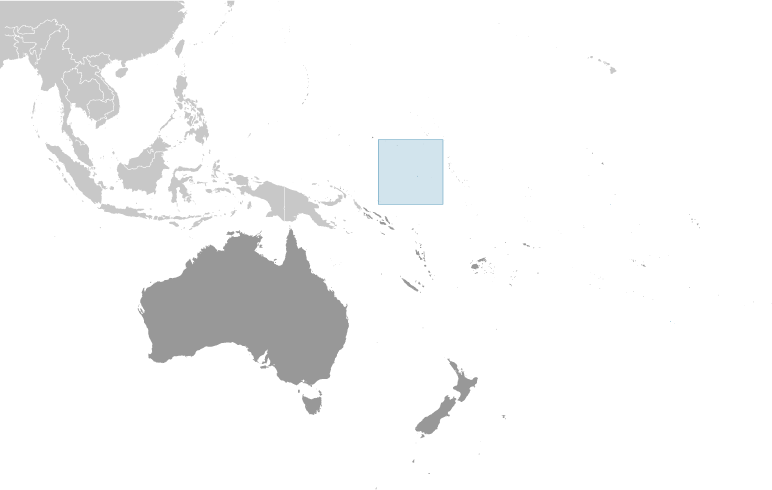
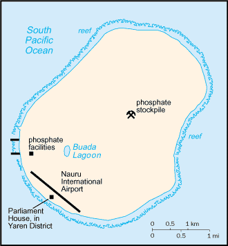

# Nauru

## Introduction

**_Background:_**   
The exact origins of the Nauruans are unclear since their language does not resemble any other in the Pacific region. Germany annexed the island in 1888. A German-British consortium began mining the island's phosphate deposits early in the 20th century. Australian forces occupied Nauru in World War I; it subsequently became a League of Nations mandate. After the Second World War - and a brutal occupation by Japan - Nauru became a UN trust territory. It achieved independence in 1968 and joined the UN in 1999 as the world's smallest independent republic.

## Geography

**_Location:_**   
Oceania, island in the South Pacific Ocean, south of the Marshall Islands

**_Geographic coordinates:_**   
0 32 S, 166 55 E

**_Map references:_**   
Oceania

**_Area:_**   
**total:** 21 sq km   
**land:** 21 sq km   
**water:** 0 sq km

**_Area - comparative:_**   
about 0.1 times the size of Washington, DC

**_Land boundaries:_**   
0 km

**_Coastline:_**   
30 km

**_Maritime claims:_**   
**territorial sea:** 12 nm   
**contiguous zone:** 24 nm   
**exclusive economic zone:** 200 nm

**_Climate:_**   
tropical with a monsoonal pattern; rainy season (November to February)

**_Terrain:_**   
sandy beach rises to fertile ring around raised coral reefs with phosphate plateau in center

**_Elevation extremes:_**   
**lowest point:** Pacific Ocean 0 m   
**highest point:** unnamed elevation along plateau rim 61 m

**_Natural resources:_**   
phosphates, fish

**_Land use:_**   
**arable land:** 0%   
**permanent crops:** 20%   
**other:** 80% (2011)

**_Irrigated land:_**   
NA

**_Natural hazards:_**   
periodic droughts

**_Environment - current issues:_**   
limited natural freshwater resources, roof storage tanks collect rainwater but mostly dependent on a single, aging desalination plant; intensive phosphate mining during the past 90 years - mainly by a UK, Australia, and NZ consortium - has left the central 90% of Nauru a wasteland and threatens limited remaining land resources

**_Environment - international agreements:_**   
**party to:** Biodiversity, Climate Change, Climate Change-Kyoto Protocol, Desertification, Hazardous Wastes, Law of the Sea, Marine Dumping, Ozone Layer Protection, Whaling   
**signed, but not ratified:** none of the selected agreements

**_Geography - note:_**   
world's smallest island country; situated just 53 km south of the Equator; Nauru is one of the three great phosphate rock islands in the Pacific Ocean - the others are Banaba (Ocean Island) in Kiribati and Makatea in French Polynesia

## People and Society

**_Nationality:_**   
**noun:** Nauruan(s)   
**adjective:** Nauruan

**_Ethnic groups:_**   
Nauruan 58%, other Pacific Islander 26%, Chinese 8%, European 8%

**_Languages:_**   
Nauruan 93% (official, a distinct Pacific Island language), English 2% (widely understood, spoken, and used for most government and commercial purposes), other 5% (includes I-Kiribati 2% and Chinese 2%)   
**note:** percentages represent main language spoken at home; Nauruan is spoken by 95% of the population, English by 66%, and other languages by 12% (2011 est.)

**_Religions:_**   
Protestant 60.4% (includes Nauru Congregational 35.7%, Assembly of God 13%, Nauru Independent Church 9.5%, Baptist 1.5%, and Seventh Day Adventist .7%), Roman Catholic 33%, other 3.7%, none 1.8%, unspecified 1.1% (2011 est.)

**_Population:_**   
9,488 (July 2014 est.)

**_Age structure:_**   
**0-14 years:** 32.5% (male 1,359/female 1,720)   
**15-24 years:** 16.9% (male 828/female 773)   
**25-54 years:** 42.7% (male 2,013/female 2,040)   
**55-64 years:** 6% (male 228/female 343)   
**65 years and over:** 1.8% (male 73/female 111) (2014 est.)

**_Median age:_**   
**total:** 25.3 years   
**male:** 25.6 years   
**female:** 25 years (2014 est.)

**_Population growth rate:_**   
0.56% (2014 est.)

**_Birth rate:_**   
25.61 births/1,000 population (2014 est.)

**_Death rate:_**   
5.9 deaths/1,000 population (2014 est.)

**_Net migration rate:_**   
-14.12 migrant(s)/1,000 population (2014 est.)

**_Urbanization:_**   
**urban population:** 100% of total population (2011)   
**rate of urbanization:** 0.59% annual rate of change (2010-15 est.)

**_Sex ratio:_**   
**at birth:** 0.84 male(s)/female   
**0-14 years:** 0.79 male(s)/female   
**15-24 years:** 1.07 male(s)/female   
**25-54 years:** 0.99 male(s)/female   
**55-64 years:** 0.9 male(s)/female   
**65 years and over:** 0.78 male(s)/female   
**total population:** 0.91 male(s)/female (2014 est.)

**_Mother's mean age at first birth:_**   
22.1   
**note:** median age at first birth among women 25-29 (2007 est.)

**_Infant mortality rate:_**   
**total:** 8.21 deaths/1,000 live births   
**male:** 10.54 deaths/1,000 live births   
**female:** 6.27 deaths/1,000 live births (2014 est.)

**_Life expectancy at birth:_**   
**total population:** 66.4 years   
**male:** 62.3 years   
**female:** 69.83 years (2014 est.)

**_Total fertility rate:_**   
2.93 children born/woman (2014 est.)

**_Contraceptive prevalence rate:_**   
35.6% (2007)

**_Health expenditures:_**   
9.8% of GDP (2011)

**_Physicians density:_**   
0.71 physicians/1,000 population (2010)

**_Drinking water source:_**   
**improved:** urban: 96.3% of population; total: 96.3% of population   
**unimproved:** urban: 3.7% of population; total: 3.7% of population (2012 est.)

**_Sanitation facility access:_**   
**improved:** urban: 65.6% of population; total: 65.6% of population   
**unimproved:** urban: 34.4% of population; total: 34.4% of population (2012 est.)

**_HIV/AIDS - adult prevalence rate:_**   
NA

**_HIV/AIDS - people living with HIV/AIDS:_**   
NA

**_HIV/AIDS - deaths:_**   
NA

**_Obesity - adult prevalence rate:_**   
71.1% (2008)

**_Children under the age of 5 years underweight:_**   
4.8% (2007)

**_Education expenditures:_**   
NA

**_Literacy:_**   
NA

**_School life expectancy (primary to tertiary education):_**   
**total:** 9 years   
**male:** 9 years   
**female:** 10 years (2008)

## Government

**_Country name:_**   
**conventional long form:** Republic of Nauru   
**conventional short form:** Nauru   
**local long form:** Republic of Nauru   
**local short form:** Nauru   
**former:** Pleasant Island

**_Government type:_**   
republic

**_Capital:_**   
no official capital; government offices in Yaren District   
**time difference:** UTC+12 (17 hours ahead of Washington, DC, during Standard Time)

**_Administrative divisions:_**   
14 districts; Aiwo, Anabar, Anetan, Anibare, Baiti, Boe, Buada, Denigomodu, Ewa, Ijuw, Meneng, Nibok, Uaboe, Yaren

**_Independence:_**   
31 January 1968 (from the Australia-, NZ-, and UK-administered UN trusteeship)

**_National holiday:_**   
Independence Day, 31 January (1968)

**_Constitution:_**   
effective 29 January 1968; amended 1968, 2009; note - in early 2013, further amendments were introduced (2013)

**_Legal system:_**   
mixed legal system of common law based on the English model and customary law

**_International law organization participation:_**   
has not submitted an ICJ jurisdiction declaration; accepts ICCt jurisdiction

**_Suffrage:_**   
20 years of age; universal and compulsory

**_Executive branch:_**   
**chief of state:** President Baron WAQA (since 11 June 2013); note - the president is both chief of state and head of government   
**head of government:** President Baron WAQA (since 11 June 2013)   
**cabinet:** Cabinet appointed by the president from among members of Parliament   
**elections:** president elected by Parliament for a three-year term; election last held on 11 June 2013 (next to be held in 2016)   
**election results:** Baron WAQA elected president on 11 June 2013

**_Legislative branch:_**   
unicameral parliament (19 seats; members elected by popular vote to serve three-year terms)   
**elections:** last held on 8 June 2013 (next to be held in 2016)   
**election results:** percent of vote - NA; seats - independents 19

**_Judicial branch:_**   
**highest court(s):** Supreme Court (consists of a chief justice and 1 judge)   
**judge selection and term of office:** judges appointed by the president to serve until age 65   
**subordinate courts:** District Court, Family Court

**_Political parties and leaders:_**   
Democratic Party [Kennan ADEANG]   
Nauru First (Naoero Amo) Party   
Nauru Party (informal)   
**note:** loose multiparty system

**_Political pressure groups and leaders:_**   
Woman Information and News Agency (women's issues)

**_International organization participation:_**   
ACP, ADB, AOSIS, C, FAO, G-77, ICAO, Interpol, IOC, IOM, ITU, OPCW, PIF, Sparteca, SPC, UN, UNCTAD, UNESCO, UPU, WHO

**_Diplomatic representation in the US:_**   
**chief of mission:** Ambassador Marlene Inemwin MOSES (since 10 February 2006)   
**chancery:** 800 2nd Avenue, Suite 400 D, New York, NY 10017   
**telephone:** [1] (212) 937-0074   
**FAX:** [1] (212) 937-0079   
**consulate(s):** Agana (Guam)

**_Diplomatic representation from the US:_**   
the US does not have an embassy in Nauru; the US Ambassador to Fiji, currently Ambassador Frankie A. REED, is accredited to Nauru

**_Flag description:_**   
blue with a narrow, horizontal, yellow stripe across the center and a large white 12-pointed star below the stripe on the hoist side; blue stands for the Pacific Ocean, the star indicates the country's location in relation to the Equator (the yellow stripe) and the 12 points symbolize the 12 original tribes of Nauru

**_National anthem:_**   
**name:** "Nauru Bwiema" (Song of Nauru)   
**lyrics/music:** Margaret HENDRIE/Laurence Henry HICKS   
**note:** adopted 1968

## Economy

**_Economy - overview:_**   
Revenues of this tiny island traditionally have come from exports of phosphates. Few other resources exist, with most necessities being imported, mainly from Australia, its former occupier and later major source of support. In 2005 an Australian company entered into an agreement to exploit remaining supplies. Primary reserves of phosphates were exhausted and mining ceased in 2006, but mining of a deeper layer of "secondary phosphate" in the interior of the island began the following year. The secondary phosphate deposits may last another 30 years. The rehabilitation of mined land and the replacement of income from phosphates are serious long-term problems. In anticipation of the exhaustion of Nauru's phosphate deposits, substantial amounts of phosphate income were invested in trust funds to help cushion the transition and provide for Nauru's economic future. As a result of heavy spending from the trust funds, the government faced virtual bankruptcy. To cut costs the government has frozen wages and reduced overstaffed public service departments. Nauru lost further revenue in 2008 with the closure of Australia's refugee processing center, making it almost totally dependent on food imports and foreign aid. Housing, hospitals, and other capital plant are deteriorating. The cost to Australia of keeping the government and economy afloat continues to climb. Few comprehensive statistics on the Nauru economy exist with estimates of Nauru's GDP varying widely.

**_GDP (purchasing power parity):_**   
$60 million (2005 est.)

**_GDP (official exchange rate):_**   
$NA

**_GDP - real growth rate:_**   
NA%

**_GDP - per capita (PPP):_**   
$5,000 (2005 est.)

**_GDP - composition, by sector of origin:_**   
**agriculture:** 6.1%   
**industry:** 33%   
**services:** 60.8% (2009 est.)

**_Agriculture - products:_**   
coconuts

**_Industries:_**   
phosphate mining, offshore banking, coconut products

**_Industrial production growth rate:_**   
NA%

**_Labor force - by occupation:_**   
**note:** most of the labor force is employed in phosphate mining, public administration, education, and transportation

**_Unemployment rate:_**   
90% (2004 est.)

**_Population below poverty line:_**   
NA%

**_Household income or consumption by percentage share:_**   
**lowest 10%:** NA%   
**highest 10%:** NA%

**_Budget:_**   
**revenues:** $13.5 million   
**expenditures:** $13.5 million (2005)

**_Fiscal year:_**   
1 July - 30 June

**_Inflation rate (consumer prices):_**   
NA% (2011 est.)

**_Exports:_**   
$64,000 (2005 est.)

**_Exports - commodities:_**   
phosphates

**_Imports:_**   
$NA (2004 est.)

**_Imports - commodities:_**   
food, fuel, manufactures, building materials, machinery

**_Debt - external:_**   
$33.3 million (2004 est.)

**_Exchange rates:_**   
Australian dollars (AUD) per US dollar -   
1.031 (2013)   
0.9658 (2011 est.)   
1.0902 (2010)   
1.2822 (2009)   
1.2059 (2008)

## Energy

**_Electricity - production:_**   
35 million kWh (2010 est.)

**_Electricity - consumption:_**   
32.55 million kWh (2010 est.)

**_Electricity - exports:_**   
0 kWh (2012 est.)

**_Electricity - imports:_**   
0 kWh (2012 est.)

**_Electricity - installed generating capacity:_**   
1,000 kW (2010 est.)

**_Electricity - from fossil fuels:_**   
100% of total installed capacity (2010 est.)

**_Electricity - from nuclear fuels:_**   
0% of total installed capacity (2010 est.)

**_Electricity - from hydroelectric plants:_**   
0% of total installed capacity (2010 est.)

**_Electricity - from other renewable sources:_**   
0% of total installed capacity (2010 est.)

**_Crude oil - production:_**   
0 bbl/day (2012 est.)

**_Crude oil - exports:_**   
0 bbl/day (2010 est.)

**_Crude oil - imports:_**   
0 bbl/day (2010 est.)

**_Crude oil - proved reserves:_**   
0 bbl (1 January 2013 est.)

**_Refined petroleum products - production:_**   
0 bbl/day (2010 est.)

**_Refined petroleum products - consumption:_**   
1,000 bbl/day (2011 est.)

**_Refined petroleum products - exports:_**   
0 bbl/day (2010 est.)

**_Refined petroleum products - imports:_**   
1,075 bbl/day (2010 est.)

**_Natural gas - production:_**   
0 cu m (2011 est.)

**_Natural gas - consumption:_**   
0 cu m (2010 est.)

**_Natural gas - exports:_**   
0 cu m (2011 est.)

**_Natural gas - imports:_**   
0 cu m (2011 est.)

**_Natural gas - proved reserves:_**   
0 cu m (1 January 2013 est.)

**_Carbon dioxide emissions from consumption of energy:_**   
168,800 Mt (2011 est.)

## Communications

**_Telephones - main lines in use:_**   
1,900 (2009)

**_Telephones - mobile cellular:_**   
6,800 (2012)

**_Telephone system:_**   
**general assessment:** adequate local and international radiotelephone communication provided via Australian facilities   
**international:** country code - 674; satellite earth station - 1 Intelsat (Pacific Ocean)

**_Broadcast media:_**   
1 government-owned TV station broadcasting programs from New Zealand sent via satellite or on videotape; 1 government-owned radio station, broadcasting on AM and FM, utilizes Australian and British programs (2009)

**_Internet country code:_**   
.nr

**_Internet hosts:_**   
8,162 (2012)

## Transportation

**_Airports:_**   
1 (2013)

**_Airports - with paved runways:_**   
**total:** 1   
**1,524 to 2,437 m:** 1 (2013)

**_Roadways:_**   
**total:** 30 km   
**paved:** 24 km   
**unpaved:** 6 km (2002)

**_Ports and terminals:_**   
**major seaport(s):** Nauru

## Military

**_Military branches:_**   
no regular military forces (2012)

**_Manpower available for military service:_**   
**males age 16-49:** 2,542 (2010 est.)

**_Manpower fit for military service:_**   
**males age 16-49:** 1,823   
**females age 16-49:** 2,034 (2010 est.)

**_Manpower reaching militarily significant age annually:_**   
**male:** 74   
**female:** 78 (2010 est.)

**_Military - note:_**   
Nauru maintains no defense forces; under an informal agreement, defense is the responsibility of Australia

## Transnational Issues

**_Disputes - international:_**   
none

............................................................   
_Page last updated on June 20, 2014_
