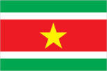
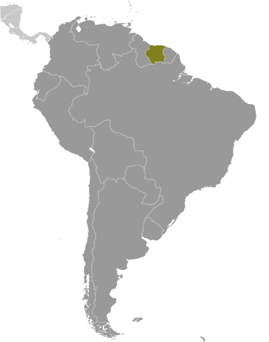
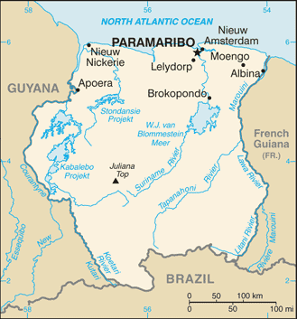

# Suriname

## Introduction

**_Background:_**   
First explored by the Spaniards in the 16th century and then settled by the English in the mid-17th century, Suriname became a Dutch colony in 1667. With the abolition of African slavery in 1863, workers were brought in from India and Java. Independence from the Netherlands was granted in 1975. Five years later the civilian government was replaced by a military regime that soon declared a socialist republic. It continued to exert control through a succession of nominally civilian administrations until 1987, when international pressure finally forced a democratic election. In 1990, the military overthrew the civilian leadership, but a democratically elected government - a four-party coalition - returned to power in 1991. The coalition expanded to eight parties in 2005 and ruled until August 2010, when voters returned former military leader Desire BOUTERSE and his opposition coalition to power.

## Geography

**_Location:_**   
Northern South America, bordering the North Atlantic Ocean, between French Guiana and Guyana

**_Geographic coordinates:_**   
4 00 N, 56 00 W

**_Map references:_**   
South America

**_Area:_**   
**total:** 163,820 sq km   
**land:** 156,000 sq km   
**water:** 7,820 sq km

**_Area - comparative:_**   
slightly larger than Georgia

**_Land boundaries:_**   
**total:** 1,703 km   
**border countries:** Brazil 593 km, French Guiana 510 km, Guyana 600 km

**_Coastline:_**   
386 km

**_Maritime claims:_**   
**territorial sea:** 12 nm   
**exclusive economic zone:** 200 nm

**_Climate:_**   
tropical; moderated by trade winds

**_Terrain:_**   
mostly rolling hills; narrow coastal plain with swamps

**_Elevation extremes:_**   
**lowest point:** unnamed location in the coastal plain -2 m   
**highest point:** Juliana Top 1,230 m

**_Natural resources:_**   
timber, hydropower, fish, kaolin, shrimp, bauxite, gold, and small amounts of nickel, copper, platinum, iron ore

**_Land use:_**   
**arable land:** 0.36%   
**permanent crops:** 0.04%   
**other:** 99.6% (2011)

**_Irrigated land:_**   
511.8 sq km (2003)

**_Total renewable water resources:_**   
122 cu km (2011)

**_Freshwater withdrawal (domestic/industrial/agricultural):_**   
**total:** 0.67 cu km/yr (6%/4%/90%)   
**per capita:** 1,396 cu m/yr (2006)

**_Natural hazards:_**   
NA

**_Environment - current issues:_**   
deforestation as timber is cut for export; pollution of inland waterways by small-scale mining activities

**_Environment - international agreements:_**   
**party to:** Biodiversity, Climate Change, Climate Change-Kyoto Protocol, Desertification, Endangered Species, Law of the Sea, Marine Dumping, Ozone Layer Protection, Ship Pollution, Tropical Timber 94, Wetlands, Whaling   
**signed, but not ratified:** none of the selected agreements

**_Geography - note:_**   
smallest independent country on South American continent; mostly tropical rain forest; great diversity of flora and fauna that, for the most part, is increasingly threatened by new development; relatively small population, mostly along the coast

## People and Society

**_Nationality:_**   
**noun:** Surinamer(s)   
**adjective:** Surinamese

**_Ethnic groups:_**   
Hindustani (also known locally as "East Indians"; their ancestors emigrated from northern India in the latter part of the 19th century) 37%, Creole (mixed white and black) 31%, Javanese 15%, "Maroons" (their African ancestors were brought to the country in the 17th and 18th centuries as slaves and escaped to the interior) 10%, Amerindian 2%, Chinese 2%, white 1%, other 2%

**_Languages:_**   
Dutch (official), English (widely spoken), Sranang Tongo (Surinamese, sometimes called Taki-Taki, is native language of Creoles and much of the younger population and is lingua franca among others), Caribbean Hindustani (a dialect of Hindi), Javanese

**_Religions:_**   
Hindu 27.4%, Protestant 25.2% (predominantly Moravian), Roman Catholic 22.8%, Muslim 19.6%, indigenous beliefs 5%

**_Demographic profile:_**   
Suriname is a pluralistic society consisting primarily of Creoles (persons of mixed African and European heritage), the descendants of escaped African slaves known as Maroons, and the descendants of Indian and Javanese contract workers. The country overall is in full, post-industrial demographic transition, with a low fertility rate, a moderate mortality rate, and a rising life expectancy. However, the Maroon population of the rural interior lags behind because of lower educational attainment and contraceptive use, higher malnutrition, and significantly less access to electricity, potable water, sanitation, infrastructure, and health care.   
Some 350,000 people of Surinamese descent live in the Netherlands, Suriname's former colonial ruler. In the 19th century, better-educated, largely Dutch-speaking Surinamese began emigrating to the Netherlands. World War II interrupted the outflow, but it resumed after the war when Dutch labor demands grew - emigrants included all segments of the Creole population. Suriname still is strongly influenced by the Netherlands because most Surinamese have relatives living there and it is the largest supplier of development aid. Other emigration destinations include French Guiana and the United States. Suriname's immigration rules are flexible, and the country is easy to enter illegally because rainforests obscure its borders. Since the mid-1980s, Brazilians have settled in Suriname's capital, Paramaribo, or eastern Suriname, where they mine gold. This immigration is likely to slowly re-orient Suriname toward its Latin American roots.

**_Population:_**   
573,311 (July 2014 est.)

**_Age structure:_**   
**0-14 years:** 26.2% (male 76,565/female 73,676)   
**15-24 years:** 17.6% (male 51,322/female 49,313)   
**25-54 years:** 44.1% (male 128,620/female 124,034)   
**55-64 years:** 6.5% (male 18,140/female 19,158)   
**65 years and over:** 5.6% (male 14,041/female 18,442) (2014 est.)

**_Dependency ratios:_**   
**total dependency ratio:** 50.7 %   
**youth dependency ratio:** 40.6 %   
**elderly dependency ratio:** 10.1 %   
**potential support ratio:** 9.9 (2014 est.)

**_Median age:_**   
**total:** 28.6 years   
**male:** 28.3 years   
**female:** 29 years (2014 est.)

**_Population growth rate:_**   
1.12% (2014 est.)

**_Birth rate:_**   
16.73 births/1,000 population (2014 est.)

**_Death rate:_**   
6.13 deaths/1,000 population (2014 est.)

**_Net migration rate:_**   
0.57 migrant(s)/1,000 population (2014 est.)

**_Urbanization:_**   
**urban population:** 69.7% of total population (2011)   
**rate of urbanization:** 1.44% annual rate of change (2010-15 est.)

**_Major urban areas - population:_**   
PARAMARIBO (capital) 278,000 (2011)

**_Sex ratio:_**   
**at birth:** 1.05 male(s)/female   
**0-14 years:** 1.04 male(s)/female   
**15-24 years:** 1.04 male(s)/female   
**25-54 years:** 1.04 male(s)/female   
**55-64 years:** 1.01 male(s)/female   
**65 years and over:** 0.77 male(s)/female   
**total population:** 1.01 male(s)/female (2014 est.)

**_Maternal mortality rate:_**   
130 deaths/100,000 live births (2010)

**_Infant mortality rate:_**   
**total:** 27.07 deaths/1,000 live births   
**male:** 31.5 deaths/1,000 live births   
**female:** 22.41 deaths/1,000 live births (2014 est.)

**_Life expectancy at birth:_**   
**total population:** 71.69 years   
**male:** 69.31 years   
**female:** 74.18 years (2014 est.)

**_Total fertility rate:_**   
2.01 children born/woman (2014 est.)

**_Contraceptive prevalence rate:_**   
45.6% (2006)

**_Health expenditures:_**   
5.3% of GDP (2011)

**_Physicians density:_**   
0.91 physicians/1,000 population (2004)

**_Hospital bed density:_**   
3.1 beds/1,000 population (2010)

**_Drinking water source:_**   
**improved:** urban: 98.1% of population; rural: 88.4% of population; total: 95.2% of population   
**unimproved:** urban: 1.9% of population; rural: 11.6% of population; total: 4.8% of population (2012 est.)

**_Sanitation facility access:_**   
**improved:** urban: 88.4% of population; rural: 61.4% of population; total: 80.3% of population   
**unimproved:** urban: 11.6% of population; rural: 38.6% of population; total: 19.7% of population (2012 est.)

**_HIV/AIDS - adult prevalence rate:_**   
1.1% (2012 est.)

**_HIV/AIDS - people living with HIV/AIDS:_**   
4,000 (2012 est.)

**_HIV/AIDS - deaths:_**   
100 (2012 est.)

**_Major infectious diseases:_**   
**degree of risk:** very high   
**food or waterborne diseases:** bacterial and protozoal diarrhea, hepatitis A, and typhoid fever   
**vectorborne disease:** dengue fever and malaria (2013)

**_Obesity - adult prevalence rate:_**   
25.1% (2008)

**_Children under the age of 5 years underweight:_**   
5.8% (2010)

**_Education expenditures:_**   
NA

**_Literacy:_**   
**definition:** age 15 and over can read and write   
**total population:** 94.7%   
**male:** 95.4%   
**female:** 94% (2010 est.)

**_School life expectancy (primary to tertiary education):_**   
**total:** 12 years   
**male:** 11 years   
**female:** 13 years (2002)

**_Child labor - children ages 5-14:_**   
**total number:** 6,094   
**percentage:** 6 % (2006 est.)

**_Unemployment, youth ages 15-24:_**   
**total:** 21.5% (2004)

## Government

**_Country name:_**   
**conventional long form:** Republic of Suriname   
**conventional short form:** Suriname   
**local long form:** Republiek Suriname   
**local short form:** Suriname   
**former:** Netherlands Guiana, Dutch Guiana

**_Government type:_**   
constitutional democracy

**_Capital:_**   
**name:** Paramaribo   
**geographic coordinates:** 5 50 N, 55 10 W   
**time difference:** UTC-3 (2 hours ahead of Washington, DC, during Standard Time)

**_Administrative divisions:_**   
10 districts (distrikten, singular - distrikt); Brokopondo, Commewijne, Coronie, Marowijne, Nickerie, Para, Paramaribo, Saramacca, Sipaliwini, Wanica

**_Independence:_**   
25 November 1975 (from the Netherlands)

**_National holiday:_**   
Independence Day, 25 November (1975)

**_Constitution:_**   
previous 1975; latest ratified 30 September 1987, effective 30 October 1987; amended 1992; note - in 2012, the president appointed a commission to revise the constitution (2012)

**_Legal system:_**   
civil law system influenced by Dutch civil law; note - the Commissie Nieuw Surinaamse Burgerlijk Wetboek completed drafting a new civil code in February 2009

**_International law organization participation:_**   
accepts compulsory ICJ jurisdiction with reservations; accepts ICCt jurisdiction

**_Suffrage:_**   
18 years of age; universal

**_Executive branch:_**   
**chief of state:** President Desire Delano BOUTERSE (since 12 August 2010); Vice President Robert AMEERALI (since 12 August 2010); note - the president is both the chief of state and head of government   
**head of government:** President Desire Delano BOUTERSE (since 12 August 2010); Vice President Robert AMEERALI (since 12 August 2010)   
**cabinet:** Cabinet of Ministers appointed by the president   
**elections:** president and vice president elected by the National Assembly or, if no presidential or vice presidential candidate receives a two-thirds constitutional majority in the National Assembly after two votes, by a simple majority in the larger United People's Assembly (893 representatives from the national, local, and regional councils), for five-year terms (no term limits); election last held on 19 July 2010 (next to be held in 2015)   
**election results:** Desire Delano BOUTERSE elected president; percent of vote - Desire Delano BOUTERSE 70.6%, Chandrikapersad SATOKHI 25.5%, other 3.9%

**_Legislative branch:_**   
unicameral National Assembly or Nationale Assemblee (51 seats; members elected by popular vote to serve five-year terms)   
**elections:** last held on 25 May 2010 (next to be held in May 2015)   
**election results:** percent of vote by party - Mega Combination 45.1%, New Front 27.5%, A-Com 13.7%, People's Alliance 11.8%, DOE 1.9%; seats by party - Mega Combination 23, New Front 14, A-Com 7, People's Alliance 6, DOE 1

**_Judicial branch:_**   
**highest court(s):** High Court of Justice of Suriname (consists of the court president, vice president, and 4 judges); note - Suriname can appeal beyond its High Court to the Caribbean Court of Justice, with final appeal to the Judicial Committee of the Privy Council (in London)   
**judge selection and term of office:** court judges appointed by the national president after consultation with the High Court; judges appointed for life   
**subordinate courts:** cantonal courts

**_Political parties and leaders:_**   
A-Combination (a coalition that includes the General Liberation and Development Party ABOP [Ronnie BRUNSWIJK], and SEEKA [Paul ABENA])   
Basic Party for Renewal and Democracy or BVD [Dilip SARDJOE]   
Basic Party for Renewal and Democracy or PVF [Soedeschand JAIRAM]   
Democratic Union Suriname or DUS [Japhet DIEKO]   
Mega Combination Coalition (a coalition that joined with A-Combination and the PL to form a majority in Parliament in 2010 - includes the National Democratic Party or NDP [Desire Delano BOUTERSE] (largest party in the coalition), Progressive Worker and Farmer's Union or PALU [Jim HOK], Party for National Unity and Solidarity of the Highest Order or KTPI [Willy SOEMITA], DNP-2000 [Jules WIJDENBOSCH], Union of Brotherhood and Unity in Politics BEP [Caprino ALENDY], and New Suriname or NS [Nanan PANDAY])   
National Union or NU [P. VAN LEEUWAARDE]   
New Front for Democracy and Development or NF (a coalition made up of the National Party of Suriname or NPS [Runaldo VENETIAAN], United Reform Party or VHP [Ramdien SARDJOE], Democratic Alternative 1991 or DA-91 - an independent, business-oriented party [Winston JESSURUN], Surinamese Labor Party or SPA [Siegfried GILDS])   
Party for Democracy and Development in Unity or DOE [Carl BREEVELD]   
Party for the Permanent Prosperity Republic Suriname or PVRS   
People's Alliance, Pertjaja Luhur's or PL [Paul SOMOHARDJO](includes D-21 [Soewarta MOESTADJA] and Pendawa Lima [Raymond SAPEON], which merged with PL in 2010)   
**note:** BVD and PVF participated in the elections as a coalition (BVD/PVF) in the most recent elections, but separated after the election

**_Political pressure groups and leaders:_**   
Association of Indigenous Village Chiefs [Ricardo PANE]   
Association of Saramaccan Authorities or Maroon [Head Captain WASE]   
Women's Parliament Forum or PVF [Iris GILLIAD]

**_International organization participation:_**   
ACP, AOSIS, Caricom, CD, CELAC, FAO, G-77, IADB, IBRD, ICAO, ICRM, IDA, IDB, IFAD, IFRCS, IHO, ILO, IMF, IMO, Interpol, IOC, IPU, ISO (correspondent), ITU, ITUC (NGOs), LAES, MIGA, NAM, OAS, OIC, OPANAL, OPCW, PCA, Petrocaribe, UN, UNASUR, UNCTAD, UNESCO, UNIDO, UPU, WHO, WIPO, WMO, WTO

**_Diplomatic representation in the US:_**   
**chief of mission:** Ambassador Subhas-Chandra MUNGRA (since 28 January 2011)   
**chancery:** Suite 460, 4301 Connecticut Avenue NW, Washington, DC 20008   
**telephone:** [1] (202) 244-7488   
**FAX:** [1] (202) 244-5878   
**consulate(s) general:** Miami

**_Diplomatic representation from the US:_**   
**chief of mission:** Ambassador Jay N. ANANIA (since 1 October 2012)   
**embassy:** Dr. Sophie Redmondstraat 129, Paramaribo   
**mailing address:** US Department of State, PO Box 1821, Paramaribo   
**telephone:** [597] 472-900   
**FAX:** [597] 410-972

**_Flag description:_**   
five horizontal bands of green (top, double width), white, red (quadruple width), white, and green (double width); a large, yellow, five-pointed star is centered in the red band; red stands for progress and love; green symbolizes hope and fertility; white signifies peace, justice, and freedom; the star represents the unity of all ethnic groups; from its yellow light the nation draws strength to bear sacrifices patiently while working toward a golden future

**_National anthem:_**   
**name:** "God zij met ons Suriname!" (God Be With Our Suriname)   
**lyrics/music:** Cornelis Atses HOEKSTRA and Henry DE ZIEL/Johannes Corstianus DE PUY   
**note:** adopted 1959; the anthem, originally adapted from a Sunday school song written in 1893, contains lyrics in both Dutch and Sranang Tongo

## Economy

**_Economy - overview:_**   
The economy is dominated by the mining industry, with exports of alumina, gold, and oil accounting for about 85% of exports and 25% of government revenues, making the economy highly vulnerable to mineral price volatility. Economic growth has remained at about 4-5% per year in 2010-13, but the government's budget was strained by high inflation in 2010. In January 2011, the government devalued the currency by 20% and raised taxes to reduce the budget deficit. As a result of these measures, inflation has receded to about 4% in 2013. Suriname's economic prospects for the medium term will depend on continued commitment to responsible monetary and fiscal policies and to the introduction of structural reforms to liberalize markets and promote competition. The government's reliance on revenue from extractive industries will temper Suriname's economic outlook, especially if gold prices continue their downward trend.

**_GDP (purchasing power parity):_**   
$7.12 billion (2013 est.)   
$6.801 billion (2012 est.)   
$6.492 billion (2011 est.)   
**note:** data are in 2013 US dollars

**_GDP (official exchange rate):_**   
$5.009 billion (2013 est.)

**_GDP - real growth rate:_**   
4.7% (2013 est.)   
4.8% (2012 est.)   
4.7% (2011 est.)

**_GDP - per capita (PPP):_**   
$12,900 (2013 est.)   
$12,500 (2012 est.)   
$12,100 (2011 est.)   
**note:** data are in 2013 US dollars

**_GDP - composition, by end use:_**   
**household consumption:** 73.8%   
**government consumption:** 9.9%   
**investment in fixed capital:** 5%   
**investment in inventories:** 19.7%   
**exports of goods and services:** 43.2%   
**imports of goods and services:** -51.6%; (2013 est.)

**_GDP - composition, by sector of origin:_**   
**agriculture:** 8.9%   
**industry:** 36.6%   
**services:** 54.5% (2013 est.)

**_Agriculture - products:_**   
rice, bananas, palm kernels, coconuts, plantains, peanuts; beef, chickens; shrimp; forest products

**_Industries:_**   
bauxite and gold mining, alumina production; oil, lumbering, food processing, fishing

**_Industrial production growth rate:_**   
4% (2013 est.)

**_Labor force:_**   
165,600 (2007)

**_Labor force - by occupation:_**   
**agriculture:** 8%   
**industry:** 14%   
**services:** 78% (2004)

**_Unemployment rate:_**   
9% (2008)   
12.1% (2006)

**_Population below poverty line:_**   
70% (2002 est.)

**_Household income or consumption by percentage share:_**   
**lowest 10%:** NA%   
**highest 10%:** NA%

**_Budget:_**   
**revenues:** $826.6 million   
**expenditures:** $939.7 million (2010 est.)

**_Taxes and other revenues:_**   
16.5% of GDP (2010 est.)

**_Budget surplus (+) or deficit (-):_**   
-2.3% of GDP (2010 est.)

**_Fiscal year:_**   
calendar year

**_Inflation rate (consumer prices):_**   
4.2% (2013 est.)   
5% (2012 est.)

**_Commercial bank prime lending rate:_**   
12% (31 December 2013 est.)   
11.73% (31 December 2012 est.)

**_Stock of narrow money:_**   
$1.132 billion (31 December 2012 est.)   
$1.075 billion (31 December 2011 est.)

**_Stock of broad money:_**   
$3.005 million (31 December 2013 est.)   
$2.463 million (31 December 2012 est.)

**_Stock of domestic credit:_**   
$939.4 million (31 December 2013 est.)   
$1.275 billion (31 December 2012 est.)

**_Market value of publicly traded shares:_**   
$NA

**_Current account balance:_**   
$102.5 million (2013 est.)   
$241.4 million (2012 est.)

**_Exports:_**   
$2.512 billion (2013 est.)   
$2.564 billion (2012 est.)

**_Exports - commodities:_**   
alumina, gold, crude oil, lumber, shrimp and fish, rice, bananas

**_Exports - partners:_**   
US 25.7%, Belgium 17.4%, UAE 11.5%, Canada 10.3%, Guyana 5.8%, France 5.5%, Barbados 4.2% (2012)

**_Imports:_**   
$1.778 billion (2013 est.)   
$1.761 billion (2012 est.)

**_Imports - commodities:_**   
capital equipment, petroleum, foodstuffs, cotton, consumer goods

**_Imports - partners:_**   
US 26%, Netherlands 16%, China 9.9%, UAE 8.1%, Antigua and Barbuda 6.7%, Netherlands Antilles 4.9%, Japan 4.3% (2012)

**_Reserves of foreign exchange and gold:_**   
$1.008 billion (31 December 2012 est.)   
$816.9 million (31 December 2011 est.)

**_Debt - external:_**   
$860 million (31 December 2013 est.)   
$810.8 million (31 December 2012 est.)

**_Exchange rates:_**   
Surinamese dollars (SRD) per US dollar -   
3.3 (2012 est.)   
3.3 (2012 est.)   
2.7454 (2010 est.)   
2.745 (2009)   
2.745 (2008)

## Energy

**_Electricity - production:_**   
1.57 billion kWh (2010 est.)

**_Electricity - consumption:_**   
1.423 billion kWh (2010 est.)

**_Electricity - exports:_**   
0 kWh (2012 est.)

**_Electricity - imports:_**   
0 kWh (2012 est.)

**_Electricity - installed generating capacity:_**   
410,000 kW (2010 est.)

**_Electricity - from fossil fuels:_**   
53.9% of total installed capacity (2010 est.)

**_Electricity - from nuclear fuels:_**   
0% of total installed capacity (2010 est.)

**_Electricity - from hydroelectric plants:_**   
46.1% of total installed capacity (2010 est.)

**_Electricity - from other renewable sources:_**   
0% of total installed capacity (2010 est.)

**_Crude oil - production:_**   
15,270 bbl/day (2012 est.)

**_Crude oil - exports:_**   
7,621 bbl/day (2010 est.)

**_Crude oil - imports:_**   
0.66 bbl/day (2010 est.)

**_Crude oil - proved reserves:_**   
76.8 million bbl (1 January 2013 est.)

**_Refined petroleum products - production:_**   
7,462 bbl/day (2010 est.)

**_Refined petroleum products - consumption:_**   
14,100 bbl/day (2011 est.)

**_Refined petroleum products - exports:_**   
1,015 bbl/day (2010 est.)

**_Refined petroleum products - imports:_**   
6,454 bbl/day (2010 est.)

**_Natural gas - production:_**   
0 cu m (2011 est.)

**_Natural gas - consumption:_**   
0 cu m (2010 est.)

**_Natural gas - exports:_**   
0 cu m (2011 est.)

**_Natural gas - imports:_**   
0 cu m (2011 est.)

**_Natural gas - proved reserves:_**   
0 cu m (1 January 2011 est.)

**_Carbon dioxide emissions from consumption of energy:_**   
2.335 million Mt (2011 est.)

## Communications

**_Telephones - main lines in use:_**   
83,000 (2012)

**_Telephones - mobile cellular:_**   
977,000 (2012)

**_Telephone system:_**   
**general assessment:** international facilities are good   
**domestic:** combined fixed-line and mobile-cellular teledensity 185 telephones per 100 persons; microwave radio relay network   
**international:** country code - 597; satellite earth stations - 2 Intelsat (Atlantic Ocean) (2010)

**_Broadcast media:_**   
2 state-owned TV stations; 1 state-owned radio station; multiple private radio and TV stations (2007)

**_Internet country code:_**   
.sr

**_Internet hosts:_**   
188 (2012)

**_Internet users:_**   
163,000 (2009)

## Transportation

**_Airports:_**   
55 (2013)

**_Airports - with paved runways:_**   
**total:** 6   
**over 3,047 m:** 1   
**under 914 m:** 5 (2013)

**_Airports - with unpaved runways:_**   
**total:** 49   
**914 to 1,523 m:** 4   
**under 914 m:** 45 (2013)

**_Pipelines:_**   
oil 50 km (2013)

**_Roadways:_**   
**total:** 4,304 km   
**paved:** 1,130 km   
**unpaved:** 3,174 km (2003)

**_Waterways:_**   
1,200 km (most navigable by ships with drafts up to 7 m) (2011)

**_Ports and terminals:_**   
**major seaport(s):** Paramaribo, Wageningen

## Military

**_Military branches:_**   
Suriname Armed Forces: Ground Forces, Naval Forces, Air Forces (2010)

**_Military service age and obligation:_**   
18 is the legal minimum age for voluntary military service; no conscription; personnel drawn almost exclusively from the Creole community (2012)

**_Manpower available for military service:_**   
**males age 16-49:** 134,218   
**females age 16-49:** 134,439 (2010 est.)

**_Manpower fit for military service:_**   
**males age 16-49:** 109,445   
**females age 16-49:** 112,538 (2010 est.)

**_Manpower reaching militarily significant age annually:_**   
**male:** 4,119   
**female:** 4,106 (2010 est.)

## Transnational Issues

**_Disputes - international:_**   
area claimed by French Guiana between Riviere Litani and Riviere Marouini (both headwaters of the Lawa); Suriname claims a triangle of land between the New and Kutari/Koetari rivers in a historic dispute over the headwaters of the Courantyne; Guyana seeks United Nations Convention on the Law of the Sea arbitration to resolve the longstanding dispute with Suriname over the axis of the territorial sea boundary in potentially oil-rich waters

**_Trafficking in persons:_**   
**current situation:** Suriname is a source, destination, and transit country for women, men, and children who are subjected to sex trafficking and forced labor; women and girls from Suriname, Guyana, Brazil, and the Dominican Republic are subjected to sex trafficking in the country, sometimes around mining camps; debt bondage and sex trafficking are reported to occur within the Chinese migrant community; migrant workers in agriculture and on fishing boats and children working in informal urban sectors and gold mines are vulnerable to forced labor   
**tier rating:** Tier 2 Watch List - Suriname does not fully comply with the minimum standards for the elimination of trafficking; however, it is making significant efforts to do so; the government has prosecuted an increased number of sex trafficking cases and identified an increased number of child sex trafficking victims; accountability for trafficking offenses continues to be a problem as no offenders have been convicted and the complicity of local officials remains a concern; authorities do not have a formal system for referring victims to NGOs that provide services but reported doing so on an ad hoc basis; the government's interagency anti-trafficking working group drafted an anti-trafficking policy in 2012 (2013)

**_Illicit drugs:_**   
growing transshipment point for South American drugs destined for Europe via the Netherlands and Brazil; transshipment point for arms-for-drugs dealing

............................................................   
_Page last updated on June 20, 2014_
