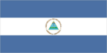
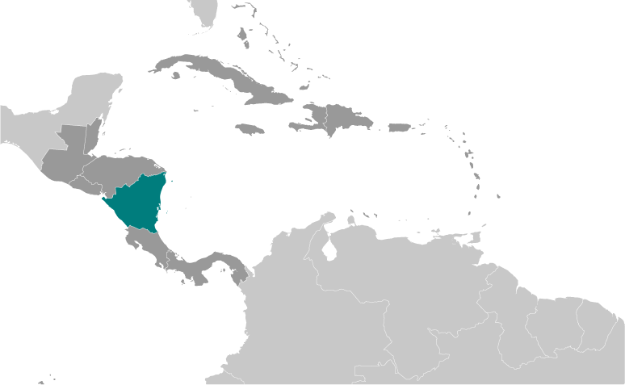
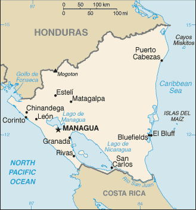

# Nicaragua

## Introduction

**_Background:_**   
The Pacific coast of Nicaragua was settled as a Spanish colony from Panama in the early 16th century. Independence from Spain was declared in 1821 and the country became an independent republic in 1838. Britain occupied the Caribbean Coast in the first half of the 19th century, but gradually ceded control of the region in subsequent decades. Violent opposition to governmental manipulation and corruption spread to all classes by 1978 and resulted in a short-lived civil war that brought the Marxist Sandinista guerrillas to power in 1979. Nicaraguan aid to leftist rebels in El Salvador caused the US to sponsor anti-Sandinista contra guerrillas through much of the 1980s. After losing free and fair elections in 1990, 1996, and 2001, former Sandinista President Daniel ORTEGA Saavedra was elected president in 2006 and reelected in 2011. The 2008 municipal elections, 2010 regional elections, 2011 presidential elections, 2012 municipal elections, and 2013 regional elections were marred by widespread irregularities. Nicaragua's infrastructure and economy - hard hit by the earlier civil war and by Hurricane Mitch in 1998 - are slowly being rebuilt, but democratic institutions have been weakened under the ORTEGA administration.

## Geography

**_Location:_**   
Central America, bordering both the Caribbean Sea and the North Pacific Ocean, between Costa Rica and Honduras

**_Geographic coordinates:_**   
13 00 N, 85 00 W

**_Map references:_**   
Central America and the Caribbean

**_Area:_**   
**total:** 130,370 sq km   
**land:** 119,990 sq km   
**water:** 10,380 sq km

**_Area - comparative:_**   
slightly larger than Pennsylvania; slightly smaller than New York state

**_Land boundaries:_**   
**total:** 1,231 km   
**border countries:** Costa Rica 309 km, Honduras 922 km

**_Coastline:_**   
910 km

**_Maritime claims:_**   
**territorial sea:** 12 nm   
**contiguous zone:** 24 nm   
**continental shelf:** natural prolongation

**_Climate:_**   
tropical in lowlands, cooler in highlands

**_Terrain:_**   
extensive Atlantic coastal plains rising to central interior mountains; narrow Pacific coastal plain interrupted by volcanoes

**_Elevation extremes:_**   
**lowest point:** Pacific Ocean 0 m   
**highest point:** Mogoton 2,438 m

**_Natural resources:_**   
gold, silver, copper, tungsten, lead, zinc, timber, fish

**_Land use:_**   
**arable land:** 14.57%   
**permanent crops:** 1.76%   
**other:** 83.66% (2011)

**_Irrigated land:_**   
942.4 sq km (2003)

**_Total renewable water resources:_**   
196.6 cu km (2011)

**_Freshwater withdrawal (domestic/industrial/agricultural):_**   
**total:** 1.39 cu km/yr (23%/4%/73%)   
**per capita:** 265.9 cu m/yr (2008)

**_Natural hazards:_**   
destructive earthquakes; volcanoes; landslides; extremely susceptible to hurricanes   
**volcanism:** significant volcanic activity; Cerro Negro (elev. 728 m), which last erupted in 1999, is one of Nicaragua's most active volcanoes; its lava flows and ash have been known to cause significant damage to farmland and buildings; other historically active volcanoes include Concepcion, Cosiguina, Las Pilas, Masaya, Momotombo, San Cristobal, and Telica

**_Environment - current issues:_**   
deforestation; soil erosion; water pollution

**_Environment - international agreements:_**   
**party to:** Biodiversity, Climate Change, Climate Change-Kyoto Protocol, Desertification, Endangered Species, Environmental Modification, Hazardous Wastes, Law of the Sea, Ozone Layer Protection, Ship Pollution, Wetlands, Whaling   
**signed, but not ratified:** none of the selected agreements

**_Geography - note:_**   
largest country in Central America; contains the largest freshwater body in Central America, Lago de Nicaragua

## People and Society

**_Nationality:_**   
**noun:** Nicaraguan(s)   
**adjective:** Nicaraguan

**_Ethnic groups:_**   
mestizo (mixed Amerindian and white) 69%, white 17%, black 9%, Amerindian 5%

**_Languages:_**   
Spanish (official) 95.3%, Miskito 2.2%, Mestizo of the Caribbean coast 2%, other 0.5%   
**note:** English and indigenous languages found on the Caribbean coast (2005 est.)

**_Religions:_**   
Roman Catholic 58.5%, Protestant 23.2% (Evangelical 21.6%, Moravian 1.6%), Jehovah's Witnesses 0.9%, other 1.6%, none 15.7% (2005 est.)

**_Demographic profile:_**   
Despite being one of the poorest countries in Latin America, Nicaragua has improved its access to potable water and sanitation and has ameliorated its life expectancy, infant and child mortality, and immunization rates. However, income distribution is very uneven, and the poor, agriculturalists, and indigenous people continue to have less access to healthcare services. Nicaragua's total fertility rate has fallen from around 6 children per woman in 1980 to just above replacement level today, but the high birth rate among adolescents perpetuates a cycle of poverty and low educational attainment.   
Nicaraguans emigrate primarily to Costa Rica and to a lesser extent the United States. Nicaraguan men have been migrating seasonally to Costa Rica to harvest bananas and coffee since the early 20th century. Political turmoil, civil war, and natural disasters from the 1970s through the 1990s dramatically increased the flow of refugees and permanent migrants seeking jobs, higher wages, and better social and healthcare benefits. Since 2000, Nicaraguan emigration to Costa Rica has slowed and stabilized. Today roughly 300,000 Nicaraguans are permanent residents of Costa Rica - about 75% of the foreign population - and thousands more migrate seasonally for work, many illegally.

**_Population:_**   
5,848,641 (July 2014 est.)

**_Age structure:_**   
**0-14 years:** 29.3% (male 873,545/female 839,853)   
**15-24 years:** 22.4% (male 657,076/female 652,856)   
**25-54 years:** 38% (male 1,051,656/female 1,173,084)   
**55-64 years:** 5.4% (male 147,405/female 169,618)   
**65 years and over:** 4.7% (male 127,699/female 155,849) (2014 est.)

**_Dependency ratios:_**   
**total dependency ratio:** 58.8 %   
**youth dependency ratio:** 51.4 %   
**elderly dependency ratio:** 7.4 %   
**potential support ratio:** 13.4 (2014 est.)

**_Median age:_**   
**total:** 24.2 years   
**male:** 23.3 years   
**female:** 25.1 years (2014 est.)

**_Population growth rate:_**   
1.02% (2014 est.)

**_Birth rate:_**   
18.41 births/1,000 population (2014 est.)

**_Death rate:_**   
5.07 deaths/1,000 population (2014 est.)

**_Net migration rate:_**   
-3.13 migrant(s)/1,000 population (2014 est.)

**_Urbanization:_**   
**urban population:** 57.5% of total population (2011)   
**rate of urbanization:** 1.94% annual rate of change (2010-15 est.)

**_Major urban areas - population:_**   
MANAGUA (capital) 970,000 (2011)

**_Sex ratio:_**   
**at birth:** 1.05 male(s)/female   
**0-14 years:** 1.04 male(s)/female   
**15-24 years:** 1.01 male(s)/female   
**25-54 years:** 0.9 male(s)/female   
**55-64 years:** 0.96 male(s)/female   
**65 years and over:** 0.83 male(s)/female   
**total population:** 0.96 male(s)/female (2014 est.)

**_Mother's mean age at first birth:_**   
19.7   
**note:** median age at first birth among women 25-29 (2006-07 est.)

**_Maternal mortality rate:_**   
95 deaths/100,000 live births (2010)

**_Infant mortality rate:_**   
**total:** 20.36 deaths/1,000 live births   
**male:** 23.36 deaths/1,000 live births   
**female:** 17.2 deaths/1,000 live births (2014 est.)

**_Life expectancy at birth:_**   
**total population:** 72.72 years   
**male:** 70.57 years   
**female:** 74.98 years (2014 est.)

**_Total fertility rate:_**   
1.99 children born/woman (2014 est.)

**_Contraceptive prevalence rate:_**   
72.4% (2006/07)

**_Health expenditures:_**   
10.1% of GDP (2009)

**_Physicians density:_**   
0.37 physicians/1,000 population (2003)

**_Hospital bed density:_**   
1.1 beds/1,000 population (2011)

**_Drinking water source:_**   
**improved:** urban: 97.6% of population; rural: 67.8% of population; total: 85% of population   
**unimproved:** urban: 2.4% of population; rural: 32.2% of population; total: 15% of population (2012 est.)

**_Sanitation facility access:_**   
**improved:** urban: 63.2% of population; rural: 37% of population; total: 52.1% of population   
**unimproved:** urban: 36.8% of population; rural: 63% of population; total: 47.9% of population (2012 est.)

**_HIV/AIDS - adult prevalence rate:_**   
0.3% (2012 est.)

**_HIV/AIDS - people living with HIV/AIDS:_**   
9,600 (2012 est.)

**_HIV/AIDS - deaths:_**   
100 (2012 est.)

**_Major infectious diseases:_**   
**degree of risk:** high   
**food or waterborne diseases:** bacterial diarrhea, hepatitis A, and typhoid fever   
**vectorborne disease:** dengue fever and malaria (2013)

**_Obesity - adult prevalence rate:_**   
22.2% (2008)

**_Children under the age of 5 years underweight:_**   
5.7% (2007)

**_Education expenditures:_**   
4.6% of GDP (2010)

**_Literacy:_**   
**definition:** age 15 and over can read and write   
**total population:** 78%   
**male:** 78.1%   
**female:** 77.9% (2005 est.)

**_School life expectancy (primary to tertiary education):_**   
**total:** 11 years   
**male:** 10 years   
**female:** 11 years (2002)

**_Child labor - children ages 5-14:_**   
**total number:** 223,992   
**percentage:** 14 %   
**note:** data represents children ages 5-17 (2005 est.)

**_Unemployment, youth ages 15-24:_**   
**total:** 8.6%   
**male:** 8.1%   
**female:** 9.7% (2006)

## Government

**_Country name:_**   
**conventional long form:** Republic of Nicaragua   
**conventional short form:** Nicaragua   
**local long form:** Republica de Nicaragua   
**local short form:** Nicaragua

**_Government type:_**   
republic

**_Capital:_**   
**name:** Managua   
**geographic coordinates:** 12 08 N, 86 15 W   
**time difference:** UTC-6 (1 hour behind Washington, DC, during Standard Time)

**_Administrative divisions:_**   
15 departments (departamentos, singular - departamento) and 2 autonomous regions\* (regiones autonomistas, singular - region autonoma); Atlantico Norte\*, Atlantico Sur\*, Boaco, Carazo, Chinandega, Chontales, Esteli, Granada, Jinotega, Leon, Madriz, Managua, Masaya, Matagalpa, Nueva Segovia, Rio San Juan, Rivas

**_Independence:_**   
15 September 1821 (from Spain)

**_National holiday:_**   
Independence Day, 15 September (1821)

**_Constitution:_**   
several previous; latest adopted 19 November 1986, effective 9 January 1987; amended several times, last in 2014 (2014)

**_Legal system:_**   
civil law system; Supreme Court may review administrative acts

**_International law organization participation:_**   
accepts compulsory ICJ jurisdiction with reservations; non-party state to the ICCt

**_Suffrage:_**   
16 years of age; universal

**_Executive branch:_**   
**chief of state:** President Jose Daniel ORTEGA Saavedra (since 10 January 2007); Vice President Moises Omar HALLESLEVENS Acevedo (since 10 January 2012); note - the president is both chief of state and head of government   
**head of government:** President Jose Daniel ORTEGA Saavedra (since 10 January 2007); Vice President Moises Omar HALLESLEVENS Acevedo (since 10 January 2012)   
**cabinet:** Council of Ministers appointed by the president   
**elections:** president and vice president elected on the same ticket by popular vote for a five-year term; election last held on 6 November 2011 (next to be held by November 2016)   
**election results:** Jose Daniel ORTEGA Saavedra reelected president; percent of vote - Jose Daniel ORTEGA Saavedra 62.5%, Fabio GADEA 31%, Arnoldo ALEMAN 5.9%, other 0.6%

**_Legislative branch:_**   
unicameral National Assembly or Asamblea Nacional (92 seats; 90 members elected by proportional representation and party lists to serve five-year terms; 1 seat for the previous president, 1 seat for the runner-up in previous presidential election)   
**elections:** last held on 6 November 2011 (next to be held by November 2016)   
**election results:** percent of vote by party - NA; seats by party - FSLN 62, PLI/MRS 26, PLC 2

**_Judicial branch:_**   
**highest court(s):** Supreme Court or Corte Suprema de Justicia (consists of 16 judges organized into administrative, civil, criminal, and constitutional chambers)   
**judge selection and term of office:** Supreme Court judges elected by the National Assembly to serve 5-year staggered terms   
**subordinate courts:** Appeals Court; first instance civil, criminal, and military courts

**_Political parties and leaders:_**   
Alliance for the Republic or APRE [Carlos CANALES]   
Conservative Party or PC [Alejandro BOLANOS Davis]   
Independent Liberal Party or PLI [Indalecio RODRIGUEZ]   
Liberal Constitutionalist Party or PLC [Maria Haydee OSUNA]   
Nicaraguan Liberal Alliance or ALN [Alejandro MEJIA Ferreti]   
Sandinista National Liberation Front or FSLN [Jose Daniel ORTEGA Saavedra]   
Sandinista Renovation Movement or MRS [Ana Margarita VIJIL]

**_Political pressure groups and leaders:_**   
National Workers Front or FNT (a Sandinista umbrella group of eight labor unions including: Farm Workers Association or ATC, Health Workers Federation or FETASALUD, Heroes and Martyrs Confederation of Professional Associations or CONAPRO, National Association of Educators of Nicaragua or ANDEN, National Union of Employees or UNE, National Union of Farmers and Ranchers or UNAG, Sandinista Workers Central or CST, and Union of Journalists of Nicaragua or UPN)   
Permanent Congress of Workers or CPT (an umbrella group of four non-Sandinista labor unions including: Autonomous Nicaraguan Workers Central or CTN-A, Confederation of Labor Unification or CUS, Independent General Confederation of Labor or CGT-I, and Labor Action and Unity Central or CAUS)   
Nicaraguan Workers' Central or CTN (an independent labor union)   
Superior Council of Private Enterprise or COSEP (a confederation of business groups)

**_International organization participation:_**   
BCIE, CACM, CD, CELAC, FAO, G-77, IADB, IAEA, IBRD, ICAO, ICRM, IDA, IFAD, IFC, IFRCS, ILO, IMF, IMO, Interpol, IOC, IOM, IPU, ISO (correspondent), ITSO, ITU, ITUC (NGOs), LAES, LAIA, LAIA (observer), MIGA, NAM, OAS, OPANAL, OPCW, PCA, Petrocaribe, SICA, UN, UNCTAD, UNESCO, UNHCR, UNIDO, Union Latina, UNWTO, UPU, WCO, WHO, WIPO, WMO, WTO

**_Diplomatic representation in the US:_**   
**chief of mission:** Ambassador Francisco Obadiah CAMPBELL Hooker (since 23 June 2010)   
**chancery:** 1627 New Hampshire Avenue NW, Washington, DC 20009   
**telephone:** [1] (202) 939-6570, 6573   
**FAX:** [1] (202) 939-6545   
**consulate(s) general:** Houston, Los Angeles, Miami, New York, San Francisco

**_Diplomatic representation from the US:_**   
**chief of mission:** Ambassador Phyllis M. POWERS (since 24 April 2012)   
**embassy:** Kilometer 5.5 Carretera Sur, Managua   
**mailing address:** American Embassy Managua, APO AA 34021   
**telephone:** [505] 2252-7100, 2252-7888; 2252-7634 (after hours)   
**FAX:** [505] 2252-7250

**_Flag description:_**   
three equal horizontal bands of blue (top), white, and blue with the national coat of arms centered in the white band; the coat of arms features a triangle encircled by the words REPUBLICA DE NICARAGUA on the top and AMERICA CENTRAL on the bottom; the banner is based on the former blue-white-blue flag of the Federal Republic of Central America; the blue bands symbolize the Pacific Ocean and the Caribbean Sea, while the white band represents the land between the two bodies of water   
**note:** similar to the flag of El Salvador, which features a round emblem encircled by the words REPUBLICA DE EL SALVADOR EN LA AMERICA CENTRAL centered in the white band; also similar to the flag of Honduras, which has five blue stars arranged in an X pattern centered in the white band

**_National symbol(s):_**   
turquoise-browed motmot (bird)

**_National anthem:_**   
**name:** "Salve a ti, Nicaragua" (Hail to Thee, Nicaragua)   
**lyrics/music:** Salomon Ibarra MAYORGA/traditional, arranged by Luis Abraham DELGADILLO   
**note:** although only officially adopted in 1971, the music was approved in 1918 and the lyrics in 1939; the tune, originally from Spain, was used as an anthem for Nicaragua from the 1830's until 1876

## Economy

**_Economy - overview:_**   
Nicaragua, the poorest country in Central America and the second poorest in the Western Hemisphere, has widespread underemployment and poverty. The Dominican Republic-Central America-United States Free Trade Agreement (CAFTA-DR) has been in effect since April 2006 and has expanded export opportunities for many agricultural and manufactured goods. Textiles and agriculture combined account for nearly 50% of Nicaragua's exports. In 2013, the government granted a 100-year concession to a newly formed Chinese-run company to finance and build an inter-oceanic canal and related projects, at an estimated cost of $40 billion. The economy grew 4.6% in 2013, despite a 33% decline in coffee export revenues due to a coffee rust fungus.

**_GDP (purchasing power parity):_**   
$27.97 billion (2013 est.)   
$26.74 billion (2012 est.)   
$25.42 billion (2011 est.)   
**note:** data are in 2013 US dollars

**_GDP (official exchange rate):_**   
$11.26 billion (2013 est.)

**_GDP - real growth rate:_**   
4.6% (2013 est.)   
5.2% (2012 est.)   
5.4% (2011 est.)

**_GDP - per capita (PPP):_**   
$4,500 (2013 est.)   
$4,400 (2012 est.)   
$4,200 (2011 est.)   
**note:** data are in 2013 US dollars

**_GDP - composition, by end use:_**   
**household consumption:** 86.1%   
**government consumption:** 10.3%   
**investment in fixed capital:** 34.4%   
**exports of goods and services:** 38.6%   
**imports of goods and services:** -69.5%; (2013 est.)

**_GDP - composition, by sector of origin:_**   
**agriculture:** 17.1%   
**industry:** 25.5%   
**services:** 57.5% (2013 est.)

**_Agriculture - products:_**   
coffee, bananas, sugarcane, rice, corn, tobacco, sesame, soya, beans; beef, veal, pork, poultry, dairy products; shrimp, lobsters, cotton

**_Industries:_**   
food processing, chemicals, machinery and metal products, knit and woven apparel, petroleum refining and distribution, beverages, footwear, wood, electric wire harness manufacturing, mining

**_Industrial production growth rate:_**   
3% (2013 est.)

**_Labor force:_**   
3.039 million (2013 est.)

**_Labor force - by occupation:_**   
**agriculture:** 31%   
**industry:** 18%   
**services:** 50% (2011 est.)

**_Unemployment rate:_**   
7.2% (2013 est.)   
5.9% (2012 est.)   
**note:** underemployment was 46.5% in 2008

**_Population below poverty line:_**   
42.5% (2009)

**_Household income or consumption by percentage share:_**   
**lowest 10%:** 1.4%   
**highest 10%:** 41.8% (2005)

**_Distribution of family income - Gini index:_**   
40.5 (2010)   
60.3 (1998)

**_Budget:_**   
**revenues:** $1.776 billion   
**expenditures:** $1.656 billion (2013 est.)

**_Taxes and other revenues:_**   
25.6% of GDP (2013 est.)

**_Budget surplus (+) or deficit (-):_**   
-0.3% of GDP (2013 est.)

**_Public debt:_**   
50.4% of GDP (2013 est.)   
51.5% of GDP (2012 est.)   
**note:** official data; data cover general Government Debt, and includes debt instruments issued (or owned) by Government entities other than the treasury; the data include treasury debt held by foreign entities, as well as intra-governmental debt; intra-governmental debt consists of treasury borrowings from surpluses in the social funds, such as retirement, medical care, and unemployment, debt instruments for the social funds are not sold at public auctions; Nicaragua rebased its GDP figures in 2012, which reduced the figures for debt as a percentage of GDP

**_Fiscal year:_**   
calendar year

**_Inflation rate (consumer prices):_**   
5.7% (2013 est.)   
6.6% (2012 est.)

**_Central bank discount rate:_**   
3% (31 December 2010 est.)

**_Commercial bank prime lending rate:_**   
12% (31 December 2013 est.)   
NA% (31 December 2012 est.)

**_Stock of narrow money:_**   
$961 million (31 December 2013 est.)   
$897.5 million (31 December 2012 est.)

**_Stock of broad money:_**   
$4.453 billion (31 December 2013 est.)   
$4.136 billion (31 December 2012 est.)

**_Stock of domestic credit:_**   
$4.268 billion (31 December 2013 est.)   
$4.567 billion (31 December 2012 est.)

**_Market value of publicly traded shares:_**   
$NA

**_Current account balance:_**   
-$1.578 billion (2013 est.)   
-$1.362 billion (2012 est.)

**_Exports:_**   
$2.401 billion (2013 est.)   
$4.581 billion (2012 est.)

**_Exports - commodities:_**   
coffee, beef, gold, sugar, peanuts, shrimp and lobster, tobacco, cigars, automobile wiring harnesses, textiles, apparel, cotton

**_Exports - partners:_**   
United States 25.2%, Venezuela 16%, Canada 13.1%, El Salvador 8.9%, Costa Rica 5% (2013 est.)

**_Imports:_**   
$5.65 billion (2013 est.)   
$5.851 billion (2012 est.)

**_Imports - commodities:_**   
consumer goods, machinery and equipment, raw materials, petroleum products

**_Imports - partners:_**   
Venezuela 18.8% (2013 est.)

**_Reserves of foreign exchange and gold:_**   
$1.993 billion (31 December 2013 est.)   
$1.887 billion (31 December 2012 est.)

**_Debt - external:_**   
$4.532 billion (31 December 2013 est.)   
$4.289 billion (31 December 2012 est.)

**_Exchange rates:_**   
cordobas (NIO) per US dollar -   
24.77 (2013 est.)   
23.547 (2012 est.)   
21.356 (2010 est.)   
20.34 (2009)   
19.374 (2008)

## Energy

**_Electricity - production:_**   
4.159 billion kWh (2013 est.)

**_Electricity - consumption:_**   
2.941 billion kWh (2011 est.)

**_Electricity - exports:_**   
43 million kWh (2010 est.)

**_Electricity - imports:_**   
10 million kWh (2010 est.)

**_Electricity - installed generating capacity:_**   
1.275 million kW (2013 est.)

**_Electricity - from fossil fuels:_**   
57.6% of total installed capacity (2013 est.)

**_Electricity - from nuclear fuels:_**   
0% of total installed capacity (2013 est.)

**_Electricity - from hydroelectric plants:_**   
8.3% of total installed capacity (2013 est.)

**_Electricity - from other renewable sources:_**   
34.1% of total installed capacity (2013 est.)

**_Crude oil - production:_**   
0 bbl/day (2013 est.)

**_Crude oil - exports:_**   
0 bbl/day (2011 est.)

**_Crude oil - imports:_**   
12,910 bbl/day (2013 est.)

**_Crude oil - proved reserves:_**   
0 bbl (1 January 2013 est.)

**_Refined petroleum products - production:_**   
15,870 bbl/day (2010 est.)

**_Refined petroleum products - consumption:_**   
30,690 bbl/day (2011 est.)

**_Refined petroleum products - exports:_**   
1,000 bbl/day (2011 est.)

**_Refined petroleum products - imports:_**   
15,830 bbl/day (2011 est.)

**_Natural gas - production:_**   
0 cu m (2013 est.)

**_Natural gas - consumption:_**   
0 cu m (2012 est.)

**_Natural gas - exports:_**   
0 cu m (2012 est.)

**_Natural gas - imports:_**   
0 cu m (2012 est.)

**_Natural gas - proved reserves:_**   
0 cu m (1 January 2013 est.)

**_Carbon dioxide emissions from consumption of energy:_**   
5.035 million Mt (2011 est.)

## Communications

**_Telephones - main lines in use:_**   
320,000 (2012)

**_Telephones - mobile cellular:_**   
5.346 million (2012)

**_Telephone system:_**   
**general assessment:** system being upgraded by foreign investment; nearly all installed telecommunications capacity now uses digital technology, owing to investments since privatization of the formerly state-owned telecommunications company   
**domestic:** since privatization, access to fixed-line and mobile-cellular services has improved; fixed-line teledensity roughly 5 per 100 persons; mobile-cellular telephone subscribership has increased to roughly 85 per 100 persons   
**international:** country code - 505; the Americas Region Caribbean Ring System (ARCOS-1) fiber optic submarine cable provides connectivity to South and Central America, parts of the Caribbean, and the US; satellite earth stations - 1 Intersputnik (Atlantic Ocean region) and 1 Intelsat (Atlantic Ocean) (2011)

**_Broadcast media:_**   
multiple privately owned terrestrial TV networks, supplemented by cable TV in most urban areas; of more than 100 radio stations, nearly all are privately owned; Radio Nicaragua is government-owned and Radio Sandino is controlled by the Sandinista National Liberation Front (FSLN) (2007)

**_Internet country code:_**   
.ni

**_Internet hosts:_**   
296,068 (2012)

**_Internet users:_**   
199,800 (2009)

## Transportation

**_Airports:_**   
147 (2013)

**_Airports - with paved runways:_**   
**total:** 12   
**2,438 to 3,047 m:** 3   
**1,524 to 2,437 m:** 2   
**914 to 1,523 m:** 3   
**under 914 m:** 4 (2013)

**_Airports - with unpaved runways:_**   
**total:** 135   
**1,524 to 2,437 m:** 1   
**914 to 1,523 m:** 15   
**under 914 m:** 119 (2013)

**_Pipelines:_**   
oil 54 km (2013)

**_Roadways:_**   
**total:** 23,897 km   
**paved:** 3,282 km   
**unpaved:** 20,615 km (2012)

**_Waterways:_**   
2,220 km (navigable waterways as well as the use of the large Lake Managua and Lake Nicaragua; rivers serve only the sparsely populated eastern part of the country) (2011)

**_Ports and terminals:_**   
**major seaport(s):** Bluefields, Corinto

## Military

**_Military branches:_**   
National Army of Nicaragua (Ejercito Nacional de Nicaragua, ENN; includes Navy, Air Force) (2013)

**_Military service age and obligation:_**   
18-30 years of age for voluntary military service; no conscription; tour of duty 18-36 months; requires Nicaraguan nationality and 6th-grade education (2012)

**_Manpower available for military service:_**   
**males age 16-49:** 1,452,107   
**females age 16-49:** 1,552,698 (2010 est.)

**_Manpower fit for military service:_**   
**males age 16-49:** 1,227,757   
**females age 16-49:** 1,335,653 (2010 est.)

**_Manpower reaching militarily significant age annually:_**   
**male:** 69,093   
**female:** 67,522 (2010 est.)

**_Military expenditures:_**   
0.63% of GDP (2012)   
0.53% of GDP (2011)   
0.63% of GDP (2010)

## Transnational Issues

**_Disputes - international:_**   
the 1992 (International Court of Justice) ICJ ruling for El Salvador and Honduras advised a tripartite resolution to establish a maritime boundary in the Gulf of Fonseca, which considers Honduran access to the Pacific; Nicaragua and Costa Rica regularly file border dispute cases over the delimitations of the San Juan River and the northern tip of Calero Island to the ICJ; in 2009, the ICJ ruled that Costa Rican vessels carrying out police activities could not use the river, but official Costa Rican vessels providing essential services to riverside inhabitants and Costa Rican tourists could travel freely on the river; in 2011, the ICJ provisionally ruled that both countries must remove personnel from the disputed area; in 2013, the ICJ rejected Nicaragua's 2012 suit to halt Costa Rica's construction of a highway paralleling the river on the grounds of irreparable environmental damage; in 2013, the ICJ, regarding the disputed territory, ordered that Nicaragua should refrain from dredging or canal construction and refill and repair damage caused by trenches connecting the river to the Caribbean and upheld its 2010 ruling that Nicaragua must remove all personnel; in early 2014, Costa Rica brought Nicaragua to the ICJ over offshore oil concessions in the disputed region

**_Illicit drugs:_**   
transshipment point for cocaine destined for the US and transshipment point for arms-for-drugs dealing

............................................................   
_Page last updated on June 20, 2014_
